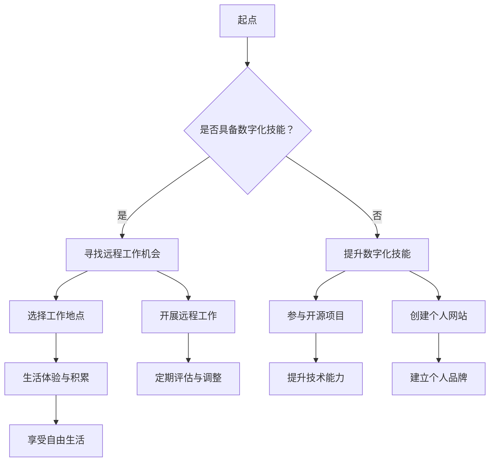

                 

关键字：程序员、财务自由、数字游民、生活方式、远程工作、技术技能、自由职业、远程协作、全球化、经济独立、个人品牌建设、自我管理

> 摘要：本文旨在探讨程序员如何通过数字化技能和自由职业模式实现财务自由，进而追求一种数字游民生活方式。我们将从核心概念、算法原理、数学模型、项目实践、应用场景以及未来展望等多个角度，深入分析这一新兴趋势，为程序员们提供实现财务自由和享受数字游民生活的可行路径。

## 1. 背景介绍

在现代社会，程序员不再仅仅是企业内部的技术人员，他们正逐渐成为全球自由职业市场的主力军。随着互联网技术的迅猛发展，远程工作和数字化技能的重要性日益凸显。程序员利用自己的技术专长，通过提供在线服务、参与开源项目、创建自己的产品等方式，可以实现收入来源的多样化和稳定化。

数字游民，这一群体正日益壮大。他们不受地理位置限制，可以在世界各地工作和生活。这不仅为程序员提供了广阔的职业发展空间，也让他们有机会体验到不同的文化和生活方式。财务自由是数字游民生活的重要基础，而实现财务自由的关键在于技能的提升、市场定位的准确以及持续的个人品牌建设。

## 2. 核心概念与联系

### 数字游民生活方式

数字游民生活方式（Digital Nomad Lifestyle）是一种利用数字化工具和远程协作方式，在全球范围内自由选择工作和生活地点的生活方式。它要求个体具备高度的自律性和适应性，同时需要掌握一系列数字化技能，如编程、项目管理、设计、写作等。

### 自我管理

自我管理是数字游民生活中不可或缺的一部分。它涉及到时间管理、任务优先级排序、情绪调节等方面。有效的自我管理能力可以帮助程序员保持高效率的工作状态，同时也能提高生活的质量。

### 全球化市场

全球化市场为程序员提供了无限的机会。通过互联网，程序员可以接触到全球范围内的客户和项目，这不仅拓宽了职业发展空间，也增加了收入来源。

### 财务自由

财务自由是指个体拥有足够的财务资源，无需为生计而工作，从而可以自由地选择自己想要的生活方式和职业方向。对于程序员而言，实现财务自由通常意味着通过技能提升和市场化运作，建立起稳定的收入流。

### 自我品牌建设

在数字化时代，个人品牌建设变得尤为重要。程序员通过建立个人网站、参与开源项目、发布技术博客、参与在线社区等方式，可以提升个人知名度和影响力，进而吸引更多的工作机会和商业合作。

## 2.1 数字游民生活的 Mermaid 流程图



## 3. 核心算法原理 & 具体操作步骤

### 3.1 算法原理概述

实现财务自由的核心算法是技能提升、市场定位和持续自我品牌建设。具体步骤如下：

1. 技能提升：通过学习新技能、参与实践项目、获取认证等方式，不断提高个人技术能力。
2. 市场定位：明确目标市场，了解客户需求，提供有竞争力的服务。
3. 自我品牌建设：通过个人网站、技术博客、社交媒体等渠道，建立个人品牌，提升知名度。

### 3.2 算法步骤详解

#### 3.2.1 技能提升

1. 学习新技能：通过在线课程、书籍、实践项目等方式，学习新技能。
2. 实践项目：参与实际项目，将所学技能应用于解决实际问题。
3. 获取认证：通过获得专业认证，提升个人市场竞争力。

#### 3.2.2 市场定位

1. 分析目标市场：了解潜在客户的需求和痛点。
2. 提供有竞争力的服务：根据目标市场的需求，提供高质量、高性价比的服务。
3. 持续优化：根据客户反馈和市场变化，不断优化服务。

#### 3.2.3 自我品牌建设

1. 创建个人网站：展示个人技能和项目经验。
2. 技术博客：分享技术心得和解决方案，吸引同行业关注。
3. 社交媒体：参与技术社区讨论，提升个人影响力。

### 3.3 算法优缺点

#### 优点：

1. 高自由度：数字游民可以自由选择工作和生活地点。
2. 高灵活性：可以根据市场需求和个人兴趣调整职业方向。
3. 高收入潜力：通过技能提升和市场定位，可以获得更高的收入。

#### 缺点：

1. 高自律性要求：需要良好的时间管理和情绪调节能力。
2. 稳定性挑战：需要不断适应市场变化，保持竞争力。

### 3.4 算法应用领域

1. 开源项目：通过参与开源项目，提升技能和知名度。
2. 自主创业：创建个人产品或服务，实现财务自由。
3. 远程工作：通过远程工作平台，找到合适的客户和项目。

## 4. 数学模型和公式 & 详细讲解 & 举例说明

### 4.1 数学模型构建

在实现财务自由的过程中，我们可以构建一个简单的数学模型，用于计算收入和支出。

设：

- \( I \) 为每月总收入
- \( O \) 为每月总支出
- \( F \) 为财务自由度

则：

\[ F = \frac{I - O}{O} \]

### 4.2 公式推导过程

财务自由度的计算基于收入和支出的比值。当收入大于支出时，财务自由度大于1，表示可以实现财务自由。当收入小于支出时，财务自由度小于1，表示无法实现财务自由。

### 4.3 案例分析与讲解

假设一位程序员每月收入为8000元，每月支出为5000元，则他的财务自由度为：

\[ F = \frac{8000 - 5000}{5000} = \frac{3000}{5000} = 0.6 \]

这意味着他的财务自由度较低，需要提高收入或降低支出。为了实现更高的财务自由度，他可以考虑以下策略：

1. 提高收入：通过技能提升和市场需求分析，找到更高的收入机会。
2. 降低支出：优化生活方式，减少不必要的开支。

## 5. 项目实践：代码实例和详细解释说明

### 5.1 开发环境搭建

为了演示如何通过数字化技能实现财务自由，我们选择一个实际项目——开发一个简单的个人博客网站。

1. 安装Node.js和npm：在计算机上安装Node.js和npm，以便使用相关开发工具和包管理器。
2. 安装Markdown解析器：使用npm安装Markdown解析器，如`marked`，以便将Markdown文本转换为HTML。

### 5.2 源代码详细实现

以下是个人博客网站的简单示例代码：

```javascript
const marked = require('marked');

// Markdown文本
const markdownText = `
# 我的个人博客

欢迎来到我的个人博客！

## 技术文章

- [JavaScript入门](javascript入门.md)
- [React框架应用](react应用.md)
`;

// 将Markdown文本转换为HTML
const htmlOutput = marked(markdownText);

// 输出HTML
console.log(htmlOutput);
```

### 5.3 代码解读与分析

1. 引入`marked`模块：使用npm安装并引入Markdown解析器`marked`。
2. 定义Markdown文本：`markdownText`变量存储了Markdown格式的文本内容。
3. 转换Markdown为HTML：调用`marked`函数，将Markdown文本转换为HTML。
4. 输出HTML：使用`console.log`输出转换后的HTML内容。

通过这个简单的示例，程序员可以了解如何利用Markdown和Node.js创建个人博客网站，这是实现财务自由和数字游民生活的一个基础步骤。

### 5.4 运行结果展示

在Node.js环境中运行上述代码，会输出以下HTML内容：

```html
<h1>我的个人博客</h1>

<h2>技术文章</h2>

<ul>
  <li><a href="javascript入门.md">JavaScript入门</a></li>
  <li><a href="react应用.md">React框架应用</a></li>
</ul>
```

这个结果展示了如何将Markdown文本转换为HTML格式的文章列表。

## 6. 实际应用场景

### 6.1 自主创业

许多程序员通过创建自己的产品或服务，实现了财务自由。例如，一位程序员可以开发一个在线教育平台，提供编程课程，通过课程销售获得收入。

### 6.2 远程协作

在远程工作环境中，程序员可以通过各种协作工具（如Slack、Trello、Zoom等）与团队成员保持高效沟通。这种方式不仅提高了工作效率，也为程序员提供了更多的就业机会。

### 6.3 开源项目

参与开源项目是提升技能和建立个人品牌的有效途径。通过为开源项目贡献代码，程序员可以吸引同行业人士的关注，并获得更多的合作机会。

### 6.4 数字营销

数字营销是程序员实现财务自由的另一个领域。程序员可以利用自己的编程技能，为企业和个人提供网站开发、SEO优化、社交媒体管理等服务。

## 6.4 未来应用展望

随着数字化技术的不断进步，数字游民生活方式和财务自由的实现方式将更加多样化和高效。未来，我们可以预见以下趋势：

1. **人工智能与自动化**：人工智能技术将进一步提升程序员的工作效率，减少重复性劳动。
2. **区块链技术**：区块链技术将为数字游民提供新的金融工具和交易平台，降低交易成本。
3. **虚拟现实与增强现实**：虚拟现实和增强现实技术的发展将为程序员提供新的创作和交互方式。
4. **全球协同工作**：全球化背景下，跨国团队的协作将更加频繁和高效。

## 7. 工具和资源推荐

### 7.1 学习资源推荐

- **在线课程**：Coursera、Udemy、edX等平台提供了丰富的编程和技术课程。
- **技术博客**：Medium、Hackernoon、Dev.to等平台是程序员分享技术和经验的绝佳资源。
- **开源项目**：GitHub、GitLab等平台提供了大量的开源项目，供程序员学习和参与。

### 7.2 开发工具推荐

- **集成开发环境（IDE）**：Visual Studio Code、IntelliJ IDEA、PyCharm等。
- **代码管理工具**：Git、GitLab、GitHub。
- **协作工具**：Slack、Trello、Zoom。

### 7.3 相关论文推荐

- **数字游民生活方式的研究**：《Digital Nomads: The Rise of the Modern Workforce》
- **远程工作与生产力**：《The Rise of the Remote Worker: Impact on Organizations and Employees》
- **全球协作与团队管理**：《Global Virtual Teams: New Challenges, Opportunities and Strategies》

## 8. 总结：未来发展趋势与挑战

### 8.1 研究成果总结

本文通过对数字游民生活方式、财务自由、技能提升、市场定位、自我管理等多方面的探讨，总结了实现财务自由和数字游民生活的关键因素和策略。

### 8.2 未来发展趋势

随着数字化技术的不断进步，数字游民生活方式和财务自由的实现将更加多样化和高效。人工智能、区块链、虚拟现实等新兴技术将为程序员提供更多的机会和工具。

### 8.3 面临的挑战

尽管数字游民生活方式和财务自由前景广阔，但程序员仍需面对高自律性要求、市场变化快、竞争激烈等挑战。

### 8.4 研究展望

未来的研究可以进一步探讨数字游民生活方式对社会、经济和文化的影响，以及如何更好地支持数字游民群体的可持续发展。

## 9. 附录：常见问题与解答

### 9.1 如何提升数字化技能？

- 参加在线课程和专业培训。
- 参与开源项目，实践所学技能。
- 阅读技术书籍和博客，了解最新趋势。

### 9.2 如何建立个人品牌？

- 创建个人网站和博客，展示技能和成果。
- 撰写高质量的技术文章，分享经验。
- 参与技术社区，提升知名度和影响力。

### 9.3 如何平衡工作和生活？

- 制定合理的工作计划和休息时间。
- 学会时间管理和情绪调节。
- 保持良好的生活习惯和运动。

## 作者署名

作者：禅与计算机程序设计艺术 / Zen and the Art of Computer Programming

