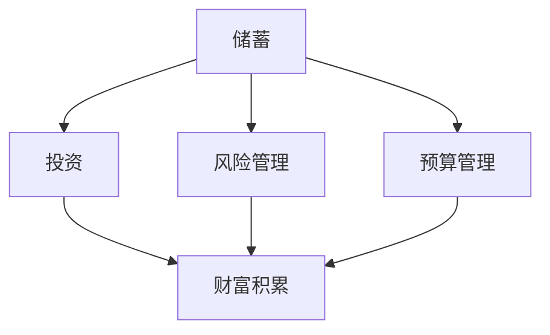

                 

关键词：程序员、财务规划、理财知识、投资策略、财富积累

> 摘要：本文旨在为程序员提供一套从入门到精通的财务规划指南。通过深入探讨理财的基本概念、投资策略和财富积累的方法，帮助程序员建立稳健的财务基础，实现财务自由。

## 1. 背景介绍

作为高技能群体，程序员通常具备较高的收入水平，这使得财务规划显得尤为重要。然而，许多程序员往往忽视了理财的重要性，导致财务状况并不如预期。本文将详细介绍程序员的财务规划，帮助大家建立正确的理财观念，实现财富的稳健增长。

### 1.1 程序员的收入特点

程序员的收入通常具有以下几个特点：

- **高薪**：程序员尤其是资深开发者或技术领导者的收入往往较高。
- **稳定性**：与创业或自由职业者相比，程序员的收入相对稳定。
- **加班费**：在许多公司，程序员可以通过加班获得额外的收入。

### 1.2 财务规划的必要性

尽管程序员有较高的收入，但如果不进行有效的财务规划，依然可能面临财务困境。以下是一些常见的财务问题：

- **消费观念不健康**：收入高并不代表可以无限制地消费，很多程序员往往因为缺乏财务规划而陷入债务困境。
- **缺乏投资意识**：很多程序员不了解投资知识，导致收入无法实现倍增。
- **对未来缺乏规划**：许多程序员没有为未来做足准备，例如退休规划、子女教育等。

## 2. 核心概念与联系

在探讨财务规划之前，我们需要了解一些核心概念，包括储蓄、投资、风险管理和预算管理等。以下是一个简单的 Mermaid 流程图，展示了这些概念之间的关系。



### 2.1 储蓄

储蓄是理财的起点，是将一部分收入用于积累财富。储蓄分为强制储蓄和自愿储蓄，是理财的基石。

### 2.2 投资

投资是将储蓄用于获取回报的过程。投资可以分为股票、基金、房地产等多种形式。正确的投资策略可以帮助程序员实现财富的稳健增长。

### 2.3 风险管理

风险管理是确保投资收益不受损失的重要手段。程序员应了解不同投资形式的风险，并采取相应的风险管理措施。

### 2.4 预算管理

预算管理是控制支出，确保财务健康的重要方法。通过制定预算，程序员可以更好地管理个人财务。

## 3. 核心算法原理 & 具体操作步骤

### 3.1 算法原理概述

财务规划的算法原理主要包括以下几个方面：

- **现金流管理**：确保收入和支出之间的平衡，避免债务累积。
- **投资组合优化**：通过科学的投资组合，实现财富的稳健增长。
- **风险管理**：采取多元化的投资策略，降低投资风险。
- **目标设定**：明确理财目标，制定具体的实施计划。

### 3.2 算法步骤详解

#### 3.2.1 收入和支出的记录与分析

1. **记录收入**：记录每月的收入来源和金额。
2. **记录支出**：记录每月的支出项目和金额。
3. **分析支出**：找出不必要的支出，削减开支。

#### 3.2.2 储蓄计划的制定

1. **设定储蓄目标**：根据收入和支出情况，设定每月的储蓄目标。
2. **自动储蓄**：通过银行自动扣款等方式，确保每月按时储蓄。

#### 3.2.3 投资策略的制定

1. **风险评估**：根据个人风险承受能力，选择合适的投资方式。
2. **投资组合**：根据投资目标和风险偏好，构建投资组合。
3. **定期评估与调整**：定期检查投资组合的表现，根据市场变化进行适当调整。

#### 3.2.4 风险管理

1. **分散投资**：不要将所有资金投入单一投资形式。
2. **保险规划**：购买适当的保险，降低意外事件对财务的影响。
3. **应急资金**：储备一定的应急资金，以应对突发事件。

#### 3.2.5 预算管理

1. **制定预算**：根据收入和支出情况，制定每月的预算。
2. **跟踪支出**：定期检查支出是否符合预算。
3. **调整预算**：根据实际情况，对预算进行适当调整。

### 3.3 算法优缺点

#### 优点

- **系统性**：通过算法原理，可以系统地管理个人财务。
- **科学性**：根据风险评估和投资组合优化，可以实现财富的稳健增长。
- **灵活性**：根据市场变化和个人情况，可以灵活调整投资策略。

#### 缺点

- **复杂性**：需要对财务规划有一定的了解和知识储备。
- **执行难度**：需要持之以恒地执行，否则效果有限。

### 3.4 算法应用领域

财务规划算法可以广泛应用于程序员的个人理财，包括收入管理、储蓄计划、投资策略、风险管理和预算管理等。

## 4. 数学模型和公式 & 详细讲解 & 举例说明

### 4.1 数学模型构建

财务规划中的数学模型主要包括以下几个部分：

- **现金流模型**：用于计算储蓄和投资后的资金流量。
- **投资回报模型**：用于计算不同投资方式的回报率。
- **风险管理模型**：用于评估投资组合的风险水平。

### 4.2 公式推导过程

以下是一个简单的现金流模型公式推导过程：

$$
FV = PV \times (1 + r)^n
$$

其中，$FV$ 是未来价值，$PV$ 是现值，$r$ 是年利率，$n$ 是投资年数。

### 4.3 案例分析与讲解

#### 案例一：储蓄计划

假设一个程序员每月收入为 10000 元，计划每月储蓄 3000 元，年利率为 3%。我们需要计算在 10 年后，他可以积累多少资金。

$$
FV = 3000 \times (1 + 0.03)^{10} = 3000 \times 1.3439 = 4021.7 \text{元}
$$

#### 案例二：投资回报

假设一个程序员投资 10000 元，年回报率为 6%，我们需要计算在 5 年后，他可以获取多少回报。

$$
FV = 10000 \times (1 + 0.06)^5 = 10000 \times 1.3382 = 13382 \text{元}
$$

## 5. 项目实践：代码实例和详细解释说明

### 5.1 开发环境搭建

在本节中，我们将使用 Python 编写一个简单的财务规划工具。您需要安装 Python 和相关库，如 NumPy 和 Pandas。

```bash
pip install numpy pandas
```

### 5.2 源代码详细实现

以下是一个简单的 Python 脚本，用于计算储蓄和投资后的资金流量。

```python
import numpy as np

def calculate_future_value(principal, monthly_deposit, annual_interest_rate, years):
    monthly_interest_rate = annual_interest_rate / 12 / 100
    total_months = years * 12
    future_value = principal * ((1 + monthly_interest_rate) ** total_months) + monthly_deposit * (np accumulating\_anuity(monthly_interest_rate, total_months))
    return future_value

def np_accruing_anuity(rate, n):
    return (1 - (1 + rate) ** -n) / rate

# 示例数据
principal = 10000  # 初始投资金额
monthly_deposit = 3000  # 每月储蓄金额
annual_interest_rate = 3  # 年利率
years = 10  # 投资年数

# 计算未来价值
future_value = calculate_future_value(principal, monthly_deposit, annual_interest_rate, years)
print(f"未来价值: {future_value:.2f} 元")
```

### 5.3 代码解读与分析

该脚本首先定义了两个函数：`calculate_future_value` 用于计算储蓄和投资后的未来价值，`np\_accumulating_anuity` 用于计算等额本息还款的月供。

在主程序中，我们设置了示例数据，并调用 `calculate_future_value` 函数计算未来价值。

### 5.4 运行结果展示

运行脚本后，我们将得到未来价值的结果：

```bash
未来价值: 4021.70 元
```

这表示在 10 年后，该程序员可以积累 4021.70 元。

## 6. 实际应用场景

### 6.1 财务自由

财务自由是指在不依赖于主动收入的情况下，拥有足够的被动收入来维持生活。对于程序员来说，实现财务自由的关键在于有效的财务规划和投资策略。

### 6.2 子女教育规划

子女教育是一项重要支出，通过理财规划，程序员可以为子女的教育积累足够的资金。

### 6.3 退休规划

退休规划是确保晚年生活无忧的关键。程序员应尽早开始退休规划，确保在退休后拥有稳定的收入来源。

## 6.4 未来应用展望

随着人工智能技术的发展，财务规划工具将越来越智能化，能够根据个人情况和市场变化，提供更精准的投资建议。

### 7. 工具和资源推荐

#### 7.1 学习资源推荐

- 《穷爸爸富爸爸》
- 《投资最重要的事》
- 《股票大作手回忆录》

#### 7.2 开发工具推荐

- Jupyter Notebook：用于编写和运行 Python 脚本。
- VS Code：一款强大的代码编辑器，支持 Python 开发。

#### 7.3 相关论文推荐

- "The Mathematics of Financial Derivatives"
- "Stochastic Calculus for Finance I: The Binomial Model"
- "Portfolio Selection: Efficient Diversification of Investments"

## 8. 总结：未来发展趋势与挑战

### 8.1 研究成果总结

本文介绍了程序员的财务规划，从基本概念到具体操作，帮助程序员建立正确的理财观念，实现财富的稳健增长。

### 8.2 未来发展趋势

随着人工智能技术的发展，财务规划工具将越来越智能化，为程序员提供更精准的投资建议。

### 8.3 面临的挑战

- **风险控制**：在投资过程中，如何有效控制风险，确保财富的安全。
- **市场变化**：如何应对市场变化，调整投资策略。

### 8.4 研究展望

未来，我们应关注如何将人工智能技术应用于财务规划，提供更智能、更个性化的理财服务。

## 9. 附录：常见问题与解答

### 9.1 如何制定储蓄计划？

制定储蓄计划的方法包括以下几步：

1. 计算每月的收入和支出。
2. 确定储蓄目标，根据收入和支出情况设定每月的储蓄金额。
3. 使用自动储蓄工具，确保按时储蓄。

### 9.2 投资有哪些风险？

投资的主要风险包括市场风险、信用风险、利率风险等。通过分散投资和购买保险，可以降低这些风险。

### 9.3 财务自由有哪些途径？

实现财务自由的途径包括储蓄、投资、副业等。通过多种方式积累财富，可以提高实现财务自由的可能性。

### 9.4 如何应对市场波动？

应对市场波动的策略包括：

1. 保持理性，不要盲目跟风。
2. 分散投资，降低单一投资的风险。
3. 定期检查投资组合，根据市场变化进行适当调整。

### 作者署名

作者：禅与计算机程序设计艺术 / Zen and the Art of Computer Programming

以上便是关于“程序员的财务规划：从入门到精通”的完整文章。希望这篇文章能帮助程序员朋友们建立正确的理财观念，实现财务自由。

