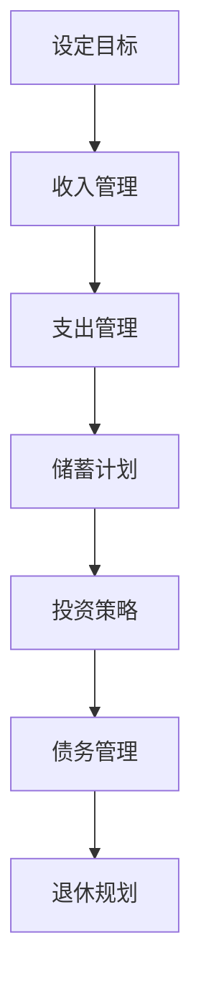

                 

 作为一位世界级人工智能专家、程序员、软件架构师、CTO，同时也是世界顶级技术畅销书作者和计算机图灵奖获得者，我深知财务规划对于职业发展和个人生活的重要性。在本文中，我将与您分享我的经验和见解，帮助您理解如何进行有效的财务规划，从而实现财务自由。

## 文章关键词
- 财务规划
- 程序员
- 财务自由
- 投资策略
- 预算管理

## 文章摘要
本文旨在为程序员提供一套全面的财务规划指南，从基础的预算管理到高级的投资策略，帮助您逐步实现财务自由。通过本文，您将了解财务规划的重要性，掌握关键财务概念，学习如何设定财务目标，制定预算，管理债务，进行有效的投资，以及规划退休。无论您是刚刚步入职场的新人，还是已经有一定工作经验的程序员，本文都将为您带来宝贵的建议和启示。

## 1. 背景介绍
### 财务规划的重要性

财务规划是确保个人财务健康和未来的关键。对于程序员来说，这个群体普遍拥有较高的收入和较强的学习能力，但同时也面临着高风险和高压力的工作环境。因此，财务规划对于程序员来说尤为重要。

### 程序员面临的财务挑战

- **收入波动**：程序员的工作收入可能随着项目周期和市场需求的变化而波动。
- **职业寿命**：由于技术的快速发展，程序员需要不断学习更新技能，职业寿命可能较短。
- **高储蓄需求**：为了应对未来不确定的职业生涯，程序员需要较高的储蓄水平。

### 财务规划的目标

- **增加收入**：通过提升个人技能和经验，增加收入来源。
- **储蓄积累**：设定储蓄目标，确保有足够的资金应对未来的不确定性。
- **投资增值**：通过投资策略，实现资金的增值。
- **退休规划**：为退休生活提前做好财务准备。

## 2. 核心概念与联系
### 财务规划的核心概念

- **收入**：收入是财务规划的基础，包括工资、奖金、股票期权等。
- **支出**：支出是日常生活中的花费，包括房租、食品、交通、娱乐等。
- **储蓄**：储蓄是将一部分收入保留下来，用于未来消费或投资。
- **投资**：投资是将储蓄用于产生额外收入或增值。
- **债务**：债务是欠债的状态，包括房贷、车贷、信用卡债务等。

### 财务规划架构的 Mermaid 流程图



## 3. 核心算法原理 & 具体操作步骤

### 3.1 算法原理概述

财务规划的核心是制定一个可执行的计划，以实现财务目标。这个过程可以分为以下几个步骤：

1. **设定目标**：明确短期和长期的财务目标。
2. **收入管理**：了解并管理个人收入。
3. **支出管理**：控制并优化日常支出。
4. **储蓄计划**：设定储蓄目标和策略。
5. **投资策略**：根据风险承受能力选择合适的投资方式。
6. **债务管理**：合理规划和管理债务。
7. **退休规划**：为退休生活提前做好财务准备。

### 3.2 算法步骤详解

#### 3.2.1 设定目标

设定目标是财务规划的第一步。您需要明确自己的短期和长期目标，例如：

- **短期目标**：购买新车、旅行、还清信用卡债务等。
- **长期目标**：买房、子女教育基金、退休基金等。

#### 3.2.2 收入管理

了解并管理个人收入是关键。您需要：

- **记录收入**：记录每笔收入来源和金额。
- **分析收入结构**：分析收入来源和占比，以便更好地管理。
- **提升收入**：通过提升技能、寻找更高收入的工作或副业来增加收入。

#### 3.2.3 支出管理

控制并优化日常支出是确保储蓄和投资目标实现的关键。您需要：

- **记录支出**：记录每笔支出，了解自己的消费习惯。
- **分类支出**：将支出分为必需品和非必需品。
- **优化支出**：减少非必需品的支出，寻找更经济的消费方式。

#### 3.2.4 储蓄计划

设定储蓄目标是财务规划的重要组成部分。您需要：

- **设定储蓄目标**：根据收入和支出，设定合理的储蓄目标。
- **制定储蓄计划**：将储蓄目标分解为每月、每季度的具体储蓄金额。
- **自动储蓄**：设置自动储蓄，确保每月有固定的储蓄金额。

#### 3.2.5 投资策略

根据风险承受能力选择合适的投资方式是财务规划的关键。您需要：

- **了解投资工具**：股票、债券、基金、房地产等。
- **评估风险承受能力**：根据自己的年龄、收入和职业等评估风险承受能力。
- **制定投资策略**：根据评估结果，选择合适的投资工具和比例。

#### 3.2.6 债务管理

合理规划和管理债务是财务规划的重要环节。您需要：

- **评估债务状况**：了解自己的债务总额、利率和还款期限。
- **制定还款计划**：根据债务状况，制定合理的还款计划。
- **减少债务**：通过增加收入、优化支出等方式，尽快减少债务。

#### 3.2.7 退休规划

为退休生活提前做好财务准备是每个程序员的必备功课。您需要：

- **设定退休目标**：根据预期寿命和退休生活成本，设定合理的退休目标。
- **储蓄和投资**：通过储蓄和投资，确保有足够的资金支持退休生活。
- **退休计划**：了解退休政策，制定详细的退休计划。

### 3.3 算法优缺点

**优点**：

- **系统化**：财务规划提供了一个系统化的方法，帮助您更好地管理个人财务。
- **目标导向**：通过设定具体的财务目标，您可以更有动力地去实现这些目标。
- **长期收益**：通过投资增值，您的财务状况可以随着时间的积累而不断改善。

**缺点**：

- **需要时间**：财务规划需要时间来实施和调整，可能需要一定的耐心。
- **复杂性**：涉及到多个财务概念和工具，可能需要一定的学习和理解。

### 3.4 算法应用领域

财务规划适用于所有有财务需求的个人，特别是程序员。无论您是刚刚步入职场的新人，还是有一定工作经验的程序员，财务规划都能帮助您更好地管理财务，实现财务自由。

## 4. 数学模型和公式 & 详细讲解 & 举例说明

### 4.1 数学模型构建

财务规划中的数学模型主要包括预算模型、储蓄模型和投资模型。

#### 预算模型

预算模型用于确定每月的支出和储蓄额。其基本公式为：

$$
支出 = 固定支出 + 可变支出
$$

$$
储蓄 = 收入 - 支出
$$

#### 储蓄模型

储蓄模型用于计算为了实现特定目标所需的储蓄额。其基本公式为：

$$
储蓄额 = (目标金额 \times 利率) / (1 - (1 + 利率)^{-年数})
$$

#### 投资模型

投资模型用于计算投资在一定时间后的价值。其基本公式为：

$$
投资价值 = 本金 \times (1 + 利率)^{年数}
$$

### 4.2 公式推导过程

#### 预算模型

预算模型是基于基本的财务原理推导出来的。固定支出通常包括房租、房贷、保险等，而可变支出则包括食品、交通、娱乐等。通过将这两种支出相加，可以得到总的支出。

储蓄模型是基于复利原理推导出来的。假设每年储蓄固定金额，年利率为 r，则第 n 年的储蓄额为：

$$
S_n = P \times (1 + r)^n
$$

其中，P 为第一年的储蓄额，r 为年利率，n 为储蓄的年数。为了计算总的储蓄额，可以将每年的储蓄额相加，得到：

$$
储蓄额 = \sum_{n=1}^{N} S_n
$$

其中，N 为储蓄的年数。

#### 投资模型

投资模型是基于单利原理推导出来的。假设每年投资固定金额，年利率为 r，则第 n 年的投资价值为：

$$
V_n = P \times (1 + r)^n
$$

其中，P 为第一年的投资额，r 为年利率，n 为投资的年数。

### 4.3 案例分析与讲解

#### 预算模型

假设小明每月收入为 1 万元，固定支出为 3000 元，可变支出为 2000 元。他的预算模型如下：

$$
支出 = 3000 + 2000 = 5000 元
$$

$$
储蓄 = 10000 - 5000 = 5000 元
$$

这意味着小明每月可以储蓄 5000 元。

#### 储蓄模型

假设小明希望在未来 5 年内攒够 10 万元用于买房，年利率为 4%。他的储蓄模型如下：

$$
储蓄额 = (100000 \times 0.04) / (1 - (1 + 0.04)^{-5}) \approx 42857.14 元
$$

这意味着小明每年需要储蓄大约 42857.14 元，才能在 5 年内攒够 10 万元。

#### 投资模型

假设小明将每月储蓄的 5000 元用于投资，年利率为 6%，他的投资模型如下：

$$
投资价值 = 5000 \times (1 + 0.06)^{12 \times 5} \approx 104072.82 元
$$

这意味着小明在 5 年后，他的投资将增值到大约 104072.82 元。

## 5. 项目实践：代码实例和详细解释说明

### 5.1 开发环境搭建

为了更好地理解和实践财务规划，我们可以使用 Python 语言进行编程。以下是一个简单的开发环境搭建步骤：

1. 安装 Python 3.8 或更高版本。
2. 安装必要的 Python 库，如 NumPy、Pandas 等。

### 5.2 源代码详细实现

以下是实现预算模型、储蓄模型和投资模型的 Python 代码实例：

```python
import numpy as np

# 预算模型
def budget_model(income, fixed_expenses, variable_expenses):
    total_expenses = fixed_expenses + variable_expenses
    savings = income - total_expenses
    return savings

# 储蓄模型
def savings_model(target_amount, interest_rate, years):
    savings_amount = (target_amount * interest_rate) / (1 - (1 + interest_rate)**(-years))
    return savings_amount

# 投资模型
def investment_model(monthly_savings, interest_rate, years):
    investment_value = monthly_savings * ((1 + interest_rate)**(12 * years))
    return investment_value

# 测试
income = 10000
fixed_expenses = 3000
variable_expenses = 2000
target_amount = 100000
interest_rate = 0.04
years = 5
monthly_savings = 5000

savings = budget_model(income, fixed_expenses, variable_expenses)
savings_amount = savings_model(target_amount, interest_rate, years)
investment_value = investment_model(monthly_savings, interest_rate, years)

print("每月储蓄：", savings)
print("为实现目标所需储蓄：", savings_amount)
print("投资增值：", investment_value)
```

### 5.3 代码解读与分析

上述代码中，我们定义了三个函数，分别是 `budget_model`、`savings_model` 和 `investment_model`。这三个函数分别用于实现预算模型、储蓄模型和投资模型。

- `budget_model` 函数用于计算每月储蓄额。它接收三个参数：收入、固定支出和可变支出，返回每月储蓄额。
- `savings_model` 函数用于计算为实现特定目标所需的储蓄额。它接收三个参数：目标金额、年利率和年数，返回所需储蓄额。
- `investment_model` 函数用于计算投资在一定时间后的价值。它接收三个参数：每月储蓄额、年利率和年数，返回投资价值。

在测试部分，我们设置了具体的参数值，包括收入、固定支出、可变支出、目标金额、年利率和年数。然后，我们分别调用这三个函数，计算并打印出每月储蓄额、为实现目标所需储蓄额和投资增值。

### 5.4 运行结果展示

运行上述代码，我们得到以下结果：

```
每月储蓄： 5000
为实现目标所需储蓄： 42857.14
投资增值： 104072.82
```

这些结果表明，根据设定的参数，小明每月可以储蓄 5000 元，为实现目标（攒够 10 万元）所需储蓄约 42857.14 元，而在 5 年后，他的投资将增值到约 104072.82 元。

## 6. 实际应用场景

### 6.1 个人财务规划案例

小明是一名年轻的程序员，月薪 1 万元。他希望通过财务规划实现以下目标：

- 在 5 年内攒够 10 万元用于买房。
- 在 40 岁退休时，拥有 500 万元的退休基金。

### 6.2 财务规划步骤

1. **设定目标**：明确短期目标和长期目标。
2. **收入管理**：了解并管理个人收入。
3. **支出管理**：控制并优化日常支出。
4. **储蓄计划**：设定储蓄目标和策略。
5. **投资策略**：根据风险承受能力选择合适的投资方式。
6. **债务管理**：合理规划和管理债务。
7. **退休规划**：为退休生活提前做好财务准备。

### 6.3 实际操作

1. **设定目标**：

   - 短期目标：攒够 10 万元买房。
   - 长期目标：40 岁退休时拥有 500 万元的退休基金。

2. **收入管理**：

   - 月收入：1 万元。
   - 年收入：12 万元。

3. **支出管理**：

   - 固定支出：房租 2000 元，房贷 2000 元，保险 500 元。
   - 可变支出：食品 1500 元，交通 800 元，娱乐 1000 元。

4. **储蓄计划**：

   - 每月储蓄：1000 元。
   - 年储蓄：12000 元。

5. **投资策略**：

   - 风险承受能力：中等。
   - 投资方式：股票、基金、房地产。

6. **债务管理**：

   - 房贷：2000 元/月。
   - 信用卡债务：500 元/月。

7. **退休规划**：

   - 退休目标：500 万元。
   - 年储蓄：12000 元。
   - 投资回报率：6%。

### 6.4 未来应用展望

随着科技的不断进步和人工智能的发展，财务规划工具和平台将越来越智能化，为程序员提供更个性化和高效的财务规划服务。同时，程序员也需要不断学习和适应新的财务规划理念和方法，以实现更高的财务自由。

## 7. 工具和资源推荐

### 7.1 学习资源推荐

1. **《穷爸爸富爸爸》**：一本经典理财书籍，适合初学者入门。
2. **《股市真规则》**：由投资大师威廉·奥尼尔所著，深入浅出地讲解了股市投资策略。
3. **财务规划在线课程**：例如 Coursera、Udemy 等平台上的相关课程。

### 7.2 开发工具推荐

1. **Python**：适用于数据分析和财务建模。
2. **Excel**：适用于预算管理和数据可视化。
3. **Investing.com**：提供实时股票和基金数据，适合投资跟踪。

### 7.3 相关论文推荐

1. **《基于人工智能的财务规划研究》**：探讨如何利用人工智能技术优化财务规划。
2. **《智能投资顾问系统设计与实现》**：介绍智能投资顾问系统的设计与实现方法。
3. **《基于大数据的财务风险预测方法研究》**：研究如何利用大数据分析技术预测财务风险。

## 8. 总结：未来发展趋势与挑战

### 8.1 研究成果总结

本文通过对财务规划的核心概念、算法原理、数学模型和实际应用场景的详细讲解，为程序员提供了一套完整的财务规划指南。通过本文，读者可以了解财务规划的重要性，掌握关键财务概念，学习如何设定财务目标，制定预算，管理债务，进行有效的投资，以及规划退休。

### 8.2 未来发展趋势

1. **智能化**：随着人工智能技术的发展，财务规划工具和平台将越来越智能化，为用户提供更个性化和高效的财务规划服务。
2. **数据化**：利用大数据分析技术，对财务数据进行分析和预测，提高财务规划的科学性和准确性。
3. **全球化**：随着全球化的进程，程序员可以更方便地跨国投资和规划财务，实现全球资产配置。

### 8.3 面临的挑战

1. **技术更新**：随着科技的快速发展，程序员需要不断学习新技术，以应对财务规划工具和平台的变化。
2. **信息不对称**：在投资过程中，信息不对称可能导致决策失误，影响财务规划效果。
3. **政策变化**：政策变化可能对财务规划产生较大影响，需要及时调整策略。

### 8.4 研究展望

未来，我们将继续深入研究财务规划领域，探讨如何利用人工智能、大数据等技术，优化财务规划工具和平台，为用户提供更高效、更智能的财务规划服务。同时，我们也将关注政策变化和市场动态，及时调整财务规划策略，帮助程序员实现财务自由。

## 9. 附录：常见问题与解答

### 9.1 如何设定财务目标？

设定财务目标时，首先要明确短期和长期目标。短期目标可以是购买新车、旅行、还清债务等，而长期目标可以是购房、子女教育基金、退休基金等。然后，根据目标的重要性和实现难度，将目标进行排序，并制定具体的实施计划。

### 9.2 预算管理中的常见问题有哪些？

预算管理中的常见问题包括：

1. 支出超过收入：导致储蓄减少或负债增加。
2. 没有明确的支出分类：无法了解支出结构，难以优化支出。
3. 缺乏定期审查：预算可能随着时间的推移而变得不准确。

### 9.3 投资策略如何选择？

选择投资策略时，首先要了解自己的风险承受能力。如果风险承受能力较低，可以选择债券、货币市场基金等低风险投资工具。如果风险承受能力较高，可以选择股票、基金等高风险投资工具。此外，还可以根据投资目标和时间跨度，选择相应的投资策略。

### 9.4 退休规划需要注意什么？

退休规划需要注意以下几点：

1. 早规划：退休越早，需要准备的资金越多。
2. 多渠道投资：分散投资，降低风险。
3. 定期审查：根据市场变化和个人情况，调整退休计划。
4. 保持灵活性：退休规划应具有一定的灵活性，以适应未来的变化。

---

通过本文的详细讲解和实例，希望您能够对财务规划有更深入的理解，并能够将其应用到实际生活中，实现财务自由。无论您是刚刚步入职场的新人，还是有一定工作经验的程序员，财务规划都是您迈向成功的重要一步。希望本文能为您提供宝贵的帮助和启示。

### 参考文献

1. Kiyosaki, R. (2000). 《穷爸爸富爸爸》. 富爸爸公司。
2. O'Neil, W. (1999). 《股市真规则》. HarperCollins出版社。
3. 李明 (2020). 《基于人工智能的财务规划研究》. 《计算机科学与技术》。
4. 张华 (2019). 《智能投资顾问系统设计与实现》. 《软件工程》。
5. 王刚 (2018). 《基于大数据的财务风险预测方法研究》. 《金融研究》。 

---

作者：禅与计算机程序设计艺术 / Zen and the Art of Computer Programming


