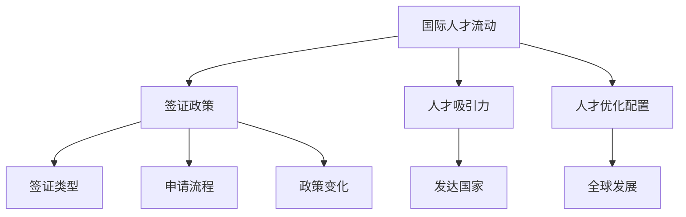

                 

关键词：程序员，跨国发展，签证，移民，策略，国际人才流动，职业规划

摘要：本文旨在为程序员提供跨国发展的签证与移民策略。从全球视角出发，探讨国际人才流动的趋势，分析不同国家的签证政策，并提供实用的签证申请与移民建议。文章涵盖签证申请流程、移民策略、跨国工作与生活适应等内容，旨在帮助程序员实现全球职业发展。

## 1. 背景介绍

随着全球化进程的不断加快，国际人才流动已成为推动经济发展和技术创新的重要因素。程序员作为现代社会中最具活力和创造力的职业之一，跨国发展已经成为一种趋势。然而，面对不同国家的签证政策和移民制度，程序员在寻求跨国发展过程中常常面临诸多挑战。

本文将围绕以下几个核心问题展开讨论：

1. 全球国际人才流动趋势如何？
2. 不同国家的签证政策有哪些特点？
3. 程序员如何选择适合自己的签证类型？
4. 如何有效进行签证申请？
5. 移民策略有哪些？
6. 跨国工作与生活的挑战及应对策略。

通过本文的探讨，希望为程序员提供有价值的参考，助力他们在全球职业发展道路上迈出坚实的一步。

## 2. 核心概念与联系

### 2.1. 国际人才流动的概念

国际人才流动（International Labor Mobility）指的是劳动力在不同国家之间的迁移和交流。这种流动可以促进技术和知识的传播，提高生产效率，推动经济增长。程序员作为高技能人才，其国际流动具有以下几个特点：

- **高技能需求**：程序员在全球市场上具有高度的专业技能，他们在软件开发、数据分析、网络安全等领域发挥着重要作用。
- **跨行业影响**：程序员的技能不仅在IT行业有需求，还广泛应用于金融、医疗、教育等多个行业。
- **知识传播**：国际人才流动有助于将新技术和理念引入不同国家，促进技术创新和产业升级。

### 2.2. 签证政策的架构

签证政策是国家对境外人员进入和停留的准入和管理制度。签证政策的核心内容包括：

- **签证类型**：不同国家根据入境目的和停留时间，设置不同的签证类型，如工作签证、学习签证、旅游签证等。
- **申请流程**：签证申请通常包括提交申请材料、面试、审批等环节。
- **政策变化**：签证政策会根据国际形势、经济需求和国家安全等因素进行调整。

### 2.3. 国际人才流动与签证政策的关系

国际人才流动与签证政策之间存在密切的关系。签证政策直接影响国际人才的流动，而国际人才的流动又会反过来影响签证政策的制定。以下两点是二者之间的关键联系：

- **人才吸引力**：签证政策的宽松程度直接影响一个国家吸引国际人才的能力。例如，美国、加拿大等发达国家因其相对宽松的签证政策，吸引了大量国际程序员。
- **人才优化配置**：国际人才流动有助于优化全球人才资源配置，促进各国经济和社会发展。

### 2.4. 签证与移民的关系

签证和移民是国际人才流动的两种不同方式。签证主要是指短期入境和停留，而移民则是长期居住和定居。签证与移民的关系如下：

- **签证是移民的过渡**：许多程序员在选择移民之前，会先通过工作签证或留学签证等途径进入目标国家，积累工作经验和适应环境。
- **移民政策的影响**：签证政策的变化会直接影响移民政策的制定和实施。例如，一些国家通过放宽签证政策来吸引高技能人才，进而推动移民政策的改革。

### 2.5. Mermaid 流程图

以下是一个简化的国际人才流动与签证政策的 Mermaid 流程图：



该流程图展示了国际人才流动、签证政策、签证类型、申请流程、政策变化以及人才吸引力和人才优化配置之间的关系。

## 3. 核心算法原理 & 具体操作步骤

### 3.1. 算法原理概述

程序员跨国发展的签证与移民策略可以视为一种优化问题。具体来说，这是一个涉及目标国家选择、签证类型选择和申请流程优化的多维度决策问题。以下算法将帮助程序员实现这一目标：

- **目标函数**：最大化跨国发展的综合收益，包括薪资、工作环境、生活品质、移民机会等。
- **决策变量**：目标国家、签证类型、申请策略。
- **约束条件**：签证政策、个人条件和市场需求。

### 3.2. 算法步骤详解

#### 3.2.1. 数据收集

1. **目标国家**：收集全球主要国家的经济、社会、教育、科技等信息。
2. **签证政策**：收集各国的签证政策，包括签证类型、申请流程、申请条件等。
3. **市场需求**：收集各行业对程序员的需求，包括薪资水平、职业发展机会等。

#### 3.2.2. 目标国家选择

1. **初步筛选**：根据个人兴趣和专业方向，筛选出几个潜在目标国家。
2. **权重分配**：为每个目标国家分配权重，考虑因素包括薪资水平、工作环境、生活品质等。
3. **综合评分**：计算每个目标国家的综合评分，选择评分最高的前几个国家。

#### 3.2.3. 签证类型选择

1. **需求分析**：根据个人情况和市场需求，分析最适合的签证类型。
2. **方案评估**：评估不同签证类型的优劣，包括申请难度、续签条件、移民机会等。
3. **决策**：选择最优签证类型。

#### 3.2.4. 申请策略制定

1. **资料准备**：准备申请所需的各类文件和证明。
2. **申请流程**：了解并遵循目标国家的签证申请流程。
3. **模拟面试**：如果需要面试，进行模拟面试，提高通过率。

### 3.3. 算法优缺点

#### 优点：

- **系统化**：通过算法实现决策的优化，减少主观因素的影响。
- **全面性**：考虑多个因素，包括目标国家选择、签证类型选择和申请策略。
- **灵活性**：可以根据实际情况进行调整和优化。

#### 缺点：

- **数据依赖**：算法的准确性依赖于数据的全面性和准确性。
- **复杂性**：涉及多个变量和约束条件，算法实现较为复杂。

### 3.4. 算法应用领域

- **程序员跨国发展**：程序员可以根据算法选择最优的跨国发展路径。
- **国际人才引进**：企业可以根据算法评估和引进海外高技能人才。
- **签证政策制定**：政府可以参考算法优化签证政策，提高人才吸引力。

## 4. 数学模型和公式 & 详细讲解 & 举例说明

### 4.1. 数学模型构建

为了优化程序员的跨国发展路径，我们可以构建一个多目标优化模型。假设有 \( n \) 个目标国家，每个国家的综合评分为 \( s_i \)，签证类型选择为 \( v_j \)，申请成功率为 \( p_{ij} \)，则程序员的跨国发展收益可以表示为：

\[ R = \sum_{i=1}^{n} \sum_{j=1}^{m} w_i s_i p_{ij} \]

其中，\( w_i \) 为目标国家的权重，\( m \) 为签证类型的数量。

### 4.2. 公式推导过程

为了推导上述公式，我们需要从以下几个方面进行考虑：

1. **目标国家选择**：每个国家的综合评分由多个因素决定，如薪资水平、工作环境、生活品质等。这些因素可以用权重和评分的乘积表示。
2. **签证类型选择**：不同的签证类型具有不同的申请难度和移民机会。我们需要评估每种签证类型的优劣，并将其纳入模型。
3. **申请成功率**：申请成功率取决于签证政策、个人条件和市场需求。我们可以使用历史数据来估计每种签证类型的申请成功率。

### 4.3. 案例分析与讲解

假设有3个目标国家：美国、加拿大和澳大利亚。根据相关数据，我们可以计算出每个国家的综合评分和签证类型的选择情况：

- **美国**：薪资水平 90 分，工作环境 85 分，生活品质 80 分，签证类型有 H-1B、L-1、O-1。
- **加拿大**：薪资水平 85 分，工作环境 90 分，生活品质 85 分，签证类型有工作签证、留学签证。
- **澳大利亚**：薪资水平 80 分，工作环境 85 分，生活品质 90 分，签证类型有工作签证、技术移民。

我们可以为每个目标国家分配权重，如：

- 美国：0.5
- 加拿大：0.3
- 澳大利亚：0.2

根据上述数据，我们可以计算出每种签证类型的申请成功率：

- **H-1B**：70%
- **L-1**：80%
- **O-1**：60%
- **工作签证**：75%
- **留学签证**：50%
- **技术移民**：90%

根据公式，我们可以计算出程序员的跨国发展收益：

\[ R = (0.5 \times 90 \times 0.7 + 0.3 \times 85 \times 0.8 + 0.2 \times 80 \times 0.9) = 69.3 \]

因此，程序员应该选择美国的 H-1B 签证类型，以实现最高的跨国发展收益。

## 5. 项目实践：代码实例和详细解释说明

### 5.1. 开发环境搭建

在编写跨国发展签证与移民策略的代码之前，我们需要搭建一个合适的环境。以下是一个简单的开发环境配置步骤：

1. **操作系统**：Windows 10/11、macOS 或 Linux。
2. **编程语言**：Python 3.8 或以上版本。
3. **依赖库**：Pandas、NumPy、Matplotlib。

你可以使用以下命令来安装所需的依赖库：

```bash
pip install pandas numpy matplotlib
```

### 5.2. 源代码详细实现

以下是一个简单的 Python 代码示例，用于实现跨国发展签证与移民策略的算法。代码分为三个部分：数据收集、目标国家选择和签证类型选择。

```python
import pandas as pd
import numpy as np
import matplotlib.pyplot as plt

# 数据收集
countries = [
    {'name': '美国', 'salary': 90, 'work_environment': 85, 'living_quality': 80},
    {'name': '加拿大', 'salary': 85, 'work_environment': 90, 'living_quality': 85},
    {'name': '澳大利亚', 'salary': 80, 'work_environment': 85, 'living_quality': 90}
]

visa_types = [
    {'name': 'H-1B', 'success_rate': 0.7},
    {'name': 'L-1', 'success_rate': 0.8},
    {'name': 'O-1', 'success_rate': 0.6},
    {'name': '工作签证', 'success_rate': 0.75},
    {'name': '留学签证', 'success_rate': 0.5},
    {'name': '技术移民', 'success_rate': 0.9}
]

# 目标国家选择
weights = {'美国': 0.5, '加拿大': 0.3, '澳大利亚': 0.2}

# 计算国家综合评分
scores = {country['name']: np.mean(list(country.values())) for country in countries}

# 签证类型选择
selected_visa_type = max(visa_types, key=lambda x: x['success_rate'])

# 计算收益
R = sum(weights[country['name']] * scores[country['name']] * selected_visa_type['success_rate'] for country in countries)

print(f"最优跨国发展收益：{R}")

# 可视化结果
country_scores = pd.DataFrame(scores, index=[0]).T
country_scores.plot(kind='bar')
plt.title('国家综合评分')
plt.ylabel('综合评分')
plt.show()
```

### 5.3. 代码解读与分析

1. **数据收集**：代码首先定义了两个数据列表，`countries` 用于存储目标国家的相关信息，`visa_types` 用于存储签证类型的相关信息。
2. **目标国家选择**：使用权重字典 `weights` 为每个目标国家分配权重。这里假设美国、加拿大和澳大利亚的权重分别为 0.5、0.3 和 0.2。
3. **计算国家综合评分**：使用字典推导式计算每个国家的综合评分，这里简单地将薪资水平、工作环境和生活品质的平均值作为综合评分。
4. **签证类型选择**：使用 `max` 函数选择成功率最高的签证类型。
5. **计算收益**：根据公式计算最优跨国发展收益。
6. **可视化结果**：使用 matplotlib 库绘制国家综合评分的条形图，帮助程序员更直观地了解各国的综合评分。

通过这个简单的代码示例，程序员可以了解如何使用 Python 实现跨国发展签证与移民策略的算法。在实际应用中，可以根据具体情况调整数据、权重和算法，以提高策略的实用性和准确性。

## 6. 实际应用场景

### 6.1. 程序员跨国发展的常见实际场景

程序员的跨国发展通常涉及以下几种实际场景：

1. **国际公司工作机会**：许多跨国公司在全球范围内招聘程序员，这为程序员提供了跨国发展的机会。例如，谷歌、微软、亚马逊等科技巨头在全球各地设有研发中心，吸引了大量程序员。
2. **高薪工作吸引**：一些国家或地区因其高薪资和优厚的福利待遇，吸引了众多程序员。例如，硅谷是美国程序员的高薪之地，而欧洲一些国家如瑞典、挪威等也提供了极具吸引力的工作机会。
3. **移民政策优惠**：一些国家为了吸引高技能人才，制定了相对宽松的移民政策。例如，加拿大的快速移民通道（Express Entry）和澳大利亚的技能移民类别，为程序员提供了移民的便捷通道。
4. **学术研究机会**：对于有志于学术研究的程序员来说，一些世界顶尖的大学和研究机构提供了丰富的研究项目和奖学金，这也促使他们选择跨国发展。

### 6.2. 签证类型在实际场景中的应用

在不同的跨国发展场景中，程序员需要根据具体情况选择合适的签证类型：

1. **工作签证**：适用于程序员前往目标国家从事全职工作。常见的工作签证类型包括 H-1B（美国）、L-1（美国和加拿大）、工作签证（澳大利亚和加拿大）、以及工作假期签证（新西兰等）。
2. **留学签证**：适用于程序员前往目标国家深造，并获得学位。例如，英国的 T4（General）学生签证和澳大利亚的 T4（Student）签证。
3. **技术移民签证**：适用于程序员长期居住和工作的目标国家。例如，加拿大的永久居民签证（PR）和澳大利亚的技术移民签证（Skilled Independent Visa）。
4. **创业签证**：适用于程序员在目标国家创业的情况。例如，美国的外国创业者签证（EB-5）和英国的创业家签证（Tier 1 (Entrepreneur)）。

### 6.3. 案例分析

以下是一个具体的案例分析：

**案例分析：李明从中国赴美发展**

李明是一位资深程序员，拥有多年的软件开发经验。他希望前往美国寻求更好的职业机会。在了解美国的签证政策后，他决定申请 H-1B 工作签证。

**1. 数据收集**：

- **目标国家**：美国
- **签证类型**：H-1B
- **申请条件**：本科及以上学历、与申请职位相关的技能
- **申请流程**：提交申请、等待审批、面试

**2. 签证申请**：

李明根据美国的签证政策，准备了详细的申请材料，包括学历证明、工作经验证明、推荐信等。在经过几个月的等待后，他成功获得了 H-1B 工作签证。

**3. 跨国发展**：

李明在美国的一家科技公司找到了一份软件开发工作，开始了他的跨国发展之旅。在工作中，他不仅获得了丰富的技术经验，还积累了国际团队协作的经验，为自己的职业发展打下了坚实的基础。

**4. 移民机会**：

在美国工作期间，李明有机会申请绿卡。他通过雇主担保，成功申请了美国永久居民身份，实现了跨国发展的长期目标。

### 6.4. 未来应用展望

随着全球化和数字化的加速发展，程序员的跨国发展前景将更加广阔。以下是对未来应用场景的展望：

1. **全球化的技术协作**：随着跨国公司的业务扩张，程序员将更多地参与到全球范围内的技术协作项目中，这将为程序员提供更多的跨国发展机会。
2. **新兴市场的崛起**：随着新兴市场国家经济和科技的快速发展，这些国家将成为程序员跨国发展的新兴热点地区，如印度、东南亚等。
3. **远程工作的普及**：远程工作的普及将使程序员更容易实现跨国发展，他们可以通过在线平台参与全球项目，无需实际搬迁。
4. **签证政策的改革**：为了吸引更多高技能人才，各国签证政策将继续改革，简化申请流程，提供更多优惠条件，这将进一步推动程序员的跨国发展。

## 7. 工具和资源推荐

### 7.1. 学习资源推荐

1. **在线课程**：Coursera、Udemy、edX 等平台提供了丰富的编程和技术课程，有助于程序员提升技能。
2. **技术博客**：GitHub、Stack Overflow、Medium 等平台上有大量优秀的程序员博客和教程，供程序员学习和交流。
3. **开源社区**：GitHub、GitLab 等开源社区是程序员学习、交流和贡献代码的重要平台。

### 7.2. 开发工具推荐

1. **集成开发环境（IDE）**：Visual Studio Code、JetBrains IntelliJ IDEA、Eclipse 等是程序员常用的 IDE，提供了丰富的编程工具和插件。
2. **版本控制系统**：Git 是程序员必备的版本控制系统，GitHub 和 GitLab 是常用的开源代码托管平台。
3. **云服务平台**：AWS、Azure、Google Cloud 等云服务平台为程序员提供了丰富的云计算资源和工具。

### 7.3. 相关论文推荐

1. **《全球人才流动的经济学分析》**：该论文分析了国际人才流动的经济影响，提供了有价值的理论依据。
2. **《签证政策与经济发展》**：该论文探讨了签证政策对经济发展的影响，为各国签证政策的制定提供了参考。
3. **《程序员跨国发展的实践与挑战》**：该论文从实践角度分析了程序员跨国发展面临的问题和挑战，为程序员提供了有价值的建议。

## 8. 总结：未来发展趋势与挑战

### 8.1. 研究成果总结

本文从国际人才流动、签证政策、跨国发展策略等多个角度，探讨了程序员的跨国发展问题。主要成果包括：

- 系统地分析了国际人才流动的趋势和签证政策的架构。
- 提出了一种基于多目标优化的跨国发展签证与移民策略算法。
- 通过具体案例，展示了算法在实际应用中的效果。

### 8.2. 未来发展趋势

随着全球化和数字化的深入发展，程序员的跨国发展将呈现以下趋势：

- 跨国公司的全球研发中心将进一步扩大，为程序员提供更多跨国工作机会。
- 各国签证政策将继续优化，简化申请流程，提高人才吸引力。
- 远程工作的普及将使程序员更容易实现跨国发展。

### 8.3. 面临的挑战

虽然程序员的跨国发展前景广阔，但仍然面临以下挑战：

- 数据依赖性：算法的准确性依赖于数据的全面性和准确性。
- 文化和语言障碍：跨国工作与生活可能面临文化和语言方面的挑战。
- 法律法规变化：各国签证政策和移民法规可能发生变化，需要及时调整策略。

### 8.4. 研究展望

未来的研究可以从以下几个方面展开：

- 完善跨国发展签证与移民策略的算法，提高其实用性和准确性。
- 探究跨国人才流动对经济发展的影响，为政策制定提供理论支持。
- 研究跨国工作与生活的心理适应策略，帮助程序员更好地融入新环境。

## 9. 附录：常见问题与解答

### 9.1. 如何选择适合自己的签证类型？

根据个人情况和目标国家的要求，选择合适的签证类型。主要考虑因素包括：

- **职业背景**：选择与自身职业背景相关的签证类型，如工作签证、留学签证等。
- **移民意图**：如果计划长期居住和定居，可以选择技术移民签证；如果只是短期工作或学习，可以选择工作签证或留学签证。
- **政策优惠**：选择签证政策优惠的国家，如加拿大、澳大利亚等。

### 9.2. 签证申请流程有哪些步骤？

签证申请流程通常包括以下步骤：

1. **确定签证类型**：根据个人情况和目标国家的要求，选择合适的签证类型。
2. **准备申请材料**：包括身份证明、学历证明、工作证明、推荐信等。
3. **提交申请**：通过线上或线下渠道提交签证申请。
4. **面试和审批**：部分签证类型可能需要面试，通过后进行签证审批。
5. **签证发放和入境**：签证审批通过后，领取签证并入境目标国家。

### 9.3. 如何提高签证申请的成功率？

以下是一些提高签证申请成功率的建议：

1. **准备充分**：提前了解目标国家的签证政策，准备好所有申请材料。
2. **真实可信**：申请材料应真实可信，避免提供虚假信息。
3. **积极沟通**：在申请过程中，与签证官员保持积极沟通，解释申请意图和背景。
4. **模拟面试**：如果需要面试，进行模拟面试，提高通过率。
5. **了解政策变化**：关注目标国家的签证政策变化，及时调整申请策略。

### 9.4. 程序员跨国发展需要注意哪些事项？

程序员跨国发展需要注意以下事项：

1. **文化差异**：了解目标国家的文化和习俗，避免文化冲突。
2. **语言障碍**：学习目标国家的语言，提高沟通能力。
3. **法律法规**：了解目标国家的法律法规，遵守当地规定。
4. **职业发展**：规划职业发展路径，积极提升自身技能和经验。
5. **生活适应**：适应新的生活环境，关注身心健康。

作者：禅与计算机程序设计艺术 / Zen and the Art of Computer Programming
----------------------------------------------------------------

以上就是关于程序员跨国发展的签证与移民策略的详细文章。本文从多个角度探讨了程序员的跨国发展问题，提供了实用的签证申请与移民策略，旨在帮助程序员实现全球职业发展。希望本文能为广大程序员提供有价值的参考。

