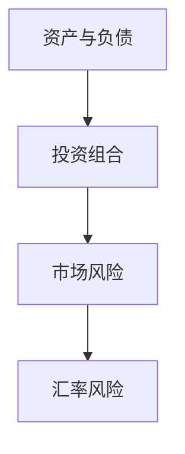

                 

### 1. 背景介绍

随着全球化的深入发展，跨境资产配置逐渐成为投资理财的重要组成部分。对于程序员而言，这一领域更是尤为重要。一方面，程序员通常拥有较高的收入和较强的风险承受能力，另一方面，他们的工作性质使得他们更易于接触到国际市场和技术前沿。因此，如何进行有效的跨境资产配置，成为程序员需要深入思考的问题。

跨境资产配置不仅涉及货币兑换、投资组合构建，还涉及跨国家税收政策、外汇管制、市场风险等多个方面。这不仅要求程序员具备财务知识，还需要他们具备一定的市场分析和风险管理能力。本文将结合程序员的职业特点，探讨跨境资产配置的策略和方法。

### 2. 核心概念与联系

在进行跨境资产配置之前，我们需要了解几个核心概念，包括资产、负债、投资组合、市场风险、汇率风险等。

#### 2.1 资产与负债

资产是个人或企业拥有的具有经济价值的资源，例如现金、股票、债券、房地产等。负债则是个人或企业需要偿还的债务，如信用卡债务、房贷等。了解资产和负债的概念，有助于我们更好地进行资产配置，实现财务健康。

#### 2.2 投资组合

投资组合是由多种不同类型的资产组成的集合，目的是通过分散投资来降低风险。程序员在进行跨境资产配置时，应该根据自己的风险承受能力和投资目标，构建一个合理的投资组合。

#### 2.3 市场风险

市场风险是指由于市场波动导致资产价格下跌的风险。程序员在进行跨境资产配置时，需要关注市场风险，并采取相应的风险管理策略。

#### 2.4 汇率风险

汇率风险是指由于汇率波动导致资产价值变化的风险。程序员在进行跨境投资时，需要特别关注汇率风险，并采取相应的风险管理策略。

#### 2.5 Mermaid 流程图



### 3. 核心算法原理 & 具体操作步骤

#### 3.1 算法原理概述

跨境资产配置的核心算法原理是通过优化投资组合，实现风险与收益的最佳平衡。具体操作步骤如下：

1. 收集和分析投资信息，包括资产种类、预期收益率、风险等级等。
2. 根据投资目标和风险承受能力，确定投资组合的权重分配。
3. 构建投资组合，并进行风险控制。
4. 定期调整投资组合，以应对市场变化。

#### 3.2 算法步骤详解

1. **数据收集与处理**

   收集各类资产的收益率、风险等级、市场波动情况等数据。使用Python等编程语言，对这些数据进行分析和处理，为后续的投资决策提供依据。

   ```python
   # 伪代码：数据收集与处理
   data = collect_data()
   processed_data = process_data(data)
   ```

2. **确定投资目标和风险承受能力**

   根据程序员的个人情况，确定投资目标（如资产增值、风险控制等）和风险承受能力。这有助于后续的投资决策。

   ```python
   # 伪代码：确定投资目标和风险承受能力
   investment_goal = determine_investment_goal()
   risk_tolerance = determine_risk_tolerance()
   ```

3. **构建投资组合**

   根据收集的数据和投资目标，使用数学模型（如马科维茨模型）确定投资组合的权重分配，构建投资组合。

   ```python
   # 伪代码：构建投资组合
   portfolio_weights = optimize_portfolio(processed_data, investment_goal, risk_tolerance)
   investment_portfolio = build_portfolio(processed_data, portfolio_weights)
   ```

4. **风险控制**

   对投资组合进行风险控制，以应对市场波动。可以使用技术指标（如均线、MACD等）进行监控和调整。

   ```python
   # 伪代码：风险控制
   monitor_portfolio(investment_portfolio)
   adjust_portfolio_if_needed(investment_portfolio)
   ```

5. **定期调整**

   定期（如每月、每季度）调整投资组合，以应对市场变化。根据市场情况和投资目标，调整投资组合的权重。

   ```python
   # 伪代码：定期调整
   review_portfolio(investment_portfolio)
   adjust_portfolio_as_needed(investment_portfolio)
   ```

#### 3.3 算法优缺点

- **优点**：通过优化投资组合，实现风险与收益的最佳平衡，有助于实现资产的长期增值。
- **缺点**：需要大量数据支持和数学模型，计算复杂度较高；市场波动较大时，可能需要频繁调整投资组合，带来一定的操作成本。

#### 3.4 算法应用领域

- **跨境投资**：程序

