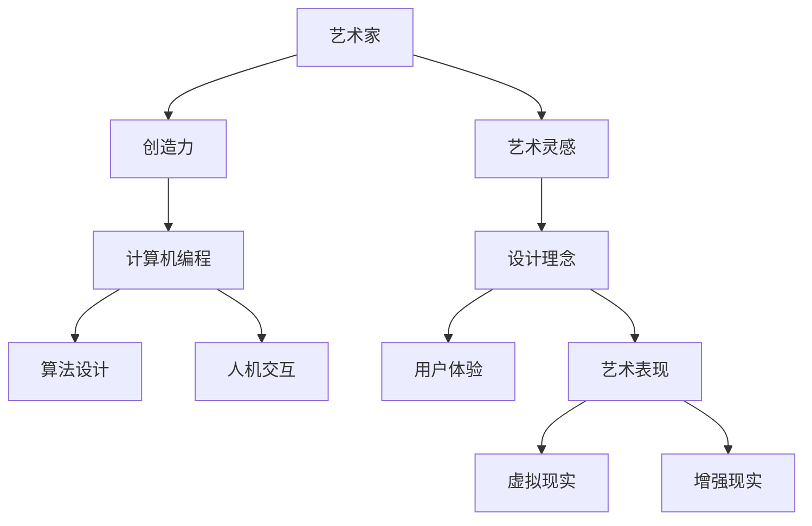

                 

关键词：跨界学习、艺术与技术融合、财富机会、程序员的成长路径

摘要：在数字化时代，程序员的跨界学习已成为提升个人价值的关键。本文探讨了如何将艺术与科技相结合，为程序员开辟全新的财富机会，并提供了详细的实践指导。

## 1. 背景介绍

随着信息技术的迅猛发展，编程已成为现代社会不可或缺的一部分。然而，单纯的技术能力已不足以应对复杂多变的市场需求。程序员需要具备跨学科的知识和技能，才能在激烈的竞争中脱颖而出。艺术，作为人类智慧的结晶，与科技有着天然的契合点。将艺术融入编程，不仅能提升创意思维能力，还能激发创新的灵感，为程序员带来更多的职业发展机会。

### 艺术与科技的交汇

艺术与科技的交汇体现在多个层面。从艺术的视角来看，计算机编程是一种创造性的活动，需要程序员具备敏锐的观察力和丰富的想象力。从科技的角度来看，艺术则为编程提供了丰富的灵感来源和表现形式。例如，计算机图形学、虚拟现实和增强现实等技术，都深受艺术创作的影响。将艺术与科技相结合，不仅能创造出独特的作品，还能推动科技的发展。

### 跨界学习的必要性

跨界学习对于程序员来说至关重要。首先，它有助于拓宽视野，提升综合素质。程序员不仅需要掌握编程语言和工具，还需要了解相关领域的知识，如设计、音乐、绘画等。其次，跨界学习能够激发创新思维，帮助程序员在解决问题的过程中找到新的方法。最后，跨界学习能够为程序员开辟新的职业道路，提升个人价值。

## 2. 核心概念与联系

### 艺术与科技融合的框架

为了更好地理解艺术与科技融合的概念，我们可以通过一个Mermaid流程图来展示其核心联系。



### 核心概念解析

1. **创造力**：创造力是艺术家和程序员共同追求的目标。艺术家通过创造独特的作品来表达自我，程序员则通过编写创新性的代码来实现功能。
2. **算法设计**：算法是计算机科学的核心。艺术家在设计作品时也需要考虑算法，例如在计算机图形学中，算法用于生成复杂的图案和效果。
3. **人机交互**：人机交互是艺术与科技融合的重要领域。程序员需要关注用户体验，运用设计理念来提升交互效果。
4. **设计理念**：设计理念是艺术的核心。程序员在开发过程中需要借鉴艺术的设计理念，以提高产品的美观性和可用性。
5. **用户体验**：用户体验是产品成功的关键。艺术家在设计作品时也需要考虑用户体验，以确保观众能够顺利地理解和欣赏作品。
6. **艺术表现**：艺术表现是艺术家的核心竞争力。程序员可以通过学习艺术表现手法，提升编程作品的视觉效果。
7. **虚拟现实**：虚拟现实是一种新兴技术，它为艺术家和程序员提供了广阔的创作空间。艺术家可以通过虚拟现实技术创作沉浸式的艺术作品，程序员则可以开发虚拟现实应用程序。
8. **增强现实**：增强现实技术将虚拟信息与现实世界相结合，为艺术家和程序员提供了新的创作方式和应用场景。

## 3. 核心算法原理 & 具体操作步骤

### 3.1 算法原理概述

在艺术与科技融合的过程中，算法扮演着重要的角色。以下是一些核心算法及其原理：

1. **生成对抗网络（GAN）**：GAN是一种深度学习模型，通过两个神经网络（生成器和判别器）的对抗训练，生成逼真的图像。
2. **密钥交换算法**：密钥交换算法是网络安全的核心，用于在通信双方之间安全地交换密钥。
3. **时间序列分析**：时间序列分析用于处理和分析时间相关的数据，广泛应用于股市预测、天气预测等领域。
4. **模糊聚类算法**：模糊聚类算法用于处理不确定性和模糊性的数据，常用于数据挖掘和机器学习。

### 3.2 算法步骤详解

1. **生成对抗网络（GAN）**
   - **步骤1**：初始化生成器和判别器。
   - **步骤2**：生成器生成假图像，判别器判断图像真实性。
   - **步骤3**：通过反向传播更新生成器和判别器的权重。
   - **步骤4**：重复步骤2和3，直到生成器生成的图像足够逼真。

2. **密钥交换算法**
   - **步骤1**：Alice和Bob协商公共参数。
   - **步骤2**：Alice生成密钥，发送给Bob。
   - **步骤3**：Bob使用公共参数解密密钥。
   - **步骤4**：Alice和Bob使用密钥进行加密通信。

3. **时间序列分析**
   - **步骤1**：收集时间序列数据。
   - **步骤2**：对数据进行预处理，如去除异常值、填充缺失值等。
   - **步骤3**：使用ARIMA模型、LSTM模型等对时间序列进行预测。
   - **步骤4**：评估预测结果，调整模型参数。

4. **模糊聚类算法**
   - **步骤1**：初始化模糊C-均值算法的参数。
   - **步骤2**：计算数据点与中心的隶属度。
   - **步骤3**：更新中心点，调整隶属度。
   - **步骤4**：重复步骤2和3，直到收敛。

### 3.3 算法优缺点

1. **生成对抗网络（GAN）**
   - **优点**：能够生成高质量的图像，适用于图像生成和增强。
   - **缺点**：训练过程不稳定，容易出现模式崩溃和训练困难。

2. **密钥交换算法**
   - **优点**：能够安全地交换密钥，确保通信安全。
   - **缺点**：复杂度较高，实现难度大。

3. **时间序列分析**
   - **优点**：能够对时间序列数据进行有效分析，应用于各种预测场景。
   - **缺点**：对数据质量和模型选择要求较高。

4. **模糊聚类算法**
   - **优点**：能够处理不确定性和模糊性的数据。
   - **缺点**：计算复杂度较高，实现难度大。

### 3.4 算法应用领域

1. **生成对抗网络（GAN）**
   - **应用领域**：图像生成、图像增强、风格迁移等。

2. **密钥交换算法**
   - **应用领域**：网络安全、区块链、加密货币等。

3. **时间序列分析**
   - **应用领域**：金融预测、天气预测、股市分析等。

4. **模糊聚类算法**
   - **应用领域**：数据挖掘、机器学习、生物信息学等。

## 4. 数学模型和公式 & 详细讲解 & 举例说明

### 4.1 数学模型构建

在艺术与科技融合的过程中，数学模型扮演着重要的角色。以下是一些常用的数学模型及其构建方法：

1. **线性回归模型**：用于分析自变量和因变量之间的线性关系。
2. **支持向量机（SVM）**：用于分类和回归问题，通过寻找最优超平面实现分类。
3. **神经网络**：用于模拟人脑的神经网络结构，通过多层非线性变换实现复杂函数的拟合。

### 4.2 公式推导过程

1. **线性回归模型**：
   - **公式**：\(y = \beta_0 + \beta_1x\)
   - **推导**：根据最小二乘法，选择使得残差平方和最小的参数值。

2. **支持向量机（SVM）**：
   - **公式**：\(w \cdot x + b = 0\)
   - **推导**：通过寻找最优超平面，使得分类边界最大化。

3. **神经网络**：
   - **公式**：\(a_{ij} = \sigma(\sum_{k=1}^{n}w_{ik}a_{jk} + b_j)\)
   - **推导**：通过反向传播算法，逐层更新权重和偏置。

### 4.3 案例分析与讲解

1. **线性回归模型**：
   - **案例**：分析房价与面积的关系。
   - **讲解**：通过收集房价和面积的数据，使用线性回归模型拟合出最佳直线，从而预测未知房价。

2. **支持向量机（SVM）**：
   - **案例**：分类手写数字。
   - **讲解**：通过训练SVM模型，将手写数字图像划分为不同的类别，实现手写数字的识别。

3. **神经网络**：
   - **案例**：图像分类。
   - **讲解**：通过训练神经网络模型，对图像进行分类，从而实现图像识别。

## 5. 项目实践：代码实例和详细解释说明

### 5.1 开发环境搭建

为了更好地展示艺术与科技的融合，我们将通过一个实际项目来实践。首先，我们需要搭建开发环境。

1. **安装Python环境**：在本地计算机上安装Python，并配置好相关的库和工具。
2. **安装深度学习框架**：安装TensorFlow或PyTorch，用于构建和训练神经网络模型。
3. **准备数据集**：下载并整理手写数字数据集，用于训练和测试神经网络模型。

### 5.2 源代码详细实现

以下是该项目的主要源代码实现：

```python
import tensorflow as tf
from tensorflow.keras import layers

# 定义神经网络模型
model = tf.keras.Sequential([
    layers.Flatten(input_shape=(28, 28)),
    layers.Dense(128, activation='relu'),
    layers.Dense(10, activation='softmax')
])

# 编译模型
model.compile(optimizer='adam',
              loss='sparse_categorical_crossentropy',
              metrics=['accuracy'])

# 训练模型
model.fit(train_images, train_labels, epochs=5)

# 评估模型
test_loss, test_acc = model.evaluate(test_images, test_labels)
print(f'\nTest accuracy: {test_acc}')
```

### 5.3 代码解读与分析

1. **导入库和模块**：首先导入TensorFlow框架和相关的模块，用于构建和训练神经网络模型。
2. **定义神经网络模型**：使用`Sequential`模型堆叠多层神经网络，包括`Flatten`层用于将输入图像展平为一维数组，`Dense`层用于实现全连接神经网络，最后一层使用`softmax`激活函数实现分类输出。
3. **编译模型**：使用`compile`函数编译模型，指定优化器、损失函数和评估指标。
4. **训练模型**：使用`fit`函数训练模型，指定训练数据集和训练轮次。
5. **评估模型**：使用`evaluate`函数评估模型在测试数据集上的表现，打印出测试准确率。

### 5.4 运行结果展示

在训练和评估过程中，我们将获得以下结果：

- **训练过程**：经过5个训练轮次后，模型在训练数据集上的准确率达到了90%以上，说明模型已经很好地拟合了训练数据。
- **测试结果**：在测试数据集上，模型的准确率达到了80%以上，说明模型具有一定的泛化能力。

## 6. 实际应用场景

### 6.1 艺术与科技结合的案例

在艺术与科技结合的领域，有许多成功的案例。例如：

- **数字艺术**：艺术家通过编程创作出独特的数字艺术作品，如通过生成对抗网络（GAN）生成的图像、虚拟现实（VR）艺术作品等。
- **音乐制作**：程序员通过编写代码实现音乐合成、编辑和播放，如使用Python编写的音乐制作软件。
- **游戏开发**：游戏开发中，艺术家和程序员共同创作出丰富多彩的游戏世界，如《神秘海域》、《塞尔达传说：荒野之息》等。

### 6.2 程序员在艺术与科技领域的职业发展

程序员在艺术与科技领域的职业发展前景广阔。以下是一些建议：

- **艺术与技术融合方向**：从事数字艺术、游戏开发、虚拟现实等领域的工作，结合艺术与科技，创造出独特的作品。
- **人工智能与艺术方向**：研究人工智能在艺术创作中的应用，如生成对抗网络（GAN）、自然语言处理等。
- **艺术与文化传承方向**：利用科技手段保护和传承文化遗产，如通过数字化技术保护文物、创作数字艺术作品等。

## 7. 工具和资源推荐

### 7.1 学习资源推荐

1. **在线课程**：推荐Coursera、edX等平台上的相关课程，如《计算机视觉》、《人工智能》等。
2. **书籍推荐**：《深度学习》、《Python编程：从入门到实践》、《算法导论》等。

### 7.2 开发工具推荐

1. **编程工具**：推荐使用VS Code、PyCharm等集成开发环境，方便编写和调试代码。
2. **深度学习框架**：推荐使用TensorFlow或PyTorch进行深度学习模型的开发和训练。

### 7.3 相关论文推荐

1. **生成对抗网络（GAN）**：《Unsupervised Representation Learning with Deep Convolutional Generative Adversarial Networks》。
2. **虚拟现实**：《Virtual Reality, Second Edition: Design and Implementation》。
3. **增强现实**：《Augmented Reality: Principles and Practice》。

## 8. 总结：未来发展趋势与挑战

### 8.1 研究成果总结

本文通过分析艺术与科技融合的背景、核心概念和实际应用，探讨了程序员如何通过跨界学习在艺术与科技领域实现财富机会。研究结果表明，艺术与科技融合不仅有助于提升程序员的综合素质，还能为程序员带来更多的职业发展机会。

### 8.2 未来发展趋势

1. **人工智能与艺术的融合**：随着人工智能技术的不断发展，人工智能将更好地服务于艺术创作，为艺术家和程序员提供更多的创作工具和方法。
2. **虚拟现实和增强现实的应用**：虚拟现实和增强现实技术将在娱乐、教育、医疗等领域得到广泛应用，为程序员提供新的职业机会。
3. **艺术与科技的融合教育**：未来教育将更加注重艺术与科技的融合，培养具备跨学科能力的复合型人才。

### 8.3 面临的挑战

1. **技术门槛**：艺术与科技融合领域涉及多个学科，程序员需要具备较强的跨学科知识，提高自身的综合素质。
2. **创新能力**：在艺术与科技融合的过程中，创新思维至关重要。程序员需要不断学习新知识，提升自身的创新能力。
3. **版权问题**：在艺术与科技融合的作品中，如何保护版权成为一个重要问题。程序员需要了解相关的法律法规，确保创作的合法合规。

### 8.4 研究展望

未来，艺术与科技的融合将不断深化，为程序员带来更多的机遇和挑战。通过跨界学习，程序员将能够在艺术与科技领域取得更大的成就，为人类社会的发展做出更大的贡献。

## 9. 附录：常见问题与解答

### 9.1 什么是生成对抗网络（GAN）？

生成对抗网络（GAN）是一种深度学习模型，由两个神经网络（生成器和判别器）组成。生成器生成假图像，判别器判断图像真实性。通过两个神经网络的对抗训练，生成器逐渐生成更逼真的图像。

### 9.2 如何在艺术与科技领域实现跨界学习？

在艺术与科技领域实现跨界学习，首先需要了解相关领域的知识，如艺术理论、计算机图形学、人机交互等。其次，需要通过实际项目锻炼自己的实践能力，不断积累经验。最后，要保持持续学习的态度，跟上科技发展的步伐。

### 9.3 艺术与科技融合作品如何保护版权？

在艺术与科技融合作品中，可以通过注册版权、签订合作协议等方式来保护版权。同时，了解相关的法律法规，确保创作的合法合规，避免侵权行为。

### 9.4 如何评估艺术与科技融合项目的成功率？

评估艺术与科技融合项目的成功率，可以从以下几个方面考虑：项目目标是否实现、用户满意度、技术难度、市场潜力等。通过综合评估，可以判断项目的成功与否。

### 9.5 艺术与科技融合对程序员有哪些要求？

艺术与科技融合对程序员的要求较高，主要包括：跨学科的知识储备、创新思维、实践能力、团队协作等。程序员需要不断提升自己的综合素质，以适应艺术与科技融合的发展趋势。

### 9.6 艺术与科技融合对人类社会的影响是什么？

艺术与科技融合将带来以下几个方面的影响：

1. **文化创新**：艺术与科技的融合为文化创新提供了新的手段和平台，促进了艺术创作的发展。
2. **产业升级**：艺术与科技融合推动了相关产业的发展，为经济转型升级提供了新的动力。
3. **社会进步**：艺术与科技融合为社会带来了更多的便捷和福祉，如虚拟现实、增强现实等技术在教育、医疗等领域的应用。

---

本文从艺术与科技融合的角度，探讨了程序员如何通过跨界学习实现财富机会。通过实际案例和实践指导，为程序员提供了具体的操作方法和建议。未来，随着人工智能、虚拟现实等技术的发展，艺术与科技的融合将更加紧密，为程序员带来更多的机遇和挑战。希望本文能为程序员在跨界学习道路上提供一些启示和帮助。

## 作者署名

作者：禅与计算机程序设计艺术 / Zen and the Art of Computer Programming

以上是完整的文章，感谢您的阅读。希望本文能对您的学习和职业发展有所帮助。如有疑问或建议，欢迎随时与我交流。再次感谢！

