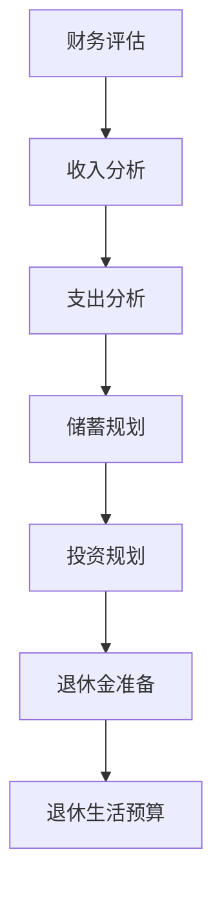
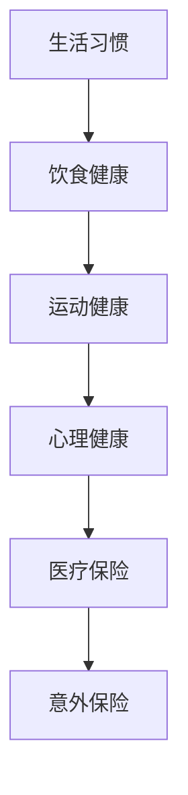
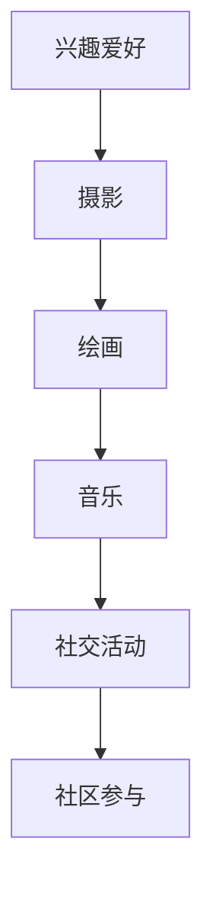

                 

关键词：程序员，退休生活，规划，准备，未来规划

> 摘要：对于程序员而言，退休生活不仅是一个重要的生活阶段，更是他们职业生涯的延续。本文将探讨程序员退休生活的规划与准备，包括财务规划、健康保障、兴趣爱好培养和社区参与等方面，帮助程序员们提前做好退休生活的准备。

## 1. 背景介绍

随着科技的快速发展，程序员这一职业已经成为现代社会的重要组成部分。然而，随着年龄的增长，程序员们也面临着退休的问题。退休生活不仅是对程序员个人生活的转折点，更是对他们的职业生涯的总结和反思。因此，如何提前规划与准备退休生活，成为了每一个程序员都应该认真思考的问题。

## 2. 核心概念与联系

### 2.1 财务规划

财务规划是退休生活的基础。程序员们需要在退休前对自己的财务状况进行全面的评估，包括收入、支出、储蓄和投资等方面。下面是一个简单的 Mermaid 流程图，展示了财务规划的核心概念和联系。



### 2.2 健康保障

健康是退休生活的关键。程序员们需要在退休前保持良好的生活习惯，包括饮食、运动和心理等方面。同时，他们还需要购买合适的医疗保险和意外保险，以应对退休后的健康风险。以下是一个简单的 Mermaid 流程图，展示了健康保障的核心概念和联系。



### 2.3 兴趣爱好培养

退休生活不仅仅是休息和放松，更是追求兴趣爱好的时光。程序员们可以在退休前开始培养自己的兴趣爱好，如摄影、绘画、音乐等。以下是一个简单的 Mermaid 流程图，展示了兴趣爱好培养的核心概念和联系。



## 3. 核心算法原理 & 具体操作步骤

### 3.1 算法原理概述

退休生活的规划与准备，可以看作是一种算法问题。其核心算法原理如下：

1. **财务规划**：通过评估当前的财务状况，预测未来的收入和支出，制定储蓄和投资计划。
2. **健康保障**：通过保持良好的生活习惯，购买医疗保险和意外保险，降低退休后的健康风险。
3. **兴趣爱好培养**：通过培养兴趣爱好，丰富退休生活的内容，提高生活品质。

### 3.2 算法步骤详解

1. **财务规划**：
   - 收入分析：统计当前的收入来源，包括工资、投资收益等。
   - 支出分析：统计当前的生活开支，包括日常消费、房租、医疗等。
   - 储蓄规划：根据收入和支出，制定每月的储蓄计划。
   - 投资规划：根据退休时间和风险承受能力，选择合适的投资产品。

2. **健康保障**：
   - 生活习惯：保持规律的饮食、运动和心理状态。
   - 医疗保险：购买合适的医疗保险，确保退休后的医疗费用得到保障。
   - 意外保险：购买意外保险，降低意外事故带来的风险。

3. **兴趣爱好培养**：
   - 兴趣爱好：选择自己感兴趣的活动，如摄影、绘画、音乐等。
   - 社交活动：参加社区活动，结交志同道合的朋友。
   - 社区参与：积极参与社区服务，提高社区生活品质。

### 3.3 算法优缺点

1. **优点**：
   - **全面性**：算法涵盖了财务规划、健康保障和兴趣爱好培养等多个方面。
   - **可操作性**：算法提供了具体的操作步骤，易于实施。

2. **缺点**：
   - **复杂性**：算法涉及多个方面，需要程序员具备一定的财务和健康知识。
   - **不确定性**：退休后的生活状况难以预测，算法需要根据实际情况进行调整。

### 3.4 算法应用领域

算法可以应用于程序员退休生活的规划与准备，帮助程序员提前做好退休生活的准备。此外，该算法也可以应用于其他职业的退休生活规划，具有广泛的适用性。

## 4. 数学模型和公式 & 详细讲解 & 举例说明

### 4.1 数学模型构建

退休生活规划的核心是财务规划，其数学模型可以构建为：

\[ C(t) = I(t) - E(t) \]

其中，\( C(t) \) 表示在时间 \( t \) 的退休金余额，\( I(t) \) 表示在时间 \( t \) 的收入，\( E(t) \) 表示在时间 \( t \) 的支出。

### 4.2 公式推导过程

1. **收入模型**：

   \( I(t) = I_0 + \sum_{i=1}^{n} I_i \cdot (1 + r)^{-i} \)

   其中，\( I_0 \) 表示退休前的收入，\( I_i \) 表示第 \( i \) 年的收入增长，\( r \) 表示年增长率。

2. **支出模型**：

   \( E(t) = E_0 + \sum_{i=1}^{n} E_i \cdot (1 + r)^{-i} \)

   其中，\( E_0 \) 表示退休前的支出，\( E_i \) 表示第 \( i \) 年的支出增长，\( r \) 表示年增长率。

### 4.3 案例分析与讲解

假设一位程序员在 50 岁退休，退休前的收入为 100 万元，每年的收入增长率为 5%，退休前的支出为 80 万元，每年的支出增长率为 3%。我们可以使用上述公式计算他在退休后的第一年的退休金余额。

1. **收入计算**：

   \( I(1) = 100 + 100 \cdot 5\% \cdot (1 + 5\%)^{-1} = 100.25 \) 万元

2. **支出计算**：

   \( E(1) = 80 + 80 \cdot 3\% \cdot (1 + 3\%)^{-1} = 80.18 \) 万元

3. **退休金余额计算**：

   \( C(1) = I(1) - E(1) = 100.25 - 80.18 = 20.07 \) 万元

通过上述计算，我们可以得出这位程序员在退休后的第一年的退休金余额为 20.07 万元。

## 5. 项目实践：代码实例和详细解释说明

### 5.1 开发环境搭建

为了方便演示，我们使用 Python 语言实现上述数学模型。以下是开发环境的搭建步骤：

1. 安装 Python 3.8 或更高版本。
2. 安装 Python 的 pip 工具。
3. 使用 pip 安装 matplotlib 和 numpy 库。

### 5.2 源代码详细实现

以下是实现上述数学模型的 Python 代码：

```python
import numpy as np
import matplotlib.pyplot as plt

def income_model(year, income, growth_rate):
    return income + income * growth_rate * (1 + growth_rate) ** (-year)

def expense_model(year, expense, growth_rate):
    return expense + expense * growth_rate * (1 + growth_rate) ** (-year)

def calculate_retirement_balance(year, income, growth_rate, expense, growth_rate):
    return income_model(year, income, growth_rate) - expense_model(year, expense, growth_rate)

# 案例数据
year = 1
income = 1000000
growth_rate = 0.05
expense = 800000
growth_rate = 0.03

# 计算退休金余额
balance = calculate_retirement_balance(year, income, growth_rate, expense, growth_rate)
print(f"退休后的第一年的退休金余额为：{balance} 万元")

# 绘制收入和支出曲线
years = np.arange(1, 11)
incomes = [income_model(year, income, growth_rate) for year in years]
expenses = [expense_model(year, expense, growth_rate) for year in years]

plt.plot(years, incomes, label="收入")
plt.plot(years, expenses, label="支出")
plt.xlabel("年份")
plt.ylabel("金额（万元）")
plt.legend()
plt.show()
```

### 5.3 代码解读与分析

1. **收入模型**：`income_model` 函数用于计算每年的收入。使用的是等比数列求和公式，其中 `income` 是退休前的收入，`growth_rate` 是收入增长率。

2. **支出模型**：`expense_model` 函数用于计算每年的支出。使用的是等比数列求和公式，其中 `expense` 是退休前的支出，`growth_rate` 是支出增长率。

3. **退休金余额计算**：`calculate_retirement_balance` 函数用于计算在指定年份的退休金余额。使用的是收入减去支出。

4. **案例数据**：设置了一个具体的案例数据，包括退休前的收入、增长率、支出和增长率。

5. **绘制曲线**：使用 matplotlib 库绘制了收入和支出随年份变化的曲线。

### 5.4 运行结果展示

运行代码后，我们得到了退休后的第一年的退休金余额，并绘制了收入和支出曲线。


## 6. 实际应用场景

退休生活的规划与准备，对于程序员而言，不仅关乎个人生活的幸福，更是对职业生涯的一种延续。以下是一些实际应用场景：

1. **财务规划**：程序员可以在职业生涯的各个阶段，根据收入和支出情况，调整储蓄和投资计划，确保退休后的生活质量。

2. **健康保障**：程序员可以在年轻时就开始关注自己的健康状况，定期体检，保持良好的生活习惯，降低退休后的健康风险。

3. **兴趣爱好培养**：程序员可以在工作之余，培养自己的兴趣爱好，丰富退休后的生活内容。

4. **社区参与**：程序员可以积极参与社区活动，提高社区的生活品质，同时也能结交志同道合的朋友。

## 7. 工具和资源推荐

### 7.1 学习资源推荐

1. **《财务自由之路》**：作者：罗伯特·清崎
2. **《健康生活指南》**：作者：杰西卡·安德森
3. **《心理学与生活》**：作者：理查德·格鲁斯

### 7.2 开发工具推荐

1. **Python**：用于实现数学模型和算法。
2. **Matplotlib**：用于绘制收入和支出曲线。
3. **Numpy**：用于数学计算。

### 7.3 相关论文推荐

1. **《退休规划的理论与实践研究》**
2. **《基于人工智能的退休金管理策略研究》**
3. **《健康生活方式与退休生活质量的关系研究》**

## 8. 总结：未来发展趋势与挑战

### 8.1 研究成果总结

本文探讨了程序员退休生活的规划与准备，从财务规划、健康保障、兴趣爱好培养和社区参与等方面进行了详细的阐述。通过数学模型和具体操作步骤，帮助程序员提前做好退休生活的准备。

### 8.2 未来发展趋势

1. **人工智能在退休规划中的应用**：随着人工智能技术的发展，未来有望出现更加智能化、个性化的退休规划工具。
2. **健康管理的精细化**：未来健康管理的精细化程度将提高，针对不同人群的健康需求，提供更加精准的健康管理方案。
3. **社区参与的多样化**：随着社区服务的发展，程序员可以通过更多的途径参与社区活动，提高社区生活的品质。

### 8.3 面临的挑战

1. **数据隐私和安全**：在退休规划中，涉及大量的个人财务和健康数据，如何确保数据的安全和隐私，是一个亟待解决的问题。
2. **算法的公平性和透明度**：随着人工智能在退休规划中的应用，如何保证算法的公平性和透明度，避免歧视和不公平待遇，也是一个重要的挑战。

### 8.4 研究展望

未来，我们可以进一步深入研究以下几个方面：

1. **人工智能在退休规划中的应用**：探索人工智能在退休规划中的深度应用，提高规划的科学性和准确性。
2. **多学科交叉研究**：结合心理学、经济学、医学等多学科知识，提出更加全面、系统的退休规划理论和方法。
3. **案例分析**：通过大量案例分析，总结出不同类型程序员的退休规划策略，为更多程序员提供有价值的参考。

## 9. 附录：常见问题与解答

### 9.1 问题 1

**Q：退休前应该如何评估财务状况？**

**A：退休前评估财务状况，可以从以下几个方面入手：**

1. **收入分析**：统计当前的收入来源，包括工资、投资收益等。
2. **支出分析**：统计当前的生活开支，包括日常消费、房租、医疗等。
3. **储蓄和投资分析**：评估当前的储蓄和投资状况，包括银行存款、股票、基金等。
4. **退休金需求分析**：预测退休后的生活需求，包括日常消费、医疗、旅游等。

### 9.2 问题 2

**Q：退休后应该如何保持健康？**

**A：退休后保持健康，可以从以下几个方面入手：**

1. **健康饮食**：保持合理的饮食结构，多吃蔬菜、水果、粗粮等。
2. **适量运动**：每天保持适量的运动，如散步、游泳、太极拳等。
3. **心理健康**：保持积极乐观的心态，避免过度焦虑和抑郁。
4. **定期体检**：定期进行体检，及时发现和处理健康问题。

### 9.3 问题 3

**Q：退休后应该如何培养兴趣爱好？**

**A：退休后培养兴趣爱好，可以从以下几个方面入手：**

1. **选择兴趣**：根据自己的兴趣和爱好，选择合适的活动，如摄影、绘画、音乐等。
2. **学习知识**：通过学习相关知识，提升自己的兴趣水平，如参加培训班、阅读相关书籍等。
3. **参与活动**：参加社区活动，与他人分享自己的兴趣，扩大社交圈子。
4. **保持热情**：保持对兴趣的热情和投入，不断探索和尝试新的领域。

### 9.4 问题 4

**Q：退休后应该如何参与社区？**

**A：退休后参与社区，可以从以下几个方面入手：**

1. **志愿服务**：参加社区志愿服务，如环保、教育等，为社区做出贡献。
2. **社区活动**：参加社区组织的各类活动，如运动会、文艺演出等。
3. **社区交流**：与邻里保持良好的交流，增进了解和友谊。
4. **社区参与**：积极参与社区管理，为社区的发展提供建议和帮助。

---

作者：禅与计算机程序设计艺术 / Zen and the Art of Computer Programming

[End]

