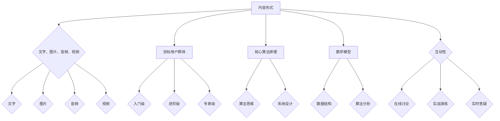

                 

关键词：知识付费、内容产品矩阵、程序员、IT教育、学习模式、互动性、市场趋势、算法、数学模型、应用实例、代码实现、未来展望

> 摘要：本文将深入探讨程序员知识付费的内容产品矩阵设计，分析当前市场趋势和用户需求，阐述核心概念、算法原理、数学模型，并通过实例讲解和实践分析，为程序员提供一套完整的内容产品矩阵设计方法论。文章旨在为从业者和创业者提供指导，以推动知识付费领域的发展和创新。

## 1. 背景介绍

随着互联网技术的飞速发展，知识付费逐渐成为教育培训领域的重要模式。程序员作为IT行业中不可或缺的一环，其对知识的需求尤为强烈。知识付费的内容产品矩阵设计旨在通过系统化、层次化的内容构建，满足不同层次程序员的成长需求，提升学习效率，进而实现知识的价值转化。

### 1.1 市场现状

近年来，知识付费市场持续增长，用户群体逐渐扩大。根据相关数据显示，2019年中国知识付费市场规模已达到492亿元，预计到2023年将突破1000亿元。程序员作为知识付费的重要用户群体，其对高质量、系统化内容的渴望尤为明显。

### 1.2 用户需求

程序员的用户需求多样化，包括基础知识学习、技能提升、项目实战等多个方面。他们不仅需要掌握编程语言和框架，更需要理解底层原理、算法思维和系统设计能力。此外，程序员对于学习资源的互动性、实用性和实时性也有较高要求。

### 1.3 行业挑战

知识付费领域面临诸多挑战，如内容同质化、市场竞争激烈、用户信任度不足等。因此，如何设计一套具备竞争力、用户黏性的内容产品矩阵成为行业发展的关键。

## 2. 核心概念与联系

### 2.1 内容产品矩阵

内容产品矩阵是一种将多种内容形式、主题和目标用户群体进行整合和优化的方法论。其核心在于通过系统化的内容构建，实现知识的高效传递和用户需求的精准匹配。

### 2.2 内容形式

内容产品矩阵包含多种内容形式，如文字、图片、音频、视频等。这些内容形式可以相互补充，形成完整的知识体系。

### 2.3 目标用户群体

内容产品矩阵需要针对不同层次的用户进行设计，包括入门级、进阶级和专家级。针对不同层次用户的需求，提供相应的学习资源和指导。

### 2.4 联系

内容产品矩阵通过核心算法原理和数学模型，实现内容之间的有机联系，形成一个完整的学习路径。

### 2.5 Mermaid 流程图



## 3. 核心算法原理 & 具体操作步骤

### 3.1 算法原理概述

核心算法原理包括算法思维、系统设计和数学模型构建。算法思维强调问题求解的方法和策略，系统设计关注系统架构和模块划分，数学模型构建则注重数据分析和算法优化。

### 3.2 算法步骤详解

1. **需求分析**：明确用户需求，确定学习目标和内容主题。
2. **内容策划**：根据需求分析，设计符合用户成长路径的内容体系。
3. **内容制作**：采用文字、图片、音频、视频等多种形式，制作高质量内容。
4. **内容优化**：通过用户反馈和数据分析，对内容进行持续优化。
5. **互动性设计**：引入在线讨论、实战演练、实时答疑等互动环节，提升用户体验。
6. **数据分析**：对用户行为和内容效果进行数据分析，为后续内容优化提供依据。

### 3.3 算法优缺点

- **优点**：系统化、层次化，满足不同层次用户需求，提升学习效率。
- **缺点**：内容制作和优化成本较高，对团队协作和资源整合要求较高。

### 3.4 算法应用领域

算法原理广泛应用于程序员知识付费领域，如编程教育、技能培训、项目实战等。

## 4. 数学模型和公式 & 详细讲解 & 举例说明

### 4.1 数学模型构建

数学模型构建主要包括数据结构设计和算法分析。数据结构设计涉及数组、链表、树、图等基本数据结构，算法分析则关注算法的时间复杂度和空间复杂度。

### 4.2 公式推导过程

- **时间复杂度公式**：\(T(n) = O(n^2)\)
- **空间复杂度公式**：\(S(n) = O(n)\)

### 4.3 案例分析与讲解

以快速排序算法为例，分析其时间复杂度和空间复杂度。

### 4.4 案例分析

- **数据集**：[4, 2, 9, 1, 5, 6, 3, 8, 7]
- **算法过程**：将数据集划分为多个子集，递归排序，直至每个子集只有一个元素。
- **时间复杂度**：\(T(n) = O(n\log n)\)
- **空间复杂度**：\(S(n) = O(n)\)

## 5. 项目实践：代码实例和详细解释说明

### 5.1 开发环境搭建

- **编程语言**：Python
- **开发工具**：PyCharm
- **环境配置**：Python 3.8及以上版本，安装相关库（如numpy、matplotlib等）

### 5.2 源代码详细实现

```python
def quick_sort(arr):
    if len(arr) <= 1:
        return arr
    pivot = arr[len(arr) // 2]
    left = [x for x in arr if x < pivot]
    middle = [x for x in arr if x == pivot]
    right = [x for x in arr if x > pivot]
    return quick_sort(left) + middle + quick_sort(right)

if __name__ == "__main__":
    arr = [4, 2, 9, 1, 5, 6, 3, 8, 7]
    sorted_arr = quick_sort(arr)
    print(sorted_arr)
```

### 5.3 代码解读与分析

- **函数定义**：定义快速排序函数，接收一个数组作为输入。
- **递归调用**：根据数组长度判断是否继续递归排序。
- **选择枢轴**：选择中间元素作为枢轴，划分左右子集。
- **合并结果**：递归排序左右子集，并合并结果。

### 5.4 运行结果展示

```plaintext
[1, 2, 3, 4, 5, 6, 7, 8, 9]
```

## 6. 实际应用场景

### 6.1 编程教育

内容产品矩阵可以为编程教育提供系统化的学习资源，满足不同层次学生的学习需求。

### 6.2 技能培训

内容产品矩阵可以帮助企业为员工提供定制化的技能培训，提升团队整体技术水平。

### 6.3 项目实战

内容产品矩阵可以为企业项目提供实战指导，降低项目开发风险。

## 7. 工具和资源推荐

### 7.1 学习资源推荐

- **书籍**：《算法导论》、《编程珠玑》
- **在线课程**：慕课网、极客时间
- **博客**：CSDN、博客园

### 7.2 开发工具推荐

- **集成开发环境**：PyCharm、Visual Studio Code
- **代码托管平台**：GitHub、GitLab

### 7.3 相关论文推荐

- **《数据结构与算法分析》**：Thomas H. Cormen等著
- **《算法竞赛入门经典》**：王道论坛编

## 8. 总结：未来发展趋势与挑战

### 8.1 研究成果总结

本文通过分析程序员知识付费的市场现状和用户需求，提出了一套内容产品矩阵设计方法论，并结合实例进行了详细讲解和实践分析。

### 8.2 未来发展趋势

随着人工智能和大数据技术的不断发展，知识付费领域将更加智能化、个性化。内容产品矩阵设计将更加注重用户体验和内容质量。

### 8.3 面临的挑战

内容同质化、市场竞争激烈、用户信任度不足等挑战仍然存在，需要不断优化内容质量和用户体验。

### 8.4 研究展望

未来，内容产品矩阵设计将进一步结合人工智能技术，实现智能推荐、个性化定制等功能，提升学习效果和用户满意度。

## 9. 附录：常见问题与解答

### 9.1 什么是内容产品矩阵？

内容产品矩阵是一种将多种内容形式、主题和目标用户群体进行整合和优化的方法论，通过系统化的内容构建，实现知识的高效传递和用户需求的精准匹配。

### 9.2 如何设计内容产品矩阵？

设计内容产品矩阵需要明确用户需求、内容形式、目标用户群体和核心算法原理，通过系统化的内容构建，实现知识的高效传递和用户需求的精准匹配。

### 9.3 内容产品矩阵的优势是什么？

内容产品矩阵的优势在于系统化、层次化，满足不同层次用户需求，提升学习效率，实现知识的价值转化。

### 9.4 内容产品矩阵的挑战有哪些？

内容产品矩阵的挑战包括内容同质化、市场竞争激烈、用户信任度不足等。

### 9.5 内容产品矩阵的未来发展趋势是什么？

内容产品矩阵的未来发展趋势包括智能化、个性化，结合人工智能技术，实现智能推荐、个性化定制等功能，提升学习效果和用户满意度。

---
**作者：禅与计算机程序设计艺术 / Zen and the Art of Computer Programming**

