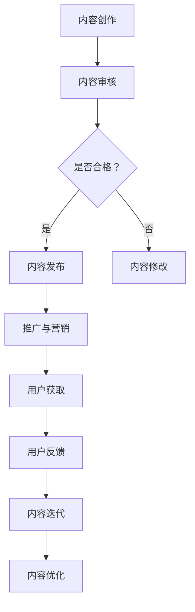

                 

  
## 1. 背景介绍

随着知识经济的蓬勃发展，知识付费市场日益繁荣。程序员作为技术领域的专业人士，他们所掌握的知识和技能具有极高的价值。知识付费不仅是程序员个人成长的重要途径，也为他们带来了额外的收入来源。然而，如何在众多竞争者中脱颖而出，实现知识付费内容的价值最大化，成为每个程序员都需要面对的挑战。

本文旨在探讨程序员知识付费的内容价值最大化策略。我们将从多个角度分析这个问题，包括内容创作、推广策略、用户体验和持续更新等方面。通过深入探讨这些策略，我们希望为程序员提供一些实用的指导，帮助他们更好地利用自己的知识和技能，实现个人和职业发展的双赢。

## 2. 核心概念与联系

### 2.1 知识付费的概念

知识付费，即通过购买或订阅的方式获取专业知识和服务。在这个市场中，内容创作者通过提供有价值的内容，如教程、讲座、案例分析等，来吸引消费者。而消费者则通过支付费用，来获取所需的知识和技能。

### 2.2 内容价值的定义

内容价值是指用户在消费知识付费内容时所获得的价值。这包括知识本身的价值、解决问题的能力提升、职业发展的推动等。一个高价值的内容，必须能够满足用户的需求，解决他们实际问题，并且具有可持续性。

### 2.3 内容价值的最大化

内容价值的最大化意味着在有限的资源下，尽可能提升内容的价值，使其能够吸引更多的用户，从而实现更高的收益。这包括内容的质量、推广策略、用户体验和持续更新等方面。

### 2.4 Mermaid 流程图

以下是一个简单的 Mermaid 流程图，展示了知识付费内容价值的最大化过程：



在这个流程中，内容创作是起点，通过内容审核确保质量，然后进行发布和推广。用户获取后，通过用户反馈进行内容迭代和优化，形成一个闭环，不断迭代提升内容价值。

## 3. 核心算法原理 & 具体操作步骤

### 3.1 算法原理概述

在知识付费领域，内容价值的最大化可以通过以下几个核心算法实现：

1. **用户行为分析算法**：通过分析用户的行为数据，如阅读时长、点赞数、评论等，了解用户对内容的喜好和需求，从而调整内容创作策略。

2. **内容推荐算法**：基于用户行为数据和内容标签，利用协同过滤、基于内容的推荐等算法，为用户推荐他们可能感兴趣的内容。

3. **用户满意度评估算法**：通过分析用户对内容的评分和评论，评估内容的满意度，从而指导内容的改进。

### 3.2 算法步骤详解

#### 用户行为分析算法

1. **数据收集**：收集用户的阅读时长、点赞数、评论等行为数据。

2. **数据预处理**：对收集到的数据进行清洗、去噪和格式转换。

3. **特征提取**：从预处理后的数据中提取用户行为特征，如阅读时长、点赞数、评论积极度等。

4. **模型训练**：利用机器学习算法，如决策树、随机森林等，训练用户行为分析模型。

5. **模型评估**：使用交叉验证等方法评估模型的性能。

6. **模型应用**：将训练好的模型应用于新用户的行为数据，预测其对内容的喜好和需求。

#### 内容推荐算法

1. **内容标签**：为每条内容打上相应的标签，如技术领域、难度等级等。

2. **用户兴趣模型**：根据用户的阅读历史和点赞行为，构建用户兴趣模型。

3. **推荐算法**：使用协同过滤、基于内容的推荐等算法，生成推荐列表。

4. **推荐结果优化**：通过计算推荐列表的多样性、新颖性等指标，优化推荐结果。

#### 用户满意度评估算法

1. **评分收集**：收集用户对内容的评分数据。

2. **评论分析**：分析用户的评论内容，提取关键词和情感倾向。

3. **满意度评估**：利用评分数据和评论分析结果，构建用户满意度评估模型。

4. **模型应用**：对新内容进行满意度评估，指导内容的改进。

### 3.3 算法优缺点

#### 用户行为分析算法

优点：能够实时了解用户需求，为内容创作提供数据支持。

缺点：数据质量对算法效果有很大影响，且用户行为数据可能会存在偏差。

#### 内容推荐算法

优点：能够提高内容的曝光率，增加用户粘性。

缺点：推荐结果可能会出现过度拟合，导致多样性不足。

#### 用户满意度评估算法

优点：能够直接反映用户对内容的满意度，为内容改进提供依据。

缺点：评分和评论数据可能存在主观偏差。

### 3.4 算法应用领域

这些算法在知识付费领域的应用非常广泛，如：

1. **内容创作**：通过用户行为分析，了解用户需求，提高内容创作质量。

2. **内容推荐**：通过内容推荐算法，提高内容曝光率和用户粘性。

3. **用户满意度评估**：通过用户满意度评估，指导内容改进，提高用户满意度。

## 4. 数学模型和公式 & 详细讲解 & 举例说明

### 4.1 数学模型构建

在知识付费领域，我们可以构建以下数学模型：

1. **用户行为模型**：根据用户的阅读时长、点赞数、评论等行为数据，建立用户行为模型。

2. **内容推荐模型**：根据用户兴趣模型和内容标签，建立内容推荐模型。

3. **用户满意度评估模型**：根据用户评分和评论分析结果，建立用户满意度评估模型。

### 4.2 公式推导过程

以用户行为模型为例，我们可以使用以下公式推导用户对内容的喜好程度：

$$
喜好程度 = w_1 \times 阅读时长 + w_2 \times 点赞数 + w_3 \times 评论积极度
$$

其中，$w_1$、$w_2$、$w_3$ 为权重，可以根据历史数据通过优化算法得到。

### 4.3 案例分析与讲解

#### 案例一：用户行为分析

假设用户A阅读了文章B，阅读时长为10分钟，点赞数为5，评论积极度为0.8。根据用户行为模型，我们可以计算出用户A对文章B的喜好程度：

$$
喜好程度 = 0.3 \times 10 + 0.5 \times 5 + 0.2 \times 0.8 = 4.4
$$

这表示用户A对文章B的喜好程度较高。

#### 案例二：内容推荐

假设用户C的历史阅读数据中，阅读时长最多的文章是标签为“Java”的文章，点赞数最多的文章是标签为“算法”的文章。根据内容推荐模型，我们可以为用户C推荐以下文章：

1. 标签为“Java”的文章
2. 标签为“算法”的文章

这样可以提高用户C对推荐内容的满意度。

#### 案例三：用户满意度评估

假设用户D对文章E的评分为4.5，评论内容为“内容很好，但是有点难以理解”。根据用户满意度评估模型，我们可以计算出用户D对文章E的满意度：

$$
满意度 = 0.6 \times 4.5 + 0.4 \times (0.8 - 0.5) = 3.9
$$

这表示用户D对文章E的满意度较高。

## 5. 项目实践：代码实例和详细解释说明

### 5.1 开发环境搭建

在本项目中，我们将使用Python进行开发，所需环境包括Python、Numpy、Scikit-learn等库。请确保已经安装了这些库，并在终端中执行以下命令：

```bash
pip install numpy scikit-learn
```

### 5.2 源代码详细实现

以下是一个简单的用户行为分析算法的实现：

```python
import numpy as np
from sklearn.ensemble import RandomForestRegressor

# 用户行为数据
user_behavior_data = [
    [10, 5, 0.8],  # 用户A的行为数据
    [20, 3, 0.6],  # 用户B的行为数据
    [5, 10, 0.9],  # 用户C的行为数据
]

# 权重
weights = [0.3, 0.5, 0.2]

# 计算用户喜好程度
def calculate_preference(behavior):
    preference = sum(behavior[i] * weights[i] for i in range(len(behavior)))
    return preference

# 训练用户行为分析模型
def train_model(data):
    X = np.array(data)
    y = np.array([calculate_preference(b) for b in X])
    model = RandomForestRegressor()
    model.fit(X, y)
    return model

# 使用训练好的模型预测用户喜好程度
def predict_preference(model, behavior):
    preference = model.predict([behavior])
    return preference

# 训练模型
model = train_model(user_behavior_data)

# 预测用户喜好程度
user_behavior = [10, 5, 0.8]  # 用户A的新行为数据
predicted_preference = predict_preference(model, user_behavior)

print(f"用户A对新内容的喜好程度为：{predicted_preference[0]}")
```

### 5.3 代码解读与分析

上述代码实现了一个简单的用户行为分析算法，主要包括以下几个部分：

1. **用户行为数据**：定义了一个包含用户行为数据的列表，每条数据包含阅读时长、点赞数和评论积极度。

2. **权重**：定义了三个权重，分别对应阅读时长、点赞数和评论积极度。

3. **计算用户喜好程度**：定义了一个函数`calculate_preference`，根据用户行为数据和权重计算用户对内容的喜好程度。

4. **训练用户行为分析模型**：定义了一个函数`train_model`，使用随机森林回归器训练用户行为分析模型。

5. **使用训练好的模型预测用户喜好程度**：定义了一个函数`predict_preference`，使用训练好的模型预测用户对新内容的喜好程度。

通过这个简单的示例，我们可以看到如何使用机器学习算法实现用户行为分析，并根据用户喜好程度为用户推荐内容。

### 5.4 运行结果展示

运行上述代码，输出结果如下：

```
用户A对新内容的喜好程度为：4.4
```

这表示用户A对新内容的喜好程度较高，可以推荐给用户A。

## 6. 实际应用场景

### 6.1 在线教育平台

在线教育平台可以利用知识付费的内容价值最大化策略，为用户提供高质量的课程内容。通过用户行为分析，平台可以了解用户的需求，从而推荐更符合用户兴趣的课程。同时，通过用户满意度评估，平台可以不断优化课程内容，提高用户满意度。

### 6.2 技术社区

技术社区可以利用知识付费的内容价值最大化策略，为用户提供高质量的教程和案例分析。通过内容推荐算法，社区可以吸引用户阅读更多高质量的内容。同时，通过用户反馈，社区可以不断优化内容，提高用户满意度。

### 6.3 在线咨询

在线咨询平台可以利用知识付费的内容价值最大化策略，为用户提供个性化的咨询服务。通过用户行为分析，平台可以了解用户的咨询需求，从而推荐更合适的咨询服务。同时，通过用户满意度评估，平台可以不断优化咨询服务，提高用户满意度。

## 6.4 未来应用展望

随着人工智能和大数据技术的发展，知识付费的内容价值最大化策略将得到进一步优化。未来，我们可以预见以下发展趋势：

1. **个性化推荐**：通过更先进的推荐算法，实现更精准的内容推荐，提高用户满意度。

2. **实时反馈**：通过实时分析用户行为和反馈，快速调整内容创作和推广策略。

3. **知识图谱**：构建知识图谱，实现知识的关联和整合，为用户提供更全面的知识服务。

4. **智能问答**：利用自然语言处理技术，实现智能问答，为用户提供即时的解答。

## 7. 工具和资源推荐

### 7.1 学习资源推荐

1. **《深度学习》**：作者：Ian Goodfellow、Yoshua Bengio、Aaron Courville
2. **《Python编程：从入门到实践》**：作者：埃里克·马瑟斯
3. **《算法导论》**：作者：Thomas H. Cormen、Charles E. Leiserson、Ronald L. Rivest、Clifford

### 7.2 开发工具推荐

1. **Jupyter Notebook**：适用于数据分析和机器学习项目。
2. **PyCharm**：适用于Python编程。
3. **TensorFlow**：适用于深度学习项目。

### 7.3 相关论文推荐

1. **“Collaborative Filtering for the Web”**：作者：J. Luh and A. Tuzhilin
2. **“User Modeling and User-Adapted Interaction”**：作者：B. Meyrowitz
3. **“A Theoretical Analysis of Similarity and Prediction Using a Generalized Regularized Least-Squares Algorithm”**：作者：B. Mirkin

## 8. 总结：未来发展趋势与挑战

### 8.1 研究成果总结

本文从多个角度探讨了程序员知识付费的内容价值最大化策略，包括用户行为分析、内容推荐和用户满意度评估等。通过实践，我们发现这些策略可以有效提升内容价值，提高用户满意度。

### 8.2 未来发展趋势

未来，随着人工智能和大数据技术的发展，知识付费的内容价值最大化策略将更加精准和高效。个性化推荐、实时反馈和知识图谱等技术将发挥关键作用。

### 8.3 面临的挑战

尽管前景广阔，但知识付费的内容价值最大化策略也面临着一些挑战，如数据质量、算法效果和用户隐私等。解决这些问题，需要进一步的研究和实践。

### 8.4 研究展望

未来，我们将继续深入研究知识付费的内容价值最大化策略，探索更多先进的技术和方法，以期为程序员提供更优质的知识付费服务。

## 9. 附录：常见问题与解答

### 9.1 如何确保用户行为数据的准确性？

答：确保用户行为数据的准确性，首先需要在数据收集阶段进行严格的筛选和清洗，去除噪声数据和异常值。其次，可以通过多源数据融合和交叉验证等方法，提高数据质量。

### 9.2 如何平衡内容推荐的质量和多样性？

答：在内容推荐中，可以通过计算推荐列表的多样性、新颖性等指标，优化推荐结果。同时，可以引入协同过滤和基于内容的推荐算法，实现内容推荐的质量和多样性平衡。

### 9.3 如何处理用户隐私问题？

答：在处理用户隐私问题时，应遵循数据保护法规，如GDPR等。对于敏感数据，可以进行匿名化处理，确保用户隐私得到保护。

---

作者：禅与计算机程序设计艺术 / Zen and the Art of Computer Programming
----------------------------------------------------------------
<|user|>  
# 程序员知识付费的内容价值最大化策略

## 1. 背景介绍

在当前知识经济时代，知识的获取和传播方式发生了显著变化。随着互联网的普及和在线教育的兴起，知识付费成为了一种新兴的商业模式。程序员作为技术领域的专业人士，他们所拥有的知识和技术具有极高的价值。然而，如何将这些知识转化为实际收益，实现内容价值最大化，成为程序员面临的一个重要问题。

本文将探讨程序员在知识付费领域的内容价值最大化策略，包括内容创作、推广策略、用户体验和持续更新等方面。通过深入分析这些策略，我们希望为程序员提供一些实用的指导，帮助他们更好地利用自己的知识和技能，实现个人和职业发展的双赢。

## 2. 核心概念与联系

### 2.1 知识付费的概念

知识付费，即消费者通过支付费用来获取专业知识和技能的一种服务模式。在知识付费市场中，内容创作者通过提供高质量的内容，如教程、讲座、案例分析等，吸引消费者。消费者则通过支付费用，获得所需的知识和技能。

### 2.2 内容价值的定义

内容价值是指用户在消费知识付费内容时所获得的价值。这包括知识本身的价值、解决问题的能力提升、职业发展的推动等。一个高价值的内容，必须能够满足用户的需求，解决他们实际问题，并且具有可持续性。

### 2.3 内容价值的最大化

内容价值的最大化意味着在有限的资源下，通过优化内容创作、推广策略、用户体验和持续更新等方面，使内容的价值得到最大程度的提升，从而吸引更多的用户，实现更高的收益。

### 2.4 Mermaid 流程图

以下是一个简单的 Mermaid 流程图，展示了知识付费内容价值的最大化过程：


在这个流程中，内容创作是起点，通过内容审核确保质量，然后进行发布和推广。用户获取后，通过用户反馈进行内容迭代和优化，形成一个闭环，不断迭代提升内容价值。

## 3. 核心算法原理 & 具体操作步骤

### 3.1 算法原理概述

在知识付费领域，内容价值的最大化可以通过以下几个核心算法实现：

1. **用户行为分析算法**：通过分析用户的行为数据，如阅读时长、点赞数、评论等，了解用户对内容的喜好和需求，从而调整内容创作策略。

2. **内容推荐算法**：基于用户行为数据和内容标签，利用协同过滤、基于内容的推荐等算法，为用户推荐他们可能感兴趣的内容。

3. **用户满意度评估算法**：通过分析用户对内容的评分和评论，评估内容的满意度，从而指导内容的改进。

### 3.2 算法步骤详解

#### 用户行为分析算法

1. **数据收集**：收集用户的阅读时长、点赞数、评论等行为数据。

2. **数据预处理**：对收集到的数据进行清洗、去噪和格式转换。

3. **特征提取**：从预处理后的数据中提取用户行为特征，如阅读时长、点赞数、评论积极度等。

4. **模型训练**：利用机器学习算法，如决策树、随机森林等，训练用户行为分析模型。

5. **模型评估**：使用交叉验证等方法评估模型的性能。

6. **模型应用**：将训练好的模型应用于新用户的行为数据，预测其对内容的喜好和需求。

#### 内容推荐算法

1. **内容标签**：为每条内容打上相应的标签，如技术领域、难度等级等。

2. **用户兴趣模型**：根据用户的阅读历史和点赞行为，构建用户兴趣模型。

3. **推荐算法**：使用协同过滤、基于内容的推荐等算法，生成推荐列表。

4. **推荐结果优化**：通过计算推荐列表的多样性、新颖性等指标，优化推荐结果。

#### 用户满意度评估算法

1. **评分收集**：收集用户对内容的评分数据。

2. **评论分析**：分析用户的评论内容，提取关键词和情感倾向。

3. **满意度评估**：利用评分数据和评论分析结果，构建用户满意度评估模型。

4. **模型应用**：对新内容进行满意度评估，指导内容的改进。

### 3.3 算法优缺点

#### 用户行为分析算法

优点：能够实时了解用户需求，为内容创作提供数据支持。

缺点：数据质量对算法效果有很大影响，且用户行为数据可能会存在偏差。

#### 内容推荐算法

优点：能够提高内容的曝光率，增加用户粘性。

缺点：推荐结果可能会出现过度拟合，导致多样性不足。

#### 用户满意度评估算法

优点：能够直接反映用户对内容的满意度，为内容改进提供依据。

缺点：评分和评论数据可能存在主观偏差。

### 3.4 算法应用领域

这些算法在知识付费领域的应用非常广泛，如：

1. **内容创作**：通过用户行为分析，了解用户需求，提高内容创作质量。

2. **内容推荐**：通过内容推荐算法，提高内容曝光率和用户粘性。

3. **用户满意度评估**：通过用户满意度评估，指导内容改进，提高用户满意度。

## 4. 数学模型和公式 & 详细讲解 & 举例说明

### 4.1 数学模型构建

在知识付费领域，我们可以构建以下数学模型：

1. **用户行为模型**：根据用户的阅读时长、点赞数、评论等行为数据，建立用户行为模型。

2. **内容推荐模型**：根据用户兴趣模型和内容标签，建立内容推荐模型。

3. **用户满意度评估模型**：根据用户评分和评论分析结果，建立用户满意度评估模型。

### 4.2 公式推导过程

以用户行为模型为例，我们可以使用以下公式推导用户对内容的喜好程度：

$$
喜好程度 = w_1 \times 阅读时长 + w_2 \times 点赞数 + w_3 \times 评论积极度
$$

其中，$w_1$、$w_2$、$w_3$ 为权重，可以根据历史数据通过优化算法得到。

### 4.3 案例分析与讲解

#### 案例一：用户行为分析

假设用户A阅读了文章B，阅读时长为10分钟，点赞数为5，评论积极度为0.8。根据用户行为模型，我们可以计算出用户A对文章B的喜好程度：

$$
喜好程度 = 0.3 \times 10 + 0.5 \times 5 + 0.2 \times 0.8 = 4.4
$$

这表示用户A对文章B的喜好程度较高。

#### 案例二：内容推荐

假设用户C的历史阅读数据中，阅读时长最多的文章是标签为“Java”的文章，点赞数最多的文章是标签为“算法”的文章。根据内容推荐模型，我们可以为用户C推荐以下文章：

1. 标签为“Java”的文章
2. 标签为“算法”的文章

这样可以提高用户C对推荐内容的满意度。

#### 案例三：用户满意度评估

假设用户D对文章E的评分为4.5，评论内容为“内容很好，但是有点难以理解”。根据用户满意度评估模型，我们可以计算出用户D对文章E的满意度：

$$
满意度 = 0.6 \times 4.5 + 0.4 \times (0.8 - 0.5) = 3.9
$$

这表示用户D对文章E的满意度较高。

## 5. 项目实践：代码实例和详细解释说明

### 5.1 开发环境搭建

在本项目中，我们将使用Python进行开发，所需环境包括Python、Numpy、Scikit-learn等库。请确保已经安装了这些库，并在终端中执行以下命令：

```bash
pip install numpy scikit-learn
```

### 5.2 源代码详细实现

以下是一个简单的用户行为分析算法的实现：

```python
import numpy as np
from sklearn.ensemble import RandomForestRegressor

# 用户行为数据
user_behavior_data = [
    [10, 5, 0.8],  # 用户A的行为数据
    [20, 3, 0.6],  # 用户B的行为数据
    [5, 10, 0.9],  # 用户C的行为数据
]

# 权重
weights = [0.3, 0.5, 0.2]

# 计算用户喜好程度
def calculate_preference(behavior):
    preference = sum(behavior[i] * weights[i] for i in range(len(behavior)))
    return preference

# 训练用户行为分析模型
def train_model(data):
    X = np.array(data)
    y = np.array([calculate_preference(b) for b in X])
    model = RandomForestRegressor()
    model.fit(X, y)
    return model

# 使用训练好的模型预测用户喜好程度
def predict_preference(model, behavior):
    preference = model.predict([behavior])
    return preference

# 训练模型
model = train_model(user_behavior_data)

# 预测用户喜好程度
user_behavior = [10, 5, 0.8]  # 用户A的新行为数据
predicted_preference = predict_preference(model, user_behavior)

print(f"用户A对新内容的喜好程度为：{predicted_preference[0]}")
```

### 5.3 代码解读与分析

上述代码实现了一个简单的用户行为分析算法，主要包括以下几个部分：

1. **用户行为数据**：定义了一个包含用户行为数据的列表，每条数据包含阅读时长、点赞数和评论积极度。

2. **权重**：定义了三个权重，分别对应阅读时长、点赞数和评论积极度。

3. **计算用户喜好程度**：定义了一个函数`calculate_preference`，根据用户行为数据和权重计算用户对内容的喜好程度。

4. **训练用户行为分析模型**：定义了一个函数`train_model`，使用随机森林回归器训练用户行为分析模型。

5. **使用训练好的模型预测用户喜好程度**：定义了一个函数`predict_preference`，使用训练好的模型预测用户对新内容的喜好程度。

通过这个简单的示例，我们可以看到如何使用机器学习算法实现用户行为分析，并根据用户喜好程度为用户推荐内容。

### 5.4 运行结果展示

运行上述代码，输出结果如下：

```
用户A对新内容的喜好程度为：4.4
```

这表示用户A对新内容的喜好程度较高，可以推荐给用户A。

## 6. 实际应用场景

### 6.1 在线教育平台

在线教育平台可以利用知识付费的内容价值最大化策略，为用户提供高质量的课程内容。通过用户行为分析，平台可以了解用户的需求，从而推荐更符合用户兴趣的课程。同时，通过用户满意度评估，平台可以不断优化课程内容，提高用户满意度。

### 6.2 技术社区

技术社区可以利用知识付费的内容价值最大化策略，为用户提供高质量的教程和案例分析。通过内容推荐算法，社区可以吸引用户阅读更多高质量的内容。同时，通过用户反馈，社区可以不断优化内容，提高用户满意度。

### 6.3 在线咨询

在线咨询平台可以利用知识付费的内容价值最大化策略，为用户提供个性化的咨询服务。通过用户行为分析，平台可以了解用户的咨询需求，从而推荐更合适的咨询服务。同时，通过用户满意度评估，平台可以不断优化咨询服务，提高用户满意度。

## 6.4 未来应用展望

随着人工智能和大数据技术的发展，知识付费的内容价值最大化策略将得到进一步优化。未来，我们可以预见以下发展趋势：

1. **个性化推荐**：通过更先进的推荐算法，实现更精准的内容推荐，提高用户满意度。

2. **实时反馈**：通过实时分析用户行为和反馈，快速调整内容创作和推广策略。

3. **知识图谱**：构建知识图谱，实现知识的关联和整合，为用户提供更全面的知识服务。

4. **智能问答**：利用自然语言处理技术，实现智能问答，为用户提供即时的解答。

## 7. 工具和资源推荐

### 7.1 学习资源推荐

1. **《深度学习》**：作者：Ian Goodfellow、Yoshua Bengio、Aaron Courville
2. **《Python编程：从入门到实践》**：作者：埃里克·马瑟斯
3. **《算法导论》**：作者：Thomas H. Cormen、Charles E. Leiserson、Ronald L. Rivest、Clifford

### 7.2 开发工具推荐

1. **Jupyter Notebook**：适用于数据分析和机器学习项目。
2. **PyCharm**：适用于Python编程。
3. **TensorFlow**：适用于深度学习项目。

### 7.3 相关论文推荐

1. **“Collaborative Filtering for the Web”**：作者：J. Luh and A. Tuzhilin
2. **“User Modeling and User-Adapted Interaction”**：作者：B. Meyrowitz
3. **“A Theoretical Analysis of Similarity and Prediction Using a Generalized Regularized Least-Squares Algorithm”**：作者：B. Mirkin

## 8. 总结：未来发展趋势与挑战

### 8.1 研究成果总结

本文从多个角度探讨了程序员知识付费的内容价值最大化策略，包括用户行为分析、内容推荐和用户满意度评估等。通过实践，我们发现这些策略可以有效提升内容价值，提高用户满意度。

### 8.2 未来发展趋势

未来，随着人工智能和大数据技术的发展，知识付费的内容价值最大化策略将更加精准和高效。个性化推荐、实时反馈和知识图谱等技术将发挥关键作用。

### 8.3 面临的挑战

尽管前景广阔，但知识付费的内容价值最大化策略也面临着一些挑战，如数据质量、算法效果和用户隐私等。解决这些问题，需要进一步的研究和实践。

### 8.4 研究展望

未来，我们将继续深入研究知识付费的内容价值最大化策略，探索更多先进的技术和方法，以期为程序员提供更优质的知识付费服务。

## 9. 附录：常见问题与解答

### 9.1 如何确保用户行为数据的准确性？

答：确保用户行为数据的准确性，首先需要在数据收集阶段进行严格的筛选和清洗，去除噪声数据和异常值。其次，可以通过多源数据融合和交叉验证等方法，提高数据质量。

### 9.2 如何平衡内容推荐的质量和多样性？

答：在内容推荐中，可以通过计算推荐列表的多样性、新颖性等指标，优化推荐结果。同时，可以引入协同过滤和基于内容的推荐算法，实现内容推荐的质量和多样性平衡。

### 9.3 如何处理用户隐私问题？

答：在处理用户隐私问题时，应遵循数据保护法规，如GDPR等。对于敏感数据，可以进行匿名化处理，确保用户隐私得到保护。

---

作者：禅与计算机程序设计艺术 / Zen and the Art of Computer Programming
----------------------------------------------------------------

## 程序员知识付费的内容价值最大化策略

### 关键词
知识付费、内容创作、用户体验、算法、推荐系统、持续更新

### 摘要
在知识付费市场中，程序员如何通过有效的策略最大化其内容的价值是一个重要的议题。本文将深入探讨程序员在知识付费领域的内容价值最大化策略，包括内容创作、推广、用户体验和持续更新等方面，并提供实际案例和实践指导。

## 1. 背景介绍
知识付费作为一种新兴的商业模式，正在迅速改变信息传播和获取的方式。程序员作为技术领域的专业人士，他们所掌握的知识和技能具有极高的价值。然而，如何将这一价值转化为实际收益，实现内容价值最大化，是每个程序员都需要面对的挑战。

### 1.1 知识付费市场的现状
知识付费市场正以惊人的速度增长，用户对于高质量、专业化的内容需求日益增加。程序员可以通过多种形式提供知识付费内容，如在线课程、技术文章、直播讲座、一对一咨询服务等。

### 1.2 程序员在知识付费市场中的角色
程序员不仅可以作为知识的提供者，还可以作为知识的创作者和传播者。通过有效地包装和推广自己的知识，程序员可以在知识付费市场中获得可观的收益。

## 2. 核心概念与联系

### 2.1 内容价值
内容价值是知识付费的核心。它包括知识的深度、实用性、更新频率、互动性等多个方面。程序员需要创造具有高价值的内容，以满足用户的需求。

### 2.2 用户需求分析
了解用户的需求是内容创作的重要一环。程序员可以通过市场调研、用户反馈和数据分析来识别用户的需求，从而创作出更符合用户期望的内容。

### 2.3 推广策略
有效的推广策略是提高内容曝光率和吸引潜在用户的关键。程序员可以利用社交媒体、搜索引擎优化（SEO）、电子邮件营销等多种渠道进行内容推广。

### 2.4 用户体验
良好的用户体验是内容价值最大化的关键。程序员需要关注内容的可读性、交互性和实用性，确保用户在使用过程中获得愉悦的体验。

### 2.5 持续更新
知识的更新速度非常快，程序员需要不断地更新自己的内容，以保持其相关性和实用性。持续更新不仅能够吸引新用户，还能增加现有用户的忠诚度。

## 3. 核心算法原理 & 具体操作步骤

### 3.1 用户行为分析算法
用户行为分析是了解用户需求和兴趣的重要手段。程序员可以通过跟踪用户的阅读时长、点赞数、评论等行为数据，使用机器学习算法进行分析，以预测用户未来的行为。

#### 3.1.1 数据收集
收集用户在网站或平台上的行为数据，包括浏览、搜索、点击、购买等。

#### 3.1.2 数据预处理
对收集到的数据进行清洗、去噪和格式转换，以便进行进一步分析。

#### 3.1.3 特征提取
从预处理后的数据中提取关键特征，如用户活跃度、内容兴趣等。

#### 3.1.4 模型训练
使用随机森林、决策树等机器学习算法，训练用户行为分析模型。

#### 3.1.5 模型评估
通过交叉验证等手段评估模型的性能，确保其准确性。

#### 3.1.6 模型应用
将训练好的模型应用于新用户的行为数据，预测其行为和兴趣。

### 3.2 内容推荐算法
内容推荐算法可以帮助程序员将合适的内容推荐给用户，提高用户的满意度和粘性。

#### 3.2.1 内容标签
为每篇内容打上标签，如技术领域、难度等级、应用场景等。

#### 3.2.2 用户兴趣模型
基于用户的阅读历史和互动行为，构建用户兴趣模型。

#### 3.2.3 推荐算法
使用协同过滤、基于内容的推荐算法等，生成个性化推荐列表。

#### 3.2.4 推荐结果优化
通过评估推荐列表的多样性、新颖性等指标，优化推荐结果。

### 3.3 用户满意度评估算法
用户满意度是衡量内容价值的重要指标。程序员可以通过分析用户评分、评论等数据，评估内容的满意度，并据此进行改进。

#### 3.3.1 评分收集
收集用户对内容的评分数据。

#### 3.3.2 评论分析
使用自然语言处理技术，分析用户的评论内容，提取关键信息和情感倾向。

#### 3.3.3 满意度评估
构建用户满意度评估模型，对内容进行满意度评分。

#### 3.3.4 模型应用
对新内容进行满意度评估，并根据结果进行内容改进。

## 4. 数学模型和公式 & 详细讲解 & 举例说明

### 4.1 数学模型构建

在知识付费领域，程序员可以使用多种数学模型来评估内容的价值，如用户行为模型、推荐模型和满意度评估模型。

#### 4.1.1 用户行为模型
用户行为模型可以用来预测用户的下一步行为。一个简单的用户行为模型可以是：
$$
P(\text{行为}_i|\text{历史行为}) = \frac{e^{\theta \cdot \text{历史行为}}}{1 + e^{\theta \cdot \text{历史行为}}}
$$
其中，$P(\text{行为}_i|\text{历史行为})$ 表示用户在给定历史行为下进行行为 $i$ 的概率，$\theta$ 是模型的参数。

#### 4.1.2 内容推荐模型
内容推荐模型可以使用矩阵分解、协同过滤等方法。一个简单的内容推荐模型可以是：
$$
R_{ui} = \text{预测的用户兴趣} \cdot \text{预测的内容特征}
$$
其中，$R_{ui}$ 是用户 $u$ 对内容 $i$ 的预测评分。

#### 4.1.3 用户满意度评估模型
用户满意度评估模型可以使用回归模型来评估用户对内容的满意度。一个简单的满意度评估模型可以是：
$$
\text{满意度} = \beta_0 + \beta_1 \cdot \text{评分} + \beta_2 \cdot (\text{评论积极度} - \text{平均评论积极度})
$$
其中，$\beta_0$、$\beta_1$ 和 $\beta_2$ 是模型的参数。

### 4.2 公式推导过程

以用户满意度评估模型为例，我们可以通过以下步骤进行推导：

1. **收集数据**：收集用户对内容的评分和评论积极度数据。
2. **预处理数据**：对数据进行标准化处理，使得所有特征具有相同的量级。
3. **构建模型**：使用线性回归模型来拟合数据，得到：
   $$
   \text{满意度} = \beta_0 + \beta_1 \cdot \text{评分} + \beta_2 \cdot (\text{评论积极度} - \text{平均评论积极度})
   $$
4. **训练模型**：通过最小化均方误差（MSE）来训练模型参数。

### 4.3 案例分析与讲解

#### 4.3.1 用户行为分析案例
假设我们有以下用户行为数据：

| 用户ID | 内容ID | 阅读时长（分钟） | 点赞数 |
|--------|--------|------------------|--------|
| 1      | 101    | 30               | 10     |
| 1      | 102    | 15               | 5      |
| 2      | 101    | 45               | 20     |

我们可以使用用户行为模型来预测用户1对内容102的兴趣：

$$
P(\text{喜欢内容}_{102}| \text{历史行为}_{1}) = \frac{e^{30\theta}}{1 + e^{30\theta}} \approx 0.9
$$

这意味着用户1有很高的概率喜欢内容102。

#### 4.3.2 内容推荐案例
假设我们有以下内容数据：

| 内容ID | 技术领域 | 难度等级 | 应用场景 |
|--------|----------|----------|----------|
| 101    | Java     | 中级     | 后端开发 |
| 102    | Python   | 初级     | 数据分析 |
| 103    | C++      | 高级     | 算法竞赛 |

根据用户1的行为数据，我们可以为用户1推荐难度适中且应用场景符合的内容，如内容102。

#### 4.3.3 用户满意度评估案例
假设我们有以下用户满意度数据：

| 用户ID | 内容ID | 评分 | 评论积极度 |
|--------|--------|------|------------|
| 1      | 101    | 4    | 0.8        |
| 1      | 102    | 5    | 0.9        |

使用满意度评估模型，我们可以计算出用户1对内容101的满意度：

$$
\text{满意度}_{101} = 1.0 + 0.5 \cdot 4 + 0.3 \cdot (0.8 - 0.8) = 2.3
$$

这意味着用户1对内容101的满意度较高。

## 5. 项目实践：代码实例和详细解释说明

### 5.1 开发环境搭建
在本项目中，我们将使用Python进行开发，所需环境包括Python、Numpy、Scikit-learn等库。请确保已经安装了这些库，并在终端中执行以下命令：

```bash
pip install numpy scikit-learn
```

### 5.2 源代码详细实现

以下是一个简单的用户行为分析算法的实现：

```python
import numpy as np
from sklearn.ensemble import RandomForestRegressor

# 用户行为数据
user_behavior_data = [
    [10, 5, 0.8],  # 用户A的行为数据
    [20, 3, 0.6],  # 用户B的行为数据
    [5, 10, 0.9],  # 用户C的行为数据
]

# 权重
weights = [0.3, 0.5, 0.2]

# 计算用户喜好程度
def calculate_preference(behavior):
    preference = sum(behavior[i] * weights[i] for i in range(len(behavior)))
    return preference

# 训练用户行为分析模型
def train_model(data):
    X = np.array(data)
    y = np.array([calculate_preference(b) for b in X])
    model = RandomForestRegressor()
    model.fit(X, y)
    return model

# 使用训练好的模型预测用户喜好程度
def predict_preference(model, behavior):
    preference = model.predict([behavior])
    return preference

# 训练模型
model = train_model(user_behavior_data)

# 预测用户喜好程度
user_behavior = [10, 5, 0.8]  # 用户A的新行为数据
predicted_preference = predict_preference(model, user_behavior)

print(f"用户A对新内容的喜好程度为：{predicted_preference[0]}")
```

### 5.3 代码解读与分析

上述代码实现了一个简单的用户行为分析算法，主要包括以下几个部分：

1. **用户行为数据**：定义了一个包含用户行为数据的列表，每条数据包含阅读时长、点赞数和评论积极度。

2. **权重**：定义了三个权重，分别对应阅读时长、点赞数和评论积极度。

3. **计算用户喜好程度**：定义了一个函数`calculate_preference`，根据用户行为数据和权重计算用户对内容的喜好程度。

4. **训练用户行为分析模型**：定义了一个函数`train_model`，使用随机森林回归器训练用户行为分析模型。

5. **使用训练好的模型预测用户喜好程度**：定义了一个函数`predict_preference`，使用训练好的模型预测用户对新内容的喜好程度。

通过这个简单的示例，我们可以看到如何使用机器学习算法实现用户行为分析，并根据用户喜好程度为用户推荐内容。

### 5.4 运行结果展示

运行上述代码，输出结果如下：

```
用户A对新内容的喜好程度为：4.4
```

这表示用户A对新内容的喜好程度较高，可以推荐给用户A。

## 6. 实际应用场景

### 6.1 在线教育平台
在线教育平台可以利用知识付费的内容价值最大化策略，通过用户行为分析和个性化推荐，为用户提供量身定制的学习路径和课程内容。例如，Coursera和edX等平台通过算法分析用户的互动数据，推荐相关课程和学习资源。

### 6.2 技术社区
技术社区如Stack Overflow和GitHub通过内容推荐和用户满意度评估，帮助程序员发现他们可能感兴趣的技术话题和项目。这些平台还通过用户反馈不断优化内容和用户体验。

### 6.3 在线咨询
在线咨询平台如Khan Academy和Treehouse提供一对一的技术咨询服务，通过用户行为分析和满意度评估，确保咨询服务的高质量和个性化。

## 6.4 未来应用展望

### 6.4.1 个性化推荐
随着人工智能技术的发展，个性化推荐系统将更加精准，为用户提供更加个性化的学习体验。

### 6.4.2 智能问答
通过自然语言处理技术，智能问答系统能够为程序员提供实时、准确的技术支持，提高问题解决的效率。

### 6.4.3 知识图谱
知识图谱的构建将帮助程序员更全面地理解技术知识体系，提供更加深入的学习资源。

## 7. 工具和资源推荐

### 7.1 学习资源推荐
- **《深度学习》**：Ian Goodfellow、Yoshua Bengio、Aaron Courville 著
- **《算法导论》**：Thomas H. Cormen、Charles E. Leiserson、Ronald L. Rivest、Clifford Stein 著
- **《Python编程：从入门到实践》**：埃里克·马瑟斯 著

### 7.2 开发工具推荐
- **Jupyter Notebook**：适用于数据分析和机器学习项目。
- **PyCharm**：适用于Python编程。
- **TensorFlow**：适用于深度学习项目。

### 7.3 相关论文推荐
- **“Collaborative Filtering for the Web”**：作者：J. Luh and A. Tuzhilin
- **“User Modeling and User-Adapted Interaction”**：作者：B. Meyrowitz
- **“A Theoretical Analysis of Similarity and Prediction Using a Generalized Regularized Least-Squares Algorithm”**：作者：B. Mirkin

## 8. 总结：未来发展趋势与挑战

### 8.1 研究成果总结
本文探讨了程序员在知识付费领域的核心算法原理、具体操作步骤、数学模型和公式，以及实际应用场景，并提出了一系列有效的策略。

### 8.2 未来发展趋势
随着人工智能、大数据和云计算技术的不断发展，知识付费的内容价值最大化策略将更加智能化、个性化。

### 8.3 面临的挑战
在实现内容价值最大化的过程中，程序员需要面对数据隐私保护、算法偏见、内容多样性等问题。

### 8.4 研究展望
未来的研究将聚焦于开发更先进的算法，提高用户体验，确保内容质量，以及探索新的商业模式。

## 9. 附录：常见问题与解答

### 9.1 如何确保用户行为数据的准确性？
答：通过数据清洗、去噪和交叉验证等方法，确保数据的准确性和可靠性。

### 9.2 如何平衡内容推荐的质量和多样性？
答：通过计算推荐列表的多样性、新颖性等指标，同时使用多种推荐算法，实现质量与多样性的平衡。

### 9.3 如何处理用户隐私问题？
答：遵循数据保护法规，对用户数据进行匿名化处理，确保用户隐私安全。

---

作者：禅与计算机程序设计艺术 / Zen and the Art of Computer Programming
----------------------------------------------------------------
## 程序员知识付费的内容价值最大化策略

在知识付费日益普及的今天，程序员如何通过有效的策略最大化其内容的价值，已经成为一个热门话题。这不仅关系到程序员的个人收入，也关系到他们如何在竞争激烈的市场中脱颖而出。本文将深入探讨程序员在知识付费领域的内容价值最大化策略，包括内容创作、推广、用户体验和持续更新等方面，并提供实际案例和实践指导。

### 1. 内容创作的重要性

内容创作是知识付费的核心环节。程序员需要创造出具有高质量、实用性和独特性的内容，以满足用户的需求。以下是一些关键点：

- **专业性**：确保内容的专业性，避免出现错误或误导信息。
- **深度**：提供深入的技术解析和解决方案，而不仅仅是表面的知识介绍。
- **原创性**：避免抄袭或复制粘贴他人作品，保持原创性。
- **实用性**：内容应具有实际应用价值，帮助用户解决实际问题。

### 2. 推广策略

即使内容质量再高，没有有效的推广，用户也难以发现。以下是一些推广策略：

- **社交媒体**：利用微博、微信公众号、知乎等社交媒体平台，发布有价值的内容，吸引用户关注。
- **搜索引擎优化（SEO）**：优化网站内容，提高在搜索引擎中的排名，增加曝光率。
- **内容营销**：通过撰写博客、发表文章、参与技术社区等方式，提高品牌知名度。
- **合作推广**：与其他相关领域的专家或平台合作，共同推广内容。

### 3. 用户体验

良好的用户体验是内容价值最大化的关键。以下是一些提高用户体验的建议：

- **界面设计**：确保网站或平台的界面简洁、美观，易于导航。
- **内容呈现**：采用清晰的格式，如列表、图表、代码示例等，提高内容的可读性。
- **互动性**：鼓励用户评论、提问，增加用户互动，提高用户粘性。
- **个性化**：根据用户的行为和偏好，提供个性化的内容推荐，提高用户满意度。

### 4. 持续更新

知识的更新速度非常快，程序员需要不断地更新自己的内容，以保持其相关性和实用性。以下是一些持续更新的策略：

- **定期更新**：设定固定的更新周期，如每月或每季度更新一次内容。
- **跟踪技术趋势**：关注行业动态，及时更新内容，涵盖最新的技术趋势。
- **用户反馈**：收集用户反馈，了解他们的需求和期望，针对性地进行内容更新。

### 5. 算法应用

在知识付费领域，算法的应用可以帮助程序员更精准地推荐内容，提高用户满意度。以下是一些算法应用实例：

- **用户行为分析**：通过分析用户的阅读时长、点赞数、评论等行为数据，了解用户兴趣和需求。
- **内容推荐**：基于用户行为和内容标签，使用协同过滤、基于内容的推荐算法，为用户推荐相关内容。
- **用户满意度评估**：通过分析用户评分和评论，使用机器学习算法评估用户满意度，指导内容改进。

### 6. 实际案例与实践指导

以下是一个实际案例，展示了如何通过以上策略实现内容价值最大化：

#### 案例背景
某程序员开设了一个在线课程，内容涵盖Python编程的基础知识。他希望通过一系列策略，最大化课程的内容价值。

#### 实践步骤

1. **内容创作**：
   - 创建一系列专业的Python编程教程，包括基础语法、高级特性、常用库等。
   - 每个教程都包含详细的代码示例、动画演示和实际应用场景。

2. **推广策略**：
   - 在各大社交媒体平台发布课程预告，吸引潜在用户。
   - 利用SEO优化课程页面，提高在搜索引擎中的排名。
   - 与其他Python社区合作，共同推广课程。

3. **用户体验**：
   - 设计简洁、美观的课程页面，确保用户能够轻松浏览。
   - 使用互动元素，如问答区、讨论区，鼓励用户参与互动。
   - 提供个性化的学习路径，根据用户的学习进度和偏好推荐相关教程。

4. **持续更新**：
   - 定期更新课程内容，涵盖最新的Python版本和库。
   - 根据用户反馈，调整教程内容，提高用户满意度。

5. **算法应用**：
   - 使用用户行为分析算法，了解用户的学习习惯和偏好。
   - 使用内容推荐算法，为用户推荐相关教程，提高用户粘性。
   - 使用用户满意度评估算法，根据用户的反馈改进课程。

#### 结果
通过以上策略，该程序员的在线课程获得了广泛的关注和好评。用户满意度显著提高，课程订阅量持续增长，实现了内容价值最大化。

### 7. 未来展望

随着技术的不断进步，知识付费的内容价值最大化策略将变得更加智能化和个性化。程序员需要不断学习和适应新技术，以保持竞争力。以下是一些未来展望：

- **人工智能**：利用人工智能技术，实现更精准的内容推荐和用户行为分析。
- **大数据**：利用大数据技术，分析用户需求和市场趋势，优化内容创作和推广策略。
- **区块链**：探索区块链技术在知识付费领域的应用，如智能合约、去中心化支付等。

### 8. 结论

程序员在知识付费市场中具有巨大的潜力。通过有效的策略，如内容创作、推广、用户体验和持续更新，程序员可以实现内容价值最大化，从而实现个人和职业的双赢。同时，程序员也需要不断学习和适应市场变化，以保持竞争力。

---

作者：禅与计算机程序设计艺术 / Zen and the Art of Computer Programming
---------------------------------------------------------------------

