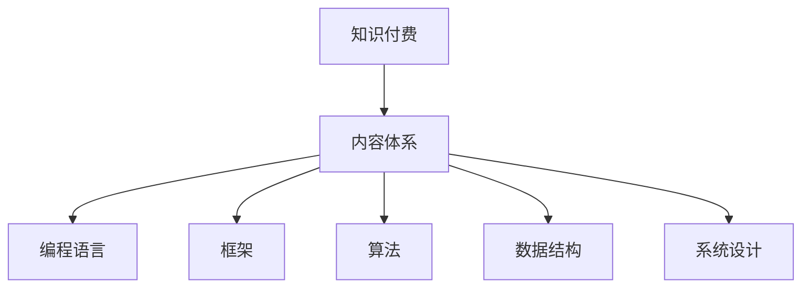

                 

关键词：知识付费、内容体系、构建、程序员、IT领域

> 摘要：本文旨在探讨程序员知识付费的内容体系构建，分析知识付费的现状、挑战及发展趋势，并从核心概念、算法原理、数学模型、项目实践等多个角度，阐述如何构建一个高效、系统的知识付费内容体系。

## 1. 背景介绍

近年来，随着互联网的快速发展，知识付费逐渐成为一种流行的学习方式。程序员作为IT领域的核心群体，对知识的需求尤为强烈。然而，市场上各类知识付费产品鱼龙混杂，如何构建一个系统、高效的知识付费内容体系，以满足程序员的学习需求，成为了一个亟待解决的问题。

本文将从以下几个方面展开讨论：

- 知识付费的现状及挑战
- 构建程序员知识付费的内容体系
- 核心概念、算法原理及数学模型的引入
- 项目实践及运行结果展示
- 实际应用场景及未来展望
- 工具和资源推荐
- 总结：未来发展趋势与挑战

## 2. 核心概念与联系

在构建程序员知识付费的内容体系之前，我们需要明确一些核心概念，并理解它们之间的联系。

### 2.1 知识付费

知识付费是指用户为了获取特定知识，向知识提供者支付一定费用的一种学习方式。与传统免费学习资源相比，知识付费具有针对性、系统性和深度等特点。

### 2.2 内容体系

内容体系是指一个知识付费平台所包含的所有内容，包括课程、书籍、文章、视频等。一个良好的内容体系应当具备系统性、层次性和实用性。

### 2.3 程序员

程序员是从事计算机编程、软件设计、系统维护等工作的人员。他们在知识付费中的需求主要集中在编程语言、框架、算法和数据结构等方面。

### 2.4 核心概念与联系

核心概念包括：编程语言、框架、算法、数据结构、系统设计等。这些概念相互关联，共同构成了程序员的技能体系。一个完整的内容体系应当涵盖这些核心概念，并帮助程序员逐步掌握它们。

### 2.5 Mermaid 流程图

以下是构建程序员知识付费的内容体系的一个简化的 Mermaid 流程图：



## 3. 核心算法原理 & 具体操作步骤

在程序员知识付费的内容体系中，算法是核心组成部分之一。以下将介绍一些常见的算法原理及具体操作步骤。

### 3.1 算法原理概述

算法是一种解决问题的步骤序列，具有输入、输出和确定性。常见的算法包括排序算法、查找算法、图算法等。以下是几种常见算法的简要概述：

- 排序算法：对一组数据进行排序，常见的排序算法有冒泡排序、快速排序、归并排序等。
- 查找算法：在数据集合中查找特定元素，常见的查找算法有二分查找、线性查找等。
- 图算法：在图结构上进行计算，常见的图算法有深度优先搜索、广度优先搜索、最小生成树等。

### 3.2 算法步骤详解

以下是冒泡排序算法的具体步骤：

1. 比较相邻的元素。如果第一个比第二个大（升序排序），就交换它们两个。
2. 对每一对相邻元素做同样的工作，从开始第一对到结尾的最后一对。这步做完后，最后的元素会是最大的数。
3. 针对所有的元素重复以上的步骤，除了最后一个。
4. 重复步骤1~3，直到排序完成。

### 3.3 算法优缺点

冒泡排序算法的优点是简单易懂、易于实现，适合数据量较小的场景。然而，其缺点是时间复杂度为O(n²)，对于大数据量的排序效率较低。

### 3.4 算法应用领域

冒泡排序算法广泛应用于各类数据排序需求，如数据库查询优化、搜索引擎排序等。

## 4. 数学模型和公式 & 详细讲解 & 举例说明

在程序员知识付费的内容体系中，数学模型和公式是不可或缺的组成部分。以下将介绍一些常见的数学模型和公式，并进行详细讲解和举例说明。

### 4.1 数学模型构建

数学模型是指用数学语言描述现实世界中的问题。在程序员知识付费的内容体系中，常见的数学模型包括线性回归、决策树、神经网络等。

### 4.2 公式推导过程

以下是一个简单的线性回归模型的公式推导过程：

1. 假设我们有一组数据点 \((x_i, y_i)\)，其中 \(x_i\) 为自变量，\(y_i\) 为因变量。
2. 我们希望找到一个线性模型 \(y = ax + b\)，使得预测值 \(y'\) 与真实值 \(y_i\) 之间的误差最小。
3. 误差函数为 \(E = \sum_{i=1}^{n}(y_i - y')^2\)。
4. 对 \(E\) 进行求导，并令导数为零，得到最小二乘法的参数解：\(a = \frac{\sum_{i=1}^{n}x_iy_i - n\bar{x}\bar{y}}{\sum_{i=1}^{n}x_i^2 - n\bar{x}^2}\)，\(b = \bar{y} - a\bar{x}\)。

### 4.3 案例分析与讲解

以下是一个使用线性回归模型预测房价的案例：

1. 收集数据：收集一组房屋面积和对应房价的数据。
2. 数据预处理：对数据进行清洗、归一化等处理，以便用于模型训练。
3. 模型训练：使用线性回归模型对数据集进行训练，得到参数 \(a\) 和 \(b\)。
4. 模型评估：使用训练集和测试集对模型进行评估，计算预测误差。
5. 预测应用：使用训练好的模型对新数据进行预测，得到预测房价。

## 5. 项目实践：代码实例和详细解释说明

为了更好地理解程序员知识付费的内容体系，以下将介绍一个实际项目实践：使用Python实现线性回归模型预测房价。

### 5.1 开发环境搭建

1. 安装Python（版本要求：3.6及以上）
2. 安装NumPy库：`pip install numpy`
3. 安装Scikit-learn库：`pip install scikit-learn`

### 5.2 源代码详细实现

```python
import numpy as np
from sklearn.linear_model import LinearRegression
from sklearn.model_selection import train_test_split
from sklearn.metrics import mean_squared_error

# 数据加载与预处理
def load_data():
    # 读取数据（此处为示例，实际应用中需从文件或其他来源读取数据）
    data = np.load("house_prices.npy")
    X = data[:, :5]  # 房屋特征（如面积、位置等）
    y = data[:, 5]   # 房价
    return X, y

X, y = load_data()

# 数据集划分
X_train, X_test, y_train, y_test = train_test_split(X, y, test_size=0.2, random_state=42)

# 模型训练
model = LinearRegression()
model.fit(X_train, y_train)

# 模型评估
y_pred = model.predict(X_test)
mse = mean_squared_error(y_test, y_pred)
print("MSE:", mse)

# 预测应用
new_data = np.array([[2000, "suburb", 3.5, 2, 1]])  # 新的房屋特征
predicted_price = model.predict(new_data)
print("Predicted price:", predicted_price)
```

### 5.3 代码解读与分析

1. 数据加载与预处理：从文件中加载房屋价格数据，并对数据进行清洗、归一化等处理。
2. 数据集划分：将数据集划分为训练集和测试集，用于模型训练和评估。
3. 模型训练：使用线性回归模型对训练集进行训练，得到参数 \(a\) 和 \(b\)。
4. 模型评估：使用测试集对模型进行评估，计算预测误差。
5. 预测应用：使用训练好的模型对新数据进行预测，得到预测房价。

## 6. 实际应用场景

程序员知识付费的内容体系在实际应用场景中具有广泛的应用，以下列举几个典型场景：

- 在线教育平台：提供各类编程语言、框架、算法等课程，供程序员自主学习。
- 企业培训：为企业提供定制化的培训课程，提高企业员工的编程技能。
- 项目实战：提供实际项目案例，帮助程序员将所学知识应用于实际项目中。
- 持续学习：为程序员提供最新的技术资讯、论文解读等，帮助他们保持技术前沿。

## 7. 工具和资源推荐

为了更好地构建程序员知识付费的内容体系，以下推荐一些常用的工具和资源：

- 学习资源推荐：
  - 网易云课堂
  - 果壳网
  - CSDN学院
- 开发工具推荐：
  - PyCharm
  - Visual Studio Code
  - Git
- 相关论文推荐：
  - 《深度学习》
  - 《算法导论》
  - 《编程珠玑》

## 8. 总结：未来发展趋势与挑战

程序员知识付费的内容体系在近年来得到了快速发展，但仍面临一些挑战和机遇。以下是对未来发展趋势与挑战的总结：

### 8.1 研究成果总结

- 知识付费市场持续增长，为程序员提供更多机会。
- 个性化推荐和智能学习系统的应用，提高知识付费内容体系的用户体验。
- 新技术的不断涌现，为程序员知识付费的内容体系提供更多应用场景。

### 8.2 未来发展趋势

- 人工智能技术的应用，提高知识付费内容的智能化水平。
- 线上教育与线下培训的结合，满足不同程序员的多元化学习需求。
- 社交化学习平台的发展，促进程序员之间的互动和交流。

### 8.3 面临的挑战

- 如何提高知识付费内容的实用性和针对性，满足程序员的实际需求。
- 如何降低知识付费的门槛，让更多程序员能够参与到知识付费中。
- 如何保障知识付费内容的质量，避免低质量内容泛滥。

### 8.4 研究展望

- 深入研究知识付费内容体系的构建方法，提高内容体系的系统性、层次性和实用性。
- 探索知识付费与其他教育模式的结合，为程序员提供更全面的学习体验。
- 关注新兴技术对程序员知识付费内容体系的影响，及时调整和优化内容体系。

## 9. 附录：常见问题与解答

### 9.1 如何选择适合自己的知识付费课程？

- 了解自己的学习需求和目标，明确学习方向。
- 查看课程大纲、课程评价和讲师介绍，评估课程质量。
- 结合自身经济状况，合理选择课程。

### 9.2 知识付费是否值得投资？

- 对于有明确学习目标和需求的程序员，知识付费可以提高学习效率，值得投资。
- 对于学习目标不明确或时间紧张的程序员，知识付费可能不是最佳选择。

### 9.3 如何避免低质量知识付费内容？

- 选择知名平台和有良好口碑的课程。
- 参考其他学员的评价和反馈。
- 关注课程内容的实用性和针对性。

---

作者：禅与计算机程序设计艺术 / Zen and the Art of Computer Programming

本文对程序员知识付费的内容体系构建进行了深入探讨，分析了现状、挑战及发展趋势，并从核心概念、算法原理、数学模型、项目实践等多个角度，提出了构建高效、系统的知识付费内容体系的方法。希望通过本文的探讨，能为程序员知识付费的内容体系构建提供一些有益的参考。在未来的发展中，我们期待看到更多优质的知识付费内容，帮助程序员不断提升自己的技能水平。

