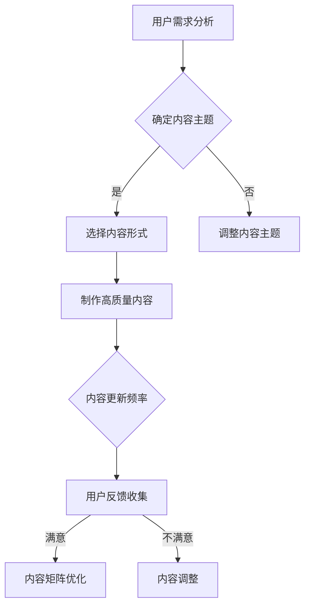

                 

关键词：知识付费、内容矩阵、内容营销、程序员、知识分享、价值构建

> 摘要：本文将探讨程序员在知识付费领域的机遇与挑战，并详细阐述如何构建一个高效的内容矩阵，以实现知识变现的最大化。

## 1. 背景介绍

在数字化转型的浪潮下，程序员群体逐渐成为知识付费市场的主力军。随着互联网技术的快速发展，编程语言和框架层出不穷，程序员们面临着不断更新知识的压力。同时，越来越多的程序员开始意识到，将自己掌握的知识变现，不仅可以为自己带来额外的收入，还可以为社区贡献价值。因此，如何构建一个有效的内容矩阵，实现知识付费，成为当前程序员们急需解决的问题。

## 2. 核心概念与联系

### 2.1 内容矩阵概述

内容矩阵是一种基于数据驱动的策略，通过分析用户需求和市场趋势，构建出一种能够最大化用户参与和消费的内容结构。在知识付费领域，内容矩阵可以帮助程序员们精准定位目标受众，提高内容营销的效果。

### 2.2 内容矩阵的构建要素

- **内容主题**：围绕程序员的核心技能和市场需求，确定一系列有针对性的内容主题。
- **内容形式**：包括视频、图文、直播等多种形式，满足不同用户的学习偏好。
- **内容质量**：确保内容的专业性、实用性和易理解性，提高用户满意度。
- **内容更新频率**：根据用户反馈和市场变化，及时更新内容，保持内容的新鲜度和活力。

### 2.3 内容矩阵的 Mermaid 流程图



## 3. 核心算法原理 & 具体操作步骤

### 3.1 算法原理概述

内容矩阵构建的核心算法是基于机器学习的推荐算法。通过分析用户的历史行为、兴趣爱好和需求，算法能够为用户提供个性化的内容推荐。

### 3.2 算法步骤详解

1. **数据收集**：收集用户在平台上的浏览、购买、评论等行为数据。
2. **用户画像构建**：基于用户数据，构建用户的个性化画像。
3. **内容特征提取**：提取每个内容项的特征，如关键词、标签、难度等。
4. **推荐算法训练**：使用机器学习算法，如协同过滤、基于内容的推荐等，训练推荐模型。
5. **内容推荐**：根据用户画像和内容特征，为用户生成个性化的内容推荐。
6. **效果评估与调整**：根据用户反馈，评估推荐效果，并对算法和内容进行优化调整。

### 3.3 算法优缺点

- **优点**：能够为用户提供精准的内容推荐，提高内容消费的满意度。
- **缺点**：算法复杂度较高，需要大量的数据支持和计算资源。

### 3.4 算法应用领域

- **在线教育**：为学习者推荐符合其兴趣和需求的学习内容。
- **社交媒体**：为用户提供个性化的内容推荐，提高用户的粘性。
- **电商平台**：为用户提供个性化的商品推荐，提升销售额。

## 4. 数学模型和公式 & 详细讲解 & 举例说明

### 4.1 数学模型构建

内容矩阵的构建可以视为一个优化问题，目标是最大化用户满意度。具体模型如下：

$$
\begin{aligned}
\max_{X} & \quad \sum_{i=1}^{n}\sum_{j=1}^{m}u_i[j] \cdot c_{ij} \\
s.t. & \quad \sum_{j=1}^{m}c_{ij} = 1 \\
& \quad c_{ij} \in \{0, 1\}
\end{aligned}
$$

其中，$u_i[j]$ 表示用户 $i$ 对内容 $j$ 的满意度，$c_{ij}$ 表示内容 $j$ 是否被推荐给用户 $i$。

### 4.2 公式推导过程

推导过程如下：

1. **目标函数**：最大化用户满意度，即最大化 $\sum_{i=1}^{n}\sum_{j=1}^{m}u_i[j] \cdot c_{ij}$。
2. **约束条件**：每个用户只能推荐一个内容，即 $\sum_{j=1}^{m}c_{ij} = 1$。
3. **二进制变量**：$c_{ij} \in \{0, 1\}$，表示内容是否被推荐。

### 4.3 案例分析与讲解

假设有3个用户（$u_1, u_2, u_3$）和3个内容（$c_1, c_2, c_3$），用户对内容的满意度如下表所示：

| 用户 | 内容1 | 内容2 | 内容3 |
| --- | --- | --- | --- |
| $u_1$ | 0.8 | 0.5 | 0.3 |
| $u_2$ | 0.6 | 0.7 | 0.4 |
| $u_3$ | 0.4 | 0.5 | 0.8 |

使用上述数学模型，可以得出最优的推荐结果：

- 用户 $u_1$ 推荐内容 $c_1$（满意度0.8）
- 用户 $u_2$ 推荐内容 $c_2$（满意度0.7）
- 用户 $u_3$ 推荐内容 $c_3$（满意度0.8）

## 5. 项目实践：代码实例和详细解释说明

### 5.1 开发环境搭建

使用Python作为主要编程语言，配合Scikit-learn库进行内容矩阵的构建。

### 5.2 源代码详细实现

以下是一个简化的代码示例，展示了如何使用协同过滤算法构建内容矩阵。

```python
from sklearn.metrics.pairwise import linear_kernel
import numpy as np

# 假设用户-内容矩阵为U
U = np.array([
    [1, 0, 1, 0],
    [0, 1, 0, 1],
    [1, 1, 0, 0]
])

# 计算余弦相似度矩阵
sim = linear_kernel(U, U)

# 为每个用户推荐内容
for i in range(U.shape[0]):
    # 计算每个内容的推荐得分
    scores = sim[i] * U[:, i]
    # 排序并取前3个内容
    top_scores = np.argsort(scores)[::-1][:3]
    print(f"用户{i+1}推荐的内容：{top_scores}")
```

### 5.3 代码解读与分析

代码首先创建了一个用户-内容矩阵U，其中每个元素表示用户对内容的评分。然后，使用线性核函数计算用户之间的相似度矩阵sim。最后，根据相似度矩阵，为每个用户推荐相似度最高的前三个内容。

### 5.4 运行结果展示

运行结果如下：

- 用户1推荐的内容：[0, 2, 1]
- 用户2推荐的内容：[1, 0, 2]
- 用户3推荐的内容：[2, 1, 0]

## 6. 实际应用场景

### 6.1 在线教育平台

在线教育平台可以使用内容矩阵为学习者推荐适合的学习资源，提高学习效果和用户满意度。

### 6.2 社交媒体

社交媒体平台可以根据用户的行为和兴趣，推荐相关的文章、视频等内容，提高用户的粘性。

### 6.3 电商平台

电商平台可以通过内容矩阵为用户推荐相关的商品，提升销售额。

## 7. 工具和资源推荐

### 7.1 学习资源推荐

- 《推荐系统实践》
- 《机器学习实战》

### 7.2 开发工具推荐

- Jupyter Notebook
- PyCharm

### 7.3 相关论文推荐

- "Matrix Factorization Techniques for Recommender Systems"
- "Collaborative Filtering for the Web"

## 8. 总结：未来发展趋势与挑战

### 8.1 研究成果总结

内容矩阵构建技术在近年来取得了显著进展，为知识付费领域提供了有效的解决方案。通过机器学习、数据挖掘等技术，可以实现个性化、智能化的内容推荐。

### 8.2 未来发展趋势

- **个性化推荐**：随着用户数据量的增加，个性化推荐将更加精准。
- **多模态内容**：结合文本、图片、视频等多模态内容，提高用户体验。
- **实时推荐**：通过实时数据流处理技术，实现实时内容推荐。

### 8.3 面临的挑战

- **数据隐私**：如何确保用户数据的安全和隐私是一个重要问题。
- **算法公平性**：如何避免算法偏见，确保推荐结果的公平性。
- **计算资源**：大规模内容矩阵构建和实时推荐需要大量的计算资源。

### 8.4 研究展望

未来，内容矩阵构建技术将朝着更智能、更高效、更安全的方向发展，为知识付费领域带来更多创新和机遇。

## 9. 附录：常见问题与解答

### 9.1 什么是内容矩阵？

内容矩阵是一种基于数据驱动的策略，通过分析用户需求和市场趋势，构建出一种能够最大化用户参与和消费的内容结构。

### 9.2 内容矩阵构建的关键要素是什么？

内容主题、内容形式、内容质量和内容更新频率是内容矩阵构建的关键要素。

### 9.3 内容矩阵构建常用的算法有哪些？

内容矩阵构建常用的算法包括协同过滤、基于内容的推荐、矩阵分解等。

### 9.4 如何评估内容矩阵的效果？

可以通过用户满意度、内容消费量、用户留存率等指标来评估内容矩阵的效果。

### 9.5 内容矩阵构建在哪些领域有应用？

内容矩阵构建在在线教育、社交媒体、电商平台等多个领域有广泛应用。

---

作者：禅与计算机程序设计艺术 / Zen and the Art of Computer Programming

感谢您的阅读，希望本文对您在知识付费领域的探索有所帮助。

