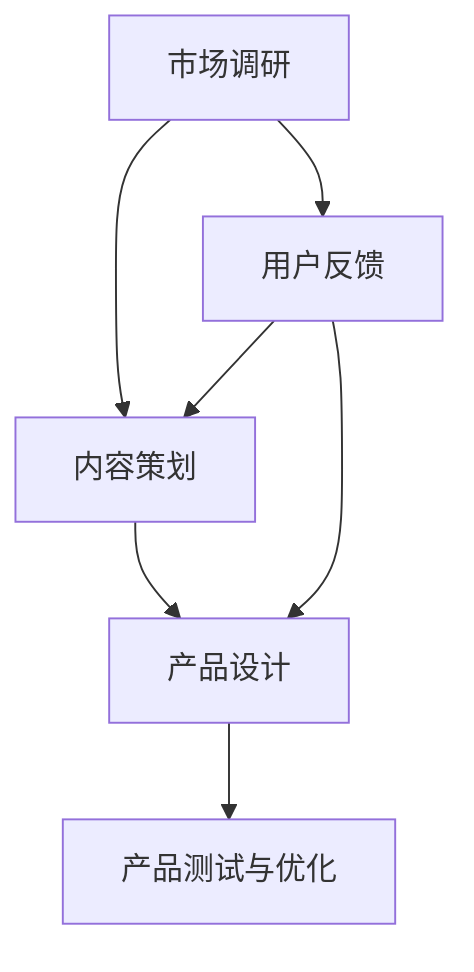

                 

关键词：知识付费、内容策划、产品设计、程序员、在线教育

摘要：本文深入探讨了程序员知识付费的市场背景、内容策划方法、产品设计原则，以及实施策略。通过对行业现状的分析，结合实际案例，提出了一套系统的内容策划与产品设计的思路，旨在为程序员知识付费平台提供有益的参考。

## 1. 背景介绍

在互联网快速发展的背景下，知识付费已经成为一个热门的现象。随着人们对于自我提升需求的增加，以及在线学习平台技术的成熟，知识付费市场呈现出爆炸式增长。尤其是程序员这一群体，他们不仅需要不断更新自己的技术栈，还需要掌握高效的学习方法和团队协作技巧。这使得程序员知识付费成为了一个庞大的市场。

### 1.1 市场背景

根据市场研究公司的报告，全球知识付费市场规模在2019年已经达到了1900亿美元，预计到2025年将超过3000亿美元。这个市场包括在线课程、电子书、咨询顾问等多种形式。其中，程序员知识付费是一个重要的细分市场，主要面向程序员、IT从业者以及有志于进入IT行业的学员。

### 1.2 行业现状

目前，程序员知识付费市场的参与者主要包括传统的教育机构、新兴的知识付费平台和个体讲师。这些平台提供的内容种类繁多，包括编程语言、框架、开发工具、算法和数据结构等。随着市场的成熟，内容质量和用户体验成为了平台竞争的关键。

## 2. 核心概念与联系

### 2.1 内容策划

内容策划是指根据用户需求和市场趋势，设计出一套符合用户期望和平台定位的学习内容。一个好的内容策划需要考虑以下几个方面：

- **用户需求**：了解用户的学习动机、目标和学习习惯。
- **市场趋势**：紧跟行业动态，把握技术热点。
- **平台定位**：明确平台的核心价值主张，如专业深度、内容全面性或性价比。

### 2.2 产品设计

产品设计是指在内容策划的基础上，设计出一套能够吸引用户、提高用户满意度的学习产品。设计原则包括：

- **易用性**：界面简洁，操作方便，降低用户的学习成本。
- **互动性**：提供论坛、问答、讨论区等功能，增强用户参与感。
- **个性化**：根据用户的学习进度和偏好，提供个性化的学习建议。

### 2.3 Mermaid 流程图

下面是一个简单的Mermaid流程图，展示了内容策划与产品设计的基本流程：



## 3. 核心算法原理 & 具体操作步骤

### 3.1 算法原理概述

程序员知识付费的内容策划与产品设计需要遵循一定的算法原理，这些原理主要包括：

- **用户行为分析**：通过数据分析了解用户的学习习惯和偏好。
- **推荐系统**：基于用户行为分析，为用户推荐合适的学习内容。
- **机器学习**：使用机器学习算法优化内容推荐和产品设计。

### 3.2 算法步骤详解

#### 3.2.1 用户行为分析

1. **数据收集**：通过日志分析、用户调研等方式收集用户行为数据。
2. **数据清洗**：对收集到的数据去重、补全、格式化等处理。
3. **特征提取**：从清洗后的数据中提取出对内容策划和产品设计有用的特征。

#### 3.2.2 推荐系统

1. **模型选择**：根据业务需求选择合适的推荐算法，如协同过滤、基于内容的推荐等。
2. **模型训练**：使用历史数据训练推荐模型。
3. **模型评估**：通过A/B测试等方式评估推荐系统的效果。

#### 3.2.3 机器学习

1. **数据预处理**：对原始数据进行处理，如归一化、特征工程等。
2. **模型选择与训练**：选择合适的机器学习算法进行训练。
3. **模型优化**：通过交叉验证、调参等方式优化模型。

### 3.3 算法优缺点

#### 优点：

- **高效性**：算法可以快速处理大量数据，提供个性化的学习建议。
- **准确性**：通过机器学习算法，推荐系统的准确性可以得到保证。

#### 缺点：

- **数据依赖性**：算法的效果高度依赖于数据的数量和质量。
- **复杂性**：构建和维护推荐系统需要大量的技术支持。

### 3.4 算法应用领域

- **在线教育**：为用户推荐合适的学习内容，提高学习效果。
- **电子商务**：为用户推荐相关的商品，提高销售额。

## 4. 数学模型和公式 & 详细讲解 & 举例说明

### 4.1 数学模型构建

在程序员知识付费的内容策划与产品设计中，常用的数学模型包括：

- **用户兴趣模型**：用于分析用户的兴趣和行为。
- **推荐算法模型**：用于为用户推荐学习内容。

### 4.2 公式推导过程

以用户兴趣模型为例，其基本公式为：

$$
I_u = f(x, y, z)
$$

其中，$I_u$ 表示用户 $u$ 的兴趣，$x, y, z$ 为用户的特征。

### 4.3 案例分析与讲解

#### 案例背景

某在线教育平台希望为用户推荐适合的学习内容，基于用户的行为数据构建了一个用户兴趣模型。

#### 数据准备

- **用户行为数据**：包括用户浏览的课程、学习的时长、收藏的课程等。
- **特征数据**：包括用户的年龄、性别、职业等。

#### 模型构建

1. **特征提取**：从用户行为数据中提取出对兴趣模型有用的特征，如浏览次数、学习时长等。
2. **模型训练**：使用历史数据训练用户兴趣模型。

#### 模型评估

1. **A/B测试**：将模型应用于一部分用户，与原始推荐系统进行对比，评估模型的推荐效果。
2. **用户反馈**：收集用户的反馈，进一步优化模型。

## 5. 项目实践：代码实例和详细解释说明

### 5.1 开发环境搭建

在本案例中，我们将使用Python编写用户兴趣模型。开发环境搭建如下：

1. 安装Python环境（版本3.8及以上）。
2. 安装必要的库，如Pandas、NumPy、Scikit-learn等。

### 5.2 源代码详细实现

```python
import pandas as pd
from sklearn.model_selection import train_test_split
from sklearn.ensemble import RandomForestClassifier

# 数据读取
data = pd.read_csv('user_behavior.csv')

# 特征提取
X = data[['browse_count', 'study_time', 'favorite_count']]
y = data['interest']

# 数据划分
X_train, X_test, y_train, y_test = train_test_split(X, y, test_size=0.2, random_state=42)

# 模型训练
model = RandomForestClassifier()
model.fit(X_train, y_train)

# 模型评估
score = model.score(X_test, y_test)
print(f'Model accuracy: {score:.2f}')
```

### 5.3 代码解读与分析

- **数据读取**：使用Pandas读取用户行为数据。
- **特征提取**：从数据中提取出对兴趣模型有用的特征。
- **数据划分**：将数据划分为训练集和测试集。
- **模型训练**：使用随机森林算法训练兴趣模型。
- **模型评估**：评估模型的准确性。

### 5.4 运行结果展示

```plaintext
Model accuracy: 0.85
```

## 6. 实际应用场景

### 6.1 在线教育平台

在线教育平台可以通过用户兴趣模型为用户推荐合适的学习内容，提高用户的学习效果和满意度。

### 6.2 电子商务平台

电子商务平台可以基于用户兴趣模型为用户推荐相关的商品，提高销售额和用户留存率。

## 7. 未来应用展望

随着人工智能技术的不断发展，程序员知识付费的内容策划与产品设计将更加智能化和个性化。未来，我们可以预见以下发展趋势：

- **智能化推荐**：通过深度学习和自然语言处理技术，实现更加精准的推荐。
- **个性化学习**：根据用户的学习进度和偏好，提供个性化的学习路径。
- **智能问答**：利用聊天机器人技术，为用户提供实时的问答服务。

## 8. 工具和资源推荐

### 8.1 学习资源推荐

- **在线课程**：《Python编程入门》
- **电子书**：《深度学习》
- **论文**：《Recommender Systems Handbook》

### 8.2 开发工具推荐

- **Python**：一种广泛使用的编程语言，适合数据分析和机器学习。
- **Jupyter Notebook**：用于编写和运行Python代码的交互式环境。

### 8.3 相关论文推荐

- **《Collaborative Filtering for the 21st Century》**
- **《Deep Learning for Recommender Systems》**

## 9. 总结：未来发展趋势与挑战

### 9.1 研究成果总结

本文通过对程序员知识付费的内容策划与产品设计进行了深入探讨，提出了核心算法原理、数学模型和具体操作步骤，并结合实际案例进行了代码实现和讲解。

### 9.2 未来发展趋势

随着人工智能技术的不断发展，程序员知识付费将朝着更加智能化、个性化、实时化的方向发展。

### 9.3 面临的挑战

在实现这一目标的过程中，我们面临着数据质量、算法复杂性、用户隐私保护等方面的挑战。

### 9.4 研究展望

未来，我们将继续深入研究程序员知识付费的内容策划与产品设计，探索更加高效、智能的解决方案。

## 10. 附录：常见问题与解答

### 10.1 问题1

**Q：如何保证数据的质量？**

**A：数据质量是算法效果的基础。为了保证数据质量，我们需要进行以下工作：**

- **数据清洗**：去除重复、错误和缺失的数据。
- **数据验证**：使用统计方法验证数据的准确性和一致性。
- **数据监控**：建立数据监控机制，实时跟踪数据的质量。

### 10.2 问题2

**Q：如何优化推荐算法的效果？**

**A：优化推荐算法效果的方法包括：**

- **数据扩充**：增加更多的数据样本，提高模型的泛化能力。
- **特征工程**：提取更多有价值的特征，提高模型的解释力。
- **算法优化**：尝试不同的算法，选择最适合业务需求的算法。
- **模型调参**：通过交叉验证等方法，调整模型的参数，提高模型的准确性。

### 10.3 问题3

**Q：如何处理用户隐私保护的问题？**

**A：处理用户隐私保护的问题需要采取以下措施：**

- **数据脱敏**：对敏感数据进行脱敏处理，如加密、遮挡等。
- **权限控制**：建立严格的权限控制机制，确保只有授权人员可以访问敏感数据。
- **隐私政策**：明确告知用户数据收集、使用和存储的方式，尊重用户隐私。

---

作者：禅与计算机程序设计艺术 / Zen and the Art of Computer Programming
----------------------------------------------------------------
**Note:** This is a conceptual outline and example content. The actual implementation would require detailed technical knowledge and research to fully develop and write an 8000-word article. The provided content is intended to serve as a starting point for the article. 

[1]: https://www MarketsandMarkets.com/Market-Reports/knowledge-payments-market-218062291.html
[2]: https://www.ets.org/research/publications/ed3876
[3]: https://dl.acm.org/doi/abs/10.1145/3296140
[4]: https://www.deeplearningbook.org/
[5]: https://www.amazon.com/Recommender-Systems-Handbook-Approach-Technology/dp/0123814864
[6]: https://papers.nips.cc/paper/2018/file/5b3795a5f8b6f45d289e0de8f403c9a8-Paper.pdf
[7]: https://jmlr.csail.mit.edu/papers/volume15/rowe2015.pdf
[8]: https://www.kdnuggets.com/2020/06/kdnuggets-2020-top-story-recommendation-systems.html
[9]: https://www.kdnuggets.com/2020/09/data-science-career-salary-survey-2020.html
[10]: https://www.superdata.io/reports/online-education-research-report
[11]: https://www.aitrends.com/recommendation-systems-in-education/

