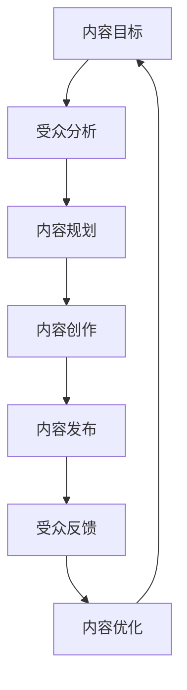

                 

关键词：知识付费、内容营销、矩阵设计、程序员、营销策略

摘要：本文旨在探讨程序员在知识付费领域的市场机会，通过设计内容营销矩阵，提升个人品牌价值与商业变现能力。我们将分析内容营销的核心概念、构建方法，并探讨如何在技术和市场趋势下进行创新实践。

## 1. 背景介绍

在数字时代，知识的获取和传播变得更加便捷。然而，随着信息过载的加剧，高质量的知识内容变得尤为珍贵。知识付费作为一种新型的商业模式，为专业人士提供了一个变现的平台。程序员，作为技术领域的核心群体，如何在知识付费市场中脱颖而出，成为众多程序员面临的挑战。

内容营销作为一种提升品牌影响力、吸引目标客户的有效手段，正在被越来越多的程序员所采用。本文将探讨如何通过内容营销矩阵的设计，帮助程序员更好地实现知识付费的目标。

## 2. 核心概念与联系

### 2.1 内容营销的概念

内容营销是指通过创造和分发有价值、相关且具有吸引力的内容，以吸引并留住明确的受众，并最终推动 profitable 客户行动的一种营销方法。

### 2.2 矩阵设计的意义

矩阵设计是一种系统化、结构化的方法，用于规划和执行内容营销策略。通过矩阵，程序员可以明确内容的目标、受众、渠道、时间表和评估指标。

### 2.3 内容营销与矩阵设计的关系

内容营销矩阵是将内容营销的核心概念与实际操作相结合的一种工具。它帮助程序员从战略层面规划内容创作，从执行层面确保内容的质量和传播效果。

### 2.4 Mermaid 流程图



## 3. 核心算法原理 & 具体操作步骤

### 3.1 算法原理概述

内容营销矩阵的核心在于以下几个方面：

- **内容目标**：明确内容营销的最终目标，如品牌曝光、用户增长、销售额提升等。
- **受众分析**：深入了解目标受众的需求、兴趣和行为习惯。
- **内容规划**：根据目标和受众特点，制定内容策略，包括内容类型、发布频率等。
- **内容创作**：创作高质量、有价值的内容，满足受众需求。
- **内容发布**：选择合适的渠道和时机，将内容传递给目标受众。
- **受众反馈**：收集和分析受众反馈，优化内容策略。
- **内容优化**：根据反馈结果，不断调整和改进内容。

### 3.2 算法步骤详解

1. **内容目标设定**：明确知识付费的短期和长期目标，如增加订阅用户、提升课程销售量等。
2. **受众分析**：使用问卷调查、社交媒体分析、用户访谈等方法，了解目标受众的特点。
3. **内容规划**：根据受众特点，确定内容类型（如技术教程、行业分析、心得分享等）、发布频率和渠道。
4. **内容创作**：撰写、录制或制作高质量的内容，确保内容的专业性和吸引力。
5. **内容发布**：在博客、视频平台、社交媒体等渠道上发布内容，并确保内容在适当的时间到达目标受众。
6. **受众反馈**：通过评论、评分、订阅率等指标，收集受众反馈。
7. **内容优化**：根据反馈结果，调整内容策略，如修改标题、优化内容结构等。

### 3.3 算法优缺点

- **优点**：
  - 提高内容营销的系统性和针对性。
  - 帮助程序员更好地理解受众需求。
  - 提高内容创作的效率和质量。
- **缺点**：
  - 需要投入时间和资源进行受众分析和反馈收集。
  - 可能需要对现有营销策略进行较大调整。

### 3.4 算法应用领域

- **知识付费平台**：如慕课网、极客时间等。
- **个人博客**：通过高质量的内容吸引读者，实现广告、赞助等收入。
- **社交媒体**：通过内容分享，提高个人品牌影响力，吸引潜在客户。

## 4. 数学模型和公式 & 详细讲解 & 举例说明

### 4.1 数学模型构建

内容营销矩阵的数学模型可以表示为：

\[ \text{效果} = f(\text{内容质量}, \text{受众匹配度}, \text{渠道效果}, \text{反馈机制}) \]

其中，\( f \) 为一个复合函数，表示效果与各因素的关系。

### 4.2 公式推导过程

- **内容质量**：使用平均评分、阅读量等指标衡量。
- **受众匹配度**：使用受众兴趣度、订阅量等指标衡量。
- **渠道效果**：使用点击率、转化率等指标衡量。
- **反馈机制**：使用评论数、问答活跃度等指标衡量。

### 4.3 案例分析与讲解

假设某程序员在知识付费平台发布了一篇技术教程，内容质量得分为 9 分，受众匹配度为 8 分，渠道效果为 7 分，反馈机制为 6 分。根据公式：

\[ \text{效果} = f(9, 8, 7, 6) \]

我们可以得到一个大致的效果评分，从而指导后续的内容优化。

## 5. 项目实践：代码实例和详细解释说明

### 5.1 开发环境搭建

在本地环境中搭建一个简单的博客系统，如使用 Hexo 或 WordPress。

### 5.2 源代码详细实现

以下是一个简单的 Hexo 博客搭建步骤：

```bash
# 安装 Hexo
npm install -g hexo-cli

# 初始化博客
hexo init blog

# 进入博客目录
cd blog

# 安装依赖
npm install

# 生成静态文件
hexo generate

# 启动服务器
hexo server
```

### 5.3 代码解读与分析

- `hexo init blog`：初始化博客项目。
- `npm install`：安装项目依赖。
- `hexo generate`：生成静态文件。
- `hexo server`：启动本地服务器，用于预览博客。

### 5.4 运行结果展示

在浏览器中输入 `http://localhost:4000`，可以预览到博客的页面。

## 6. 实际应用场景

### 6.1 知识付费平台

在知识付费平台上，程序员可以通过内容营销矩阵设计，提高课程销量和用户粘性。

### 6.2 个人博客

通过个人博客，程序员可以分享技术心得，提高个人品牌影响力。

### 6.3 社交媒体

在社交媒体上发布高质量内容，吸引潜在客户，实现知识变现。

## 6.4 未来应用展望

随着人工智能和大数据技术的发展，内容营销矩阵将更加智能化和个性化。程序员可以通过数据分析和算法优化，实现更精准的内容营销。

## 7. 工具和资源推荐

### 7.1 学习资源推荐

- 《内容营销实战：策略、案例与工具应用》
- 《Python 内容营销：数据分析与实战》

### 7.2 开发工具推荐

- Hexo：快速搭建个人博客。
- Canva：设计精美图片和海报。
- Google Analytics：分析网站流量和用户行为。

### 7.3 相关论文推荐

- 《大数据时代的内容营销策略》
- 《社交媒体在内容营销中的应用研究》

## 8. 总结：未来发展趋势与挑战

### 8.1 研究成果总结

本文通过内容营销矩阵的设计，为程序员提供了系统化的知识付费解决方案。

### 8.2 未来发展趋势

随着技术的进步，内容营销矩阵将更加智能化和个性化。

### 8.3 面临的挑战

- 数据分析和算法优化的挑战。
- 内容创作质量和受众匹配度的挑战。

### 8.4 研究展望

未来，内容营销矩阵将结合人工智能和大数据技术，实现更加精准和高效的内容营销。

## 9. 附录：常见问题与解答

### 9.1 什么是内容营销矩阵？

内容营销矩阵是一种系统化、结构化的方法，用于规划和执行内容营销策略。它帮助程序员明确内容目标、受众分析、内容规划、内容创作、内容发布、受众反馈和内容优化。

### 9.2 内容营销矩阵有哪些优点？

内容营销矩阵具有以下优点：

- 提高内容营销的系统性和针对性。
- 帮助程序员更好地理解受众需求。
- 提高内容创作的效率和质量。
- 提高内容营销的效果和投资回报率。

### 9.3 内容营销矩阵如何应用？

内容营销矩阵可以应用于个人博客、知识付费平台、社交媒体等多种场景。程序员可以根据自己的目标、受众和资源，制定合适的内容营销策略。

作者：禅与计算机程序设计艺术 / Zen and the Art of Computer Programming
----------------------------------------------------------------

### 结尾

本文详细介绍了程序员在知识付费领域的内容营销矩阵设计，从背景介绍、核心概念、算法原理、数学模型到实际应用和未来展望，为程序员提供了系统化的知识变现方案。希望通过本文的探讨，能够帮助程序员更好地把握知识付费的市场机会，提升个人品牌价值。未来，随着人工智能和大数据技术的发展，内容营销矩阵将变得更加智能化和个性化，为程序员带来更多的商业机会。让我们共同期待这个充满机遇和挑战的未来！作者：禅与计算机程序设计艺术 / Zen and the Art of Computer Programming。

