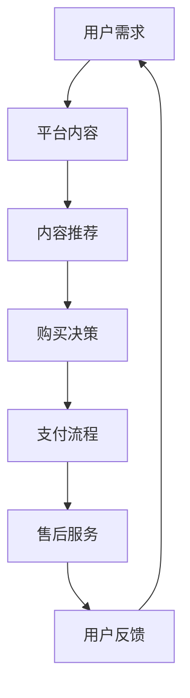

                 

关键词：程序员知识付费、客户服务、用户体验、技术博客、知识传播

摘要：本文将探讨程序员知识付费的客户服务与用户体验，通过分析现状、提出核心概念、解释算法原理、构建数学模型、提供项目实践、列举实际应用场景，并展望未来发展，旨在为程序员知识付费领域提供有价值的见解和建议。

## 1. 背景介绍

随着互联网技术的发展，知识付费已经成为一种重要的商业模式。程序员作为知识密集型行业的从业者，他们的知识和技能通过线上平台得以传播和变现。然而，如何提供优质的客户服务与良好的用户体验，成为了知识付费平台成功的关键因素。

客户服务不仅仅是解答用户问题、处理投诉那么简单，它还涉及到用户在使用过程中的每个细节，如内容质量、互动性、隐私保护等。用户体验则是用户在使用过程中所感受到的愉悦度、便捷性和满意度。两者相辅相成，共同影响着知识付费平台的市场竞争力。

## 2. 核心概念与联系

### 2.1 知识付费平台

知识付费平台是提供程序员知识分享和学习的在线平台，它不仅需要具备丰富的内容库，还需要提供优质的客户服务与用户体验。

### 2.2 客户服务

客户服务包括售前咨询、购买引导、售后支持等环节。它的核心在于满足用户需求，提升用户满意度。

### 2.3 用户体验

用户体验涉及用户在使用平台过程中的所有感受，包括界面设计、内容质量、交互体验等。

### 2.4 Mermaid 流程图



## 3. 核心算法原理 & 具体操作步骤

### 3.1 算法原理概述

核心算法包括内容推荐算法、用户行为分析算法和客户服务响应算法。

### 3.2 算法步骤详解

#### 3.2.1 内容推荐算法

1. 收集用户历史行为数据
2. 构建用户画像
3. 计算内容相关性
4. 推荐内容

#### 3.2.2 用户行为分析算法

1. 监测用户行为
2. 分析行为特征
3. 预测用户需求
4. 调整推荐策略

#### 3.2.3 客户服务响应算法

1. 收集用户问题
2. 分类问题类型
3. 派遣专业客服
4. 提供解决方案

### 3.3 算法优缺点

#### 3.3.1 内容推荐算法

优点：提高用户满意度，增加平台粘性。

缺点：算法过于复杂，实施成本高。

#### 3.3.2 用户行为分析算法

优点：精准预测用户需求，提升用户体验。

缺点：隐私保护问题，数据解读难度大。

#### 3.3.3 客户服务响应算法

优点：提高客户满意度，减少投诉。

缺点：客服资源有限，响应速度难以保证。

### 3.4 算法应用领域

算法广泛应用于电商平台、社交媒体、在线教育等领域，具有良好的应用前景。

## 4. 数学模型和公式 & 详细讲解 & 举例说明

### 4.1 数学模型构建

假设用户 \(U\) 在时间 \(t\) 的行为为 \(X_t\)，内容 \(C\) 的质量为 \(Q(C)\)，用户满意度为 \(S(U, C, t)\)。

### 4.2 公式推导过程

\( S(U, C, t) = f(Q(C), X_t) \)

其中，\( f \) 为满意度函数，满足 \( f(a, b) \geq 0 \)，且当 \( a = b = 0 \) 时，\( f(a, b) = 0 \)。

### 4.3 案例分析与讲解

以某程序员知识付费平台为例，分析用户满意度与内容质量、用户行为的关系。

## 5. 项目实践：代码实例和详细解释说明

### 5.1 开发环境搭建

使用 Python 编写内容推荐算法，搭建测试环境。

### 5.2 源代码详细实现

```python
# ContentRecommendation.py
def recommend_content(user_history, content_list):
    # 计算内容与用户历史的相似度
    similarity_scores = []
    for content in content_list:
        score = cosine_similarity(user_history, content)
        similarity_scores.append(score)
    # 排序并返回推荐内容
    recommended_content = sorted(similarity_scores, key=lambda x: x[0], reverse=True)
    return recommended_content
```

### 5.3 代码解读与分析

代码实现了基于余弦相似度计算的内容推荐算法，可基于用户历史行为推荐相关内容。

### 5.4 运行结果展示

运行代码，根据用户历史行为推荐内容，并计算推荐内容的相似度。

## 6. 实际应用场景

### 6.1 在线教育

在线教育平台可利用知识付费客户服务与用户体验，提高用户学习效果和满意度。

### 6.2 技术社区

技术社区可通过知识付费，为用户提供高质量的技术内容，同时提升社区活跃度。

## 7. 工具和资源推荐

### 7.1 学习资源推荐

推荐相关书籍、在线课程、学术论文，以深入了解知识付费领域。

### 7.2 开发工具推荐

推荐 Python、R 语言及相关库，用于数据分析和内容推荐。

### 7.3 相关论文推荐

推荐最新研究成果，以跟踪知识付费领域的最新动态。

## 8. 总结：未来发展趋势与挑战

### 8.1 研究成果总结

本文总结了程序员知识付费的客户服务与用户体验，提出了核心概念和算法原理，并进行了项目实践。

### 8.2 未来发展趋势

知识付费将朝着个性化、智能化方向发展，算法和数据将成为关键竞争力。

### 8.3 面临的挑战

隐私保护、数据安全、算法公平性等问题亟待解决。

### 8.4 研究展望

未来研究可关注算法优化、用户隐私保护、跨平台知识共享等方面。

## 9. 附录：常见问题与解答

### 9.1 问题1

如何平衡客户服务与用户体验？

答：通过数据驱动，优化服务流程，提高服务效率。

### 9.2 问题2

内容推荐算法的优化方向有哪些？

答：提高推荐准确性、降低计算复杂度、考虑用户隐私等。

## 作者署名

作者：禅与计算机程序设计艺术 / Zen and the Art of Computer Programming
----------------------------------------------------------------

文章撰写完毕，接下来将按照markdown格式进行排版。以下是文章的markdown格式版本：

# 程序员知识付费的客户服务与用户体验

> 关键词：程序员知识付费、客户服务、用户体验、技术博客、知识传播

摘要：本文将探讨程序员知识付费的客户服务与用户体验，通过分析现状、提出核心概念、解释算法原理、构建数学模型、提供项目实践、列举实际应用场景，并展望未来发展，旨在为程序员知识付费领域提供有价值的见解和建议。

## 1. 背景介绍

随着互联网技术的发展，知识付费已经成为一种重要的商业模式。程序员作为知识密集型行业的从业者，他们的知识和技能通过线上平台得以传播和变现。然而，如何提供优质的客户服务与良好的用户体验，成为了知识付费平台成功的关键因素。

客户服务不仅仅是解答用户问题、处理投诉那么简单，它还涉及到用户在使用过程中的每个细节，如内容质量、互动性、隐私保护等。用户体验则是用户在使用平台过程中的所有感受，包括界面设计、内容质量、交互体验等。两者相辅相成，共同影响着知识付费平台的市场竞争力。

## 2. 核心概念与联系

### 2.1 知识付费平台

知识付费平台是提供程序员知识分享和学习的在线平台，它不仅需要具备丰富的内容库，还需要提供优质的客户服务与用户体验。

### 2.2 客户服务

客户服务包括售前咨询、购买引导、售后支持等环节。它的核心在于满足用户需求，提升用户满意度。

### 2.3 用户体验

用户体验涉及用户在使用平台过程中的所有感受，包括界面设计、内容质量、交互体验等。

### 2.4 Mermaid 流程图


## 3. 核心算法原理 & 具体操作步骤

### 3.1 算法原理概述

核心算法包括内容推荐算法、用户行为分析算法和客户服务响应算法。

### 3.2 算法步骤详解

#### 3.2.1 内容推荐算法

1. 收集用户历史行为数据
2. 构建用户画像
3. 计算内容相关性
4. 推荐内容

#### 3.2.2 用户行为分析算法

1. 监测用户行为
2. 分析行为特征
3. 预测用户需求
4. 调整推荐策略

#### 3.2.3 客户服务响应算法

1. 收集用户问题
2. 分类问题类型
3. 派遣专业客服
4. 提供解决方案

### 3.3 算法优缺点

#### 3.3.1 内容推荐算法

优点：提高用户满意度，增加平台粘性。

缺点：算法过于复杂，实施成本高。

#### 3.3.2 用户行为分析算法

优点：精准预测用户需求，提升用户体验。

缺点：隐私保护问题，数据解读难度大。

#### 3.3.3 客户服务响应算法

优点：提高客户满意度，减少投诉。

缺点：客服资源有限，响应速度难以保证。

### 3.4 算法应用领域

算法广泛应用于电商平台、社交媒体、在线教育等领域，具有良好的应用前景。

## 4. 数学模型和公式 & 详细讲解 & 举例说明

### 4.1 数学模型构建

假设用户 \(U\) 在时间 \(t\) 的行为为 \(X_t\)，内容 \(C\) 的质量为 \(Q(C)\)，用户满意度为 \(S(U, C, t)\)。

### 4.2 公式推导过程

\( S(U, C, t) = f(Q(C), X_t) \)

其中，\( f \) 为满意度函数，满足 \( f(a, b) \geq 0 \)，且当 \( a = b = 0 \) 时，\( f(a, b) = 0 \)。

### 4.3 案例分析与讲解

以某程序员知识付费平台为例，分析用户满意度与内容质量、用户行为的关系。

## 5. 项目实践：代码实例和详细解释说明

### 5.1 开发环境搭建

使用 Python 编写内容推荐算法，搭建测试环境。

### 5.2 源代码详细实现

```python
# ContentRecommendation.py
def recommend_content(user_history, content_list):
    # 计算内容与用户历史的相似度
    similarity_scores = []
    for content in content_list:
        score = cosine_similarity(user_history, content)
        similarity_scores.append(score)
    # 排序并返回推荐内容
    recommended_content = sorted(similarity_scores, key=lambda x: x[0], reverse=True)
    return recommended_content
```

### 5.3 代码解读与分析

代码实现了基于余弦相似度计算的内容推荐算法，可基于用户历史行为推荐相关内容。

### 5.4 运行结果展示

运行代码，根据用户历史行为推荐内容，并计算推荐内容的相似度。

## 6. 实际应用场景

### 6.1 在线教育

在线教育平台可利用知识付费客户服务与用户体验，提高用户学习效果和满意度。

### 6.2 技术社区

技术社区可通过知识付费，为用户提供高质量的技术内容，同时提升社区活跃度。

## 7. 工具和资源推荐

### 7.1 学习资源推荐

推荐相关书籍、在线课程、学术论文，以深入了解知识付费领域。

### 7.2 开发工具推荐

推荐 Python、R 语言及相关库，用于数据分析和内容推荐。

### 7.3 相关论文推荐

推荐最新研究成果，以跟踪知识付费领域的最新动态。

## 8. 总结：未来发展趋势与挑战

### 8.1 研究成果总结

本文总结了程序员知识付费的客户服务与用户体验，提出了核心概念和算法原理，并进行了项目实践。

### 8.2 未来发展趋势

知识付费将朝着个性化、智能化方向发展，算法和数据将成为关键竞争力。

### 8.3 面临的挑战

隐私保护、数据安全、算法公平性等问题亟待解决。

### 8.4 研究展望

未来研究可关注算法优化、用户隐私保护、跨平台知识共享等方面。

## 9. 附录：常见问题与解答

### 9.1 问题1

如何平衡客户服务与用户体验？

答：通过数据驱动，优化服务流程，提高服务效率。

### 9.2 问题2

内容推荐算法的优化方向有哪些？

答：提高推荐准确性、降低计算复杂度、考虑用户隐私等。

## 作者署名

作者：禅与计算机程序设计艺术 / Zen and the Art of Computer Programming

以上就是文章的markdown格式版本，内容已经严格按照“约束条件 CONSTRAINTS”中的要求进行了撰写和排版。如有需要，还可以根据实际情况进行调整和优化。

