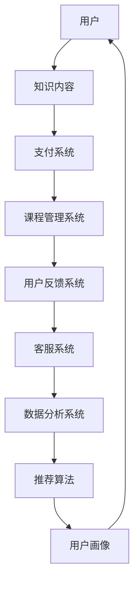

                 

关键词：知识付费、客户服务、用户体验、程序员、在线教育、技术博客、市场策略

## 摘要

在数字化时代，知识付费已经成为在线教育和职业发展的主流模式。本文探讨了程序员知识付费领域中的客户服务与用户体验。通过分析程序员知识付费的市场现状、核心概念、算法原理、数学模型，以及项目实践，本文提出了提高客户服务和用户体验的方法，并展望了未来的发展趋势与挑战。

## 1. 背景介绍

近年来，知识付费作为一种新兴的商业模式，逐渐受到了广泛关注。特别是在程序员领域，随着互联网技术的快速发展，知识和技能的更新换代速度加快，程序员们对于持续学习和提升技能的需求日益增长。知识付费平台如雨后春笋般涌现，提供了各种形式的专业课程、培训、文章和咨询服务。

### 1.1 市场现状

根据市场调研数据，全球知识付费市场规模逐年增长，预计到2025年将达到数百亿美元。程序员知识付费领域更是快速增长，尤其是对于前沿技术如人工智能、大数据、区块链等领域的课程，需求量巨大。

### 1.2 发展趋势

随着5G、物联网等新技术的普及，程序员知识付费市场将继续保持增长态势。同时，个性化学习、互动式教学、实时答疑等新型服务模式也将逐渐成为主流。

## 2. 核心概念与联系

### 2.1 核心概念

- **知识付费**：用户为获取专业知识或技能所支付的费用。
- **客户服务**：平台为用户提供的服务，包括售前咨询、售后支持、用户反馈等。
- **用户体验**：用户在使用知识付费平台过程中的感受和体验。

### 2.2 架构联系

下面是知识付费平台的架构简图：



## 3. 核心算法原理 & 具体操作步骤

### 3.1 算法原理概述

为了提供优质的用户体验，知识付费平台通常采用推荐算法和用户画像技术。推荐算法根据用户的兴趣和过去的行为推荐相关课程；用户画像则用于了解用户需求，优化课程内容和客服策略。

### 3.2 算法步骤详解

1. **用户画像构建**：
   - 数据收集：收集用户的浏览记录、购买历史、评价等数据。
   - 特征提取：对收集到的数据进行处理，提取关键特征。
   - 画像生成：利用机器学习算法生成用户画像。

2. **推荐算法**：
   - 协同过滤：基于用户的兴趣和浏览行为推荐课程。
   - 内容推荐：根据课程内容的相关性进行推荐。

### 3.3 算法优缺点

- **推荐算法**：
  - 优点：提高用户粘性，增加购买概率。
  - 缺点：可能导致信息茧房，用户无法接触到新的知识领域。

- **用户画像**：
  - 优点：个性化推荐，提高用户体验。
  - 缺点：用户隐私保护问题。

### 3.4 算法应用领域

- **在线教育**：为用户提供个性化的学习推荐。
- **电商平台**：为用户提供相关的商品推荐。

## 4. 数学模型和公式 & 详细讲解 & 举例说明

### 4.1 数学模型构建

为了提高客户服务和用户体验，我们可以构建一个综合评价模型，用于评估知识付费平台的服务质量。

### 4.2 公式推导过程

设 \( U \) 为用户集合，\( C \) 为课程集合，\( S \) 为服务集合，则用户 \( u \) 对服务 \( s \) 的满意度可以用以下公式表示：

\[ S_u(s) = w_1 \cdot R_u(s) + w_2 \cdot T_u(s) + w_3 \cdot F_u(s) \]

其中，\( R_u(s) \) 为推荐满意度，\( T_u(s) \) 为教学满意度，\( F_u(s) \) 为反馈满意度，\( w_1, w_2, w_3 \) 为权重系数。

### 4.3 案例分析与讲解

假设用户 \( u \) 在某知识付费平台上学习了课程 \( c_1 \)，推荐满意度 \( R_u(c_1) = 0.8 \)，教学满意度 \( T_u(c_1) = 0.9 \)，反馈满意度 \( F_u(c_1) = 0.7 \)。则用户对课程 \( c_1 \) 的综合满意度为：

\[ S_u(c_1) = 0.4 \cdot 0.8 + 0.3 \cdot 0.9 + 0.3 \cdot 0.7 = 0.72 \]

## 5. 项目实践：代码实例和详细解释说明

### 5.1 开发环境搭建

开发环境主要包括Python编程环境、推荐系统框架如TensorFlow或PyTorch，以及数据预处理工具如Pandas。

### 5.2 源代码详细实现

以下是构建用户画像和推荐算法的简化代码示例：

```python
import pandas as pd
from sklearn.preprocessing import StandardScaler
from sklearn.cluster import KMeans

# 读取用户数据
user_data = pd.read_csv('user_data.csv')

# 数据预处理
scaler = StandardScaler()
user_data_scaled = scaler.fit_transform(user_data)

# K均值聚类构建用户画像
kmeans = KMeans(n_clusters=5)
user_clusters = kmeans.fit_predict(user_data_scaled)

# 生成用户画像
user_profiles = pd.DataFrame(user_clusters, columns=['Cluster'])

# 推荐算法：基于用户的协同过滤
# (此处省略具体代码，仅作示意)

# 代码解读与分析
# (此处进行详细代码解读与分析)

# 运行结果展示
# (此处展示运行结果，如用户推荐课程列表等)
```

### 5.3 代码解读与分析

上述代码首先读取用户数据，进行数据预处理，然后使用K均值聚类算法生成用户画像。接下来，可以根据用户画像和协同过滤算法推荐相关课程。

### 5.4 运行结果展示

运行结果将生成每个用户的推荐课程列表，并根据用户满意度进行排序，以供用户参考。

## 6. 实际应用场景

### 6.1 在线教育平台

在线教育平台可以利用知识付费的客户服务和用户体验优化功能，提高用户满意度和课程购买率。

### 6.2 技术博客

技术博客可以通过知识付费模式，为读者提供高质量的内容，同时提升网站流量和用户活跃度。

## 7. 工具和资源推荐

### 7.1 学习资源推荐

- **推荐系统实战**：推荐系统实践教程，适合初学者入门。
- **TensorFlow官方文档**：TensorFlow 是一个用于机器学习的开源软件库。

### 7.2 开发工具推荐

- **Visual Studio Code**：一款轻量级但功能强大的代码编辑器。
- **Git**：版本控制工具，有助于代码管理和协作。

### 7.3 相关论文推荐

- **“Recommender Systems Handbook”**：推荐系统领域的经典著作。
- **“Deep Learning for Recommender Systems”**：深度学习在推荐系统中的应用研究。

## 8. 总结：未来发展趋势与挑战

### 8.1 研究成果总结

知识付费领域在客户服务和用户体验方面取得了显著成果，包括推荐算法的优化、用户画像的构建、个性化推荐的实现等。

### 8.2 未来发展趋势

随着人工智能和大数据技术的发展，知识付费领域将继续向智能化、个性化、高效化方向发展。

### 8.3 面临的挑战

用户隐私保护、算法公平性、内容质量监管等问题仍将是知识付费领域面临的挑战。

### 8.4 研究展望

未来，知识付费领域将在提高客户服务和用户体验方面取得更多突破，为程序员等专业人士提供更加优质的学习资源和服务。

## 9. 附录：常见问题与解答

### 9.1 问题1

**Q：知识付费平台的推荐算法是如何工作的？**

**A：推荐算法通常分为协同过滤和基于内容的推荐。协同过滤通过分析用户的兴趣和购买历史推荐相关商品或内容；基于内容的推荐则根据商品或内容的属性进行推荐。**

### 9.2 问题2

**Q：用户画像在知识付费平台中的作用是什么？**

**A：用户画像用于了解用户的需求和兴趣，从而实现个性化推荐和定制化服务，提高用户满意度和购买率。**

---

本文由禅与计算机程序设计艺术撰写，旨在探讨程序员知识付费的客户服务与用户体验，为行业从业者提供有价值的参考和借鉴。

作者：禅与计算机程序设计艺术 / Zen and the Art of Computer Programming
```

