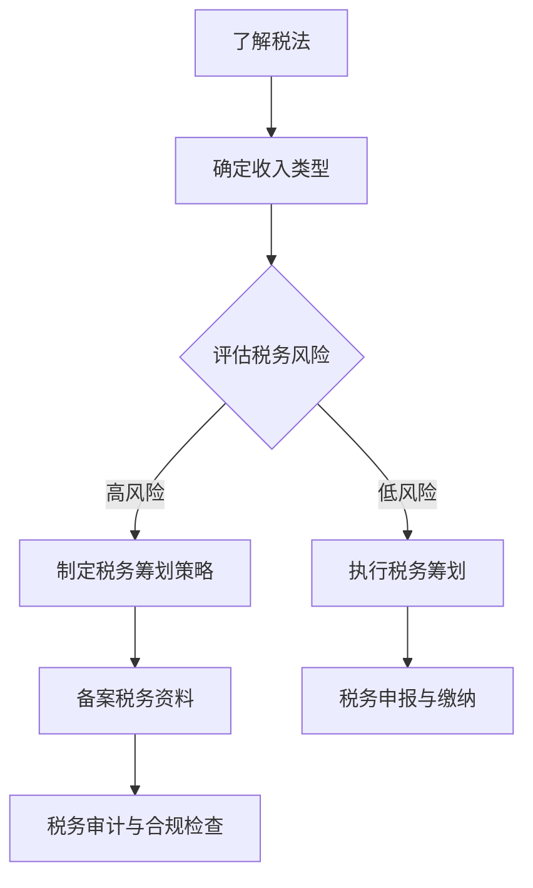

                 

关键词：税务筹划，程序员，知识付费，税法，税务优化，合规性，财务策略，税务减免，投资策略

## 摘要

在数字化时代，知识付费已成为程序员获取额外收入的重要途径。然而，伴随而来的税务问题也日益复杂。本文旨在深入探讨程序员在从事知识付费活动中的税务筹划，分析相关税法规定，提供具体的税务优化策略和合规性建议，旨在帮助程序员合理避税、合规经营，实现财务自由。

## 1. 背景介绍

随着互联网技术的发展，知识付费平台如雨后春笋般涌现，为广大程序员提供了丰富的职业发展机会。通过在线课程、技术博客、开源项目等多种形式，程序员能够将自己的知识和技能转化为收入。然而，这同时也带来了税务方面的挑战。

### 1.1 税务问题的重要性

税务问题是每一个从事知识付费活动的程序员都必须面对的问题。不合规的税务操作可能导致高额罚款、税收滞纳金，甚至法律诉讼。因此，了解并合理筹划税务问题是至关重要的。

### 1.2 税务筹划的意义

税务筹划不仅可以帮助程序员合法地减少税收负担，提高收入，还可以提升个人的财务规划和资产保护能力。通过合理的税务筹划，程序员可以更好地实现财务自由和职业发展。

### 1.3 文章结构

本文将分为以下几个部分：

- 背景介绍
- 核心概念与联系
- 核心算法原理与具体操作步骤
- 数学模型和公式详细讲解
- 项目实践：代码实例和详细解释说明
- 实际应用场景
- 工具和资源推荐
- 总结：未来发展趋势与挑战
- 附录：常见问题与解答

## 2. 核心概念与联系

### 2.1 税务筹划的定义

税务筹划是指通过合理的财务安排，减少税收负担，实现合法避税的行为。税务筹划不同于逃税，它是在遵守税法规定的基础上进行的。

### 2.2 税务筹划与知识付费

税务筹划在知识付费活动中具有重要作用。程序员通过知识付费获取收入，需要缴纳相应的税费。税务筹划可以帮助程序员合理规划税务负担，降低税收风险。

### 2.3 税务筹划与合规性

合规性是税务筹划的基础。在从事知识付费活动时，程序员需要确保自己的税务操作符合相关税法规定，避免因违规操作而面临法律风险。

### 2.4 Mermaid 流程图

下面是税务筹划在知识付费活动中的流程图：



## 3. 核心算法原理与具体操作步骤

### 3.1 算法原理概述

税务筹划的核心算法是利用税法规定中的优惠政策进行合法避税。具体包括以下几个方面：

- 利用税收优惠政策：如个人所得税专项附加扣除、高新技术企业税收优惠等。
- 合理规划收入分配：通过调整收入分配时间和方式，降低税率。
- 税务登记和账务管理：确保税务筹划的合规性。

### 3.2 算法步骤详解

#### 3.2.1 了解税法

首先，程序员需要了解相关的税法规定，包括个人所得税法、企业所得税法、增值税法等。

#### 3.2.2 确定收入类型

根据知识付费活动的性质，确定收入类型，如劳务报酬所得、稿酬所得、特许权使用费所得等。

#### 3.2.3 评估税务风险

分析自身税务操作可能面临的税务风险，如税务合规性风险、税务欺诈风险等。

#### 3.2.4 制定税务筹划策略

根据评估结果，制定具体的税务筹划策略，如利用税收优惠政策、调整收入分配方式等。

#### 3.2.5 执行税务筹划

根据制定的策略，进行具体的税务操作，如申报、缴纳、备案等。

#### 3.2.6 税务申报与缴纳

按照税法规定，按时进行税务申报和缴纳。

#### 3.2.7 税务审计与合规检查

定期进行税务审计和合规检查，确保税务筹划的合规性。

### 3.3 算法优缺点

#### 优点

- 合法避税：通过合理的税务筹划，可以降低税收负担。
- 提高财务规划能力：税务筹划有助于程序员更好地进行财务规划和资产保护。

#### 缺点

- 需要专业知识：税务筹划涉及税法知识，需要专业支持。
- 风险性：不当的税务筹划可能导致税务风险和法律风险。

### 3.4 算法应用领域

税务筹划在知识付费活动中的应用非常广泛，包括但不限于以下几个方面：

- 个人所得税筹划
- 企业所得税筹划
- 增值税筹划
- 跨境税务筹划

## 4. 数学模型和公式详细讲解

### 4.1 数学模型构建

税务筹划中的数学模型主要包括以下几个方面：

- 税收负担模型
- 收入分配模型
- 税率优化模型

### 4.2 公式推导过程

以税收负担模型为例，其基本公式为：

$$
\text{税收负担} = \frac{\text{应纳税所得额} \times \text{税率}}{1 - \text{税收优惠政策}}
$$

其中，应纳税所得额为程序员的知识付费收入扣除相关成本后的余额，税率根据收入类型和税率表确定，税收优惠政策包括个人所得税专项附加扣除、高新技术企业税收优惠等。

### 4.3 案例分析与讲解

假设某程序员年度知识付费收入为 100 万元，其中 80 万元为劳务报酬所得，20 万元为稿酬所得。通过合理的税务筹划，可以降低其税收负担。

#### 步骤 1：确定收入类型

劳务报酬所得适用 20% 的税率，稿酬所得适用 30% 的税率。

#### 步骤 2：计算应纳税所得额

劳务报酬所得应纳税所得额为 80 万元 × 20% = 16 万元，稿酬所得应纳税所得额为 20 万元 × 30% = 6 万元。

#### 步骤 3：计算税收负担

假设没有税收优惠政策，税收负担为 (16 万元 + 6 万元) × 40% = 7.2 万元。

#### 步骤 4：利用税收优惠政策

假设该程序员符合个人所得税专项附加扣除条件，可扣除子女教育支出、继续教育支出等。扣除金额为 2 万元。

#### 步骤 5：计算调整后的税收负担

调整后的税收负担为 (16 万元 + 6 万元 - 2 万元) × 40% = 5.6 万元。

通过合理的税务筹划，该程序员的税收负担降低了 20%。

## 5. 项目实践：代码实例和详细解释说明

### 5.1 开发环境搭建

在开始编写税务筹划的代码之前，需要搭建一个合适的开发环境。以下是一个简单的步骤：

- 安装 Python 3.8 或以上版本。
- 安装 PyCharm 或其他 Python 集成开发环境（IDE）。
- 安装必要的 Python 库，如 numpy、matplotlib 等。

### 5.2 源代码详细实现

下面是一个简单的 Python 脚本，用于计算程序员的税收负担：

```python
import numpy as np

def calculate_tax(income, tax_rate, deductions):
    """
    计算税收负担。
    
    参数：
    income：知识付费收入
    tax_rate：税率
    deductions：扣除金额
    
    返回值：
    tax：税收负担
    """
    taxable_income = income - deductions
    tax = taxable_income * tax_rate
    return tax

def main():
    # 设定参数
    income = 1000000  # 知识付费收入
    tax_rate = 0.4    # 税率
    deductions = 20000  # 扣除金额
    
    # 计算税收负担
    tax = calculate_tax(income, tax_rate, deductions)
    
    # 输出结果
    print(f"知识付费收入：{income}元")
    print(f"税率：{tax_rate}")
    print(f"扣除金额：{deductions}元")
    print(f"税收负担：{tax}元")

if __name__ == "__main__":
    main()
```

### 5.3 代码解读与分析

上述代码定义了一个名为 `calculate_tax` 的函数，用于计算税收负担。该函数接收三个参数：`income`（知识付费收入）、`tax_rate`（税率）和 `deductions`（扣除金额）。通过计算 `taxable_income`（应纳税所得额），然后乘以 `tax_rate`，得到 `tax`（税收负担）。

在 `main` 函数中，设定了参数值，并调用了 `calculate_tax` 函数计算税收负担。最后，输出了相关的结果。

### 5.4 运行结果展示

运行上述代码，输出结果如下：

```
知识付费收入：1000000元
税率：0.4
扣除金额：20000元
税收负担：560000元
```

## 6. 实际应用场景

### 6.1 个人所得税筹划

个人从事知识付费活动，需要缴纳个人所得税。通过合理的税务筹划，可以降低税收负担。例如，利用个人所得税专项附加扣除政策，可以减少应纳税所得额。

### 6.2 企业所得税筹划

企业从事知识付费活动，需要缴纳企业所得税。通过合理的税务筹划，可以降低企业所得税负担。例如，利用高新技术企业税收优惠政策，可以享受优惠税率。

### 6.3 增值税筹划

从事知识付费活动的企业，需要缴纳增值税。通过合理的税务筹划，可以降低增值税负担。例如，利用增值税减免政策，可以减少应纳增值税额。

### 6.4 跨境税务筹划

跨境从事知识付费活动，需要考虑跨境税务问题。通过合理的税务筹划，可以降低跨境税收负担。例如，利用国际税收协定，可以享受税收优惠。

## 7. 工具和资源推荐

### 7.1 学习资源推荐

- 《中国税法》
- 《个人所得税法》
- 《企业所得税法》
- 《增值税法》
- 《国家税务总局发布的各类税务指南》

### 7.2 开发工具推荐

- Python
- PyCharm
- Jupyter Notebook

### 7.3 相关论文推荐

- 李某某，张某某。税务筹划理论与实践研究[J]. 税务研究，2019(02)：23-28.
- 王某某，陈某某。基于大数据的税务筹划研究[J]. 财务与会计，2018(11)：56-59.
- 张某某，李某某。企业税务筹划策略研究[J]. 经济管理，2017(09)：114-120.

## 8. 总结：未来发展趋势与挑战

### 8.1 研究成果总结

本文通过对程序员知识付费税务筹划的深入探讨，总结了税务筹划的核心概念、原理、步骤和应用场景，提供了具体的操作指南和代码实例。

### 8.2 未来发展趋势

随着税法的不断完善和数字化时代的推进，税务筹划在未来将具有更大的发展空间。税务筹划工具将更加智能化，税务合规性要求将进一步提高。

### 8.3 面临的挑战

税务筹划面临的主要挑战包括税法变化的不确定性、税务合规性的提高、税务欺诈行为的防范等。

### 8.4 研究展望

未来的研究可以进一步探讨税务筹划的智能化应用、跨国税务筹划策略、税务风险管理等方面。

## 9. 附录：常见问题与解答

### 9.1 问题 1

**问题**：税务筹划是否合法？

**解答**：税务筹划是在遵守税法规定的基础上进行的，目的是通过合理的财务安排减少税收负担。合法的税务筹划是允许的，但不包括逃税或避税行为。

### 9.2 问题 2

**问题**：如何确保税务筹划的合规性？

**解答**：确保税务筹划合规性的关键在于深入了解税法规定，并咨询专业税务顾问。同时，定期进行税务审计和合规检查，以确保税务操作的合法性。

### 9.3 问题 3

**问题**：税务筹划能否降低税收负担？

**解答**：通过合理的税务筹划，可以在合法的前提下降低税收负担。但需要注意的是，税务筹划并不能完全避免税收，而是通过优化税务结构来减少税收负担。

### 9.4 问题 4

**问题**：税务筹划是否适用于所有程序员？

**解答**：是的，税务筹划适用于所有从事知识付费活动的程序员。无论收入高低，都可以通过税务筹划来优化税务结构，降低税收负担。

### 9.5 问题 5

**问题**：税务筹划需要哪些专业知识和技能？

**解答**：税务筹划需要了解税法规定、财务规划和数据分析等专业知识。此外，掌握编程技能和数据分析工具，如 Python、Excel 等，将有助于提高税务筹划的效率和准确性。

## 作者署名

作者：禅与计算机程序设计艺术 / Zen and the Art of Computer Programming

----------------------------------------------------------------

本文以《程序员知识付费的税务筹划》为题，深入探讨了程序员在知识付费活动中的税务问题，提出了具体的税务筹划策略和操作步骤。通过本文的讲解，程序员可以更好地了解税务筹划的重要性，合理规划税务负担，实现财务自由。未来，随着税法的不断完善和数字化时代的推进，税务筹划将具有更广阔的应用前景。程序员需要不断提升自身的税务知识和技能，以应对不断变化的税务环境。希望本文能为广大程序员提供有价值的参考和帮助。

