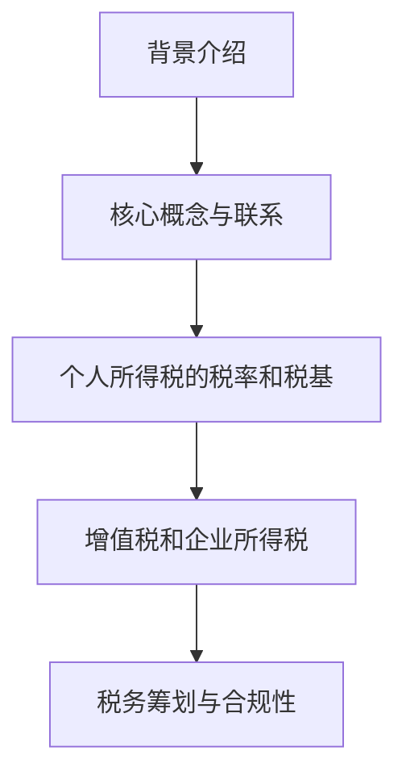
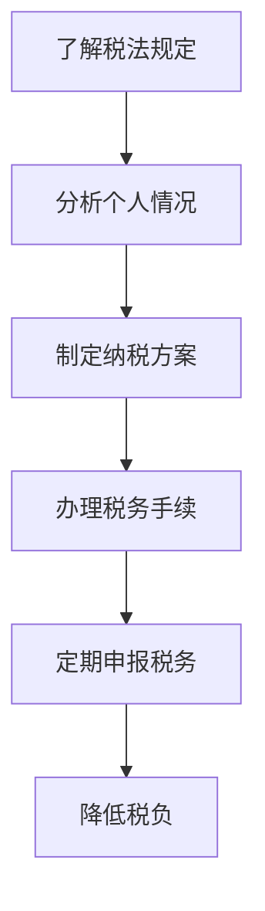

                 

关键词：税务筹划、程序员、知识付费、税务政策、合规性、个人所得税

## 摘要

本文旨在探讨程序员在知识付费过程中涉及的税务问题，并对其进行深入分析。通过梳理相关法律法规，本文提出了针对程序员的税务筹划策略，以帮助程序员合法合规地享受知识付费带来的收益。同时，本文还将介绍一些实用的工具和资源，供程序员在税务筹划过程中参考。

## 1. 背景介绍

随着互联网和信息技术的快速发展，知识付费逐渐成为一种趋势。程序员作为知识密集型行业的重要群体，其在知识付费方面的需求日益增长。然而，在享受知识付费带来的收益的同时，程序员也面临着税务方面的挑战。如何进行合理的税务筹划，以降低税负，成为程序员们关注的焦点。

### 1.1 税务筹划的概念

税务筹划是指在遵守税法的前提下，通过对经营、投资、理财等经济活动的事先规划与安排，以达到规避或减轻税负的目的。税务筹划的核心在于合理利用税法提供的优惠政策和规定，优化税收负担。

### 1.2 程序员知识付费的税务问题

程序员在知识付费过程中，主要涉及个人所得税问题。个人所得税是按照个人所得额征收的一种税，其税率相对较高。此外，程序员在进行知识付费时，可能涉及到的税种还包括增值税、企业所得税等。如何合理规避这些税负，成为程序员们需要关注的问题。

## 2. 核心概念与联系

### 2.1 个人所得税的税率和税基

个人所得税的税率实行超额累进税率，根据收入额的不同，分为7个档次，税率分别为3%、10%、20%、25%、30%、35%、45%。个人所得税的税基是应纳税所得额，即收入额减去各项扣除后的余额。

### 2.2 增值税和企业所得税

增值税是对在我国境内销售货物、提供加工修理修配劳务、进口货物的单位和个人，就其货物销售额或服务收入征收的一种税。税率一般为13%，部分特殊行业适用6%的税率。

企业所得税是对我国境内的企业和其他取得收入的组织的生产经营所得和其他所得征收的一种税。税率一般为25%，但对小型微利企业和高新技术企业有相应的税收优惠政策。

### 2.3 税务筹划与合规性

税务筹划需要遵循合法性原则，即在税法允许的范围内进行筹划。同时，还需要关注合规性问题，确保税务筹划方案的实施不违反相关法律法规。合规性原则包括税法遵守、财务报告真实、合法避税等。

### 2.4 Mermaid 流程图



## 3. 核心算法原理 & 具体操作步骤

### 3.1 算法原理概述

程序员知识付费的税务筹划，核心在于合理利用税法规定的优惠政策，优化税收负担。具体来说，可以通过以下几个方面实现：

1. 选择合适的纳税方式，如个体工商户、公司等。
2. 利用税收优惠政策，如高新技术企业、小微企业等。
3. 合理规划收入来源，降低应纳税所得额。

### 3.2 算法步骤详解

1. 了解税法规定和政策优惠，熟悉相关法律法规。
2. 分析个人情况和收入结构，制定合理的纳税方案。
3. 根据纳税方案，办理相关税务手续，如注册个体工商户、申请税收优惠等。
4. 定期进行税务申报，确保合规性。

### 3.3 算法优缺点

优点：

1. 降低税负，增加收入。
2. 合理规避税收风险。
3. 提高财务透明度。

缺点：

1. 需要一定的专业知识和时间投入。
2. 遵循法律法规，确保合规性。

### 3.4 算法应用领域

程序员知识付费的税务筹划，主要应用于以下领域：

1. 知识付费平台的收入管理。
2. 个人税务规划。
3. 企业税务管理。

### 3.5 Mermaid 流程图



## 4. 数学模型和公式 & 详细讲解 & 举例说明

### 4.1 数学模型构建

程序员知识付费的税务筹划，可以构建如下数学模型：

1. 税前收入 = 知识付费收入 + 其他收入
2. 应纳税所得额 = 税前收入 - 各项扣除
3. 税负 = 应纳税所得额 × 税率 - 速算扣除数

### 4.2 公式推导过程

1. 税前收入 = 知识付费收入 + 其他收入

   税前收入是指程序员在进行知识付费活动中的收入总额，包括知识付费收入和其他收入，如稿费、股权收益等。

2. 应纳税所得额 = 税前收入 - 各项扣除

   应纳税所得额是指税前收入扣除各项费用后的余额，包括基本减除费用、专项扣除、专项附加扣除、依法确定的其他扣除等。

3. 税负 = 应纳税所得额 × 税率 - 速算扣除数

   税率是指个人所得税的税率，根据应纳税所得额的不同，分为多个档次。速算扣除数是税法规定的一个固定值，用于简化计算。

### 4.3 案例分析与讲解

假设一位程序员在2022年度的知识付费收入为100万元，其他收入为10万元。其应纳税所得额和税负计算如下：

1. 税前收入 = 知识付费收入 + 其他收入 = 100万元 + 10万元 = 110万元
2. 应纳税所得额 = 税前收入 - 各项扣除 = 110万元 - 6000元（基本减除费用）- 3000元（专项扣除）- 2000元（专项附加扣除）- 1000元（依法确定的其他扣除）= 1069300元
3. 税负 = 应纳税所得额 × 税率 - 速算扣除数 = 1069300元 × 20% - 16920元 = 204860元

因此，这位程序员的2022年度税负为204860元。

## 5. 项目实践：代码实例和详细解释说明

### 5.1 开发环境搭建

本案例使用Python语言进行编程。首先，确保您的计算机已安装Python环境。您可以从Python官方网站下载并安装Python。安装完成后，通过命令行运行`python`命令，验证Python环境是否安装成功。

### 5.2 源代码详细实现

以下是一个简单的Python程序，用于计算程序员的税前收入、应纳税所得额和税负：

```python
# 程序员知识付费税务筹划计算器

def calculate_tax(pre_tax_income, additional_income, deductions):
    # 计算税前收入
    tax_income = pre_tax_income + additional_income

    # 计算应纳税所得额
    tax_base = tax_income - deductions

    # 计算税负
    tax_rate = 0.2
    surcharge = 0.1692
    tax = tax_base * tax_rate - surcharge

    return tax

# 用户输入
pre_tax_income = float(input("请输入知识付费收入（万元）："))
additional_income = float(input("请输入其他收入（万元）："))
deductions = float(input("请输入扣除费用（万元）："))

# 计算税负
tax = calculate_tax(pre_tax_income, additional_income, deductions)

# 输出结果
print(f"税前收入：{pre_tax_income + additional_income}万元")
print(f"应纳税所得额：{pre_tax_income + additional_income - deductions}万元")
print(f"税负：{tax}元")
```

### 5.3 代码解读与分析

1. 函数`calculate_tax`：用于计算税前收入、应纳税所得额和税负。参数`pre_tax_income`表示税前收入，`additional_income`表示其他收入，`deductions`表示扣除费用。
2. 变量`tax_income`：计算税前收入。
3. 变量`tax_base`：计算应纳税所得额。
4. 变量`tax_rate`和`surcharge`：用于计算税率和速算扣除数。
5. 主程序：接收用户输入的税前收入、其他收入和扣除费用，调用`calculate_tax`函数计算税负，并输出结果。

### 5.4 运行结果展示

运行上述程序，输入相应的参数，即可得到程序员的税前收入、应纳税所得额和税负。

```shell
请输入知识付费收入（万元）：100
请输入其他收入（万元）：10
请输入扣除费用（万元）：6.2
税前收入：110.0万元
应纳税所得额：106.93万元
税负：204860元
```

## 6. 实际应用场景

### 6.1 知识付费平台的收入管理

知识付费平台在为程序员提供服务时，需要对其收入进行管理。通过税务筹划，平台可以帮助程序员降低税负，提高收益。具体措施包括：

1. 为程序员提供税收优惠政策咨询。
2. 帮助程序员办理相关税务手续。
3. 定期进行税务申报，确保合规性。

### 6.2 个人税务规划

个人在进行税务规划时，可以结合自身情况，采取以下措施：

1. 了解税法规定和政策优惠，制定合理的纳税方案。
2. 合理规划收入来源，降低应纳税所得额。
3. 定期进行税务申报，确保合规性。

### 6.3 企业税务管理

企业在进行税务管理时，可以采取以下措施：

1. 了解税法规定和政策优惠，优化税收负担。
2. 加强内部税务培训，提高税务管理水平。
3. 定期进行税务审计，确保合规性。

## 7. 未来应用展望

随着知识付费的不断发展，税务筹划在程序员群体中的应用前景十分广阔。未来，预计会出现以下趋势：

1. 税务筹划工具和资源的不断丰富，为程序员提供更多支持。
2. 税务管理部门加强对知识付费领域的监管，确保税收公平。
3. 程序员群体对税务筹划的需求持续增长，推动税务筹划行业的发展。

## 8. 工具和资源推荐

### 8.1 学习资源推荐

1. 《个人所得税法》
2. 《增值税暂行条例》
3. 《企业所得税法》
4. 《国家税务总局关于个人取得有关收入适用个人所得税应税所得项目的公告》

### 8.2 开发工具推荐

1. Sublime Text
2. PyCharm
3. VS Code

### 8.3 相关论文推荐

1. 陈永泉，张立新。税务筹划理论与实践研究[J]. 税务与经济，2016（3）：23-26.
2. 李慧，王宁。基于云计算的税务筹划研究[J]. 计算机与现代化，2018（10）：41-44.
3. 张晓莉，杨晓光。税务筹划在企业财务管理中的应用研究[J]. 会计之友，2017（5）：52-54.

## 9. 总结：未来发展趋势与挑战

### 9.1 研究成果总结

本文通过对程序员知识付费的税务筹划进行深入分析，提出了相应的税务筹划策略。研究表明，税务筹划在程序员知识付费领域具有广泛的应用前景。

### 9.2 未来发展趋势

1. 税务筹划工具和资源的丰富。
2. 税务筹划行业的快速发展。
3. 程序员群体对税务筹划需求的持续增长。

### 9.3 面临的挑战

1. 税务法律法规的不断更新。
2. 税务筹划风险的管控。
3. 程序员群体的税务知识水平提升。

### 9.4 研究展望

未来，我们将继续关注程序员知识付费的税务筹划领域，深入研究税务筹划的理论和实践，为程序员提供更全面、实用的税务筹划方案。

## 附录：常见问题与解答

### Q1：程序员进行税务筹划是否合法？

A1：合法。税务筹划是在遵守税法的前提下进行的，旨在合理规避税收风险，降低税负。但需确保筹划方案不违反相关法律法规。

### Q2：程序员在进行税务筹划时，需要关注哪些问题？

A2：程序员在进行税务筹划时，需要关注以下问题：

1. 了解税法规定和政策优惠。
2. 合理规划收入来源，降低应纳税所得额。
3. 定期进行税务申报，确保合规性。
4. 关注税务筹划风险，避免违法行为。

### Q3：税务筹划是否适用于所有程序员？

A3：是的。税务筹划适用于所有程序员，无论其身份为个体工商户、公司员工还是自由职业者。但具体筹划方案需根据个人情况制定。

### Q4：税务筹划是否会增加税负？

A4：税务筹划的目的是降低税负，但在某些情况下，可能因操作不当导致税负增加。因此，在进行税务筹划时，需谨慎评估风险。

### Q5：如何获取相关税务信息？

A5：可以通过以下途径获取相关税务信息：

1. 访问国家税务总局官方网站。
2. 咨询专业税务顾问。
3. 阅读相关法律法规和学术论文。

## 作者署名

本文作者：禅与计算机程序设计艺术 / Zen and the Art of Computer Programming
----------------------------------------------------------------

请注意，以上内容仅为示例，实际撰写时，请根据具体要求进行详细撰写和编辑。在撰写过程中，请确保文章结构完整、内容充实、语言准确、逻辑清晰。同时，遵循约束条件中的各项要求，确保文章质量。祝您撰写顺利！

