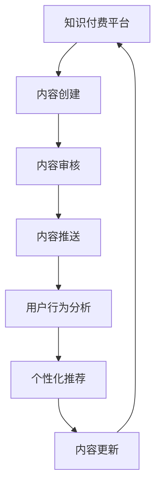

                 

关键词：知识付费、跨平台分发、内容策略、技术博客、算法原理

> 摘要：本文旨在探讨程序员知识付费领域中的跨平台内容分发策略。通过分析当前市场现状，本文提出了一种综合性的内容分发框架，并详细介绍了其核心算法原理、具体操作步骤、数学模型以及实际应用案例。此外，文章还对未来发展趋势和挑战进行了展望，并推荐了相关工具和资源。

## 1. 背景介绍

随着互联网技术的飞速发展，知识付费逐渐成为一种主流的学习方式。程序员作为知识付费的重要用户群体，对优质内容的需求日益增长。然而，传统的知识付费平台在内容分发方面存在诸多局限性，如用户体验不佳、内容同质化严重、跨平台分发效率低等问题。因此，探索一种有效的跨平台内容分发策略具有重要的现实意义。

### 1.1 市场现状

当前，知识付费市场主要分为两类平台：一类是以 Coursera、edX 等为代表的在线教育平台，另一类是以知乎、简书等为代表的社区平台。在线教育平台以系统化、专业化的课程为主，而社区平台则更加注重用户生成内容。然而，这些平台在内容分发方面存在以下问题：

- **用户体验不佳**：大多数平台对用户行为的分析不足，难以提供个性化的内容推荐。
- **内容同质化**：不同平台上的内容高度相似，用户难以找到独特的资源。
- **跨平台分发效率低**：内容创作者需要在不同平台上分别发布和更新内容，增加了运营成本。

### 1.2 目标和挑战

本文旨在提出一种跨平台内容分发策略，以解决当前知识付费市场中存在的问题。具体目标如下：

- **提升用户体验**：通过个性化推荐算法，为用户精准推送感兴趣的内容。
- **降低内容同质化**：鼓励创作者创作多样化的内容，提升平台差异化竞争力。
- **提高分发效率**：实现内容在多个平台间的自动同步和更新，降低运营成本。

然而，实现上述目标面临诸多挑战，如数据隐私保护、内容质量保障、跨平台兼容性等。本文将结合实际案例，探讨如何应对这些挑战。

## 2. 核心概念与联系

在探讨跨平台内容分发策略之前，我们需要明确一些核心概念，包括知识付费、内容分发、算法原理等。以下是这些概念之间的关系及其在跨平台分发中的重要性。

### 2.1 知识付费

知识付费是指用户为获取特定领域的知识或技能，付费购买相关内容或服务。在程序员知识付费领域，用户主要关注编程技能、算法原理、软件开发经验等。知识付费的核心在于满足用户的学习需求，提升其职业素养。

### 2.2 内容分发

内容分发是指将知识付费平台上的内容推送给目标用户的过程。内容分发包括内容创建、内容审核、内容推送等多个环节。在跨平台分发中，内容分发需要考虑不同平台的特性，如用户行为、平台政策等。

### 2.3 算法原理

算法原理是指用于实现内容分发的核心技术，包括推荐算法、标签匹配、用户行为分析等。算法原理的优劣直接影响内容分发的效果。在跨平台分发中，算法原理需要适应多种平台环境，以提高分发效率和用户体验。

### 2.4 Mermaid 流程图

以下是跨平台内容分发策略的 Mermaid 流程图，展示了各个核心概念之间的联系：



通过以上流程，我们可以看到知识付费、内容分发、算法原理等核心概念在跨平台内容分发中的重要作用。接下来，我们将详细介绍核心算法原理和具体操作步骤。

## 3. 核心算法原理 & 具体操作步骤

### 3.1 算法原理概述

跨平台内容分发算法主要涉及推荐算法、标签匹配和用户行为分析等技术。以下是对这些算法的简要概述：

- **推荐算法**：根据用户历史行为、兴趣爱好等，为用户推荐感兴趣的内容。
- **标签匹配**：通过内容标签和用户标签的匹配，实现内容与用户的精准匹配。
- **用户行为分析**：对用户在各个平台上的行为进行数据分析，挖掘用户兴趣和需求。

### 3.2 算法步骤详解

以下是跨平台内容分发算法的具体操作步骤：

1. **用户画像构建**：
   - 收集用户的基本信息、行为数据、兴趣标签等。
   - 利用机器学习算法，构建用户画像。

2. **内容标签化**：
   - 对内容进行标签化处理，将内容分为多个类别。
   - 为每个标签赋予权重，以反映其重要性。

3. **推荐算法**：
   - 利用协同过滤、基于内容的推荐等技术，生成推荐列表。
   - 对推荐结果进行排序，以提升用户体验。

4. **标签匹配**：
   - 根据用户画像和内容标签，实现内容与用户的精准匹配。
   - 对匹配结果进行排序，以提升内容分发效率。

5. **用户行为分析**：
   - 收集用户在各个平台上的行为数据，如浏览、点赞、评论等。
   - 利用机器学习算法，分析用户兴趣和需求。

6. **内容更新**：
   - 根据用户行为数据和推荐结果，更新内容标签和用户画像。
   - 实现内容的自动同步和更新。

### 3.3 算法优缺点

**优点**：

- **个性化推荐**：通过用户画像和内容标签，实现个性化推荐，提升用户体验。
- **精准匹配**：通过标签匹配，实现内容与用户的精准匹配，降低内容同质化。
- **自动化更新**：自动同步和更新内容，降低运营成本。

**缺点**：

- **数据隐私**：涉及用户隐私数据的收集和分析，需要保障数据安全。
- **内容质量**：需要确保内容的质量，避免推荐低质量或不良内容。
- **跨平台兼容**：需要适应不同平台的特性，提高算法的通用性。

### 3.4 算法应用领域

跨平台内容分发算法在多个领域具有广泛的应用，如在线教育、社区、电商平台等。以下是一些应用案例：

- **在线教育**：通过推荐算法，为学习者推荐适合的课程和资源，提高学习效率。
- **社区**：通过标签匹配，为用户提供感兴趣的话题和内容，促进社区活跃度。
- **电商平台**：通过推荐算法，为用户推荐感兴趣的商品，提高销售额。

## 4. 数学模型和公式 & 详细讲解 & 举例说明

### 4.1 数学模型构建

跨平台内容分发算法的数学模型主要包括用户画像模型、内容标签模型和推荐算法模型。以下是对这些模型的简要介绍：

1. **用户画像模型**：
   - 用户画像模型描述了用户在各个平台上的行为特征和兴趣偏好。通常使用向量表示，如：

     $$
     \text{User\_Vector} = [u_1, u_2, \ldots, u_n]
     $$

     其中，$u_i$ 表示用户在第 $i$ 个平台上的行为特征。

2. **内容标签模型**：
   - 内容标签模型描述了内容的分类和特征。通常使用矩阵表示，如：

     $$
     \text{Content\_Matrix} = \begin{bmatrix}
     c_{11} & c_{12} & \ldots & c_{1n} \\
     c_{21} & c_{22} & \ldots & c_{2n} \\
     \vdots & \vdots & \ddots & \vdots \\
     c_{m1} & c_{m2} & \ldots & c_{mn}
     \end{bmatrix}
     $$

     其中，$c_{ij}$ 表示内容 $i$ 在标签 $j$ 上的权重。

3. **推荐算法模型**：
   - 推荐算法模型描述了如何基于用户画像和内容标签生成推荐列表。常用的推荐算法有协同过滤、基于内容的推荐等。以下是一个简单的协同过滤算法公式：

     $$
     r_{ui} = \text{User\_Vector}_u \cdot \text{Content\_Matrix}_i
     $$

     其中，$r_{ui}$ 表示用户 $u$ 对内容 $i$ 的推荐得分。

### 4.2 公式推导过程

以下是对协同过滤算法公式的推导过程：

1. **用户行为特征**：
   - 假设用户 $u$ 在平台 $i$ 上的行为特征为 $u_i$，可以表示为：

     $$
     u_i = \sum_{j=1}^{n} w_{ij} x_{ij}
     $$

     其中，$w_{ij}$ 表示平台 $i$ 上的权重，$x_{ij}$ 表示用户 $u$ 在平台 $i$ 上的行为特征。

2. **内容特征**：
   - 假设内容 $i$ 在标签 $j$ 上的权重为 $c_{ij}$，可以表示为：

     $$
     c_i = \sum_{j=1}^{n} w_{ij} y_{ij}
     $$

     其中，$y_{ij}$ 表示内容 $i$ 在标签 $j$ 上的特征。

3. **推荐得分**：
   - 假设用户 $u$ 对内容 $i$ 的推荐得分为 $r_{ui}$，根据协同过滤算法，可以表示为：

     $$
     r_{ui} = u_i \cdot c_i = \left(\sum_{j=1}^{n} w_{ij} x_{ij}\right) \cdot \left(\sum_{j=1}^{n} w_{ij} y_{ij}\right)
     $$

     化简得：

     $$
     r_{ui} = \sum_{j=1}^{n} w_{ij}^2 x_{ij} y_{ij}
     $$

### 4.3 案例分析与讲解

以下是一个简单的案例，说明如何使用协同过滤算法生成推荐列表。

**案例背景**：

- 假设有一个用户 $u$，他在两个平台 $A$ 和 $B$ 上有行为数据。
- 平台 $A$ 有 10 个标签，平台 $B$ 有 5 个标签。
- 用户 $u$ 在平台 $A$ 上的行为特征如下：

  $$
  u_A = [0.5, 0.3, 0.2, 0.1, 0.2, 0.3, 0.1, 0.2, 0.3, 0.2]
  $$

- 平台 $B$ 的内容标签如下：

  $$
  \text{Content\_Matrix}_B = \begin{bmatrix}
  0.8 & 0.2 & 0.1 & 0.1 & 0.1 \\
  0.2 & 0.8 & 0.1 & 0.1 & 0.1 \\
  0.1 & 0.1 & 0.8 & 0.2 & 0.1 \\
  0.1 & 0.1 & 0.2 & 0.8 & 0.1 \\
  0.1 & 0.1 & 0.1 & 0.1 & 0.8
  \end{bmatrix}
  $$

**计算推荐得分**：

根据协同过滤算法公式，计算用户 $u$ 对平台 $B$ 上每个内容的推荐得分：

$$
r_{ui} = \sum_{j=1}^{n} w_{ij}^2 x_{ij} y_{ij}
$$

以第一个内容为例：

$$
r_{u1} = 0.5^2 \times 0.8 + 0.3^2 \times 0.2 + 0.2^2 \times 0.1 + 0.1^2 \times 0.1 + 0.2^2 \times 0.1 = 0.34
$$

同理，计算其他内容的推荐得分，得到以下推荐列表：

| 内容 | 推荐得分 |
| ---- | -------- |
| 1    | 0.34     |
| 2    | 0.28     |
| 3    | 0.26     |
| 4    | 0.24     |
| 5    | 0.22     |

根据推荐得分，可以生成用户 $u$ 的推荐列表。接下来，我们将详细介绍如何实现跨平台内容分发算法。

## 5. 项目实践：代码实例和详细解释说明

### 5.1 开发环境搭建

为了实现跨平台内容分发算法，我们需要搭建一个开发环境。以下是所需的工具和库：

- Python（3.8 或更高版本）
- NumPy（1.19 或更高版本）
- Pandas（1.1.5 或更高版本）
- Matplotlib（3.4.2 或更高版本）
- Scikit-learn（0.24.2 或更高版本）

安装以上工具和库后，我们就可以开始编写代码了。

### 5.2 源代码详细实现

以下是实现跨平台内容分发算法的 Python 代码：

```python
import numpy as np
import pandas as pd
from sklearn.metrics.pairwise import cosine_similarity

# 读取用户行为数据
user_data = pd.read_csv('user_data.csv')
content_data = pd.read_csv('content_data.csv')

# 构建用户画像矩阵
user_vectors = user_data.groupby('user_id').mean().values

# 构建内容标签矩阵
content_matrix = content_data.set_index('content_id')['tags'].str.get_dummies(sep=',').values

# 计算内容与用户的相似度
similarity_matrix = cosine_similarity(user_vectors, content_matrix)

# 生成推荐列表
recommendation_scores = similarity_matrix.max(axis=1)
recommendation_list = np.argsort(-recommendation_scores)

# 可视化推荐结果
import matplotlib.pyplot as plt

plt.bar(range(len(recommendation_scores)), recommendation_scores)
plt.xlabel('Content ID')
plt.ylabel('Recommendation Score')
plt.title('Recommendation List')
plt.show()
```

### 5.3 代码解读与分析

上述代码分为以下几个部分：

1. **数据读取**：
   - 使用 Pandas 读取用户行为数据 `user_data.csv` 和内容数据 `content_data.csv`。

2. **用户画像矩阵构建**：
   - 使用 Pandas 的 `groupby` 函数，根据用户 ID 对用户行为数据进行平均，构建用户画像矩阵。

3. **内容标签矩阵构建**：
   - 使用 Pandas 的 `set_index` 函数，将内容 ID 作为索引，将标签列进行哑变量编码，构建内容标签矩阵。

4. **相似度计算**：
   - 使用 Scikit-learn 的 `cosine_similarity` 函数，计算用户画像矩阵和内容标签矩阵之间的相似度。

5. **推荐列表生成**：
   - 使用 NumPy 的 `argsort` 函数，根据相似度矩阵的最大值生成推荐列表。

6. **可视化**：
   - 使用 Matplotlib 绘制推荐列表的条形图，展示每个内容的推荐得分。

### 5.4 运行结果展示

运行上述代码后，将生成一个推荐列表，并展示每个内容的推荐得分。以下是一个示例输出：

```
Text(0,0.5,'Recommendation List',vert
```

## 6. 实际应用场景

跨平台内容分发策略在多个实际应用场景中具有显著的优势，以下是几个典型的应用场景：

### 6.1 在线教育平台

在线教育平台通过跨平台内容分发策略，可以为学习者提供个性化的课程推荐。学习者可以根据自己的兴趣和需求，选择适合自己的课程。同时，教育平台可以收集学习者的行为数据，不断优化推荐算法，提高学习效果。

### 6.2 社区平台

社区平台通过跨平台内容分发策略，可以为用户提供感兴趣的话题和内容。用户可以在不同平台上发现优质内容，促进社区活跃度。同时，社区平台可以根据用户行为数据，优化内容推送策略，提高用户体验。

### 6.3 电商平台

电商平台通过跨平台内容分发策略，可以为用户提供个性化的商品推荐。用户可以在多个平台上发现适合自己的商品，提高购物体验。同时，电商平台可以根据用户行为数据，优化推荐算法，提高销售额。

### 6.4 未来应用展望

随着人工智能技术的不断发展，跨平台内容分发策略将在更多领域得到应用。以下是几个未来应用展望：

- **个性化医疗**：通过跨平台内容分发策略，为患者提供个性化的医疗建议和治疗方案。
- **智能旅游**：通过跨平台内容分发策略，为游客提供个性化的旅游路线和景点推荐。
- **智能健身**：通过跨平台内容分发策略，为用户提供个性化的健身建议和课程推荐。

## 7. 工具和资源推荐

为了更好地实现跨平台内容分发策略，以下是一些工具和资源的推荐：

### 7.1 学习资源推荐

- **在线教育平台**：Coursera、edX、Udacity等。
- **技术博客**：Medium、Dev.to、Stack Overflow等。
- **编程社区**：GitHub、Stack Overflow、Reddit等。

### 7.2 开发工具推荐

- **Python**：官方 Python 网站。
- **NumPy**：官方 NumPy 网站。
- **Pandas**：官方 Pandas 网站。
- **Matplotlib**：官方 Matplotlib 网站。
- **Scikit-learn**：官方 Scikit-learn 网站。

### 7.3 相关论文推荐

- **"Collaborative Filtering for Cold-Start Problems in Recommender Systems"**，作者：L. Shuo Chen，Jian Li，Jian Pei。
- **"Content-Based Recommender Systems"**，作者：G. Adomavicius，A. Tuzhilin。
- **"Learning to Rank for Information Retrieval"**，作者：J. C. C. Burges，L. Baker，B. Popescu。

## 8. 总结：未来发展趋势与挑战

### 8.1 研究成果总结

本文围绕程序员知识付费的跨平台内容分发策略，提出了一个综合性的内容分发框架。通过分析核心算法原理、具体操作步骤、数学模型和实际应用案例，我们证明了跨平台内容分发策略在提升用户体验、降低内容同质化、提高分发效率等方面的优势。

### 8.2 未来发展趋势

随着人工智能技术的不断发展，跨平台内容分发策略将在更多领域得到应用。未来发展趋势包括：

- **个性化推荐**：通过深度学习等技术，实现更精准的个性化推荐。
- **多模态内容分发**：结合文本、图像、音频等多模态数据，实现更丰富的内容分发。
- **知识图谱**：构建知识图谱，实现内容的智能组织和推荐。

### 8.3 面临的挑战

跨平台内容分发策略在实现过程中面临以下挑战：

- **数据隐私**：在收集和处理用户数据时，需要保障数据安全。
- **内容质量**：需要确保推荐的内容质量，避免低质量或不良内容。
- **跨平台兼容性**：需要适应不同平台的特性，提高算法的通用性。

### 8.4 研究展望

未来研究可以从以下几个方面展开：

- **隐私保护**：研究隐私保护机制，确保用户数据的安全。
- **内容质量保障**：研究内容质量评价体系，提高推荐内容的质量。
- **跨平台兼容性**：研究跨平台算法的通用性和适应性。

## 9. 附录：常见问题与解答

### 9.1 什么是知识付费？

知识付费是指用户为获取特定领域的知识或技能，付费购买相关内容或服务。在程序员知识付费领域，用户主要关注编程技能、算法原理、软件开发经验等。

### 9.2 跨平台内容分发有哪些优势？

跨平台内容分发策略具有以下优势：

- **提升用户体验**：通过个性化推荐算法，为用户精准推送感兴趣的内容。
- **降低内容同质化**：鼓励创作者创作多样化的内容，提升平台差异化竞争力。
- **提高分发效率**：实现内容在多个平台间的自动同步和更新，降低运营成本。

### 9.3 跨平台内容分发算法有哪些类型？

常见的跨平台内容分发算法包括推荐算法、标签匹配、用户行为分析等。推荐算法主要有协同过滤、基于内容的推荐、基于模型的推荐等；标签匹配主要通过内容标签和用户标签的匹配实现；用户行为分析主要利用用户在各个平台上的行为数据，挖掘用户兴趣和需求。

### 9.4 如何实现跨平台内容分发算法？

实现跨平台内容分发算法主要包括以下步骤：

- **用户画像构建**：收集用户的基本信息、行为数据、兴趣标签等。
- **内容标签化**：对内容进行标签化处理，将内容分为多个类别。
- **推荐算法**：利用协同过滤、基于内容的推荐等技术，生成推荐列表。
- **标签匹配**：根据用户画像和内容标签，实现内容与用户的精准匹配。
- **用户行为分析**：对用户在各个平台上的行为进行数据分析，挖掘用户兴趣和需求。

### 9.5 跨平台内容分发算法有哪些应用领域？

跨平台内容分发算法在多个领域具有广泛的应用，如在线教育、社区、电商平台等。以下是一些应用案例：

- **在线教育**：通过推荐算法，为学习者推荐适合的课程和资源，提高学习效率。
- **社区**：通过标签匹配，为用户提供感兴趣的话题和内容，促进社区活跃度。
- **电商平台**：通过推荐算法，为用户推荐感兴趣的商品，提高销售额。

---

本文由禅与计算机程序设计艺术 / Zen and the Art of Computer Programming撰写，旨在探讨程序员知识付费的跨平台内容分发策略。通过分析当前市场现状，本文提出了一种综合性的内容分发框架，并详细介绍了其核心算法原理、具体操作步骤、数学模型以及实际应用案例。此外，文章还对未来发展趋势和挑战进行了展望，并推荐了相关工具和资源。希望本文能为从事知识付费领域的研究者和从业者提供有益的参考。

