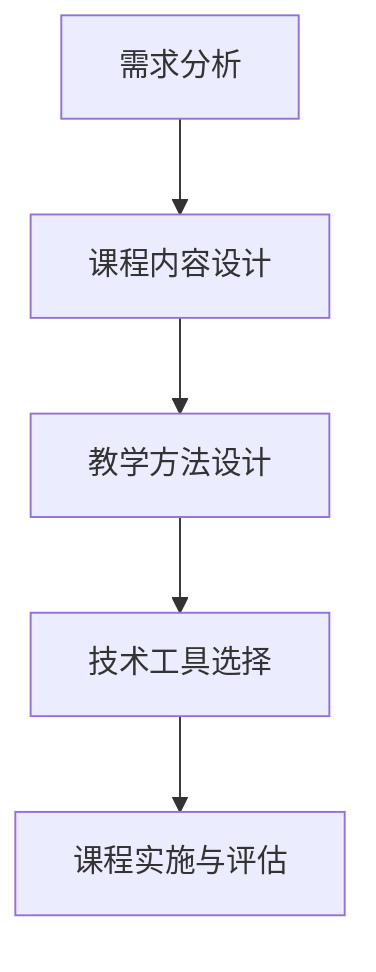

                 

在这个数字化时代，知识付费已经成为一种趋势。程序员作为高技术含量的职业群体，他们的知识和技能也成为了市场上炙手可热的商品。然而，如何将程序员的知识进行有效付费，并打造出能够吸引学员、提高学习效果的课程，成为了一个重要的课题。本文将探讨程序员知识付费的现状，以及如何打造体验式课程，提升学员的学习体验。

## 文章关键词

- 程序员知识付费
- 体验式课程
- 教学方法
- 学习体验
- 课程设计

## 文章摘要

本文首先分析了程序员知识付费的现状，指出了当前市场存在的挑战和机遇。接着，文章详细阐述了如何设计体验式课程，包括课程内容的选择、教学方法的运用以及技术工具的辅助。最后，文章提出了未来的发展方向，包括个性化学习、线上线下结合等，以及面临的挑战和应对策略。

### 1. 背景介绍

随着互联网技术的飞速发展，知识付费市场逐渐壮大。程序员作为技术领域的佼佼者，他们的知识和技能成为了市场上的稀缺资源。然而，程序员的知识付费并非一帆风顺。一方面，程序员面临着巨大的工作压力，难以抽出时间进行知识分享；另一方面，市场上的知识付费课程质量参差不齐，难以满足学员的需求。

与此同时，体验式教育逐渐受到重视。与传统教育方式相比，体验式教育更加注重学员的参与和互动，能够提高学习效果和学员的满意度。在程序员知识付费的背景下，体验式课程的设计显得尤为重要。如何平衡程序员的时间和工作，如何设计出既能满足学员需求又能保证教学质量的知识付费课程，成为了一个亟待解决的问题。

### 2. 核心概念与联系

在打造体验式课程之前，我们需要了解几个核心概念：

#### 2.1 体验式教育

体验式教育是一种以学员为中心的教育模式，强调学员的参与和互动。在体验式教育中，学员不仅被动接受知识，更主动参与课程设计、教学过程和评价体系。这种教育模式能够提高学员的学习兴趣和积极性，增强学习效果。

#### 2.2 程序员知识付费

程序员知识付费是指程序员将自己的知识和技能以课程、书籍、咨询等形式进行有偿分享。这种付费模式不仅能够为程序员带来收入，也能够帮助他人快速掌握相关知识和技能。

#### 2.3 体验式课程

体验式课程是将体验式教育理念应用于程序员知识付费的一种课程设计。这种课程设计注重学员的参与和互动，通过多种教学方法和技术工具，提高学员的学习体验和效果。

下面是一个简单的 Mermaid 流程图，展示了体验式课程的设计过程：



### 3. 核心算法原理 & 具体操作步骤

#### 3.1 算法原理概述

在打造体验式课程的过程中，核心算法原理包括以下几个方面：

- **需求分析**：通过调查问卷、访谈等方式，了解学员的学习需求，确定课程的主题和目标。
- **课程内容设计**：根据需求分析的结果，设计适合学员的知识体系和课程内容。
- **教学方法设计**：选择适合体验式教育的教学方法，如小组讨论、案例研究、实践操作等。
- **技术工具选择**：选择合适的技术工具，如在线教育平台、互动白板、虚拟现实等，提高教学效果。
- **课程实施与评估**：按照设计好的教学计划和教学方法，实施课程，并对教学效果进行评估和反馈。

#### 3.2 算法步骤详解

1. **需求分析**：
   - **收集需求**：通过问卷调查、访谈等方式，收集学员的学习需求。
   - **分析需求**：对收集到的需求进行整理和分析，确定课程的主题和目标。

2. **课程内容设计**：
   - **确定知识体系**：根据需求分析的结果，设计适合学员的知识体系和课程内容。
   - **组织课程结构**：将课程内容按照逻辑顺序进行组织，确保学员能够系统地学习。

3. **教学方法设计**：
   - **选择教学方法**：根据课程内容和学员特点，选择适合的教学方法，如小组讨论、案例研究、实践操作等。
   - **设计教学活动**：根据教学方法，设计具体的教学活动，如课堂讨论、小组竞赛、实践操作等。

4. **技术工具选择**：
   - **选择平台**：选择合适的在线教育平台，如Teachable、Khan Academy等，提供课程内容和互动功能。
   - **选择工具**：根据教学需求，选择合适的技术工具，如互动白板、虚拟现实、在线编程环境等。

5. **课程实施与评估**：
   - **实施课程**：按照设计好的教学计划和教学方法，实施课程。
   - **收集反馈**：在课程结束后，收集学员的反馈，了解教学效果。
   - **评估与优化**：根据反馈结果，对课程进行评估和优化，提高教学质量。

#### 3.3 算法优缺点

- **优点**：
  - 提高学员的学习兴趣和积极性。
  - 增强学员的学习体验和效果。
  - 有助于提高课程的质量和影响力。

- **缺点**：
  - 需要投入大量时间和精力进行课程设计和实施。
  - 对教学资源和工具的要求较高。

#### 3.4 算法应用领域

体验式课程设计算法可以应用于多个领域，如：

- **在线教育**：通过在线教育平台，提供体验式课程，提高教学效果。
- **企业培训**：为企业员工提供体验式培训，提升员工技能和绩效。
- **技能提升**：为个人提供体验式课程，帮助学员提升技能和职业发展。

### 4. 数学模型和公式 & 详细讲解 & 举例说明

在体验式课程设计过程中，数学模型和公式可以用来分析学员的学习行为和教学效果。以下是一个简单的数学模型和公式示例：

#### 4.1 数学模型构建

假设学员的学习效果可以用一个函数 \(E\) 表示，其中 \(E\) 受到课程内容 \(C\)、教学方法 \(M\)、技术工具 \(T\) 和学员参与度 \(P\) 的影响。我们可以用以下数学模型表示：

\[ E = f(C, M, T, P) \]

其中，\(f\) 表示一个复杂的函数，表示四个变量之间的关系。

#### 4.2 公式推导过程

根据数学模型，我们可以推导出以下几个公式：

1. **学习效果与课程内容的关系**：

\[ \frac{dE}{dC} = f'(C, M, T, P) \cdot \frac{dC}{dE} \]

其中，\(f'(C, M, T, P)\) 表示课程内容对学习效果的影响程度。

2. **学习效果与教学方法的关系**：

\[ \frac{dE}{dM} = f'(M, C, T, P) \cdot \frac{dM}{dE} \]

其中，\(f'(M, C, T, P)\) 表示教学方法对学习效果的影响程度。

3. **学习效果与技术工具的关系**：

\[ \frac{dE}{dT} = f'(T, C, M, P) \cdot \frac{dT}{dE} \]

其中，\(f'(T, C, M, P)\) 表示技术工具对学习效果的影响程度。

4. **学习效果与学员参与度的关系**：

\[ \frac{dE}{dP} = f'(P, C, M, T) \cdot \frac{dP}{dE} \]

其中，\(f'(P, C, M, T)\) 表示学员参与度对学习效果的影响程度。

#### 4.3 案例分析与讲解

假设我们设计一个编程课程，目标是帮助学员掌握 Python 编程语言。根据上述数学模型，我们可以分析以下几个因素对学习效果的影响：

1. **课程内容**：
   - 增加编程语言的语法和用法讲解，可以提高学员对编程语言的理解和掌握程度。
   - 引入实际项目案例，可以让学员将理论知识应用到实际场景中，提高学习效果。

2. **教学方法**：
   - 采用互动式教学方法，如小组讨论、实践操作等，可以激发学员的学习兴趣和积极性。
   - 定期进行知识问答和测试，可以帮助学员巩固所学知识。

3. **技术工具**：
   - 使用在线编程环境，可以让学员随时随地进行编程实践。
   - 引入代码审查和自动化测试工具，可以帮助学员及时发现和纠正错误。

4. **学员参与度**：
   - 提供丰富的学习资源和练习题，鼓励学员积极参与课程讨论和实践。
   - 定期举办线上活动，增加学员之间的互动和交流，提高学习氛围。

通过上述分析，我们可以设计出更有效的编程课程，提高学员的学习效果。

### 5. 项目实践：代码实例和详细解释说明

在本节中，我们将通过一个实际的编程课程项目，展示如何设计和实施一个体验式课程。以下是一个简单的 Python 编程课程项目：

#### 5.1 开发环境搭建

为了实施这个编程课程，我们需要搭建一个开发环境。以下是搭建过程的简要步骤：

1. **安装 Python 解释器**：在学员的计算机上安装 Python 解释器，如 Python 3.8 或更高版本。
2. **配置编辑器**：推荐使用 Visual Studio Code 或 PyCharm 等主流 Python 编程编辑器，配置语法高亮、代码补全等插件。
3. **安装依赖库**：根据课程内容，安装必要的 Python 库，如 NumPy、Pandas 等。

#### 5.2 源代码详细实现

以下是一个简单的 Python 项目，用于计算两个数的平均值：

```python
# 导入所需的库
import numpy as np

# 输入两个数
num1 = float(input("请输入第一个数："))
num2 = float(input("请输入第二个数："))

# 计算平均值
avg = (num1 + num2) / 2

# 输出结果
print(f"这两个数的平均值是：{avg}")
```

#### 5.3 代码解读与分析

上述代码首先导入 NumPy 库，用于进行数值计算。然后，代码通过 `input()` 函数接收用户输入的两个数，并使用 `float()` 函数将输入的字符串转换为浮点数。

接下来，代码计算这两个数的平均值，并使用 `print()` 函数输出结果。这个简单的程序展示了 Python 编程的基本语法和数值计算功能。

#### 5.4 运行结果展示

当运行上述程序时，会弹出一个输入框，提示用户输入两个数。例如，如果输入 5 和 10，程序会输出：

```
这两个数的平均值是：7.5
```

这个结果验证了程序的正确性。

### 6. 实际应用场景

程序员知识付费课程在实际应用中具有广泛的应用场景。以下是一些典型的应用场景：

- **在线教育平台**：在线教育平台如 Coursera、Udemy 等，提供各种编程课程，吸引全球学员报名学习。
- **企业内训**：企业为员工提供定制化的编程培训，提升员工的技能和绩效。
- **个人技能提升**：个人通过编程课程提升自己的技能，拓宽职业发展道路。

### 7. 未来应用展望

随着人工智能和大数据技术的不断发展，程序员知识付费课程在未来将呈现以下趋势：

- **个性化学习**：利用大数据和人工智能技术，为学员提供个性化的学习路径和资源。
- **线上线下结合**：线上线下结合的教学模式，将更受学员欢迎，提高教学效果。
- **互动性增强**：通过虚拟现实、增强现实等技术，增强学员的互动性和参与感。

### 8. 工具和资源推荐

为了更好地实施程序员知识付费课程，以下是一些建议的工具和资源：

- **在线教育平台**：如 Teachable、Khan Academy、Moodle 等，提供丰富的教学资源和互动功能。
- **编程环境**：如 Visual Studio Code、PyCharm、Jupyter Notebook 等，支持多种编程语言的开发。
- **学习资源**：如 Coursera、edX、Udemy 等，提供大量的编程课程和学习资料。

### 9. 总结：未来发展趋势与挑战

程序员知识付费课程在未来将朝着个性化、互动性和技术化的方向发展。然而，在这个过程中，也将面临一系列挑战，如课程设计、教学质量、学员参与度等。只有不断优化课程设计、提高教学质量，才能在激烈的市场竞争中脱颖而出。

### 10. 附录：常见问题与解答

#### 问题 1：如何选择适合的编程课程？

解答：选择编程课程时，可以从以下几个方面进行考虑：

- **课程内容**：选择与自己的职业目标和兴趣相符的课程。
- **课程难度**：根据自身的基础和需求，选择适合难度的课程。
- **课程评价**：查看其他学员的评价，了解课程的教学质量和实用性。

#### 问题 2：如何提高编程课程的学习效果？

解答：以下是一些提高编程课程学习效果的建议：

- **积极参与**：主动参与课程讨论和实践，与他人交流和分享经验。
- **定期复习**：定期复习所学知识，巩固记忆。
- **实践操作**：通过实际项目练习，将理论知识应用到实际场景中。

#### 问题 3：如何选择合适的在线教育平台？

解答：选择在线教育平台时，可以从以下几个方面进行考虑：

- **课程资源**：平台提供的课程资源是否丰富、多样化。
- **用户评价**：查看其他学员的评价，了解平台的教学质量和用户体验。
- **功能服务**：平台提供的学习工具和互动功能是否满足需求。

---

通过本文的探讨，我们希望对程序员知识付费和体验式课程的设计有所帮助。在数字化时代，程序员的知识付费市场潜力巨大，体验式课程设计将成为提升教学效果的重要手段。我们期待更多程序员投身于知识付费课程的设计与实施，共同推动教育技术的发展。作者：禅与计算机程序设计艺术 / Zen and the Art of Computer Programming

