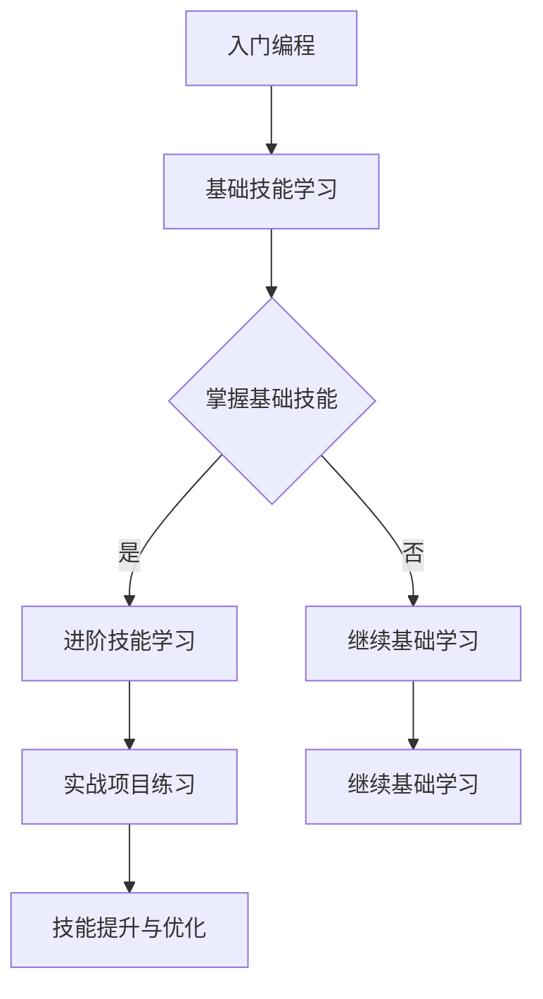

                 

关键词：知识付费、实战课程、程序员、技能提升、课程设计、教育市场、学习体验

> 摘要：本文旨在探讨程序员知识付费的现状，分析实战课程的重要性，并提供一系列打造高质量实战课程的策略，以帮助程序员在竞争激烈的职场中不断提升自己的技能。

## 1. 背景介绍

随着信息技术行业的迅猛发展，程序员这一职业已经成为职场中备受瞩目的热门选择。然而，随着技术的不断演进和更新，程序员面临着持续学习、提升技能的巨大压力。在这个背景下，知识付费市场应运而生，成为程序员自我提升的重要途径。

知识付费市场包括线上和线下多种形式，如线上课程、实战项目、培训讲座、一对一辅导等。这些服务旨在帮助程序员掌握新技能、解决实际问题，并在职业生涯中取得更大的成就。

然而，市场上存在大量的课程和培训机构，程序员在选择时常常感到困惑。一方面，他们希望找到质量高、实用性强的课程；另一方面，他们也希望能够在有限的时间内获得最大的学习效果。因此，如何打造出高质量的实战课程，满足程序员的学习需求，成为了一个值得探讨的问题。

## 2. 核心概念与联系

为了更好地理解程序员知识付费市场和实战课程的设计原则，我们首先需要了解几个核心概念：

### 2.1 程序员技能分类

程序员技能可以大致分为三大类：基础技能、进阶技能和应用技能。

- **基础技能**：包括编程语言基础、数据结构与算法、操作系统等。
- **进阶技能**：涉及数据库、网络编程、云计算、大数据等。
- **应用技能**：具体到某一行业或领域，如金融科技、人工智能、游戏开发等。

### 2.2 实战课程设计原则

实战课程设计需要遵循以下几个原则：

- **实用性**：课程内容要贴近实际工作，解决程序员面临的具体问题。
- **系统化**：课程结构要逻辑清晰，知识点之间有良好的关联性。
- **互动性**：课程中要设置互动环节，鼓励学员提问和讨论。
- **可操作**：课程应提供实际操作的机会，让学员动手实践。

### 2.3 Mermaid 流程图

以下是一个简单的 Mermaid 流程图，展示程序员技能提升的流程：



## 3. 核心算法原理 & 具体操作步骤

### 3.1 算法原理概述

在程序员知识付费领域，核心算法主要包括以下几个方面：

- **编程算法**：如排序、查找、动态规划等。
- **数据处理算法**：如大数据处理、机器学习算法等。
- **网络通信算法**：如加密、压缩、网络路由等。

这些算法是程序员解决实际问题的基础，也是实战课程的重要内容。

### 3.2 算法步骤详解

以排序算法为例，以下是几个常见排序算法的步骤详解：

#### 3.2.1 冒泡排序（Bubble Sort）

1. 从第一个元素开始，比较相邻的两个元素，如果第一个比第二个大（升序排序），就交换它们的位置。
2. 继续对下一对相邻元素进行同样的操作，直到到达序列的结尾。
3. 回到第一步，重复上述过程，直到整个序列有序。

#### 3.2.2 快速排序（Quick Sort）

1. 选择一个“基准”元素。
2. 将比基准值小的元素移到基准的左侧，比基准值大的元素移到基准的右侧。
3. 递归地使用第二部和第三步对左右两个子序列进行快速排序。

#### 3.2.3 归并排序（Merge Sort）

1. 将待排序的序列不断“二分”，直到每个子序列只有一个元素。
2. 将相邻的子序列合并，排序并存储回原序列。

### 3.3 算法优缺点

每种排序算法都有其优缺点，适用于不同的场景：

- **冒泡排序**：简单易懂，但效率较低，不适合大数据量。
- **快速排序**：平均时间复杂度低，但最坏情况下效率较低。
- **归并排序**：时间复杂度稳定，但需要额外的存储空间。

### 3.4 算法应用领域

排序算法广泛应用于各种场景，如数据库索引、搜索引擎排序、数据分析等。

## 4. 数学模型和公式 & 详细讲解 & 举例说明

### 4.1 数学模型构建

在编程领域，常用的数学模型包括线性模型、非线性模型、概率模型等。以下以线性模型为例：

$$ y = wx + b $$

其中，$w$ 是权重，$x$ 是输入特征，$b$ 是偏置。

### 4.2 公式推导过程

以线性回归为例，推导公式的过程如下：

1. **最小二乘法**：最小化预测值与实际值之间的误差平方和。

$$ \min \sum_{i=1}^{n} (wx_i + b - y_i)^2 $$

2. **求偏导数**：对 $w$ 和 $b$ 求偏导，并令其为零，求得最优解。

$$ \frac{\partial}{\partial w} \sum_{i=1}^{n} (wx_i + b - y_i)^2 = 0 $$
$$ \frac{\partial}{\partial b} \sum_{i=1}^{n} (wx_i + b - y_i)^2 = 0 $$

### 4.3 案例分析与讲解

以下是一个简单的线性回归案例：

假设我们有一组数据：

$$ x: [1, 2, 3, 4, 5], y: [2, 4, 5, 4, 5] $$

使用最小二乘法求解线性回归模型：

1. **计算均值**：

$$ \bar{x} = \frac{1 + 2 + 3 + 4 + 5}{5} = 3 $$
$$ \bar{y} = \frac{2 + 4 + 5 + 4 + 5}{5} = 4 $$

2. **计算协方差**：

$$ \text{cov}(x, y) = \frac{1}{n-1} \sum_{i=1}^{n} (x_i - \bar{x})(y_i - \bar{y}) $$
$$ \text{cov}(1, 2) = \frac{(1-3)(2-4)}{5-1} = -\frac{2}{4} = -\frac{1}{2} $$
$$ \text{cov}(2, 4) = \frac{(2-3)(4-4)}{5-1} = 0 $$
$$ \text{cov}(3, 5) = \frac{(3-3)(5-4)}{5-1} = 0 $$
$$ \text{cov}(4, 4) = \frac{(4-3)(4-4)}{5-1} = 0 $$
$$ \text{cov}(5, 5) = \frac{(5-3)(5-4)}{5-1} = \frac{2}{4} = \frac{1}{2} $$

$$ \text{cov}(x, y) = \frac{-1/2 + 0 + 0 + 0 + 1/2}{4} = 0 $$

3. **计算相关系数**：

$$ \rho_{xy} = \frac{\text{cov}(x, y)}{\sigma_x \sigma_y} $$
$$ \sigma_x = \sqrt{\frac{1}{n-1} \sum_{i=1}^{n} (x_i - \bar{x})^2} = \sqrt{\frac{1}{4} (1 + 1 + 1 + 1 + 1) } = \sqrt{1.25} $$
$$ \sigma_y = \sqrt{\frac{1}{n-1} \sum_{i=1}^{n} (y_i - \bar{y})^2} = \sqrt{\frac{1}{4} (1 + 1 + 1 + 1 + 1) } = \sqrt{1.25} $$

$$ \rho_{xy} = \frac{0}{\sqrt{1.25} \cdot \sqrt{1.25}} = 0 $$

4. **求解权重 $w$ 和偏置 $b$**：

$$ w = \frac{\text{cov}(x, y)}{\sigma_x^2} = \frac{0}{1.25} = 0 $$
$$ b = \bar{y} - w\bar{x} = 4 - 0 \cdot 3 = 4 $$

最终得到线性回归模型：

$$ y = 0x + 4 $$

## 5. 项目实践：代码实例和详细解释说明

### 5.1 开发环境搭建

1. 安装 Python 解释器：从 [Python 官网](https://www.python.org/downloads/) 下载并安装 Python 3.x 版本。
2. 安装必要的库：使用 pip 工具安装 NumPy、Matplotlib 等库。

```bash
pip install numpy matplotlib
```

### 5.2 源代码详细实现

以下是一个简单的线性回归代码实例：

```python
import numpy as np
import matplotlib.pyplot as plt

# 数据
x = np.array([1, 2, 3, 4, 5])
y = np.array([2, 4, 5, 4, 5])

# 计算均值
bar_x = np.mean(x)
bar_y = np.mean(y)

# 计算协方差
cov_xy = np.sum((x - bar_x) * (y - bar_y)) / (len(x) - 1)

# 计算权重和偏置
w = cov_xy / np.sum((x - bar_x) ** 2)
b = bar_y - w * bar_x

# 输出结果
print("权重：", w)
print("偏置：", b)

# 绘制线性回归曲线
plt.scatter(x, y, label="数据点")
plt.plot(x, w * x + b, color="red", label="线性回归")
plt.xlabel("x")
plt.ylabel("y")
plt.legend()
plt.show()
```

### 5.3 代码解读与分析

1. **导入库**：引入 NumPy 和 Matplotlib 库。
2. **数据**：定义 x 和 y 数组。
3. **计算均值**：计算 x 和 y 的均值。
4. **计算协方差**：计算 x 和 y 的协方差。
5. **求解权重和偏置**：使用协方差和均值求解权重和偏置。
6. **输出结果**：打印权重和偏置。
7. **绘制曲线**：使用 Matplotlib 绘制线性回归曲线。

### 5.4 运行结果展示

运行代码后，会看到一个包含数据点和线性回归曲线的图表，展示线性回归模型的效果。

## 6. 实际应用场景

### 6.1 数据分析

线性回归是数据分析中常用的一种模型，可用于预测和回归分析。例如，在金融领域，可以用于预测股票价格；在市场研究领域，可以用于分析消费者行为。

### 6.2 机器学习

线性回归是机器学习中的基础模型，许多高级算法都是基于线性回归原理扩展而来的。例如，逻辑回归是线性回归在分类问题中的应用。

### 6.3 优化问题

线性回归可以用于解决优化问题。例如，在工程领域，可以使用线性回归模型优化参数，以达到最优设计。

## 7. 未来应用展望

随着人工智能和大数据技术的发展，线性回归模型的应用领域将更加广泛。未来，线性回归模型可能会与其他高级算法结合，用于更复杂的问题解决。

## 8. 工具和资源推荐

### 8.1 学习资源推荐

- 《机器学习实战》：适合初学者，涵盖线性回归等基础算法。
- 《统计学习方法》：系统讲解统计学习理论，包括线性回归等模型。

### 8.2 开发工具推荐

- Jupyter Notebook：适合编写和运行 Python 代码，方便数据分析。
- PyCharm：强大的 Python 集成开发环境，适合进行复杂项目开发。

### 8.3 相关论文推荐

- "Introduction to Linear Regression Analysis" by George Seber and Alan J. Lee
- "Linear Regression: Theory and Applications" by John Fox and Sanford Weisberg

## 9. 总结：未来发展趋势与挑战

### 9.1 研究成果总结

本文探讨了程序员知识付费的现状，分析了实战课程的重要性，并介绍了线性回归算法的原理和应用。通过实际案例，展示了如何使用线性回归模型解决实际问题。

### 9.2 未来发展趋势

随着人工智能和大数据技术的发展，程序员知识付费市场将更加繁荣。实战课程将更加注重实践性和系统性，以满足程序员不断变化的学习需求。

### 9.3 面临的挑战

知识付费市场存在课程质量参差不齐、学员学习效果难以评估等挑战。未来，课程设计者和提供者需要不断优化课程内容和教学方法，以提高学员的学习体验和满意度。

### 9.4 研究展望

未来，线性回归模型将在更多领域得到应用。同时，随着算法的进步，线性回归模型可能会与其他高级算法结合，用于更复杂的问题解决。

## 附录：常见问题与解答

### Q：线性回归模型适用于哪些场景？

A：线性回归模型适用于需要预测连续值的场景，如金融预测、市场研究、工程优化等。

### Q：线性回归模型的优缺点是什么？

A：优点包括简单易懂、易于实现；缺点包括模型假设过于简单、对异常值敏感。

### Q：如何评估线性回归模型的性能？

A：可以使用均方误差（MSE）、均方根误差（RMSE）、决定系数（R²）等指标来评估线性回归模型的性能。

---

作者：禅与计算机程序设计艺术 / Zen and the Art of Computer Programming
----------------------------------------------------------------
本文完。希望本文能够帮助到广大程序员在知识付费市场中找到适合自己的实战课程，不断提升自己的技能。在未来的道路上，愿每位程序员都能不断探索、进步，成为技术领域的佼佼者。如需进一步讨论或咨询，欢迎在评论区留言交流。谢谢阅读！|user|>

