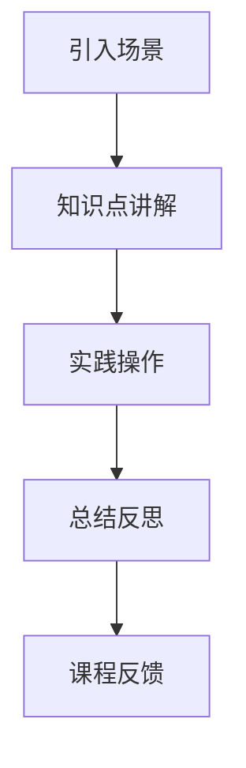
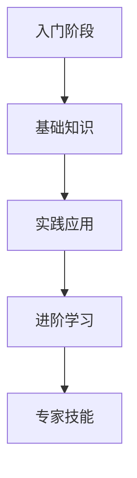

                 

在当前信息化时代，知识付费已经成为知识传播与共享的一种重要形式。对于程序员而言，将知识转化为付费课程不仅能够分享专业知识，提高个人影响力，还能为社区做出贡献。本文旨在探讨如何通过打造情景式课程来实现程序员知识付费，以更好地满足学习者和市场的需求。

## 文章关键词
- 程序员知识付费
- 情景式课程
- 教学设计
- 学习体验
- 市场需求

## 文章摘要
本文首先介绍了知识付费的背景和重要性，然后讨论了情景式课程的设计原则和实施方法。通过实际案例分析和工具推荐，文章提供了详细的指导，帮助程序员打造高质量的知识付费课程，以提升学习者的学习体验和市场竞争力。

### 1. 背景介绍

#### 1.1 知识付费的兴起

知识付费，作为一种新型的商业模式，近年来在全球范围内迅速兴起。其主要原因在于移动互联网的发展、信息过载以及人们对于优质内容的需求日益增加。随着互联网教育的普及，用户愿意为高质量的知识和服务支付费用，从而实现自我提升和专业成长。

对于程序员而言，知识付费不仅是一种变现途径，更是分享专业经验和技术的有效方式。通过知识付费，程序员可以吸引到有共同兴趣和需求的学员，形成知识共享的社区，促进整个行业的技术进步和创新。

#### 1.2 程序员知识付费的现状

目前，程序员知识付费主要分布在在线教育平台、技术博客、视频网站等多个渠道。其中，在线教育平台如Coursera、Udemy、慕课网等，提供了丰富的编程课程资源，学员可以通过购买课程进行系统学习。此外，一些知名程序员和技术博主也通过博客、视频等方式分享知识，吸引粉丝付费订阅或观看。

然而，尽管程序员知识付费已初具规模，但市场上仍然存在一些问题，如课程内容同质化、学习体验不佳等。因此，如何打造出既具有深度又具备吸引力的知识付费课程，成为程序员们面临的一大挑战。

#### 1.3 情景式课程的优势

情景式课程是一种以真实场景为背景，通过模拟实际问题的解决过程来进行教学的方法。其优势在于：

- **提高学习兴趣**：通过将理论知识与实际案例相结合，学员更容易理解和接受知识。
- **强化实践能力**：情景式课程注重学员的动手操作，有助于提升学员的编程能力和问题解决能力。
- **增强记忆效果**：在实际应用中学习，可以加深对知识的记忆和运用。

综上所述，情景式课程在程序员知识付费领域具有很大的发展潜力。接下来，本文将详细探讨如何设计和实施情景式课程。

### 2. 核心概念与联系

#### 2.1 情景式课程设计原则

情景式课程设计应遵循以下几个原则：

- **实用性**：课程内容应紧密结合实际工作场景，确保学员能够学以致用。
- **层次性**：课程应从基础到高级逐步深入，满足不同水平学员的需求。
- **互动性**：鼓励学员参与课程讨论和互动，提高学习积极性和效果。
- **灵活性**：课程应具备一定的灵活性，适应不同学习者的节奏和需求。

#### 2.2 教学流程

情景式课程的教学流程通常包括以下几个环节：

1. **引入场景**：通过一个引人入胜的故事或案例，吸引学员的注意力，激发学习兴趣。
2. **知识点讲解**：在场景背景下，讲解相关理论知识和技术要点。
3. **实践操作**：引导学员动手操作，解决问题，巩固所学知识。
4. **总结反思**：对实践过程进行总结，强化学习效果，提出改进建议。

#### 2.3 教学架构

以下是情景式课程的教学架构图，使用Mermaid进行绘制：



### 3. 核心算法原理 & 具体操作步骤

#### 3.1 算法原理概述

情景式课程的设计涉及到一系列教育理论和教学方法，其中核心的算法原理主要包括：

- **建构主义学习理论**：强调学习者在学习过程中主动建构知识体系。
- **情境认知理论**：认为学习应发生在真实或模拟的情境中，以促进知识的迁移和应用。
- **学习动机理论**：关注如何激发和维持学习者的学习动机。

#### 3.2 算法步骤详解

1. **需求分析**：了解目标学员的需求和期望，确定课程主题和内容。
2. **案例选择**：选择具有代表性的真实案例，作为课程的教学素材。
3. **知识点提取**：从案例中提取关键知识点，进行系统化整理。
4. **教学设计**：根据知识点和案例，设计教学流程和互动环节。
5. **课程开发**：编写课程文档，制作教学视频和辅助材料。
6. **课程测试**：对课程进行测试，收集反馈，优化课程内容。
7. **课程发布**：将课程上线，通过在线平台进行推广和销售。

#### 3.3 算法优缺点

**优点**：

- 提高学习兴趣和动机。
- 强化实践能力和问题解决能力。
- 促进知识迁移和应用。

**缺点**：

- 设计和开发成本较高。
- 对教师的综合素质要求较高。
- 可能存在内容同质化的问题。

#### 3.4 算法应用领域

情景式课程适用于以下领域：

- 技术培训：如编程语言、数据库、前端开发等。
- 职业教育：如软件开发、人工智能、大数据等。
- 跨学科学习：如数据科学、机器学习、深度学习等。

### 4. 数学模型和公式 & 详细讲解 & 举例说明

#### 4.1 数学模型构建

情景式课程设计中的数学模型主要涉及以下几个方面的构建：

1. **学习路径模型**：根据学员的学习能力和进度，构建个性化的学习路径。
2. **评估模型**：设计评估指标，对学员的学习效果进行量化评估。
3. **反馈模型**：根据学员的反馈，调整和优化课程内容和教学方式。

以下是学习路径模型的示意图：



#### 4.2 公式推导过程

**学习效果评估公式**：

$$
E = f(S, M, A)
$$

其中，$E$ 表示学习效果，$S$ 表示学习时间，$M$ 表示学习材料的质量，$A$ 表示学员的学习能力。

**反馈优化公式**：

$$
O = \alpha F + (1 - \alpha) O_{\text{previous}}
$$

其中，$O$ 表示优化后的课程内容，$F$ 表示学员的反馈，$\alpha$ 表示反馈的权重。

#### 4.3 案例分析与讲解

**案例 1**：某编程语言基础课程

- **学习路径模型**：从基础语法、数据结构到算法应用，分为三个阶段。
- **评估模型**：通过在线测试、作业提交和实际项目完成情况进行综合评估。
- **反馈模型**：定期收集学员的反馈，调整教学方式和内容，提高课程质量。

**案例 2**：某人工智能进阶课程

- **学习路径模型**：从机器学习基础、深度学习到应用实践，分为四个阶段。
- **评估模型**：通过项目报告、代码评审和答辩等形式进行评估。
- **反馈模型**：结合学术研究和行业趋势，不断更新课程内容，确保与实际需求接轨。

### 5. 项目实践：代码实例和详细解释说明

#### 5.1 开发环境搭建

在开始编写代码实例之前，首先需要搭建一个合适的开发环境。以下是一个简单的Python开发环境搭建步骤：

1. **安装Python**：下载并安装Python 3.8版本。
2. **配置虚拟环境**：使用`venv`命令创建一个虚拟环境，并激活。
3. **安装依赖库**：使用`pip`命令安装必要的依赖库，如`numpy`、`pandas`等。

#### 5.2 源代码详细实现

以下是一个简单的Python函数，用于计算两个数的和：

```python
def add_numbers(a, b):
    """
    计算两个数的和

    参数：
    a -- 第一个数
    b -- 第二个数

    返回：
    和 -- a和b的和
    """
    return a + b
```

#### 5.3 代码解读与分析

上述代码实现了一个简单的加法运算，主要包括以下几个部分：

- **函数定义**：使用`def`关键字定义一个函数，函数名为`add_numbers`。
- **参数传递**：函数接受两个参数，分别为`a`和`b`。
- **返回值**：函数返回两个参数的和。

此代码实现简单，但已经涵盖了函数的基本要素。在实际项目中，可以根据需求增加更多的功能，如输入校验、错误处理等。

#### 5.4 运行结果展示

在Python环境中运行上述代码，可以得到如下输出：

```shell
>>> add_numbers(3, 4)
7
```

### 6. 实际应用场景

#### 6.1 技术培训

情景式课程在技术培训领域具有广泛的应用。例如，某编程语言基础课程可以通过设计实际项目，让学员在完成项目的过程中掌握相关技术。这种教学方式不仅提高了学习兴趣，还使学员能够在实践中巩固所学知识。

#### 6.2 职业教育

在职业教育中，情景式课程可以帮助学员快速掌握行业知识和技能。例如，某人工智能进阶课程可以通过模拟真实案例，让学员在解决实际问题的过程中掌握深度学习、神经网络等高级技术。

#### 6.3 跨学科学习

跨学科学习可以通过情景式课程实现多学科知识的融合。例如，某数据科学与机器学习的课程可以结合实际案例，让学员在处理数据、构建模型和优化算法的过程中，综合运用数学、统计学和计算机科学等学科知识。

### 7. 工具和资源推荐

#### 7.1 学习资源推荐

- **在线教育平台**：如Coursera、Udemy、慕课网等，提供了丰富的编程课程资源。
- **技术博客**：如CSDN、博客园、掘金等，提供了大量技术文章和开源项目。
- **GitHub**：全球最大的开源社区，提供了大量的开源代码和项目，有助于学习和实践。

#### 7.2 开发工具推荐

- **集成开发环境**：如Visual Studio Code、PyCharm等，提供了丰富的编程工具和插件。
- **版本控制工具**：如Git，用于代码的版本管理和协作开发。
- **数据分析工具**：如Pandas、NumPy等，用于数据处理和分析。

#### 7.3 相关论文推荐

- **“Situated Learning: Legitimate Peripheral Participation” by Lave & Wenger
- **“Educational Psychology and Instructional Design: Theory into Practice” by Madeline Hunter
- **“The Elements of Computing Systems: Building a Modern Computer from First Principles” by Noam Nisan and Shimon Schocken

### 8. 总结：未来发展趋势与挑战

#### 8.1 研究成果总结

情景式课程作为一种创新的的教学方法，已经在程序员知识付费领域取得了显著的成果。通过实际案例分析和应用，情景式课程在提高学习兴趣、实践能力和知识迁移方面具有明显优势。同时，相关研究和实践也表明，情景式课程在跨学科学习和职业教育中具有广阔的应用前景。

#### 8.2 未来发展趋势

未来，情景式课程将在以下几个方面继续发展：

- **个性化学习**：通过大数据和人工智能技术，实现个性化学习路径和学习资源推荐。
- **跨学科融合**：促进不同学科知识的交叉和融合，培养复合型人才。
- **虚拟现实**：利用虚拟现实技术，提供更加沉浸式的学习体验。

#### 8.3 面临的挑战

尽管情景式课程具有诸多优势，但在实际应用中仍面临以下挑战：

- **课程开发成本**：情景式课程的设计和开发需要投入大量的人力、物力和时间。
- **教学质量评估**：如何科学、公正地评估学员的学习效果，仍然是一个亟待解决的问题。
- **版权保护**：如何保护课程内容的知识产权，避免侵权和盗版，也是一个重要问题。

#### 8.4 研究展望

未来，情景式课程的研究可以从以下几个方面展开：

- **教学设计优化**：探索更加科学和高效的教学设计方法，提高教学效果。
- **学习体验提升**：研究如何通过技术手段提升学习体验，满足学员的多样化需求。
- **跨学科融合**：进一步探讨情景式课程在跨学科学习中的应用，促进学科交叉和融合。

### 9. 附录：常见问题与解答

#### 9.1 如何设计情景式课程？

设计情景式课程需要遵循以下步骤：

1. **需求分析**：了解目标学员的需求和期望，确定课程主题和内容。
2. **案例选择**：选择具有代表性的真实案例，作为课程的教学素材。
3. **知识点提取**：从案例中提取关键知识点，进行系统化整理。
4. **教学设计**：根据知识点和案例，设计教学流程和互动环节。
5. **课程开发**：编写课程文档，制作教学视频和辅助材料。
6. **课程测试**：对课程进行测试，收集反馈，优化课程内容。
7. **课程发布**：将课程上线，通过在线平台进行推广和销售。

#### 9.2 如何评估情景式课程的教学质量？

评估情景式课程的教学质量可以从以下几个方面入手：

1. **学习效果**：通过在线测试、作业提交和实际项目完成情况进行评估。
2. **学员满意度**：通过学员反馈和调查问卷，了解学员对课程的满意度和建议。
3. **教学互动**：观察学员在课程中的参与程度和互动情况，评估教学效果。
4. **课程反馈**：根据学员的反馈，调整和优化课程内容，提高教学质量。

### 参考文献

- Lave, J., & Wenger, E. (1991). Situated learning: Legitimate peripheral participation. Cambridge University Press.
- Hunter, M. (2007). Educational psychology and instructional design: Theory into practice. Pearson Education.
- Nisan, N., & Schocken, S. (2012). The elements of computing systems: Building a modern computer from first principles. MIT Press.
```

