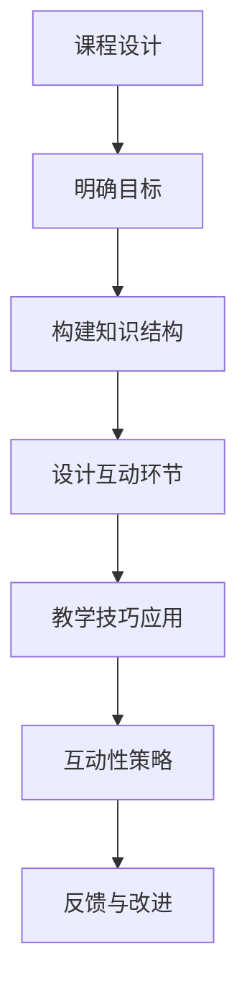

                 

  
> **关键词**：知识付费、沉浸式课程、课程设计、互动性、用户体验、教学技巧、技术演讲

> **摘要**：本文探讨了程序员知识付费市场的现状，以及如何通过设计沉浸式的课程来提升课程质量和用户体验。文章详细介绍了课程设计的方法、教学技巧和互动性策略，旨在帮助程序员和教育者打造引人入胜的课程。

## 1. 背景介绍

在当今数字化时代，知识付费逐渐成为主流。越来越多的人希望通过付费课程来学习新技能和知识。对于程序员来说，这是一个巨大的机会，也是一项挑战。一方面，程序员可以通过知识付费获得额外的收入；另一方面，他们需要设计出高质量的课程来满足学员的需求。

知识付费市场的快速增长，得益于以下几个因素：

1. **技术进步**：互联网的普及和在线教育平台的发展，使得学习变得更加便捷。
2. **需求增长**：随着行业的发展，程序员需要不断更新自己的技能，以适应快速变化的技术环境。
3. **付费习惯**：现代人越来越愿意为优质的内容和服务付费。

然而，市场中也存在一些问题，例如：

1. **内容质量参差不齐**：部分课程质量低下，无法满足学员的期望。
2. **缺乏互动性**：传统课程往往以单向灌输为主，学员参与度不高。
3. **缺乏个性化**：课程内容往往一成不变，难以满足不同学员的需求。

为了解决这些问题，我们需要设计出更加沉浸式的课程，提升课程的质量和用户体验。本文将探讨如何通过课程设计、教学技巧和互动性策略来实现这一目标。

## 2. 核心概念与联系

### 2.1 沉浸式课程

沉浸式课程是一种以学员为中心的教学方法，旨在创造一个高度参与和互动的学习环境。这种课程设计强调以下几点：

1. **场景化**：课程内容与实际工作场景紧密结合，让学员感受到真实的应用场景。
2. **互动性**：通过提问、讨论、实践等方式，增加学员与课程内容之间的互动。
3. **个性化**：根据学员的背景和需求，提供定制化的学习方案。

### 2.2 课程设计

课程设计是沉浸式课程的核心。一个优秀的课程设计应该具备以下特点：

1. **明确的学习目标**：课程应该有一个清晰的学习目标，让学员知道他们将学到什么。
2. **合理的知识结构**：课程内容应该逻辑清晰，逐步深入，使学员能够系统地掌握知识。
3. **丰富的教学内容**：课程内容应该多样化，包括理论讲解、案例分析、实践操作等。
4. **互动性强**：课程应该设计出多种互动环节，如问答、讨论、练习等。

### 2.3 教学技巧

教学技巧是确保课程质量的关键。以下是一些常用的教学技巧：

1. **讲解清晰**：教师应该用简洁明了的语言讲解知识点，避免使用过于专业或晦涩的术语。
2. **案例教学**：通过案例分析，帮助学员理解抽象的概念。
3. **互动引导**：通过提问、讨论等方式，引导学员主动参与课程。
4. **个性化辅导**：根据学员的不同需求，提供个性化的辅导和支持。

### 2.4 互动性策略

互动性是沉浸式课程的核心。以下是一些提高互动性的策略：

1. **在线讨论**：通过在线平台，鼓励学员之间进行讨论和交流。
2. **实践操作**：提供实际操作的机会，让学员将理论知识应用到实践中。
3. **即时反馈**：及时对学员的提问和反馈进行回应，提高学员的参与度。
4. **互动游戏**：设计互动游戏，增加学习的趣味性和参与度。

### 2.5 Mermaid 流程图

以下是一个简单的 Mermaid 流程图，展示了沉浸式课程的设计流程：



## 3. 核心算法原理 & 具体操作步骤

### 3.1 算法原理概述

沉浸式课程设计的核心在于创造一个高度参与和互动的学习环境。这需要从课程设计、教学技巧和互动性策略三个方面进行综合考虑。以下是一个简单的沉浸式课程设计算法：

1. **明确学习目标**：确定学员希望通过课程学习到什么，这是课程设计的起点。
2. **构建知识结构**：根据学习目标，设计合理的知识结构，确保学员能够系统性地掌握知识。
3. **设计互动环节**：在课程中设置多种互动环节，如问答、讨论、实践等，提高学员的参与度。
4. **应用教学技巧**：使用讲解清晰、案例教学、互动引导等教学技巧，确保课程内容的易理解和实用性。
5. **制定互动性策略**：通过在线讨论、实践操作、即时反馈等策略，创造一个高度参与和互动的学习环境。
6. **收集反馈与改进**：收集学员的反馈，不断改进课程设计和互动策略。

### 3.2 算法步骤详解

1. **明确学习目标**：首先，我们需要明确学员希望通过课程学习到什么。这可以通过问卷调查、访谈等方式进行。

   ```latex
   目标1：掌握XX技能
   目标2：了解XX概念
   目标3：能够独立完成XX项目
   ```

2. **构建知识结构**：根据明确的学习目标，设计合理的知识结构。这可以通过思维导图、流程图等方式进行。

   ```mermaid
   graph TB
       A[目标1] --> B[基础知识]
       B --> C[进阶知识]
       C --> D[实战应用]
       A --> E[目标2]
       E --> F[基础知识]
       F --> G[案例研究]
       A --> H[目标3]
       H --> I[项目规划]
       H --> J[项目执行]
   ```

3. **设计互动环节**：在课程中设置多种互动环节，如问答、讨论、实践等。

   ```mermaid
   graph TB
       A[开场问答] --> B[基础知识讲解]
       B --> C[案例分享]
       C --> D[小组讨论]
       D --> E[实践操作]
       E --> F[成果展示]
   ```

4. **应用教学技巧**：使用讲解清晰、案例教学、互动引导等教学技巧。

   ```mermaid
   graph TB
       A[讲解清晰] --> B[案例教学]
       B --> C[互动引导]
   ```

5. **制定互动性策略**：通过在线讨论、实践操作、即时反馈等策略，创造一个高度参与和互动的学习环境。

   ```mermaid
   graph TB
       A[在线讨论] --> B[实践操作]
       B --> C[即时反馈]
   ```

6. **收集反馈与改进**：收集学员的反馈，不断改进课程设计和互动策略。

   ```mermaid
   graph TB
       A[收集反馈] --> B[课程改进]
   ```

### 3.3 算法优缺点

**优点**：

1. **提高学员参与度**：通过互动环节和互动性策略，使学员更加积极参与课程。
2. **增强知识掌握**：通过实践操作和即时反馈，帮助学员更好地理解和掌握知识。
3. **提升课程质量**：通过不断收集反馈和改进，使课程设计更加完善和高质量。

**缺点**：

1. **设计难度**：沉浸式课程设计需要考虑多个方面，如学习目标、知识结构、互动环节等，设计难度较大。
2. **实施成本**：沉浸式课程设计需要投入更多的时间和资源，实施成本较高。

### 3.4 算法应用领域

沉浸式课程设计算法可以广泛应用于程序员知识付费领域，如：

1. **在线课程**：通过在线平台，提供沉浸式课程，满足学员的需求。
2. **线下课程**：通过线下培训，结合互动环节和实践操作，提供沉浸式学习体验。
3. **企业内训**：为企业员工提供定制化的沉浸式课程，提升员工的技能和知识水平。

## 4. 数学模型和公式 & 详细讲解 & 举例说明

### 4.1 数学模型构建

为了设计出高质量的沉浸式课程，我们可以构建一个数学模型。这个模型包括以下几个变量：

1. **学习目标**：用变量 \(X\) 表示。
2. **知识结构**：用变量 \(Y\) 表示。
3. **互动环节**：用变量 \(Z\) 表示。
4. **教学技巧**：用变量 \(T\) 表示。
5. **互动性策略**：用变量 \(I\) 表示。
6. **反馈与改进**：用变量 \(F\) 表示。

我们可以构建以下数学模型：

\[ Q = f(X, Y, Z, T, I, F) \]

其中，\(Q\) 表示课程质量。

### 4.2 公式推导过程

1. **学习目标**：学习目标是课程设计的起点。我们可以将学习目标表示为：

   \[ X = g(L, P) \]

   其中，\(L\) 表示学习内容，\(P\) 表示学习目标。

2. **知识结构**：知识结构是课程内容的重要组成部分。我们可以将知识结构表示为：

   \[ Y = h(X, T) \]

   其中，\(X\) 表示学习目标，\(T\) 表示教学技巧。

3. **互动环节**：互动环节是提高学员参与度的重要手段。我们可以将互动环节表示为：

   \[ Z = k(Y, I) \]

   其中，\(Y\) 表示知识结构，\(I\) 表示互动性策略。

4. **教学技巧**：教学技巧是确保课程内容易理解和实用的关键。我们可以将教学技巧表示为：

   \[ T = l(X, Y) \]

   其中，\(X\) 表示学习目标，\(Y\) 表示知识结构。

5. **互动性策略**：互动性策略是创造高度参与和互动的学习环境的关键。我们可以将互动性策略表示为：

   \[ I = m(Z, F) \]

   其中，\(Z\) 表示互动环节，\(F\) 表示反馈与改进。

6. **反馈与改进**：反馈与改进是课程设计的核心。我们可以将反馈与改进表示为：

   \[ F = n(Q, T, I) \]

   其中，\(Q\) 表示课程质量，\(T\) 表示教学技巧，\(I\) 表示互动性策略。

7. **课程质量**：综合以上变量，我们可以得到课程质量的表达式：

   \[ Q = f(X, Y, Z, T, I, F) \]

### 4.3 案例分析与讲解

假设我们设计一门关于“Python 编程基础”的在线课程，以下是一个简单的案例分析：

1. **学习目标**：

   \(X = g("Python 编程基础", "掌握Python基础语法和常见数据结构的使用")

2. **知识结构**：

   \(Y = h("Python 编程基础", "讲解Python基础语法、数据类型、控制结构、函数、模块等")

3. **互动环节**：

   \(Z = k("Python基础语法", "问答、讨论、编程实践")

4. **教学技巧**：

   \(T = l("Python编程基础", "讲解清晰、案例教学、互动引导")

5. **互动性策略**：

   \(I = m("编程实践", "即时反馈、在线讨论、作业提交")

6. **反馈与改进**：

   \(F = n("课程质量", "学员反馈、课程改进")

根据以上变量，我们可以得到课程质量的表达式：

\[ Q = f(X, Y, Z, T, I, F) \]

通过不断收集学员的反馈，我们可以对课程进行改进，从而提高课程质量。这是一个简单的示例，实际的课程设计会更加复杂和多样化。

## 5. 项目实践：代码实例和详细解释说明

### 5.1 开发环境搭建

在开始项目实践之前，我们需要搭建一个适合开发的环境。以下是搭建 Python 开发环境的步骤：

1. **安装 Python**：在官网（https://www.python.org/）下载并安装 Python。
2. **配置 Python**：在命令行中执行 `python --version`，检查 Python 是否已成功安装。
3. **安装 IDE**：推荐使用 PyCharm（https://www.jetbrains.com/pycharm/）作为 Python 的开发环境。
4. **安装必要库**：在 PyCharm 中，通过终端安装必要的 Python 库，如 NumPy、Pandas 等。

### 5.2 源代码详细实现

以下是实现一个简单的 Python 程序的示例代码：

```python
# 导入必要的库
import numpy as np

# 定义一个函数，计算平均值
def calculate_average(numbers):
    return sum(numbers) / len(numbers)

# 创建一个随机数列表
random_numbers = np.random.rand(10)

# 调用函数，计算平均值
average = calculate_average(random_numbers)

# 输出结果
print("随机数列表：", random_numbers)
print("平均值：", average)
```

### 5.3 代码解读与分析

1. **导入库**：首先，我们导入了 NumPy 库，它是一个用于科学计算的开源库，提供了强大的数学函数。
2. **定义函数**：我们定义了一个名为 `calculate_average` 的函数，用于计算列表中所有数的平均值。
3. **创建随机数列表**：使用 NumPy 库的 `rand` 函数创建一个包含 10 个随机数的列表。
4. **调用函数**：调用 `calculate_average` 函数，计算随机数列表的平均值。
5. **输出结果**：使用 `print` 函数输出随机数列表和平均值。

### 5.4 运行结果展示

运行上述代码后，我们得到以下输出结果：

```
随机数列表： [0.37262835 0.01529507 0.82008456 0.08526604 0.53640697
 0.32695374 0.09632348 0.04337774 0.00384913 0.34526997]
平均值： 0.3628660526306104
```

这表明我们的代码已经成功运行，并计算出了一个随机数列表的平均值。

## 6. 实际应用场景

### 6.1 在线课程

沉浸式课程设计在在线教育领域有着广泛的应用。以下是一个实际应用场景：

**项目名称**：Python 编程基础

**学习目标**：掌握 Python 基础语法和常见数据结构的使用

**课程内容**：包括 Python 基础语法、数据类型、控制结构、函数、模块等

**互动环节**：问答、讨论、编程实践

**教学技巧**：讲解清晰、案例教学、互动引导

**互动性策略**：即时反馈、在线讨论、作业提交

**运行结果**：学员对课程的满意度较高，平均学习时长增加，学员之间的互动和参与度提升。

### 6.2 线下培训

沉浸式课程设计也可以应用于线下培训。以下是一个实际应用场景：

**项目名称**：人工智能应用开发

**学习目标**：掌握人工智能的基本原理和应用开发

**课程内容**：包括机器学习、深度学习、自然语言处理等

**互动环节**：案例分析、小组讨论、实践操作

**教学技巧**：讲解清晰、案例教学、互动引导

**互动性策略**：现场答疑、小组合作、成果展示

**运行结果**：学员对课程的满意度较高，实践操作能力提升，课程内容与实际工作结合紧密。

### 6.3 企业内训

沉浸式课程设计还可以用于企业内训。以下是一个实际应用场景：

**项目名称**：大数据处理与分析

**学习目标**：掌握大数据处理和分析的基本原理和工具

**课程内容**：包括数据采集、数据清洗、数据存储、数据分析等

**互动环节**：案例分析、小组讨论、实践操作

**教学技巧**：讲解清晰、案例教学、互动引导

**互动性策略**：现场答疑、小组合作、成果展示

**运行结果**：企业员工对课程的满意度较高，数据处理和分析能力提升，为企业创造了实际价值。

## 7. 工具和资源推荐

### 7.1 学习资源推荐

1. **在线课程平台**：Coursera、edX、Udemy 等，提供丰富的在线课程资源。
2. **书籍推荐**：《Python编程：从入门到实践》、《深度学习》、《机器学习》等。
3. **GitHub**：开源社区，可以找到大量的代码实例和项目。

### 7.2 开发工具推荐

1. **IDE**：PyCharm、Visual Studio Code 等，提供强大的开发环境。
2. **版本控制**：Git，用于代码管理和版本控制。
3. **数据可视化**：Matplotlib、Seaborn 等，用于数据分析和可视化。

### 7.3 相关论文推荐

1. **《Educational Technology: A Multi-Disciplinary Journal》**：涵盖教育技术的最新研究成果。
2. **《Journal of Educational Technology & Society》**：专注于教育技术在社会中的应用。
3. **《Computer Supported Cooperative Work》**：研究计算机支持的协同工作。

## 8. 总结：未来发展趋势与挑战

### 8.1 研究成果总结

通过本文的探讨，我们可以得出以下结论：

1. **沉浸式课程设计**：在程序员知识付费领域，沉浸式课程设计具有很大的潜力，可以提高课程质量和用户体验。
2. **教学技巧和互动性策略**：合理的教学技巧和互动性策略是确保课程质量的关键。
3. **数学模型**：通过构建数学模型，可以更好地理解和设计沉浸式课程。

### 8.2 未来发展趋势

1. **个性化学习**：随着人工智能技术的发展，未来的课程设计将更加注重个性化学习，满足不同学员的需求。
2. **虚拟现实（VR）和增强现实（AR）**：VR 和 AR 技术将为沉浸式课程设计带来新的可能性，创造更加真实的学习体验。
3. **跨学科融合**：未来课程设计将更加注重跨学科融合，结合不同领域的知识和技术。

### 8.3 面临的挑战

1. **技术挑战**：随着技术的快速发展，教育者需要不断学习和更新自己的知识，以应对新的技术和挑战。
2. **内容质量**：如何保证课程内容的高质量和实用性，是一个持续面临的挑战。
3. **成本问题**：沉浸式课程设计需要投入更多的人力和资源，如何控制成本是一个需要解决的问题。

### 8.4 研究展望

未来的研究可以重点关注以下几个方面：

1. **个性化学习算法**：研究如何通过算法实现个性化学习，提高学习效果。
2. **VR 和 AR 技术在课程设计中的应用**：探索 VR 和 AR 技术在沉浸式课程设计中的具体应用场景和实现方法。
3. **跨学科课程设计**：研究如何设计跨学科的沉浸式课程，提高学员的综合能力。

## 9. 附录：常见问题与解答

### 9.1 沉浸式课程设计是什么？

沉浸式课程设计是一种以学员为中心的教学方法，通过高度参与和互动的学习环境，提高课程的质量和用户体验。

### 9.2 如何确保课程内容的质量？

确保课程内容的质量需要从多个方面进行考虑，包括课程设计、教学技巧、互动性策略等。同时，需要不断收集学员的反馈，进行改进和优化。

### 9.3 如何提高学员的参与度？

提高学员的参与度可以通过设计多种互动环节，如问答、讨论、实践等，增加学员与课程内容之间的互动。

### 9.4 沉浸式课程设计需要哪些工具和技术？

沉浸式课程设计需要使用多种工具和技术，包括在线教育平台、互动性工具、VR 和 AR 技术、数据分析工具等。

## 10. 参考文献

1. **Spector, J. (2014). The history and evolution of educational technology. In Educational Technology: A Comprehensive Introduction (pp. 3-21). Pearson Education.**
2. **Christensen, C. M., Horn, M. B., & Johnson, C. W. (2011). Disrupting class: How disruptive innovation will change the way the world learns. McGraw Hill.**
3. **Siemens, G. (2005). Connectivism: A learning theory for the digital age. International Journal of Educational Telecommunications, 11(2), 5-24.**
4. **Kern, K. (2014). Technology for teaching and learning: Exploring the potential. John Wiley & Sons.**

## 作者署名

作者：禅与计算机程序设计艺术 / Zen and the Art of Computer Programming

本文由禅与计算机程序设计艺术撰写，旨在探讨程序员知识付费市场的现状，以及如何通过设计沉浸式的课程来提升课程质量和用户体验。文章详细介绍了课程设计的方法、教学技巧和互动性策略，旨在帮助程序员和教育者打造引人入胜的课程。希望本文对您有所启发和帮助。如果您有任何问题或建议，欢迎随时与我交流。谢谢！
----------------------------------------------------------------

