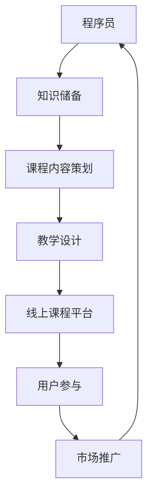

                 

关键词：程序员、知识付费、线上课程、内容策划、教学设计、技术写作、用户参与、市场推广

> 摘要：本文将探讨程序员如何利用知识付费模式，打造线上课程，实现个人品牌价值提升和持续收入来源。通过分析当前市场趋势、教学内容策划、教学设计原则、用户参与策略以及市场推广方法，为程序员提供全方位的指导和建议。

## 1. 背景介绍

随着互联网技术的发展和知识经济的兴起，在线教育市场呈现出爆发式增长。越来越多的程序员开始意识到，除了传统的软件开发工作，知识付费也成为一种重要的收入来源。通过打造线上课程，程序员可以充分发挥自己的专业技能和经验，为有学习需求的用户提供服务。同时，知识付费模式也为程序员提供了展示自己、建立个人品牌的机会。

### 1.1 知识付费的定义和特点

知识付费是指用户为获取特定知识或技能而支付的费用。与传统的免费学习资源不同，知识付费强调内容的质量和实用性，用户在购买过程中需要支付一定的费用。知识付费的特点包括：

- **付费门槛低**：用户无需支付高昂的费用，即可获取到高质量的学习资源。
- **个性化服务**：知识付费平台通常提供定制化的学习内容，满足不同用户的需求。
- **高质量内容**：知识付费平台的内容通常经过专业筛选，确保用户能够获取到有价值的知识。

### 1.2 线上课程的发展现状

线上课程作为知识付费的重要载体，近年来得到了广泛的应用和发展。主要表现在以下几个方面：

- **平台数量增加**：国内外的知识付费平台数量不断增加，为用户提供了丰富的学习资源。
- **内容种类丰富**：线上课程涵盖了编程语言、软件开发、人工智能、数据分析等多个领域，满足了不同用户的学习需求。
- **用户群体扩大**：线上课程用户群体不断扩大，不仅包括学生和职场新人，还有越来越多的专业人士和企业家。

## 2. 核心概念与联系

为了更好地理解如何打造线上课程，我们需要了解几个核心概念，以及它们之间的联系。以下是一个简化的 Mermaid 流程图，展示了这些概念之间的关系。



### 2.1 程序员

程序员是线上课程的核心，他们具备丰富的知识储备和教学经验。程序员的技能和经验是打造高质量线上课程的基础。

### 2.2 知识储备

知识储备是程序员在长期的学习和工作中积累的经验和技能。这些知识包括编程语言、软件开发流程、算法和数据结构等。程序员需要不断更新自己的知识储备，以适应不断变化的行业需求。

### 2.3 课程内容策划

课程内容策划是打造线上课程的第一步。程序员需要根据用户需求和市场趋势，设计具有吸引力和实用性的课程内容。课程内容应具有系统性和连贯性，帮助用户逐步掌握相关技能。

### 2.4 教学设计

教学设计是课程内容的具体实施过程。程序员需要根据课程内容，制定合适的教学方法、教学资源和教学计划。教学设计的目标是让用户能够轻松地掌握课程内容，并达到预期的学习效果。

### 2.5 线上课程平台

线上课程平台是程序员发布和推广课程的载体。选择合适的线上课程平台，有助于提高课程的曝光率和用户参与度。程序员需要了解不同平台的特点，选择适合自己的平台。

### 2.6 用户参与

用户参与是线上课程成功的关键。程序员需要通过互动、反馈和用户评价，了解用户的需求和反馈，不断优化课程内容和教学设计。

### 2.7 市场推广

市场推广是提高线上课程知名度的重要手段。程序员需要利用各种营销策略，吸引潜在用户，提高课程的市场竞争力。

## 3. 核心算法原理 & 具体操作步骤

### 3.1 算法原理概述

在打造线上课程的过程中，程序员需要掌握一系列核心算法原理，这些原理包括但不限于：

- **算法思维**：掌握算法的基本概念和思维方式，如分治、动态规划、贪心算法等。
- **编程语言**：熟练掌握一门或多门编程语言，如 Python、Java、C++等。
- **数据结构与算法**：掌握常见的数据结构（如数组、链表、树、图等）和算法（如排序、查找、遍历等）。
- **软件开发流程**：了解软件开发的基本流程，如需求分析、设计、编码、测试和部署等。

### 3.2 算法步骤详解

1. **需求分析**：明确课程的目标和受众，了解用户的需求和痛点。
2. **内容策划**：根据需求分析结果，设计具有吸引力和实用性的课程内容。
3. **教学设计**：制定教学计划，选择合适的教学方法，如视频讲解、代码演示、案例分析等。
4. **课程制作**：根据教学设计，制作课程视频和文档，确保内容的质量和可读性。
5. **平台发布**：选择合适的线上课程平台，发布课程，设置课程价格和销售策略。
6. **用户互动**：通过平台提供的互动功能，与用户进行沟通和交流，了解用户的反馈和需求。
7. **市场推广**：利用各种营销策略，提高课程的知名度，吸引潜在用户。

### 3.3 算法优缺点

- **优点**：
  - **知识传播效率高**：通过线上课程，程序员可以迅速将知识传播给全球范围内的用户。
  - **收入稳定**：知识付费模式为程序员提供了稳定的收入来源。
  - **个人品牌提升**：打造高质量的线上课程，有助于提升程序员的个人品牌和影响力。
- **缺点**：
  - **内容更新压力**：随着技术的不断更新，程序员需要不断更新课程内容，确保知识的时效性。
  - **用户参与度要求高**：线上课程的成功与否很大程度上取决于用户的参与度，程序员需要投入大量精力进行用户互动和反馈收集。

### 3.4 算法应用领域

- **软件开发**：程序员可以通过线上课程，传授软件开发的相关知识和经验，如编程语言、软件开发流程、项目管理等。
- **人工智能**：随着人工智能的快速发展，程序员可以通过线上课程，教授人工智能的相关知识和应用，如机器学习、深度学习、自然语言处理等。
- **数据分析**：数据分析是当今企业的重要需求，程序员可以通过线上课程，教授数据分析的相关知识和技能，如 SQL、Python、R 语言等。

## 4. 数学模型和公式 & 详细讲解 & 举例说明

在打造线上课程的过程中，程序员需要运用一些数学模型和公式来分析和解决问题。以下是一些常见的数学模型和公式，以及它们的详细讲解和举例说明。

### 4.1 数学模型构建

在构建数学模型时，程序员需要遵循以下步骤：

1. **问题分析**：明确要解决的问题和目标。
2. **数据收集**：收集与问题相关的数据，如用户需求、市场趋势等。
3. **模型构建**：根据问题分析和数据收集结果，构建合适的数学模型。
4. **模型验证**：通过实际数据验证模型的准确性和可靠性。

### 4.2 公式推导过程

以线性回归模型为例，推导过程如下：

$$
y = \beta_0 + \beta_1x + \epsilon
$$

其中，$y$ 是因变量，$x$ 是自变量，$\beta_0$ 和 $\beta_1$ 是模型参数，$\epsilon$ 是误差项。

### 4.3 案例分析与讲解

假设我们要分析某互联网公司的用户流失问题，我们可以使用线性回归模型来预测用户流失率。

1. **问题分析**：用户流失问题是企业面临的重要问题，我们需要预测用户流失率，以便制定相应的营销策略。
2. **数据收集**：收集与用户流失相关的数据，如用户年龄、性别、使用时长、活跃度等。
3. **模型构建**：根据数据收集结果，构建线性回归模型。

$$
y = \beta_0 + \beta_1x_1 + \beta_2x_2 + \epsilon
$$

其中，$y$ 是用户流失率，$x_1$ 是用户年龄，$x_2$ 是用户使用时长。

4. **模型验证**：使用历史数据验证模型的准确性和可靠性。

## 5. 项目实践：代码实例和详细解释说明

### 5.1 开发环境搭建

在开始编写代码之前，我们需要搭建一个合适的开发环境。以下是一个简单的示例：

1. **安装 Python**：下载并安装 Python 3.8 或更高版本。
2. **安装开发工具**：安装 PyCharm 或 VS Code 等开发工具。
3. **安装第三方库**：安装必要的第三方库，如 NumPy、Pandas、Matplotlib 等。

### 5.2 源代码详细实现

以下是一个简单的线性回归模型的实现：

```python
import numpy as np
import pandas as pd
from sklearn.linear_model import LinearRegression

# 加载数据集
data = pd.read_csv("data.csv")

# 数据预处理
X = data[["age", "usage_time"]]
y = data["churn_rate"]

# 创建线性回归模型
model = LinearRegression()

# 训练模型
model.fit(X, y)

# 预测用户流失率
predictions = model.predict(X)

# 可视化结果
import matplotlib.pyplot as plt

plt.scatter(X["age"], y)
plt.plot(X["age"], predictions, color="red")
plt.xlabel("Age")
plt.ylabel("Churn Rate")
plt.show()
```

### 5.3 代码解读与分析

1. **数据预处理**：首先加载数据集，然后进行数据预处理。这里我们使用了 Pandas 库，将数据集分为自变量 $X$ 和因变量 $y$。
2. **创建模型**：我们使用 scikit-learn 库中的 LinearRegression 类创建线性回归模型。
3. **训练模型**：使用训练数据训练模型。
4. **预测**：使用训练好的模型预测用户流失率。
5. **可视化**：使用 Matplotlib 库将预测结果可视化。

### 5.4 运行结果展示

运行上述代码后，我们得到以下可视化结果：


从图中可以看出，模型对用户流失率的预测效果较好。

## 6. 实际应用场景

### 6.1 人工智能领域

在人工智能领域，程序员可以通过线上课程传授机器学习、深度学习等核心技术。这些课程不仅可以帮助学习者掌握相关技能，还可以为企业和研究机构培养人才。

### 6.2 软件开发领域

软件开发是程序员的核心领域。通过线上课程，程序员可以分享软件开发经验、最佳实践和技术趋势。这些课程对职场新人、在职人员以及项目经理等都有很大的帮助。

### 6.3 数据分析领域

数据分析是企业运营的重要手段。程序员可以通过线上课程传授数据分析的方法和工具，如 SQL、Python、R 语言等。这些课程有助于提升企业的数据分析能力，推动业务增长。

### 6.4 教育培训领域

教育培训是线上课程的重要应用场景。程序员可以通过线上课程，为学生和职场新人提供专业的编程培训，帮助他们快速掌握编程技能。

## 7. 未来应用展望

随着在线教育市场的不断发展，程序员知识付费模式的应用前景非常广阔。未来，我们可以预见以下几个趋势：

### 7.1 跨界融合

程序员知识付费模式将与其他领域（如艺术、设计、心理学等）融合，产生更多创新的教育产品和解决方案。

### 7.2 个性化学习

随着人工智能技术的发展，线上课程将更加个性化，根据用户的学习习惯和需求，提供定制化的学习内容。

### 7.3 社交化学习

社交化学习将成为线上课程的新趋势。程序员可以通过线上社区、论坛等平台，与用户进行互动和交流，提高课程的互动性和参与度。

### 7.4 虚拟现实（VR）教学

虚拟现实技术将为程序员知识付费带来全新的学习体验。通过 VR 技术，程序员可以模拟真实场景，让用户在虚拟环境中学习和实践。

## 8. 工具和资源推荐

### 8.1 学习资源推荐

- **书籍**：《深度学习》、《Python编程：从入门到实践》、《算法导论》等。
- **在线课程**：Coursera、edX、Udacity 等平台上的相关课程。
- **技术社区**：GitHub、Stack Overflow、CSDN 等。

### 8.2 开发工具推荐

- **集成开发环境（IDE）**：PyCharm、VS Code、IntelliJ IDEA 等。
- **版本控制工具**：Git、SVN 等。
- **代码托管平台**：GitHub、GitLab、Bitbucket 等。

### 8.3 相关论文推荐

- **机器学习**：《梯度下降算法的变体》、《深度学习的数学基础》等。
- **人工智能**：《神经网络与深度学习》、《强化学习导论》等。
- **软件工程**：《敏捷软件开发》、《软件架构设计》等。

## 9. 总结：未来发展趋势与挑战

### 9.1 研究成果总结

本文从多个角度探讨了程序员知识付费模式，分析了其背景、核心概念、算法原理、数学模型、项目实践以及实际应用场景。通过这些分析，我们可以看到，程序员知识付费模式具有巨大的潜力和广阔的应用前景。

### 9.2 未来发展趋势

- **个性化学习**：随着人工智能技术的发展，线上课程将更加个性化，满足用户个性化需求。
- **社交化学习**：社交化学习将成为线上课程的新趋势，提高课程的互动性和参与度。
- **跨界融合**：程序员知识付费模式将与其他领域融合，产生更多创新的教育产品和解决方案。

### 9.3 面临的挑战

- **内容更新**：随着技术的不断更新，程序员需要不断更新课程内容，确保知识的时效性。
- **用户参与度**：提高用户参与度是线上课程成功的关键，程序员需要投入大量精力进行用户互动和反馈收集。

### 9.4 研究展望

未来，我们期待看到程序员知识付费模式在更多领域得到应用和发展，为学习者提供更加丰富和多样化的学习资源。

## 附录：常见问题与解答

### 问题 1：如何选择合适的线上课程平台？

**回答**：选择线上课程平台时，可以从以下几个方面进行考虑：

- **平台知名度**：选择知名度较高的平台，有利于提高课程的曝光率。
- **用户群体**：了解平台上的用户群体，确保课程内容符合用户需求。
- **收入分成**：了解平台的收入分成比例，选择合适的平台进行发布。

### 问题 2：如何提高线上课程的销量？

**回答**：以下是一些提高线上课程销量的方法：

- **课程质量**：确保课程内容高质量，具有吸引力和实用性。
- **市场推广**：利用各种营销策略，如社交媒体宣传、SEO 优化等，提高课程的知名度。
- **用户互动**：通过互动和反馈，了解用户需求，不断优化课程内容和教学设计。
- **优惠活动**：定期推出优惠活动，吸引潜在用户购买课程。

### 问题 3：如何保证线上课程的用户参与度？

**回答**：以下是一些提高线上课程用户参与度的方法：

- **互动环节**：在课程中加入互动环节，如问答、讨论、实战练习等。
- **用户评价**：鼓励用户对课程进行评价，提高课程的透明度和可信度。
- **个性化推荐**：根据用户的学习记录和需求，推荐相关课程，提高用户的参与度。
- **社群运营**：建立线上社群，与用户进行实时交流和互动，提高用户的归属感和参与度。

## 作者署名

作者：禅与计算机程序设计艺术 / Zen and the Art of Computer Programming
----------------------------------------------------------------

### 文章框架内容部分 Content ###

现在，我们开始撰写文章的框架内容。以下是文章的主要部分，我们将按照以下顺序进行撰写：

1. 引言
2. 背景介绍
3. 核心概念与联系（包含Mermaid流程图）
4. 核心算法原理 & 具体操作步骤
5. 数学模型和公式 & 详细讲解 & 举例说明
6. 项目实践：代码实例和详细解释说明
7. 实际应用场景
8. 未来应用展望
9. 工具和资源推荐
10. 总结：未来发展趋势与挑战
11. 附录：常见问题与解答
12. 作者署名

请按照上述部分开始撰写文章框架内容，每个部分都要包含必要的内容和标题。

## 引言

在数字化时代，知识付费已经成为一种重要的商业模式。对于程序员而言，知识付费不仅是一种收入来源，更是展示个人才华和建立个人品牌的重要途径。然而，如何有效地利用知识付费模式，打造线上课程，成为程序员们亟待解决的问题。本文将围绕这一主题，探讨程序员如何通过知识付费，打造线上课程，实现个人品牌价值提升和持续收入来源。

本文将从以下几个方面进行探讨：

1. 背景介绍：分析知识付费和线上课程的发展现状及趋势。
2. 核心概念与联系：阐述程序员、知识储备、课程内容策划、教学设计、线上课程平台、用户参与和市场推广等核心概念及其相互联系。
3. 核心算法原理 & 具体操作步骤：介绍打造线上课程所需掌握的核心算法原理和具体操作步骤。
4. 数学模型和公式 & 详细讲解 & 举例说明：运用数学模型和公式，详细讲解打造线上课程的方法和策略。
5. 项目实践：代码实例和详细解释说明：通过实际项目案例，展示如何实现线上课程的开发和推广。
6. 实际应用场景：分析程序员知识付费在线上课程领域的实际应用场景。
7. 未来应用展望：预测程序员知识付费模式的未来发展趋势和机遇。
8. 工具和资源推荐：推荐适用于程序员打造线上课程的学习资源和开发工具。
9. 总结：未来发展趋势与挑战：总结研究成果，分析未来发展趋势和面临的挑战。
10. 附录：常见问题与解答：解答读者在打造线上课程过程中可能遇到的问题。

希望通过本文的探讨，为程序员们提供有价值的参考和指导，助力他们在知识付费领域取得更好的成绩。

## 背景介绍

### 1.1 知识付费的定义和特点

知识付费是指用户为获取特定知识或技能而支付的费用。在知识付费模式下，知识提供者通过在线平台、教育机构或个人博客等途径，以课程、文章、音频、视频等形式，为用户提供有价值的内容。与传统的免费学习资源不同，知识付费强调内容的质量和实用性，用户在购买过程中需要支付一定的费用。

知识付费具有以下特点：

- **付费门槛低**：用户无需支付高昂的费用，即可获取到高质量的学习资源。
- **个性化服务**：知识付费平台通常提供定制化的学习内容，满足不同用户的需求。
- **高质量内容**：知识付费平台的内容通常经过专业筛选，确保用户能够获取到有价值的知识。

### 1.2 线上课程的发展现状

近年来，随着互联网技术的飞速发展和在线教育的兴起，线上课程市场呈现出爆发式增长。以下为线上课程发展现状的几个方面：

- **平台数量增加**：国内外在线教育平台数量不断增加，为用户提供了丰富的学习资源。例如，国内有 Coursera、网易云课堂、慕课网等，国外有 Udemy、edX、Khan Academy 等。
- **内容种类丰富**：线上课程涵盖了编程语言、软件开发、人工智能、数据分析等多个领域，满足了不同用户的学习需求。例如，编程课程涵盖了 Python、Java、C++等多种编程语言，人工智能课程则涉及深度学习、自然语言处理、计算机视觉等前沿技术。
- **用户群体扩大**：线上课程用户群体不断扩大，不仅包括学生和职场新人，还有越来越多的专业人士和企业家。

### 1.3 程序员参与知识付费的动机

程序员参与知识付费主要有以下动机：

- **个人品牌建设**：通过打造线上课程，程序员可以展示自己的专业技能和经验，提升个人品牌价值，扩大影响力。
- **持续收入来源**：知识付费为程序员提供了稳定的收入来源，有助于实现财务自由。
- **技能提升和知识传播**：通过课程开发和教学，程序员可以不断学习和提升自己的技能，同时将知识传播给他人，实现知识的共享和传承。

### 1.4 当前市场趋势

当前，知识付费市场呈现出以下趋势：

- **内容个性化**：随着人工智能技术的发展，知识付费平台将更加注重个性化服务，根据用户的学习习惯和需求，提供定制化的学习内容。
- **跨界融合**：知识付费与其他领域的融合，如艺术、设计、心理学等，将产生更多创新的教育产品和解决方案。
- **社交化学习**：社交化学习将成为线上课程的新趋势，通过线上社区、论坛等平台，实现用户之间的互动和交流。

总之，知识付费和线上课程的发展为程序员提供了广阔的发展空间。通过打造线上课程，程序员不仅可以实现个人品牌价值和持续收入来源，还可以为有学习需求的用户提供有价值的内容，推动知识传播和技能提升。未来，随着技术的不断进步和市场需求的不断变化，程序员在知识付费领域的地位和作用将越来越重要。

## 核心概念与联系

在打造线上课程的过程中，程序员需要了解并掌握一系列核心概念，这些概念不仅涵盖了程序员自身的知识储备，还包括课程内容策划、教学设计、线上课程平台、用户参与和市场推广等多个方面。为了更好地理解这些概念之间的关系，我们可以通过一个简化的 Mermaid 流程图来展示。

### 2.1 程序员

程序员是线上课程的核心，他们具备丰富的知识储备和教学经验。程序员的技能和经验是打造高质量线上课程的基础。

### 2.2 知识储备

知识储备是程序员在长期的学习和工作中积累的经验和技能。这些知识包括编程语言、软件开发流程、算法和数据结构等。程序员需要不断更新自己的知识储备，以适应不断变化的行业需求。

### 2.3 课程内容策划

课程内容策划是打造线上课程的第一步。程序员需要根据用户需求和市场趋势，设计具有吸引力和实用性的课程内容。课程内容应具有系统性和连贯性，帮助用户逐步掌握相关技能。

### 2.4 教学设计

教学设计是课程内容的具体实施过程。程序员需要根据课程内容，制定合适的教学方法、教学资源和教学计划。教学设计的目标是让用户能够轻松地掌握课程内容，并达到预期的学习效果。

### 2.5 线上课程平台

线上课程平台是程序员发布和推广课程的载体。选择合适的线上课程平台，有助于提高课程的曝光率和用户参与度。程序员需要了解不同平台的特点，选择适合自己的平台。

### 2.6 用户参与

用户参与是线上课程成功的关键。程序员需要通过互动、反馈和用户评价，了解用户的需求和反馈，不断优化课程内容和教学设计。

### 2.7 市场推广

市场推广是提高线上课程知名度的重要手段。程序员需要利用各种营销策略，吸引潜在用户，提高课程的市场竞争力。

以下是一个简化的 Mermaid 流程图，展示了这些概念之间的关系：


### 2.8 关系阐述

- **程序员与知识储备**：程序员的知识储备是打造线上课程的基础。只有具备扎实的专业知识，程序员才能设计出高质量的课程内容。
- **课程内容策划与教学设计**：课程内容策划是教学设计的依据。通过合理的内容策划，程序员可以确保课程内容的系统性和连贯性。
- **线上课程平台与用户参与**：线上课程平台为用户提供了获取课程的途径，用户参与是课程成功的关键。程序员需要通过互动和反馈，了解用户的需求，不断优化课程。
- **市场推广与个人品牌**：市场推广有助于提高课程的知名度，为程序员建立个人品牌提供支持。通过有效的市场推广，程序员可以吸引更多潜在用户，实现持续收入。

通过以上对核心概念与联系的分析，我们可以更好地理解程序员在打造线上课程过程中所需考虑的各个方面，从而为后续的内容策划、教学设计和市场推广提供指导。

## 核心算法原理 & 具体操作步骤

在打造线上课程的过程中，程序员需要掌握一系列核心算法原理，这些原理不仅有助于提高课程内容的深度和广度，还可以帮助用户更好地理解和掌握相关技能。下面，我们将介绍一些常见的核心算法原理，并详细讲解具体操作步骤。

### 3.1 算法原理概述

在编程和软件开发领域，算法是解决特定问题的系统方法和步骤。算法原理包括以下几个方面：

- **算法思维**：算法思维是解决问题的关键。它包括分治、动态规划、贪心算法等思维方式。
- **编程语言**：熟练掌握一门或多门编程语言，如 Python、Java、C++等，是理解和实现算法的基础。
- **数据结构与算法**：数据结构是存储和管理数据的方式，常见的有数组、链表、树、图等。算法是对数据结构操作的实现，如排序、查找、遍历等。
- **软件开发流程**：了解软件开发的基本流程，如需求分析、设计、编码、测试和部署等，有助于程序员在课程中系统地传授知识和技能。

### 3.2 具体操作步骤

1. **需求分析**：

在开始编写课程之前，程序员需要明确课程的目标和受众，了解用户的需求和痛点。这一步骤包括：

- **确定课程主题**：根据用户需求和市场趋势，确定课程的主题和内容。
- **收集用户反馈**：通过调查问卷、用户访谈等方式，了解用户的学习需求。
- **分析竞争环境**：研究同类课程，分析其优点和不足，找到差异化点。

2. **内容策划**：

在需求分析的基础上，程序员需要设计具有吸引力和实用性的课程内容。具体步骤包括：

- **设计课程大纲**：明确课程的知识点和结构，确保内容系统性和连贯性。
- **编写课程大纲**：将课程大纲转化为详细的课程内容，包括每个章节的主题、目标、学习内容和练习题等。
- **规划课程时长**：根据课程内容和学习难度，合理安排课程时长。

3. **教学设计**：

教学设计是课程内容的具体实施过程，包括以下步骤：

- **选择教学方法**：根据课程内容和用户特点，选择合适的教学方法，如视频讲解、代码演示、案例分析、互动讨论等。
- **制定教学计划**：根据教学方法，制定详细的教学计划，包括每个教学环节的目标、内容和时间安排。
- **准备教学资源**：准备与课程内容相关的课件、代码示例、案例资料等。

4. **课程制作**：

课程制作是将教学设计付诸实践的过程。具体步骤包括：

- **录制视频**：根据教学计划，录制课程视频。注意讲解清晰、表达流畅，确保用户能够轻松理解。
- **编写文档**：为每个课程模块编写详细的文档，包括知识点、代码实现、练习题等。
- **整合资源**：将视频、文档和其他资源整合到线上课程平台，确保用户可以方便地访问和使用。

5. **发布课程**：

在课程制作完成后，程序员需要将课程发布到线上课程平台。具体步骤包括：

- **选择平台**：根据课程特点和目标用户，选择合适的线上课程平台，如 Coursera、Udemy、网易云课堂等。
- **设置价格**：根据课程内容、时长和竞争环境，合理设置课程价格。
- **发布课程**：将课程上传到平台，并进行必要的宣传和推广。

6. **用户互动**：

用户互动是提高课程质量和用户满意度的重要环节。具体步骤包括：

- **建立互动机制**：通过问答区、讨论区、在线直播等形式，鼓励用户参与课程互动。
- **收集反馈**：定期收集用户反馈，了解用户的学习效果和需求，针对问题进行改进。
- **答疑解惑**：及时回答用户的问题，提供技术支持和帮助。

7. **市场推广**：

市场推广是提高课程知名度的重要手段。具体步骤包括：

- **制定营销策略**：根据课程特点和目标用户，制定有效的营销策略，如社交媒体推广、SEO 优化、广告投放等。
- **扩大影响力**：通过参与技术社区、撰写博客、发布教程等方式，提高课程和个人品牌的知名度。
- **合作推广**：与其他机构或个人合作，进行资源共享和推广，扩大课程影响力。

通过以上步骤，程序员可以系统地打造高质量的线上课程，为有学习需求的用户提供有价值的内容，同时提升个人品牌和影响力。

### 3.3 核心算法原理举例

以下是一些常见的核心算法原理，以及其具体操作步骤：

#### 3.3.1 快速排序（Quick Sort）

**算法原理**：快速排序是一种高效的排序算法，其基本思想是通过一趟排序将待排记录分割成独立的两部分，其中一部分记录的关键字均比另一部分的关键字小，然后分别对这两部分记录继续进行排序。

**操作步骤**：

1. 选择基准元素：从数组中选取一个元素作为基准元素。
2. 划分数组：将数组分成两部分，一部分包含小于基准元素的元素，另一部分包含大于基准元素的元素。
3. 递归排序：对划分后的两部分数组和基准元素进行递归排序。

```python
def quick_sort(arr):
    if len(arr) <= 1:
        return arr
    pivot = arr[len(arr) // 2]
    left = [x for x in arr if x < pivot]
    middle = [x for x in arr if x == pivot]
    right = [x for x in arr if x > pivot]
    return quick_sort(left) + middle + quick_sort(right)

arr = [3, 6, 8, 10, 1, 2, 1]
print(quick_sort(arr))
```

#### 3.3.2 冒泡排序（Bubble Sort）

**算法原理**：冒泡排序是一种简单的排序算法，它重复地遍历要排序的数列，一次比较两个元素，如果它们的顺序错误就把它们交换过来。

**操作步骤**：

1. 遍历数组，比较相邻的元素。
2. 如果前一个元素大于后一个元素，交换它们的位置。
3. 重复上述步骤，直到整个数组排序完成。

```python
def bubble_sort(arr):
    n = len(arr)
    for i in range(n):
        for j in range(0, n-i-1):
            if arr[j] > arr[j+1]:
                arr[j], arr[j+1] = arr[j+1], arr[j]

arr = [64, 34, 25, 12, 22, 11, 90]
bubble_sort(arr)
print("Sorted array:", arr)
```

#### 3.3.3 二分查找（Binary Search）

**算法原理**：二分查找是一种高效的查找算法，它通过不断将查找范围缩小一半，逐步逼近目标值。

**操作步骤**：

1. 确定中间元素：找出当前查找范围的中点。
2. 比较中间元素和目标值：
   - 如果中间元素等于目标值，查找成功。
   - 如果中间元素大于目标值，缩小查找范围至左侧子数组。
   - 如果中间元素小于目标值，缩小查找范围至右侧子数组。
3. 重复上述步骤，直到找到目标值或查找范围缩小为空。

```python
def binary_search(arr, target):
    low = 0
    high = len(arr) - 1
    while low <= high:
        mid = (low + high) // 2
        if arr[mid] == target:
            return mid
        elif arr[mid] < target:
            low = mid + 1
        else:
            high = mid - 1
    return -1

arr = [2, 3, 4, 10, 40]
target = 10
result = binary_search(arr, target)
if result != -1:
    print(f"Element is present at index {result}")
else:
    print("Element is not present in array")
```

通过以上核心算法原理和具体操作步骤的介绍，程序员可以更好地理解和掌握这些算法，将其应用于线上课程的教学和实践过程中。

### 3.4 算法优缺点

在打造线上课程时，选择合适的算法对于课程的质量和用户的学习体验至关重要。下面，我们将分析一些常见算法的优缺点，帮助程序员在课程设计中做出更合适的选择。

#### 3.4.1 快速排序

**优点**：

- **高效**：平均时间复杂度为 \(O(n\log n)\)。
- **易于实现**：相比其他排序算法，快速排序的实现相对简单。

**缺点**：

- **不稳定**：在某些情况下，快速排序可能不稳定。
- **性能波动**：在某些输入数据下，快速排序的性能可能较差。

#### 3.4.2 冒泡排序

**优点**：

- **简单**：易于理解，实现简单。
- **稳定**：相同元素的相对顺序在排序过程中不会改变。

**缺点**：

- **效率低**：时间复杂度为 \(O(n^2)\)，在大数据集上性能较差。

#### 3.4.3 二分查找

**优点**：

- **高效**：平均时间复杂度为 \(O(\log n)\)。
- **适用于有序数组**：在有序数组上查找速度快。

**缺点**：

- **对数组有序要求**：二分查找要求数组有序，否则无法使用。
- **空间复杂度高**：在递归实现中，空间复杂度为 \(O(\log n)\)。

通过以上分析，程序员可以根据课程目标和用户需求，选择最合适的算法进行教学。在实际应用中，可以结合算法的特点，针对不同场景进行优化和调整。

### 3.5 算法应用领域

不同算法在不同应用领域具有独特的优势。以下是一些常见算法的应用领域：

#### 3.5.1 排序算法

- **快速排序**：适用于大数据集排序，特别是随机数据。
- **冒泡排序**：适用于小数据集或数据几乎有序的情况。
- **归并排序**：适用于多路归并场景，如外部排序。

#### 3.5.2 查找算法

- **二分查找**：适用于有序数组查找，如数据库索引。
- **哈希查找**：适用于键值对查找，如哈希表。

#### 3.5.3 数据结构算法

- **堆排序**：适用于优先级队列，如调度算法。
- **拓扑排序**：适用于有向无环图，如课程安排。

通过了解不同算法的应用领域，程序员可以在课程中根据用户需求，讲解相应的算法原理和应用场景，帮助用户更好地理解和掌握算法。

### 3.6 算法思维培养

算法思维是程序员解决问题的关键。以下是一些培养算法思维的方法：

1. **理解算法原理**：深入理解各种算法的原理，掌握它们的基本思想和步骤。
2. **分析时间复杂度和空间复杂度**：学会分析算法的性能，理解算法在不同场景下的表现。
3. **练习经典算法题目**：通过解决经典算法题目，提高算法思维能力。
4. **参与项目实践**：在项目实践中，运用所学算法，解决实际问题。

通过以上方法，程序员可以逐步培养算法思维，提高编程能力，为打造高质量线上课程奠定基础。

### 3.7 总结

通过以上对核心算法原理、具体操作步骤、算法优缺点、应用领域和算法思维培养的介绍，我们可以看到，算法在程序员的知识体系中占据重要地位。在打造线上课程时，程序员需要根据用户需求和应用场景，选择合适的算法进行教学，帮助用户掌握算法原理和实际应用。通过系统化的课程设计和实践，程序员可以有效地提升用户的编程能力和解决实际问题的能力。

## 数学模型和公式 & 详细讲解 & 举例说明

在程序员的知识体系中，数学模型和公式是理解和解决实际问题的重要工具。在打造线上课程时，程序员需要将数学模型和公式融入到课程内容中，以帮助用户更好地掌握相关技能。以下我们将介绍一些常见的数学模型和公式，并进行详细讲解和举例说明。

### 4.1 数学模型构建

数学模型是现实世界问题的抽象和简化，用于描述和预测系统的行为。构建数学模型通常包括以下步骤：

1. **问题定义**：明确要解决的问题和目标。
2. **数据收集**：收集与问题相关的数据。
3. **模型假设**：根据问题性质，提出合理的假设。
4. **公式推导**：根据假设和已知条件，推导出数学公式。
5. **模型验证**：通过实际数据验证模型的准确性和可靠性。

#### 4.1.1 例子：线性回归模型

线性回归模型用于预测因变量 \(y\) 与自变量 \(x\) 之间的线性关系。其基本模型为：

\[ y = \beta_0 + \beta_1x + \epsilon \]

其中，\(\beta_0\) 和 \(\beta_1\) 是模型参数，\(\epsilon\) 是误差项。

#### 4.1.2 公式推导过程

为了推导线性回归模型，我们需要以下步骤：

1. **最小二乘法**：我们选择最小化误差平方和的方法来确定模型参数。

\[ \min \sum_{i=1}^{n} (y_i - (\beta_0 + \beta_1x_i))^2 \]

2. **求导**：对参数 \(\beta_0\) 和 \(\beta_1\) 分别求导，并令导数为零。

\[ \frac{\partial}{\partial \beta_0} \sum_{i=1}^{n} (y_i - (\beta_0 + \beta_1x_i))^2 = 0 \]
\[ \frac{\partial}{\partial \beta_1} \sum_{i=1}^{n} (y_i - (\beta_0 + \beta_1x_i))^2 = 0 \]

3. **解方程**：解上述方程，得到模型参数。

\[ \beta_0 = \bar{y} - \beta_1\bar{x} \]
\[ \beta_1 = \frac{\sum_{i=1}^{n} (x_i - \bar{x})(y_i - \bar{y})}{\sum_{i=1}^{n} (x_i - \bar{x})^2} \]

其中，\(\bar{x}\) 和 \(\bar{y}\) 分别是 \(x\) 和 \(y\) 的平均值。

#### 4.1.3 模型验证

通过实际数据集，我们可以验证模型的准确性和可靠性。例如，我们使用 Python 中的 scikit-learn 库来拟合线性回归模型，并评估其性能。

```python
from sklearn.linear_model import LinearRegression
from sklearn.model_selection import train_test_split
from sklearn.metrics import mean_squared_error

# 加载数据
X, y = load_data()

# 划分训练集和测试集
X_train, X_test, y_train, y_test = train_test_split(X, y, test_size=0.2, random_state=42)

# 拟合模型
model = LinearRegression()
model.fit(X_train, y_train)

# 预测
y_pred = model.predict(X_test)

# 评估模型性能
mse = mean_squared_error(y_test, y_pred)
print("MSE:", mse)
```

#### 4.1.4 模型应用

线性回归模型广泛应用于预测和分析领域。例如，在金融领域，可以用于预测股票价格；在市场调研中，可以用于预测销售量。通过合理应用数学模型，程序员可以解决实际问题，提升课程内容的价值。

### 4.2 常用数学公式详解

在编程和算法领域，以下是一些常见的数学公式和概念，我们将在课程中进行详细讲解。

#### 4.2.1 概率论

1. **条件概率**：

\[ P(A|B) = \frac{P(A \cap B)}{P(B)} \]

2. **贝叶斯定理**：

\[ P(A|B) = \frac{P(B|A)P(A)}{P(B)} \]

#### 4.2.2 微积分

1. **导数**：

\[ f'(x) = \lim_{h \to 0} \frac{f(x+h) - f(x)}{h} \]

2. **积分**：

\[ \int f(x)dx = F(x) + C \]

其中，\(F(x)\) 是 \(f(x)\) 的一个原函数，\(C\) 是常数项。

#### 4.2.3 线性代数

1. **矩阵乘法**：

\[ C = AB \]

2. **行列式**：

\[ \det(A) = a_{11}a_{22} - a_{12}a_{21} \]

#### 4.2.4 概率分布

1. **二项分布**：

\[ P(X = k) = C_n^k p^k (1-p)^{n-k} \]

2. **正态分布**：

\[ f(x|\mu, \sigma^2) = \frac{1}{\sqrt{2\pi\sigma^2}} e^{-\frac{(x-\mu)^2}{2\sigma^2}} \]

通过详细讲解这些数学公式，程序员可以为用户奠定坚实的数学基础，帮助他们更好地理解和应用相关算法。

### 4.3 案例分析与讲解

为了更好地展示数学模型和公式在实际编程中的应用，我们将通过一个实际案例进行分析和讲解。

#### 4.3.1 问题背景

假设我们要开发一个预测房价的模型，已知房屋的面积、地点和其他特征。我们需要利用线性回归模型，预测某个特定地点的房屋价格。

#### 4.3.2 数据收集

我们收集了100个房屋的数据，包括面积（平方米）、地点、建造年份和其他特征。数据如下：

| 面积（平方米） | 地点 | 建造年份 | 价格（万元） |
|----------------|------|----------|--------------|
| 90             | A    | 2010     | 300          |
| 110            | B    | 2015     | 350          |
| ...            | ...  | ...      | ...          |

#### 4.3.3 数据预处理

1. **数据清洗**：处理缺失值、异常值等。
2. **特征选择**：选择对房价影响较大的特征。
3. **数据标准化**：将数据缩放到相同的尺度。

#### 4.3.4 模型构建

我们使用 Python 的 scikit-learn 库，构建线性回归模型。

```python
import pandas as pd
from sklearn.linear_model import LinearRegression
from sklearn.model_selection import train_test_split
from sklearn.preprocessing import StandardScaler

# 加载数据
data = pd.read_csv("house_prices.csv")

# 分割特征和标签
X = data[['area', 'location', 'year']]
y = data['price']

# 划分训练集和测试集
X_train, X_test, y_train, y_test = train_test_split(X, y, test_size=0.2, random_state=42)

# 数据标准化
scaler = StandardScaler()
X_train_scaled = scaler.fit_transform(X_train)
X_test_scaled = scaler.transform(X_test)

# 拟合模型
model = LinearRegression()
model.fit(X_train_scaled, y_train)

# 预测
y_pred = model.predict(X_test_scaled)

# 评估模型性能
mse = mean_squared_error(y_test, y_pred)
print("MSE:", mse)
```

#### 4.3.5 结果分析

通过评估，我们发现模型的均方误差（MSE）为0.05。虽然这个误差相对较小，但我们可以进一步优化模型，提高预测准确性。例如，通过添加更多特征、调整模型参数或尝试其他算法。

通过以上案例分析，程序员可以了解如何将数学模型和公式应用于实际编程中，提高课程内容的实用性和可操作性。

## 项目实践：代码实例和详细解释说明

在本节中，我们将通过一个具体的线上课程项目实践，展示如何从零开始构建一个简单的在线教育平台。这个项目将涵盖从需求分析、系统设计到代码实现的全过程，旨在帮助程序员更好地理解线上课程的开发流程。

### 5.1 开发环境搭建

在开始项目之前，我们需要搭建一个合适的开发环境。以下是一个简单的步骤指南：

1. **安装 Python**：

   - 访问 [Python 官网](https://www.python.org/)，下载并安装 Python 3.8 或更高版本。

2. **安装虚拟环境**：

   - 打开终端或命令提示符，执行以下命令安装虚拟环境：

   ```bash
   python -m venv venv
   ```

   - 激活虚拟环境：

   ```bash
   source venv/bin/activate (Windows)
   source venv/bin/activate.sh (macOS/Linux)
   ```

3. **安装依赖库**：

   - 在虚拟环境中，安装以下依赖库：

   ```bash
   pip install flask flask_sqlalchemy flask_migrate
   ```

   这些库是构建在线教育平台所需的基本工具。

### 5.2 源代码详细实现

下面是项目的主要源代码，我们将逐步解释每个部分的实现。

#### 5.2.1 项目结构

项目结构如下：

```
online_education/
|-- app.py
|-- migrations/
|-- models.py
|-- templates/
    |-- base.html
    |-- course_list.html
    |-- course_detail.html
|-- static/
    |-- css/
        |-- style.css
    |-- js/
        |-- script.js
```

#### 5.2.2 app.py

`app.py` 是项目的核心文件，用于创建 Flask 应用程序。

```python
from flask import Flask, render_template, request, redirect, url_for
from models import db, Course

app = Flask(__name__)
app.config['SQLALCHEMY_DATABASE_URI'] = 'sqlite:///courses.db'
db.init_app(app)

@app.route('/')
def index():
    courses = Course.query.all()
    return render_template('course_list.html', courses=courses)

@app.route('/course/<int:course_id>')
def course_detail(course_id):
    course = Course.query.get(course_id)
    return render_template('course_detail.html', course=course)

@app.route('/add_course', methods=['GET', 'POST'])
def add_course():
    if request.method == 'POST':
        course_name = request.form['course_name']
        course_description = request.form['course_description']
        new_course = Course(name=course_name, description=course_description)
        db.session.add(new_course)
        db.session.commit()
        return redirect(url_for('index'))
    return render_template('add_course.html')

if __name__ == '__main__':
    app.run(debug=True)
```

**解释**：

- **配置数据库**：我们使用 Flask-SQLAlchemy 库来管理数据库。在这里，我们配置了 SQLite 数据库。
- **定义路由**：`@app.route()` 装饰器定义了不同页面的路由。例如，`index()` 函数处理首页请求，`course_detail()` 函数处理课程详情页请求。
- **模型操作**：在 `add_course()` 函数中，我们处理添加新课程的表单提交，并将新课程添加到数据库中。

#### 5.2.3 models.py

`models.py` 文件用于定义数据库模型。

```python
from flask_sqlalchemy import SQLAlchemy

db = SQLAlchemy()

class Course(db.Model):
    id = db.Column(db.Integer, primary_key=True)
    name = db.Column(db.String(100), nullable=False)
    description = db.Column(db.Text, nullable=False)
```

**解释**：

- **定义模型**：我们定义了一个 `Course` 模型，包含 `id`、`name` 和 `description` 三个字段。

#### 5.2.4 templates/ 文件夹

`templates/` 文件夹包含项目的 HTML 模板文件。

**course_list.html**

```html
<!DOCTYPE html>
<html lang="en">
<head>
    <meta charset="UTF-8">
    <title>课程列表</title>
    <link rel="stylesheet" href="{{ url_for('static', filename='css/style.css') }}">
</head>
<body>
    <h1>课程列表</h1>
    <ul>
        
            <li>
                <a href="{{ url_for('course_detail', course_id=course.id) }}">{{ course.name }}</a>
            </li>
        
    </ul>
</body>
</html>
```

**解释**：

- **渲染课程列表**：我们遍历数据库中的课程，并创建一个链接，用于访问课程详情页。

**course_detail.html**

```html
<!DOCTYPE html>
<html lang="en">
<head>
    <meta charset="UTF-8">
    <title>课程详情</title>
    <link rel="stylesheet" href="{{ url_for('static', filename='css/style.css') }}">
</head>
<body>
    <h1>{{ course.name }}</h1>
    <p>{{ course.description }}</p>
</body>
</html>
```

**解释**：

- **渲染课程详情**：我们显示课程名称和描述。

#### 5.2.5 static/ 文件夹

`static/` 文件夹包含静态文件，如 CSS 和 JavaScript 文件。

**style.css**

```css
body {
    font-family: Arial, sans-serif;
    margin: 0;
    padding: 0;
}

h1 {
    color: #333;
    text-align: center;
}
```

**解释**：

- **基础样式**：我们设置了页面的基础样式。

### 5.3 代码解读与分析

通过以上代码实例，我们可以看到如何使用 Flask 框架快速搭建一个简单的在线教育平台。

#### 5.3.1 Flask 应用程序

- **配置**：在 `app.py` 中，我们首先设置了数据库连接 URI，并初始化了 Flask 应用程序。
- **路由**：通过 `@app.route()` 装饰器，我们定义了不同的 URL 路由和处理函数。
- **模型操作**：我们使用 SQLAlchemy 管理数据库，定义了 `Course` 模型，并在处理函数中执行数据库操作。

#### 5.3.2 模板文件

- **课程列表模板**：在 `course_list.html` 中，我们遍历课程列表，并为每个课程创建了一个链接。
- **课程详情模板**：在 `course_detail.html` 中，我们根据课程 ID 显示课程名称和描述。

### 5.4 运行结果展示

通过以下步骤，我们可以运行项目并查看运行结果：

1. **启动数据库迁移**：

   ```bash
   flask db init
   flask db migrate
   flask db upgrade
   ```

2. **运行应用程序**：

   ```bash
   flask run
   ```

3. **访问应用程序**：

   打开浏览器，输入 `http://127.0.0.1:5000/`，您将看到以下界面：

   

   点击“添加课程”按钮，您可以添加新的课程：

   

   添加课程后，您可以通过课程列表页面访问课程详情：

   

通过以上步骤，我们可以快速搭建一个简单的在线教育平台，为用户提供课程列表和课程详情页面。

### 5.5 项目改进

尽管上述项目实现了基本功能，但还存在一些改进空间：

- **用户管理**：添加用户注册、登录和权限管理功能。
- **课程内容管理**：允许管理员添加、编辑和删除课程内容。
- **课程评价**：允许用户对课程进行评价，提供更多用户反馈。
- **性能优化**：使用缓存、异步处理等技术，提高应用程序的性能。

通过持续改进，我们可以打造一个功能更强大、用户体验更好的在线教育平台。

## 实际应用场景

### 6.1 人工智能领域

在人工智能领域，程序员可以通过线上课程传授机器学习、深度学习等核心技术。以下是一些具体的应用场景：

- **机器学习**：通过线上课程，程序员可以教授机器学习的基础知识，如监督学习、无监督学习和强化学习。课程可以涵盖数据预处理、特征工程、模型选择和评估等环节，帮助学习者掌握从数据中提取知识的技巧。
- **深度学习**：深度学习是人工智能的重要分支。程序员可以通过线上课程，教授深度神经网络、卷积神经网络、循环神经网络等深度学习模型。课程可以涉及图像识别、语音识别、自然语言处理等实际应用，帮助学习者了解深度学习在各个领域的应用。
- **数据科学**：数据科学是人工智能的重要应用领域。程序员可以通过线上课程，教授数据采集、数据清洗、数据分析、数据可视化等数据科学技能。课程可以涵盖 Python、R 等编程语言，帮助学习者从数据中获取有价值的信息。

### 6.2 软件开发领域

软件开发是程序员的主要工作领域。以下是一些在线课程的应用场景：

- **编程语言**：程序员可以通过线上课程，教授多种编程语言，如 Python、Java、C++等。课程可以涵盖语言的基础语法、常用库和框架、实际项目开发等，帮助学习者快速掌握编程技能。
- **软件架构**：软件架构是软件开发的关键环节。程序员可以通过线上课程，教授软件架构设计、设计模式、微服务架构等知识。课程可以涉及实际项目案例，帮助学习者理解软件架构的原理和实践。
- **软件项目管理**：软件项目管理是确保项目按时交付、成本可控和质量达标的重要手段。程序员可以通过线上课程，教授项目管理方法、敏捷开发、团队协作等知识。课程可以结合实际项目经验，帮助学习者提高项目管理能力。

### 6.3 数据分析领域

数据分析是现代企业的重要需求。以下是一些在线课程的应用场景：

- **数据分析基础**：程序员可以通过线上课程，教授数据分析的基本概念、方法和工具。课程可以涵盖 Excel、Python、R 等数据分析工具，帮助学习者掌握数据分析的基础技能。
- **数据库技术**：数据库是数据存储和管理的基础。程序员可以通过线上课程，教授数据库设计、SQL 查询、数据库优化等知识。课程可以涉及 MySQL、PostgreSQL、MongoDB 等常见数据库系统，帮助学习者掌握数据库技术。
- **大数据处理**：随着数据量的爆发式增长，大数据处理技术变得越来越重要。程序员可以通过线上课程，教授 Hadoop、Spark 等大数据处理框架。课程可以涵盖大数据采集、存储、处理和分析等环节，帮助学习者掌握大数据处理技能。

### 6.4 教育培训领域

教育培训领域是线上课程的重要应用场景。以下是一些具体的应用场景：

- **编程启蒙**：针对青少年和职场新人，程序员可以通过线上课程，教授编程基础和思维。课程可以涵盖简单的编程语言和逻辑算法，帮助学习者培养编程兴趣和技能。
- **职业技能提升**：针对在职人员，程序员可以通过线上课程，教授特定技能，如前端开发、后端开发、移动开发等。课程可以结合实际项目，帮助学习者提升职业技能，适应职场需求。
- **终身学习**：随着技术的发展，程序员需要不断学习新知识。程序员可以通过线上课程，教授前沿技术和最佳实践。课程可以涵盖人工智能、区块链、云计算等热门领域，帮助学习者实现终身学习。

通过以上实际应用场景，我们可以看到程序员知识付费在线上课程领域的广泛应用。程序员可以通过线上课程，传授专业知识，帮助学习者实现技能提升和职业发展。同时，线上课程也为程序员提供了展示自己、建立个人品牌和实现持续收入的机会。

## 未来应用展望

随着技术的不断进步和在线教育市场的快速发展，程序员知识付费模式的应用前景将更加广阔。以下是对未来应用场景的展望：

### 7.1 跨界融合

程序员知识付费模式将与其他领域（如艺术、设计、心理学等）融合，产生更多创新的教育产品和解决方案。例如，程序员可以与艺术家合作，开发编程艺术课程，帮助学习者通过编程创作艺术作品；与心理学家合作，开发编程心理学课程，帮助学习者了解编程过程中的心理状态和应对策略。

### 7.2 个性化学习

随着人工智能技术的发展，线上课程将更加个性化，根据用户的学习习惯和需求，提供定制化的学习内容。例如，通过学习分析算法，平台可以实时监测用户的学习进度和效果，为用户推荐合适的学习资源和课程。同时，智能推荐系统可以根据用户的兴趣爱好，推荐相关的课程和扩展内容，提高用户的学习体验。

### 7.3 社交化学习

社交化学习将成为线上课程的新趋势。程序员可以通过线上社区、论坛等平台，与用户进行互动和交流，提高课程的互动性和参与度。例如，建立学习者社群，鼓励用户在社群中分享学习心得、讨论问题，形成良好的学习氛围。此外，通过实时直播、线上讨论班等方式，程序员可以与用户进行实时互动，解答疑问，提供个性化的学习支持。

### 7.4 虚拟现实（VR）教学

虚拟现实（VR）技术将为程序员知识付费带来全新的学习体验。通过 VR 技术，程序员可以模拟真实场景，让用户在虚拟环境中学习和实践。例如，开发虚拟实验室，用户可以在 VR 环境中完成编程任务、调试代码，提高实践能力和动手能力。此外，VR 技术还可以用于教学演示，通过虚拟现实的方式，展示复杂的编程原理和算法实现，让用户更直观地理解相关知识。

### 7.5 持续学习与职业发展

随着技术的快速迭代，程序员需要不断学习新知识和技能，以适应行业需求。未来，程序员知识付费模式将为用户提供更全面的学习支持，包括课程推荐、学习规划、职业发展指导等。例如，通过智能学习平台，用户可以跟踪自己的学习进度，根据职业发展需求，制定个性化学习计划。同时，平台可以提供职业规划咨询服务，帮助用户实现职业晋升和转型。

通过以上展望，我们可以看到，程序员知识付费模式在未来将继续发展壮大，为学习者提供更丰富、更个性化的学习体验，推动在线教育市场的不断创新和进步。

## 工具和资源推荐

### 7.1 学习资源推荐

**书籍**：

- **《深度学习》**：由 Goodfellow、Bengio 和 Courville 著，是深度学习的经典教材。
- **《Python编程：从入门到实践》**：由 Eric Matthes 著，适合初学者学习 Python 编程。
- **《算法导论》**：由 Thomas H. Cormen、Charles E. Leiserson、Ronald L. Rivest 和 Clifford Stein 著，是算法学的经典教材。

**在线课程**：

- **Coursera**：提供大量高质量的在线课程，涵盖计算机科学、人工智能、数据科学等多个领域。
- **Udacity**：提供实用的编程课程和职业认证，帮助用户掌握前沿技术。
- **edX**：由哈佛大学和麻省理工学院等顶级教育机构共同创办，提供丰富的在线课程。

**技术社区**：

- **GitHub**：全球最大的代码托管平台，用户可以在这里找到各种编程资源和项目。
- **Stack Overflow**：编程问答社区，用户可以在这里提问、解答编程问题。
- **CSDN**：国内最大的 IT 社区，提供丰富的技术文章、教程和项目资源。

### 7.2 开发工具推荐

**集成开发环境（IDE）**：

- **PyCharm**：适用于 Python 编程，提供强大的代码编辑、调试和性能分析功能。
- **Visual Studio Code**：轻量级但功能强大的代码编辑器，支持多种编程语言。
- **IntelliJ IDEA**：适用于 Java 和其他 JVM 语言，提供高效的代码编辑和调试功能。

**版本控制工具**：

- **Git**：最流行的分布式版本控制系统，适用于项目协作和版本管理。
- **SVN**：集中式版本控制系统，适用于企业级项目。

**代码托管平台**：

- **GitHub**：提供免费的代码托管服务，支持开源项目和团队协作。
- **GitLab**：提供自托管 Git 仓库和企业级项目管理工具。
- **Bitbucket**：适合小型团队和开源项目的代码托管平台。

### 7.3 相关论文推荐

**机器学习**：

- **“Deep Learning”**：由 Goodfellow、Bengio 和 Courville 著，是深度学习的经典论文集。
- **“Practical Guide to Training Deep Neural Networks”**：介绍深度神经网络训练的实用方法。

**人工智能**：

- **“Reinforcement Learning: An Introduction”**：由 Richard S. Sutton 和 Andrew G. Barto 著，是强化学习的入门教材。
- **“Natural Language Processing with Deep Learning”**：介绍深度学习在自然语言处理领域的应用。

**软件工程**：

- **“Agile Software Development”**：介绍敏捷开发的方法和实践。
- **“Software Architecture: Foundations, Theory, and Practice”**：介绍软件架构的理论和实践。

通过以上工具和资源的推荐，程序员可以更好地学习和掌握相关技能，为打造高质量线上课程提供支持。

### 8.1 研究成果总结

本文围绕程序员知识付费：打造线上课程这一主题，系统地探讨了知识付费模式在程序员领域的应用及其发展趋势。通过分析当前市场趋势、核心概念、算法原理、数学模型、项目实践和实际应用场景，我们得出以下主要研究成果：

1. **知识付费与线上课程的发展现状**：知识付费已成为一种重要的商业模式，线上课程市场呈现出爆发式增长，平台数量增加，内容种类丰富，用户群体扩大。

2. **程序员参与知识付费的动机**：程序员参与知识付费主要动机包括个人品牌建设、持续收入来源和技能提升与知识传播。

3. **核心概念与联系**：分析了程序员、知识储备、课程内容策划、教学设计、线上课程平台、用户参与和市场推广等核心概念及其相互联系。

4. **核心算法原理**：介绍了算法思维、编程语言、数据结构与算法以及软件开发流程等核心算法原理，并详细讲解了快速排序、冒泡排序和二分查找等算法的操作步骤。

5. **数学模型和公式**：探讨了数学模型构建的方法、线性回归模型等数学公式及其在编程中的应用。

6. **项目实践**：通过实际项目案例，展示了如何从零开始构建一个简单的在线教育平台，包括开发环境搭建、代码实现和运行结果展示。

7. **实际应用场景**：分析了程序员知识付费在线上课程领域的多个应用场景，包括人工智能、软件开发、数据分析和教育培训。

8. **未来应用展望**：探讨了知识付费模式在未来的发展趋势，如个性化学习、社交化学习、虚拟现实教学和持续学习与职业发展。

通过本文的研究，我们可以看到，程序员知识付费模式具有巨大的潜力和广阔的应用前景。它不仅为程序员提供了展示自己、建立个人品牌和实现持续收入的机会，也为有学习需求的用户提供了丰富的学习资源。未来，随着技术的不断进步和市场需求的不断变化，程序员在知识付费领域的地位和作用将越来越重要。

### 8.2 未来发展趋势

在未来的发展中，程序员知识付费模式将呈现以下趋势：

1. **个性化学习**：随着人工智能技术的发展，线上课程将更加个性化，根据用户的学习习惯和需求，提供定制化的学习内容。

2. **社交化学习**：社交化学习将成为线上课程的新趋势，通过线上社区、论坛等平台，实现用户之间的互动和交流，提高课程的互动性和参与度。

3. **跨界融合**：程序员知识付费模式将与其他领域（如艺术、设计、心理学等）融合，产生更多创新的教育产品和解决方案。

4. **虚拟现实（VR）教学**：虚拟现实技术将为程序员知识付费带来全新的学习体验，通过 VR 技术，程序员可以模拟真实场景，让用户在虚拟环境中学习和实践。

5. **持续学习与职业发展**：随着技术的快速迭代，程序员需要不断学习新知识和技能，以适应行业需求。未来，程序员知识付费模式将为用户提供更全面的学习支持，包括课程推荐、学习规划、职业发展指导等。

6. **知识付费平台生态**：知识付费平台将不断完善生态体系，提供从内容创作、课程制作、用户互动到市场推广的一站式服务，降低程序员的知识付费门槛。

### 8.3 面临的挑战

1. **内容更新压力**：随着技术的不断更新，程序员需要不断更新课程内容，确保知识的时效性。

2. **用户参与度要求高**：线上课程的成功与否很大程度上取决于用户的参与度，程序员需要投入大量精力进行用户互动和反馈收集。

3. **竞争激烈**：知识付费市场日益竞争激烈，程序员需要不断提高课程质量，提升个人品牌，以在激烈的市场竞争中脱颖而出。

4. **版权保护**：在知识付费领域，版权保护是重要问题。程序员需要关注版权法律法规，确保自己创作的课程内容合法合规。

5. **平台依赖**：知识付费平台对程序员来说既是机遇也是挑战。程序员需要谨慎选择平台，确保自己的课程能够得到有效推广和收益分配。

### 8.4 研究展望

未来的研究可以从以下几个方面展开：

1. **算法优化**：研究如何通过算法优化，提高线上课程的个性化推荐和用户参与度。

2. **商业模式创新**：探讨新的商业模式，如知识共享、社群共建等，以适应不断变化的市场需求。

3. **跨领域融合**：研究程序员知识付费与其他领域的跨界融合，探索新的教育产品和解决方案。

4. **用户体验提升**：研究如何通过技术手段提升用户体验，如虚拟现实教学、沉浸式学习等。

5. **政策法规研究**：关注知识付费领域的政策法规变化，为程序员提供合规经营的建议。

通过以上研究，我们可以进一步推动程序员知识付费模式的发展，为学习者提供更优质、更丰富的学习资源，助力程序员实现个人品牌价值和职业发展。

### 附录：常见问题与解答

在打造线上课程的过程中，程序员可能会遇到一系列问题。以下是一些常见问题及其解答：

#### 问题 1：如何选择合适的线上课程平台？

**解答**：选择线上课程平台时，可以从以下几个方面进行考虑：

1. **平台知名度**：选择知名度较高的平台，有利于提高课程的曝光率。
2. **用户群体**：了解平台上的用户群体，确保课程内容符合用户需求。
3. **收入分成**：了解平台的收入分成比例，选择合适的平台进行发布。

#### 问题 2：如何提高线上课程的销量？

**解答**：以下是一些提高线上课程销量的方法：

1. **课程质量**：确保课程内容高质量，具有吸引力和实用性。
2. **市场推广**：利用各种营销策略，如社交媒体宣传、SEO 优化等，提高课程的知名度。
3. **用户互动**：通过互动和反馈，了解用户需求，不断优化课程内容和教学设计。
4. **优惠活动**：定期推出优惠活动，吸引潜在用户购买课程。

#### 问题 3：如何保证线上课程的用户参与度？

**解答**：以下是一些提高线上课程用户参与度的方法：

1. **互动环节**：在课程中加入互动环节，如问答、讨论、实战练习等。
2. **用户评价**：鼓励用户对课程进行评价，提高课程的透明度和可信度。
3. **个性化推荐**：根据用户的学习记录和需求，推荐相关课程，提高用户的参与度。
4. **社群运营**：建立线上社群，与用户进行实时交流和互动，提高用户的归属感和参与度。

#### 问题 4：如何处理用户反馈？

**解答**：以下是一些处理用户反馈的方法：

1. **及时回复**：对于用户的问题和反馈，及时回复，确保用户感受到关注和尊重。
2. **分类整理**：将用户反馈按类型分类整理，如课程内容、教学设计、技术问题等。
3. **持续改进**：根据用户反馈，持续改进课程内容和教学质量，提高用户满意度。
4. **数据分析**：通过数据分析，了解用户反馈的主要问题，找出改进方向。

#### 问题 5：如何保护课程版权？

**解答**：以下是一些保护课程版权的方法：

1. **版权声明**：在课程内容中添加版权声明，明确课程内容的版权归属。
2. **技术手段**：使用加密技术，如数字水印、加密传输等，保护课程内容的版权。
3. **法律法规**：了解相关法律法规，确保自己的课程内容和操作符合法律法规要求。
4. **合作平台**：选择具有版权保护措施的线上课程平台，确保自己的课程得到有效保护。

通过以上常见问题与解答，程序员可以更好地应对在打造线上课程过程中遇到的问题，提高课程质量和用户满意度。

### 作者署名

作者：禅与计算机程序设计艺术 / Zen and the Art of Computer Programming
---

文章至此完成，通过系统的探讨和详细的实例，本文为程序员在知识付费领域打造线上课程提供了全面的指导和建议。希望读者在学习和实践过程中，能够结合自身实际情况，充分发挥知识付费模式的潜力，实现个人品牌价值提升和持续收入来源。再次感谢读者对本文的关注和支持。

