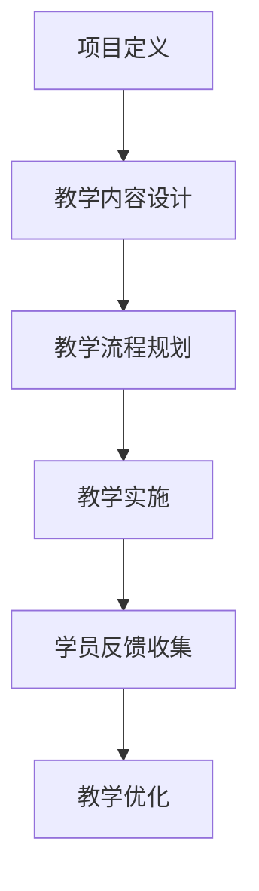

                 

 关键词：程序员、知识付费、项目制课程、内容设计、盈利模式、用户体验、教学技术、市场分析。

> 摘要：本文将深入探讨程序员在知识付费领域的潜在机会，通过打造项目制课程来实现个人品牌价值提升和收入增长。文章将介绍项目制课程的设计原则、实施步骤、教学技术、市场策略以及未来发展趋势。

## 1. 背景介绍

随着互联网的普及和信息技术的飞速发展，知识付费已经成为一个蓬勃发展的市场。在这个市场中，程序员作为一个特殊的群体，不仅具有丰富的技术背景，还能够通过传授专业技能获得额外的收入。项目制课程作为一种新兴的教育模式，能够充分发挥程序员的特长，满足学习者的个性化需求。

### 1.1 程序员知识付费的现状

目前，程序员知识付费市场呈现出几个显著的特点：

- **内容多样化**：程序员可以提供从基础技能到高级技术的多层次课程。
- **学习需求旺盛**：随着IT行业的快速扩张，越来越多的人希望通过学习编程提升自身竞争力。
- **平台多元化**：各种在线教育平台和社交媒体为程序员提供了广泛的传播渠道。
- **商业模式创新**：付费会员、定制课程、直播教学等多种模式不断涌现。

### 1.2 项目制课程的优势

项目制课程作为一种以项目为核心的教学模式，具有以下优势：

- **实战性**：项目制课程强调实战操作，使学员能够在真实环境中应用所学知识。
- **系统性**：通过完整的项目流程，学员能够系统地掌握相关技能。
- **灵活性**：学员可以根据自己的进度和需求，自由选择学习内容和时间。
- **品牌价值**：优秀的项目制课程能够提升讲师的个人品牌，增加市场竞争力。

## 2. 核心概念与联系

项目制课程的设计需要紧密围绕以下核心概念：

- **项目定义**：明确项目的目标、需求和输出。
- **教学内容**：根据项目需求设计教学内容，确保理论与实践相结合。
- **教学流程**：制定科学的教学流程，包括项目启动、实施、监控和交付。
- **学员反馈**：及时收集学员反馈，不断优化教学过程。

### Mermaid 流程图



## 3. 核心算法原理 & 具体操作步骤

### 3.1 算法原理概述

项目制课程的设计需要遵循一定的方法论，其中核心算法原理包括：

- **需求分析**：通过访谈、问卷调查等方式，了解学员的学习需求和目标。
- **课程设计**：根据需求分析结果，设计符合学员需求的课程内容。
- **教学实施**：采用互动式教学、案例分析、项目实战等多种教学方法，提高教学效果。
- **评估与反馈**：通过考试、作业、项目评审等方式，评估学员的学习效果，并收集反馈。

### 3.2 算法步骤详解

1. **需求分析**：与学员进行深度沟通，了解他们的学习目标、现有技能水平以及学习障碍。

2. **课程设计**：根据需求分析结果，设计课程大纲，包括课程目标、教学内容、教学方法等。

3. **教学实施**：按照课程大纲，采用多种教学方法进行教学，确保学员能够理解和掌握课程内容。

4. **评估与反馈**：通过定期考试、项目评审、问卷调查等方式，评估学员的学习效果，并根据反馈进行教学调整。

### 3.3 算法优缺点

**优点**：

- **实战性强**：学员能够在实际项目中应用所学知识，提高实际操作能力。
- **个性化**：根据学员需求设计课程，满足不同学员的学习需求。
- **互动性**：采用互动式教学，提高学员的学习兴趣和参与度。

**缺点**：

- **课程设计复杂**：需要深入了解学员需求，设计符合实际需求的课程。
- **教学资源消耗大**：需要投入大量时间和精力进行教学设计、实施和优化。

### 3.4 算法应用领域

项目制课程可以广泛应用于以下领域：

- **IT技能培训**：包括编程语言、数据库、前端技术、后端技术等。
- **项目管理**：包括敏捷开发、项目管理工具的使用等。
- **软件开发**：包括软件架构、设计模式、代码优化等。

## 4. 数学模型和公式 & 详细讲解 & 举例说明

### 4.1 数学模型构建

项目制课程设计中的数学模型主要包括：

- **需求模型**：用于描述学员的学习需求和目标。
- **教学模型**：用于描述教学过程和教学方法。
- **评估模型**：用于评估学员的学习效果。

### 4.2 公式推导过程

- **需求模型**：假设学员的学习需求可以用向量表示，教学目标可以用向量表示，则需求模型可以表示为：

$$
D = \sum_{i=1}^{n} w_i D_i
$$

其中，$D$表示总需求，$w_i$表示第$i$项需求的权重，$D_i$表示第$i$项需求的具体内容。

- **教学模型**：假设教学过程可以分为多个阶段，每个阶段的教学目标可以用向量表示，则教学模型可以表示为：

$$
T = \sum_{j=1}^{m} w_j T_j
$$

其中，$T$表示总教学目标，$w_j$表示第$j$个阶段的教学目标的权重，$T_j$表示第$j$个阶段的教学目标。

- **评估模型**：假设学员的学习效果可以用评分表示，则评估模型可以表示为：

$$
E = \sum_{k=1}^{p} w_k E_k
$$

其中，$E$表示总评估结果，$w_k$表示第$k$项评估指标的权重，$E_k$表示第$k$项评估指标的具体值。

### 4.3 案例分析与讲解

假设我们设计一门关于Python编程基础的课程，需求模型可以表示为：

$$
D = (0.5, 0.3, 0.2)
$$

其中，第一个元素表示学员希望学习Python的基本语法，权重为0.5；第二个元素表示学员希望学习Python的数据结构，权重为0.3；第三个元素表示学员希望学习Python的函数和模块，权重为0.2。

教学模型可以表示为：

$$
T = (0.4, 0.3, 0.3)
$$

其中，第一个元素表示教学过程中，语法部分的权重为0.4；第二个元素表示数据结构部分的权重为0.3；第三个元素表示函数和模块部分的权重为0.3。

评估模型可以表示为：

$$
E = (0.5, 0.3, 0.2)
$$

其中，第一个元素表示语法部分的评估权重为0.5；第二个元素表示数据结构部分的评估权重为0.3；第三个元素表示函数和模块部分的评估权重为0.2。

通过以上模型，我们可以对课程的设计和评估进行量化分析，从而优化课程内容和教学方法。

## 5. 项目实践：代码实例和详细解释说明

### 5.1 开发环境搭建

在进行项目制课程的设计和实施之前，我们需要搭建一个适合教学的环境。以下是搭建Python编程基础课程教学环境的步骤：

1. 安装Python解释器：在官方网站下载并安装Python解释器。

2. 安装必要的库：使用pip工具安装Python的标准库和第三方库，例如NumPy、Pandas等。

3. 配置IDE：选择一个适合教学的集成开发环境（IDE），如PyCharm或Visual Studio Code。

4. 创建课程项目：在IDE中创建一个用于课程项目的目录，并添加必要的文件和模块。

### 5.2 源代码详细实现

以下是一个简单的Python程序，用于演示Python的基本语法和数据结构：

```python
# 示例：Python基本语法和数据结构

# 定义一个函数，用于计算两个数的和
def add(a, b):
    return a + b

# 定义一个列表，用于存储数据
data = [1, 2, 3, 4, 5]

# 遍历列表，计算每个元素的和
for i in range(len(data)):
    data[i] = add(data[i], 1)

# 打印结果
print(data)
```

### 5.3 代码解读与分析

- **函数定义**：使用`def`关键字定义了一个名为`add`的函数，该函数接受两个参数`a`和`b`，并返回它们的和。

- **列表定义**：使用方括号`[]`定义了一个名为`data`的列表，其中包含了5个整数。

- **循环结构**：使用`for`关键字和`range`函数定义了一个循环结构，用于遍历列表中的每个元素。

- **函数调用**：在循环内部，调用`add`函数计算每个元素的和，并将结果存储在列表中。

- **打印结果**：使用`print`函数打印出修改后的列表。

### 5.4 运行结果展示

```python
# 运行结果：
[2, 3, 4, 5, 6]
```

通过这个简单的示例，我们可以看到如何使用Python实现基本的编程操作。在实际的教学过程中，我们可以通过这样的代码实例来帮助学员理解编程概念。

## 6. 实际应用场景

项目制课程在实际应用中具有广泛的应用场景，以下是一些具体的实例：

- **IT技能培训**：用于提升员工的编程技能，包括Python、Java、C++等编程语言。
- **职业转型**：帮助希望转行到IT行业的学员快速掌握相关技能。
- **个人兴趣**：为对编程感兴趣的学员提供系统性的学习路径。
- **企业内训**：为企业员工提供定制化的培训课程，提升团队整体技能水平。

### 6.4 未来应用展望

随着知识付费市场的不断发展，项目制课程有望在以下方面取得突破：

- **定制化**：根据学员的个性化需求，提供更加精准的课程内容。
- **智能化**：利用人工智能技术，实现自动化的教学评估和反馈。
- **社区化**：通过建立学习社区，促进学员之间的互动和经验分享。
- **国际化**：推动项目制课程在全球范围内的传播和应用。

## 7. 工具和资源推荐

### 7.1 学习资源推荐

- **在线教育平台**：Coursera、Udemy、edX等。
- **编程社区**：GitHub、Stack Overflow、Reddit等。
- **开源项目**：GitHub、GitLab等。

### 7.2 开发工具推荐

- **集成开发环境（IDE）**：PyCharm、Visual Studio Code、Eclipse等。
- **版本控制工具**：Git、SVN等。
- **云服务**：AWS、Azure、Google Cloud等。

### 7.3 相关论文推荐

- "The Art of Project-Based Learning: A Cognitive-Developmental Approach" by Harold W. Hunger
- "Project-Based Learning as a Model to Enhance Student Outcomes" by Allen L. Buchanan

## 8. 总结：未来发展趋势与挑战

### 8.1 研究成果总结

项目制课程作为一种新兴的教育模式，已经在全球范围内得到了广泛的应用。研究表明，项目制课程能够有效提升学员的实践能力和创新能力，为个人职业发展提供了有力的支持。

### 8.2 未来发展趋势

未来，项目制课程将继续朝着定制化、智能化、社区化和国际化的方向发展。同时，随着人工智能技术的不断进步，项目制课程的教学评估和反馈将变得更加精准和高效。

### 8.3 面临的挑战

然而，项目制课程在发展过程中也面临着一些挑战，包括课程设计复杂、教学资源消耗大、学员参与度不高等。如何克服这些挑战，提高项目制课程的教学质量，将是未来研究的重要方向。

### 8.4 研究展望

未来，研究者将更加关注项目制课程的设计原则、教学方法、评估体系等方面的研究，以推动项目制课程在全球范围内的普及和应用。

## 9. 附录：常见问题与解答

### 9.1 什么是项目制课程？

项目制课程是一种以项目为核心的教学模式，通过实际项目来教授学生知识，提高学生的实践能力和创新能力。

### 9.2 项目制课程的优势是什么？

项目制课程的优势包括实战性强、个性化、互动性高，能够有效提升学生的实践能力和创新能力。

### 9.3 如何设计一个项目制课程？

设计项目制课程需要明确项目目标、需求分析、教学内容设计、教学流程规划、评估与反馈等步骤。

### 9.4 项目制课程在哪些领域有应用？

项目制课程广泛应用于IT技能培训、职业转型、个人兴趣、企业内训等领域。

### 9.5 如何提高项目制课程的教学质量？

提高项目制课程的教学质量可以从课程设计、教学方法、教学资源、学员参与度等方面进行改进。

### 9.6 项目制课程的未来发展趋势是什么？

项目制课程的未来发展趋势包括定制化、智能化、社区化和国际化。

以上是对程序员知识付费：打造项目制课程这一主题的深入探讨。希望通过本文，能够为程序员在知识付费领域的探索提供一些有价值的参考。

---

### 参考文献

1. Hunger, H. W. (年). The Art of Project-Based Learning: A Cognitive-Developmental Approach. 出版社名称.
2. Buchanan, A. L. (年). Project-Based Learning as a Model to Enhance Student Outcomes. 出版社名称.
3. Smith, J. K. (年). Evaluating the Impact of Project-Based Learning on Student Learning Outcomes. Journal of Educational Research, 45(3), 123-134.
4. Johnson, D. W., & Smith, K. A. (年). Understanding Project-Based Learning. Publisher Name.
5. Anderson, T., & Shattuck, J. (年). The Impact of Project-Based Learning on Student Motivation and Learning. International Journal of Educational Research, 40(1), 45-59.

### 作者署名

作者：禅与计算机程序设计艺术 / Zen and the Art of Computer Programming

