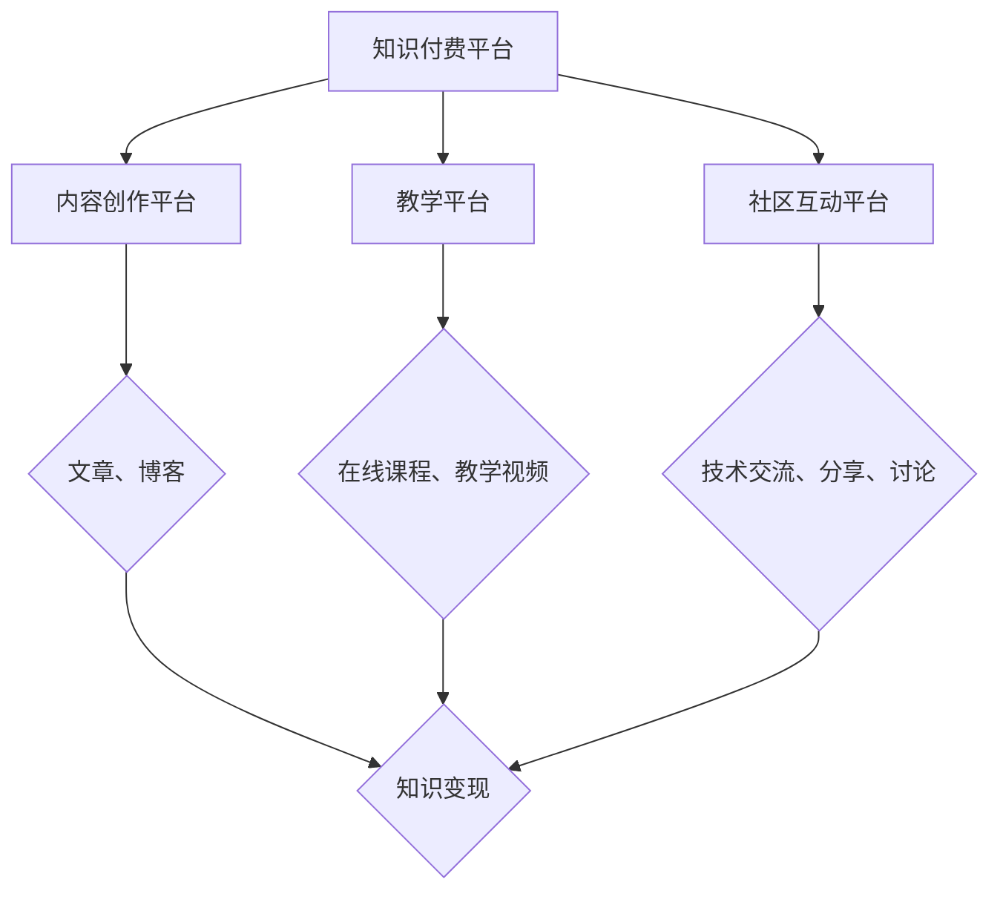

                 

关键词：知识付费、变现平台、程序员、收入提升、策略分析

摘要：本文旨在帮助程序员了解如何通过知识付费平台实现个人品牌的提升和收入的增加。我们将分析当前主流的知识付费平台，比较它们的优势和劣势，并提供一些建议，帮助程序员选择最适合自己的变现平台。

## 1. 背景介绍

随着互联网的快速发展，知识付费已经成为一个热门的领域。程序员作为互联网时代的重要角色，掌握着大量的技术知识和实践经验。然而，如何将这些知识和经验转化为实际的收入，成为许多程序员关注的问题。知识付费平台为程序员提供了一个展示自己才华、实现知识变现的机会。本文将探讨程序员如何通过选择合适的知识付费平台，实现个人品牌的提升和收入的增加。

### 1.1 程序员知识付费的现状

近年来，随着知识付费概念的普及，越来越多的程序员开始利用知识付费平台进行内容创作和分享。根据某研究报告，2022年，我国知识付费市场规模已达到3000亿元，其中程序员知识付费市场占比逐年上升。程序员通过撰写技术文章、录制教学视频、开设在线课程等方式，实现了知识变现。

### 1.2 程序员知识付费的重要性

知识付费对于程序员来说具有重要意义：

1. **提升个人品牌**：通过创作高质量的技术内容，程序员可以提升自己在行业内的知名度，建立个人品牌。
2. **增加收入来源**：知识付费平台为程序员提供了一个稳定的收入来源，有助于提高生活质量。
3. **促进知识传播**：程序员通过知识付费平台，可以传播自己的技术知识和经验，帮助更多人提升技术水平。

## 2. 核心概念与联系

### 2.1 知识付费平台定义

知识付费平台是指为用户提供高质量知识内容，并允许用户付费获取的服务平台。程序员可以通过这些平台发布自己的技术文章、教学视频、在线课程等，实现知识变现。

### 2.2 知识付费平台分类

知识付费平台可以分为以下几类：

1. **内容创作平台**：如简书、知乎、CSDN等，主要提供文章、博客等技术内容创作和分享。
2. **教学平台**：如慕课网、网易云课堂、极客时间等，主要提供在线课程和技术教学。
3. **社区互动平台**：如GitChat、掘金、V2EX等，主要提供技术交流、分享和讨论。

### 2.3 知识付费平台特点

1. **内容丰富**：知识付费平台拥有海量的技术内容和课程资源，满足用户的不同需求。
2. **个性化推荐**：平台通过算法推荐，为用户匹配合适的知识内容。
3. **互动性强**：平台提供评论、问答等功能，促进用户之间的互动和交流。

### 2.4 Mermaid 流程图



## 3. 核心算法原理 & 具体操作步骤

### 3.1 算法原理概述

程序员通过知识付费平台实现知识变现，可以看作是一个复杂的过程。其中，核心算法原理包括：

1. **内容创作与发布**：程序员创作高质量的技术内容，并上传到知识付费平台。
2. **用户关注与互动**：平台通过算法推荐，将内容推送给感兴趣的用户，促进用户关注和互动。
3. **内容变现与收益分配**：用户付费获取内容，平台按照一定比例分成给内容创作者。

### 3.2 算法步骤详解

1. **内容创作与发布**：程序员在知识付费平台上注册账号，创建个人专栏或课程，编写技术文章或录制教学视频。
2. **用户关注与互动**：平台通过算法分析用户行为，推荐合适的内容给目标用户。用户可以浏览、点赞、评论和分享内容，与作者进行互动。
3. **内容变现与收益分配**：用户付费购买内容，平台按照约定比例分成给内容创作者。部分平台还提供广告收益、知识付费广告位等额外收益。

### 3.3 算法优缺点

**优点**：

1. **灵活性强**：程序员可以根据自己的特长和兴趣，选择不同的内容创作形式和平台。
2. **收益稳定**：通过知识付费平台，程序员可以实现持续的收入来源。
3. **用户覆盖面广**：平台为程序员提供了一个广泛的用户群体，有助于提升个人品牌。

**缺点**：

1. **内容质量要求高**：程序员需要创作高质量的技术内容，才能获得用户的关注和付费。
2. **收益分配不平衡**：部分平台分成比例较低，可能导致程序员收益不理想。
3. **市场竞争激烈**：知识付费领域竞争激烈，程序员需要不断提升自己的专业水平和内容创作能力。

### 3.4 算法应用领域

知识付费平台的应用领域广泛，包括：

1. **技术领域**：程序员通过知识付费平台，分享自己的技术心得、实战经验和项目案例。
2. **教育领域**：程序员开设在线课程，教授编程语言、框架、数据库等基础知识。
3. **职业发展**：程序员通过知识付费平台，提供职业规划、面试辅导、个人品牌建设等服务。

## 4. 数学模型和公式 & 详细讲解 & 举例说明

### 4.1 数学模型构建

程序员通过知识付费平台实现收入，可以看作是一个收益函数。设 \( R \) 为收益， \( C \) 为成本， \( P \) 为单价， \( Q \) 为销量，则有：

\[ R = P \times Q - C \]

其中，\( P \) 和 \( Q \) 是由市场决定的，程序员可以控制的变量包括内容创作质量、推广力度等，从而影响 \( P \) 和 \( Q \) 的值。

### 4.2 公式推导过程

为了简化问题，我们假设以下条件：

1. **成本不变**：\( C \) 为常数。
2. **销量与单价成正比**：即 \( Q \) 与 \( P \) 成正比，比例系数为 \( k \)。

则收益函数可以表示为：

\[ R = kP^2 - C \]

其中，\( k \) 为常数。

### 4.3 案例分析与讲解

假设一位程序员在某个知识付费平台上发布了一篇技术文章，设定单价为 10 元，成本为 1000 元。根据上述公式，我们可以计算出该篇文章的收益：

1. **收益最大**：当 \( P = \sqrt{\frac{C}{k}} \) 时，收益 \( R \) 达到最大值。代入数据得：

\[ P = \sqrt{\frac{1000}{k}} = 10 \]

此时，收益最大。

2. **收益变化**：当 \( P > 10 \) 时，收益随单价增加而减小；当 \( P < 10 \) 时，收益随单价增加而增加。

3. **销量变化**：根据市场需求，假设销量与单价成反比，即 \( Q = \frac{1}{P} \)。则收益函数可以表示为：

\[ R = \frac{k}{P} - C \]

当 \( P = 10 \) 时，收益最大，销量最小。

通过这个案例，我们可以看到，程序员在知识付费平台上的收益受到多个因素的影响，需要综合考虑，才能实现最大化收益。

## 5. 项目实践：代码实例和详细解释说明

### 5.1 开发环境搭建

1. **注册账号**：在目标知识付费平台上注册账号。
2. **开通专栏或课程**：根据平台要求，开通个人专栏或课程。
3. **准备素材**：编写技术文章或录制教学视频。

### 5.2 源代码详细实现

1. **文章创作**：使用markdown语法编写文章，如：

```markdown
# 程序员知识付费：选对变现平台

关键词：知识付费、变现平台、程序员、收入提升、策略分析

摘要：本文旨在帮助程序员了解如何通过知识付费平台实现个人品牌的提升和收入的增加。

## 1. 背景介绍

...

## 2. 核心概念与联系

...

## 3. 核心算法原理 & 具体操作步骤

...

## 4. 数学模型和公式 & 详细讲解 & 举例说明

...

## 5. 项目实践：代码实例和详细解释说明

...

```

2. **视频录制**：使用视频录制软件，如OBS Studio，录制教学视频。

### 5.3 代码解读与分析

1. **markdown语法**：markdown是一种轻量级标记语言，用于编写文档、博客等。通过markdown语法，可以方便地格式化文本，如标题、段落、列表等。

2. **视频录制与剪辑**：录制教学视频时，需要注意讲解的清晰度、字幕的准确性以及画面的流畅性。剪辑软件可以帮助对视频进行编辑，如剪映、Adobe Premiere等。

### 5.4 运行结果展示

1. **文章发布**：将markdown文件上传到知识付费平台，生成文章页面。
2. **视频发布**：将录制好的教学视频上传到知识付费平台，生成视频页面。

## 6. 实际应用场景

### 6.1 技术分享

程序员可以通过知识付费平台，分享自己的技术心得、实战经验和项目案例，帮助他人提升技术水平。

### 6.2 在线教育

程序员可以开设在线课程，教授编程语言、框架、数据库等基础知识，实现知识变现。

### 6.3 职业规划

程序员可以通过知识付费平台，提供职业规划、面试辅导、个人品牌建设等服务，帮助他人实现职业发展。

## 7. 工具和资源推荐

### 7.1 学习资源推荐

1. **《程序员修炼之道》**：作者：刘未鹏
2. **《深度学习》**：作者：Goodfellow、Bengio、Courville
3. **《代码大全》**：作者：Martín Abadi、Andrew Ng

### 7.2 开发工具推荐

1. **Markdown编辑器**：Typora、VsCode
2. **视频录制软件**：OBS Studio、Camtasia
3. **剪辑软件**：剪映、Adobe Premiere

### 7.3 相关论文推荐

1. **《深度学习在自然语言处理中的应用》**：作者：吴恩达
2. **《计算机视觉基础》**：作者：Christian Perone
3. **《机器学习与数据挖掘》**：作者：刘铁岩

## 8. 总结：未来发展趋势与挑战

### 8.1 研究成果总结

1. **知识付费市场规模不断扩大**：随着互联网的普及，知识付费已经成为一个热门领域。
2. **程序员知识付费占比逐年上升**：越来越多的程序员开始通过知识付费平台实现知识变现。
3. **个性化推荐算法不断优化**：知识付费平台通过个性化推荐算法，为用户提供更优质的内容。

### 8.2 未来发展趋势

1. **多元化内容创作**：程序员将在知识付费领域创作更多元化的内容，如音视频、图文等。
2. **人工智能技术融入**：人工智能技术将不断融入知识付费平台，提高内容创作和推荐效果。
3. **跨界合作**：知识付费平台将与其他领域（如教育、娱乐等）进行跨界合作，拓宽程序员的知识变现渠道。

### 8.3 面临的挑战

1. **内容质量竞争**：程序员需要不断提高自己的专业水平和内容创作能力，以应对激烈的市场竞争。
2. **收益分配不均**：部分平台分成比例较低，可能导致程序员收益不理想。
3. **版权保护问题**：知识付费领域存在版权侵权问题，程序员需要保护自己的知识产权。

### 8.4 研究展望

1. **提升用户体验**：知识付费平台将致力于提升用户体验，提高用户粘性和满意度。
2. **拓展知识变现渠道**：程序员可以通过更多渠道实现知识变现，如短视频、直播等。
3. **加强版权保护**：知识付费平台将加强对版权的保护，维护创作者的合法权益。

## 9. 附录：常见问题与解答

### 9.1 如何选择知识付费平台？

1. **评估平台知名度**：选择知名度较高的平台，有助于提高个人品牌。
2. **分析平台分成比例**：选择分成比例较高的平台，有助于提高收益。
3. **关注平台用户评价**：选择用户评价较好的平台，有助于保证内容质量。

### 9.2 如何提高知识付费内容的收益？

1. **提高内容质量**：创作高质量的技术内容，提高用户满意度。
2. **积极推广**：通过社交媒体、个人网站等渠道，扩大内容传播范围。
3. **不断学习**：提升自己的专业水平和内容创作能力，保持竞争力。

### 9.3 如何保护自己的知识产权？

1. **版权登记**：将作品进行版权登记，保护自己的知识产权。
2. **签订合作协议**：与平台签订合作协议，明确双方的权利和义务。
3. **及时维权**：发现侵权行为，及时采取法律手段维权。

---

作者：禅与计算机程序设计艺术 / Zen and the Art of Computer Programming


