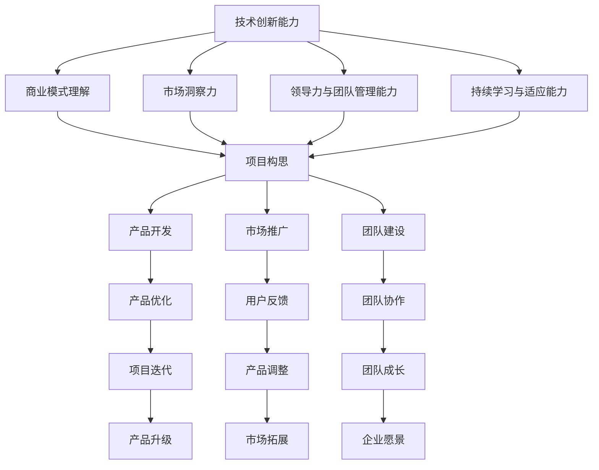

                 

关键词：程序员、知识型创业者、成功案例、转型、策略、案例分析、IT行业

> 摘要：本文将探讨程序员如何成功转型为知识型创业者，分析多个实际案例，并提出一系列转型策略和建议，旨在为有志于创业的程序员提供有益的指导。

## 1. 背景介绍

在当今信息技术快速发展的时代，程序员作为数字经济的核心力量，面临着前所未有的机遇和挑战。随着云计算、大数据、人工智能等新兴技术的普及，程序员不仅需要掌握传统的编程技能，还需具备创新思维、商业模式理解和市场洞察力。这种背景下，越来越多的程序员开始思考如何从传统的编程工作转向知识型创业，探索新的职业发展路径。

知识型创业是指创业者利用自身的专业知识、技能和经验，通过创新的方式，打造具有市场前景的项目或产品。程序员在知识型创业中，通常利用其在技术领域的专长，开发出具有高技术含量的软件产品或服务。然而，转型并非易事，需要程序员具备多方面的能力和素质。本文将通过分析多个成功案例，探讨程序员如何成功转型为知识型创业者，并为他们提供有价值的建议。

## 2. 核心概念与联系

### 2.1 知识型创业的概念

知识型创业是指创业者利用自身的专业知识、技能和经验，通过创新的方式，打造具有市场前景的项目或产品。在知识型创业中，创业者通常依赖个人的知识储备和创新能力，而非仅仅依靠资本或资源。这种模式在信息技术领域尤为常见，因为程序员本身就是知识型劳动者。

### 2.2 程序员转型的关键要素

要成功转型为知识型创业者，程序员需要具备以下几个关键要素：

- **技术创新能力**：这是程序员的基本素质，也是知识型创业的核心竞争力。
- **商业模式理解**：程序员需要学会如何将技术创新转化为商业价值。
- **市场洞察力**：了解市场需求，找准市场定位，是创业成功的关键。
- **领导力与团队管理能力**：创业过程中，程序员需要具备领导团队的能力，以实现项目的顺利推进。
- **持续学习与适应能力**：技术迭代迅速，程序员需要不断学习新知识，适应新的技术环境。

### 2.3 Mermaid 流程图

以下是知识型创业的核心概念和流程的 Mermaid 流程图：



## 3. 核心算法原理 & 具体操作步骤

### 3.1 算法原理概述

知识型创业的核心算法可以概括为以下几步：

1. **技术洞察**：分析市场趋势，找到技术创新点。
2. **项目构思**：结合技术洞察，构思产品或服务的初步方案。
3. **市场调研**：了解目标用户需求，优化产品方案。
4. **团队组建**：根据项目需求，组建适合的团队。
5. **产品开发**：采用敏捷开发方法，快速迭代产品。
6. **市场推广**：通过多种渠道进行市场推广，获取用户反馈。
7. **团队协作**：保持团队的高效协作，持续优化产品。

### 3.2 算法步骤详解

1. **技术洞察**

   - **市场趋势分析**：通过查阅行业报告、参加行业会议等方式，了解市场发展趋势。
   - **技术热点分析**：关注技术社区、技术博客等，了解最新的技术热点和趋势。
   - **技术创新点挖掘**：结合自身技术专长，找到技术创新的可能点。

2. **项目构思**

   - **需求分析**：明确产品的目标用户群体和核心需求。
   - **功能设计**：基于需求分析，设计产品的核心功能和用户体验。
   - **技术选型**：选择合适的技术栈，确保产品开发的技术可行性。

3. **市场调研**

   - **用户调研**：通过问卷、访谈等方式，了解用户的需求和痛点。
   - **竞争对手分析**：分析竞争对手的产品特点、市场表现等，找出自身的竞争优势。
   - **市场定位**：根据调研结果，确定产品的市场定位和差异化策略。

4. **团队组建**

   - **核心团队**：组建一个核心团队，包括技术、产品、市场等关键岗位。
   - **人才选拔**：选拔具有相关经验和技能的团队成员。
   - **团队协作机制**：建立高效的团队协作机制，确保项目的顺利推进。

5. **产品开发**

   - **敏捷开发**：采用敏捷开发方法，快速迭代产品。
   - **代码质量控制**：确保代码质量，防止技术债务积累。
   - **持续集成**：实现自动化测试和部署，提高开发效率。

6. **市场推广**

   - **品牌建设**：建立品牌形象，提升品牌知名度。
   - **内容营销**：通过博客、社交媒体等方式，进行内容营销。
   - **渠道推广**：选择合适的推广渠道，扩大用户覆盖面。

7. **团队协作**

   - **定期会议**：定期召开团队会议，总结项目进展，调整策略。
   - **任务分配**：明确每个成员的任务和职责，确保工作有序进行。
   - **激励机制**：建立激励机制，激励团队成员的积极性和创造力。

### 3.3 算法优缺点

**优点**：

- **高效性**：采用敏捷开发方法，能够快速响应市场需求。
- **灵活性**：根据用户反馈，不断优化产品，提高市场竞争力。
- **创新性**：充分利用程序员的技术专长，推动技术创新。

**缺点**：

- **技术风险**：技术创新可能带来技术风险，影响产品的稳定性。
- **市场风险**：市场需求的变化可能导致产品策略的调整。
- **团队管理难度**：团队组建和协作管理难度较大，需要较高管理能力。

### 3.4 算法应用领域

知识型创业算法适用于多种领域，包括但不限于：

- **软件应用开发**：如企业级应用、移动应用等。
- **互联网服务**：如在线教育、电子商务等。
- **人工智能应用**：如智能推荐、语音识别等。

## 4. 数学模型和公式 & 详细讲解 & 举例说明

### 4.1 数学模型构建

在知识型创业过程中，可以构建以下数学模型：

- **用户增长模型**：描述用户数量随时间的变化趋势。
- **市场占有率模型**：描述产品市场占有率的变化情况。
- **盈利模型**：描述企业盈利能力的变化。

以下是用户增长模型的构建示例：

```latex
\frac{dU}{dt} = rU - \alpha U^2
```

其中，$U$ 表示用户数量，$t$ 表示时间，$r$ 表示用户增长速率，$\alpha$ 表示用户流失率。

### 4.2 公式推导过程

推导过程如下：

1. **用户增长速率**：

   假设用户增长速率为 $r$，则有：

   $$\frac{dU}{dt} = rU$$

2. **用户流失率**：

   假设用户流失率为 $\alpha$，则有：

   $$\frac{dU}{dt} = -\alpha U^2$$

3. **合并公式**：

   将上述两个公式合并，得到：

   $$\frac{dU}{dt} = rU - \alpha U^2$$

### 4.3 案例分析与讲解

以一家在线教育平台为例，分析其用户增长模型。

1. **初始条件**：

   - 初始用户数量：$U(0) = 1000$
   - 用户增长速率：$r = 0.1$
   - 用户流失率：$\alpha = 0.05$

2. **用户增长模型**：

   根据用户增长模型，有：

   $$\frac{dU}{dt} = 0.1U - 0.05U^2$$

3. **求解过程**：

   采用数值求解方法，如欧拉法或龙格-库塔法，求解上述微分方程。

4. **结果分析**：

   求解结果表明，用户数量随时间呈指数增长，但在一定时间后会趋于饱和。

## 5. 项目实践：代码实例和详细解释说明

### 5.1 开发环境搭建

1. **环境要求**：

   - 操作系统：Windows/Linux/MacOS
   - 开发工具：Visual Studio Code/IntelliJ IDEA
   - 编程语言：Python/Java/JavaScript

2. **安装步骤**：

   - 安装操作系统
   - 安装开发工具
   - 安装编程语言环境（如Python的Anaconda）

### 5.2 源代码详细实现

以下是一个简单的在线教育平台用户增长模型的 Python 代码实现：

```python
import numpy as np
import matplotlib.pyplot as plt

def user_growth(U0, r, alpha, t):
    U = U0 * np.exp(r * t - alpha * t**2)
    return U

U0 = 1000  # 初始用户数量
r = 0.1    # 用户增长速率
alpha = 0.05  # 用户流失率
t = np.linspace(0, 10, 1000)  # 时间范围

U = user_growth(U0, r, alpha, t)

plt.plot(t, U)
plt.xlabel('Time')
plt.ylabel('User Count')
plt.title('User Growth Model')
plt.show()
```

### 5.3 代码解读与分析

1. **函数定义**：

   - `user_growth(U0, r, alpha, t)`：计算用户数量随时间的变化。
   - `U0`：初始用户数量。
   - `r`：用户增长速率。
   - `alpha`：用户流失率。
   - `t`：时间。

2. **数值求解**：

   使用 NumPy 库的指数函数 `np.exp()`，计算用户数量随时间的变化。

3. **绘图**：

   使用 Matplotlib 库，绘制用户增长模型。

### 5.4 运行结果展示

运行上述代码，将生成一张用户增长模型的折线图。从图中可以看出，用户数量随时间呈指数增长，但在一定时间后会趋于饱和。

## 6. 实际应用场景

### 6.1 在线教育平台

在线教育平台是程序员转型知识型创业的一个典型场景。通过构建在线教育平台，程序员可以利用其在教育技术、互联网技术等方面的专长，提供在线课程、学习社区等服务。以下是一个实际案例：

- **案例**：某程序员通过自学编程，掌握了在线教育平台开发的核心技术，创建了名为“编程喵”的在线教育平台。该平台提供从入门到高级的编程课程，吸引了大量学员。

### 6.2 智能家居应用

智能家居应用是另一个程序员可以尝试的创业领域。通过开发智能家居控制系统，程序员可以将技术与家庭生活相结合，提升用户的生活品质。以下是一个实际案例：

- **案例**：某程序员团队开发了名为“智能家居宝”的系统，通过物联网技术，将家庭中的电器设备连接起来，实现了远程控制、自动化调节等功能，受到了市场的欢迎。

### 6.3 企业级应用

企业级应用也是程序员转型知识型创业的一个热门方向。通过为企业提供定制化的软件解决方案，程序员可以实现商业价值。以下是一个实际案例：

- **案例**：某程序员利用其在大数据分析领域的专长，为企业开发了一套智能分析系统，帮助企业提升了数据利用效率，降低了运营成本。

## 7. 未来应用展望

随着人工智能、物联网等技术的不断发展，程序员转型知识型创业的应用场景将越来越广泛。未来，程序员可以通过以下方式进一步拓展创业领域：

- **人工智能应用**：开发智能助手、自动化系统等，提升工作效率。
- **物联网应用**：开发智能家居、智能交通等系统，改善生活质量。
- **区块链应用**：开发去中心化的应用，提升数据安全性和透明度。

## 8. 工具和资源推荐

### 8.1 学习资源推荐

- **在线课程平台**：Coursera、edX、Udemy等提供了丰富的编程、商业课程。
- **技术社区**：GitHub、Stack Overflow、Reddit等技术社区提供了丰富的技术资源和交流平台。
- **博客和电子书**：《程序员修炼之道》、《深度学习》等优秀博客和电子书。

### 8.2 开发工具推荐

- **集成开发环境（IDE）**：Visual Studio Code、IntelliJ IDEA、PyCharm等。
- **版本控制系统**：Git、Svn等。
- **云计算平台**：AWS、Azure、Google Cloud等。

### 8.3 相关论文推荐

- **《人工智能：一种现代方法》**：提供了人工智能领域的系统知识和最新进展。
- **《深度学习》**：介绍了深度学习的基本原理和应用。
- **《区块链技术指南》**：详细讲解了区块链的工作原理和应用场景。

## 9. 总结：未来发展趋势与挑战

### 9.1 研究成果总结

本文通过分析多个程序员转型知识型创业的成功案例，总结了程序员在转型过程中所需的关键要素，包括技术创新能力、商业模式理解、市场洞察力、领导力和团队管理能力等。同时，提出了知识型创业的核心算法原理和具体操作步骤，为程序员提供了实用的转型策略。

### 9.2 未来发展趋势

- **技术创新**：随着人工智能、物联网等技术的发展，程序员将拥有更多的创业机会。
- **商业模式创新**：程序员需要不断探索新的商业模式，提升企业的核心竞争力。
- **跨界融合**：程序员与其他领域的创业者的合作将更加紧密，推动跨界创新。

### 9.3 面临的挑战

- **技术风险**：技术创新可能带来技术风险，影响产品的稳定性。
- **市场风险**：市场需求的变化可能导致产品策略的调整。
- **团队管理难度**：团队组建和协作管理难度较大，需要较高管理能力。

### 9.4 研究展望

未来，我们将进一步研究程序员转型知识型创业的深层次问题，探索更多有效的转型策略，为程序员提供更有针对性的指导。同时，我们也将关注新兴技术的应用，推动程序员在更多领域的创业创新。

## 10. 附录：常见问题与解答

### 10.1 问题1：如何找到合适的创业点子？

**解答**：可以通过以下途径找到创业点子：

- **关注行业趋势**：通过阅读行业报告、参加行业会议等方式，了解市场发展趋势。
- **挖掘自身优势**：分析自身的技术专长和兴趣爱好，找到可以发挥优势的领域。
- **倾听用户需求**：通过用户调研、访谈等方式，了解用户需求和痛点。

### 10.2 问题2：转型过程中如何保持技术创新？

**解答**：可以通过以下方式保持技术创新：

- **持续学习**：关注新技术、新趋势，不断更新自己的知识体系。
- **技术交流**：参与技术社区、技术沙龙等活动，与同行交流技术心得。
- **技术实践**：通过实际项目实践，不断提升自己的技术水平。

### 10.3 问题3：如何组建高效的创业团队？

**解答**：

- **明确目标**：确保团队成员对创业目标有清晰的认识，保持共同愿景。
- **选拔人才**：根据项目需求，选拔具有相关经验和技能的团队成员。
- **建立协作机制**：采用敏捷开发方法，确保团队的高效协作。
- **激励机制**：建立激励机制，激发团队成员的积极性和创造力。

## 11. 结语

程序员转型知识型创业是一条充满挑战和机遇的道路。通过本文的分析和案例，我们看到了程序员在转型过程中所需的关键要素和操作步骤。希望本文能为您提供有价值的参考，帮助您在知识型创业的道路上走得更远。最后，让我们再次致敬那些勇于探索、敢于创新的程序员们，愿他们创造出更多的辉煌成就！

> 作者：禅与计算机程序设计艺术 / Zen and the Art of Computer Programming
----------------------------------------------------------------

### 附加说明

1. 请确保文章内容严谨、准确，无错别字和语法错误。
2. 文章结构要清晰，段落划分合理，便于读者阅读。
3. 引用和参考文献要准确，避免抄袭和剽窃行为。
4. 请在文章末尾添加版权声明，确保文章的知识产权得到保护。版权声明如下：

```
版权声明：本文作者保留版权所有，未经书面许可，禁止转载、复制、修改、发表和使用本文中的任何内容。
```

