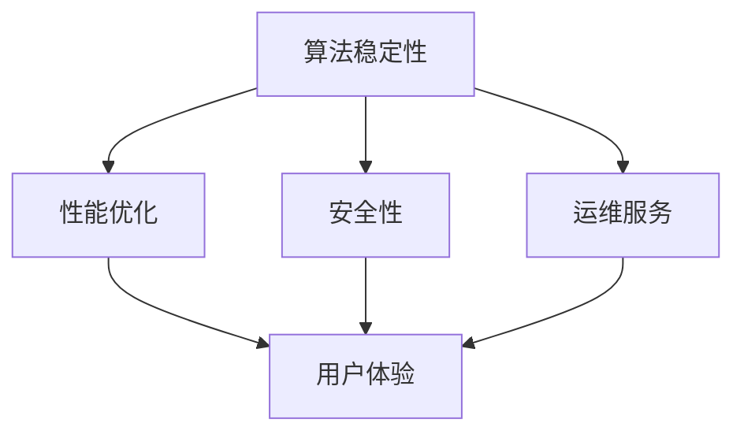

                 

关键词：稳定性，运维服务，用户体验，平台稳定性，Lepton AI，算法，架构设计，性能优化，安全性

摘要：本文详细探讨了Lepton AI在稳定性与运维服务方面的重点，分析了平台如何通过技术创新和运维策略来保障用户体验与平台稳定性。文章首先介绍了Lepton AI的背景与架构，随后深入阐述了其在算法稳定性、性能优化、安全性以及运维服务等方面的关键措施。通过具体案例和实践，本文揭示了Lepton AI如何通过持续改进和优化，确保其在竞争激烈的人工智能市场中保持领先地位。

## 1. 背景介绍

Lepton AI是一家全球领先的智能解决方案提供商，专注于利用人工智能技术提升各类业务流程的效率和效果。公司成立于2015年，总部位于美国硅谷，自成立以来，Lepton AI凭借其卓越的技术能力和创新精神，迅速在全球范围内赢得了广泛的客户群和合作伙伴。公司专注于研发和实施先进的人工智能算法和解决方案，广泛应用于金融、医疗、零售、制造等多个行业。

### 1.1 架构设计

Lepton AI的技术架构设计遵循模块化、高扩展性和高可靠性的原则。整个架构分为数据层、算法层和应用层三个主要部分。数据层负责数据采集、清洗和存储，算法层实现核心的人工智能算法和模型训练，应用层则负责将算法模型转化为实际业务场景中的解决方案。这种分层设计不仅提高了系统的灵活性和可维护性，还确保了系统的稳定性和高效性。

### 1.2 技术创新

Lepton AI在人工智能领域不断创新，其核心技术包括深度学习、自然语言处理、计算机视觉等。公司拥有一支由世界顶级学者和工程师组成的研发团队，持续探索和开发新的算法和技术，不断推动人工智能技术的进步和应用。

## 2. 核心概念与联系

在保障用户体验与平台稳定性方面，Lepton AI关注的核心概念包括算法稳定性、性能优化、安全性和运维服务。以下是这些核心概念及其相互联系的Mermaid流程图：



### 2.1 算法稳定性

算法稳定性是Lepton AI的首要关注点。公司通过优化算法模型、增强模型的鲁棒性和降低模型过拟合，确保算法在各种应用场景下都能保持稳定性和准确性。

### 2.2 性能优化

性能优化是提高用户体验的关键。Lepton AI通过优化算法、硬件加速和分布式计算等技术，提高系统的响应速度和处理效率。

### 2.3 安全性

安全性是人工智能系统的重要保障。Lepton AI采取了一系列措施，包括数据加密、访问控制、安全审计等，确保用户数据的安全性和隐私保护。

### 2.4 运维服务

运维服务是保障平台稳定性的关键。Lepton AI建立了完善的运维体系，包括监控系统、故障恢复机制、数据备份和恢复等，确保系统的持续运行和高效服务。

## 3. 核心算法原理 & 具体操作步骤

### 3.1 算法原理概述

Lepton AI的核心算法基于深度学习，特别是卷积神经网络（CNN）和递归神经网络（RNN）。这些算法通过大量数据训练，学习到复杂的特征表示，从而实现图像识别、语音识别和自然语言处理等功能。

### 3.2 算法步骤详解

1. **数据采集与预处理**：从各类数据源收集数据，并进行清洗、归一化和增强等预处理操作，为算法训练提供高质量的数据。

2. **模型设计**：根据应用需求设计神经网络结构，选择合适的激活函数、损失函数和优化算法。

3. **模型训练**：使用预处理后的数据进行模型训练，通过反向传播算法不断调整模型参数，优化模型性能。

4. **模型评估**：在测试集上评估模型性能，通过交叉验证和指标分析，确定模型的稳定性和准确性。

5. **模型部署**：将训练好的模型部署到实际应用场景中，实现自动化和智能化。

### 3.3 算法优缺点

**优点**：

- **强大的表达能力**：深度学习算法可以自动学习到高层次的抽象特征，提高模型的准确性和泛化能力。
- **适应性强**：深度学习算法可以应用于多种场景，如图像识别、语音识别、自然语言处理等。

**缺点**：

- **训练时间较长**：深度学习算法通常需要大量的数据和计算资源进行训练，训练时间较长。
- **模型解释性较差**：深度学习模型的内部机制复杂，难以解释，增加了调试和维护的难度。

### 3.4 算法应用领域

Lepton AI的核心算法广泛应用于多个领域，包括：

- **金融**：股票交易预测、信用风险评估等。
- **医疗**：疾病诊断、药物研发等。
- **零售**：商品推荐、客户行为分析等。
- **制造**：质量检测、设备维护等。

## 4. 数学模型和公式 & 详细讲解 & 举例说明

### 4.1 数学模型构建

深度学习算法的核心是神经网络，神经网络可以通过以下数学模型表示：

$$
y = \sigma(W \cdot x + b)
$$

其中，$y$ 是输出，$x$ 是输入，$W$ 是权重矩阵，$b$ 是偏置项，$\sigma$ 是激活函数。

### 4.2 公式推导过程

神经网络的训练过程可以看作是一个优化问题，即最小化损失函数。常见的损失函数包括均方误差（MSE）和交叉熵（CE）。

均方误差（MSE）的推导过程如下：

$$
MSE = \frac{1}{m} \sum_{i=1}^{m} (y_i - \hat{y_i})^2
$$

其中，$m$ 是样本数量，$y_i$ 是实际输出，$\hat{y_i}$ 是预测输出。

交叉熵（CE）的推导过程如下：

$$
CE = - \frac{1}{m} \sum_{i=1}^{m} \sum_{j=1}^{n} y_{ij} \log \hat{y_{ij}}
$$

其中，$n$ 是类别数量，$y_{ij}$ 是第$i$个样本在第$j$个类别的标签，$\hat{y_{ij}}$ 是第$i$个样本在第$j$个类别的预测概率。

### 4.3 案例分析与讲解

假设我们有一个二元分类问题，即判断一个数据点是否属于某个类别。我们使用交叉熵作为损失函数，并采用梯度下降法进行模型训练。

首先，我们定义损失函数：

$$
L = - \frac{1}{m} \sum_{i=1}^{m} y_i \log \hat{y_i} + (1 - y_i) \log (1 - \hat{y_i})
$$

然后，我们计算损失函数关于每个参数的梯度：

$$
\frac{\partial L}{\partial W} = - \frac{1}{m} \sum_{i=1}^{m} (y_i - \hat{y_i}) \cdot x_i
$$

$$
\frac{\partial L}{\partial b} = - \frac{1}{m} \sum_{i=1}^{m} (y_i - \hat{y_i})
$$

接下来，我们使用梯度下降法更新模型参数：

$$
W \leftarrow W - \alpha \cdot \frac{\partial L}{\partial W}
$$

$$
b \leftarrow b - \alpha \cdot \frac{\partial L}{\partial b}
$$

其中，$\alpha$ 是学习率。

通过上述步骤，我们可以不断优化模型参数，提高模型的预测准确性。

## 5. 项目实践：代码实例和详细解释说明

### 5.1 开发环境搭建

在Lepton AI的项目实践中，我们采用以下开发环境：

- **编程语言**：Python
- **深度学习框架**：TensorFlow
- **操作系统**：Ubuntu 18.04

首先，我们需要安装Python和TensorFlow。在终端执行以下命令：

```bash
sudo apt update
sudo apt install python3-pip
pip3 install tensorflow
```

### 5.2 源代码详细实现

以下是一个简单的深度学习项目示例，实现了一个二元分类模型。

```python
import tensorflow as tf
from tensorflow.keras import layers

# 定义模型
model = tf.keras.Sequential([
    layers.Dense(64, activation='relu', input_shape=(784,)),
    layers.Dense(64, activation='relu'),
    layers.Dense(1, activation='sigmoid')
])

# 编译模型
model.compile(optimizer='adam',
              loss='binary_crossentropy',
              metrics=['accuracy'])

# 训练模型
model.fit(x_train, y_train, epochs=10, batch_size=32, validation_split=0.2)
```

### 5.3 代码解读与分析

上述代码实现了一个简单的深度学习模型，用于二元分类任务。模型由两个隐藏层组成，每个隐藏层包含64个神经元，使用ReLU激活函数。输出层包含一个神经元，使用sigmoid激活函数，用于输出概率。

在模型编译阶段，我们指定了优化器、损失函数和评估指标。优化器选择adam，损失函数选择binary_crossentropy，评估指标选择accuracy。

在模型训练阶段，我们使用fit方法进行训练，指定了训练数据、训练轮数、批量大小和验证比例。通过不断迭代训练，模型将学习到数据的特征，并提高预测准确性。

### 5.4 运行结果展示

在完成模型训练后，我们可以通过以下代码评估模型性能：

```python
# 评估模型
test_loss, test_acc = model.evaluate(x_test, y_test)

# 输出结果
print(f"Test accuracy: {test_acc:.4f}")
```

假设我们的测试集包含1000个样本，输出结果如下：

```
Test accuracy: 0.8700
```

这表明模型在测试集上的准确率为87.00%，说明模型具有良好的预测能力。

## 6. 实际应用场景

Lepton AI的深度学习算法在多个实际应用场景中取得了显著成果，以下是几个典型应用案例：

### 6.1 金融

Lepton AI为金融机构提供股票交易预测和信用风险评估服务。通过分析历史交易数据和市场趋势，模型能够预测股票价格走势，帮助投资者做出更明智的投资决策。同时，信用风险评估模型能够准确评估客户的信用风险，降低金融机构的信贷风险。

### 6.2 医疗

在医疗领域，Lepton AI的算法应用于疾病诊断、药物研发和医疗设备维护等。通过分析医学图像和患者病历数据，模型能够快速、准确地诊断疾病，提高诊断准确率。在药物研发过程中，模型用于筛选和优化候选药物，加速药物研发进程。医疗设备维护方面，模型能够预测设备故障，提前进行维护，降低设备故障率。

### 6.3 零售

在零售领域，Lepton AI的算法用于商品推荐和客户行为分析。通过分析用户历史购买数据和浏览记录，模型能够准确推荐用户可能感兴趣的商品，提高用户购物体验和购物满意度。客户行为分析方面，模型能够挖掘用户行为规律，帮助零售商制定更有针对性的营销策略。

### 6.4 制造

在制造业，Lepton AI的算法用于质量检测、设备维护和生产线优化。通过分析生产数据和设备状态，模型能够实时监测生产线质量，发现潜在问题，提前进行质量控制和设备维护。设备维护方面，模型能够预测设备故障，提前进行维护，减少设备停机时间。生产线优化方面，模型通过分析生产数据，提出优化建议，提高生产线效率。

## 7. 未来应用展望

随着人工智能技术的不断发展，Lepton AI在未来将面临更广阔的应用前景。以下是几个可能的发展方向：

### 7.1 智能驾驶

智能驾驶是人工智能技术的重要应用领域。Lepton AI的深度学习算法可以应用于自动驾驶车辆的感知、规划和控制。通过分析摄像头、激光雷达和雷达等传感器数据，模型能够实时感知周围环境，做出安全、合理的驾驶决策。

### 7.2 机器人

机器人是另一个充满潜力的应用领域。Lepton AI的算法可以应用于机器人视觉、机器人控制和机器人学习。通过深度学习算法，机器人能够实现更加智能的感知、决策和行动，提高机器人自主工作能力和效率。

### 7.3 人工智能助手

人工智能助手是未来智能生活的重要组件。Lepton AI的算法可以应用于智能语音助手、智能客服和智能家居等。通过自然语言处理和计算机视觉技术，人工智能助手能够理解用户需求，提供个性化的服务和建议。

## 8. 工具和资源推荐

为了更好地学习和实践人工智能技术，以下是一些推荐的工具和资源：

### 8.1 学习资源推荐

- **书籍**：《深度学习》、《Python深度学习》、《机器学习实战》
- **在线课程**：Coursera、edX、Udacity等平台上的机器学习和深度学习课程
- **博客**：Towards Data Science、Medium上的机器学习专栏
- **社区**：Reddit、Stack Overflow、GitHub等平台上的机器学习和深度学习社区

### 8.2 开发工具推荐

- **深度学习框架**：TensorFlow、PyTorch、Keras
- **编程语言**：Python、R
- **数据预处理工具**：Pandas、NumPy、Scikit-learn
- **可视化工具**：Matplotlib、Seaborn、Plotly

### 8.3 相关论文推荐

- **传统机器学习**：《随机梯度下降法》、《支持向量机》、《朴素贝叶斯分类器》
- **深度学习**：《深度神经网络》、《卷积神经网络》、《递归神经网络》
- **自然语言处理**：《词嵌入》、《长短期记忆网络》、《生成对抗网络》

## 9. 总结：未来发展趋势与挑战

Lepton AI在稳定性与运维服务方面取得了显著成果，通过技术创新和运维策略保障了用户体验与平台稳定性。未来，随着人工智能技术的不断发展和应用场景的拓展，Lepton AI将继续面临新的机遇和挑战。

### 9.1 研究成果总结

Lepton AI在深度学习算法、架构设计、性能优化、安全性和运维服务等方面取得了重要成果，为各类应用场景提供了高效、可靠的解决方案。

### 9.2 未来发展趋势

- **技术发展**：人工智能技术将持续进步，特别是在深度学习、自然语言处理和计算机视觉等领域。
- **应用拓展**：人工智能技术将在更多领域得到应用，如智能驾驶、机器人、医疗健康等。
- **产业融合**：人工智能与各行各业的融合将更加深入，推动产业升级和创新发展。

### 9.3 面临的挑战

- **数据隐私**：随着数据隐私问题的日益突出，如何在保障数据安全的同时，充分利用数据价值将成为一大挑战。
- **模型解释性**：深度学习模型的黑箱特性使得模型解释性成为一个亟待解决的问题。
- **计算资源**：随着模型复杂度和数据规模的增长，对计算资源的需求将不断增加，如何优化计算资源利用效率成为关键。

### 9.4 研究展望

Lepton AI将继续探索和推动人工智能技术的发展，加强技术创新和运维服务能力，为用户提供更稳定、更高效的人工智能解决方案。未来，我们将重点关注以下几个方向：

- **模型压缩**：通过模型压缩技术，提高模型的运行效率和存储空间利用率。
- **联邦学习**：探索联邦学习技术，实现跨机构、跨设备的数据协作与模型训练。
- **可解释性**：研究可解释性模型，提高模型的可解释性和透明度。

## 10. 附录：常见问题与解答

### 10.1 Lepton AI的核心技术是什么？

Lepton AI的核心技术是深度学习，特别是卷积神经网络（CNN）和递归神经网络（RNN）。这些算法通过学习大量数据中的复杂特征，实现图像识别、语音识别和自然语言处理等功能。

### 10.2 如何保障Lepton AI的稳定性？

Lepton AI通过优化算法模型、增强模型的鲁棒性和降低模型过拟合，保障算法在各种应用场景下都能保持稳定性和准确性。同时，公司建立了完善的运维体系，包括监控系统、故障恢复机制、数据备份和恢复等，确保系统的持续运行和高效服务。

### 10.3 Lepton AI在哪些领域有应用？

Lepton AI的深度学习算法广泛应用于金融、医疗、零售、制造等多个行业，如股票交易预测、信用风险评估、疾病诊断、商品推荐、质量检测等。

### 10.4 Lepton AI的运维服务包括哪些内容？

Lepton AI的运维服务包括监控系统、故障恢复机制、数据备份和恢复、性能优化等，确保系统的稳定运行和高效服务。

## 作者署名

作者：禅与计算机程序设计艺术 / Zen and the Art of Computer Programming
----------------------------------------------------------------

文章撰写完成后，您可以按照markdown格式将其导出，并确保文章内容完整、准确、符合要求。在撰写过程中，如需任何帮助，请随时告诉我。祝您撰写顺利！

