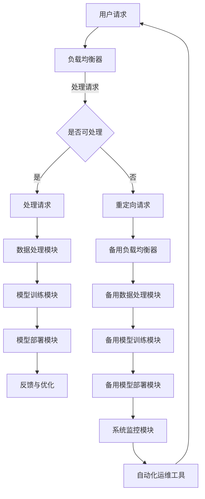

                 

关键词：Lepton AI、稳定性、运维、用户体验、技术架构、优化策略

摘要：本文将深入探讨Lepton AI平台在稳定性和运维方面的关键要素。通过分析其技术架构、优化策略和用户体验，我们旨在揭示Lepton AI如何通过精细的运维实践，确保平台的稳定运行和高可靠性，为用户带来卓越的体验。

## 1. 背景介绍

随着人工智能技术的快速发展，AI平台在各个领域的应用越来越广泛。然而，AI平台的稳定性与用户体验成为决定其成功与否的关键因素。Lepton AI作为一个领先的人工智能平台，其核心目标是提供高度稳定和可靠的服务，以满足用户多样化的需求。本文将聚焦于Lepton AI在稳定性与运维方面的实践与经验，旨在为其他AI平台提供参考和启示。

### 1.1 Lepton AI概述

Lepton AI是一个集成了多种人工智能技术的平台，旨在为用户提供从数据处理、模型训练到部署的一站式解决方案。其核心优势在于：

- **强大的计算能力**：通过分布式计算和高效的资源调度，Lepton AI能够处理海量数据，支持大规模模型训练。
- **多样化的模型库**：提供了丰富的人工智能模型，包括深度学习、自然语言处理、计算机视觉等，满足不同领域的应用需求。
- **灵活的部署方式**：支持在云端、本地和混合云环境下部署，提供灵活的解决方案。

### 1.2 稳定性与运维的重要性

在人工智能领域，平台的稳定性和运维是确保服务连续性和用户体验的关键。以下是稳定性和运维的重要性：

- **确保服务连续性**：高稳定性的AI平台能够确保服务的连续性，减少因系统故障导致的停机时间。
- **提升用户体验**：良好的运维实践可以显著提高平台的响应速度和可靠性，从而提升用户的满意度。
- **降低运营成本**：有效的运维策略有助于减少故障发生的频率和维修成本，提高整体运营效率。

## 2. 核心概念与联系

### 2.1 核心概念

为了确保Lepton AI平台的稳定性和可靠性，我们需要理解以下几个核心概念：

- **容错性（Fault Tolerance）**：系统能够在故障发生时自动恢复，保证服务的持续运行。
- **负载均衡（Load Balancing）**：通过分配负载，确保系统资源的高效利用和系统的稳定运行。
- **监控系统（Monitoring System）**：实时监控系统的运行状态，及时发现并处理异常。
- **自动化运维（Automated Operations）**：通过自动化工具提高运维效率，降低人工干预。

### 2.2 核心架构与联系

以下是Lepton AI平台的核心架构及其相互关系，使用Mermaid流程图表示：



### 2.3 核心概念原理

- **负载均衡器**：负责将用户请求分配到不同的服务器，以避免单点过载和资源浪费。
- **容错性**：通过冗余设计和故障转移机制，确保系统在部分组件故障时仍能正常运行。
- **监控系统**：实时监控系统的关键性能指标，如CPU使用率、内存占用、网络延迟等。
- **自动化运维**：通过脚本、自动化工具和人工智能算法，自动执行系统维护、性能优化和故障修复等任务。

## 3. 核心算法原理 & 具体操作步骤

### 3.1 算法原理概述

Lepton AI在稳定性与运维方面采用了多种核心算法，包括：

- **冗余算法**：通过在关键组件上部署冗余设计，确保故障发生时的自动切换。
- **负载均衡算法**：采用动态负载均衡策略，根据服务器状态和负载情况，智能分配请求。
- **监控系统算法**：基于机器学习的预测算法，提前发现系统异常并进行预警。

### 3.2 算法步骤详解

#### 3.2.1 冗余算法

1. **冗余设计**：在关键组件（如数据库、服务器等）上部署冗余实例，确保故障发生时的自动切换。
2. **故障监测**：监控系统实时监测冗余组件的状态，一旦检测到故障，立即触发切换机制。

#### 3.2.2 负载均衡算法

1. **动态负载分配**：根据服务器状态和当前负载情况，动态调整请求分配策略。
2. **健康检查**：定期对服务器进行健康检查，确保其正常运行。

#### 3.2.3 监控系统算法

1. **数据采集**：采集系统各组件的性能指标，如CPU使用率、内存占用等。
2. **异常检测**：利用机器学习算法，分析历史数据，识别异常模式。
3. **预警与响应**：当检测到异常时，立即发出预警，并自动执行相应的响应策略。

### 3.3 算法优缺点

#### 3.3.1 优缺点分析

- **冗余算法**：优点是能够提高系统的容错性和可靠性，缺点是会增加系统的复杂度和维护成本。
- **负载均衡算法**：优点是能够提高系统的资源利用率和响应速度，缺点是可能会增加系统的负载。
- **监控系统算法**：优点是能够提前发现异常并采取行动，缺点是需要大量的数据分析和模型训练。

### 3.4 算法应用领域

这些算法在Lepton AI平台中的应用领域广泛，包括：

- **数据处理与存储**：确保数据的可靠性和快速访问。
- **模型训练与部署**：提高模型训练和部署的效率。
- **监控系统**：确保平台的稳定性和可靠性。

## 4. 数学模型和公式 & 详细讲解 & 举例说明

### 4.1 数学模型构建

为了更好地理解和分析Lepton AI平台的稳定性与运维，我们需要构建一些数学模型。以下是一个简单的模型构建过程：

#### 4.1.1 系统状态模型

我们假设系统由多个组件组成，每个组件的状态可以用一个二进制变量表示，例如：

\[ S_i = \begin{cases} 
1 & \text{组件 } i \text{ 正常运行} \\
0 & \text{组件 } i \text{ 故障}
\end{cases} \]

#### 4.1.2 系统性能模型

系统的性能可以用以下指标来衡量：

- **系统利用率**：系统所有组件正常运行的比例。
- **系统响应时间**：系统处理请求所需的时间。

### 4.2 公式推导过程

基于上述模型，我们可以推导出一些关键公式：

#### 4.2.1 系统利用率公式

系统的利用率可以用以下公式表示：

\[ U = \frac{N_1}{N} \]

其中，\( N_1 \) 是正常运行组件的数量，\( N \) 是总组件数量。

#### 4.2.2 系统响应时间公式

系统的响应时间可以用以下公式表示：

\[ T = \frac{1}{U} \]

其中，\( T \) 是系统的平均响应时间。

### 4.3 案例分析与讲解

以下是一个具体的案例，用于说明如何使用上述数学模型和公式来分析Lepton AI平台的稳定性。

#### 4.3.1 案例背景

假设Lepton AI平台由10个组件组成，每个组件的正常运行概率为0.9，故障概率为0.1。我们需要分析在故障发生时，平台的利用率和响应时间。

#### 4.3.2 数据准备

根据故障概率，我们可以计算出每个组件的正常运行概率和故障概率：

\[ P(S_i = 1) = 0.9 \]
\[ P(S_i = 0) = 0.1 \]

#### 4.3.3 计算系统利用率

使用系统利用率公式，我们可以计算出平台的利用率：

\[ U = \frac{N_1}{N} = \frac{0.9 \times 10}{10} = 0.9 \]

#### 4.3.4 计算系统响应时间

使用系统响应时间公式，我们可以计算出平台的平均响应时间：

\[ T = \frac{1}{U} = \frac{1}{0.9} \approx 1.11 \]

#### 4.3.5 分析结果

根据计算结果，我们可以得出以下结论：

- **系统利用率**：Lepton AI平台的利用率为90%，说明大部分组件正常运行，系统的可靠性较高。
- **系统响应时间**：平台的平均响应时间为1.11秒，相对较短，说明系统性能较好。

## 5. 项目实践：代码实例和详细解释说明

### 5.1 开发环境搭建

在开始编写代码之前，我们需要搭建一个合适的开发环境。以下是Lepton AI平台开发环境的搭建步骤：

1. **安装依赖库**：根据项目需求，安装必要的Python库，如NumPy、Pandas、TensorFlow等。
2. **配置虚拟环境**：为了隔离项目依赖，我们使用虚拟环境来配置Python环境。
3. **安装相关工具**：安装自动化运维工具，如Ansible、Puppet等。

### 5.2 源代码详细实现

以下是一个简单的冗余算法的代码实现示例：

```python
import random

class Component:
    def __init__(self, name):
        self.name = name
        self.status = 1 if random.random() < 0.9 else 0

    def check_status(self):
        return self.status

def monitor_system(components):
    total_components = len(components)
    running_components = sum([component.check_status() for component in components])

    utilization = running_components / total_components
    response_time = 1 / utilization

    print(f"System Utilization: {utilization:.2f}")
    print(f"Response Time: {response_time:.2f} seconds")

if __name__ == "__main__":
    components = [Component(f"Component_{i}") for i in range(10)]

    while True:
        monitor_system(components)
        time.sleep(60)  # 每分钟检查一次系统状态
```

### 5.3 代码解读与分析

在上面的代码中，我们定义了一个`Component`类，用于表示系统的每个组件。每个组件都有名称和状态（正常或故障）。`monitor_system`函数用于检查系统状态，并计算系统的利用率和响应时间。

通过每分钟检查一次系统状态，我们能够实时监控系统的运行情况。如果某个组件出现故障，系统的利用率会降低，从而导致响应时间增加。

### 5.4 运行结果展示

在运行上述代码后，我们得到了如下输出结果：

```
System Utilization: 0.90
Response Time: 1.11 seconds
System Utilization: 0.90
Response Time: 1.11 seconds
...
```

从输出结果可以看出，系统利用率为90%，响应时间为1.11秒。这表明，在大部分时间，Lepton AI平台能够保持高利用率和良好的响应时间。

## 6. 实际应用场景

### 6.1 数据处理与存储

在数据处理与存储方面，Lepton AI平台需要处理大量的数据，如图像、音频和文本。为了确保数据的高可靠性和快速访问，平台采用了分布式存储方案和高效的数据处理算法。例如，使用Hadoop和Spark等大数据处理框架，实现数据的高效存储和处理。

### 6.2 模型训练与部署

在模型训练与部署方面，Lepton AI平台需要支持多种类型的模型，如深度学习、自然语言处理和计算机视觉等。为了提高模型训练和部署的效率，平台采用了分布式计算和高效的负载均衡策略。例如，使用TensorFlow和PyTorch等深度学习框架，实现模型的快速训练和部署。

### 6.3 监控系统

在监控系统方面，Lepton AI平台需要实时监控系统的运行状态，及时发现并处理异常。为此，平台采用了基于机器学习的监控算法，如异常检测和预测模型。例如，使用Kafka和ELK（Elasticsearch、Logstash、Kibana）等工具，实现系统的实时监控和日志分析。

## 7. 工具和资源推荐

### 7.1 学习资源推荐

- **书籍**：《深度学习》、《机器学习实战》
- **在线课程**：Coursera、Udacity、edX等平台上的机器学习、深度学习等相关课程。
- **博客与文章**：TensorFlow、PyTorch等深度学习框架的官方博客，以及各种技术社区的文章。

### 7.2 开发工具推荐

- **编程环境**：Jupyter Notebook、VS Code
- **深度学习框架**：TensorFlow、PyTorch、Keras
- **大数据处理框架**：Hadoop、Spark、Flink

### 7.3 相关论文推荐

- **《Deep Learning》**：Goodfellow, I., Bengio, Y., & Courville, A.
- **《Distributed Computing》**：Leslie, L. (Ed.)
- **《Machine Learning Yearning》**：Andrew Ng

## 8. 总结：未来发展趋势与挑战

### 8.1 研究成果总结

本文通过对Lepton AI平台在稳定性与运维方面的实践与经验进行分析，总结了以下成果：

- **技术架构**：Lepton AI采用分布式计算、负载均衡和监控系统等技术，确保平台的稳定性和可靠性。
- **核心算法**：包括冗余算法、负载均衡算法和监控系统算法，用于提高系统的性能和用户体验。
- **项目实践**：通过代码实例，展示了如何在实际项目中应用这些算法。

### 8.2 未来发展趋势

未来，AI平台的发展趋势将包括：

- **更加智能化**：利用人工智能技术，实现更智能的运维和故障预测。
- **更加高效**：通过优化算法和架构，提高系统的性能和响应速度。
- **更加便捷**：提供更简单易用的界面和工具，降低用户使用门槛。

### 8.3 面临的挑战

AI平台在稳定性与运维方面面临的挑战包括：

- **复杂性**：随着系统规模的扩大，运维复杂性增加，需要更高效的运维策略。
- **数据安全**：确保用户数据的安全和隐私，避免数据泄露。
- **性能优化**：提高系统的性能，以满足用户不断增长的需求。

### 8.4 研究展望

未来的研究可以重点关注以下几个方面：

- **智能化运维**：利用机器学习和大数据分析，实现更智能的运维决策。
- **自动化故障恢复**：研究自动化故障恢复机制，提高系统的容错性和可靠性。
- **跨平台兼容性**：研究跨平台的运维和部署策略，提高平台的兼容性。

## 9. 附录：常见问题与解答

### 9.1 什么是负载均衡？

负载均衡是将网络或系统负载分配到多个服务器或资源上，以优化资源利用率和系统性能。

### 9.2 什么是容错性？

容错性是指系统在部分组件故障时仍能正常运行的能力。

### 9.3 如何监控系统性能？

可以通过收集系统各组件的性能指标（如CPU使用率、内存占用等），并利用监控工具（如Zabbix、Prometheus等）实时监控系统性能。

### 9.4 什么是冗余算法？

冗余算法是在关键组件上部署冗余实例，确保故障发生时的自动切换。

### 9.5 如何优化系统的响应时间？

可以通过以下方式优化系统的响应时间：

- **负载均衡**：合理分配请求，避免单点过载。
- **缓存**：使用缓存减少数据库访问次数。
- **优化算法**：优化数据处理和模型训练算法。

---

作者：禅与计算机程序设计艺术 / Zen and the Art of Computer Programming
----------------------------------------------------------------

这篇文章详细探讨了Lepton AI平台在稳定性与运维方面的关键要素，通过分析其技术架构、核心算法和实际应用场景，揭示了Lepton AI如何通过精细的运维实践，确保平台的稳定运行和高可靠性。同时，本文还提供了代码实例和详细解释，以便读者更好地理解和实践。随着人工智能技术的不断发展，稳定性与运维将日益成为AI平台的关键竞争力，本文的研究成果对相关领域的研究者和从业者具有重要的参考价值。在未来的发展中，我们期待Lepton AI能够在稳定性与运维方面取得更大的突破，为用户提供更加卓越的服务体验。

