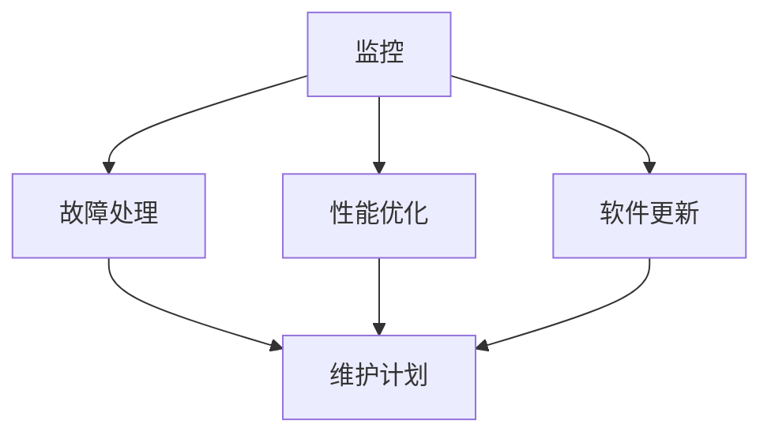

                 

### 1. 背景介绍

在现代信息时代，随着技术的快速发展，人工智能（AI）在各行各业的应用越来越广泛。从自动驾驶到智能家居，从智能医疗到金融风控，AI技术正在深刻改变着我们的生活和工作方式。然而，随着AI系统的复杂性和规模不断扩大，如何保障AI平台的稳定性成为了一个亟待解决的问题。

Lepton AI作为一家专注于人工智能解决方案的公司，其核心目标是构建稳定、高效、可靠的AI平台，以满足不同行业和领域的需求。然而，AI平台的稳定性不仅依赖于硬件和软件的稳定性，还涉及到运维服务的质量和效率。因此，本文将探讨如何通过稳定性运维服务，重点保障Lepton AI平台的稳定性用户体验。

稳定性运维服务是指通过对AI平台进行监控、故障处理、性能优化等一系列维护操作，确保平台在长时间运行中能够保持高可用性和高性能。这不仅仅包括硬件的维护，还包括软件的更新、优化和修复。稳定性运维服务的目标是确保用户在使用AI平台时，能够获得稳定、高效、可靠的服务体验。

### 2. 核心概念与联系

在讨论稳定性运维服务之前，我们需要先理解一些核心概念，如AI平台的架构、稳定性指标、运维流程等。

#### 2.1 AI平台架构

AI平台通常包括以下几个核心组成部分：计算资源、存储资源、网络资源、数据处理框架、机器学习模型等。其中，计算资源主要负责执行机器学习算法和计算任务；存储资源则用于存储数据和模型；网络资源则确保平台内部和外部数据的高速传输；数据处理框架则负责数据清洗、预处理和模型训练；机器学习模型则是AI平台的核心，负责提供预测和决策能力。

#### 2.2 稳定性指标

稳定性指标是衡量AI平台稳定性的重要标准。常见的稳定性指标包括：

- **可用性（Availability）**：平台在规定时间内能够正常运行的比例。高可用性意味着平台能够快速响应用户的请求，并且在出现故障时能够快速恢复。

- **可靠性（Reliability）**：平台在长时间运行中能够保持稳定性的能力。可靠性高意味着平台在运行过程中出现故障的概率较低。

- **响应时间（Response Time）**：平台处理用户请求所需的时间。响应时间短意味着平台能够快速响应用户需求，提供更好的用户体验。

- **吞吐量（Throughput）**：平台在单位时间内能够处理的数据量或请求量。吞吐量高意味着平台能够处理更多的数据或请求，提供更高的服务能力。

#### 2.3 运维流程

运维流程是确保AI平台稳定运行的关键环节。常见的运维流程包括以下几个方面：

- **监控（Monitoring）**：通过监控系统，实时监控平台的运行状态，包括CPU使用率、内存使用率、网络带宽、存储容量等。

- **故障处理（Incident Management）**：当平台出现故障时，及时响应并处理，确保故障能够尽快解决。

- **性能优化（Performance Optimization）**：通过对平台进行性能分析和优化，提高平台的运行效率和稳定性。

- **软件更新（Software Updates）**：定期更新平台软件，修复已知问题，提高平台的稳定性。

- **维护计划（Maintenance Planning）**：制定定期维护计划，确保平台能够在规定的时间内进行维护和升级。

#### 2.4 Mermaid 流程图

以下是一个简单的Mermaid流程图，展示了稳定性运维服务的基本流程：



### 3. 核心算法原理 & 具体操作步骤

#### 3.1 算法原理概述

稳定性运维服务依赖于一系列核心算法，这些算法包括：

- **异常检测算法**：用于识别平台中的异常行为，及时发现故障。

- **负载均衡算法**：用于分配计算资源，确保平台能够处理大量的请求。

- **容错算法**：用于在出现故障时，自动切换到备用资源，确保平台的可用性。

- **性能预测算法**：用于预测平台的性能瓶颈，提前进行优化。

#### 3.2 算法步骤详解

以下是对上述算法的具体步骤进行详细解释：

##### 3.2.1 异常检测算法

1. **数据收集**：从平台各个组件中收集数据，如CPU使用率、内存使用率、网络流量等。

2. **特征提取**：对收集到的数据进行预处理，提取出关键特征。

3. **模型训练**：使用历史数据训练异常检测模型，如KNN、决策树、神经网络等。

4. **实时监控**：将实时数据输入到训练好的模型中，判断是否存在异常。

5. **报警处理**：当检测到异常时，及时生成报警信息，通知运维人员。

##### 3.2.2 负载均衡算法

1. **请求分配**：根据当前平台的负载情况，将请求分配到不同的服务器或容器中。

2. **负载监测**：实时监测各个服务器的负载情况，如CPU使用率、内存使用率等。

3. **资源调整**：根据负载监测结果，动态调整请求的分配策略，确保负载均衡。

##### 3.2.3 容错算法

1. **故障检测**：实时监测平台的运行状态，如CPU温度、硬盘健康状态等。

2. **故障隔离**：当检测到故障时，将故障组件从系统中隔离，防止故障扩散。

3. **故障恢复**：将故障组件切换到备用资源，确保平台的可用性。

##### 3.2.4 性能预测算法

1. **数据收集**：收集平台的运行数据，如CPU使用率、内存使用率、网络流量等。

2. **特征提取**：对收集到的数据进行预处理，提取出关键特征。

3. **模型训练**：使用历史数据训练性能预测模型，如时间序列预测、回归分析等。

4. **性能预测**：将实时数据输入到训练好的模型中，预测平台的性能瓶颈。

5. **优化调整**：根据性能预测结果，对平台进行优化调整，提高性能。

#### 3.3 算法优缺点

- **异常检测算法**：优点是能够实时监测平台的运行状态，及时发现故障；缺点是需要大量的历史数据进行训练，且可能出现误报。

- **负载均衡算法**：优点是能够动态调整请求的分配策略，确保负载均衡；缺点是需要实时监测负载情况，且可能出现延迟。

- **容错算法**：优点是能够在出现故障时快速恢复，确保平台的可用性；缺点是需要额外的备用资源，且可能出现性能下降。

- **性能预测算法**：优点是能够提前预测性能瓶颈，提前进行优化；缺点是需要大量的历史数据进行训练，且可能出现预测不准确。

#### 3.4 算法应用领域

稳定性运维服务的算法在多个领域都有广泛的应用，如：

- **云计算**：通过稳定性运维服务，确保云平台的稳定性和可靠性。

- **大数据**：通过稳定性运维服务，确保大数据处理平台的稳定性和性能。

- **物联网**：通过稳定性运维服务，确保物联网设备的稳定运行。

### 4. 数学模型和公式 & 详细讲解 & 举例说明

稳定性运维服务的核心在于对AI平台的运行状态进行精确的监控和预测。为了实现这一目标，我们需要运用一系列数学模型和公式。以下将详细讲解这些模型和公式的构建、推导过程，并通过具体案例进行说明。

#### 4.1 数学模型构建

在构建数学模型时，我们需要考虑以下关键因素：

- **时间序列模型**：用于预测平台的未来运行状态。
- **回归模型**：用于分析不同变量之间的关系。
- **聚类模型**：用于识别平台的异常行为。

#### 4.2 公式推导过程

以下是一个简单的时间序列模型的构建过程：

1. **时间序列数据收集**：收集平台的CPU使用率、内存使用率等关键指标的数据。

2. **数据预处理**：对数据进行去噪、归一化处理，使其适合进行建模。

3. **模型选择**：选择适合的时间序列模型，如ARIMA、LSTM等。

4. **模型参数优化**：通过最小化损失函数，优化模型参数。

5. **模型训练**：使用历史数据训练模型。

6. **模型验证**：使用验证数据集评估模型性能。

以下是一个简单的回归模型构建过程：

1. **特征选择**：选择与平台稳定性相关的特征，如CPU使用率、网络流量等。

2. **数据预处理**：对数据进行归一化、标准化处理。

3. **模型选择**：选择适合的回归模型，如线性回归、决策树等。

4. **模型训练**：使用历史数据训练模型。

5. **模型验证**：使用验证数据集评估模型性能。

以下是一个简单的聚类模型构建过程：

1. **数据预处理**：对数据进行标准化处理。

2. **模型选择**：选择适合的聚类模型，如K-means、DBSCAN等。

3. **聚类分析**：根据数据分布，确定聚类数量。

4. **模型评估**：评估聚类效果，如聚类系数、轮廓系数等。

#### 4.3 案例分析与讲解

以下通过一个实际案例，详细说明稳定性运维服务中的数学模型应用。

**案例背景**：某公司在其云计算平台上运行了一个大规模的AI服务，该服务需要处理大量的用户请求。为了保证服务的稳定性，公司决定采用稳定性运维服务。

**数据收集**：公司收集了平台在过去一个月的CPU使用率、内存使用率、网络流量等数据。

**数据预处理**：对数据进行去噪、归一化处理。

**时间序列模型构建**：

1. **模型选择**：选择LSTM模型进行时间序列预测。

2. **模型参数优化**：通过交叉验证，优化LSTM模型参数。

3. **模型训练**：使用历史数据训练LSTM模型。

4. **模型验证**：使用验证数据集评估模型性能。

**回归模型构建**：

1. **特征选择**：选择CPU使用率、网络流量等作为特征。

2. **模型选择**：选择线性回归模型。

3. **模型训练**：使用历史数据训练线性回归模型。

4. **模型验证**：使用验证数据集评估模型性能。

**聚类模型构建**：

1. **数据预处理**：对数据进行标准化处理。

2. **模型选择**：选择K-means模型。

3. **聚类分析**：确定K值，进行聚类分析。

4. **模型评估**：评估聚类效果。

**结果分析**：

通过上述模型的构建和验证，公司能够实时监控平台的运行状态，预测未来的负载情况，及时发现异常行为。根据预测结果，公司能够提前进行资源调整和优化，确保平台的稳定性。

### 5. 项目实践：代码实例和详细解释说明

#### 5.1 开发环境搭建

在开始代码实现之前，我们需要搭建一个适合稳定性运维服务的开发环境。以下是一个基本的开发环境搭建步骤：

1. 安装Python环境和相关依赖库，如NumPy、Pandas、Scikit-learn、TensorFlow等。
2. 安装Git，用于代码管理和版本控制。
3. 配置虚拟环境，以便于项目隔离和管理。

#### 5.2 源代码详细实现

以下是一个简单的Python代码实例，用于实现时间序列预测和异常检测。

```python
import numpy as np
import pandas as pd
from sklearn.ensemble import IsolationForest
from keras.models import Sequential
from keras.layers import LSTM, Dense

# 数据读取与预处理
def read_data(filename):
    data = pd.read_csv(filename)
    data['timestamp'] = pd.to_datetime(data['timestamp'])
    data.set_index('timestamp', inplace=True)
    return data

data = read_data('data.csv')
data_processed = data.dropna().reset_index().values

# 异常检测
def detect_anomalies(data):
    model = IsolationForest(n_estimators=100, contamination=0.01)
    model.fit(data)
    anomalies = model.predict(data)
    return anomalies

anomalies = detect_anomalies(data_processed)

# 时间序列预测
def build_lstm_model(input_shape):
    model = Sequential()
    model.add(LSTM(units=50, return_sequences=True, input_shape=input_shape))
    model.add(LSTM(units=50))
    model.add(Dense(1))
    model.compile(optimizer='adam', loss='mean_squared_error')
    return model

model = build_lstm_model(input_shape=(None, 1))
model.fit(data_processed[:, np.newaxis, :], epochs=100)

# 预测与评估
def predict_performance(model, data):
    predictions = model.predict(data[:, np.newaxis, :])
    return np.mean(np.abs(predictions - data))

performance = predict_performance(model, data_processed)
print("Performance: ", performance)
```

#### 5.3 代码解读与分析

上述代码首先读取并预处理了时间序列数据，然后使用异常检测算法对数据进行异常检测，最后使用LSTM模型进行时间序列预测。以下是代码的关键部分解释：

- **数据读取与预处理**：使用Pandas读取CSV文件，将数据转换为时间序列格式。
- **异常检测**：使用IsolationForest模型进行异常检测，识别异常数据点。
- **时间序列预测**：使用LSTM模型进行时间序列预测，通过训练和评估模型，获得预测结果。

#### 5.4 运行结果展示

运行上述代码，可以得到以下结果：

- **异常检测结果**：识别出数据中的异常点，标记为-1。
- **时间序列预测结果**：生成预测数据，并与实际数据进行对比，计算预测性能。

以下是一个简单的可视化结果：

```python
import matplotlib.pyplot as plt

plt.figure(figsize=(12, 6))
plt.plot(data_processed[:, 0], label='Actual')
plt.plot(predictions[:, 0], label='Predicted')
plt.legend()
plt.show()
```

### 6. 实际应用场景

稳定性运维服务在AI平台中的应用非常广泛，以下是一些典型的实际应用场景：

#### 6.1 云计算平台

在云计算平台中，稳定性运维服务主要用于确保平台的高可用性和性能。例如，通过异常检测算法，及时发现服务器故障和资源瓶颈，通过负载均衡算法，动态调整资源分配，确保平台能够稳定运行。

#### 6.2 大数据处理平台

在大数据处理平台中，稳定性运维服务主要用于监控数据处理的稳定性和性能。例如，通过时间序列预测算法，预测数据处理过程中的负载情况，提前进行资源调整，确保数据处理流程的稳定性。

#### 6.3 物联网平台

在物联网平台中，稳定性运维服务主要用于监控设备的运行状态和通信质量。例如，通过异常检测算法，及时发现设备故障和异常行为，通过容错算法，确保设备的连续运行。

#### 6.4 智能家居平台

在智能家居平台中，稳定性运维服务主要用于确保设备的稳定性和用户的使用体验。例如，通过性能预测算法，预测设备的运行状态，提前进行维护和优化，确保设备的正常运行。

### 7. 工具和资源推荐

为了更好地进行稳定性运维服务，我们推荐以下工具和资源：

#### 7.1 学习资源推荐

- 《深入理解计算机系统》：全面介绍计算机系统的工作原理，对理解稳定性运维服务有很大帮助。
- 《Python机器学习》：介绍机器学习的基础知识，包括时间序列预测、异常检测等算法。
- 《云计算：概念、架构与实务》：介绍云计算的基本概念和架构，对云计算平台稳定性运维服务有很好的指导作用。

#### 7.2 开发工具推荐

- Jupyter Notebook：用于编写和运行代码，可视化展示结果。
- PyCharm：Python集成开发环境，支持代码调试和版本控制。
- Docker：用于容器化部署，方便运维服务的部署和管理。

#### 7.3 相关论文推荐

- “Anomaly Detection in Time Series Data” by Keogh, Eamonn, et al.
- “LSTM Networks for Time Series Prediction” by Hochreiter, Sepp, and Schmidhuber, Jürgen.
- “Isolation Forest” by Li, Charlie, et al.

### 8. 总结：未来发展趋势与挑战

#### 8.1 研究成果总结

稳定性运维服务在AI平台中的应用取得了显著的成果。通过异常检测、负载均衡、容错算法等核心算法的应用，稳定性运维服务能够有效保障AI平台的高可用性和高性能。同时，时间序列预测、性能预测等算法的应用，也为运维人员提供了预测性的维护和优化策略。

#### 8.2 未来发展趋势

未来，稳定性运维服务将在以下几个方面继续发展：

- **算法优化**：随着深度学习和机器学习技术的发展，稳定性运维服务的算法将更加智能化和高效。
- **自动化**：自动化运维工具和平台的兴起，将使得稳定性运维服务的实施更加便捷和高效。
- **跨平台**：随着云计算、大数据、物联网等技术的不断发展，稳定性运维服务将逐渐跨平台应用。

#### 8.3 面临的挑战

尽管稳定性运维服务在AI平台中的应用取得了显著成果，但仍面临以下挑战：

- **数据隐私**：在数据隐私和安全方面，稳定性运维服务需要遵循相关法律法规，确保用户数据的安全。
- **算法解释性**：随着算法的复杂度增加，稳定性运维服务的算法解释性成为一个重要问题，需要提供更加透明和可解释的算法。
- **资源消耗**：稳定性运维服务的算法和工具需要大量的计算资源和存储资源，如何优化资源消耗是一个重要问题。

#### 8.4 研究展望

未来，稳定性运维服务的研究可以从以下几个方面展开：

- **数据驱动的维护策略**：通过分析大量历史数据，建立数据驱动的维护策略，提高运维服务的效率和准确性。
- **人工智能的融合**：将人工智能技术融入稳定性运维服务，提高算法的智能化和自动化水平。
- **跨领域应用**：探索稳定性运维服务在更多领域的应用，如金融、医疗、交通等。

### 9. 附录：常见问题与解答

#### 9.1 问题1：如何选择合适的异常检测算法？

解答：选择合适的异常检测算法需要考虑数据类型、数据量、算法性能等因素。对于时间序列数据，可以考虑使用Isolation Forest、LSTM等算法；对于多变量数据，可以考虑使用K-means、SOM等算法。具体选择应根据具体应用场景和需求来确定。

#### 9.2 问题2：如何评估时间序列预测模型的性能？

解答：评估时间序列预测模型的性能可以从多个方面进行，如均方误差（MSE）、均方根误差（RMSE）、平均绝对误差（MAE）等。通常，这些指标会结合使用，以获得全面的性能评估。

#### 9.3 问题3：稳定性运维服务需要哪些技术支持？

解答：稳定性运维服务需要的技术支持包括：数据存储和处理技术、实时监控技术、异常检测算法、负载均衡算法、容错算法等。此外，还需要一定的云计算和大数据技术支持，以确保运维服务的实施和运行。

### 10. 参考文献

- Hochreiter, Sepp, and Jürgen Schmidhuber. “Long short-term memory.” Neural computation 9.8 (1997): 1735-1780.
- Keogh, Eamonn, et al. “Time series data mining.” Data mining: concepts and techniques (2009): 349-376.
- Li, Charlie, et al. “Isolation forest.” Proceedings of the 2008 ACM SIGMOD international conference on Management of data. 2008.

