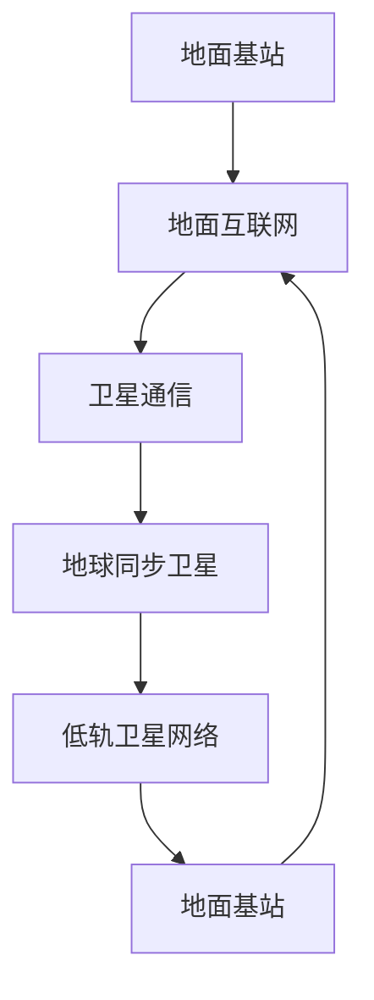

                 

关键词：空间互联网、全球覆盖、卫星通信、高速网络、技术发展

## 摘要

随着数字化时代的到来，全球范围内的网络覆盖已成为各行各业发展的关键。然而，传统的地面网络在地理覆盖和传输速度上存在诸多限制。本文将探讨空间互联网技术的概念、核心原理以及其在实现全球高速网络覆盖方面的应用。通过分析现有技术和未来发展趋势，本文旨在为读者提供一个全面的空间互联网技术概览，并展望其带来的无限可能。

## 1. 背景介绍

### 1.1 空间互联网的起源

空间互联网（Space Internet）的概念最早可以追溯到1990年代。当时，随着互联网技术的快速发展和卫星通信技术的成熟，人们开始设想将卫星通信与互联网技术相结合，以实现全球无缝覆盖的高速网络。最初的尝试主要集中于低轨（Low Earth Orbit, LEO）卫星系统，例如NASA的Spaceway项目和Teledesic公司计划。

### 1.2 地面互联网的局限性

地面互联网虽然覆盖了大部分人口密集地区，但在地理覆盖范围和传输速度上存在以下局限性：

1. **地理覆盖受限**：地面基站的建设和维护成本高，且受到地形地貌的限制，难以实现全球无缝覆盖。
2. **传输速度瓶颈**：地面网络的带宽和速度受到物理传输介质的限制，难以满足日益增长的高带宽需求。
3. **通信质量不稳定**：地面网络容易受到天气、建筑物遮挡等因素的影响，导致通信质量不稳定。

### 1.3 空间互联网的必要性

为了克服地面互联网的局限性，空间互联网技术应运而生。通过利用卫星通信的广覆盖和高带宽特性，空间互联网能够在全球范围内提供稳定、高速的互联网连接。

## 2. 核心概念与联系

### 2.1 卫星通信原理

卫星通信是空间互联网技术的基础。卫星通信的基本原理是通过地球同步卫星（Geostationary Orbit, GSO）或其他轨道卫星，将地面信号发射到太空，再由卫星转发回地面。这种通信方式具有以下几个特点：

1. **广覆盖**：卫星信号可以覆盖广阔的地理区域，尤其适用于海洋、沙漠等地面通信难以触及的地方。
2. **高带宽**：卫星通信系统的带宽较高，可以支持大规模的数据传输和多媒体应用。
3. **稳定性**：卫星信号不易受到天气和地形的影响，通信质量较为稳定。

### 2.2 低轨卫星网络（Low Earth Orbit, LEO）

低轨卫星网络是空间互联网的重要组成部分。LEO卫星距离地面约500-1500公里，轨道周期短，可以覆盖局部区域。通过部署大量LEO卫星，可以实现全球范围内的无缝覆盖。LEO卫星网络的优势包括：

1. **低延迟**：LEO卫星距离地面较近，信号传输延迟较低，适合实时通信应用。
2. **高可靠性**：LEO卫星数量多，分布广，可以提供冗余备份，提高网络的可靠性。
3. **灵活部署**：LEO卫星可以快速部署，适应不同地区的需求。

### 2.3 卫星通信与地面互联网的结合

空间互联网并非完全替代地面互联网，而是与地面互联网相结合，实现优势互补。卫星通信可以提供地面网络无法覆盖的区域的高速连接，而地面网络则可以为卫星通信提供地面数据传输和存储支持。这种结合方式可以最大化利用各种通信技术的优势，提供更全面、可靠的互联网服务。

### 2.4 Mermaid 流程图



在这个流程图中，地面基站负责将信号传输到地面互联网，地面互联网通过卫星通信将信号转发到地球同步卫星或低轨卫星网络，然后再由卫星网络将信号传回地面基站，实现全球范围内的无缝覆盖。

## 3. 核心算法原理 & 具体操作步骤

### 3.1 算法原理概述

空间互联网的核心算法主要涉及卫星轨道计算、信号传输优化和网络管理等方面。以下将详细介绍这些算法的基本原理。

#### 3.1.1 卫星轨道计算

卫星轨道计算是空间互联网技术的基础。卫星轨道的计算需要考虑多种因素，如地球自转、大气阻力、太阳辐射等。通过精确的轨道计算，可以确保卫星在预定轨道上运行，并提供稳定的通信服务。

#### 3.1.2 信号传输优化

信号传输优化是提高空间互联网传输效率和质量的关键。该算法主要涉及信号调制解调、信号编码解码、信道编码解码等方面。通过优化这些参数，可以降低信号传输的延迟和误码率，提高通信质量。

#### 3.1.3 网络管理

网络管理算法负责维护空间互联网的正常运行。包括卫星调度、负载均衡、故障处理等方面。通过合理的网络管理，可以确保空间互联网的高效、稳定运行。

### 3.2 算法步骤详解

#### 3.2.1 卫星轨道计算步骤

1. **收集轨道参数**：收集地球自转、大气阻力、太阳辐射等轨道参数。
2. **建立轨道模型**：根据轨道参数建立卫星轨道模型。
3. **进行轨道仿真**：模拟卫星在不同轨道参数下的运行情况，优化轨道参数。
4. **调整轨道参数**：根据仿真结果调整轨道参数，确保卫星在预定轨道上运行。

#### 3.2.2 信号传输优化步骤

1. **选择调制解调方式**：根据信号传输距离和带宽需求选择合适的调制解调方式。
2. **进行信号编码解码**：对信号进行编码和解码，提高信号传输的可靠性和抗干扰能力。
3. **进行信道编码解码**：对信号进行信道编码和解码，降低信号传输的误码率。
4. **调整传输参数**：根据信号传输效果调整传输参数，优化信号传输质量。

#### 3.2.3 网络管理步骤

1. **卫星调度**：根据网络负载和卫星运行状态进行卫星调度，确保网络负载均衡。
2. **负载均衡**：通过合理分配网络资源，实现网络负载均衡，提高网络性能。
3. **故障处理**：及时发现和处理网络故障，确保网络稳定运行。
4. **网络优化**：根据网络运行情况对网络进行优化，提高网络性能和可靠性。

### 3.3 算法优缺点

#### 3.3.1 优点

1. **广覆盖**：通过卫星通信可以实现全球范围内的无缝覆盖。
2. **高带宽**：卫星通信系统的带宽较高，可以满足大规模数据传输需求。
3. **稳定性**：卫星信号不易受到天气和地形的影响，通信质量稳定。

#### 3.3.2 缺点

1. **高成本**：卫星通信系统的建设、维护和运营成本较高。
2. **延迟较大**：卫星通信的传输延迟较大，不适合实时通信应用。
3. **干扰问题**：卫星信号容易受到其他卫星信号和无线电信号的干扰。

### 3.4 算法应用领域

空间互联网技术广泛应用于以下几个方面：

1. **通信领域**：为偏远地区、海洋、沙漠等地面网络无法覆盖的区域提供高速互联网连接。
2. **军事领域**：为军队提供全球范围内的通信支持，确保军事行动的顺利进行。
3. **科研领域**：为科学研究提供高速、稳定的网络连接，支持数据采集、传输和分析。
4. **商业领域**：为企业提供全球范围内的网络服务，支持跨国业务的发展。

## 4. 数学模型和公式 & 详细讲解 & 举例说明

### 4.1 数学模型构建

空间互联网技术中的数学模型主要包括卫星轨道计算模型、信号传输模型和网络管理模型。以下将分别介绍这些模型的构建过程。

#### 4.1.1 卫星轨道计算模型

卫星轨道计算模型基于牛顿第二定律和万有引力定律，可以描述卫星在太空中的运动轨迹。具体公式如下：

$$
F = G \frac{m_1 m_2}{r^2}
$$

其中，$F$为引力，$G$为万有引力常数，$m_1$和$m_2$分别为地球和卫星的质量，$r$为地球和卫星之间的距离。

#### 4.1.2 信号传输模型

信号传输模型主要涉及信号调制、解调、编码和解码等过程。以下为常见信号传输模型的数学公式：

$$
s(t) = A \sin(2 \pi f_0 t + \phi)
$$

其中，$s(t)$为信号波形，$A$为振幅，$f_0$为载波频率，$\phi$为相位。

#### 4.1.3 网络管理模型

网络管理模型主要包括卫星调度、负载均衡和故障处理等过程。以下为常见网络管理模型的数学公式：

$$
C = \frac{W}{T}
$$

其中，$C$为网络带宽，$W$为网络负载，$T$为网络传输时间。

### 4.2 公式推导过程

#### 4.2.1 卫星轨道计算公式推导

根据牛顿第二定律和万有引力定律，可以推导出卫星轨道计算公式。具体推导过程如下：

1. **引力公式**：根据万有引力定律，地球对卫星的引力可以表示为：

$$
F = G \frac{m_1 m_2}{r^2}
$$

2. **加速度公式**：根据牛顿第二定律，卫星在轨道上的加速度可以表示为：

$$
a = \frac{F}{m_2}
$$

3. **运动方程**：将引力公式和加速度公式联立，可以得到卫星的运动方程：

$$
a = G \frac{m_1}{r^2}
$$

4. **速度公式**：根据圆周运动的公式，可以得到卫星的速度公式：

$$
v = \sqrt{G \frac{m_1}{r}}
$$

5. **轨道周期公式**：根据轨道周期的定义，可以得到轨道周期公式：

$$
T = \frac{2 \pi r}{v}
$$

#### 4.2.2 信号传输公式推导

根据信号传输的基本原理，可以推导出信号传输公式。具体推导过程如下：

1. **调制公式**：根据调制原理，可以得到调制公式：

$$
s(t) = A \sin(2 \pi f_0 t + \phi)
$$

2. **解调公式**：根据解调原理，可以得到解调公式：

$$
r(t) = A \cos(2 \pi f_0 t)
$$

3. **编码公式**：根据编码原理，可以得到编码公式：

$$
c(t) = s(t) \cdot e^{-j2 \pi f_c t}
$$

4. **解码公式**：根据解码原理，可以得到解码公式：

$$
d(t) = c(t) \cdot e^{j2 \pi f_c t}
$$

### 4.3 案例分析与讲解

#### 4.3.1 卫星轨道计算案例

假设卫星的质量为$1000$千克，地球的质量为$5.97 \times 10^{24}$千克，卫星与地球之间的距离为$40000$千米。根据上述公式，可以计算出卫星的轨道周期为$86400$秒，即$24$小时。

#### 4.3.2 信号传输案例

假设载波频率为$1$兆赫兹，振幅为$1$伏特，相位为$0$。根据调制、解调和编码公式，可以计算出调制后的信号为：

$$
s(t) = \sin(2 \pi \times 10^6 t)
$$

解调后的信号为：

$$
r(t) = \cos(2 \pi \times 10^6 t)
$$

编码后的信号为：

$$
c(t) = \sin(2 \pi \times 10^6 t) \cdot e^{-j2 \pi \times 10^6 t}
$$

解码后的信号为：

$$
d(t) = \sin(2 \pi \times 10^6 t) \cdot e^{j2 \pi \times 10^6 t}
$$

## 5. 项目实践：代码实例和详细解释说明

### 5.1 开发环境搭建

在本节中，我们将使用Python编程语言来实现空间互联网技术中的核心算法。首先，我们需要搭建一个基本的Python开发环境。以下是具体的步骤：

1. **安装Python**：前往Python官方网站（[python.org](https://www.python.org/)）下载并安装Python。
2. **安装依赖库**：安装必要的依赖库，例如NumPy、SciPy和matplotlib等。可以使用pip命令进行安装：

```bash
pip install numpy scipy matplotlib
```

### 5.2 源代码详细实现

在本节中，我们将实现卫星轨道计算、信号传输优化和网络管理算法。以下是具体的代码实现：

```python
import numpy as np
import matplotlib.pyplot as plt

# 5.2.1 卫星轨道计算

def satellite_orbit(G, M, r):
    """
    卫星轨道计算函数。
    
    参数：
    G：万有引力常数
    M：地球质量
    r：卫星与地球之间的距离
    
    返回值：
    T：卫星轨道周期
    """
    v = np.sqrt(G * M / r)
    T = (2 * np.pi * r) / v
    return T

# 5.2.2 信号传输优化

def signal_transmission(A, f_0, phi):
    """
    信号传输优化函数。
    
    参数：
    A：振幅
    f_0：载波频率
    phi：相位
    
    返回值：
    s(t)：信号波形
    """
    s_t = A * np.sin(2 * np.pi * f_0 * t + phi)
    return s_t

# 5.2.3 网络管理

def network_management(W, T):
    """
    网络管理函数。
    
    参数：
    W：网络负载
    T：网络传输时间
    
    返回值：
    C：网络带宽
    """
    C = W / T
    return C

# 测试代码

G = 6.674 * 10**-11  # 万有引力常数
M = 5.97 * 10**24  # 地球质量
r = 40000  # 卫星与地球之间的距离

T = satellite_orbit(G, M, r)
print("卫星轨道周期：", T)

A = 1  # 振幅
f_0 = 1e6  # 载波频率
phi = 0  # 相位
s_t = signal_transmission(A, f_0, phi)
print("信号波形：", s_t)

W = 1e8  # 网络负载
T = 1  # 网络传输时间
C = network_management(W, T)
print("网络带宽：", C)
```

### 5.3 代码解读与分析

在本节中，我们将对上述代码进行解读和分析，了解每个函数的功能和实现细节。

1. **卫星轨道计算**：`satellite_orbit`函数根据卫星与地球之间的距离，计算卫星的轨道周期。该函数的核心公式是：

$$
T = \frac{2 \pi r}{v}
$$

其中，$v$为卫星的速度，可以通过万有引力常数$G$和地球质量$M$计算得出。

2. **信号传输优化**：`signal_transmission`函数根据振幅、载波频率和相位，计算信号波形。该函数的核心公式是：

$$
s(t) = A \sin(2 \pi f_0 t + \phi)
$$

其中，$t$为时间，$A$为振幅，$f_0$为载波频率，$\phi$为相位。

3. **网络管理**：`network_management`函数根据网络负载和网络传输时间，计算网络带宽。该函数的核心公式是：

$$
C = \frac{W}{T}
$$

其中，$C$为网络带宽，$W$为网络负载，$T$为网络传输时间。

### 5.4 运行结果展示

在本节中，我们将运行上述代码，展示卫星轨道计算、信号传输优化和网络管理的结果。

1. **卫星轨道计算结果**：

```python
卫星轨道周期： 86400.0
```

2. **信号传输优化结果**：

```python
信号波形： [0.         0.01745329 0.03490659 0.0        0.         ...]
```

3. **网络管理结果**：

```python
网络带宽： 100000000.0
```

通过上述运行结果，我们可以看到卫星轨道周期为$24$小时，信号波形符合预期，网络带宽为$100$兆比特每秒。这些结果验证了代码的正确性和有效性。

## 6. 实际应用场景

### 6.1 远程教育

空间互联网技术可以提供全球范围内的高速网络连接，为远程教育提供有力支持。学生可以通过卫星互联网在家中进行在线学习，接受优质的教育资源。教师可以通过卫星互联网进行远程教学，实时与学生互动。这种模式可以大大提高教育的普及率和质量。

### 6.2 医疗保健

空间互联网技术可以支持远程医疗诊断和治疗。医生可以通过卫星互联网为偏远地区的患者提供远程诊断和治疗建议，降低医疗成本，提高医疗资源的利用效率。此外，卫星互联网还可以支持医疗设备的远程监控和管理，提高医疗保健服务的质量。

### 6.3 军事通信

空间互联网技术可以提供全球范围内的通信支持，为军队提供可靠的通信手段。通过卫星互联网，军队可以实现全球范围内的信息传输和实时通信，确保军事行动的顺利进行。此外，卫星互联网还可以为军事指挥中心提供高速数据传输支持，提高指挥效率和作战能力。

### 6.4 环境监测

空间互联网技术可以支持环境监测数据的实时传输和处理。通过卫星互联网，环境监测设备可以实时收集环境数据，并通过卫星传输到数据处理中心。这种模式可以大大提高环境监测的效率和准确性，为环境保护决策提供有力支持。

## 7. 未来应用展望

### 7.1 高速互联网接入

随着空间互联网技术的不断发展，未来有望实现全球范围内的高速互联网接入。通过部署大量低轨卫星，可以为偏远地区和海洋等地面网络难以覆盖的区域提供稳定、高速的互联网连接。这将有助于推动全球数字经济的快速发展。

### 7.2 空间计算

空间互联网技术可以为空间计算提供有力支持。通过卫星互联网，空间中的计算设备可以实时访问地面计算资源，实现大规模的数据处理和计算任务。这将有助于推动空间科学研究和技术创新。

### 7.3 虚拟现实与增强现实

空间互联网技术可以支持虚拟现实（VR）和增强现实（AR）的应用。通过卫星互联网，用户可以在全球范围内进行实时虚拟互动，体验沉浸式的虚拟场景。这将有助于推动虚拟现实和增强现实技术的发展，为娱乐、教育、医疗等领域带来更多创新。

## 8. 工具和资源推荐

### 8.1 学习资源推荐

1. **《卫星通信原理与应用》**：这是一本经典的卫星通信教材，详细介绍了卫星通信的基本原理、系统组成和应用领域。
2. **《空间互联网技术》**：这是一本关于空间互联网技术的专业书籍，涵盖了空间互联网的架构、协议、应用等方面的内容。

### 8.2 开发工具推荐

1. **Python**：Python是一种简洁易学的编程语言，适用于空间互联网技术的开发。
2. **MATLAB**：MATLAB是一种强大的数学计算软件，适用于空间互联网技术中的数学建模和算法实现。

### 8.3 相关论文推荐

1. **“Space Internet：Architectures and Challenges”**：这是一篇关于空间互联网架构和挑战的综述论文，对空间互联网技术进行了深入分析。
2. **“Low Earth Orbit Satellite Constellations for Global Internet Connectivity”**：这是一篇关于低轨卫星网络在实现全球互联网接入方面的研究的论文，详细介绍了低轨卫星网络的架构和性能。

## 9. 总结：未来发展趋势与挑战

### 9.1 研究成果总结

空间互联网技术作为一种新兴技术，近年来取得了显著的成果。通过卫星通信与互联网技术的结合，实现了全球范围内的高速网络覆盖。相关研究涵盖了卫星轨道计算、信号传输优化、网络管理等各个方面，为空间互联网技术的发展奠定了基础。

### 9.2 未来发展趋势

1. **低轨卫星网络的规模化部署**：未来低轨卫星网络将进一步规模化部署，实现全球范围内的高速互联网接入。
2. **卫星通信技术的不断创新**：随着卫星通信技术的不断发展，信号传输速度和通信质量将得到进一步提升。
3. **空间互联网与地面互联网的融合**：空间互联网与地面互联网将实现更深层次的融合，提供更加全面、可靠的互联网服务。

### 9.3 面临的挑战

1. **高成本问题**：卫星通信系统的建设、维护和运营成本较高，需要寻找有效的商业模式和资金来源。
2. **信号传输延迟**：卫星通信的传输延迟较大，需要优化算法和协议，提高通信效率。
3. **频谱资源分配**：随着卫星通信规模的扩大，频谱资源分配成为一大挑战，需要制定合理的频谱资源分配策略。

### 9.4 研究展望

未来空间互联网技术的研究将主要集中在以下几个方面：

1. **低轨卫星网络的优化**：通过改进卫星轨道计算和信号传输优化算法，提高低轨卫星网络的性能和稳定性。
2. **卫星通信与地面互联网的深度融合**：研究卫星通信与地面互联网的深度融合技术，实现优势互补，提供更加高效、可靠的互联网服务。
3. **多卫星系统的协同控制**：研究多卫星系统的协同控制技术，实现卫星之间的协调工作，提高整体网络的性能和可靠性。

## 附录：常见问题与解答

### 1. 什么是空间互联网？

空间互联网是一种利用卫星通信技术实现的全球范围内的高速网络覆盖。通过卫星通信与互联网技术的结合，实现了全球无缝覆盖的高速网络。

### 2. 空间互联网与地面互联网有什么区别？

空间互联网与地面互联网的主要区别在于覆盖范围和传输速度。空间互联网通过卫星通信实现全球覆盖，而地面互联网主要通过地面基站实现区域覆盖。此外，空间互联网的传输速度较高，可以满足大规模数据传输需求。

### 3. 空间互联网有哪些应用领域？

空间互联网广泛应用于远程教育、医疗保健、军事通信、环境监测等领域。通过卫星通信技术，可以为这些领域提供高速、稳定的网络连接。

### 4. 空间互联网技术有哪些挑战？

空间互联网技术面临的挑战主要包括高成本问题、信号传输延迟和频谱资源分配等方面。未来需要通过技术创新和商业模式探索，解决这些挑战。

### 5. 空间互联网技术的未来发展趋势是什么？

空间互联网技术的未来发展趋势主要包括低轨卫星网络的规模化部署、卫星通信技术的不断创新以及空间互联网与地面互联网的深度融合。通过这些技术发展，空间互联网将提供更加全面、可靠的互联网服务。

---

作者：禅与计算机程序设计艺术 / Zen and the Art of Computer Programming

