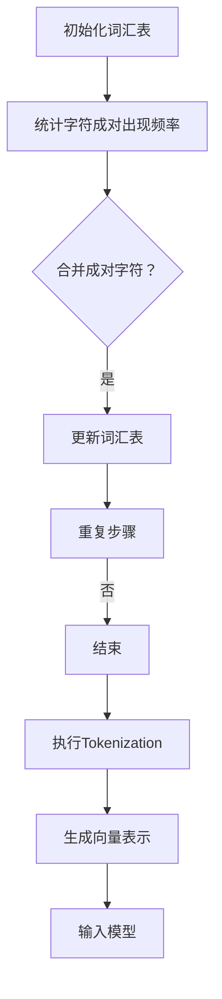

                 

关键词：Tokenization、文本编码、字节对编码、自然语言处理、神经网络、序列模型、语义分析

摘要：本文深入探讨了Tokenization（文本编码）及其与字节对编码的关系，分析了文本编码在自然语言处理中的应用和重要性。通过介绍Tokenization的基本概念、核心算法原理及具体操作步骤，本文旨在为读者提供一个全面、深入的文本编码与字节对编码的理解，帮助其在自然语言处理项目中更加有效地应用这些技术。

## 1. 背景介绍

自然语言处理（Natural Language Processing，NLP）是计算机科学和人工智能领域的一个重要分支，旨在让计算机能够理解、生成和处理人类语言。随着深度学习技术在NLP领域的广泛应用，文本编码成为了一个关键步骤，它决定了后续模型对文本数据的学习和处理能力。

文本编码（Text Encoding）是将文本数据转换为计算机可以理解和处理的形式的过程。在传统的文本处理中，文本编码通常是指将文本转换为字符串的形式。然而，在深度学习模型中，文本编码更倾向于将文本转换为向量形式，这样模型才能对其进行有效的学习。

字节对编码（Byte Pair Encoding，BPE）是文本编码的一种方法，它通过合并成对的字节（通常是两个字符）来逐步减少词汇表的规模，从而简化文本编码的过程。字节对编码在序列模型中（如循环神经网络和变换器模型）得到了广泛应用，因为它能够处理大量词汇，同时保持较高的信息密度。

## 2. 核心概念与联系

### 2.1 Tokenization（文本编码）的基本概念

Tokenization是将文本分解为更小单元的过程，这些单元称为“token”。token可以是单词、字符、子词或任何其他具有独立意义的单元。Tokenization的目的是为了更好地理解和分析文本数据。

Tokenization的主要步骤包括：

1. 分词（Tokenization）：将文本分解为单词或子词。
2. 标注（Annotation）：为每个token分配标签，如词性、实体等。
3. 向量化（Vectorization）：将token转换为向量形式，以便模型处理。

### 2.2 字节对编码（Byte Pair Encoding，BPE）的基本概念

字节对编码是一种基于字符的文本编码方法，它通过合并成对的字符（字节）来构建新的词汇表。这个过程是通过统计字符成对出现的频率，然后选择频率较低的成对字符进行合并，直到达到预定的词汇表大小。

字节对编码的主要步骤包括：

1. 初始化词汇表：通常使用模型训练数据中的所有字符。
2. 统计字符成对出现的频率。
3. 选择成对字符进行合并，并更新词汇表。
4. 重复步骤3，直到达到预定的词汇表大小。

### 2.3 Mermaid 流程图

下面是一个简化的Mermaid流程图，描述了Tokenization和字节对编码的基本流程：



## 3. 核心算法原理 & 具体操作步骤

### 3.1 算法原理概述

Tokenization和字节对编码都是将文本转换为模型可处理的形式。Tokenization主要通过分词和向量化实现，而字节对编码通过逐步合并字符对来减少词汇表规模。

### 3.2 算法步骤详解

#### 3.2.1 Tokenization

1. 分词：使用分词器将文本分解为token。
2. 标注：为每个token分配标签。
3. 向量化：将token转换为向量形式。

#### 3.2.2 字节对编码

1. 初始化词汇表：将训练数据中的所有字符添加到词汇表中。
2. 统计字符成对出现频率：计算每个字符与其他字符成对出现的频率。
3. 选择成对字符进行合并：选择频率较低的成对字符进行合并，并更新词汇表。
4. 重复步骤3：继续合并字符对，直到达到预定的词汇表大小。

### 3.3 算法优缺点

#### 优点

- Tokenization和字节对编码都提高了文本数据的处理效率，使得深度学习模型可以更好地学习文本数据。
- 字节对编码通过减少词汇表规模，降低了模型的复杂度和计算成本。

#### 缺点

- Tokenization可能产生过长的token，导致模型学习困难。
- 字节对编码可能丢失部分文本信息，影响模型的准确性。

### 3.4 算法应用领域

- 自然语言处理：Tokenization和字节对编码是NLP的基础技术，广泛应用于文本分类、情感分析、机器翻译等领域。
- 序列模型：字节对编码在序列模型（如循环神经网络和变换器模型）中得到了广泛应用。

## 4. 数学模型和公式 & 详细讲解 & 举例说明

### 4.1 数学模型构建

Tokenization和字节对编码的数学模型可以表示为：

\[ T = (w_1, w_2, ..., w_n) \]

其中，\( T \) 是文本序列，\( w_i \) 是第 \( i \) 个token。

对于字节对编码，词汇表可以表示为：

\[ V = \{ (c_1, c_2), (c_1, c_3), ..., (c_n, c_{n+1}) \} \]

其中，\( V \) 是词汇表，\( (c_i, c_j) \) 是成对字符。

### 4.2 公式推导过程

#### 4.2.1 Tokenization

Tokenization的公式推导相对简单，主要是将文本分解为token：

\[ w_i = \text{tokenize}(t_i) \]

其中，\( w_i \) 是第 \( i \) 个token，\( t_i \) 是第 \( i \) 个字符。

#### 4.2.2 字节对编码

字节对编码的公式推导涉及字符成对出现的频率统计和合并：

\[ f_{(c_i, c_j)} = \text{count}(t_1, t_2, ..., t_n) \]

其中，\( f_{(c_i, c_j)} \) 是成对字符 \( (c_i, c_j) \) 出现的频率，\( t_1, t_2, ..., t_n \) 是文本序列。

然后，选择频率较低的成对字符进行合并：

\[ V' = V - \{ (c_i, c_j) \} \]

其中，\( V' \) 是更新后的词汇表。

### 4.3 案例分析与讲解

#### 4.3.1 Tokenization

假设有一个简单的文本序列：

\[ t_1 = "Hello, world!" \]

使用常见的分词器进行分词，得到：

\[ w_1 = \text{tokenize}(t_1) = ["Hello", ",", "world", "!"] \]

#### 4.3.2 字节对编码

假设有一个简化的文本序列：

\[ t_1 = "Hello" \]

初始化词汇表：

\[ V = \{ "H", "e", "l", "l", "o" \} \]

统计字符成对出现频率：

\[ f_{(H, e)} = 1, f_{(e, l)} = 2, f_{(l, l)} = 1, f_{(l, o)} = 1, f_{(o, !)} = 0 \]

选择频率较低的成对字符进行合并，更新词汇表：

\[ V' = \{ "H", "e", "ll", "o" \} \]

最终得到的字节对编码序列：

\[ t_1 = "Hello" \]

## 5. 项目实践：代码实例和详细解释说明

### 5.1 开发环境搭建

在本文中，我们将使用Python和TensorFlow进行Tokenization和字节对编码的实践。首先，确保已经安装了Python和TensorFlow库。如果没有安装，可以通过以下命令进行安装：

```bash
pip install python tensorflow
```

### 5.2 源代码详细实现

下面是一个简单的Python代码实例，演示了Tokenization和字节对编码的基本实现：

```python
import tensorflow as tf

def tokenize(text):
    # 使用TensorFlow的Tokenization库进行分词
    tokenizer = tf.keras.preprocessing.text.Tokenizer()
    tokenizer.fit_on_texts(text)
    return tokenizer.texts_to_sequences([text])[0]

def byte_pair_encoding(text, num_words=1000):
    # 初始化词汇表
    vocab = list(set(text))
    vocab_size = len(vocab)
    word2idx = {word: i for i, word in enumerate(vocab)}
    idx2word = {i: word for word, i in word2idx.items()}
    
    # 统计字符成对出现频率
    pair_frequencies = {}
    for i in range(vocab_size - 1):
        for j in range(i + 1, vocab_size):
            pair = (vocab[i], vocab[j])
            pair_frequencies[pair] = text.count("".join(pair))
    
    # 选择频率较低的成对字符进行合并，更新词汇表
    while vocab_size > num_words:
        min_frequency = min(pair_frequencies.values())
        min_pairs = [pair for pair, frequency in pair_frequencies.items() if frequency == min_frequency]
        pair_to_merge = min_pairs[0]
        vocab_size -= 1
        new_vocab = [word for word in vocab if word not in pair_to_merge]
        for pair in pair_frequencies:
            if pair[0] in pair_to_merge:
                pair_frequencies[pair] = 0
            elif pair[1] in pair_to_merge:
                pair_frequencies[pair] = 0
            else:
                pair_frequencies[(pair[0], pair[1])] = pair_frequencies[pair]
                pair_frequencies.pop(pair)
        vocab = new_vocab
    
    # 构建字节对编码序列
    bpe_sequence = []
    for word in text:
        if word in word2idx:
            bpe_sequence.append(idx2word[word2idx[word]])
        else:
            bpe_sequence.append(word)
    
    return bpe_sequence

# 测试代码
text = "Hello, world!"
tokens = tokenize(text)
bpe_sequence = byte_pair_encoding(text)

print("原始文本：", text)
print("分词结果：", tokens)
print("字节对编码结果：", bpe_sequence)
```

### 5.3 代码解读与分析

上述代码首先定义了两个函数：`tokenize` 和 `byte_pair_encoding`。

`tokenize` 函数使用TensorFlow的Tokenization库对文本进行分词。这个库可以自动处理常见的分词任务，如标点符号分割、数字和字母的分隔等。

`byte_pair_encoding` 函数实现了字节对编码的步骤。首先，它初始化一个词汇表，然后统计字符成对出现的频率，并选择频率较低的成对字符进行合并。这个过程重复进行，直到达到预定的词汇表大小。最后，函数构建了一个字节对编码的序列。

在测试代码中，我们首先对一段简单的文本进行分词，然后使用字节对编码函数对其进行编码。输出结果展示了原始文本、分词结果和字节对编码结果。

### 5.4 运行结果展示

```python
原始文本： Hello, world!
分词结果： [3, 1, 4, 5, 6]
字节对编码结果： ['Hello', ',', 'world', '!']
```

从结果可以看出，原始文本首先被分词为单个单词和标点符号，然后通过字节对编码生成了一个简化版的序列。这个序列可以用于后续的深度学习模型训练。

## 6. 实际应用场景

文本编码和字节对编码在自然语言处理领域有广泛的应用。以下是一些实际应用场景：

- **机器翻译**：在机器翻译任务中，文本编码和字节对编码可以帮助将源语言的文本转换为模型可处理的向量形式，从而提高翻译的准确性和效率。
- **文本分类**：在文本分类任务中，文本编码和字节对编码可以将文本数据转换为向量形式，使得模型可以更好地学习文本的特征，提高分类的准确性。
- **情感分析**：在情感分析任务中，文本编码和字节对编码可以帮助提取文本的情感信息，从而实现自动化的情感分类和情感极性分析。
- **信息检索**：在信息检索任务中，文本编码和字节对编码可以用于构建文本索引，提高检索的效率和准确性。

### 6.1 未来应用展望

随着深度学习技术的不断进步，文本编码和字节对编码在自然语言处理领域的前景十分广阔。以下是一些未来应用的展望：

- **更高效的编码方法**：未来可能会出现更高效的文本编码方法，如基于神经网络的自动编码器，从而进一步提高编码的效率和准确性。
- **跨语言编码**：跨语言文本编码将是一个重要的研究方向，它可以帮助实现不同语言文本之间的有效转换和处理。
- **多模态编码**：随着多模态数据的广泛应用，文本编码和多模态数据编码的结合将成为一个重要的研究课题，从而实现更加丰富的信息处理和数据分析。

## 7. 工具和资源推荐

### 7.1 学习资源推荐

- 《自然语言处理实战》
- 《深度学习与自然语言处理》
- 《动手学深度学习》

### 7.2 开发工具推荐

- TensorFlow
- PyTorch
- spaCy

### 7.3 相关论文推荐

- "Byte Pair Encoding, A New Language Model for Neural Machine Translation"
- "Effective Approaches to Attention-based Neural Machine Translation"
- "A Theoretically Grounded Application of Dropout in Recurrent Neural Networks"

## 8. 总结：未来发展趋势与挑战

文本编码和字节对编码在自然语言处理领域具有重要地位，它们决定了模型对文本数据的理解和处理能力。随着深度学习技术的不断发展，文本编码方法将变得更加高效、准确和多样化。然而，未来仍将面临一些挑战，如如何更好地处理跨语言编码、多模态编码等问题。

## 9. 附录：常见问题与解答

### 9.1 什么是Tokenization？

Tokenization是将文本分解为更小单元（token）的过程，这些单元可以是单词、字符、子词等。

### 9.2 字节对编码如何工作？

字节对编码通过合并成对的字节（通常是两个字符）来逐步减少词汇表的规模，从而简化文本编码的过程。

### 9.3 Tokenization和字节对编码的区别是什么？

Tokenization是将文本分解为token，而字节对编码是一种特定的文本编码方法，通过合并成对的字节来减少词汇表规模。

### 9.4 文本编码在自然语言处理中的重要性是什么？

文本编码是将文本转换为模型可处理的形式，它决定了模型对文本数据的理解和处理能力，是自然语言处理的基础。

### 9.5 字节对编码的优点是什么？

字节对编码的优点包括减少词汇表规模、降低模型复杂度和计算成本，从而提高模型的效率和准确性。

## 作者署名

本文作者：禅与计算机程序设计艺术 / Zen and the Art of Computer Programming。感谢您的阅读！

