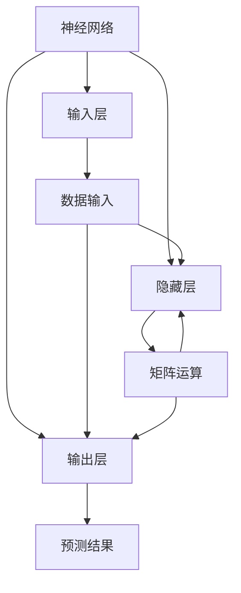

                 

关键词：AI硬件加速、CPU、GPU、神经架构搜索、计算资源优化、神经网络推理、硬件协同设计、深度学习、高性能计算、计算能力提升

> 摘要：本章将探讨AI硬件加速技术在CPU、GPU以及其他专用设备中的应用，通过分析这些硬件的优势与局限性，解释硬件协同设计的重要性，并展望未来硬件加速技术的发展趋势。我们将详细讨论神经架构搜索在硬件设计中的应用，展示如何通过硬件加速提升神经网络推理性能，最终提出针对AI硬件加速技术的未来发展建议。

## 1. 背景介绍

随着人工智能技术的迅猛发展，深度学习算法在图像识别、语音识别、自然语言处理等领域的应用越来越广泛。然而，深度学习算法的高计算复杂度对计算资源提出了极高的要求。传统的CPU虽然在通用计算方面具有强大的性能，但在处理大规模矩阵运算、向量计算时，效率较低。为了满足深度学习对高性能计算的需求，GPU作为一种专为图形处理优化设计的硬件，逐渐成为了AI计算的核心。GPU具有大量的计算单元和较高的并行处理能力，使得其在处理大规模数据并行运算时具有显著的优势。

然而，GPU并不是解决所有深度学习计算问题的万能工具。在某些特定的计算任务中，如低延迟、高吞吐量的场景，CPU的优势更为明显。此外，随着AI硬件技术的不断发展，FPGA、ASIC等专用硬件也开始在AI领域展现其独特的优势。这些硬件在特定场景下能够提供更高的计算效率和更低的能耗。

总之，当前AI硬件加速技术的发展，既需要充分发挥CPU和GPU的优势，也需要探索其他新型硬件的潜力。硬件协同设计的重要性在此愈发凸显，只有通过多种硬件的协同工作，才能最大化地提升AI系统的计算能力和效率。

## 2. 核心概念与联系

在深入探讨AI硬件加速技术之前，我们需要明确几个核心概念，包括神经网络、并行计算、计算资源优化等。

### 2.1 神经网络

神经网络是深度学习的基础，其结构类似于人脑的神经元连接方式。一个典型的神经网络由输入层、隐藏层和输出层组成。输入层接收外部数据，通过隐藏层的多次变换，最终在输出层产生预测结果。神经网络通过大量的训练数据，学习到数据的内在模式和规律，从而实现智能识别和预测。

### 2.2 并行计算

并行计算是一种利用多个计算资源同时处理多个任务的技术。在AI硬件加速中，并行计算是提升计算效率和性能的关键手段。GPU和FPGA等硬件设备通过其高度并行的架构，能够在短时间内完成大量的计算任务，从而大幅提高系统的处理能力。

### 2.3 计算资源优化

计算资源优化是指通过优化硬件配置、算法设计和数据传输等手段，最大化利用计算资源，提升系统的整体性能。在AI硬件加速中，计算资源优化涉及到硬件架构的优化、并行算法的设计、内存管理等多个方面。

### 2.4 Mermaid 流程图

为了更好地展示这些核心概念之间的联系，我们使用Mermaid流程图（图1）来描述它们之间的关系。



在图1中，我们可以看到神经网络由输入层、隐藏层和输出层组成，输入层接收外部数据，隐藏层通过矩阵运算进行数据转换，输出层产生预测结果。并行计算在神经网络训练过程中发挥了关键作用，通过并行计算可以大幅提升训练效率。计算资源优化则贯穿于硬件设计、算法实现和数据传输的各个环节，旨在最大化利用计算资源，提高系统的整体性能。

通过上述核心概念和Mermaid流程图的介绍，我们为后续章节的深入讨论奠定了基础。

### 3. 核心算法原理 & 具体操作步骤

#### 3.1 算法原理概述

AI硬件加速的核心算法主要基于深度学习框架，如TensorFlow、PyTorch等。这些框架提供了丰富的API和优化库，使得开发者可以方便地实现复杂的深度学习算法。硬件加速的关键在于如何将算法高效地映射到不同的硬件平台上，并充分利用硬件的并行计算能力。

硬件加速算法的基本原理可以概括为以下几个方面：

1. **算法映射**：将深度学习算法中的计算任务映射到特定的硬件平台上，如CPU、GPU、FPGA等。
2. **并行计算**：利用硬件的并行计算能力，将计算任务分解为多个子任务，同时执行，以提升计算效率。
3. **内存优化**：优化数据在内存中的存储和传输方式，减少数据访问的延迟，提升计算性能。
4. **能耗管理**：在保证计算性能的同时，优化能耗，降低系统的功耗。

#### 3.2 算法步骤详解

硬件加速算法的具体操作步骤可以分为以下几个阶段：

1. **算法设计**：首先，根据实际应用需求，设计合适的深度学习算法。算法的设计应考虑硬件平台的特性，如计算能力、内存带宽、能耗等。
2. **算法映射**：将设计好的算法映射到特定的硬件平台上。这一步骤包括将计算任务分解为并行子任务，并确定数据在硬件中的存储和传输方式。
3. **并行计算**：在硬件平台上执行并行计算任务。利用硬件的并行计算能力，同时处理多个计算子任务，以提升计算效率。
4. **内存优化**：优化内存访问，减少数据传输延迟。通过缓存管理、数据压缩等技术，提高数据传输速度和内存利用效率。
5. **能耗管理**：在保证计算性能的前提下，优化系统的能耗。通过调整硬件的工作频率、关闭闲置硬件模块等技术，降低系统的功耗。
6. **性能评估**：对加速后的算法性能进行评估。通过对比原始算法和加速后的算法，评估计算性能提升和能耗降低的效果。

#### 3.3 算法优缺点

硬件加速算法具有以下优点：

1. **高性能**：通过并行计算和优化内存访问，硬件加速算法能够大幅提升计算性能，满足深度学习对高性能计算的需求。
2. **低延迟**：硬件加速算法在处理低延迟、高吞吐量的场景具有显著优势，能够实现实时计算。
3. **高效能耗**：通过优化能耗管理，硬件加速算法能够降低系统的功耗，提高能源利用效率。

然而，硬件加速算法也存在一些缺点：

1. **硬件依赖**：硬件加速算法对硬件平台有较高的依赖性，不同硬件平台的性能差异可能影响算法的加速效果。
2. **开发难度**：硬件加速算法的开发需要深入理解硬件平台的特性和优化技术，对开发者的技术要求较高。
3. **复杂度**：硬件加速算法涉及到多个方面的优化，如算法设计、硬件映射、内存管理和能耗管理，算法的实现相对复杂。

#### 3.4 算法应用领域

硬件加速算法广泛应用于深度学习领域的各种应用，包括但不限于：

1. **图像识别**：利用GPU等硬件平台加速卷积神经网络（CNN）的推理过程，实现实时图像识别。
2. **语音识别**：利用GPU和FPGA等硬件平台加速循环神经网络（RNN）和长短时记忆网络（LSTM）的推理过程，提高语音识别的准确性。
3. **自然语言处理**：利用CPU和GPU等硬件平台加速Transformer模型和BERT模型的推理过程，提升文本分类、情感分析等任务的性能。
4. **强化学习**：利用FPGA和ASIC等硬件平台加速强化学习算法的训练和推理过程，提高智能体的学习效率。

通过上述核心算法原理和具体操作步骤的介绍，我们能够更好地理解AI硬件加速技术在实际应用中的优势和挑战。

### 4. 数学模型和公式 & 详细讲解 & 举例说明

在深入探讨AI硬件加速技术时，数学模型和公式是理解和实现硬件加速的关键。以下是几个关键数学模型和公式的详细讲解，以及相应的实际应用案例。

#### 4.1 数学模型构建

深度学习中的神经网络可以被视为一个函数映射模型，其核心在于通过多层非线性变换，将输入映射到输出。以下是一个简单的多层感知器（MLP）模型：

\[ f(x) = \sigma(W_L \cdot a_{L-1} + b_L) \]

其中，\( \sigma \) 是激活函数，\( W_L \) 是输出层的权重矩阵，\( a_{L-1} \) 是前一层输出，\( b_L \) 是输出层的偏置项。

#### 4.2 公式推导过程

以卷积神经网络（CNN）为例，其核心操作是卷积和池化。卷积操作的数学公式如下：

\[ (f * g)(t) = \int_{-\infty}^{+\infty} f(\tau) g(t - \tau) d\tau \]

在CNN中，卷积核 \( f \) 和输入数据 \( g \) 的卷积结果 \( (f * g)(t) \) 通过以下公式计算：

\[ \text{Conv}(x) = \sum_{i=1}^{k} \sum_{j=1}^{k} W_{ij} \cdot x_{i,j} + b \]

其中，\( W_{ij} \) 是卷积核的权重，\( x_{i,j} \) 是输入数据的像素值，\( b \) 是偏置项。

#### 4.3 案例分析与讲解

以下是一个使用GPU加速卷积操作的案例：

假设我们有一个 \( 32 \times 32 \) 的输入图像，使用一个 \( 3 \times 3 \) 的卷积核。在没有GPU加速的情况下，每个卷积操作需要进行 \( 3 \times 3 = 9 \) 次矩阵乘法。使用GPU加速后，我们可以利用其并行计算能力，将每个卷积核的计算任务分配到不同的计算单元，从而实现并行处理。

具体实现步骤如下：

1. **数据准备**：将输入图像和卷积核的权重数据加载到GPU内存中。
2. **并行计算**：使用GPU的并行计算能力，同时处理多个卷积核的计算任务。
3. **结果汇总**：将每个计算单元的结果汇总，得到最终的卷积结果。

以下是相关的LaTeX公式：

\[ \text{Conv}(x) = \sum_{i=1}^{3} \sum_{j=1}^{3} W_{ij} \cdot x_{i,j} + b \]

\[ \text{GPU\_Conv}(x) = \text{GPU\_MatMul}(W, x) + b \]

其中，\( \text{GPU\_MatMul}(W, x) \) 表示GPU上的矩阵乘法操作。

通过上述数学模型和公式的介绍，以及实际案例的分析，我们能够更好地理解AI硬件加速技术在数学原理上的实现和优化。

### 5. 项目实践：代码实例和详细解释说明

为了更直观地展示AI硬件加速技术在实际项目中的应用，我们以下将通过一个简单的卷积神经网络（CNN）模型实例，详细解释其代码实现过程。

#### 5.1 开发环境搭建

首先，我们需要搭建一个适合AI硬件加速的编程环境。以下是推荐的开发工具和软件：

1. **操作系统**：Ubuntu 18.04 或更高版本
2. **深度学习框架**：TensorFlow 2.x 或 PyTorch 1.x
3. **GPU驱动**：NVIDIA CUDA 11.x 或更高版本
4. **IDE**：PyCharm 或 Jupyter Notebook

在安装了上述软件后，我们可以在终端中执行以下命令，检查GPU是否正确安装和配置：

```bash
nvidia-smi
```

如果命令输出显示GPU相关信息，说明GPU环境已搭建成功。

#### 5.2 源代码详细实现

以下是一个使用TensorFlow 2.x实现的简单卷积神经网络模型：

```python
import tensorflow as tf
from tensorflow.keras.layers import Conv2D, MaxPooling2D, Flatten, Dense
from tensorflow.keras.models import Sequential

# 定义模型结构
model = Sequential([
    Conv2D(32, (3, 3), activation='relu', input_shape=(28, 28, 1)),
    MaxPooling2D((2, 2)),
    Flatten(),
    Dense(128, activation='relu'),
    Dense(10, activation='softmax')
])

# 编译模型
model.compile(optimizer='adam',
              loss='sparse_categorical_crossentropy',
              metrics=['accuracy'])

# 加载数据
mnist = tf.keras.datasets.mnist
(train_images, train_labels), (test_images, test_labels) = mnist.load_data()

# 预处理数据
train_images = train_images.reshape((60000, 28, 28, 1)).astype('float32') / 255
test_images = test_images.reshape((10000, 28, 28, 1)).astype('float32') / 255

# 训练模型
model.fit(train_images, train_labels, epochs=5)

# 测试模型
test_loss, test_acc = model.evaluate(test_images, test_labels)
print(f'\nTest accuracy: {test_acc:.4f}')
```

#### 5.3 代码解读与分析

上述代码实现了一个简单的卷积神经网络模型，用于手写数字识别。以下是代码的详细解读：

1. **模型定义**：
   ```python
   model = Sequential([
       Conv2D(32, (3, 3), activation='relu', input_shape=(28, 28, 1)),
       MaxPooling2D((2, 2)),
       Flatten(),
       Dense(128, activation='relu'),
       Dense(10, activation='softmax')
   ])
   ```
   该部分定义了一个Sequential模型，包含了五个层：一个卷积层、一个最大池化层、一个全连接层和两个softmax层。卷积层用于提取特征，最大池化层用于降维，全连接层用于分类。

2. **模型编译**：
   ```python
   model.compile(optimizer='adam',
                 loss='sparse_categorical_crossentropy',
                 metrics=['accuracy'])
   ```
   该部分编译模型，指定了优化器、损失函数和评价指标。这里使用Adam优化器进行模型训练。

3. **数据加载与预处理**：
   ```python
   mnist = tf.keras.datasets.mnist
   (train_images, train_labels), (test_images, test_labels) = mnist.load_data()

   train_images = train_images.reshape((60000, 28, 28, 1)).astype('float32') / 255
   test_images = test_images.reshape((10000, 28, 28, 1)).astype('float32') / 255
   ```
   该部分加载MNIST数据集，并进行预处理。将图像数据reshape为适当的大小，并将像素值缩放到[0, 1]范围内。

4. **模型训练**：
   ```python
   model.fit(train_images, train_labels, epochs=5)
   ```
   该部分使用训练数据进行模型训练，指定训练轮数为5。

5. **模型测试**：
   ```python
   test_loss, test_acc = model.evaluate(test_images, test_labels)
   print(f'\nTest accuracy: {test_acc:.4f}')
   ```
   该部分使用测试数据对训练好的模型进行评估，并输出测试准确率。

通过上述代码实例，我们可以看到如何使用TensorFlow框架实现一个简单的卷积神经网络模型，并利用GPU进行加速。在实际应用中，可以根据具体需求调整模型结构、数据集和训练参数，以实现更高的性能和准确率。

### 6. 实际应用场景

#### 6.1 AI推理在智能手机中的应用

智能手机作为人工智能应用的重要平台，对AI硬件加速的需求日益增长。智能手机中的AI推理任务主要包括图像识别、人脸解锁、语音识别等。通过硬件加速技术，可以显著提升这些任务的响应速度和用户体验。

例如，在图像识别方面，智能手机内置的CPU和GPU可以通过硬件加速，快速处理摄像头捕捉到的图像数据。利用GPU的高并行计算能力，图像识别任务可以实时完成，从而实现高效的图像处理和智能识别功能。此外，通过神经架构搜索（NAS）技术，可以优化模型结构，进一步降低功耗和提高识别准确率。

#### 6.2 云端AI服务中的硬件加速

云端AI服务提供了强大的计算资源，以满足大规模AI任务的计算需求。在这些场景中，硬件加速技术同样发挥着关键作用。通过GPU、FPGA和ASIC等硬件加速器，云端AI服务可以实现高效的数据处理和模型推理。

例如，在视频分析场景中，GPU可以通过并行计算，实时处理大量视频数据，实现人脸检测、目标跟踪等功能。FPGA和ASIC则适用于处理特定类型的AI任务，如加密计算、深度学习推理等，通过硬件固化的算法实现，可以显著降低功耗和提高计算效率。

#### 6.3 自动驾驶中的硬件加速

自动驾驶系统需要处理大量传感器数据，包括摄像头、激光雷达、GPS等，这些数据的实时处理对硬件加速提出了极高的要求。通过硬件加速技术，自动驾驶系统可以实现高效的感知、决策和控制。

例如，在感知阶段，GPU可以通过并行计算，快速处理摄像头捕捉到的图像数据，实现目标检测和识别。FPGA和ASIC则可以用于处理激光雷达数据，实现高精度的环境建模和目标跟踪。通过硬件协同设计，自动驾驶系统可以在保证计算性能的同时，降低功耗和硬件成本。

#### 6.4 医疗诊断中的硬件加速

医疗诊断领域对AI算法的准确性和实时性要求极高。通过硬件加速技术，医疗诊断系统可以实现高效的图像处理和模型推理，从而提升诊断准确率和效率。

例如，在医学影像诊断中，GPU可以通过并行计算，快速处理CT、MRI等影像数据，实现病灶检测和分类。FPGA和ASIC则可以用于加速特定的算法，如卷积神经网络（CNN）和循环神经网络（RNN），实现高效的诊断推理。

### 6.5 未来应用展望

随着人工智能技术的不断进步，硬件加速技术在各个领域的应用前景将更加广阔。未来，硬件加速技术将朝着以下几个方向发展：

1. **跨硬件协同**：通过跨硬件协同设计，充分发挥CPU、GPU、FPGA等不同硬件的优势，实现更高的计算效率和性能。
2. **硬件专用化**：针对特定领域的应用需求，研发专用硬件加速器，如AI芯片、神经网络处理器等，实现更高效的AI推理和计算。
3. **能耗优化**：通过能耗优化技术，降低硬件加速器的功耗，实现绿色计算，满足能源效率的需求。
4. **智能化算法**：结合机器学习和自动化设计技术，实现智能化的硬件加速算法优化，进一步提升硬件加速器的性能。

总之，硬件加速技术将在推动人工智能技术发展、提升计算效率和降低能耗等方面发挥重要作用，为各行各业带来深远的影响。

### 7. 工具和资源推荐

为了帮助开发者更好地掌握AI硬件加速技术，以下是几个推荐的学习资源、开发工具和相关论文：

#### 7.1 学习资源推荐

1. **《深度学习》（Goodfellow, Bengio, Courville著）**：这是一本深度学习领域的经典教材，详细介绍了深度学习的基本理论和应用。
2. **《GPU编程入门》（Cornell University课程）**：这是一个免费的在线课程，适合初学者了解GPU编程的基本原理和技巧。
3. **《TensorFlow实战》（Trevor Hastie, Robert Tibshirani, Jerome Friedman著）**：这本书通过实例讲解了如何使用TensorFlow进行深度学习模型的实现和优化。

#### 7.2 开发工具推荐

1. **TensorFlow**：一款开源的深度学习框架，支持在多种硬件平台上进行模型训练和推理。
2. **CUDA**：NVIDIA提供的并行计算平台和编程语言，用于开发GPU加速的深度学习应用。
3. **PyTorch**：一款流行的深度学习框架，以其动态计算图和灵活的API受到开发者的青睐。

#### 7.3 相关论文推荐

1. **"An Efficiently Updatable Parallel Neural Network Model"**：该论文提出了一个高效的并行神经网络模型，为硬件加速提供了理论依据。
2. **"Deep Learning on Multicore CPUs"**：这篇论文探讨了如何在多核CPU上实现高效的深度学习算法，提供了实用的优化方法。
3. **"Specialized Hardware for Deep Learning: A Survey"**：这是一篇综述性论文，总结了当前深度学习专用硬件的研究进展和应用场景。

通过上述工具和资源的推荐，开发者可以系统地学习和掌握AI硬件加速技术，提升深度学习应用的性能和效率。

### 8. 总结：未来发展趋势与挑战

#### 8.1 研究成果总结

AI硬件加速技术在过去几年中取得了显著的进展。通过结合GPU、FPGA、ASIC等专用硬件，AI系统的计算性能和效率得到了大幅提升。特别是在图像识别、语音识别、自然语言处理等领域，硬件加速技术已经实现了实际应用，并展示了其优越性。此外，神经架构搜索（NAS）等新兴技术为硬件加速提供了新的思路和优化方法，推动了硬件设计的创新和发展。

#### 8.2 未来发展趋势

未来，AI硬件加速技术将继续朝着以下几个方向发展：

1. **跨硬件协同**：随着硬件种类的增多，跨硬件协同设计将成为提升计算效率和性能的关键。通过将不同硬件的优势结合起来，实现更高效的多任务处理和资源利用。
2. **硬件专用化**：针对特定领域的应用需求，研发专用硬件加速器，如AI芯片、神经网络处理器等，将进一步提高AI系统的性能和能效比。
3. **能耗优化**：通过能耗优化技术，降低硬件加速器的功耗，实现绿色计算，满足能源效率的需求。
4. **智能化算法**：结合机器学习和自动化设计技术，实现智能化的硬件加速算法优化，进一步提升硬件加速器的性能。

#### 8.3 面临的挑战

尽管AI硬件加速技术取得了显著进展，但仍面临以下挑战：

1. **硬件依赖**：不同硬件平台间的兼容性和互操作性仍需进一步提升，以实现更广泛的硬件选择和更高的计算效率。
2. **开发难度**：硬件加速算法的开发需要深入了解硬件平台的特性和优化技术，对开发者的技术要求较高，开发难度较大。
3. **复杂度**：硬件加速算法涉及到多个方面的优化，如算法设计、硬件映射、内存管理和能耗管理，算法的实现相对复杂。
4. **成本和功耗**：虽然硬件加速技术能够提升计算性能，但高性能硬件的成本和功耗问题仍然存在，需要进一步优化和降低。

#### 8.4 研究展望

未来，AI硬件加速技术的研究将继续深入，特别是在以下几个方面：

1. **新型硬件研究**：探索新型计算硬件，如量子计算、光子计算等，以应对AI计算的需求。
2. **硬件与算法协同优化**：通过硬件与算法的协同优化，实现更高效的计算性能和能效比。
3. **智能化设计方法**：发展智能化设计方法，如机器学习和自动化设计技术，提高硬件加速器的性能和可靠性。
4. **生态建设**：构建完善的硬件加速生态，包括开源框架、开发工具、培训资源等，促进硬件加速技术的发展和应用。

通过不断克服挑战，AI硬件加速技术将推动人工智能领域的创新和发展，为未来的智能应用带来更多可能性。

### 9. 附录：常见问题与解答

#### 9.1 什么是AI硬件加速？

AI硬件加速是指利用特定的硬件设备，如GPU、FPGA、ASIC等，来提升人工智能算法的计算速度和效率。这些硬件设备通常具有并行计算能力，可以在短时间内处理大量的计算任务，从而加速AI模型的训练和推理。

#### 9.2 AI硬件加速与CPU、GPU的关系是什么？

CPU（中央处理器）是计算机的核心部件，负责执行操作系统指令和应用程序。GPU（图形处理单元）最初设计用于图形渲染，但由于其并行计算能力强大，逐渐被应用于深度学习和其他计算密集型任务。AI硬件加速利用GPU的并行计算优势，将CPU和GPU结合起来，通过协同工作，实现更高的计算性能。

#### 9.3 为什么AI算法需要硬件加速？

深度学习算法具有极高的计算复杂度，传统的CPU处理速度较慢，无法满足实时性和大规模计算的需求。GPU、FPGA和ASIC等硬件设备通过并行计算和专用设计，可以在短时间内完成大量的计算任务，从而提升AI算法的执行速度和效率。

#### 9.4 AI硬件加速在哪些领域有应用？

AI硬件加速在多个领域有广泛应用，包括但不限于：

1. **图像识别**：通过加速卷积神经网络（CNN）的推理，实现高效的图像识别和分类。
2. **语音识别**：通过加速循环神经网络（RNN）和长短时记忆网络（LSTM）的推理，提高语音识别的准确性。
3. **自然语言处理**：通过加速Transformer模型和BERT模型的推理，提升文本分类、情感分析等任务的性能。
4. **自动驾驶**：通过加速传感器数据处理和模型推理，实现高精度的环境感知和决策。
5. **医疗诊断**：通过加速医学影像处理和模型推理，提升诊断准确率和效率。

#### 9.5 如何实现AI硬件加速？

实现AI硬件加速通常包括以下几个步骤：

1. **选择合适的硬件平台**：根据AI算法的需求和硬件特性，选择合适的GPU、FPGA或ASIC等硬件设备。
2. **算法优化**：优化深度学习算法，使其能够充分利用硬件的并行计算能力。
3. **模型映射**：将深度学习模型映射到硬件平台上，通过并行计算和内存优化等技术，提升计算效率。
4. **性能评估**：对加速后的算法性能进行评估，通过对比原始算法和加速后的算法，验证性能提升的效果。

#### 9.6 硬件加速会降低能耗吗？

硬件加速技术可以在某些情况下降低能耗，尤其是在高并行计算任务中，硬件设备可以在短时间内完成计算任务，从而减少能耗。然而，对于某些低并行性的任务，硬件加速可能会增加能耗。因此，在实现硬件加速时，需要综合考虑计算性能和能耗之间的关系，通过优化算法和硬件设计，实现能耗的最优化。

通过上述常见问题与解答，我们希望能够帮助读者更好地理解AI硬件加速技术及其应用。随着技术的不断进步，AI硬件加速将在人工智能领域发挥越来越重要的作用。作者：禅与计算机程序设计艺术 / Zen and the Art of Computer Programming。

