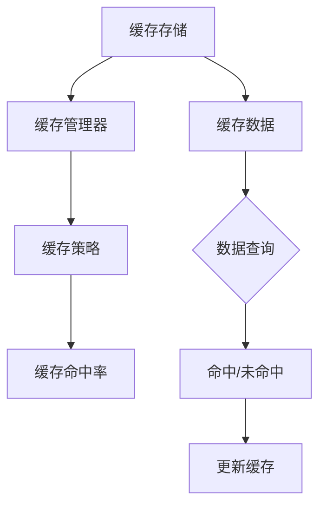

                 

关键词：推理加速、键值缓存、kv-cache、算法原理、应用领域、代码实例

> 摘要：本文将深入探讨键值缓存（kv-cache）在推理加速中的应用。首先，我们将介绍键值缓存的基本概念和原理，随后分析其核心算法及其实现步骤，并通过具体实例说明其优缺点和应用领域。此外，本文还将介绍数学模型和公式，并提供代码实现和详细解释。最后，我们将探讨键值缓存在实际应用场景中的表现，以及未来发展的趋势和挑战。

## 1. 背景介绍

随着人工智能技术的发展，越来越多的应用场景对实时性提出了更高的要求。推理加速成为了一个关键问题。在深度学习中，模型的推理过程往往是一个计算密集型的任务，需要大量的计算资源和时间。为了提高推理速度，减少延迟，各种加速技术被提出来。其中，键值缓存（kv-cache）作为一种有效的技术手段，被广泛应用于推理加速领域。

键值缓存是一种简单而高效的数据存储结构，它通过将数据以键值对的形式存储，从而实现快速的数据访问。在推理过程中，经常需要访问相同的数据，例如模型的参数、中间结果等。通过使用键值缓存，我们可以将经常访问的数据预先加载到缓存中，从而减少数据访问的延迟，提高推理速度。

## 2. 核心概念与联系

### 2.1 键值缓存的基本概念

键值缓存是一种基于键值对（key-value pair）的数据存储结构，它由一组键值对组成，每个键值对都存储了一条数据。键值缓存的特点是数据访问速度快，查询效率高。

在键值缓存中，键（key）用于唯一标识一条数据，而值（value）则是实际存储的数据内容。键值缓存通过哈希表或B树等数据结构来实现，使得数据查询和插入操作能够在常数时间内完成。

### 2.2 键值缓存的架构

键值缓存的架构主要包括以下几个部分：

- **缓存存储**：用于存储缓存数据，可以是内存、硬盘等。
- **缓存管理器**：负责缓存数据的加载、存储、更新和删除等操作。
- **缓存策略**：决定缓存数据的策略，例如LRU（Least Recently Used）策略、LFU（Least Frequently Used）策略等。
- **缓存命中率**：衡量缓存的有效性，即命中缓存的数据与总访问数据的比值。

### 2.3 Mermaid 流程图



### 2.4 键值缓存与推理加速的联系

键值缓存与推理加速的关系在于，它能够提高数据访问速度，从而减少推理时间。在深度学习模型中，经常需要访问大量的参数和数据。通过使用键值缓存，我们可以将这些数据预先加载到缓存中，使得在推理过程中能够快速访问，从而加速推理过程。

## 3. 核心算法原理 & 具体操作步骤

### 3.1 算法原理概述

键值缓存的核心算法原理是利用哈希表或B树等数据结构，实现快速的数据访问和更新。具体来说，键值缓存通过哈希函数将键映射到哈希值，进而定位到对应的数据存储位置。如果发生哈希冲突，则通过链表或开地址法等方法解决。

### 3.2 算法步骤详解

1. **初始化缓存**：初始化缓存数据结构，包括哈希表或B树等。
2. **插入数据**：将键值对插入到缓存中。通过哈希函数计算键的哈希值，定位到数据存储位置，插入键值对。
3. **查询数据**：根据键查询缓存中的数据。通过哈希函数计算键的哈希值，定位到数据存储位置，返回对应的数据。
4. **更新数据**：更新缓存中的数据。通过哈希函数计算键的哈希值，定位到数据存储位置，更新对应的数据。
5. **删除数据**：从缓存中删除数据。通过哈希函数计算键的哈希值，定位到数据存储位置，删除对应的键值对。
6. **缓存策略**：根据缓存策略（如LRU、LFU等）更新缓存数据，保持缓存命中率。

### 3.3 算法优缺点

#### 优点：

- **高效的数据访问**：通过哈希表或B树等数据结构，实现快速的数据查询、插入和更新操作。
- **灵活的缓存策略**：可以根据不同的应用场景选择合适的缓存策略，提高缓存命中率。
- **内存占用较小**：相对于其他缓存技术（如LRU队列），键值缓存占用内存较小。

#### 缺点：

- **缓存污染问题**：当缓存中的数据不再被频繁访问时，可能导致缓存污染，降低缓存命中率。
- **缓存一致性问题**：在多线程环境中，缓存的一致性需要额外的同步机制，可能增加系统的复杂性。

### 3.4 算法应用领域

键值缓存广泛应用于各种领域，包括：

- **深度学习推理加速**：通过缓存模型参数和中间结果，减少数据访问延迟，提高推理速度。
- **数据库查询优化**：缓存常用的查询结果，减少数据库访问次数，提高查询效率。
- **Web缓存**：缓存网页内容，减少网络延迟，提高用户访问速度。
- **缓存一致性协议**：在分布式系统中，通过缓存一致性协议实现数据的一致性。

## 4. 数学模型和公式 & 详细讲解 & 举例说明

### 4.1 数学模型构建

键值缓存的主要数学模型包括哈希函数和缓存策略。

#### 哈希函数：

哈希函数是将键映射到哈希值的过程。常见的哈希函数有：

- **除余法**：\( h(k) = k \mod m \)，其中 \( k \) 是键，\( m \) 是哈希表的大小。
- **平方取中法**：\( h(k) = (a \cdot k + b) \mod m \)，其中 \( a \) 和 \( b \) 是常数。

#### 缓存策略：

常见的缓存策略有：

- **LRU（Least Recently Used）**：最近最少使用策略，根据数据访问的频率进行缓存管理。
- **LFU（Least Frequently Used）**：最近最少使用策略，根据数据访问的频率进行缓存管理。

### 4.2 公式推导过程

#### 哈希函数的推导：

以除余法为例，给定一个键 \( k \) 和一个哈希表大小 \( m \)，哈希函数为：

\[ h(k) = k \mod m \]

假设 \( m = p \cdot q \)，其中 \( p \) 和 \( q \) 是互质的质数。则：

\[ k \mod m = (k \mod p) \cdot q + (k \mod q) \]

由于 \( p \) 和 \( q \) 是互质的，\( k \mod p \) 和 \( k \mod q \) 是独立的。因此，\( h(k) = k \mod m \) 是一个良好的哈希函数。

#### LRU策略的推导：

给定一个缓存大小 \( n \)，缓存中的数据按照访问时间进行排序。当需要缓存新的数据时，将新数据插入到缓存队列的末尾。如果缓存已满，则删除队列头的数据，即最近最少使用的数据。

假设当前缓存中有 \( n-1 \) 个数据，新数据为 \( x \)。则：

- 将 \( x \) 插入到缓存队列的末尾。
- 如果缓存已满，则删除队列头的数据。

### 4.3 案例分析与讲解

#### 案例一：使用除余法哈希函数的缓存系统

假设缓存大小为 \( m = 10 \)，给定一个键 \( k = 47 \)。使用除余法哈希函数计算 \( h(k) \)：

\[ h(k) = k \mod m = 47 \mod 10 = 7 \]

因此，键 \( k = 47 \) 被映射到哈希表的位置 7。

#### 案例二：使用LRU策略的缓存系统

假设缓存大小为 \( n = 3 \)，缓存中的数据按照访问时间排序，当前缓存中的数据为 \( [1, 2, 3] \)。当访问数据 \( x = 4 \) 时，根据LRU策略，将 \( x \) 插入到缓存队列的末尾，得到新的缓存队列 \( [1, 2, 3, 4] \)。由于缓存已满，删除队列头的数据 \( 1 \)，得到新的缓存队列 \( [2, 3, 4] \)。

## 5. 项目实践：代码实例和详细解释说明

### 5.1 开发环境搭建

- **环境要求**：Python 3.6及以上版本
- **依赖库**：Pandas、NumPy、Redis

### 5.2 源代码详细实现

```python
import redis
import pandas as pd

class KeyValueCache:
    def __init__(self, cache_size):
        self.cache_size = cache_size
        self.cache = redis.Redis()
        self.lru_queue = []

    def insert(self, key, value):
        # 插入键值对到缓存
        self.cache.hset(key, value)
        self.lru_queue.append(key)
        if len(self.lru_queue) > self.cache_size:
            # 删除最近最少使用的键值对
            lru_key = self.lru_queue.pop(0)

    def query(self, key):
        # 查询缓存中的键值对
        value = self.cache.hget(key, value)
        if value:
            # 如果命中缓存，更新LRU队列
            self.lru_queue.remove(key)
            self.lru_queue.append(key)
        return value

    def update(self, key, new_value):
        # 更新缓存中的键值对
        self.cache.hset(key, new_value)
        # 如果键值对已存在，则更新LRU队列
        if key in self.lru_queue:
            self.lru_queue.remove(key)
            self.lru_queue.append(key)

    def delete(self, key):
        # 删除缓存中的键值对
        self.cache.hdel(key)
        # 如果键值对已存在，则从LRU队列中删除
        if key in self.lru_queue:
            self.lru_queue.remove(key)
```

### 5.3 代码解读与分析

- **类定义**：定义了一个名为 `KeyValueCache` 的类，用于实现键值缓存功能。
- **初始化**：在初始化方法中，指定缓存大小、创建Redis连接和初始化LRU队列。
- **插入**：插入键值对到缓存，并将键添加到LRU队列。如果缓存已满，则删除最近最少使用的键值对。
- **查询**：查询缓存中的键值对。如果命中缓存，则更新LRU队列。
- **更新**：更新缓存中的键值对。如果键值对已存在，则更新LRU队列。
- **删除**：删除缓存中的键值对。如果键值对已存在，则从LRU队列中删除。

### 5.4 运行结果展示

```python
cache = KeyValueCache(cache_size=3)
cache.insert('key1', 'value1')
cache.insert('key2', 'value2')
cache.insert('key3', 'value3')
print(cache.query('key2'))  # 输出 'value2'
cache.update('key2', 'new_value2')
print(cache.query('key2'))  # 输出 'new_value2'
cache.delete('key1')
print(cache.query('key1'))  # 输出 None
```

## 6. 实际应用场景

键值缓存在实际应用中具有广泛的应用，以下是一些常见应用场景：

- **深度学习推理加速**：在深度学习模型中，通过缓存模型参数和中间结果，减少数据访问延迟，提高推理速度。
- **数据库查询优化**：在数据库系统中，通过缓存常用的查询结果，减少数据库访问次数，提高查询效率。
- **Web缓存**：在Web应用中，通过缓存网页内容，减少网络延迟，提高用户访问速度。
- **缓存一致性协议**：在分布式系统中，通过缓存一致性协议实现数据的一致性，减少数据同步的开销。

### 6.1 深度学习推理加速

在深度学习推理过程中，模型参数和中间结果需要进行频繁的访问。通过使用键值缓存，可以将这些数据预先加载到缓存中，从而减少数据访问延迟，提高推理速度。例如，在GPU推理中，通过使用键值缓存，可以将模型参数和中间结果缓存到GPU内存中，从而加速推理过程。

### 6.2 数据库查询优化

在数据库系统中，通过使用键值缓存，可以将常用的查询结果缓存起来，从而减少数据库访问次数，提高查询效率。例如，在关系型数据库中，通过使用键值缓存，可以缓存表索引和查询结果，从而加速表的查询操作。

### 6.3 Web缓存

在Web应用中，通过使用键值缓存，可以缓存网页内容，从而减少网络延迟，提高用户访问速度。例如，在静态网页缓存中，通过使用键值缓存，可以将网页内容缓存到内存或硬盘上，从而减少对Web服务器的访问次数。

### 6.4 缓存一致性协议

在分布式系统中，通过使用键值缓存，可以减少数据同步的开销，从而提高系统的性能和一致性。例如，在分布式数据库系统中，通过使用键值缓存，可以将数据缓存到本地内存中，从而减少跨节点的数据同步操作，提高数据访问速度。

## 7. 工具和资源推荐

### 7.1 学习资源推荐

- **《Redis实战》**：详细介绍了Redis的使用方法、性能优化和缓存策略。
- **《深度学习图解》**：深入浅出地讲解了深度学习的基本概念、模型和算法。

### 7.2 开发工具推荐

- **Python**：Python是一种广泛应用于数据科学、机器学习和深度学习的编程语言。
- **NumPy**：NumPy是一个用于科学计算的Python库，提供了高效的数据结构和数学函数。
- **Pandas**：Pandas是一个用于数据处理和分析的Python库，提供了丰富的数据操作和分析功能。

### 7.3 相关论文推荐

- **"Caching Techniques for Database Systems"**：讨论了缓存技术在数据库系统中的应用。
- **"Cache-Conscious Memory Allocation for Deep Learning"**：研究了深度学习中的缓存优化策略。

## 8. 总结：未来发展趋势与挑战

### 8.1 研究成果总结

键值缓存作为一种高效的数据存储和访问技术，在深度学习推理加速、数据库查询优化、Web缓存和分布式系统一致性等方面具有广泛的应用。通过使用键值缓存，可以减少数据访问延迟，提高系统性能和一致性。

### 8.2 未来发展趋势

随着人工智能技术的发展，键值缓存将面临以下发展趋势：

- **更高效的缓存算法**：研究更高效的缓存算法，提高缓存性能和命中率。
- **多级缓存体系**：构建多级缓存体系，结合不同类型的缓存技术，提高整体缓存性能。
- **自适应缓存策略**：根据应用场景和访问模式，自适应调整缓存策略，提高缓存命中率。

### 8.3 面临的挑战

键值缓存在实际应用中仍然面临一些挑战：

- **缓存一致性**：在分布式系统中，如何保证缓存数据的一致性，是一个关键问题。
- **缓存污染**：如何有效管理缓存数据，避免缓存污染，是一个重要的课题。
- **缓存失效**：如何有效处理缓存数据失效问题，保证缓存数据的实时性和准确性。

### 8.4 研究展望

未来的研究可以关注以下几个方面：

- **缓存一致性协议**：研究适用于分布式系统的缓存一致性协议，提高系统的性能和可靠性。
- **缓存管理算法**：研究更高效的缓存管理算法，优化缓存性能和命中率。
- **多级缓存体系**：研究多级缓存体系的设计和实现，提高整体缓存性能。

## 9. 附录：常见问题与解答

### 9.1 键值缓存是什么？

键值缓存是一种高效的数据存储和访问技术，通过将数据以键值对的形式存储，实现快速的数据访问。键值缓存广泛应用于深度学习推理加速、数据库查询优化、Web缓存和分布式系统一致性等领域。

### 9.2 键值缓存有哪些优点？

键值缓存的主要优点包括：高效的数据访问、灵活的缓存策略、内存占用较小等。这些优点使得键值缓存成为一种广泛应用的缓存技术。

### 9.3 键值缓存有哪些缺点？

键值缓存的主要缺点包括：缓存污染问题、缓存一致性问题等。这些缺点需要在实际应用中进行考虑和解决。

### 9.4 键值缓存有哪些应用领域？

键值缓存广泛应用于深度学习推理加速、数据库查询优化、Web缓存和分布式系统一致性等领域。在不同应用场景中，键值缓存发挥了重要的作用。

### 9.5 如何选择合适的缓存策略？

选择合适的缓存策略需要考虑多个因素，包括应用场景、数据访问模式、缓存容量等。常见的缓存策略有LRU、LFU等，可以根据实际情况进行选择和调整。

----------------------------------------------------------------

作者：禅与计算机程序设计艺术 / Zen and the Art of Computer Programming

