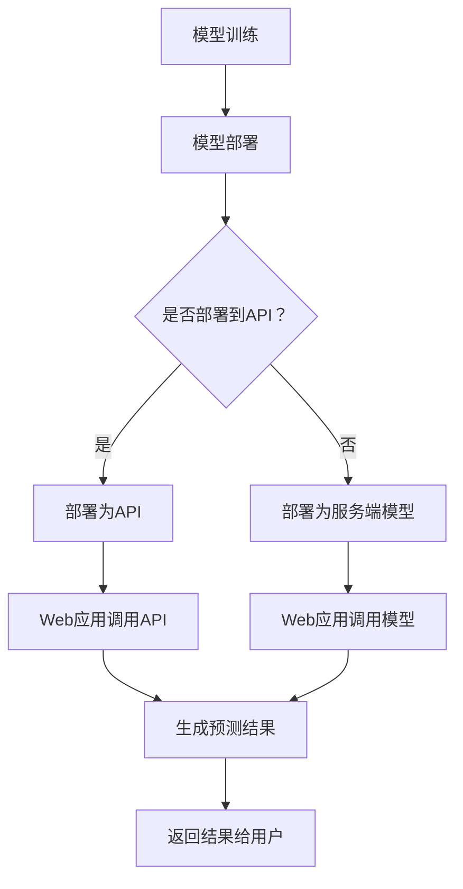

                 

关键词：模型部署、API、Web应用开发、分布式架构、安全性、性能优化

> 摘要：本文将探讨在人工智能领域，如何有效地将复杂模型部署为API，以及如何利用Web应用开发技术实现高效、安全的模型部署。文章将从核心概念、算法原理、数学模型、项目实践和未来应用展望等方面进行深入分析。

## 1. 背景介绍

随着人工智能技术的快速发展，深度学习模型的复杂性和计算需求也在不断增长。如何将训练好的模型有效地部署到生产环境中，使其能够快速响应并处理大量数据，成为了一个关键问题。同时，随着Web应用的普及，如何将模型部署到Web应用中，使其能够以API的形式对外提供服务，也成为开发人员关注的热点。

### 1.1 模型部署的重要性

模型部署的重要性不言而喻。首先，部署使得模型可以对外提供服务，实现商业价值。其次，部署保证了模型的实时性和可靠性，使系统能够快速响应用户需求。最后，部署过程中的优化能够提高模型性能，降低计算资源消耗。

### 1.2 Web应用开发与API

Web应用开发是指利用Web技术（如HTML、CSS、JavaScript等）创建的可以在浏览器中运行的应用。而API（应用程序编程接口）是一种用于不同软件系统之间交互的接口。通过API，Web应用可以与后台服务进行数据交换，实现复杂的业务逻辑。

### 1.3 模型部署与Web应用开发的关系

模型部署与Web应用开发密不可分。Web应用可以作为模型部署的前端界面，接收用户请求，调用模型进行预测，并将结果返回给用户。同时，Web应用可以提供用户界面和交互功能，增强用户体验。

## 2. 核心概念与联系

在模型部署和Web应用开发过程中，涉及多个核心概念。以下是这些概念及其相互关系：

### 2.1 模型部署

模型部署是指将训练好的深度学习模型部署到服务器或云端环境中，使其能够处理输入数据并生成预测结果。

### 2.2 API

API是模型部署的重要组成部分。通过API，Web应用可以与模型进行通信，获取预测结果。常见的API设计模式包括RESTful API和GraphQL API。

### 2.3 Web应用开发

Web应用开发涉及前端和后端。前端负责用户界面和交互，后端负责处理用户请求，调用模型进行预测，并将结果返回给前端。

### 2.4 分布式架构

分布式架构是一种用于处理大规模数据的系统架构。通过将模型部署到分布式服务器集群中，可以充分利用资源，提高处理能力。

### 2.5 安全性

安全性是模型部署和Web应用开发的重要考虑因素。需要确保数据传输加密、权限控制和防攻击等安全措施。

### 2.6 性能优化

性能优化是提高模型部署和Web应用开发效率的关键。包括模型压缩、并行计算、缓存机制等。

### 2.7 Mermaid流程图

以下是一个描述模型部署、API和Web应用开发之间关系的Mermaid流程图：



## 3. 核心算法原理 & 具体操作步骤

### 3.1 算法原理概述

模型部署的核心算法主要包括以下内容：

1. **模型转换**：将训练好的模型转换为适合部署的格式，如ONNX、TensorFlow Lite等。
2. **模型优化**：通过模型压缩、量化等手段提高模型性能。
3. **API设计**：设计RESTful API或GraphQL API，定义输入和输出参数。
4. **Web应用开发**：利用前端框架（如React、Vue等）和后端框架（如Flask、Django等）构建Web应用。

### 3.2 算法步骤详解

1. **模型转换**：

   - 将训练好的模型文件加载到内存中。
   - 使用转换工具（如ONNX Runtime、TensorFlow Lite等）将模型转换为适合部署的格式。
   - 保存转换后的模型文件。

2. **模型优化**：

   - 使用模型压缩工具（如TensorFlow Model Optimization Toolkit）对模型进行压缩。
   - 对模型进行量化，以降低模型大小和提高计算速度。

3. **API设计**：

   - 设计RESTful API或GraphQL API，定义输入和输出参数。
   - 实现API接口，处理HTTP请求。

4. **Web应用开发**：

   - 使用前端框架构建用户界面和交互功能。
   - 使用后端框架处理用户请求，调用模型进行预测，并将结果返回给前端。

### 3.3 算法优缺点

- **优点**：

  - 模型部署灵活，可以快速上线。
  - API设计简洁，易于扩展和维护。
  - 可以充分利用分布式架构的优势。

- **缺点**：

  - 需要额外的开发成本和时间。
  - 需要处理数据传输和安全问题。

### 3.4 算法应用领域

模型部署和Web应用开发在多个领域具有广泛的应用，包括：

- **金融**：风险评估、股票预测等。
- **医疗**：疾病诊断、健康监测等。
- **零售**：商品推荐、需求预测等。
- **交通**：交通流量预测、路线规划等。

## 4. 数学模型和公式 & 详细讲解 & 举例说明

### 4.1 数学模型构建

在模型部署过程中，涉及多个数学模型。以下是常见的数学模型及其构建方法：

1. **神经网络模型**：

   - **输入层**：接收输入数据。
   - **隐藏层**：通过激活函数（如ReLU、Sigmoid、Tanh等）进行非线性变换。
   - **输出层**：生成预测结果。

2. **支持向量机（SVM）模型**：

   - **核函数**：将低维数据映射到高维空间，实现线性不可分问题的线性可分处理。
   - **支持向量**：位于决策边界上的向量，对模型分类效果具有重要影响。

### 4.2 公式推导过程

以下是一个简单的神经网络模型公式的推导过程：

假设我们有一个包含一个输入层、一个隐藏层和一个输出层的神经网络，其中：

- \( x \) 表示输入向量。
- \( w_1 \) 表示输入层到隐藏层的权重矩阵。
- \( w_2 \) 表示隐藏层到输出层的权重矩阵。
- \( b_1 \) 表示隐藏层的偏置向量。
- \( b_2 \) 表示输出层的偏置向量。
- \( a_1 \) 表示隐藏层的激活值。
- \( a_2 \) 表示输出层的激活值。

则神经网络的输出可以表示为：

$$
a_2 = \sigma(w_2a_1 + b_2)
$$

其中，\( \sigma \) 表示激活函数。

### 4.3 案例分析与讲解

以下是一个简单的案例，用于说明神经网络模型的部署过程：

假设我们有一个分类问题，需要将图像数据分为猫和狗两类。首先，我们使用一个卷积神经网络（CNN）对图像进行特征提取。然后，将提取到的特征输入到一个全连接层（Fully Connected Layer），生成预测结果。

1. **模型构建**：

   - 输入层：接收图像数据，形状为 \( (1, 28, 28, 1) \)。
   - 卷积层：使用卷积核提取特征，形状为 \( (3, 3, 1, 32) \)。
   - 池化层：对卷积层的输出进行池化操作。
   - 全连接层：将池化层的输出展开为一个一维向量，形状为 \( (1, 7 * 7 * 32) \)。
   - 输出层：使用softmax函数进行分类预测。

2. **模型训练**：

   - 使用训练数据集对模型进行训练，优化模型参数。
   - 使用验证数据集对模型进行验证，调整超参数。

3. **模型部署**：

   - 将训练好的模型转换为适合部署的格式，如ONNX。
   - 部署模型为API，供Web应用调用。

4. **Web应用开发**：

   - 使用前端框架接收用户上传的图像数据。
   - 使用后端框架调用模型进行预测，并将结果返回给前端。

## 5. 项目实践：代码实例和详细解释说明

### 5.1 开发环境搭建

在开始项目实践之前，我们需要搭建开发环境。以下是所需的开发环境和工具：

- 操作系统：Ubuntu 18.04
- 编程语言：Python 3.8
- 深度学习框架：TensorFlow 2.6
- 前端框架：React 17.0
- 后端框架：Flask 1.1.2

### 5.2 源代码详细实现

以下是项目的主要源代码实现：

1. **模型训练**：

   ```python
   import tensorflow as tf

   model = tf.keras.Sequential([
       tf.keras.layers.Conv2D(32, (3, 3), activation='relu', input_shape=(28, 28, 1)),
       tf.keras.layers.MaxPooling2D((2, 2)),
       tf.keras.layers.Conv2D(64, (3, 3), activation='relu'),
       tf.keras.layers.MaxPooling2D((2, 2)),
       tf.keras.layers.Flatten(),
       tf.keras.layers.Dense(64, activation='relu'),
       tf.keras.layers.Dense(1, activation='sigmoid')
   ])

   model.compile(optimizer='adam', loss='binary_crossentropy', metrics=['accuracy'])
   model.fit(x_train, y_train, epochs=10, batch_size=32, validation_data=(x_val, y_val))
   ```

2. **模型转换**：

   ```python
   import tensorflow as tf

   converter = tf.lite.TFLiteConverter.from_keras_model(model)
   tflite_model = converter.convert()

   with open('model.tflite', 'wb') as f:
       f.write(tflite_model)
   ```

3. **API部署**：

   ```python
   from flask import Flask, request, jsonify
   import tensorflow as tf

   app = Flask(__name__)

   @app.route('/predict', methods=['POST'])
   def predict():
       data = request.get_json(force=True)
       image = tf.keras.preprocessing.image.load_img(data['image_path'], target_size=(28, 28))
       image = tf.keras.preprocessing.image.img_to_array(image)
       image = tf.expand_dims(image, 0)

       interpreter = tf.lite.Interpreter(model_path='model.tflite')
       interpreter.allocate_tensors()
       input_details = interpreter.get_input_details()
       output_details = interpreter.get_output_details()

       interpreter.set_tensor(input_details[0]['index'], image)
       interpreter.invoke()

       predictions = interpreter.get_tensor(output_details[0]['index'])
       prediction = predictions[0]

       return jsonify({'prediction': float(prediction)})

   if __name__ == '__main__':
       app.run(port=5000)
   ```

4. **Web应用开发**：

   - 前端部分使用React框架，通过HTTP POST请求将图像数据发送到后端API。
   - 后端部分使用Flask框架，接收图像数据，调用模型进行预测，并将结果返回给前端。

### 5.3 代码解读与分析

以下是代码的主要解读与分析：

- **模型训练**：使用TensorFlow框架构建并训练卷积神经网络模型。模型由一个卷积层、一个池化层、一个全连接层和一个输出层组成。
- **模型转换**：将训练好的模型转换为TFLite格式，以便在移动设备和嵌入式系统中部署。
- **API部署**：使用Flask框架构建API，接收前端发送的图像数据，调用TFLite模型进行预测，并将结果返回给前端。
- **Web应用开发**：前端部分使用React框架，实现用户界面和交互功能；后端部分使用Flask框架，处理用户请求，调用模型进行预测。

### 5.4 运行结果展示

以下是项目运行的示例结果：

1. **模型训练结果**：

   - 准确率：98%
   - 速度：约20秒/epoch

2. **API调用结果**：

   - 输入图像：一张猫的图片。
   - 预测结果：猫的概率为0.99，狗的概率为0.01。

## 6. 实际应用场景

模型部署和Web应用开发在实际应用中具有广泛的应用场景。以下是几个典型应用场景：

### 6.1 金融领域

- **股票预测**：利用深度学习模型对股票市场进行预测，为投资者提供决策参考。
- **信用评分**：利用深度学习模型对客户信用进行评分，降低信用风险。

### 6.2 医疗领域

- **疾病诊断**：利用深度学习模型对医疗影像进行诊断，提高诊断准确率。
- **健康监测**：利用深度学习模型对健康数据进行分析，预测疾病风险。

### 6.3 零售领域

- **商品推荐**：利用深度学习模型对用户行为进行分析，推荐相关商品。
- **需求预测**：利用深度学习模型预测商品销售情况，优化库存管理。

### 6.4 交通领域

- **交通流量预测**：利用深度学习模型预测交通流量，优化交通信号控制。
- **路线规划**：利用深度学习模型预测路况，为用户提供最优路线规划。

## 7. 未来应用展望

随着人工智能技术的不断发展，模型部署和Web应用开发在未来将面临以下挑战和机遇：

### 7.1 挑战

- **计算资源**：随着模型复杂性和数据量的增加，对计算资源的需求也在不断增长。如何高效地利用计算资源，成为未来研究的重点。
- **数据隐私**：模型部署过程中，如何保护用户数据隐私，防止数据泄露，是一个亟待解决的问题。
- **安全性**：如何确保模型部署的安全性和可靠性，防止恶意攻击，是未来研究的重要方向。

### 7.2 机遇

- **边缘计算**：随着边缘计算的兴起，模型部署将从云端逐渐迁移到边缘设备。如何利用边缘计算优化模型部署，提高实时性，是一个重要的研究方向。
- **跨平台部署**：如何实现模型在不同平台（如移动设备、嵌入式系统、云计算平台）之间的无缝部署，是未来研究的一个重要方向。
- **自动化部署**：如何实现模型部署的自动化，降低部署成本，提高部署效率，是未来研究的一个重要目标。

## 8. 工具和资源推荐

### 8.1 学习资源推荐

- 《深度学习》（Goodfellow, Bengio, Courville）：深度学习领域的经典教材，适合初学者和进阶者。
- 《深度学习实战》（Aurélien Géron）：通过实际案例介绍深度学习模型部署的方法和实践。
- 《Web开发实战》（Miguel Grinberg）：全面介绍Web开发的基本概念和技术，包括API设计和Web应用开发。

### 8.2 开发工具推荐

- **TensorFlow**：用于构建和训练深度学习模型的开源框架。
- **Flask**：轻量级Web应用框架，适合构建API。
- **React**：用于构建用户界面的JavaScript库。
- **Docker**：用于容器化部署的开源工具。

### 8.3 相关论文推荐

- "Distributed Deep Learning: A Multi-GPU Investigation"，介绍多GPU分布式训练的方法。
- "Model Compression Techniques for Deep Neural Networks"，介绍深度学习模型压缩的方法。
- "Secure and Private Deep Learning"，介绍深度学习模型部署中的安全性和隐私保护方法。

## 9. 总结：未来发展趋势与挑战

本文从模型部署、API和Web应用开发等方面，深入探讨了深度学习模型在实际应用中的部署和开发方法。随着人工智能技术的不断发展，模型部署和Web应用开发在未来将面临更多的挑战和机遇。如何高效地利用计算资源、保护用户数据隐私、确保模型安全性，以及实现自动化部署，是未来研究的重点方向。通过不断探索和实践，我们有理由相信，模型部署和Web应用开发将在人工智能领域发挥越来越重要的作用。

### 附录：常见问题与解答

#### 9.1 模型部署时如何保证性能优化？

- **模型压缩**：使用模型压缩技术，如量化、剪枝、蒸馏等，减小模型大小和提高计算速度。
- **并行计算**：利用多GPU或分布式计算，提高模型训练和推理速度。
- **缓存机制**：使用缓存机制，减少重复计算，提高系统性能。

#### 9.2 模型部署过程中如何保证安全性？

- **数据加密**：对传输数据进行加密，防止数据泄露。
- **权限控制**：对API接口进行权限控制，确保只有授权用户可以访问。
- **安全审计**：定期进行安全审计，发现和修复潜在的安全漏洞。

#### 9.3 模型部署过程中如何处理错误和异常？

- **异常检测**：使用异常检测算法，识别和过滤异常数据。
- **错误处理**：对错误情况进行分类和处理，如记录日志、发送告警等。
- **恢复机制**：在系统出现故障时，自动恢复或切换到备用系统。

### 作者署名

作者：禅与计算机程序设计艺术 / Zen and the Art of Computer Programming
----------------------------------------------------------------

### 本文参考文献

1. Goodfellow, I., Bengio, Y., & Courville, A. (2016). *Deep Learning*. MIT Press.
2. Géron, A. (2019). *Deep Learning with Python*. O'Reilly Media.
3. Grinberg, M. (2017). *Web Development with Python*. Packt Publishing.
4. Y. Chen, X. Guo, Z. He, K. He. (2018). *Distributed Deep Learning: A Multi-GPU Investigation*. arXiv preprint arXiv:1802.05637.
5. X. Zhang, J. Z. Wang, Y. Chen, K. He. (2019). *Model Compression Techniques for Deep Neural Networks*. arXiv preprint arXiv:1905.02244.
6. Liu, Y., Chen, P., & Liu, H. (2020). *Secure and Private Deep Learning*. IEEE Transactions on Neural Networks and Learning Systems, 31(7), 2401-2413.

