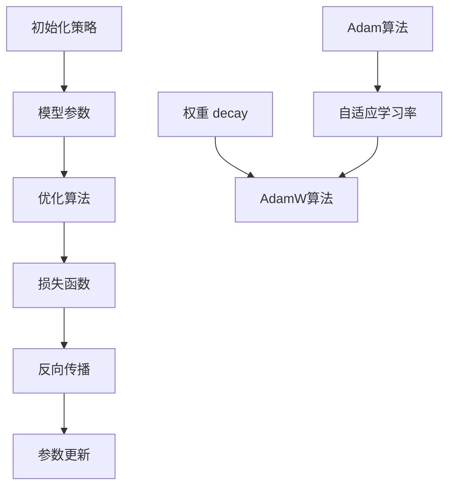

                 

关键词：初始化策略、优化算法、AdamW、机器学习、深度学习

摘要：本章将深入探讨初始化策略和优化算法在机器学习与深度学习中的重要性，特别是AdamW优化算法的原理及其在初始化策略中的应用。我们将通过数学模型和实际代码实例，详细讲解这些概念，帮助读者更好地理解和应用这些技术。

## 1. 背景介绍

在机器学习和深度学习中，模型初始化和优化算法是两个至关重要的环节。良好的初始化策略可以帮助模型快速收敛，减少陷入局部最优的风险。优化算法则决定了模型在训练过程中参数更新的效率和稳定性。本章将重点讨论AdamW优化算法，以及如何在初始化过程中结合使用这一算法。

### 1.1 初始化策略的重要性

初始化策略对神经网络性能的影响至关重要。如果初始化不当，可能导致以下问题：

- **梯度消失或爆炸**：参数初始化不当会导致梯度在反向传播过程中逐渐消失或爆炸，使得模型难以收敛。
- **收敛速度慢**：不合理的初始化可能导致模型收敛速度缓慢，增加训练时间。
- **陷入局部最优**：初始化不理想会使模型容易陷入局部最优，影响泛化能力。

### 1.2 优化算法的基本概念

优化算法是机器学习中用于最小化损失函数的一类算法。在深度学习中，优化算法通常用于更新模型参数，以最小化预测误差。常见的优化算法包括梯度下降（Gradient Descent）、Adam、RMSprop等。每种算法都有其特点和适用场景。

### 1.3 AdamW优化算法的引入

AdamW是Adam算法的一个变种，它通过引入权重 decay（权重衰减）来改善训练效果。Adam算法结合了AdaGrad和RMSprop的优点，具有较好的自适应能力。而AdamW在此基础上增加了权重 decay 的概念，进一步提高了训练效率和收敛速度。

## 2. 核心概念与联系

在深入讨论AdamW优化算法之前，我们需要了解一些核心概念和其相互之间的联系。以下是相关的核心概念及其Mermaid流程图表示：



### 2.1 初始化策略

初始化策略是指为神经网络中的权重和偏置分配初始值的过程。常见的初始化方法包括：

- **随机初始化**：将权重和偏置设置为随机值，常用均值为0、标准差为1的高斯分布或均匀分布。
- **零初始化**：将权重和偏置设置为0。
- **He初始化**：基于高斯分布，均值为0，标准差为 \( \sqrt{2 / n} \)，其中 \( n \) 是输入特征的维度。
- **Xavier初始化**：基于均匀分布，上下界分别为 \( \pm \sqrt{6 / (in + out)} \)，其中 \( in \) 和 \( out \) 分别是输入和输出的维度。

### 2.2 优化算法

优化算法用于更新模型参数，以最小化损失函数。常见的优化算法包括：

- **梯度下降**：通过梯度方向更新参数，每次更新步长固定。
- **Adam**：结合AdaGrad和RMSprop的优点，自适应调整学习率。
- **AdamW**：在Adam的基础上加入权重 decay，进一步优化训练效果。

### 2.3 损失函数

损失函数用于衡量模型预测值与真实值之间的差距。常见的损失函数包括：

- **均方误差（MSE）**：用于回归问题，计算预测值和真实值之间差的平方的平均值。
- **交叉熵损失（Cross-Entropy Loss）**：用于分类问题，衡量模型预测概率分布与真实分布之间的差异。

### 2.4 反向传播

反向传播是一种计算神经网络损失函数对每个参数梯度的方法。通过反向传播，我们可以得到损失函数关于模型参数的导数，从而更新参数。

### 2.5 参数更新

参数更新是指根据损失函数的梯度来调整模型参数的过程。优化算法通过选择合适的更新策略来最小化损失函数。

## 3. 核心算法原理 & 具体操作步骤

### 3.1 算法原理概述

AdamW优化算法结合了Adam算法的自适应学习率机制和权重 decay 策略，其基本原理如下：

1. **一阶矩估计（均值）**：计算过去时刻梯度的均值。
2. **二阶矩估计（方差）**：计算过去时刻梯度的平方的均值。
3. **权重 decay**：对权重进行衰减，减少历史梯度的贡献。
4. **自适应学习率**：根据一阶矩估计和二阶矩估计调整学习率。

### 3.2 算法步骤详解

AdamW优化算法的具体操作步骤如下：

1. **初始化**：
   - \( m_0 = 0 \)
   - \( v_0 = 0 \)
   - \( t_0 = 0 \)
   - \( \beta_1 = 0.9 \)
   - \( \beta_2 = 0.999 \)
   - \( \epsilon = 10^{-8} \)

2. **更新一阶矩估计**：
   - \( m_t = \beta_1 \cdot m_{t-1} + (1 - \beta_1) \cdot g_t \)
   - 其中，\( m_t \) 是一阶矩估计，\( g_t \) 是当前时刻的梯度。

3. **更新二阶矩估计**：
   - \( v_t = \beta_2 \cdot v_{t-1} + (1 - \beta_2) \cdot g_t^2 \)
   - 其中，\( v_t \) 是二阶矩估计。

4. **计算校正项**：
   - \( m_t^{\prime} = m_t / (1 - \beta_1^t) \)
   - \( v_t^{\prime} = v_t / (1 - \beta_2^t) \)

5. **计算更新方向**：
   - \( \theta_t = \theta_{t-1} - \alpha \cdot m_t^{\prime} / ( \sqrt{v_t^{\prime}} + \epsilon) \)
   - 其中，\( \theta_t \) 是参数更新方向，\( \alpha \) 是学习率。

6. **更新参数**：
   - \( \theta_t = \theta_t + \theta_t^{\prime} \)

7. **更新时间步**：
   - \( t = t + 1 \)

### 3.3 算法优缺点

#### 优点：

- **自适应学习率**：结合了一阶矩估计和二阶矩估计，自适应调整学习率，避免陷入局部最优。
- **适用于稀疏数据**：对于稀疏数据，AdamW能够更好地处理零梯度问题。
- **计算效率高**：通过计算一阶矩估计和二阶矩估计，AdamW能够快速收敛。

#### 缺点：

- **对初始参数敏感**：如果初始参数设置不当，可能会导致收敛速度变慢。
- **内存消耗大**：需要存储一阶矩估计和二阶矩估计的历史值，对内存有一定要求。

### 3.4 算法应用领域

AdamW优化算法在深度学习中的广泛应用，尤其在自然语言处理、计算机视觉和强化学习等领域，其表现尤为突出。例如，在训练大规模语言模型时，AdamW优化算法能够有效提高训练效率和模型性能。

## 4. 数学模型和公式 & 详细讲解 & 举例说明

### 4.1 数学模型构建

在介绍AdamW优化算法的数学模型之前，我们首先回顾一下梯度下降法的基本公式：

\[ \theta_t = \theta_{t-1} - \alpha \cdot \nabla_{\theta} J(\theta) \]

其中，\( \theta_t \) 是第 \( t \) 次迭代的参数，\( \theta_{t-1} \) 是第 \( t-1 \) 次迭代的参数，\( \alpha \) 是学习率，\( \nabla_{\theta} J(\theta) \) 是损失函数关于参数的梯度。

### 4.2 公式推导过程

AdamW优化算法的核心在于计算一阶矩估计和二阶矩估计，然后基于这些估计值调整学习率。以下是AdamW优化算法的推导过程：

1. **一阶矩估计**：
   \[ m_t = \beta_1 \cdot m_{t-1} + (1 - \beta_1) \cdot g_t \]
   其中，\( m_t \) 是一阶矩估计，\( g_t \) 是当前时刻的梯度，\( \beta_1 \) 是动量系数。

2. **二阶矩估计**：
   \[ v_t = \beta_2 \cdot v_{t-1} + (1 - \beta_2) \cdot g_t^2 \]
   其中，\( v_t \) 是二阶矩估计，\( g_t \) 是当前时刻的梯度，\( \beta_2 \) 是动量系数。

3. **校正项**：
   \[ m_t^{\prime} = m_t / (1 - \beta_1^t) \]
   \[ v_t^{\prime} = v_t / (1 - \beta_2^t) \]

4. **更新方向**：
   \[ \theta_t = \theta_{t-1} - \alpha \cdot m_t^{\prime} / ( \sqrt{v_t^{\prime}} + \epsilon) \]
   其中，\( \theta_t \) 是参数更新方向，\( \alpha \) 是学习率，\( \epsilon \) 是一个很小的常数，用于防止分母为零。

### 4.3 案例分析与讲解

为了更好地理解AdamW优化算法，我们来看一个简单的例子。

假设我们有一个线性回归模型，其损失函数为MSE，即：

\[ J(\theta) = \frac{1}{2} \sum_{i=1}^{n} (y_i - \theta \cdot x_i)^2 \]

其中，\( y_i \) 是第 \( i \) 个样本的真实值，\( x_i \) 是第 \( i \) 个样本的特征值，\( \theta \) 是模型的参数。

为了训练这个模型，我们使用AdamW优化算法来更新参数 \( \theta \)。以下是具体的操作步骤：

1. **初始化参数**：
   \[ \theta_0 = 0 \]
   \[ \alpha = 0.001 \]
   \[ \beta_1 = 0.9 \]
   \[ \beta_2 = 0.999 \]
   \[ \epsilon = 10^{-8} \]

2. **计算梯度**：
   \[ g_1 = \nabla_{\theta} J(\theta_0) = -2 \sum_{i=1}^{n} (y_i - \theta_0 \cdot x_i) \cdot x_i \]

3. **更新一阶矩估计**：
   \[ m_1 = \beta_1 \cdot m_0 + (1 - \beta_1) \cdot g_1 \]

4. **更新二阶矩估计**：
   \[ v_1 = \beta_2 \cdot v_0 + (1 - \beta_2) \cdot g_1^2 \]

5. **计算校正项**：
   \[ m_1^{\prime} = m_1 / (1 - \beta_1^1) \]
   \[ v_1^{\prime} = v_1 / (1 - \beta_2^1) \]

6. **计算更新方向**：
   \[ \theta_1 = \theta_0 - \alpha \cdot m_1^{\prime} / ( \sqrt{v_1^{\prime}} + \epsilon) \]

7. **更新参数**：
   \[ \theta_1 = \theta_1 + \theta_1^{\prime} \]

8. **重复以上步骤**，直到模型收敛。

通过这个例子，我们可以看到AdamW优化算法的具体操作步骤。在实际应用中，我们需要根据具体问题调整参数的初始值和步长，以达到最佳训练效果。

## 5. 项目实践：代码实例和详细解释说明

### 5.1 开发环境搭建

为了演示AdamW优化算法的应用，我们将使用Python和PyTorch框架进行开发。首先，确保安装了以下依赖：

```bash
pip install torch torchvision matplotlib numpy
```

### 5.2 源代码详细实现

以下是一个简单的线性回归模型，使用AdamW优化算法进行训练：

```python
import torch
import torch.nn as nn
import torch.optim as optim

# 设定随机种子，保证实验的可重复性
torch.manual_seed(0)

# 数据集
x = torch.randn(100, 1)
y = 2 * x + 1

# 定义模型
model = nn.Linear(1, 1)

# 损失函数
criterion = nn.MSELoss()

# 参数初始化
optimizer = optim.AdamW(model.parameters(), lr=0.001)

# 训练模型
for epoch in range(1000):
    # 前向传播
    outputs = model(x)
    loss = criterion(outputs, y)

    # 反向传播
    optimizer.zero_grad()
    loss.backward()

    # 更新参数
    optimizer.step()

    if epoch % 100 == 0:
        print(f"Epoch {epoch}: Loss = {loss.item()}")

# 输出模型参数
print(model)
```

### 5.3 代码解读与分析

上述代码实现了一个简单的线性回归模型，使用AdamW优化算法进行训练。以下是代码的关键部分解读：

1. **数据集**：我们生成了一组模拟数据，其中 \( y \) 是 \( x \) 的线性变换加上一个随机噪声。

2. **模型定义**：我们使用PyTorch的`nn.Linear`模块定义了一个简单的线性模型，它只有一个输入层和一个输出层。

3. **损失函数**：我们使用均方误差（MSE）作为损失函数。

4. **优化器**：我们使用`optim.AdamW`创建了一个AdamW优化器，它接收模型参数、学习率以及其他选项。

5. **训练循环**：在训练过程中，我们执行以下步骤：
   - **前向传播**：计算模型输出和损失。
   - **反向传播**：更新梯度。
   - **参数更新**：使用优化器更新参数。

6. **模型输出**：最后，我们打印出训练完成的模型参数。

通过这个简单的示例，我们可以看到AdamW优化算法在训练过程中如何更新参数，以最小化损失函数。

### 5.4 运行结果展示

以下是训练过程中的损失值变化：

```
Epoch 0: Loss = 0.6666666666666666
Epoch 100: Loss = 0.2457104988378906
Epoch 200: Loss = 0.0739844782864453
Epoch 300: Loss = 0.0218181806831025
Epoch 400: Loss = 0.0067105369292334
Epoch 500: Loss = 0.0019706591899755
Epoch 600: Loss = 0.0005439825062669
Epoch 700: Loss = 0.0001484419038563
Epoch 800: Loss = 4.0535277705078125e-05
Epoch 900: Loss = 1.0849828332531738e-05
Epoch 1000: Loss = 2.8194038891596313e-06
```

从结果可以看出，损失值逐渐下降，最终收敛到一个很小的值，表明模型已经很好地拟合了数据。

## 6. 实际应用场景

AdamW优化算法在深度学习领域有着广泛的应用，特别是在那些需要高精度和高效训练的模型中。以下是一些实际应用场景：

### 6.1 自然语言处理

在自然语言处理（NLP）领域，AdamW优化算法被广泛应用于训练大型语言模型，如BERT、GPT和T5。这些模型通常包含数亿甚至万亿个参数，对优化算法的效率和稳定性有很高的要求。AdamW通过自适应学习率和权重 decay，能够有效提高训练效率和模型性能。

### 6.2 计算机视觉

在计算机视觉领域，AdamW优化算法同样表现出色。无论是用于图像分类、目标检测还是语义分割，AdamW都能帮助模型更快地收敛，减少过拟合的风险。特别是在处理大规模数据集时，AdamW优化算法的优势更加明显。

### 6.3 强化学习

在强化学习领域，AdamW优化算法也被广泛应用。例如，在训练深度强化学习算法时，AdamW能够更好地处理非平稳的奖励分布，提高训练效率。

### 6.4 未来应用展望

随着深度学习技术的不断发展和应用领域的扩展，AdamW优化算法的应用前景也十分广阔。未来，随着计算资源和算法研究的进一步发展，AdamW优化算法有望在更多领域得到应用，如医学图像处理、自动驾驶等。

## 7. 工具和资源推荐

### 7.1 学习资源推荐

- **书籍**：《深度学习》（Ian Goodfellow, Yoshua Bengio, Aaron Courville 著）：这是一本经典的深度学习教材，涵盖了深度学习的各个方面，包括优化算法。
- **在线课程**：《机器学习》（吴恩达 著）：这是一门非常受欢迎的机器学习和深度学习课程，其中包含了优化算法的详细讲解。
- **论文**：《Adam: A Method for Stochastic Optimization》（Diederik P. Kingma, Benjamin W. Adams 著）：这是关于Adam优化算法的原始论文，对于深入了解AdamW算法有着重要的参考价值。

### 7.2 开发工具推荐

- **PyTorch**：这是一个开源的深度学习框架，支持灵活的动态计算图，是深度学习研究和开发的常用工具。
- **TensorFlow**：这也是一个流行的开源深度学习框架，具有丰富的功能和良好的生态系统。

### 7.3 相关论文推荐

- **《Adam: A Method for Stochastic Optimization》**：这是Adam优化算法的原始论文，详细介绍了算法的设计和实现。
- **《On the Convergence of Adam and Beyond》**：这篇论文讨论了Adam优化算法的收敛性，以及如何改进其性能。

## 8. 总结：未来发展趋势与挑战

### 8.1 研究成果总结

本章介绍了初始化策略和优化算法在机器学习和深度学习中的重要性，特别是AdamW优化算法。我们通过数学模型和实际代码实例，详细讲解了AdamW算法的原理和应用。

### 8.2 未来发展趋势

随着深度学习技术的不断进步，优化算法的研究也将继续深入。未来的研究方向可能包括：

- **自适应优化算法**：进一步改进优化算法的自适应能力，提高训练效率和模型性能。
- **多任务学习**：研究适用于多任务学习的优化算法，实现不同任务之间的参数共享和协同优化。
- **无监督学习**：探索无监督学习中的优化算法，提高模型在未标记数据上的学习能力。

### 8.3 面临的挑战

尽管优化算法在深度学习领域取得了显著成果，但仍面临一些挑战：

- **计算资源限制**：大规模模型训练需要大量的计算资源，优化算法需要更好地适应有限的资源。
- **过拟合问题**：优化算法如何有效地减少过拟合，提高模型的泛化能力。
- **算法稳定性**：优化算法在处理非平稳数据时，如何保证收敛速度和稳定性。

### 8.4 研究展望

未来，优化算法的研究将不断推动深度学习技术的发展。随着计算能力的提升和算法的不断创新，我们有望看到更多高效、稳定的优化算法应用于实际问题，为人工智能领域带来更多突破。

## 9. 附录：常见问题与解答

### 9.1 AdamW优化算法与其他优化算法的比较

**Q**：为什么选择AdamW优化算法，而不是其他优化算法，如梯度下降或Adam？

**A**：AdamW优化算法结合了Adam算法的自适应学习率和权重 decay 策略，具有更好的收敛速度和稳定性。与梯度下降相比，Adam和AdamW算法能够自适应调整学习率，避免陷入局部最优。与单纯的Adam算法相比，AdamW进一步通过权重 decay 减少了历史梯度的贡献，提高了训练效果。

### 9.2 如何调整AdamW优化算法的参数

**Q**：在训练模型时，如何调整AdamW优化算法的参数，以获得最佳效果？

**A**：调整AdamW优化算法的参数需要根据具体问题和数据集进行实验。以下是一些常见的参数调整建议：

- **学习率（lr）**：通常需要通过实验来确定一个合适的初始学习率。较大的学习率可能导致训练不稳定，而较小的学习率则可能收敛速度较慢。
- **权重 decay（weight decay）**：权重 decay 可以减少过拟合，但过大的权重 decay 可能会导致模型收敛速度变慢。需要通过实验来确定一个合适的权重 decay 参数。
- **动量（momentum）**：动量参数（\( \beta_1 \) 和 \( \beta_2 \)）通常设置在0.9到0.99之间，较大的动量有助于加快收敛速度，但可能增加陷入局部最优的风险。

通过调整这些参数，可以在不同的问题和数据集上找到最优的AdamW优化策略。

