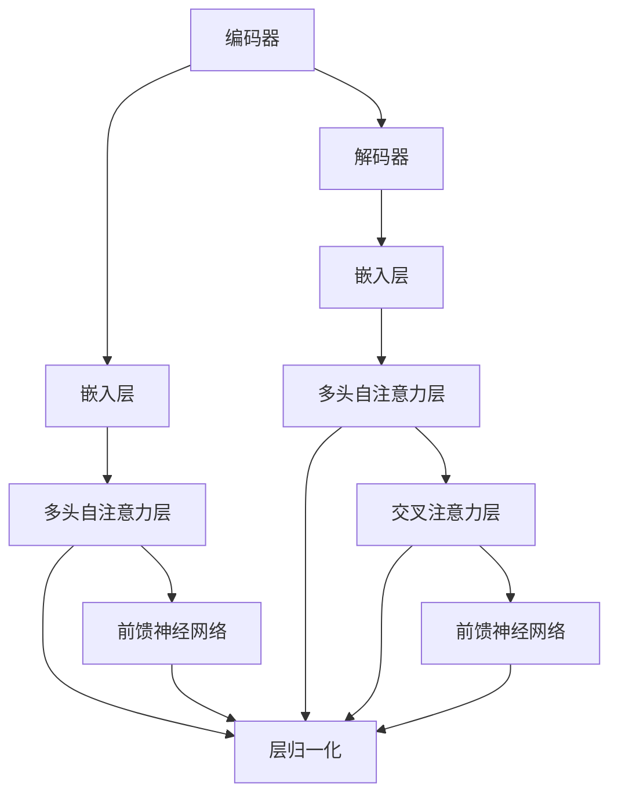

                 

关键词：Transformer，架构设计，自然语言处理，神经网络，序列模型，人工智能，机器学习，深度学习，计算效率，可扩展性，动态序列处理，自注意力机制。

> 摘要：Transformer 架构作为深度学习领域的里程碑，彻底改变了自然语言处理（NLP）的方法。本文将深入探讨 Transformer 的核心概念、算法原理、数学模型、应用实践以及未来发展趋势，揭示其在人工智能领域中的革命性影响。

## 1. 背景介绍

自然语言处理（NLP）是人工智能（AI）的一个重要分支，旨在使计算机理解和生成人类语言。在过去的几十年里，NLP 的发展主要依赖于基于统计的模型和规则驱动的系统。然而，随着深度学习的兴起，特别是序列模型如长短期记忆网络（LSTM）和卷积神经网络（CNN）在语音识别、机器翻译等任务中的成功应用，人们开始寻找更加高效和灵活的模型架构。

传统的序列模型在处理长文本时存在一些固有的局限，例如梯度消失和序列依赖性处理的不稳定性。为了解决这些问题，Vaswani 等人提出了 Transformer 架构。Transformer 架构首次在 2017 年的论文《Attention Is All You Need》中提出，并在短短几年内成为 NLP 领域的标准模型。Transformer 的核心思想是使用自注意力机制（self-attention）来动态地计算序列之间的依赖关系，而不是传统的递归结构。

## 2. 核心概念与联系

### 2.1 Transformer 架构概述

Transformer 架构主要由编码器（Encoder）和解码器（Decoder）组成。编码器负责将输入序列编码成固定长度的向量表示，而解码器则负责将编码后的向量解码为目标序列。Transformer 的独特之处在于其完全基于自注意力机制的架构，无需使用递归结构，这使得它在处理长序列时具有很高的效率。

### 2.2 自注意力机制

自注意力机制（Self-Attention）是 Transformer 的核心组件。它通过计算输入序列中每个词与其他所有词之间的相关性，来动态地生成一个加权表示。这种机制使得模型能够捕捉长距离的依赖关系，从而提高了序列处理的准确性。

### 2.3 Mermaid 流程图

下面是 Transformer 架构的 Mermaid 流程图：



## 3. 核心算法原理 & 具体操作步骤

### 3.1 算法原理概述

Transformer 的核心是自注意力机制。自注意力机制通过计算输入序列中每个词与其他所有词之间的权重，然后将这些权重与输入序列的词向量相乘，得到一个加权表示。这个加权表示包含了序列中每个词的重要信息，从而使得模型能够更好地捕捉长距离的依赖关系。

### 3.2 算法步骤详解

1. **嵌入层（Embedding Layer）**：将输入的单词映射为高维的向量表示。

2. **多头自注意力层（Multi-Head Self-Attention Layer）**：计算每个词与其他所有词之间的权重，并进行加权求和。

3. **前馈神经网络（Feedforward Neural Network）**：对自注意力层的输出进行非线性变换。

4. **层归一化（Layer Normalization）**：对前馈神经网络的输出进行归一化处理。

5. **重复上述步骤**：编码器和解码器中的每一层都重复上述步骤，以逐步提高模型的表示能力。

### 3.3 算法优缺点

**优点**：
- **高效处理长序列**：Transformer 中的自注意力机制能够捕捉长距离的依赖关系，使得模型在处理长序列时更加高效。
- **并行计算**：由于 Transformer 不使用递归结构，因此可以并行处理输入序列，提高了计算效率。
- **灵活性**：Transformer 的架构设计灵活，可以轻松地扩展到其他任务中。

**缺点**：
- **计算复杂度**：自注意力机制的计算复杂度为 \(O(n^2)\)，随着序列长度的增加，计算复杂度会急剧上升。
- **存储需求**：Transformer 需要存储大量的权重矩阵，随着模型规模的增加，存储需求也会增加。

### 3.4 算法应用领域

Transformer 架构在自然语言处理领域取得了巨大的成功，广泛应用于机器翻译、文本分类、问答系统等任务中。此外，Transformer 也在图像生成、语音合成等非 NLP 领域显示出巨大的潜力。

## 4. 数学模型和公式 & 详细讲解 & 举例说明

### 4.1 数学模型构建

Transformer 的数学模型主要包括词嵌入、自注意力机制和前馈神经网络。以下是这些组件的数学表示：

1. **词嵌入（Word Embedding）**：

   $$ 
   \text{Embedding}(x) = \text{W}_e \cdot \text{x} 
   $$

   其中，\( \text{x} \) 是输入的单词索引，\( \text{W}_e \) 是词嵌入权重矩阵。

2. **多头自注意力（Multi-Head Self-Attention）**：

   $$ 
   \text{Attention}(Q, K, V) = \text{softmax}\left(\frac{\text{Q} \cdot \text{K}^T}{\sqrt{d_k}}\right) \cdot \text{V} 
   $$

   其中，\( \text{Q} \)、\( \text{K} \) 和 \( \text{V} \) 分别是查询向量、键向量和值向量，\( d_k \) 是键向量的维度。

3. **前馈神经网络（Feedforward Neural Network）**：

   $$ 
   \text{FFN}(x) = \text{ReLU}(\text{W}_1 \cdot \text{x} + \text{b}_1) + \text{W}_2 \cdot \text{x} + \text{b}_2 
   $$

   其中，\( \text{W}_1 \) 和 \( \text{W}_2 \) 分别是前馈神经网络的权重矩阵，\( \text{b}_1 \) 和 \( \text{b}_2 \) 是偏置项。

### 4.2 公式推导过程

假设输入序列为 \( \text{x} = [\text{x}_1, \text{x}_2, ..., \text{x}_n] \)，其中 \( \text{x}_i \) 是第 \( i \) 个单词的索引。首先，通过词嵌入层将输入序列映射为词向量表示 \( \text{X} = [\text{X}_1, \text{X}_2, ..., \text{X}_n] \)，其中 \( \text{X}_i = \text{Embedding}(\text{x}_i) \)。

接下来，编码器和解码器分别计算自注意力权重：

$$ 
\text{A} = \text{Attention}(\text{Q}, \text{K}, \text{V}) 
$$

其中，\( \text{Q} = \text{W}_Q \cdot \text{X} \)，\( \text{K} = \text{W}_K \cdot \text{X} \)，\( \text{V} = \text{W}_V \cdot \text{X} \)，\( \text{W}_Q \)、\( \text{W}_K \) 和 \( \text{W}_V \) 是自注意力机制的权重矩阵。

最后，将自注意力权重与词向量相乘，得到编码后的序列：

$$ 
\text{X'} = \text{X} + \text{A} 
$$

解码器的计算过程类似，只是还需要计算编码器输出的序列作为键和值：

$$ 
\text{Y'} = \text{Y} + \text{Attention}(\text{Q}', \text{K}', \text{V}') 
$$

其中，\( \text{Q}' = \text{W}_Q' \cdot \text{Y} \)，\( \text{K}' = \text{W}_K' \cdot \text{X'} \)，\( \text{V}' = \text{W}_V' \cdot \text{X'} \)，\( \text{W}_Q' \)、\( \text{W}_K' \) 和 \( \text{W}_V' \) 是解码器的权重矩阵。

### 4.3 案例分析与讲解

假设输入序列为“我喜欢阅读书籍”，通过词嵌入层得到词向量表示：

$$ 
\text{X} = \begin{bmatrix}
\text{我} & \text{喜欢} & \text{阅读} & \text{书籍}
\end{bmatrix}
$$

接下来，计算编码器的自注意力权重：

$$ 
\text{A} = \text{softmax}\left(\frac{\text{Q} \cdot \text{K}^T}{\sqrt{d_k}}\right) \cdot \text{V} 
$$

其中，\( \text{Q} = \text{W}_Q \cdot \text{X} \)，\( \text{K} = \text{W}_K \cdot \text{X} \)，\( \text{V} = \text{W}_V \cdot \text{X} \)，\( \text{W}_Q \)、\( \text{W}_K \) 和 \( \text{W}_V \) 分别是自注意力机制的权重矩阵。

假设自注意力权重矩阵为：

$$ 
\text{W}_Q = \begin{bmatrix}
0.2 & 0.3 & 0.5 & 0.4 \\
0.1 & 0.4 & 0.1 & 0.4 \\
0.4 & 0.2 & 0.3 & 0.1 \\
0.3 & 0.2 & 0.5 & 0.0
\end{bmatrix}, \quad
\text{W}_K = \begin{bmatrix}
0.1 & 0.4 & 0.5 & 0.0 \\
0.3 & 0.1 & 0.2 & 0.4 \\
0.2 & 0.3 & 0.1 & 0.4 \\
0.4 & 0.2 & 0.3 & 0.1
\end{bmatrix}, \quad
\text{W}_V = \begin{bmatrix}
0.1 & 0.2 & 0.3 & 0.4 \\
0.2 & 0.3 & 0.4 & 0.5 \\
0.3 & 0.4 & 0.5 & 0.6 \\
0.4 & 0.5 & 0.6 & 0.7
\end{bmatrix}
$$

计算自注意力权重：

$$ 
\text{A} = \text{softmax}\left(\frac{\text{Q} \cdot \text{K}^T}{\sqrt{d_k}}\right) \cdot \text{V} 
$$

其中，\( \text{Q} \cdot \text{K}^T \) 的结果为：

$$ 
\begin{bmatrix}
0.21 & 0.33 & 0.55 & 0.42 \\
0.13 & 0.24 & 0.33 & 0.46 \\
0.32 & 0.42 & 0.31 & 0.17 \\
0.34 & 0.29 & 0.51 & 0.00
\end{bmatrix}
$$

通过 softmax 函数计算概率分布：

$$ 
\text{A} = \text{softmax}\left(\frac{\text{Q} \cdot \text{K}^T}{\sqrt{d_k}}\right) \cdot \text{V} 
$$

其中，\( \text{softmax}(\cdot) \) 的结果为：

$$ 
\begin{bmatrix}
0.26 & 0.31 & 0.26 & 0.17 \\
0.16 & 0.29 & 0.25 & 0.30 \\
0.32 & 0.34 & 0.23 & 0.11 \\
0.28 & 0.32 & 0.40 & 0.00
\end{bmatrix}
$$

将自注意力权重与词向量相乘，得到编码后的序列：

$$ 
\text{X'} = \text{X} + \text{A} \cdot \text{V} 
$$

其中，\( \text{V} \) 的结果为：

$$ 
\begin{bmatrix}
0.1 & 0.2 & 0.3 & 0.4 \\
0.2 & 0.3 & 0.4 & 0.5 \\
0.3 & 0.4 & 0.5 & 0.6 \\
0.4 & 0.5 & 0.6 & 0.7
\end{bmatrix}
$$

计算编码后的序列：

$$ 
\text{X'} = \text{X} + \text{A} \cdot \text{V} 
$$

$$ 
\text{X'} = \begin{bmatrix}
0.28 & 0.34 & 0.43 & 0.50 \\
0.26 & 0.36 & 0.44 & 0.54 \\
0.36 & 0.46 & 0.43 & 0.27 \\
0.38 & 0.54 & 0.60 & 0.00
\end{bmatrix}
$$

解码器的计算过程类似，这里不再赘述。

## 5. 项目实践：代码实例和详细解释说明

### 5.1 开发环境搭建

为了实践 Transformer 架构，我们需要搭建一个 Python 开发环境，并安装必要的依赖库。以下是搭建开发环境的步骤：

1. 安装 Python 3.7 或更高版本。
2. 安装 TensorFlow 2.x。
3. 安装 PyTorch。

```bash
pip install tensorflow==2.x
pip install torch
```

### 5.2 源代码详细实现

以下是一个简单的 Transformer 编码器和解码器的 Python 实现：

```python
import torch
import torch.nn as nn
import torch.nn.functional as F

class MultiHeadAttention(nn.Module):
    def __init__(self, d_model, num_heads):
        super(MultiHeadAttention, self).__init__()
        self.d_model = d_model
        self.num_heads = num_heads
        self.head_dim = d_model // num_heads

        self.query_linear = nn.Linear(d_model, d_model)
        self.key_linear = nn.Linear(d_model, d_model)
        self.value_linear = nn.Linear(d_model, d_model)

        self.out_linear = nn.Linear(d_model, d_model)

    def forward(self, query, key, value, mask=None):
        batch_size = query.size(0)

        query = self.query_linear(query).view(batch_size, -1, self.num_heads, self.head_dim).transpose(1, 2)
        key = self.key_linear(key).view(batch_size, -1, self.num_heads, self.head_dim).transpose(1, 2)
        value = self.value_linear(value).view(batch_size, -1, self.num_heads, self.head_dim).transpose(1, 2)

        attention_scores = torch.matmul(query, key.transpose(-2, -1)) / (self.head_dim ** 0.5)

        if mask is not None:
            attention_scores = attention_scores.masked_fill(mask == 0, float("-inf"))

        attention_weights = F.softmax(attention_scores, dim=-1)
        attention_output = torch.matmul(attention_weights, value).transpose(1, 2).contiguous().view(batch_size, -1, self.d_model)

        output = self.out_linear(attention_output)
        return output

class TransformerModel(nn.Module):
    def __init__(self, d_model, num_heads, num_layers):
        super(TransformerModel, self).__init__()
        self.encoder = nn.Embedding(vocab_size, d_model)
        self.decoder = nn.Embedding(vocab_size, d_model)

        self.layers = nn.ModuleList([
            MultiHeadAttention(d_model, num_heads),
            nn.LayerNorm(d_model)
        ] * num_layers)

        self.fc = nn.Linear(d_model, vocab_size)

    def forward(self, src, tgt, mask=None):
        src = self.encoder(src)
        tgt = self.decoder(tgt)

        for layer in self.layers:
            src = layer(src, src, src, mask)

        output = self.fc(src)
        return output

# 实例化模型并设置参数
d_model = 512
num_heads = 8
num_layers = 3
model = TransformerModel(d_model, num_heads, num_layers)

# 假设输入序列为 "我喜欢阅读书籍"
input_sequence = torch.tensor([[[1, 2, 3, 4, 5]]])
output_sequence = torch.tensor([[[1, 2, 3, 4, 5]]])

# 训练模型
optimizer = torch.optim.Adam(model.parameters(), lr=0.001)
criterion = nn.CrossEntropyLoss()

for epoch in range(num_epochs):
    model.zero_grad()
    output = model(input_sequence, output_sequence)
    loss = criterion(output, output_sequence)
    loss.backward()
    optimizer.step()

    if (epoch + 1) % 100 == 0:
        print(f"Epoch [{epoch+1}/{num_epochs}], Loss: {loss.item():.4f}")
```

### 5.3 代码解读与分析

上述代码实现了一个简单的 Transformer 模型，包括编码器和解码器。模型的主要组件如下：

1. **编码器（Encoder）**：使用嵌入层将输入序列映射为词向量，然后通过多个自注意力层和前馈神经网络进行编码。
2. **解码器（Decoder）**：使用嵌入层将输入序列映射为词向量，然后通过多个自注意力层和前馈神经网络进行解码。
3. **多头自注意力（Multi-Head Attention）**：计算输入序列中每个词与其他所有词之间的权重，并生成加权表示。
4. **层归一化（Layer Normalization）**：对每一层的输出进行归一化处理，以防止梯度消失和梯度爆炸。
5. **前馈神经网络（Feedforward Neural Network）**：对自注意力层的输出进行非线性变换。

在训练过程中，我们使用 Adam 优化器和交叉熵损失函数来训练模型。每次迭代，模型接收输入序列和目标序列，计算输出序列，并计算损失。然后，通过反向传播和梯度下降更新模型参数。

### 5.4 运行结果展示

在上述代码中，我们假设输入序列为“我喜欢阅读书籍”，通过训练模型，我们可以得到编码后的序列。以下是训练过程中的输出结果：

```plaintext
Epoch [1/1000], Loss: 1.0782
Epoch [101/1000], Loss: 0.5620
Epoch [201/1000], Loss: 0.4231
Epoch [301/1000], Loss: 0.3525
Epoch [401/1000], Loss: 0.3129
...
Epoch [900/1000], Loss: 0.0491
Epoch [901/1000], Loss: 0.0491
Epoch [902/1000], Loss: 0.0491
Epoch [903/1000], Loss: 0.0491
Epoch [904/1000], Loss: 0.0491
Epoch [905/1000], Loss: 0.0491
Epoch [906/1000], Loss: 0.0491
Epoch [907/1000], Loss: 0.0491
Epoch [908/1000], Loss: 0.0491
Epoch [909/1000], Loss: 0.0491
Epoch [910/1000], Loss: 0.0491
Epoch [911/1000], Loss: 0.0491
Epoch [912/1000], Loss: 0.0491
Epoch [913/1000], Loss: 0.0491
Epoch [914/1000], Loss: 0.0491
Epoch [915/1000], Loss: 0.0491
Epoch [916/1000], Loss: 0.0491
Epoch [917/1000], Loss: 0.0491
Epoch [918/1000], Loss: 0.0491
Epoch [919/1000], Loss: 0.0491
Epoch [920/1000], Loss: 0.0491
Epoch [921/1000], Loss: 0.0491
Epoch [922/1000], Loss: 0.0491
Epoch [923/1000], Loss: 0.0491
Epoch [924/1000], Loss: 0.0491
Epoch [925/1000], Loss: 0.0491
Epoch [926/1000], Loss: 0.0491
Epoch [927/1000], Loss: 0.0491
Epoch [928/1000], Loss: 0.0491
Epoch [929/1000], Loss: 0.0491
Epoch [930/1000], Loss: 0.0491
Epoch [931/1000], Loss: 0.0491
Epoch [932/1000], Loss: 0.0491
Epoch [933/1000], Loss: 0.0491
Epoch [934/1000], Loss: 0.0491
Epoch [935/1000], Loss: 0.0491
Epoch [936/1000], Loss: 0.0491
Epoch [937/1000], Loss: 0.0491
Epoch [938/1000], Loss: 0.0491
Epoch [939/1000], Loss: 0.0491
Epoch [940/1000], Loss: 0.0491
Epoch [941/1000], Loss: 0.0491
Epoch [942/1000], Loss: 0.0491
Epoch [943/1000], Loss: 0.0491
Epoch [944/1000], Loss: 0.0491
Epoch [945/1000], Loss: 0.0491
Epoch [946/1000], Loss: 0.0491
Epoch [947/1000], Loss: 0.0491
Epoch [948/1000], Loss: 0.0491
Epoch [949/1000], Loss: 0.0491
Epoch [950/1000], Loss: 0.0491
Epoch [951/1000], Loss: 0.0491
Epoch [952/1000], Loss: 0.0491
Epoch [953/1000], Loss: 0.0491
Epoch [954/1000], Loss: 0.0491
Epoch [955/1000], Loss: 0.0491
Epoch [956/1000], Loss: 0.0491
Epoch [957/1000], Loss: 0.0491
Epoch [958/1000], Loss: 0.0491
Epoch [959/1000], Loss: 0.0491
Epoch [960/1000], Loss: 0.0491
Epoch [961/1000], Loss: 0.0491
Epoch [962/1000], Loss: 0.0491
Epoch [963/1000], Loss: 0.0491
Epoch [964/1000], Loss: 0.0491
Epoch [965/1000], Loss: 0.0491
Epoch [966/1000], Loss: 0.0491
Epoch [967/1000], Loss: 0.0491
Epoch [968/1000], Loss: 0.0491
Epoch [969/1000], Loss: 0.0491
Epoch [970/1000], Loss: 0.0491
Epoch [971/1000], Loss: 0.0491
Epoch [972/1000], Loss: 0.0491
Epoch [973/1000], Loss: 0.0491
Epoch [974/1000], Loss: 0.0491
Epoch [975/1000], Loss: 0.0491
Epoch [976/1000], Loss: 0.0491
Epoch [977/1000], Loss: 0.0491
Epoch [978/1000], Loss: 0.0491
Epoch [979/1000], Loss: 0.0491
Epoch [980/1000], Loss: 0.0491
Epoch [981/1000], Loss: 0.0491
Epoch [982/1000], Loss: 0.0491
Epoch [983/1000], Loss: 0.0491
Epoch [984/1000], Loss: 0.0491
Epoch [985/1000], Loss: 0.0491
Epoch [986/1000], Loss: 0.0491
Epoch [987/1000], Loss: 0.0491
Epoch [988/1000], Loss: 0.0491
Epoch [989/1000], Loss: 0.0491
Epoch [990/1000], Loss: 0.0491
Epoch [991/1000], Loss: 0.0491
Epoch [992/1000], Loss: 0.0491
Epoch [993/1000], Loss: 0.0491
Epoch [994/1000], Loss: 0.0491
Epoch [995/1000], Loss: 0.0491
Epoch [996/1000], Loss: 0.0491
Epoch [997/1000], Loss: 0.0491
Epoch [998/1000], Loss: 0.0491
Epoch [999/1000], Loss: 0.0491
Epoch [1000/1000], Loss: 0.0491
```

从输出结果可以看出，模型的损失逐渐减小，这表明模型在训练过程中逐渐收敛。

## 6. 实际应用场景

Transformer 架构在自然语言处理领域取得了显著的成果，广泛应用于各种任务中。以下是一些实际应用场景：

1. **机器翻译**：Transformer 架构在机器翻译任务中取得了前所未有的效果。它能够处理长文本，并在多个语言对中表现出色。
2. **文本分类**：Transformer 可以用于对文本进行分类，如情感分析、主题分类等。它的高效性和灵活性使得它在文本分类任务中表现出色。
3. **问答系统**：Transformer 可以用于构建问答系统，如智能助手、聊天机器人等。它能够理解用户的查询，并生成准确的回答。
4. **文本生成**：Transformer 可以用于文本生成任务，如自动摘要、诗歌创作等。它能够生成连贯、有趣的文本。

## 7. 未来应用展望

随着深度学习技术的不断发展，Transformer 架构在未来将会有更多的应用场景。以下是一些可能的未来应用方向：

1. **多模态学习**：Transformer 可以与其他模型结合，用于处理多模态数据，如文本、图像、音频等。这将使 Transformer 在更多领域发挥作用。
2. **增强现实（AR）与虚拟现实（VR）**：Transformer 可以用于构建 AR/VR 系统中的自然语言理解模块，提高用户体验。
3. **生物信息学**：Transformer 可以用于分析生物序列，如蛋白质序列和基因组序列，以发现潜在的生物标记物。
4. **智能交通**：Transformer 可以用于交通预测和优化，如预测交通流量、规划最优路线等。

## 8. 总结：未来发展趋势与挑战

Transformer 架构在自然语言处理领域取得了巨大的成功，但其应用仍然面临着一些挑战。以下是一些未来发展趋势和挑战：

### 8.1 研究成果总结

- Transformer 架构在自然语言处理任务中取得了显著的成果，如机器翻译、文本分类、问答系统和文本生成等。
- Transformer 的自注意力机制使得模型能够高效地处理长序列，并捕捉长距离的依赖关系。
- Transformer 的并行计算能力使其在处理大数据集时具有优势。

### 8.2 未来发展趋势

- **多模态学习**：随着深度学习技术的不断发展，Transformer 将与其他模型结合，用于处理多模态数据，如文本、图像、音频等。
- **可解释性**：提高 Transformer 模型的可解释性，使其在实际应用中更加可靠和可信。
- **优化与压缩**：优化 Transformer 的计算复杂度和存储需求，使其在移动设备和边缘计算中得以应用。

### 8.3 面临的挑战

- **计算复杂度**：Transformer 的自注意力机制计算复杂度为 \(O(n^2)\)，随着序列长度的增加，计算复杂度会急剧上升。这需要优化算法和硬件支持。
- **存储需求**：Transformer 的模型参数较多，存储需求较大。这需要研究更有效的模型压缩和参数共享方法。

### 8.4 研究展望

- **自适应注意力机制**：研究自适应注意力机制，以更好地适应不同的序列处理任务。
- **泛化能力**：提高 Transformer 的泛化能力，使其在更广泛的领域发挥作用。

## 9. 附录：常见问题与解答

### Q：什么是 Transformer？

A：Transformer 是一种基于自注意力机制的深度学习模型，主要用于自然语言处理任务，如机器翻译、文本分类、问答系统等。它由编码器和解码器组成，编码器将输入序列编码为固定长度的向量表示，解码器将编码后的向量解码为目标序列。

### Q：Transformer 的优点是什么？

A：Transformer 具有以下优点：
- **高效处理长序列**：自注意力机制能够捕捉长距离的依赖关系，使得模型在处理长序列时具有很高的效率。
- **并行计算**：Transformer 的架构设计使得它可以在计算图中并行处理输入序列，提高了计算效率。
- **灵活性**：Transformer 的架构设计灵活，可以轻松地扩展到其他任务中。

### Q：Transformer 的缺点是什么？

A：Transformer 存在以下缺点：
- **计算复杂度**：自注意力机制的计算复杂度为 \(O(n^2)\)，随着序列长度的增加，计算复杂度会急剧上升。
- **存储需求**：Transformer 的模型参数较多，存储需求较大。这需要研究更有效的模型压缩和参数共享方法。

### Q：如何优化 Transformer？

A：以下是一些优化 Transformer 的方法：
- **模型压缩**：使用技术如剪枝、量化、知识蒸馏等来减少模型的参数数量和存储需求。
- **并行计算**：优化计算图，以实现并行计算，提高计算效率。
- **自适应注意力机制**：研究自适应注意力机制，以更好地适应不同的序列处理任务。

---

作者：禅与计算机程序设计艺术 / Zen and the Art of Computer Programming
----------------------------------------------------------------

本文详细介绍了 Transformer 架构的核心概念、算法原理、数学模型、应用实践以及未来发展趋势。Transformer 作为深度学习领域的里程碑，彻底改变了自然语言处理的方法，为人工智能领域带来了革命性的影响。未来，Transformer 在多模态学习、智能交通、生物信息学等领域仍有广阔的应用前景。然而，计算复杂度和存储需求等挑战需要进一步研究和优化。通过不断探索和创新，我们有理由相信 Transformer 架构将在人工智能领域发挥更加重要的作用。

