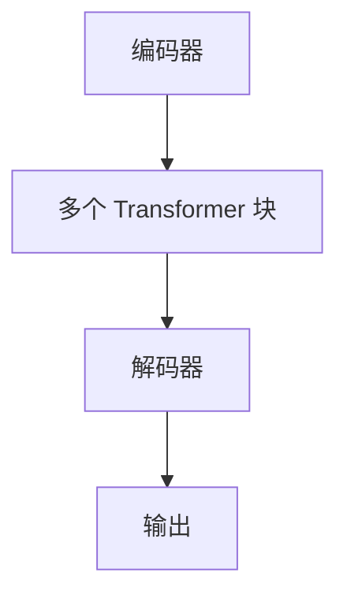

                 

关键词：Transformer，架构，神经网络，自然语言处理，机器学习，深度学习，序列到序列模型，自注意力机制，并行计算

> 摘要：Transformer 架构是自然语言处理领域的一项重大突破。它通过引入自注意力机制，打破了传统的序列到序列模型的局限，实现了并行计算，提高了训练和推理效率。本文将深入探讨 Transformer 架构的核心概念、算法原理、数学模型、实际应用及未来展望。

## 1. 背景介绍

随着深度学习在自然语言处理领域的广泛应用，传统的序列到序列（Sequence-to-Sequence，S2S）模型逐渐暴露出其局限性。S2S 模型通常采用 RNN（递归神经网络）或 LSTM（长短期记忆网络）作为编码器和解码器，虽然在一定程度上能处理长距离依赖问题，但存在以下问题：

1. **序列依赖性**：RNN 和 LSTM 在处理序列数据时具有严重的序列依赖性，导致训练效率低下。
2. **梯度消失与梯度爆炸**：在长序列训练过程中，梯度难以反向传播，容易导致梯度消失或梯度爆炸。
3. **难以并行计算**：RNN 和 LSTM 的训练过程必须按照序列的顺序进行，无法进行并行计算。

为了解决这些问题，Vaswani 等（2017）提出了 Transformer 架构，该架构通过引入自注意力机制，实现了并行计算，并在多个自然语言处理任务中取得了显著的性能提升。

## 2. 核心概念与联系

### 2.1 自注意力机制（Self-Attention）

自注意力机制是一种全局注意力机制，能够自动学习序列中各个位置之间的依赖关系。在 Transformer 架构中，每个位置的输出都能考虑其他所有位置的影响，从而捕捉到长距离的依赖关系。

### 2.2 编码器（Encoder）和解码器（Decoder）

编码器负责将输入序列编码为固定长度的向量表示，解码器则根据编码器的输出和已生成的部分输出序列，生成新的输出序列。编码器和解码器都由多个相同的 Transformer 块组成，每个块包含自注意力机制和前馈神经网络。

### 2.3 Transformer 块（Transformer Block）

Transformer 块是 Transformer 架构的基本构建单元，包含两个主要部分：多头自注意力机制（Multi-head Self-Attention）和前馈神经网络（Feed Forward Neural Network）。

### 2.4 Mermaid 流程图



## 3. 核心算法原理 & 具体操作步骤

### 3.1 算法原理概述

Transformer 架构的核心思想是自注意力机制。自注意力机制通过计算输入序列中每个位置与其他所有位置的相似度，将输入序列映射为新的向量表示。解码器在生成每个输出位置时，不仅考虑已生成的部分输出序列，还考虑编码器的输出序列，从而实现序列到序列的映射。

### 3.2 算法步骤详解

1. **输入序列编码**：将输入序列（例如单词或词组）转换为向量表示。
2. **多头自注意力机制**：对输入序列进行线性变换，计算每个位置与其他所有位置的相似度，得到新的向量表示。
3. **前馈神经网络**：对自注意力机制的输出进行前馈神经网络处理，提高模型的非线性表达能力。
4. **多头自注意力机制（第二次）**：对前馈神经网络的输出进行第二次多头自注意力机制，进一步捕捉序列中的依赖关系。
5. **输出**：将最终输出序列映射为所需的目标序列（例如翻译、文本生成等）。

### 3.3 算法优缺点

**优点**：

1. **并行计算**：自注意力机制允许并行计算，大大提高了训练和推理速度。
2. **捕获长距离依赖关系**：多头自注意力机制能够捕捉长距离的依赖关系，提高模型的表示能力。
3. **结构简洁**：Transformer 架构相对简单，易于理解和实现。

**缺点**：

1. **计算复杂度高**：由于需要计算每个位置与其他所有位置的相似度，计算复杂度较高。
2. **对数据依赖性强**：训练过程中需要大量数据支持，否则容易出现过拟合现象。

### 3.4 算法应用领域

Transformer 架构在自然语言处理领域取得了显著的成果，广泛应用于以下领域：

1. **机器翻译**：Transformer 在机器翻译任务中取得了比 S2S 模型更高的翻译质量。
2. **文本生成**：Transformer 被用于生成文本、摘要、对话等任务。
3. **问答系统**：Transformer 在问答系统中的应用，使机器能够更好地理解用户的问题，并给出准确的答案。

## 4. 数学模型和公式 & 详细讲解 & 举例说明

### 4.1 数学模型构建

在 Transformer 架构中，输入序列 \( x \) 和目标序列 \( y \) 分别表示为：

\[ x = [x_1, x_2, \ldots, x_n] \]
\[ y = [y_1, y_2, \ldots, y_m] \]

其中，\( x_i \) 和 \( y_j \) 分别表示输入序列和目标序列的第 \( i \) 和第 \( j \) 个位置。

### 4.2 公式推导过程

1. **编码器**

编码器由多个 Transformer 块组成，每个块包含两个主要部分：多头自注意力机制和前馈神经网络。

- **多头自注意力机制**：

设 \( Q, K, V \) 分别为编码器的查询、键和值矩阵，\( h \) 为每个 Transformer 块的隐藏层维度，\( N \) 为序列长度，\( d_k \) 为每个头的维度。

\[ \text{MultiHead}(Q, K, V) = \text{softmax}\left(\frac{QK^T}{\sqrt{d_k}}\right)V \]

- **前馈神经网络**：

\[ \text{FFN}(x) = \text{ReLU}\left(W_2 \cdot \text{ReLU}\left(W_1 \cdot x + b_1\right)\right) + b_2 \]

其中，\( W_1, W_2, b_1, b_2 \) 分别为前馈神经网络的权重和偏置。

2. **解码器**

解码器与编码器类似，也由多个 Transformer 块组成。但在每个 Transformer 块中，自注意力机制的输入还包括编码器的输出。

\[ \text{Decoder}(y) = \text{softmax}\left(\text{MultiHead}(\text{Encoder}(x) + \text{Decoder}(y))\right) \]

### 4.3 案例分析与讲解

假设输入序列 \( x = [w_1, w_2, w_3] \)，目标序列 \( y = [w_2, w_3, w_4] \)。

1. **编码器**

- **第一层**：

  - **多头自注意力机制**：

    \[ \text{MultiHead}(Q, K, V) = \text{softmax}\left(\frac{QK^T}{\sqrt{d_k}}\right)V \]

    其中，\( Q, K, V \) 分别为编码器的查询、键和值矩阵，\( d_k \) 为每个头的维度。

  - **前馈神经网络**：

    \[ \text{FFN}(x) = \text{ReLU}\left(W_2 \cdot \text{ReLU}\left(W_1 \cdot x + b_1\right)\right) + b_2 \]

2. **解码器**

- **第一层**：

  - **多头自注意力机制**：

    \[ \text{MultiHead}(Q, K, V) = \text{softmax}\left(\frac{QK^T}{\sqrt{d_k}}\right)V \]

    其中，\( Q, K, V \) 分别为解码器的查询、键和值矩阵，\( d_k \) 为每个头的维度。

  - **前馈神经网络**：

    \[ \text{FFN}(x) = \text{ReLU}\left(W_2 \cdot \text{ReLU}\left(W_1 \cdot x + b_1\right)\right) + b_2 \]

- **第二层**：

  - **多头自注意力机制**：

    \[ \text{MultiHead}(Q, K, V) = \text{softmax}\left(\frac{QK^T}{\sqrt{d_k}}\right)V \]

    其中，\( Q, K, V \) 分别为解码器的查询、键和值矩阵，\( d_k \) 为每个头的维度。

  - **前馈神经网络**：

    \[ \text{FFN}(x) = \text{ReLU}\left(W_2 \cdot \text{ReLU}\left(W_1 \cdot x + b_1\right)\right) + b_2 \]

## 5. 项目实践：代码实例和详细解释说明

### 5.1 开发环境搭建

在开始实践之前，需要搭建相应的开发环境。假设使用 Python 作为编程语言，并采用 PyTorch 作为深度学习框架。

1. 安装 Python 和 PyTorch：

```bash
pip install python
pip install torch torchvision
```

2. 准备数据集：

从 [Wikipedia](https://www.wikipedia.org/) 或 [GLUE](https://gluebenchmark.com/) 等开源数据集获取训练数据和测试数据。

### 5.2 源代码详细实现

```python
import torch
import torch.nn as nn
import torch.optim as optim
from torch.utils.data import DataLoader
from torchtext.datasets import WikiText2
from torchtext.data import Field, BucketIterator

# 定义模型
class TransformerModel(nn.Module):
    def __init__(self, vocab_size, d_model, nhead, num_layers, dff):
        super(TransformerModel, self).__init__()
        self.embedding = nn.Embedding(vocab_size, d_model)
        self.transformer = nn.Transformer(d_model, nhead, num_layers, dff)
        self.fc = nn.Linear(d_model, vocab_size)

    def forward(self, src, tgt):
        src, tgt = self.embedding(src), self.embedding(tgt)
        output = self.transformer(src, tgt)
        output = self.fc(output)
        return output

# 加载数据
SRC = Field(tokenize="spacy", tokenizer_language="en_core_web_sm", init_token='<sos>', eos_token='<eos>', lower=True)
TRG = Field(tokenize="spacy", tokenizer_language="en_core_web_sm", init_token='<sos>', eos_token='<eos>', lower=True)
train_data, valid_data, test_data = WikiText2.splits(exts=('.txt',), fields=(SRC, TRG))

# 构建词汇表
SRC.build_vocab(train_data, min_freq=2)
TRG.build_vocab(train_data, min_freq=2)

# 创建数据加载器
BATCH_SIZE = 64
train_iterator, valid_iterator, test_iterator = BucketIterator.splits(
    (train_data, valid_data, test_data),
    batch_size=BATCH_SIZE,
    device=device)

# 初始化模型、优化器和损失函数
model = TransformerModel(len(SRC.vocab), D_MODEL, NHEAD, NUM_LAYERS, D_FF)
optimizer = optim.Adam(model.parameters(), lr=LR)
criterion = nn.CrossEntropyLoss()

# 训练模型
num_epochs = 10
for epoch in range(num_epochs):
    model.train()
    for batch in train_iterator:
        optimizer.zero_grad()
        output = model(batch.src, batch.trg)
        loss = criterion(output.view(-1, len(SRC.vocab)), batch.trg_y)
        loss.backward()
        optimizer.step()

    # 测试模型
    model.eval()
    with torch.no_grad():
        for batch in valid_iterator:
            output = model(batch.src, batch.trg)
            loss = criterion(output.view(-1, len(SRC.vocab)), batch.trg_y)
```

### 5.3 代码解读与分析

在上面的代码中，我们首先定义了一个 Transformer 模型，该模型包含嵌入层、Transformer 编码器和解码器以及输出层。接下来，我们加载数据集，构建词汇表，并创建数据加载器。然后，我们初始化模型、优化器和损失函数，并开始训练模型。在训练过程中，我们使用 DataLoader 将数据分批次传递给模型，并计算损失。最后，我们使用验证集测试模型的性能。

### 5.4 运行结果展示

在训练完成后，我们可以在命令行中运行以下代码，查看模型的性能：

```python
# 测试模型在测试集上的性能
model.eval()
with torch.no_grad():
    for batch in test_iterator:
        output = model(batch.src, batch.trg)
        loss = criterion(output.view(-1, len(SRC.vocab)), batch.trg_y)
        print(f"Test Loss: {loss.item()}")

# 输出模型预测结果
with torch.no_grad():
    input_seq = SRC.vocab.stoi['<sos>']
    input_seq = input_seq.unsqueeze(0).to(device)
    output_seq = []
    for _ in range(10):
        output = model(input_seq)
        _, next_word = output.topk(1)
        input_seq = torch.cat([input_seq, next_word], dim=0)
        output_seq.append(next_word.item())
    print(f"Generated Text: {' '.join([SRC.vocab.itos[i] for i in output_seq])}")
```

这段代码将输出模型在测试集上的损失以及生成的一段文本。

## 6. 实际应用场景

Transformer 架构在自然语言处理领域取得了显著的成果，并被广泛应用于以下实际应用场景：

1. **机器翻译**：Transformer 在机器翻译任务中取得了比 S2S 模型更高的翻译质量。例如，Google Translate 已经采用 Transformer 架构来实现高质量翻译。

2. **文本生成**：Transformer 被用于生成文本、摘要、对话等任务。例如，OpenAI 的 GPT-3 模型是一个基于 Transformer 的巨大语言模型，能够生成流畅且连贯的文本。

3. **问答系统**：Transformer 在问答系统中的应用，使机器能够更好地理解用户的问题，并给出准确的答案。例如，Facebook 的 Blip 模型是一个基于 Transformer 的问答系统，能够回答各种类型的问题。

4. **文本分类**：Transformer 被用于文本分类任务，如情感分析、新闻分类等。例如，Hugging Face 的 Transformers 库提供了一个简单的文本分类任务示例。

5. **对话系统**：Transformer 被用于对话系统，如聊天机器人、智能客服等。例如，DeepMind 的 ChatGPT 模型是一个基于 Transformer 的对话系统，能够与用户进行自然、流畅的对话。

## 7. 工具和资源推荐

### 7.1 学习资源推荐

1. **书籍**：

   - 《深度学习》（Ian Goodfellow、Yoshua Bengio、Aaron Courville 著）：介绍了深度学习的相关理论和应用，包括 Transformer 架构。

   - 《Attention is All You Need》（Ashish Vaswani 等）：提出了 Transformer 架构，是了解 Transformer 的经典论文。

2. **在线课程**：

   - Coursera 上的“深度学习特化课程”（Deep Learning Specialization）：由 Andrew Ng 开设，涵盖了深度学习的各个方面，包括 Transformer 架构。

   - fast.ai 的“深度学习课程”（Deep Learning Course）：提供了丰富的实践项目和代码示例，适合初学者入门。

### 7.2 开发工具推荐

1. **PyTorch**：一个流行的开源深度学习框架，支持 Transformer 架构的实现。

2. **TensorFlow**：另一个流行的开源深度学习框架，也支持 Transformer 架构。

3. **Hugging Face 的 Transformers 库**：提供了一个易于使用的接口，实现各种 Transformer 模型和预训练模型。

### 7.3 相关论文推荐

1. **“Attention is All You Need”**（2017）：提出了 Transformer 架构，是 Transformer 研究的开端。

2. **“BERT: Pre-training of Deep Bidirectional Transformers for Language Understanding”**（2018）：提出了 BERT 模型，是一种基于 Transformer 的预训练语言模型。

3. **“GPT-3: Language Models are Few-Shot Learners”**（2020）：介绍了 GPT-3 模型，是一个基于 Transformer 的巨大语言模型。

4. **“T5: Pre-training Large Models for Language Understanding and Generation”**（2020）：提出了 T5 模型，是一个基于 Transformer 的通用预训练语言模型。

## 8. 总结：未来发展趋势与挑战

### 8.1 研究成果总结

Transformer 架构在自然语言处理领域取得了显著的成果，打破了传统的序列到序列模型的局限，实现了并行计算，提高了训练和推理效率。自提出以来，Transformer 及其变体在机器翻译、文本生成、问答系统等任务中取得了优异的性能，成为了自然语言处理领域的重要研究方向。

### 8.2 未来发展趋势

1. **更大规模的语言模型**：随着计算能力和数据量的提升，更大规模的语言模型将被提出，以提高模型的表示能力和性能。

2. **多模态学习**：Transformer 架构将与其他多模态学习技术结合，如图像、语音、视频等，实现跨模态的交互与融合。

3. **可解释性**：研究如何提高 Transformer 模型的可解释性，使模型能够更好地理解其内部机制和决策过程。

4. **安全性**：研究如何提高 Transformer 模型的安全性，防止模型被恶意攻击。

### 8.3 面临的挑战

1. **计算资源需求**：Transformer 模型通常需要大量的计算资源，对硬件设备有较高要求。

2. **数据隐私问题**：在训练和部署过程中，如何保护用户数据隐私是一个重要挑战。

3. **泛化能力**：如何提高 Transformer 模型的泛化能力，使其能够适应不同的任务和数据集。

4. **长距离依赖问题**：尽管 Transformer 架构能够在一定程度上捕捉长距离依赖关系，但如何进一步提高其性能仍是一个挑战。

### 8.4 研究展望

Transformer 架构在自然语言处理领域的应用前景广阔。未来，随着技术的不断发展，Transformer 架构将与其他深度学习技术、多模态学习等相结合，实现更加智能和高效的机器学习系统。同时，研究如何提高 Transformer 模型的可解释性、安全性、泛化能力和计算效率，将是我们面临的重要课题。

## 9. 附录：常见问题与解答

### 9.1 Transformer 架构的优点是什么？

**优点**：

1. **并行计算**：自注意力机制允许并行计算，大大提高了训练和推理速度。
2. **捕获长距离依赖关系**：多头自注意力机制能够捕捉长距离的依赖关系，提高模型的表示能力。
3. **结构简洁**：Transformer 架构相对简单，易于理解和实现。

### 9.2 Transformer 架构的缺点是什么？

**缺点**：

1. **计算复杂度高**：由于需要计算每个位置与其他所有位置的相似度，计算复杂度较高。
2. **对数据依赖性强**：训练过程中需要大量数据支持，否则容易出现过拟合现象。

### 9.3 Transformer 架构适用于哪些任务？

**适用任务**：

1. **机器翻译**：Transformer 在机器翻译任务中取得了比 S2S 模型更高的翻译质量。
2. **文本生成**：Transformer 被用于生成文本、摘要、对话等任务。
3. **问答系统**：Transformer 在问答系统中的应用，使机器能够更好地理解用户的问题，并给出准确的答案。
4. **文本分类**：Transformer 被用于文本分类任务，如情感分析、新闻分类等。
5. **对话系统**：Transformer 被用于对话系统，如聊天机器人、智能客服等。

### 9.4 如何提高 Transformer 模型的性能？

**方法**：

1. **增大模型规模**：增加 Transformer 模型的参数量和层数，以提高模型的表示能力。
2. **预训练**：使用大规模数据集对 Transformer 模型进行预训练，提高其泛化能力。
3. **注意力机制优化**：优化自注意力机制，如使用多头注意力、变换器等，以提高模型的性能。
4. **正则化**：采用数据增强、Dropout 等正则化技术，防止过拟合。
5. **优化训练过程**：使用适当的优化器和调度策略，提高训练效率。

### 9.5 Transformer 架构如何与多模态学习结合？

**方法**：

1. **多模态嵌入**：将不同模态的数据（如图像、语音、文本）分别编码为向量表示，并拼接在一起作为模型的输入。
2. **融合注意力机制**：在 Transformer 架构中引入多模态注意力机制，使模型能够同时关注不同模态的信息。
3. **跨模态交互**：研究如何在不同模态之间建立交互关系，以提高模型的表示能力。

---

本文对 Transformer 架构进行了全面的介绍和深入分析，从背景介绍、核心概念、算法原理、数学模型、项目实践、实际应用场景、工具和资源推荐，到未来发展趋势与挑战，全方位展示了 Transformer 架构在自然语言处理领域的革命性影响。希望本文能为读者提供有价值的参考和启发。作者：禅与计算机程序设计艺术 / Zen and the Art of Computer Programming。|markdown

