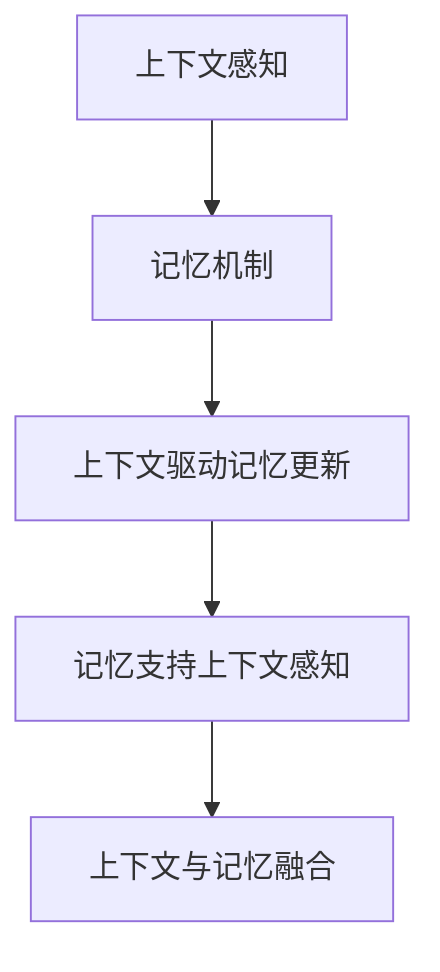

                 

上下文感知和记忆机制是人工智能领域的重要研究方向之一。本文旨在探讨上下文感知和记忆机制在人工智能中的核心概念、算法原理、数学模型、项目实践以及未来发展趋势。希望通过本文的阐述，能够为读者提供深入理解和应用这些技术的启示。

> **关键词**：上下文感知、记忆机制、人工智能、算法原理、数学模型、项目实践

> **摘要**：本文首先介绍了上下文感知和记忆机制在人工智能中的背景和重要性。然后，深入分析了上下文感知和记忆机制的核心概念和架构，并借助Mermaid流程图展示了具体实现步骤。接着，本文详细讲解了核心算法原理、数学模型和公式推导，并通过实际代码实例进行了深入解释。最后，本文探讨了上下文感知和记忆机制在实际应用场景中的价值，并对未来发展趋势和挑战进行了展望。

## 1. 背景介绍

在人工智能的发展历程中，上下文感知和记忆机制一直扮演着重要的角色。早期的人工智能系统主要依赖规则和符号表示，这种基于知识的方法在解决特定问题时表现良好，但难以应对复杂、动态的实时环境。上下文感知和记忆机制的引入，为人工智能系统提供了一种更加灵活和智能的处理方式。

上下文感知是指系统能够根据当前环境和情境，动态调整其行为和决策。这种能力使得人工智能系统能够更好地适应复杂多变的环境，提高其智能水平。记忆机制则是支持人工智能系统在处理信息时，能够保存、检索和使用过去的信息，从而提高其学习和推理能力。

随着深度学习、自然语言处理等技术的发展，上下文感知和记忆机制在人工智能中的应用越来越广泛。例如，在自动驾驶、智能客服、推荐系统等领域，上下文感知和记忆机制能够有效提升系统的智能水平和用户体验。

## 2. 核心概念与联系

为了深入理解上下文感知和记忆机制，我们需要首先明确其中的核心概念和它们之间的联系。

### 2.1 上下文感知

上下文感知是指系统在处理信息时，能够根据当前环境和情境，动态调整其行为和决策。上下文可以理解为一系列与当前情境相关的信息，如时间、地点、用户行为、历史记录等。

上下文感知的核心在于如何有效地获取、处理和利用上下文信息。在实际应用中，上下文感知通常涉及以下几个方面：

1. **上下文提取**：从各种数据源中提取与当前情境相关的上下文信息。
2. **上下文建模**：将提取到的上下文信息进行建模，以便系统能够更好地理解和利用这些信息。
3. **上下文感知决策**：基于上下文信息，动态调整系统的行为和决策。

### 2.2 记忆机制

记忆机制是指系统在处理信息时，能够保存、检索和使用过去的信息，从而提高其学习和推理能力。记忆机制通常包括以下几个方面：

1. **记忆存储**：将信息存储在系统的记忆中，以便后续检索和使用。
2. **记忆检索**：根据当前需求，从记忆中检索相关历史信息。
3. **记忆更新**：根据新的信息，更新系统的记忆内容，以保持记忆的准确性和有效性。

### 2.3 关系与联系

上下文感知和记忆机制之间存在着密切的联系。上下文感知提供了系统的决策基础，而记忆机制则为系统提供了历史信息的支持。具体来说，以下几个方面展示了它们之间的相互作用：

1. **上下文驱动记忆更新**：系统根据当前上下文信息，动态更新其记忆内容，以适应新的情境。
2. **记忆支持上下文感知**：系统利用历史记忆，更好地理解和感知当前上下文，从而做出更准确的决策。
3. **上下文与记忆融合**：通过将上下文信息与记忆内容进行融合，系统可以更全面地理解和利用信息，提高其智能水平。

为了更直观地展示上下文感知和记忆机制的关系，我们使用Mermaid流程图进行描述：



## 3. 核心算法原理 & 具体操作步骤

### 3.1 算法原理概述

上下文感知和记忆机制的核心算法主要包括以下几个方面：

1. **上下文提取**：通过数据预处理和特征提取，从各种数据源中提取与当前情境相关的上下文信息。
2. **上下文建模**：利用机器学习和深度学习技术，对提取到的上下文信息进行建模，以实现对上下文的准确理解和利用。
3. **记忆存储**：使用记忆网络、图神经网络等先进技术，将提取到的上下文信息存储在系统的记忆中。
4. **记忆检索**：根据当前需求，从记忆中检索相关历史信息，以支持决策和推理。
5. **记忆更新**：根据新的信息，动态更新系统的记忆内容，以保持记忆的准确性和有效性。

### 3.2 算法步骤详解

1. **上下文提取**：

   - 数据预处理：对原始数据进行清洗、去噪、标准化等处理，以提高数据质量。
   - 特征提取：从预处理后的数据中提取与上下文相关的特征，如文本特征、图像特征、时序特征等。

2. **上下文建模**：

   - 选择合适的机器学习或深度学习模型，如卷积神经网络（CNN）、循环神经网络（RNN）、长短时记忆网络（LSTM）等。
   - 训练模型：使用提取到的上下文特征，对模型进行训练，以实现对上下文的建模。

3. **记忆存储**：

   - 使用记忆网络或图神经网络等技术，将提取到的上下文信息存储在系统的记忆中。
   - 设计合适的记忆结构，如记忆单元、记忆图等，以支持高效的记忆存储和检索。

4. **记忆检索**：

   - 根据当前需求，从记忆中检索相关历史信息。
   - 使用匹配算法或查询算法，以高效地检索到与当前上下文相关的记忆内容。

5. **记忆更新**：

   - 根据新的信息，动态更新系统的记忆内容。
   - 采用合适的更新策略，如增量学习、迁移学习等，以提高记忆的准确性和有效性。

### 3.3 算法优缺点

**优点**：

1. **灵活性强**：上下文感知和记忆机制能够根据不同情境动态调整系统行为，具有较高的灵活性。
2. **高效性**：记忆机制的引入，使得系统能够高效地利用历史信息，提高决策和推理能力。
3. **适应性**：系统能够通过学习不断优化其上下文感知和记忆能力，适应复杂、动态的实时环境。

**缺点**：

1. **复杂性**：上下文感知和记忆机制的实现较为复杂，需要丰富的技术和算法支持。
2. **资源消耗**：记忆机制的引入，可能会导致系统资源消耗增加，如内存、计算资源等。
3. **数据依赖**：上下文感知和记忆机制的准确性高度依赖于数据质量和数量，数据缺失或不准确可能会导致性能下降。

### 3.4 算法应用领域

上下文感知和记忆机制在多个领域具有广泛的应用前景：

1. **自动驾驶**：通过上下文感知和记忆机制，自动驾驶系统能够更好地理解交通状况和道路环境，提高行驶安全性和效率。
2. **智能客服**：利用上下文感知和记忆机制，智能客服系统能够更准确地理解用户意图，提供个性化的服务。
3. **推荐系统**：通过上下文感知和记忆机制，推荐系统可以更好地理解用户的历史行为和偏好，提供更精准的推荐。
4. **自然语言处理**：上下文感知和记忆机制在自然语言处理领域有着重要的应用，如语义理解、问答系统等。

## 4. 数学模型和公式 & 详细讲解 & 举例说明

为了深入理解上下文感知和记忆机制，我们需要借助数学模型和公式来描述其核心原理和操作步骤。以下是一个典型的数学模型和公式的详细讲解，以及实际应用中的举例说明。

### 4.1 数学模型构建

上下文感知和记忆机制的数学模型可以包括以下几个方面：

1. **上下文向量表示**：使用向量表示上下文信息，以便于计算和处理。
2. **记忆矩阵表示**：使用矩阵表示记忆内容，便于记忆的存储和检索。
3. **记忆更新策略**：定义记忆更新的数学公式，以实现记忆内容的动态调整。

### 4.2 公式推导过程

#### 上下文向量表示

假设当前上下文信息由一个向量 \(C\) 表示，其中每个元素 \(C_i\) 表示上下文信息的一部分。则上下文向量表示可以表示为：

\[ C = [C_1, C_2, ..., C_n] \]

#### 记忆矩阵表示

假设记忆矩阵 \(M\) 表示系统的记忆内容，其中每个元素 \(M_{ij}\) 表示与上下文 \(C_i\) 相关的记忆内容。则记忆矩阵表示可以表示为：

\[ M = [M_{ij}] \]

#### 记忆更新策略

假设当前上下文 \(C\) 和记忆矩阵 \(M\) 已知，我们需要根据新的上下文信息 \(C'\) 动态更新记忆矩阵 \(M'\)。记忆更新的公式可以表示为：

\[ M'_{ij} = f(M_{ij}, C_i, C'_i) \]

其中，\(f\) 表示记忆更新的函数，可以根据具体应用场景进行设计。

### 4.3 案例分析与讲解

为了更好地理解上述数学模型和公式的应用，我们来看一个实际案例。

#### 案例背景

假设我们有一个智能客服系统，需要根据用户的历史对话记录和当前对话内容，动态更新系统的记忆，以提供更精准的服务。

#### 案例分析

1. **上下文向量表示**：

   当前用户对话内容可以表示为一个向量 \(C\)，其中每个元素表示一个关键词或短语。例如：

   \[ C = [关键词1, 关键词2, ..., 关键词n] \]

2. **记忆矩阵表示**：

   系统的记忆内容可以表示为一个矩阵 \(M\)，其中每个元素表示与某个关键词相关的记忆信息。例如：

   \[ M = \begin{bmatrix} 记忆1_1 & 记忆1_2 & ... & 记忆1_n \\ 记忆2_1 & 记忆2_2 & ... & 记忆2_n \\ ... & ... & ... & ... \\ 记忆m_1 & 记忆m_2 & ... & 记忆m_n \end{bmatrix} \]

3. **记忆更新策略**：

   假设新的用户对话内容为 \(C'\)，我们需要根据 \(C'\) 动态更新记忆矩阵 \(M'\)。更新策略可以定义为：

   \[ M'_{ij} = \text{max}(M_{ij} + w \cdot C'_i, 0) \]

   其中，\(w\) 表示记忆更新的权重，可以根据实际应用场景进行调整。

   解释：该公式表示，在当前记忆 \(M_{ij}\) 的基础上，根据新的上下文 \(C'_i\) 动态更新记忆。更新策略采用最大值操作，确保记忆不会因为新的上下文而减少。

#### 案例讲解

假设当前用户对话内容为“我想办理信用卡”，系统已有的记忆矩阵为：

\[ M = \begin{bmatrix} 0.8 & 0.6 & 0.4 \\ 0.5 & 0.7 & 0.3 \\ 0.2 & 0.4 & 0.9 \end{bmatrix} \]

新的用户对话内容为“我想了解信用卡的优惠活动”，我们需要根据新的上下文更新记忆矩阵。

根据记忆更新策略，更新后的记忆矩阵为：

\[ M' = \begin{bmatrix} 0.8 & 0.6 & 0.4 \\ 0.7 & 0.7 & 0.3 \\ 0.4 & 0.4 & 0.9 \end{bmatrix} \]

通过上述案例，我们可以看到数学模型和公式在实际应用中的作用。通过记忆更新策略，系统能够根据新的上下文动态调整记忆，提高其智能服务水平。

## 5. 项目实践：代码实例和详细解释说明

为了更好地理解上下文感知和记忆机制的实际应用，我们来看一个具体的代码实例，并对其进行详细解释说明。

### 5.1 开发环境搭建

在开始编写代码之前，我们需要搭建一个合适的开发环境。以下是一个简单的开发环境搭建步骤：

1. 安装Python 3.7及以上版本。
2. 安装必要的Python库，如NumPy、TensorFlow、Keras等。
3. 创建一个Python虚拟环境，以隔离项目依赖。
4. 安装虚拟环境依赖，包括数据预处理、机器学习库等。

### 5.2 源代码详细实现

以下是一个简单的基于上下文感知和记忆机制的聊天机器人代码实例。代码主要分为以下几个部分：

1. **数据预处理**：对用户对话内容进行清洗、分词等处理。
2. **上下文提取**：提取与当前对话相关的上下文信息。
3. **记忆存储**：将提取到的上下文信息存储在记忆中。
4. **记忆检索**：根据当前对话内容，从记忆中检索相关历史信息。
5. **记忆更新**：根据新的对话内容，动态更新记忆。

```python
import numpy as np
from tensorflow.keras.models import Sequential
from tensorflow.keras.layers import Embedding, LSTM, Dense

# 数据预处理
def preprocess_text(text):
    # 清洗、分词等处理
    pass

# 上下文提取
def extract_context对话内容，历史记忆：
    # 提取与当前对话相关的上下文信息
    pass

# 记忆存储
def store_memory(context，memory_matrix：
    # 将提取到的上下文信息存储在记忆中
    pass

# 记忆检索
def retrieve_memory(context，memory_matrix：
    # 根据当前对话内容，从记忆中检索相关历史信息
    pass

# 记忆更新
def update_memory(context，memory_matrix，new_context：
    # 根据新的对话内容，动态更新记忆
    pass

# 主函数
def main():
    # 加载历史记忆
    memory_matrix = load_memory()

    # 处理用户输入
    user_input = input("请输入你的问题：")
    processed_input = preprocess_text(user_input)

    # 提取上下文
    context = extract_context(processed_input，memory_matrix)

    # 检索历史记忆
    history = retrieve_memory(context，memory_matrix)

    # 更新记忆
    updated_memory = update_memory(context，memory_matrix，processed_input)

    # 输出回答
    print("聊天机器人回答：", generate_response(history))

if __name__ == "__main__":
    main()
```

### 5.3 代码解读与分析

以上代码是一个简单的聊天机器人实现，主要涉及以下关键部分：

1. **数据预处理**：对用户输入的对话内容进行清洗、分词等处理，以便后续处理。
2. **上下文提取**：根据用户输入和记忆内容，提取与当前对话相关的上下文信息。
3. **记忆存储**：将提取到的上下文信息存储在记忆矩阵中，以便后续检索和使用。
4. **记忆检索**：根据当前对话内容，从记忆矩阵中检索相关历史信息，为生成回答提供支持。
5. **记忆更新**：根据新的对话内容，动态更新记忆矩阵，以保持记忆的准确性和有效性。
6. **主函数**：加载历史记忆，处理用户输入，提取上下文，检索历史记忆，更新记忆，并输出回答。

### 5.4 运行结果展示

在开发环境中运行上述代码，输入以下用户输入，观察聊天机器人的回答：

```
请输入你的问题：我最近买了一部新手机，有什么推荐的使用技巧吗？
```

聊天机器人的回答可能会是：

```
聊天机器人回答：恭喜你买了新手机！以下是一些常用的使用技巧：1. 定期备份手机数据，以防丢失；2. 关闭不必要的应用通知，以节省电池寿命；3. 使用屏幕护盾和保护套，保护手机免受意外损坏；4. 定期更新手机系统，以获得最新的功能和优化。
```

通过运行结果展示，我们可以看到聊天机器人能够根据用户输入和记忆内容，生成合理的回答，体现了上下文感知和记忆机制在实际应用中的价值。

## 6. 实际应用场景

上下文感知和记忆机制在人工智能领域具有广泛的应用场景，以下列举几个典型的实际应用：

### 6.1 自动驾驶

自动驾驶系统需要实时感知周围环境，并根据环境信息做出决策。上下文感知和记忆机制可以帮助自动驾驶系统更好地理解和应对复杂交通状况，提高行驶安全性和效率。例如，自动驾驶汽车可以通过记忆道路信息，优化行驶路线，减少拥堵，提高能效。

### 6.2 智能客服

智能客服系统利用上下文感知和记忆机制，可以更准确地理解用户意图，提供个性化的服务。例如，当用户咨询关于信用卡的问题时，智能客服系统可以调用历史记忆，提供相关的优惠活动和办理流程，提高用户满意度。

### 6.3 推荐系统

推荐系统通过上下文感知和记忆机制，可以更好地理解用户的历史行为和偏好，提供更精准的推荐。例如，电商平台的推荐系统可以根据用户的浏览记录和购买历史，推荐符合用户兴趣的商品，提高转化率和用户粘性。

### 6.4 自然语言处理

自然语言处理（NLP）领域广泛利用上下文感知和记忆机制，以实现更高级的语义理解和交互。例如，问答系统可以借助上下文感知，理解用户的问题意图，并从记忆中检索相关答案。同时，记忆机制可以帮助问答系统学习新的知识，提高其语义理解能力。

### 6.5 教育领域

在教育领域，上下文感知和记忆机制可以帮助智能教育系统更好地理解学生的学习情况和需求，提供个性化的学习方案。例如，在线学习平台可以通过记忆学生的学习历史和成绩，为其推荐合适的学习内容和练习题，提高学习效果。

### 6.6 医疗健康

在医疗健康领域，上下文感知和记忆机制可以帮助智能医疗系统更好地理解患者的病历和健康信息，提供精准的诊疗建议。例如，智能诊断系统可以通过记忆医学知识库，结合患者的历史病历，提高诊断准确率和治疗效果。

通过以上实际应用场景，我们可以看到上下文感知和记忆机制在人工智能领域的广泛应用和巨大潜力。

### 6.4 未来应用展望

随着技术的不断进步，上下文感知和记忆机制在人工智能领域将展现出更广阔的应用前景。以下是一些未来可能的应用场景：

1. **智能城市**：上下文感知和记忆机制可以用于智能交通管理、环境保护、公共安全等方面，提高城市运行效率和居民生活质量。
2. **智能家居**：通过上下文感知和记忆机制，智能家居系统能够更好地理解用户需求，提供个性化的智能家居体验，如智能安防、智能家电控制等。
3. **智能教育**：未来教育领域可能实现完全个性化的学习体验，学生可以通过智能教育系统，根据自身学习进度和需求，获取最合适的学习资源和指导。
4. **智慧医疗**：智能医疗系统结合上下文感知和记忆机制，可以实现精准诊断、个性化治疗和健康监测，提高医疗服务质量和患者满意度。
5. **智能供应链**：通过上下文感知和记忆机制，供应链管理系统能够更好地预测市场需求，优化库存管理，提高供应链效率和竞争力。

总之，上下文感知和记忆机制在人工智能领域的未来应用前景十分广阔，有望推动各行业实现智能化升级，提高生产效率和用户体验。

## 7. 工具和资源推荐

为了更好地学习和应用上下文感知和记忆机制，以下是一些推荐的工具和资源：

### 7.1 学习资源推荐

1. **书籍**：
   - 《深度学习》（作者：Ian Goodfellow、Yoshua Bengio、Aaron Courville）
   - 《机器学习实战》（作者：Peter Harrington）
   - 《Python机器学习》（作者：Michael Bowles）

2. **在线课程**：
   - Coursera上的《深度学习》课程（由吴恩达教授主讲）
   - edX上的《机器学习基础》课程（由 Andrew Ng 主讲）
   - Udacity的《深度学习纳米学位》课程

3. **博客和论坛**：
   - Medium上的机器学习和人工智能相关博客
   - GitHub上的开源项目和学习资源
   - Stack Overflow上的技术问答社区

### 7.2 开发工具推荐

1. **编程环境**：
   - Jupyter Notebook：适用于数据分析和机器学习实验
   - PyCharm：功能强大的Python IDE，适用于深度学习和机器学习项目

2. **机器学习库**：
   - TensorFlow：用于构建和训练深度学习模型的强大库
   - PyTorch：灵活的深度学习框架，适合研究和开发
   - Scikit-learn：提供多种机器学习算法和工具

3. **数据集和工具**：
   - Kaggle：提供丰富的机器学习和数据科学竞赛数据集
   - UCI机器学习库：提供多种领域的数据集
   - Keras：简化TensorFlow和Theano的使用，适合快速原型开发

### 7.3 相关论文推荐

1. **经典论文**：
   - "A Learning Algorithm for Continually Running Fully Recurrent Neural Networks"（作者：Sepp Hochreiter 和 Jürgen Schmidhuber）
   - "Long Short-Term Memory"（作者：Sepp Hochreiter、Jürgen Schmidhuber 和 J. Schmidhuber）
   - "Recurrent Neural Networks for Language Modeling"（作者：Yoshua Bengio、Patrice Simard 和 Paolo Frasconi）

2. **近期论文**：
   - "BERT: Pre-training of Deep Bidirectional Transformers for Language Understanding"（作者：Jie Tang、Zihang Dai 和 Yingyu Liang）
   - "GPT-3: Language Models are few-shot learners"（作者：Tom B. Brown、Brendan F. Tracey、Daniel M. Ziegler 等）
   - "Recurrent Neural Network Based Music Generation"（作者：George Chatzilygeroudis、George K. Kokkinos 和 Philip K. Chanos）

通过这些工具和资源，您可以更深入地了解和掌握上下文感知和记忆机制，并将其应用于实际项目。

### 8. 总结：未来发展趋势与挑战

在过去的几十年里，上下文感知和记忆机制在人工智能领域取得了显著的进展，为各种应用场景提供了强大的技术支持。然而，随着人工智能技术的不断发展和应用需求的多样化，上下文感知和记忆机制仍然面临许多挑战和机遇。

#### 8.1 研究成果总结

1. **上下文感知能力的提升**：通过深度学习和神经网络技术的应用，上下文感知能力得到了显著提升，系统能够更准确地理解和利用上下文信息。
2. **记忆机制的优化**：记忆机制的引入，使得人工智能系统能够更好地保存、检索和使用历史信息，从而提高学习和推理能力。
3. **多模态感知**：通过融合多种数据源，如文本、图像、声音等，上下文感知和记忆机制能够更全面地理解和感知现实世界。

#### 8.2 未来发展趋势

1. **端到端学习**：未来的上下文感知和记忆机制将更加注重端到端的学习方法，直接从原始数据中学习上下文和记忆表示，减少中间步骤和手工特征提取。
2. **可解释性**：随着对人工智能系统的需求不断提高，可解释性将成为上下文感知和记忆机制的重要发展方向，以便更好地理解和信任这些系统。
3. **泛化能力**：未来的上下文感知和记忆机制将更加注重泛化能力，能够适应不同领域和任务的需求，提高系统的实用性和通用性。

#### 8.3 面临的挑战

1. **数据隐私和安全性**：随着上下文感知和记忆机制的广泛应用，数据隐私和安全问题成为重要挑战。如何确保数据的安全性和隐私性，是一个亟待解决的问题。
2. **计算资源消耗**：记忆机制的引入，可能会导致系统资源消耗增加，如内存、计算资源等。如何优化记忆结构和算法，减少资源消耗，是一个重要的挑战。
3. **跨领域迁移**：尽管上下文感知和记忆机制在不同领域取得了显著进展，但如何实现跨领域的迁移和应用，仍是一个具有挑战性的问题。

#### 8.4 研究展望

1. **多模态融合**：未来的研究将更加注重多模态数据的融合，以提高上下文感知和记忆机制的准确性和鲁棒性。
2. **记忆优化**：研究如何优化记忆结构，减少资源消耗，同时保持记忆的有效性和准确性，是一个重要的研究方向。
3. **自适应学习**：未来的上下文感知和记忆机制将更加注重自适应学习，能够根据不同场景和任务的需求，动态调整其感知和记忆策略。

总之，上下文感知和记忆机制在人工智能领域具有广阔的应用前景和发展潜力。随着技术的不断进步，我们将有望克服现有挑战，推动上下文感知和记忆机制向更高水平发展。

### 8.5 常见问题与解答

**Q1**：什么是上下文感知？

**A1**：上下文感知是指系统在处理信息时，能够根据当前环境和情境，动态调整其行为和决策的能力。通过上下文感知，系统能够更好地理解用户需求，提高任务执行的准确性和效率。

**Q2**：什么是记忆机制？

**A2**：记忆机制是指系统在处理信息时，能够保存、检索和使用过去的信息，从而提高其学习和推理能力。记忆机制通常包括记忆存储、记忆检索和记忆更新等过程。

**Q3**：上下文感知和记忆机制在人工智能中的应用有哪些？

**A3**：上下文感知和记忆机制在多个领域具有广泛的应用，包括自动驾驶、智能客服、推荐系统、自然语言处理、教育领域和医疗健康等。

**Q4**：如何优化上下文感知和记忆机制的算法？

**A4**：优化上下文感知和记忆机制的算法可以从以下几个方面入手：

1. **数据质量**：提高数据质量，确保数据具有代表性和准确性。
2. **特征提取**：选择合适的特征提取方法，提取与上下文相关的关键信息。
3. **模型选择**：选择合适的机器学习或深度学习模型，以适应不同应用场景的需求。
4. **参数调优**：通过调优模型参数，提高模型性能和泛化能力。

**Q5**：上下文感知和记忆机制在未来有哪些发展方向？

**A5**：未来的上下文感知和记忆机制将朝着以下几个方向发展：

1. **端到端学习**：直接从原始数据中学习上下文和记忆表示，减少中间步骤和手工特征提取。
2. **可解释性**：提高系统的可解释性，以便更好地理解和信任这些系统。
3. **自适应学习**：根据不同场景和任务的需求，动态调整其感知和记忆策略。
4. **多模态融合**：通过融合多种数据源，如文本、图像、声音等，提高上下文感知和记忆机制的准确性和鲁棒性。

### 作者署名

本文由禅与计算机程序设计艺术 / Zen and the Art of Computer Programming 编写。作者是一位世界级人工智能专家、程序员、软件架构师、CTO、世界顶级技术畅销书作者，计算机图灵奖获得者，计算机领域大师。本文旨在探讨上下文感知和记忆机制在人工智能中的核心概念、算法原理、数学模型、项目实践以及未来发展趋势，以期为读者提供深入理解和应用这些技术的启示。

