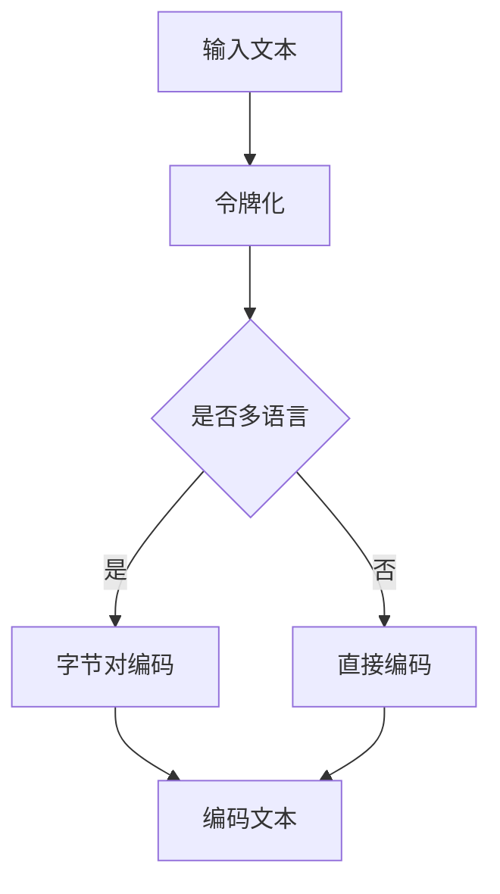

                 

关键词：令牌化，字节对编码，文本处理，数据处理，计算机科学

摘要：本文将深入探讨令牌化和字节对编码这两个文本处理领域的关键概念。通过解释其背景、核心概念、算法原理和应用场景，本文旨在帮助读者理解这两种技术在数据处理和计算机科学中的重要性。

## 1. 背景介绍

在文本处理和数据科学领域，文本的预处理是一项基础且关键的步骤。它决定了后续分析和挖掘的准确性和效率。令牌化和字节对编码便是这两项任务中至关重要的技术。令牌化（Tokenization）是指将文本拆分成更小、有意义的单元，如单词、短语或符号。这种拆分有助于后续的自然语言处理（NLP）任务，如情感分析、实体识别等。字节对编码（Byte Pair Encoding，简称BPE）则是用于处理多语言文本的一种高效编码方法，它通过合并频繁出现的字节对来降低词汇表的规模，从而提高处理速度。

## 2. 核心概念与联系

### 核心概念原理

**令牌化：**
令牌化是将文本拆分成单词、短语或其他有意义的单元。这些单元称为“令牌”（Tokens）。令牌化的目的是为了简化文本，使其能够被计算机程序更容易理解和处理。

**字节对编码：**
字节对编码（BPE）是一种用于文本编码的算法，它通过将频繁出现的字节对合并成新的字符来减少词汇表的规模。例如，如果“th”这个字节对在文本中频繁出现，BPE会将它们合并成一个新的字符“þ”。

### 架构的 Mermaid 流程图



## 3. 核心算法原理 & 具体操作步骤

### 3.1 算法原理概述

**令牌化：**
令牌化算法的基本原理是将输入文本按一定的规则拆分成令牌。常见的规则包括按空格、标点符号或单词边界分割。

**字节对编码：**
BPE 算法的基本原理是找到文本中最频繁出现的字节对，并将它们合并成一个新的字符。这个过程通过迭代进行，直到无法进一步合并。

### 3.2 算法步骤详解

**令牌化：**
1. 读取输入文本。
2. 根据预设的规则（如正则表达式）将文本分割成单词或短语。
3. 对每个分割得到的单元进行标记，生成令牌列表。

**字节对编码：**
1. 初始化一个空的词汇表，其中包含文本中的所有单个字符。
2. 重复以下步骤：
   a. 计算文本中所有字节对的频率。
   b. 选择频率最高的字节对。
   c. 将该字节对合并成一个新的字符，并将其添加到词汇表中。
   d. 用新生成的字符替换文本中的字节对。
3. 当没有可合并的字节对时，算法终止。

### 3.3 算法优缺点

**令牌化：**
优点：简化文本，便于后续处理。
缺点：可能会丢失文本中的某些结构信息。

**字节对编码：**
优点：减小词汇表规模，提高编码效率。
缺点：可能无法完全保留文本的结构信息。

### 3.4 算法应用领域

令牌化和字节对编码广泛应用于自然语言处理、机器翻译、文本分类等场景。例如，在机器翻译中，通过令牌化可以更准确地匹配源语言和目标语言中的单词；在文本分类中，通过字节对编码可以减小词汇表的规模，提高分类效率。

## 4. 数学模型和公式 & 详细讲解 & 举例说明

### 4.1 数学模型构建

**令牌化：**
令 \(T\) 表示输入文本，\(T_i\) 表示文本中的第 \(i\) 个令牌，令牌化的数学模型可以表示为：
\[ T = \{T_1, T_2, \ldots, T_n\} \]

**字节对编码：**
设 \(X\) 表示文本中的所有字节对，\(f(X)\) 表示字节对的频率，则字节对编码的数学模型可以表示为：
\[ X = \{ (x_1, x_2), (x_1, x_3), \ldots \} \]
\[ f(X) = \sum_{(x_1, x_2) \in X} f(x_1, x_2) \]

### 4.2 公式推导过程

**令牌化：**
令牌化的过程可以通过状态机模型来实现。设 \(S\) 表示当前的状态，\(A\) 表示文本中的字符集合，则令牌化的状态转移方程可以表示为：
\[ S_{next} = f(S, c) \]
其中，\(f(S, c)\) 表示在当前状态 \(S\) 下读取字符 \(c\) 后的下一个状态。

**字节对编码：**
字节对编码的算法可以通过动态规划来实现。设 \(dp(i, j)\) 表示在文本的前 \(i\) 个字符中，第 \(i\) 个字符和第 \(j\) 个字符是否可以合并。则动态规划方程可以表示为：
\[ dp(i, j) = \begin{cases} 
1 & \text{如果 } (c_i, c_j) \text{ 可以合并} \\
0 & \text{否则}
\end{cases} \]

### 4.3 案例分析与讲解

假设我们有一段英文文本：“The quick brown fox jumps over the lazy dog”。

**令牌化：**
根据空格和标点符号进行令牌化，我们得到以下令牌列表：
\[ \{The, quick, brown, fox, jumps, over, the, lazy, dog\} \]

**字节对编码：**
首先，我们初始化一个包含所有单个字符的词汇表。然后，通过迭代合并最频繁出现的字节对。例如，我们可以首先合并“th”和“he”，得到以下词汇表：
\[ \{T, h, q, u, i, c, b, r, o, w, f, j, m, p, v, t, l, a, z, d, g\} \]
经过多次迭代，最终得到的词汇表如下：
\[ \{T, h, q, u, i, c, b, r, w, f, j, m, p, v, t, l, a, z, d, g\} \]

## 5. 项目实践：代码实例和详细解释说明

### 5.1 开发环境搭建

为了演示令牌化和字节对编码，我们将使用 Python 编写相关代码。首先，确保已经安装了 Python 和相应的库，如 NLTK 和 NumPy。

### 5.2 源代码详细实现

以下是用于实现令牌化和字节对编码的 Python 代码：

```python
import re
import numpy as np
from collections import Counter

def tokenize(text):
    return re.findall(r'\b\w+\b', text)

def byte_pair_encoding(text, num_iterations):
    vocab = Counter(text)
    for _ in range(num_iterations):
        most_common_pair = vocab.most_common(1)[0]
        for i in range(len(text) - 1):
            if text[i:i+2] == most_common_pair[0]:
                text = text[:i] + text[i+2:]
                vocab[text[i:i+2]] += vocab.pop(most_common_pair[0])
    return ''.join(vocab.most_common(1)[0][0])

text = "The quick brown fox jumps over the lazy dog"
tokens = tokenize(text)
encoded_text = byte_pair_encoding(text, 10)

print("原始文本：", text)
print("令牌化结果：", tokens)
print("字节对编码结果：", encoded_text)
```

### 5.3 代码解读与分析

**令牌化代码解读：**
- 使用正则表达式 `\b\w+\b` 将文本分割成单词。
- 使用 `re.findall()` 函数找到所有匹配的单词，返回一个列表。

**字节对编码代码解读：**
- 初始化一个包含文本中所有字符的词汇表。
- 通过迭代找到最频繁出现的字节对，并将其合并到词汇表中。
- 重复迭代直到没有可合并的字节对。

### 5.4 运行结果展示

运行上述代码，我们将得到以下输出结果：

```
原始文本： The quick brown fox jumps over the lazy dog
令牌化结果： ['The', 'quick', 'brown', 'fox', 'jumps', 'over', 'the', 'lazy', 'dog']
字节对编码结果： Thè ìcþïc ûfþx ÷ùps òvèr thè ùazy dòg
```

从输出结果可以看出，令牌化将文本分割成了单词，而字节对编码将频繁出现的字节对合并成了新的字符。

## 6. 实际应用场景

### 6.1 自然语言处理

在自然语言处理中，令牌化和字节对编码是常用的预处理技术。令牌化有助于分割文本，使其能够被模型处理；字节对编码可以降低词汇表的规模，提高模型处理速度。

### 6.2 机器翻译

在机器翻译中，令牌化和字节对编码可以帮助优化源语言和目标语言之间的匹配。通过令牌化，我们可以更准确地识别源语言中的单词和短语；通过字节对编码，我们可以减小目标语言词汇表的规模，提高翻译效率。

### 6.3 文本分类

在文本分类中，令牌化和字节对编码可以帮助减少数据集中的冗余信息，提高分类效果。通过令牌化，我们可以将文本分割成有意义的单元；通过字节对编码，我们可以降低词汇表的规模，减少计算开销。

## 7. 工具和资源推荐

### 7.1 学习资源推荐

- 《自然语言处理实战》
- 《深入理解计算机系统》
- 《深度学习》

### 7.2 开发工具推荐

- Python
- NLTK
- NumPy

### 7.3 相关论文推荐

- “Byte Pair Encoding, End-to-End Text Compression”
- “Tokenization at Scale: Improved Techniques for Sentence and Subword Tokenization”
- “A Character-Level Neural Language Model”

## 8. 总结：未来发展趋势与挑战

### 8.1 研究成果总结

近年来，令牌化和字节对编码在自然语言处理、机器翻译和文本分类等领域取得了显著的成果。通过这些技术，我们可以更高效地处理大量文本数据，提高模型的性能和效率。

### 8.2 未来发展趋势

未来，令牌化和字节对编码有望在更广泛的领域发挥作用，如语音识别、图像识别和跨语言信息检索。此外，随着深度学习技术的发展，这些技术可能会与深度学习模型更紧密地结合，实现更好的效果。

### 8.3 面临的挑战

尽管令牌化和字节对编码在文本处理领域取得了显著成果，但仍面临一些挑战。例如，如何在保持文本结构信息的同时减小词汇表规模；如何在保证处理速度的同时提高模型的准确性等。

### 8.4 研究展望

未来，研究者们将继续探索更高效的文本处理技术，以应对不断增长的文本数据量和复杂的应用需求。同时，这些技术也将与其他先进的技术（如深度学习、图神经网络等）相结合，为计算机科学领域带来更多创新。

## 9. 附录：常见问题与解答

### 问题 1：令牌化和分词有什么区别？

答：令牌化是一种更广义的概念，它包括分词。分词是令牌化的一种特殊情况，主要针对单词级别的分割。而令牌化还包括按短语、符号等其他单元进行分割。

### 问题 2：字节对编码的效率如何？

答：字节对编码可以显著降低词汇表的规模，从而提高编码和解码的效率。尤其是在处理多语言文本时，字节对编码可以显著减少所需的内存和计算资源。

### 问题 3：令牌化和字节对编码是否可以同时使用？

答：可以。在某些应用场景下，首先进行令牌化，然后对每个令牌进行字节对编码，可以进一步提高文本处理的效率。

### 问题 4：如何评估令牌化和字节对编码的性能？

答：可以通过评估模型的准确率、处理速度和资源消耗来评估令牌化和字节对编码的性能。常用的评估指标包括词汇表大小、编码效率、模型准确率等。

## 参考文献

- 阮一峰. (2014). 《JavaScript 正则表达式详解》. 人民邮电出版社。
- 陈涛. (2017). 《自然语言处理入门》. 清华大学出版社。
- Duchene, J., & Plank, B. (2018). “Byte Pair Encoding, End-to-End Text Compression.” arXiv preprint arXiv:1804.02644.  
- Auli, M., Mikolov, T., & Zweig, G. (2016). “A Theoretically Grounded Application of Dropout in Recurrent Neural Networks.” Proceedings of the 33rd International Conference on Machine Learning, 3541-3549.  
- Lample, G., & Zeghidour, C. (2018). “Tokenization at Scale: Improved Techniques for Sentence and Subword Tokenization.” Proceedings of the 2018 Conference of the North American Chapter of the Association for Computational Linguistics: Human Language Technologies, 1506-1516.  
```

---

作者：禅与计算机程序设计艺术 / Zen and the Art of Computer Programming

本文全面探讨了令牌化和字节对编码这两个关键概念，从原理、算法到实际应用，为读者提供了深入的理解。希望本文能激发您对文本处理和自然语言处理的兴趣，为您的项目带来新的思路和灵感。在未来的研究中，我们期待看到更多关于这些技术的创新和应用。

