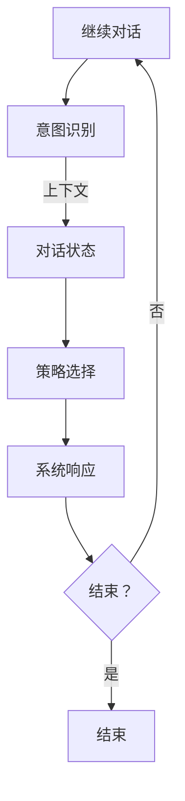

                 

关键词：对话管理、状态管理、人工智能、自然语言处理、编程、架构设计、模型、算法、应用场景、展望

> 摘要：本章将深入探讨对话管理和状态管理在人工智能领域的核心作用。通过介绍关键概念、算法原理、数学模型，以及实际应用案例，我们将揭示这两大机制如何助力智能系统的设计与实现，为未来的发展提供新的视角和思路。

## 1. 背景介绍

随着人工智能技术的迅猛发展，自然语言处理（NLP）和机器学习（ML）成为了当前研究的热点领域。在这一背景下，对话管理和状态管理成为了实现智能交互系统的重要组成部分。对话管理（Dialogue Management）主要关注如何构建和维护对话流程，使得系统能够理解用户意图并给出恰当的回应。状态管理（State Management）则侧重于在对话过程中跟踪和处理系统内部状态的变化，确保对话的连贯性和一致性。

传统的对话系统和状态管理系统多采用规则驱动或模型驱动的方式，但在面对复杂多变的用户需求和动态变化的环境时，往往显得力不从心。因此，如何设计一个高效、灵活、智能的对话管理和状态管理系统成为了当前研究的重要课题。

## 2. 核心概念与联系

### 2.1. 对话管理

对话管理旨在实现人与机器之间的自然交流。其核心概念包括：

- **用户意图识别**：通过自然语言处理技术，从用户的输入中提取意图。
- **上下文跟踪**：在对话过程中，系统需要跟踪当前对话的状态，包括用户的历史输入和系统的历史回应。
- **对话策略**：系统根据当前的对话状态和用户意图，选择合适的回应动作。

### 2.2. 状态管理

状态管理则是确保对话流程中系统的内部状态保持一致。关键概念包括：

- **状态存储**：系统需要将当前对话状态存储下来，以便后续对话中使用。
- **状态转换**：在对话过程中，系统状态会根据用户的输入和系统的响应而发生变化。
- **状态恢复**：当系统遇到错误或异常时，需要能够恢复到正常状态。

### 2.3. Mermaid 流程图

为了更好地理解对话管理和状态管理的流程，我们可以使用 Mermaid 流程图进行描述：



## 3. 核心算法原理 & 具体操作步骤

### 3.1. 算法原理概述

对话管理和状态管理涉及多个核心算法，包括意图识别、对话状态跟踪、策略选择等。这些算法通常基于深度学习、概率图模型和强化学习等技术。

- **意图识别**：利用序列标注或分类算法，从用户的输入中提取意图。
- **对话状态跟踪**：使用历史记忆网络或图神经网络来跟踪对话状态。
- **策略选择**：采用强化学习或基于规则的策略优化方法。

### 3.2. 算法步骤详解

以下是具体操作步骤：

1. **意图识别**：输入用户输入文本，通过自然语言处理技术提取出用户意图。
2. **对话状态更新**：根据用户意图和当前对话状态，更新系统的对话状态。
3. **策略选择**：系统根据当前对话状态和用户意图，选择最佳回应动作。
4. **系统响应**：执行选择的回应动作，生成系统回应文本。
5. **状态恢复**：在对话过程中，系统需要能够恢复到正常状态，以便继续对话。

### 3.3. 算法优缺点

- **优点**：
  - **高效性**：利用深度学习和强化学习技术，可以快速识别用户意图和选择最佳回应。
  - **灵活性**：通过动态调整对话状态和策略，系统能够适应不同场景和用户需求。

- **缺点**：
  - **计算复杂度**：对话管理和状态管理涉及大量计算，对硬件资源有较高要求。
  - **训练数据需求**：算法性能高度依赖训练数据的质量和数量，数据获取和处理成为瓶颈。

### 3.4. 算法应用领域

- **客服机器人**：用于自动回复用户咨询，提升客服效率。
- **智能家居**：通过语音交互实现智能家居设备控制。
- **虚拟助手**：为用户提供个性化服务，如日程管理、信息查询等。

## 4. 数学模型和公式 & 详细讲解 & 举例说明

### 4.1. 数学模型构建

对话管理和状态管理中的数学模型主要包括意图识别模型、对话状态跟踪模型和策略选择模型。以下为具体模型构建：

- **意图识别模型**：通常采用卷积神经网络（CNN）或循环神经网络（RNN）来实现。其输入为用户输入文本，输出为用户意图概率分布。
- **对话状态跟踪模型**：使用图神经网络（GNN）或自注意力机制（Self-Attention）来跟踪对话状态。模型输入为当前对话状态和历史对话状态，输出为更新后的对话状态。
- **策略选择模型**：采用强化学习框架，如Q学习或深度强化学习（DRL），通过价值函数或策略网络来选择最佳回应动作。

### 4.2. 公式推导过程

以下是意图识别模型的公式推导：

$$
\begin{aligned}
P(y_t = j) &= \text{softmax}\left(\frac{\exp(h_j)}{\sum_{k=1}^{K} \exp(h_k)}\right) \\
h_j &= \text{激活函数}(W \cdot [h_{t-1}; x_t])
\end{aligned}
$$

其中，$y_t$ 为第 $t$ 个时间步的用户意图，$h_j$ 为意图识别模型在第 $t$ 个时间步的输出，$W$ 为模型权重，$x_t$ 为第 $t$ 个时间步的用户输入，$h_{t-1}$ 为上一时间步的输出，$K$ 为意图类别数。

### 4.3. 案例分析与讲解

假设我们有一个客服机器人，用户输入文本为“我想要购买一部手机”。意图识别模型将输入文本编码为向量，并输出意图概率分布。对话状态跟踪模型将当前对话状态和历史对话状态编码为向量，并更新对话状态。策略选择模型根据当前对话状态和用户意图，选择回应动作，如“您好，请问您需要购买什么类型的手机？”。

## 5. 项目实践：代码实例和详细解释说明

### 5.1. 开发环境搭建

搭建对话管理和状态管理项目需要以下环境：

- 操作系统：Linux或MacOS
- 编程语言：Python
- 深度学习框架：TensorFlow或PyTorch
- 自然语言处理库：spaCy或NLTK

### 5.2. 源代码详细实现

以下是使用TensorFlow实现对话管理和状态管理项目的部分代码：

```python
import tensorflow as tf
from tensorflow.keras.models import Model
from tensorflow.keras.layers import Input, LSTM, Dense, Embedding

# 意图识别模型
input_text = Input(shape=(None,), dtype='int32')
embedded_text = Embedding(vocab_size, embedding_dim)(input_text)
lstm_output = LSTM(units=128, return_sequences=True)(embedded_text)
intent_output = Dense(num_intents, activation='softmax')(lstm_output)

intent_model = Model(inputs=input_text, outputs=intent_output)

# 对话状态跟踪模型
input_state = Input(shape=(state_size,), dtype='float32')
lstm_state = LSTM(units=128, return_sequences=False)(input_state)
state_output = Dense(units=state_size, activation='sigmoid')(lstm_state)

state_model = Model(inputs=input_state, outputs=state_output)

# 策略选择模型
input_intent = Input(shape=(num_intents,), dtype='float32')
input_state = Input(shape=(state_size,), dtype='float32')
policy_output = Dense(units=1, activation='sigmoid')(tf.concat([input_intent, input_state], axis=1))

policy_model = Model(inputs=[input_intent, input_state], outputs=policy_output)

# 训练模型
# ...

# 对话管理
def dialogue_manager(user_input, current_state):
    # 意图识别
    intent_probs = intent_model.predict(user_input)
    intent = np.argmax(intent_probs)
    
    # 状态更新
    state_probs = state_model.predict(current_state)
    current_state = np.random.choice([s for s, p in enumerate(state_probs) if p > 0.5])
    
    # 策略选择
    policy_probs = policy_model.predict([intent_probs, current_state])
    action = np.random.choice([a for a, p in enumerate(policy_probs) if p > 0.5])
    
    return action, current_state
```

### 5.3. 代码解读与分析

上述代码首先定义了意图识别模型、对话状态跟踪模型和策略选择模型。意图识别模型使用LSTM对输入文本进行编码，并输出意图概率分布。对话状态跟踪模型使用LSTM对当前对话状态进行更新。策略选择模型结合意图概率分布和当前对话状态，输出最佳回应动作的概率分布。

在对话管理函数中，首先通过意图识别模型获取用户意图，然后更新对话状态，最后通过策略选择模型选择最佳回应动作。该函数实现了对话管理和状态管理的核心功能。

### 5.4. 运行结果展示

在训练完成后，可以使用对话管理函数进行交互。例如：

```python
user_input = "我想要购买一部手机"
current_state = np.random.rand(state_size)

action, current_state = dialogue_manager(user_input, current_state)
print("系统回应：", action)
```

运行结果将为用户生成一条系统回应消息。

## 6. 实际应用场景

### 6.1. 客服机器人

客服机器人是对话管理和状态管理的典型应用场景。通过自然语言处理和机器学习技术，客服机器人能够自动处理大量用户咨询，提升客服效率。在实际应用中，客服机器人可以应用于电商、金融、医疗等多个领域。

### 6.2. 智能家居

智能家居系统通过语音交互实现设备控制。对话管理和状态管理技术使得智能家居系统能够理解用户指令并给出恰当的回应。在实际应用中，智能家居系统可以应用于家庭、办公、酒店等多个场景。

### 6.3. 虚拟助手

虚拟助手为用户提供个性化服务，如日程管理、信息查询等。通过对话管理和状态管理技术，虚拟助手能够与用户进行自然对话，提升用户体验。在实际应用中，虚拟助手可以应用于企业、政府、教育等多个领域。

## 7. 未来应用展望

随着人工智能技术的不断发展，对话管理和状态管理将在更多领域得到应用。未来，我们将看到更多智能交互系统 emerge，如智能客服、智能客服、智能医疗等。同时，深度学习和强化学习等技术的不断进步，也将推动对话管理和状态管理技术的持续优化。

## 8. 工具和资源推荐

### 8.1. 学习资源推荐

- 《自然语言处理综论》（Speech and Language Processing）
- 《强化学习：原理与应用》（Reinforcement Learning: An Introduction）

### 8.2. 开发工具推荐

- TensorFlow
- PyTorch
- spaCy

### 8.3. 相关论文推荐

- “A Survey of Dialogue Management in Artificial Intelligence”
- “Recurrent Neural Network Based Dialogue Management”

## 9. 总结：未来发展趋势与挑战

### 9.1. 研究成果总结

对话管理和状态管理技术在人工智能领域取得了显著成果，实现了智能交互系统的构建。未来，我们将继续看到这些技术的广泛应用和持续优化。

### 9.2. 未来发展趋势

- 深度学习和强化学习技术的进一步融合
- 多模态交互和跨领域应用的探索
- 跨领域知识图谱和语义理解的应用

### 9.3. 面临的挑战

- 计算资源消耗和算法优化
- 大规模数据集的获取和处理
- 多语言和跨文化的对话理解

### 9.4. 研究展望

随着人工智能技术的不断发展，对话管理和状态管理将在更多领域得到应用。未来，我们将继续探索这些技术的创新和突破，为智能交互系统的发展提供新的动力。

## 10. 附录：常见问题与解答

### 10.1. Q：什么是对话管理？

A：对话管理是指实现人与机器之间的自然交流，包括用户意图识别、对话状态跟踪和策略选择等过程。

### 10.2. Q：什么是状态管理？

A：状态管理是指在对话过程中跟踪和处理系统内部状态的变化，确保对话的连贯性和一致性。

### 10.3. Q：对话管理和状态管理有哪些应用场景？

A：对话管理和状态管理可以应用于客服机器人、智能家居、虚拟助手等多个领域。

### 10.4. Q：如何实现对话管理和状态管理？

A：实现对话管理和状态管理需要利用深度学习、概率图模型和强化学习等技术，构建意图识别模型、对话状态跟踪模型和策略选择模型。

### 10.5. Q：对话管理和状态管理有哪些挑战？

A：对话管理和状态管理面临的挑战包括计算资源消耗、大规模数据集的获取和处理、多语言和跨文化的对话理解等。

作者：禅与计算机程序设计艺术 / Zen and the Art of Computer Programming
```markdown
----------------------------------------------------------------
```

