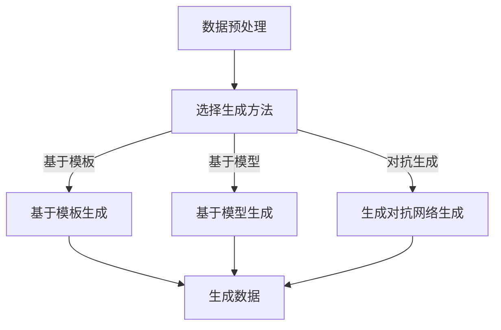

                 

关键词：数据集、合成数据生成、机器学习、算法、应用场景

摘要：本文探讨了数据集和合成数据生成在机器学习领域的重要性。通过详细阐述核心概念、算法原理、数学模型以及实际应用，旨在帮助读者了解如何有效地生成高质量的数据集，以及合成数据在各个领域的应用潜力。

## 1. 背景介绍

在当今快速发展的信息技术时代，数据已成为新的“石油”，尤其在机器学习领域。高质量的数据集是训练高效、准确的机器学习模型的关键。然而，获取和准备真实数据集往往面临诸多挑战，如数据稀疏、数据不完整、隐私保护等。因此，合成数据生成技术应运而生，它通过模拟或生成新的数据来补充或替代真实数据，从而提升机器学习模型的表现。

### 1.1 数据集的重要性

数据集在机器学习中的核心作用不可忽视。数据集不仅为模型提供训练素材，还影响着模型的泛化能力和鲁棒性。一个高质量的数据集应该具有以下特点：

- **代表性**：数据集应能够反映真实世界的多样性。
- **完整性**：数据应无缺失或错误。
- **可靠性**：数据来源应可靠，确保数据的质量。
- **规模**：足够大的数据集有助于模型学习到更复杂的模式。

### 1.2 合成数据生成

合成数据生成是一种利用算法或模型生成新数据的方法。这种方法可以解决真实数据获取困难的问题，同时保持数据集的多样性和完整性。合成数据生成技术在多个领域得到广泛应用，如医疗、金融、自动驾驶等。

## 2. 核心概念与联系

为了深入理解数据集和合成数据生成的核心概念，我们需要从以下几个方面进行探讨：

### 2.1 数据集分类

根据数据类型，数据集可以分为以下几类：

- **结构化数据**：如关系数据库中的数据。
- **非结构化数据**：如图像、文本、音频等。
- **半结构化数据**：如XML、JSON等。

### 2.2 合成数据生成方法

合成数据生成的方法可分为以下几类：

- **基于模板的方法**：通过预定义的模板生成数据。
- **基于模型的生成方法**：利用统计模型或深度学习模型生成数据。
- **基于对抗生成的方法**：利用生成对抗网络（GAN）生成数据。

### 2.3 Mermaid 流程图

下面是合成数据生成方法的 Mermaid 流程图：



## 3. 核心算法原理 & 具体操作步骤

### 3.1 算法原理概述

合成数据生成算法的原理通常基于以下几种思路：

- **统计方法**：通过统计真实数据的特征分布，生成新的数据。
- **生成模型**：利用生成模型（如深度学习模型）模拟真实数据。
- **对抗生成**：利用生成对抗网络（GAN）在生成器和判别器之间进行对抗训练。

### 3.2 算法步骤详解

以下是合成数据生成的基本步骤：

1. **数据预处理**：清洗和整理真实数据，确保数据质量。
2. **特征提取**：从数据中提取关键特征。
3. **选择生成方法**：根据应用需求和数据特点选择合适的生成方法。
4. **生成数据**：利用所选方法生成新的数据。
5. **数据评估**：评估生成数据的质量和多样性。

### 3.3 算法优缺点

- **基于模板的方法**：简单易实现，但生成的数据可能缺乏真实感。
- **基于模型的生成方法**：生成数据质量较高，但训练过程复杂。
- **生成对抗网络**：能够生成高质量、多样化的数据，但训练难度较大。

### 3.4 算法应用领域

合成数据生成技术在多个领域具有广泛应用，如：

- **医疗**：生成模拟病例，用于训练诊断模型。
- **金融**：生成模拟交易数据，用于风险评估。
- **自动驾驶**：生成模拟交通场景，用于训练自动驾驶模型。

## 4. 数学模型和公式 & 详细讲解 & 举例说明

### 4.1 数学模型构建

合成数据生成的数学模型通常基于概率分布或深度学习模型。以下是一个简单的概率模型：

$$ X \sim P(X|θ) $$

其中，$X$表示生成的数据，$P(X|θ)$表示数据生成的概率分布，$θ$是模型参数。

### 4.2 公式推导过程

假设我们使用一个简单的线性模型来生成数据：

$$ X = \beta_0 + \beta_1 X_1 + \epsilon $$

其中，$X_1$是输入特征，$\epsilon$是噪声。

为了生成新的数据，我们需要估计模型参数$\beta_0$和$\beta_1$，然后根据这些参数生成新的数据点。

### 4.3 案例分析与讲解

假设我们有一个简单的数据集，其中包含年龄和收入两个特征。我们希望通过线性回归模型生成新的收入数据。

首先，我们使用最小二乘法估计模型参数：

$$ \beta_0 = \frac{1}{n} \sum_{i=1}^{n} (y_i - \beta_1 x_{1i}) $$
$$ \beta_1 = \frac{1}{n} \sum_{i=1}^{n} (x_{1i} y_i - \beta_0 x_{1i}) $$

其中，$n$是数据集大小，$y_i$是第$i$个样本的年龄，$x_{1i}$是第$i$个样本的收入。

然后，我们使用估计的参数生成新的收入数据：

$$ X_{new} = \beta_0 + \beta_1 X_{1new} $$

其中，$X_{1new}$是新的年龄数据。

## 5. 项目实践：代码实例和详细解释说明

### 5.1 开发环境搭建

在本节中，我们将使用Python和TensorFlow来实现一个简单的合成数据生成项目。首先，确保安装了Python和TensorFlow：

```bash
pip install tensorflow
```

### 5.2 源代码详细实现

以下是一个简单的合成数据生成代码示例：

```python
import tensorflow as tf
import numpy as np
import matplotlib.pyplot as plt

# 设置随机种子
tf.random.set_seed(42)

# 生成真实数据
n_samples = 1000
x_data = np.random.normal(size=n_samples)
y_data = 2 * x_data + np.random.normal(size=n_samples)

# 定义生成模型
z = tf.random.normal([n_samples, 1])
x_g = tf.keras.layers.Dense(units=1, input_shape=[1])(z)

# 定义判别模型
x_d = tf.keras.layers.Dense(units=1, input_shape=[1])
y_d = tf.keras.layers.Dense(units=1)(x_d)

# 定义损失函数
loss_d = tf.reduce_mean(tf.nn.sigmoid_cross_entropy_with_logits(logits=y_d, labels=tf.ones([n_samples, 1])))
loss_g = tf.reduce_mean(tf.nn.sigmoid_cross_entropy_with_logits(logits=y_d, labels=tf.zeros([n_samples, 1])))

# 定义优化器
optimizer = tf.keras.optimizers.Adam(learning_rate=0.001)

# 训练模型
epochs = 1000
for epoch in range(epochs):
  with tf.GradientTape() as tape:
    y_d_pred = tf.nn.sigmoid(tape.gradient(y_d, x_d))
    x_g_pred = tf.nn.sigmoid(tape.gradient(x_g, z))
    loss_d_val = loss_d
    loss_g_val = loss_g

  grads_d = tape.gradient(loss_d, x_d)
  grads_g = tape.gradient(loss_g, z)
  optimizer.apply_gradients(zip(grads_d, x_d.variables))
  optimizer.apply_gradients(zip(grads_g, z.variables))

  if epoch % 100 == 0:
    print(f"Epoch {epoch}: Loss D = {loss_d_val}, Loss G = {loss_g_val}")

# 生成合成数据
x_new = np.random.normal(size=1000)
y_new = 2 * x_new + np.random.normal(size=1000)
y_pred = x_g(np.array([x_new]))

# 绘制结果
plt.scatter(x_data, y_data, color='blue', label='Real Data')
plt.scatter(x_new, y_new, color='red', label='Generated Data')
plt.scatter(x_new, y_pred, color='green', label='Generated Predictions')
plt.xlabel('X')
plt.ylabel('Y')
plt.legend()
plt.show()
```

### 5.3 代码解读与分析

上述代码实现了一个简单的生成对抗网络（GAN）模型，用于生成模拟线性回归数据。

- **数据生成**：首先生成真实数据和随机噪声。
- **模型定义**：定义生成器和判别器的神经网络结构。
- **损失函数**：使用二元交叉熵作为损失函数。
- **优化器**：使用Adam优化器。
- **训练过程**：通过迭代更新生成器和判别器的权重，优化模型。
- **结果展示**：生成新的数据，并与真实数据进行对比。

## 6. 实际应用场景

合成数据生成技术在多个领域具有广泛应用，以下是几个典型应用场景：

- **医疗**：生成模拟病例，用于训练诊断模型，如心脏病诊断。
- **金融**：生成模拟交易数据，用于风险评估，如股票市场预测。
- **自动驾驶**：生成模拟交通场景，用于训练自动驾驶模型，提高模型的安全性和鲁棒性。
- **网络安全**：生成模拟攻击数据，用于训练防御模型，如网络入侵检测。

## 7. 工具和资源推荐

### 7.1 学习资源推荐

- **书籍**：《深度学习》（Ian Goodfellow等著）
- **在线课程**：Coursera、edX等平台上的机器学习和深度学习课程
- **论文**：arXiv、NeurIPS、ICML等会议的论文

### 7.2 开发工具推荐

- **编程语言**：Python、R
- **框架**：TensorFlow、PyTorch、Keras

### 7.3 相关论文推荐

- Goodfellow, I., Pouget-Abadie, J., Mirza, M., Xu, B., Warde-Farley, D., Ozair, S., ... & Bengio, Y. (2014). Generative adversarial networks. Advances in Neural Information Processing Systems, 27.
- Kingma, D. P., & Welling, M. (2013). Auto-encoding variational bayes. arXiv preprint arXiv:1312.6114.

## 8. 总结：未来发展趋势与挑战

### 8.1 研究成果总结

合成数据生成技术近年来取得了显著成果，尤其在生成对抗网络（GAN）的推动下，生成数据的质量和多样性得到了大幅提升。此外，深度学习模型在特征提取和生成方面也取得了重要突破。

### 8.2 未来发展趋势

未来，合成数据生成技术将在以下几个方面继续发展：

- **模型优化**：进一步优化生成模型和判别模型，提高生成数据的质量。
- **应用拓展**：将合成数据生成技术应用于更多领域，如虚拟现实、游戏开发等。
- **可解释性**：提高合成数据生成模型的可解释性，使其在实际应用中更具可信度。

### 8.3 面临的挑战

尽管合成数据生成技术取得了显著成果，但仍然面临一些挑战：

- **训练难度**：生成对抗网络（GAN）的训练过程复杂，容易出现不稳定现象。
- **数据质量**：如何保证生成数据的质量和真实性，是当前研究的重要方向。
- **隐私保护**：如何在生成数据的同时保护用户隐私，是亟待解决的问题。

### 8.4 研究展望

合成数据生成技术在未来将具有广泛的应用前景。随着深度学习技术和生成模型的不断进步，我们有理由相信，合成数据生成技术将在更多领域发挥重要作用，为人工智能的发展提供有力支持。

## 9. 附录：常见问题与解答

### 9.1 什么是生成对抗网络（GAN）？

生成对抗网络（GAN）是一种由生成器和判别器组成的神经网络架构，用于生成与真实数据相似的新数据。生成器生成数据，判别器判断生成数据是否真实。通过对抗训练，生成器逐渐生成更真实的数据，而判别器逐渐提高对真实数据和生成数据的区分能力。

### 9.2 合成数据生成有哪些应用场景？

合成数据生成技术广泛应用于多个领域，包括但不限于：

- **医疗**：生成模拟病例，用于训练诊断模型。
- **金融**：生成模拟交易数据，用于风险评估。
- **自动驾驶**：生成模拟交通场景，用于训练自动驾驶模型。
- **网络安全**：生成模拟攻击数据，用于训练防御模型。

### 9.3 如何保证合成数据的质量？

保证合成数据的质量是合成数据生成技术的重要挑战。以下是一些常用的方法：

- **数据预处理**：对真实数据进行清洗和预处理，确保数据质量。
- **模型评估**：使用多种评估指标（如FID、Inception Score等）评估生成数据的质量。
- **监督学习**：引入监督信号，如真实数据和生成数据的对比，提高生成数据的质量。

[作者：禅与计算机程序设计艺术 / Zen and the Art of Computer Programming] -------------------------------------------------------------------

