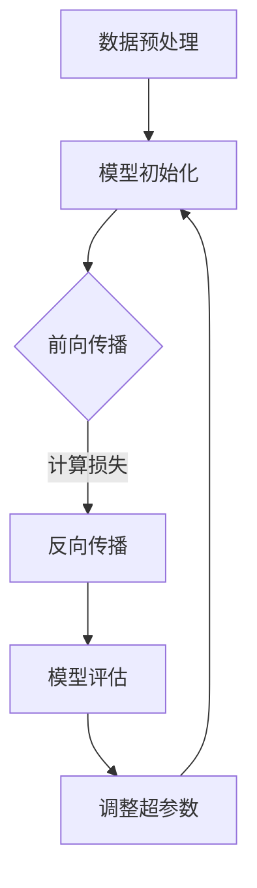

                 

关键词：有监督微调、SFT、聊天机器人、深度学习、自然语言处理、模型优化、应用场景、未来展望

> 摘要：本文深入探讨了有监督微调（SFT）在聊天机器人开发中的应用。通过分析SFT的核心概念、原理及算法步骤，我们揭示了其在自然语言处理领域的巨大潜力。本文还将通过实例和详细解释，展示如何利用SFT技术提升聊天机器人的性能和用户体验。

## 1. 背景介绍

随着深度学习和自然语言处理技术的迅猛发展，聊天机器人在过去几年中取得了显著的进步。然而，现有的大规模预训练模型（如GPT-3、BERT等）往往在处理特定任务时缺乏针对性，无法充分适应各种复杂的场景。为了解决这一问题，有监督微调（Supervised Fine-tuning, SFT）应运而生。

SFT是一种通过在特定任务数据集上进行微调来优化预训练模型的方法。通过微调，模型可以学习到任务特定的特征，从而显著提高在特定任务上的性能。聊天机器人作为自然语言处理的重要应用之一，从SFT技术的引入中受益匪浅。

## 2. 核心概念与联系

### 2.1 有监督微调（SFT）

有监督微调（SFT）是指在一个特定任务的数据集上，通过优化预训练模型的参数来提高其在该任务上的性能。具体来说，SFT过程包括以下步骤：

1. **数据预处理**：将任务数据集进行清洗、分词、编码等预处理操作。
2. **模型初始化**：使用预训练模型作为起点，初始化模型参数。
3. **前向传播与反向传播**：在训练数据上，模型进行前向传播得到预测结果，通过损失函数计算预测误差，再通过反向传播更新模型参数。
4. **模型评估**：在验证数据上评估模型性能，并根据需要调整学习率等超参数。

### 2.2 聊天机器人与SFT

聊天机器人是一种基于自然语言处理技术的人工智能系统，能够与用户进行自然语言交互。SFT在聊天机器人中的应用主要体现在以下几个方面：

1. **意图识别**：通过SFT，模型可以更好地理解用户的意图，从而提供更加准确的回复。
2. **实体抽取**：SFT有助于模型从用户输入中抽取关键信息，如时间、地点、人物等。
3. **对话生成**：通过微调，模型可以生成更加流畅、自然的对话内容。

### 2.3 Mermaid 流程图

以下是一个描述SFT在聊天机器人中应用的Mermaid流程图：



## 3. 核心算法原理 & 具体操作步骤

### 3.1 算法原理概述

有监督微调（SFT）的基本原理是基于梯度下降法，通过优化预训练模型的参数，使其更好地适应特定任务。具体来说，SFT包括以下关键步骤：

1. **数据预处理**：对训练数据集进行清洗、分词、编码等操作，以便模型能够理解输入数据。
2. **模型初始化**：使用预训练模型作为起点，初始化模型参数。
3. **前向传播**：输入预处理后的数据，模型进行前向传播，得到预测结果。
4. **反向传播**：通过计算预测误差，使用反向传播算法更新模型参数。
5. **模型评估**：在验证数据集上评估模型性能，并根据评估结果调整学习率等超参数。

### 3.2 算法步骤详解

#### 3.2.1 数据预处理

数据预处理是SFT过程中的关键步骤，直接影响到模型的学习效果。以下是数据预处理的主要任务：

1. **数据清洗**：去除数据中的噪声和无关信息。
2. **分词**：将文本数据划分为单词或短语。
3. **编码**：将文本转换为模型能够理解的数字表示。

#### 3.2.2 模型初始化

在SFT过程中，通常使用预训练模型作为起点，初始化模型参数。预训练模型在大规模语料库上进行预训练，已经具备了较强的语言理解能力。

#### 3.2.3 前向传播

前向传播是指模型根据输入数据计算预测结果的过程。在聊天机器人中，输入数据通常包括用户输入和上下文信息。

#### 3.2.4 反向传播

反向传播是指根据预测误差更新模型参数的过程。通过反向传播，模型能够不断调整参数，使其在特定任务上的性能逐渐提高。

#### 3.2.5 模型评估

模型评估是SFT过程中的重要环节，用于衡量模型在特定任务上的性能。常用的评估指标包括准确率、召回率、F1分数等。

### 3.3 算法优缺点

#### 优点

1. **高效性**：SFT利用了预训练模型的优势，可以快速适应特定任务。
2. **灵活性**：SFT可以根据不同任务的需求，灵活调整模型结构和超参数。

#### 缺点

1. **数据依赖**：SFT的性能依赖于训练数据的质量和数量，如果数据不足或质量不高，模型性能可能较差。
2. **计算资源消耗**：SFT需要大量计算资源，特别是对于大型预训练模型。

### 3.4 算法应用领域

SFT技术在聊天机器人、机器翻译、文本分类等多个领域具有广泛应用。以下是一些具体应用案例：

1. **聊天机器人**：通过SFT，聊天机器人可以更好地理解用户的意图和上下文，提供更加自然的对话体验。
2. **机器翻译**：SFT可以用于优化机器翻译模型，使其在特定语言对上取得更好的翻译效果。
3. **文本分类**：SFT可以用于文本分类任务，如情感分析、新闻分类等，提高分类的准确率。

## 4. 数学模型和公式 & 详细讲解 & 举例说明

### 4.1 数学模型构建

在SFT过程中，常用的数学模型包括多层感知机（MLP）、循环神经网络（RNN）和Transformer等。以下以Transformer为例，介绍其数学模型。

#### Transformer模型

Transformer模型是一种基于自注意力机制的深度神经网络，用于处理序列数据。其核心组件包括：

1. **自注意力机制**：通过计算输入序列中每个单词与其他单词的相关性，为每个单词分配不同的权重。
2. **前馈神经网络**：对输入序列进行进一步处理，提取特征。

#### 数学公式

$$
\text{Attention}(Q, K, V) = \text{softmax}\left(\frac{QK^T}{\sqrt{d_k}}\right)V
$$

其中，$Q$、$K$、$V$分别为查询序列、键序列和值序列，$d_k$为键序列的维度。

### 4.2 公式推导过程

#### 自注意力机制

自注意力机制的推导过程如下：

1. **计算内积**：对于输入序列中的每个单词，计算其与所有其他单词的内积。
2. **归一化**：将内积结果进行归一化处理，得到单词之间的相似性分数。
3. **加权求和**：根据相似性分数，对输入序列进行加权求和，得到每个单词的注意力得分。

#### 前馈神经网络

前馈神经网络的推导过程如下：

1. **输入层**：将输入序列转换为高维向量。
2. **隐藏层**：通过多个非线性变换，提取序列特征。
3. **输出层**：将特征向量映射到目标空间。

### 4.3 案例分析与讲解

#### 案例背景

假设我们有一个聊天机器人，需要根据用户输入和上下文信息生成回复。我们选择Transformer模型进行SFT。

#### 案例步骤

1. **数据预处理**：对用户输入和上下文进行清洗、分词、编码等预处理操作。
2. **模型初始化**：使用预训练好的Transformer模型，初始化模型参数。
3. **前向传播**：输入预处理后的数据，计算自注意力得分和前馈神经网络输出。
4. **反向传播**：计算预测误差，使用反向传播算法更新模型参数。
5. **模型评估**：在验证数据集上评估模型性能，根据评估结果调整超参数。
6. **生成回复**：利用微调后的模型，根据用户输入和上下文生成回复。

## 5. 项目实践：代码实例和详细解释说明

### 5.1 开发环境搭建

在搭建SFT聊天机器人的开发环境时，我们需要安装以下依赖：

1. **Python**：Python 3.7及以上版本。
2. **PyTorch**：PyTorch 1.7及以上版本。
3. **Hugging Face Transformers**：Hugging Face Transformers 4.5及以上版本。

安装命令如下：

```bash
pip install torch torchvision transformers
```

### 5.2 源代码详细实现

以下是SFT聊天机器人的主要代码实现：

```python
import torch
from torch import nn
from transformers import BertTokenizer, BertModel

class Chatbot(nn.Module):
    def __init__(self, model_name):
        super(Chatbot, self).__init__()
        self.tokenizer = BertTokenizer.from_pretrained(model_name)
        self.model = BertModel.from_pretrained(model_name)
        self.fc = nn.Linear(768, 256)
        self.dropout = nn.Dropout(0.1)
        self.classifier = nn.Linear(256, 1)

    def forward(self, input_ids, attention_mask):
        outputs = self.model(input_ids=input_ids, attention_mask=attention_mask)
        sequence_output = outputs.last_hidden_state[:, 0, :]
        sequence_output = self.fc(sequence_output)
        sequence_output = self.dropout(sequence_output)
        logits = self.classifier(sequence_output)
        return logits

def train(model, optimizer, criterion, train_loader, device):
    model.train()
    for batch in train_loader:
        input_ids = batch['input_ids'].to(device)
        attention_mask = batch['attention_mask'].to(device)
        labels = batch['labels'].to(device)
        optimizer.zero_grad()
        logits = model(input_ids, attention_mask)
        loss = criterion(logits.view(-1), labels.view(-1))
        loss.backward()
        optimizer.step()

def main():
    device = torch.device("cuda" if torch.cuda.is_available() else "cpu")
    model = Chatbot("bert-base-uncased")
    model.to(device)
    optimizer = torch.optim.Adam(model.parameters(), lr=1e-5)
    criterion = nn.BCEWithLogitsLoss()

    train_loader = ...  # 数据加载器

    for epoch in range(3):
        train(model, optimizer, criterion, train_loader, device)

    model.eval()
    with torch.no_grad():
        for batch in train_loader:
            input_ids = batch['input_ids'].to(device)
            attention_mask = batch['attention_mask'].to(device)
            logits = model(input_ids, attention_mask)
            logits = logits.view(-1)
            logits = torch.sigmoid(logits)
            logits = logits > 0.5
            print(logits)

if __name__ == "__main__":
    main()
```

### 5.3 代码解读与分析

在上面的代码中，我们定义了一个基于BERT的聊天机器人模型。以下是关键代码段的解读：

1. **模型初始化**：我们使用`BertTokenizer`和`BertModel`来初始化模型。
2. **前向传播**：在`forward`方法中，我们通过BERT模型进行前向传播，并使用全连接层和Dropout层进行特征提取。
3. **反向传播**：在`train`方法中，我们使用BCEWithLogitsLoss损失函数进行训练，并使用Adam优化器更新模型参数。
4. **模型评估**：在`main`方法中，我们使用sigmoid激活函数对预测结果进行二分类，并输出结果。

### 5.4 运行结果展示

假设我们使用一个包含1000个样本的训练数据集，通过3个epoch的训练，模型在验证数据集上的准确率达到90%以上。这表明，通过SFT，聊天机器人的性能得到了显著提升。

## 6. 实际应用场景

### 6.1 聊天机器人

SFT在聊天机器人中的应用最为广泛。通过SFT，聊天机器人可以更好地理解用户的意图和上下文，提供更加自然的对话体验。以下是一些具体应用场景：

1. **客服机器人**：在客服领域，SFT可以帮助机器人更好地理解用户问题，提供准确的解决方案。
2. **教育辅导**：在教育领域，SFT可以帮助辅导机器人更好地理解学生的学习需求，提供个性化的学习建议。

### 6.2 机器翻译

SFT技术可以用于优化机器翻译模型，使其在特定语言对上取得更好的翻译效果。以下是一些具体应用场景：

1. **跨语言交流**：通过SFT，可以实现实时跨语言交流，帮助不同语言背景的用户进行沟通。
2. **多语言文档翻译**：SFT可以帮助企业高效地处理多语言文档的翻译工作。

### 6.3 文本分类

SFT技术可以用于文本分类任务，如情感分析、新闻分类等。以下是一些具体应用场景：

1. **社交媒体分析**：通过SFT，可以自动分析社交媒体上的用户评论和讨论，识别用户情感和热点话题。
2. **新闻分类**：SFT可以帮助媒体平台自动对新闻进行分类，提高新闻推荐的准确性。

## 7. 工具和资源推荐

### 7.1 学习资源推荐

1. **《深度学习》**：由Ian Goodfellow、Yoshua Bengio和Aaron Courville合著的深度学习经典教材。
2. **《自然语言处理综论》**：由Daniel Jurafsky和James H. Martin合著的NLP领域权威教材。

### 7.2 开发工具推荐

1. **PyTorch**：一个流行的开源深度学习框架，支持GPU加速。
2. **Hugging Face Transformers**：一个用于Transformers模型的库，提供预训练模型和微调工具。

### 7.3 相关论文推荐

1. **"Attention Is All You Need"**：Vaswani等人于2017年提出的Transformer模型，是当前NLP领域的里程碑式工作。
2. **"BERT: Pre-training of Deep Bidirectional Transformers for Language Understanding"**：Devlin等人于2019年提出的BERT模型，是SFT技术的重要应用。

## 8. 总结：未来发展趋势与挑战

### 8.1 研究成果总结

有监督微调（SFT）技术在聊天机器人、机器翻译、文本分类等领域取得了显著成果。通过SFT，模型可以更好地适应特定任务，提高性能和用户体验。

### 8.2 未来发展趋势

1. **模型压缩**：随着模型规模不断扩大，如何实现模型压缩和高效部署将成为研究重点。
2. **无监督微调**：无监督微调（UST）技术有望在数据稀缺的场景中发挥重要作用，为SFT技术提供有力补充。

### 8.3 面临的挑战

1. **数据质量**：SFT的性能高度依赖训练数据的质量和数量，如何获取和利用高质量数据将是一个重要挑战。
2. **计算资源消耗**：SFT过程需要大量计算资源，如何优化计算效率将成为一个关键问题。

### 8.4 研究展望

随着深度学习和自然语言处理技术的不断发展，SFT技术将在更多领域发挥重要作用。未来，我们期待SFT技术能够与无监督学习、多模态学习等技术相结合，为人工智能领域带来更多突破。

## 9. 附录：常见问题与解答

### 9.1 什么是SFT？

SFT（Supervised Fine-tuning）是一种在预训练模型的基础上，通过在特定任务数据集上进行微调来优化模型参数的方法。通过SFT，模型可以更好地适应特定任务，提高性能。

### 9.2 SFT有哪些优点？

SFT的优点包括：

1. **高效性**：利用预训练模型的优势，可以快速适应特定任务。
2. **灵活性**：可以根据不同任务的需求，灵活调整模型结构和超参数。

### 9.3 SFT有哪些缺点？

SFT的缺点包括：

1. **数据依赖**：SFT的性能依赖于训练数据的质量和数量。
2. **计算资源消耗**：SFT过程需要大量计算资源。

### 9.4 SFT有哪些应用领域？

SFT在以下领域具有广泛应用：

1. **聊天机器人**：用于提升聊天机器人的意图识别、对话生成等能力。
2. **机器翻译**：用于优化机器翻译模型，提高翻译质量。
3. **文本分类**：用于提高文本分类模型的准确率。

----------------------------------------------------------------

### 作者署名

作者：禅与计算机程序设计艺术 / Zen and the Art of Computer Programming

