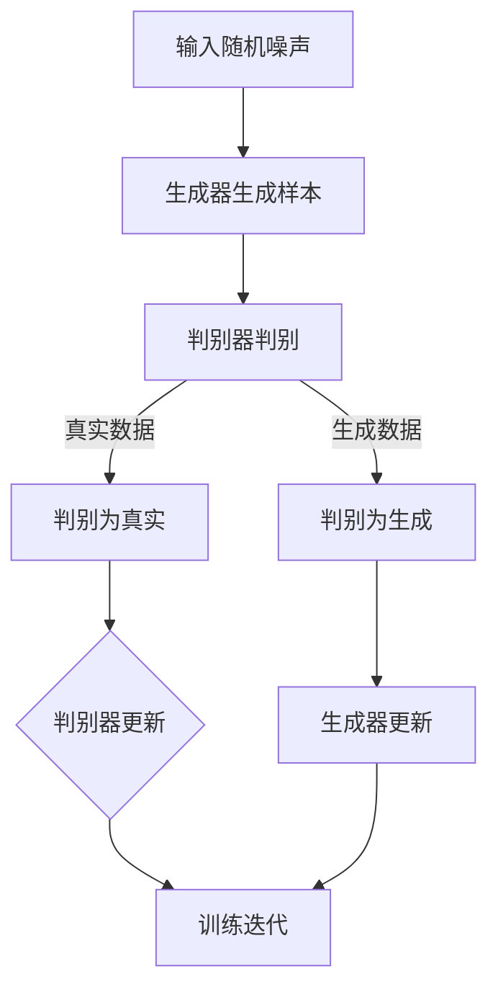

                 

在人工智能领域，生成式人工智能（Generative Artificial Intelligence，简称GAI）已经成为了一个备受瞩目的研究方向。它与传统的判别式人工智能（Discriminative Artificial Intelligence）不同，GAI专注于从数据中生成新的、符合数据分布的样本。这种能力在图像生成、自然语言处理、音频合成等领域展现了巨大的潜力。

本章将深入探讨生成式人工智能的核心概念、算法原理、数学模型以及实际应用。通过详细的案例分析，我们将了解如何利用生成式人工智能解决实际问题。最后，本文还将展望生成式人工智能的未来发展，以及它可能面临的挑战。

## 1. 背景介绍

生成式人工智能的发展可以追溯到上世纪80年代，当时研究人员开始探索如何让计算机生成新的数据样本，以模拟人类创造过程。生成对抗网络（Generative Adversarial Networks，简称GAN）的出现标志着生成式人工智能的一个重要里程碑。GAN由两部分组成：生成器（Generator）和判别器（Discriminator）。生成器尝试生成尽可能真实的数据样本，而判别器则尝试区分真实数据和生成数据。二者相互对抗，通过不断调整参数来提高生成器的生成能力。

在过去的几十年中，生成式人工智能在多个领域取得了显著的进展。图像生成是其中一个热门应用领域。通过GAN，计算机可以生成逼真的图像，包括人脸、风景、动物等。在自然语言处理方面，生成式模型如变分自编码器（Variational Autoencoder，简称VAE）和转换器（Transformer）被用于生成连贯且具有上下文意义的文本。音频合成也是生成式人工智能的重要应用领域，如WaveNet可以生成高质量的语音。

## 2. 核心概念与联系

### 2.1 生成式人工智能的基本原理

生成式人工智能的核心是概率模型，它通过学习数据分布来生成新的样本。在这个过程中，概率密度函数（Probability Density Function，简称PDF）起到了关键作用。PDF描述了数据在各个取值上的概率分布，生成式模型的目标是学习这种分布，以便生成符合该分布的新样本。

生成式模型通常分为两大类：基于概率的模型和基于神经网络的模型。基于概率的模型如隐马尔可夫模型（Hidden Markov Model，简称HMM）和变分自编码器（Variational Autoencoder，简称VAE），而基于神经网络的模型如生成对抗网络（Generative Adversarial Networks，简称GAN）和变分自编码器（Variational Autoencoder，简称VAE）。

### 2.2 生成对抗网络（GAN）的原理与架构

生成对抗网络（GAN）由两部分组成：生成器（Generator）和判别器（Discriminator）。生成器的任务是生成新的数据样本，而判别器的任务是区分真实数据和生成数据。在训练过程中，生成器和判别器相互对抗，生成器的目标是让判别器无法区分生成数据和真实数据，而判别器的目标是尽可能准确地分类真实数据和生成数据。

### 2.3 Mermaid 流程图



## 3. 核心算法原理 & 具体操作步骤

### 3.1 算法原理概述

生成对抗网络（GAN）是生成式人工智能的一个核心算法。它由生成器和判别器两部分组成，生成器尝试生成尽可能真实的数据样本，而判别器尝试区分真实数据和生成数据。二者的训练过程是一个相互对抗的过程，通过不断迭代，生成器的生成能力不断提高。

### 3.2 算法步骤详解

1. **初始化**：初始化生成器G和判别器D的参数。
2. **生成样本**：生成器G接受随机噪声z作为输入，通过神经网络生成数据样本x_G。
3. **判别样本**：判别器D同时接收真实数据x和生成数据x_G，通过神经网络输出概率p_D(x)。
4. **更新判别器**：使用真实数据和生成数据的标签（分别为1和0）来更新判别器D的参数。
5. **生成新样本**：生成器G再次生成新样本。
6. **重复步骤2-5**：重复上述步骤，直到生成器G和判别器D的参数稳定。

### 3.3 算法优缺点

#### 优点：

- **强大的生成能力**：GAN可以生成高质量、多样性的数据样本。
- **无监督学习**：GAN不需要标签数据，可以完全通过无监督学习进行训练。
- **适用于多种数据类型**：GAN可以用于图像、音频、文本等多种数据类型的生成。

#### 缺点：

- **训练不稳定**：GAN的训练过程非常不稳定，容易陷入局部最优。
- **模式崩溃**：当生成器过于强大时，判别器可能无法区分生成数据和真实数据，导致模式崩溃。
- **计算资源消耗大**：GAN的训练需要大量的计算资源。

### 3.4 算法应用领域

- **图像生成**：GAN被广泛用于图像生成，如人脸生成、风景生成等。
- **自然语言处理**：生成式模型如VAE和转换器被用于文本生成，如自动写作、对话生成等。
- **音频合成**：生成式模型如WaveNet被用于语音合成，生成高质量的人声。

## 4. 数学模型和公式 & 详细讲解 & 举例说明

### 4.1 数学模型构建

生成式模型的核心是概率密度函数（PDF），它描述了数据在不同取值上的概率分布。对于生成对抗网络（GAN），生成器G和判别器D分别对应两个概率分布：生成分布p_G(x)和真实分布p_D(x)。

### 4.2 公式推导过程

GAN的目标是最小化生成器的损失函数J_G和判别器的损失函数J_D。其中：

- J_G = E_D [log(D(x))] - E_G [log(1 - D(x))]
- J_D = E_x [log(D(x))] + E_G [log(D(G(z)))]
- z是随机噪声，x是真实数据，x_G是生成数据。

### 4.3 案例分析与讲解

假设我们有一个图像生成任务，输入是随机噪声z，输出是图像x_G。我们使用GAN来训练生成器G和判别器D。

1. **初始化**：初始化生成器G和判别器D的参数。
2. **生成样本**：生成器G接受随机噪声z，通过神经网络生成图像x_G。
3. **判别样本**：判别器D同时接收真实图像x和生成图像x_G，通过神经网络输出概率p_D(x)。
4. **更新判别器**：使用真实图像和生成图像的标签（分别为1和0）来更新判别器D的参数。
5. **生成新样本**：生成器G再次生成新图像。
6. **重复步骤2-5**：重复上述步骤，直到生成器G和判别器D的参数稳定。

## 5. 项目实践：代码实例和详细解释说明

### 5.1 开发环境搭建

为了演示GAN在图像生成中的应用，我们使用Python和TensorFlow作为主要工具。首先，确保安装了以下依赖：

```bash
pip install tensorflow numpy matplotlib
```

### 5.2 源代码详细实现

以下是一个简单的GAN图像生成示例代码：

```python
import tensorflow as tf
from tensorflow.keras.layers import Dense, Flatten, Reshape
from tensorflow.keras.models import Sequential
from tensorflow.keras.optimizers import Adam
import numpy as np
import matplotlib.pyplot as plt

# 定义生成器模型
def build_generator(z_dim):
    model = Sequential()
    model.add(Dense(128 * 7 * 7, input_dim=z_dim, activation='relu'))
    model.add(Reshape((7, 7, 128)))
    model.add(Dense(1, input_dim=128, activation='tanh'))
    model.add(Reshape((28, 28, 1)))
    return model

# 定义判别器模型
def build_discriminator(img_shape):
    model = Sequential()
    model.add(Flatten(input_shape=img_shape))
    model.add(Dense(128, activation='relu'))
    model.add(Dense(1, activation='sigmoid'))
    return model

# 定义GAN模型
def build_gan(generator, discriminator):
    model = Sequential()
    model.add(generator)
    model.add(discriminator)
    return model

# 设置参数
z_dim = 100
img_shape = (28, 28, 1)
learning_rate = 0.0002
batch_size = 128
epochs = 10000

# 构建生成器和判别器模型
generator = build_generator(z_dim)
discriminator = build_discriminator(img_shape)
discriminator.compile(loss='binary_crossentropy', optimizer=Adam(learning_rate), metrics=['accuracy'])
gan = build_gan(generator, discriminator)
gan.compile(loss='binary_crossentropy', optimizer=Adam(learning_rate))

# 加载数据集
(x_train, _), (_, _) = tf.keras.datasets.mnist.load_data()
x_train = x_train / 127.5 - 1.
x_train = np.expand_dims(x_train, axis=3)

# 训练GAN
for epoch in range(epochs):
    # 从数据集中随机抽取batch_size个样本
    idx = np.random.randint(0, x_train.shape[0], batch_size)
    images = x_train[idx]

    # 生成随机噪声
    noise = np.random.normal(0, 1, (batch_size, z_dim))

    # 生成伪造图像
    gen_images = generator.predict(noise)

    # 创建真实和伪造图像的标签
    real_labels = np.array([1] * batch_size)
    fake_labels = np.array([0] * batch_size)

    # 更新判别器
    d_loss_real = discriminator.train_on_batch(images, real_labels)
    d_loss_fake = discriminator.train_on_batch(gen_images, fake_labels)
    d_loss = 0.5 * np.add(d_loss_real, d_loss_fake)

    # 更新生成器
    g_loss = gan.train_on_batch(noise, real_labels)

    # 每隔100个epoch，保存一次生成器生成的图像
    if epoch % 100 == 0:
        print(f"{epoch} [D loss: {d_loss:.3f}, G loss: {g_loss:.3f}]")
        plt.figure()
        for i in range(5):
            z = np.random.normal(0, 1, (1, z_dim))
            img = generator.predict(z)
            plt.subplot(5, 5, i+1)
            plt.imshow(img[0, :, :, 0], cmap='gray')
            plt.axis('off')
        plt.show()
```

### 5.3 代码解读与分析

- **生成器模型**：生成器模型负责将随机噪声转换为图像。它使用全连接层和转置卷积层，通过增加空间维度和深度来生成图像。
- **判别器模型**：判别器模型负责判断输入图像是真实图像还是生成图像。它使用全连接层和卷积层，通过压缩空间维度和深度来输出概率。
- **GAN模型**：GAN模型是生成器和判别器的组合，通过同时训练两个模型来实现图像生成。
- **数据集**：我们使用MNIST数据集作为训练数据，将其归一化并扩展维度。
- **训练过程**：每次训练迭代中，我们首先更新判别器，然后更新生成器。每隔100个epoch，我们展示生成器生成的图像。

### 5.4 运行结果展示

通过运行上面的代码，我们可以看到生成器生成的图像逐渐变得逼真，判别器对真实图像和生成图像的区分能力也在不断提高。

## 6. 实际应用场景

生成式人工智能在多个领域展现了巨大的应用潜力：

- **图像生成**：GAN被用于图像生成，如人脸生成、艺术风格转换等。
- **自然语言处理**：生成式模型如VAE和转换器被用于文本生成、对话系统等。
- **音频合成**：生成式模型如WaveNet被用于语音合成，生成高质量的人声。

## 7. 未来应用展望

随着生成式人工智能技术的发展，未来它在更多领域将发挥重要作用：

- **医学影像生成**：生成式模型可以用于生成医学影像，帮助医生进行诊断和治疗。
- **创意设计**：生成式模型可以用于设计服装、建筑、艺术作品等。
- **数据增强**：生成式模型可以用于生成新的训练数据，提高模型的泛化能力。

## 8. 工具和资源推荐

### 8.1 学习资源推荐

- 《生成对抗网络：理论与应用》（作者：陈恩红）
- 《生成式模型：原理与实现》（作者：余凯）

### 8.2 开发工具推荐

- TensorFlow：用于构建和训练生成式模型。
- Keras：用于简化TensorFlow的使用。

### 8.3 相关论文推荐

- Goodfellow, I., Pouget-Abadie, J., Mirza, M., Xu, B., Warde-Farley, D., Ozair, S., ... & Bengio, Y. (2014). Generative adversarial nets. Advances in Neural Information Processing Systems, 27.
- Kingma, D. P., & Welling, M. (2014). Auto-encoding variational bayes. arXiv preprint arXiv:1312.6114.

## 9. 总结：未来发展趋势与挑战

### 9.1 研究成果总结

生成式人工智能在图像生成、自然语言处理、音频合成等领域取得了显著的成果。GAN等模型的出现为生成式人工智能的发展提供了新的方向。

### 9.2 未来发展趋势

随着计算能力的提升和数据规模的扩大，生成式人工智能将在更多领域得到应用。未来的研究将集中在提高生成质量、稳定性以及降低计算资源消耗。

### 9.3 面临的挑战

生成式人工智能仍面临一些挑战，如训练不稳定、模式崩溃等。如何解决这些问题，提高生成质量，将是未来研究的重要方向。

### 9.4 研究展望

生成式人工智能将在创意设计、医学影像、数据增强等领域发挥重要作用。随着技术的进步，它将为人类带来更多的可能性。

## 9. 附录：常见问题与解答

### 9.1 什么是生成式人工智能？

生成式人工智能是一种通过学习数据分布来生成新数据的人工智能方法。它与传统判别式人工智能不同，后者主要用于分类和预测。

### 9.2 生成对抗网络（GAN）的原理是什么？

生成对抗网络（GAN）由生成器和判别器两部分组成。生成器尝试生成新的数据样本，判别器尝试区分真实数据和生成数据。二者的训练过程是一个相互对抗的过程，通过不断迭代，生成器的生成能力不断提高。

### 9.3 GAN 的优缺点是什么？

GAN的优点包括强大的生成能力、无监督学习和适用于多种数据类型。缺点包括训练不稳定、模式崩溃和计算资源消耗大。

### 9.4 生成式人工智能可以用于哪些实际场景？

生成式人工智能可以用于图像生成、自然语言处理、音频合成等领域。例如，GAN被用于图像生成，VAE被用于文本生成，WaveNet被用于语音合成。

### 9.5 如何提高 GAN 的生成质量？

提高 GAN 的生成质量可以从以下几个方面入手：增加训练数据、调整生成器和判别器的结构、优化损失函数和训练策略等。

### 9.6 GAN 是否会替代传统机器学习方法？

GAN 为机器学习方法提供了一种新的思路，但它并不会完全替代传统方法。GAN更适合生成新数据，而传统方法更适合分类和预测等任务。

### 9.7 生成式人工智能的未来发展趋势是什么？

生成式人工智能的未来发展趋势包括提高生成质量、稳定性以及降低计算资源消耗。它将在创意设计、医学影像、数据增强等领域发挥重要作用。

