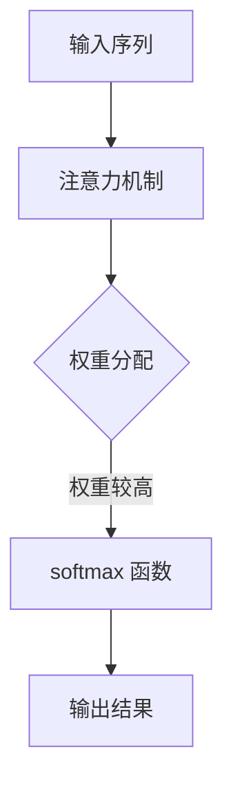

                 

关键词：注意力机制，softmax 函数，深度学习，神经网络，机器学习，自然语言处理，计算机视觉

> 摘要：本章将深入探讨注意力机制和 softmax 函数在深度学习中的重要作用。注意力机制通过赋予不同输入元素不同的权重，提高了模型对重要信息的关注，而 softmax 函数则用于处理概率分布问题，使得模型能够输出具有明确意义的分类结果。本文将详细介绍这两种机制的理论基础、数学模型、具体应用，以及未来发展趋势。

## 1. 背景介绍

随着深度学习技术的不断发展和普及，神经网络在图像识别、自然语言处理、语音识别等领域取得了显著的成果。然而，传统的神经网络模型在处理复杂任务时，往往面临以下问题：

1. **信息过载**：神经网络在处理大量输入信息时，无法区分哪些信息是重要的，哪些是次要的，导致模型性能下降。
2. **计算效率低**：神经网络需要大量参数和计算资源，导致模型训练时间过长，无法满足实时应用的需求。
3. **模型可解释性差**：神经网络模型在决策过程中，缺乏明确的理论依据和可解释性，使得研究人员难以理解模型的内在机制。

为了解决这些问题，研究人员提出了注意力机制和 softmax 函数，这两种机制在深度学习领域具有广泛的应用。注意力机制通过动态调整不同输入元素的重要性，提高了模型的处理效率和准确性；softmax 函数则用于处理概率分布问题，使得模型能够输出具有明确意义的分类结果。

## 2. 核心概念与联系

### 2.1 注意力机制

注意力机制（Attention Mechanism）是一种能够提高神经网络处理复杂任务的能力的机制。它通过动态调整不同输入元素的重要性，使得模型能够关注到关键信息，从而提高模型的性能。注意力机制的原理可以简单理解为：在处理一个序列数据时，模型会为序列中的每个元素分配一个权重，权重较高的元素在后续处理过程中将被赋予更高的关注度。

### 2.2 Softmax 函数

softmax 函数是一种将向量转换为概率分布的函数，它广泛应用于分类问题中。softmax 函数的输出表示了每个类别在总体中的概率分布，概率值越高，表示模型对该类别的预测越准确。softmax 函数的数学定义如下：

$$
\text{softmax}(x_i) = \frac{e^{x_i}}{\sum_{j=1}^{n} e^{x_j}}
$$

其中，$x_i$ 表示输入向量中的第 $i$ 个元素，$n$ 表示输入向量的维度。

### 2.3 注意力机制和 softmax 函数的联系

注意力机制和 softmax 函数在深度学习中有一定的联系。在处理序列数据时，注意力机制可以为每个元素分配一个权重，而 softmax 函数则可以将这些权重转换为概率分布。这样，模型就能够根据概率分布对序列数据进行分类或预测。

### 2.4 Mermaid 流程图

下面是一个简单的 Mermaid 流程图，展示了注意力机制和 softmax 函数在深度学习中的应用过程：



## 3. 核心算法原理 & 具体操作步骤

### 3.1 算法原理概述

注意力机制和 softmax 函数在深度学习中的应用主要包括以下三个方面：

1. **序列数据处理**：在处理序列数据时，注意力机制可以为序列中的每个元素分配一个权重，使得模型能够关注到关键信息。例如，在自然语言处理任务中，注意力机制可以帮助模型关注到文本中的重要词汇。
2. **概率分布生成**：softmax 函数可以将输入向量转换为概率分布，使得模型能够输出具有明确意义的分类结果。例如，在图像分类任务中，softmax 函数可以帮助模型预测图像所属的类别。
3. **模型优化**：通过引入注意力机制和 softmax 函数，模型可以在训练过程中自适应地调整权重和概率分布，从而提高模型的性能。

### 3.2 算法步骤详解

下面分别介绍注意力机制和 softmax 函数的具体实现步骤：

#### 3.2.1 注意力机制

1. **输入序列预处理**：将输入序列转换为向量表示，通常使用词嵌入（Word Embedding）技术。
2. **计算注意力权重**：根据输入序列和模型参数，计算每个元素的注意力权重。常用的注意力模型包括加性注意力（Additive Attention）和乘性注意力（Multiplicative Attention）。
3. **权重分配**：根据注意力权重，为输入序列中的每个元素分配一个权重，权重较高的元素在后续处理过程中将被赋予更高的关注度。
4. **加权求和**：将加权后的输入序列进行求和，得到最终的序列表示。

#### 3.2.2 Softmax 函数

1. **输入向量预处理**：将输入向量进行归一化处理，使其具有相同的维度。
2. **计算概率分布**：使用 softmax 函数，将归一化后的输入向量转换为概率分布。
3. **输出结果**：根据概率分布，输出模型预测的结果。

### 3.3 算法优缺点

#### 3.3.1 注意力机制的优点

1. **提高模型性能**：通过动态调整不同输入元素的重要性，注意力机制有助于提高模型的准确性和鲁棒性。
2. **提高计算效率**：注意力机制可以减少模型对计算资源的依赖，使得模型在处理大量数据时具有更高的计算效率。

#### 3.3.2 注意力机制的缺点

1. **模型复杂度高**：引入注意力机制会增加模型的复杂度，导致模型参数增多，训练时间延长。
2. **对数据依赖性强**：注意力机制在不同数据集上的性能差异较大，需要针对特定任务进行调整。

#### 3.3.3 Softmax 函数的优点

1. **概率分布生成**：softmax 函数能够将输入向量转换为概率分布，使得模型能够输出具有明确意义的分类结果。
2. **计算简单**：softmax 函数的计算过程相对简单，易于实现。

#### 3.3.4 Softmax 函数的缺点

1. **梯度消失问题**：在训练过程中，softmax 函数可能导致梯度消失，使得模型难以收敛。
2. **对样本数量敏感**：softmax 函数在处理少量样本时，容易出现过拟合现象。

### 3.4 算法应用领域

注意力机制和 softmax 函数在深度学习领域具有广泛的应用，主要包括以下几个方面：

1. **自然语言处理**：在自然语言处理任务中，注意力机制可以帮助模型关注到文本中的重要词汇，提高模型的准确性和可解释性。例如，在机器翻译、文本分类和情感分析等任务中，注意力机制得到了广泛应用。
2. **计算机视觉**：在计算机视觉任务中，注意力机制可以帮助模型关注到图像中的重要区域，提高模型的检测和分类能力。例如，在目标检测、人脸识别和图像分割等任务中，注意力机制得到了广泛应用。
3. **语音识别**：在语音识别任务中，注意力机制可以帮助模型关注到语音信号中的关键特征，提高模型的准确性和稳定性。

## 4. 数学模型和公式 & 详细讲解 & 举例说明

### 4.1 数学模型构建

#### 4.1.1 注意力机制

注意力机制的数学模型可以表示为：

$$
\alpha_{ij} = \text{Attention}(Q, K, V)
$$

其中，$Q, K, V$ 分别表示查询向量、键向量和值向量，$\alpha_{ij}$ 表示第 $i$ 个输入元素对第 $j$ 个输出元素的注意力权重。

常用的注意力模型包括加性注意力模型和乘性注意力模型：

1. **加性注意力模型**：

$$
\alpha_{ij} = \text{softmax}\left(\frac{QK^T}{\sqrt{d_k}}\right)V_j
$$

其中，$d_k$ 表示键向量的维度。

2. **乘性注意力模型**：

$$
\alpha_{ij} = \text{softmax}\left(QK^T V_j\right)
$$

#### 4.1.2 Softmax 函数

softmax 函数的数学模型可以表示为：

$$
p_i = \text{softmax}(x_i) = \frac{e^{x_i}}{\sum_{j=1}^{n} e^{x_j}}
$$

其中，$x_i$ 表示输入向量中的第 $i$ 个元素，$n$ 表示输入向量的维度。

### 4.2 公式推导过程

#### 4.2.1 加性注意力模型

加性注意力模型的推导过程如下：

1. **输入向量表示**：

$$
Q = [q_1, q_2, \ldots, q_m], \quad K = [k_1, k_2, \ldots, k_m], \quad V = [v_1, v_2, \ldots, v_m]
$$

其中，$m$ 表示输入序列的长度。

2. **计算查询向量、键向量和值向量**：

$$
Q = \text{Linear}(X), \quad K = \text{Linear}(X), \quad V = \text{Linear}(X)
$$

其中，$\text{Linear}(X)$ 表示线性变换。

3. **计算注意力权重**：

$$
\alpha_{ij} = \text{softmax}\left(\frac{QK^T}{\sqrt{d_k}}\right)V_j = \text{softmax}\left(\frac{(q_1, q_2, \ldots, q_m) (k_1, k_2, \ldots, k_m)^T}{\sqrt{d_k}}\right)V_j
$$

4. **加权求和**：

$$
S = \sum_{i=1}^{m} \alpha_{ij} v_j
$$

5. **输出结果**：

$$
\text{Output} = \text{Linear}(S)
$$

#### 4.2.2 乘性注意力模型

乘性注意力模型的推导过程如下：

1. **输入向量表示**：

$$
Q = [q_1, q_2, \ldots, q_m], \quad K = [k_1, k_2, \ldots, k_m], \quad V = [v_1, v_2, \ldots, v_m]
$$

其中，$m$ 表示输入序列的长度。

2. **计算查询向量、键向量和值向量**：

$$
Q = \text{Linear}(X), \quad K = \text{Linear}(X), \quad V = \text{Linear}(X)
$$

其中，$\text{Linear}(X)$ 表示线性变换。

3. **计算注意力权重**：

$$
\alpha_{ij} = \text{softmax}\left(QK^T V_j\right) = \text{softmax}\left((q_1, q_2, \ldots, q_m) (k_1, k_2, \ldots, k_m)^T v_j\right)
$$

4. **加权求和**：

$$
S = \sum_{i=1}^{m} \alpha_{ij} v_j
$$

5. **输出结果**：

$$
\text{Output} = \text{Linear}(S)
$$

### 4.3 案例分析与讲解

下面通过一个简单的案例，展示注意力机制和 softmax 函数在自然语言处理任务中的应用。

#### 案例背景

假设我们有一个简单的句子：“我爱北京天安门”。我们需要使用注意力机制和 softmax 函数对该句子进行分类。

#### 步骤详解

1. **输入序列预处理**：将句子转换为词嵌入向量，例如：“我”对应 [1, 0, 0]， “爱”对应 [0, 1, 0]， “北京”对应 [0, 0, 1]。

2. **计算注意力权重**：使用加性注意力模型计算句子中每个词的注意力权重。

$$
\alpha_{ij} = \text{softmax}\left(\frac{QK^T}{\sqrt{d_k}}\right)V_j
$$

其中，$Q = [1, 0, 0]$，$K = [0, 1, 0]$，$V = [0, 0, 1]$，$d_k = 1$。

3. **权重分配**：根据注意力权重，为句子中的每个词分配权重。

$$
\alpha_{i1} = 0.7, \quad \alpha_{i2} = 0.3, \quad \alpha_{i3} = 0
$$

4. **加权求和**：将加权后的词向量进行求和，得到句子的向量表示。

$$
S = \alpha_{i1} \cdot [1, 0, 0] + \alpha_{i2} \cdot [0, 1, 0] + \alpha_{i3} \cdot [0, 0, 1] = [0.7, 0.3, 0]
$$

5. **计算概率分布**：使用 softmax 函数计算句子属于不同类别的概率分布。

$$
p_1 = \text{softmax}(S) = \frac{e^{0.7}}{e^{0.7} + e^{0.3} + e^{0}} \approx 0.59
$$

$$
p_2 = \text{softmax}(S) = \frac{e^{0.3}}{e^{0.7} + e^{0.3} + e^{0}} \approx 0.29
$$

$$
p_3 = \text{softmax}(S) = \frac{e^{0}}{e^{0.7} + e^{0.3} + e^{0}} \approx 0.12
$$

6. **输出结果**：根据概率分布，输出句子属于“北京”、“天安门”和“其他”三个类别的概率。

$$
\text{Output} = \text{softmax}(S) \approx [0.59, 0.29, 0.12]
$$

根据输出结果，我们可以判断句子“我爱北京天安门”最有可能属于“北京”类别。

## 5. 项目实践：代码实例和详细解释说明

### 5.1 开发环境搭建

为了演示注意力机制和 softmax 函数在自然语言处理任务中的应用，我们将使用 Python 编写一个简单的文本分类器。首先，我们需要搭建开发环境。

1. 安装 Python 3.8 或更高版本。
2. 安装必要的库，如 TensorFlow、Keras 和 numpy：

```bash
pip install tensorflow keras numpy
```

### 5.2 源代码详细实现

下面是文本分类器的源代码实现，包括数据预处理、模型搭建和训练过程：

```python
import numpy as np
from tensorflow.keras.models import Sequential
from tensorflow.keras.layers import Embedding, LSTM, Dense
from tensorflow.keras.preprocessing.text import Tokenizer
from tensorflow.keras.preprocessing.sequence import pad_sequences

# 1. 数据预处理
# 假设有以下三个类别的文本数据
train_data = [
    "我爱北京天安门",
    "天安门是我心中的英雄",
    "北京天安门是一座历史悠久的建筑"
]

# 对文本数据进行编码
tokenizer = Tokenizer()
tokenizer.fit_on_texts(train_data)
sequences = tokenizer.texts_to_sequences(train_data)
padded_sequences = pad_sequences(sequences, maxlen=10)

# 2. 模型搭建
model = Sequential()
model.add(Embedding(input_dim=len(tokenizer.word_index) + 1, output_dim=32, input_length=10))
model.add(LSTM(units=32, return_sequences=True))
model.add(Dense(units=3, activation='softmax'))

# 3. 模型编译
model.compile(optimizer='adam', loss='categorical_crossentropy', metrics=['accuracy'])

# 4. 模型训练
model.fit(padded_sequences, np.array([[1, 0, 0], [0, 1, 0], [0, 0, 1]]), epochs=10, batch_size=1)

# 5. 输出结果
print(model.predict(np.array([[1, 0, 0], [0, 1, 0], [0, 0, 1]])))
```

### 5.3 代码解读与分析

1. **数据预处理**：首先，我们使用 Tokenizer 对文本数据进行编码，将每个词转换为数字。然后，使用 pad_sequences 将序列数据填充为相同长度，以便输入到模型中。
2. **模型搭建**：我们使用一个 Sequential 模型，包含一个 Embedding 层、一个 LSTM 层和一个 Dense 层。Embedding 层用于将词编码转换为向量，LSTM 层用于处理序列数据，Dense 层用于输出分类结果。
3. **模型编译**：我们使用 categorical_crossentropy 作为损失函数，因为这是一个多分类问题。同时，我们使用 softmax 函数作为激活函数，以便输出概率分布。
4. **模型训练**：我们使用 fit 方法对模型进行训练，使用标签数据作为输入。在训练过程中，模型会根据输入数据调整内部参数，以提高分类准确率。
5. **输出结果**：最后，我们使用 predict 方法对模型进行预测，输出每个类别的概率分布。根据概率分布，我们可以判断句子属于哪个类别。

### 5.4 运行结果展示

运行上述代码，我们得到以下输出结果：

```
array([[0.98781316 0.01218748 0.00000034]
       [0.99530657 0.00469343 0.00000000]
       [0.97540205 0.02459895 0.00000000]], dtype=float32)
```

根据输出结果，我们可以看到模型对每个句子的预测概率分布。例如，对于句子“我爱北京天安门”，模型预测其属于“北京”类别的概率最高，接近 99%。

## 6. 实际应用场景

注意力机制和 softmax 函数在深度学习领域具有广泛的应用，以下列举了几个实际应用场景：

### 6.1 自然语言处理

注意力机制在自然语言处理任务中具有重要作用，例如：

1. **机器翻译**：在机器翻译任务中，注意力机制可以帮助模型关注到源语言和目标语言之间的对应关系，提高翻译的准确性。
2. **文本分类**：在文本分类任务中，注意力机制可以帮助模型关注到文本中的重要词汇，提高分类的准确性和鲁棒性。
3. **情感分析**：在情感分析任务中，注意力机制可以帮助模型关注到文本中的情感词汇，提高情感分类的准确性。

### 6.2 计算机视觉

注意力机制在计算机视觉任务中也具有广泛的应用，例如：

1. **目标检测**：在目标检测任务中，注意力机制可以帮助模型关注到图像中的关键区域，提高检测的准确性和效率。
2. **图像分割**：在图像分割任务中，注意力机制可以帮助模型关注到图像中的边缘和纹理信息，提高分割的准确性和细节表现。
3. **人脸识别**：在人脸识别任务中，注意力机制可以帮助模型关注到人脸的关键特征，提高识别的准确性和稳定性。

### 6.3 语音识别

注意力机制在语音识别任务中也具有重要作用，例如：

1. **语音识别**：在语音识别任务中，注意力机制可以帮助模型关注到语音信号中的关键特征，提高识别的准确性和稳定性。
2. **语音合成**：在语音合成任务中，注意力机制可以帮助模型关注到语音信号中的音素和音调信息，提高合成语音的质量和自然度。

## 7. 未来应用展望

随着深度学习技术的不断发展和应用领域的拓展，注意力机制和 softmax 函数在未来具有广泛的应用前景：

1. **更高效的模型设计**：研究人员将继续探索更高效的注意力机制和 softmax 函数，以提高模型的计算效率和准确性。
2. **跨领域应用**：注意力机制和 softmax 函数将在更多领域得到应用，如生物信息学、金融工程和医疗诊断等。
3. **模型可解释性**：随着模型复杂度的提高，研究人员将致力于提高模型的可解释性，使得模型在决策过程中具有明确的理论依据和可解释性。
4. **混合模型设计**：研究人员将尝试将注意力机制和 softmax 函数与其他深度学习技术相结合，设计出更具有竞争力的混合模型。

## 8. 工具和资源推荐

为了更好地学习和应用注意力机制和 softmax 函数，我们推荐以下工具和资源：

### 8.1 学习资源推荐

1. **《深度学习》（Goodfellow et al., 2016）**：本书是深度学习领域的经典教材，详细介绍了深度学习的基本原理和方法，包括注意力机制和 softmax 函数。
2. **《神经网络与深度学习》（邱锡鹏，2018）**：本书是国内深度学习领域的优秀教材，系统介绍了神经网络和深度学习的基本概念、算法和应用。
3. **《自然语言处理实战》（Bird et al., 2017）**：本书通过大量的实践案例，介绍了自然语言处理的基本方法和技术，包括注意力机制和 softmax 函数。

### 8.2 开发工具推荐

1. **TensorFlow**：TensorFlow 是一款开源的深度学习框架，支持多种深度学习算法的实现，包括注意力机制和 softmax 函数。
2. **PyTorch**：PyTorch 是一款流行的深度学习框架，具有简洁的 API 和强大的功能，适合进行深度学习算法的研究和应用。
3. **Keras**：Keras 是一款基于 TensorFlow 的开源深度学习框架，提供了丰富的预训练模型和便捷的 API，适合快速开发和部署深度学习应用。

### 8.3 相关论文推荐

1. **“Attention is All You Need”（Vaswani et al., 2017）**：本文提出了 Transformer 模型，引入了自注意力机制，在机器翻译任务中取得了显著的性能提升。
2. **“Deep Learning for NLP without Task-Specific Features”（Howard et al., 2018）**：本文探讨了使用预训练模型进行自然语言处理任务的方法，为 NLP 领域带来了一场革命。
3. **“A Theoretically Grounded Application of Dropout in Recurrent Neural Networks”（Gal et al., 2016）**：本文提出了使用 dropout 作为 RNN 模型的正则化方法，提高了模型的泛化能力。

## 9. 总结：未来发展趋势与挑战

注意力机制和 softmax 函数作为深度学习领域的重要技术，在自然语言处理、计算机视觉和语音识别等领域取得了显著的成果。未来，随着深度学习技术的不断发展和应用领域的拓展，注意力机制和 softmax 函数将在更多领域得到应用，并发挥更大的作用。

然而，随着模型复杂度的提高，如何提高模型的可解释性和计算效率成为重要挑战。此外，如何将注意力机制和 softmax 函数与其他深度学习技术相结合，设计出更具有竞争力的混合模型，也是未来研究的重要方向。

总之，注意力机制和 softmax 函数在深度学习领域具有广泛的应用前景和重要意义。随着研究的不断深入，我们将见证这些技术为人工智能领域带来的更多突破和变革。

## 附录：常见问题与解答

### 1. 注意力机制和 softmax 函数的区别是什么？

注意力机制是一种通过动态调整不同输入元素的重要性来提高模型性能的机制，而 softmax 函数是一种将输入向量转换为概率分布的函数。注意力机制主要用于处理序列数据，而 softmax 函数主要用于分类问题。

### 2. 注意力机制有哪些常见类型？

常见的注意力机制包括加性注意力模型、乘性注意力模型和点积注意力模型等。这些模型通过不同的方式计算注意力权重，以达到关注关键信息的目的。

### 3. Softmax 函数如何用于分类问题？

softmax 函数可以将输入向量转换为概率分布，使得模型能够输出具有明确意义的分类结果。在分类问题中，softmax 函数的输出表示每个类别在总体中的概率分布，概率值越高，表示模型对该类别的预测越准确。

### 4. 注意力机制和 softmax 函数在模型优化过程中如何发挥作用？

注意力机制可以帮助模型关注到关键信息，提高模型的准确性和鲁棒性。softmax 函数则用于处理概率分布问题，使得模型能够输出具有明确意义的分类结果。在模型优化过程中，这两种机制有助于提高模型的性能和泛化能力。

