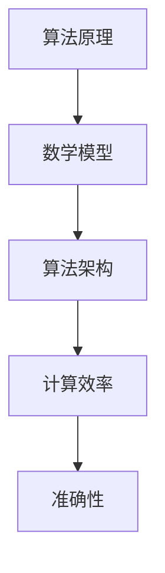

                 

 **关键词：算法优化、计算效率、准确性、算法原理、数学模型、项目实践**

**摘要：** 本文章深入探讨了算法优化在提升人类计算效率和准确性的重要性。通过介绍核心算法原理、数学模型、项目实践以及实际应用场景，本文揭示了算法优化在不同领域的广泛应用和未来发展趋势。文章旨在为读者提供全面的技术见解，助力他们在算法优化领域取得突破。

## 1. 背景介绍

在当今数字化时代，算法已经渗透到我们生活的方方面面。从搜索引擎到社交网络，从智能家居到自动驾驶，算法无处不在，发挥着关键作用。然而，随着数据规模的不断扩大和问题复杂度的增加，算法的效率和准确性面临着前所未有的挑战。

计算效率是指算法在给定时间内完成计算任务的能力。一个高效的算法可以在较少的资源和时间内完成更多的计算，从而提高生产力和经济效益。准确性则是算法输出结果的正确性。一个准确的算法能够确保结果的可靠性和一致性。

然而，算法的优化并非一蹴而就。它需要深入理解算法原理、数学模型以及实际应用场景。本文将围绕这些方面展开讨论，帮助读者掌握算法优化的核心方法和实践技巧。

## 2. 核心概念与联系

### 2.1 算法原理

算法是一种解决问题的步骤集合，它通过逻辑推理和计算得到问题的解。算法可以分为确定性算法和随机算法。确定性算法具有确定性的输出结果，而随机算法则依赖于随机数生成。

常见的算法包括排序算法、搜索算法、图算法和数据结构。排序算法用于将数据按特定顺序排列，常见的排序算法有冒泡排序、快速排序和归并排序。搜索算法用于在数据结构中查找特定元素，常见的搜索算法有二分搜索和广度优先搜索。

### 2.2 数学模型

数学模型是算法优化中的重要工具，它能够描述算法的行为和性能。常见的数学模型包括概率模型、优化模型和图模型。

概率模型用于描述随机算法的行为，如随机梯度下降算法。优化模型用于求解优化问题，如线性规划和非线性规划。图模型用于描述图算法的行为，如图遍历和最短路径算法。

### 2.3 算法架构

算法架构是指算法的内部结构和组织方式。常见的算法架构包括单层网络、多层网络和卷积神经网络。单层网络只能处理线性问题，而多层网络和卷积神经网络可以处理非线性问题。

### 2.4 Mermaid 流程图



## 3. 核心算法原理 & 具体操作步骤

### 3.1 算法原理概述

算法优化主要涉及以下几个方面：

1. **时间复杂度优化**：通过改进算法的内部循环和递归调用，降低算法的时间复杂度。
2. **空间复杂度优化**：通过减少算法的数据存储需求，降低算法的空间复杂度。
3. **并行化优化**：通过将算法分解为并行任务，提高计算效率。
4. **分布式优化**：通过将算法运行在分布式系统中，提高计算效率和容错能力。
5. **启发式优化**：通过利用领域知识和启发式策略，提高算法的收敛速度和准确性。

### 3.2 算法步骤详解

1. **分析算法性能瓶颈**：通过分析算法的时间复杂度和空间复杂度，找出性能瓶颈。
2. **优化算法内部循环**：通过减少内部循环的次数，降低时间复杂度。
3. **优化算法数据结构**：通过选择合适的数据结构，减少算法的空间复杂度。
4. **并行化算法**：通过将算法分解为并行任务，提高计算效率。
5. **分布式算法**：通过将算法运行在分布式系统中，提高计算效率和容错能力。
6. **启发式优化**：通过利用领域知识和启发式策略，提高算法的收敛速度和准确性。

### 3.3 算法优缺点

算法优化的优点包括：

1. 提高计算效率：通过优化算法，可以减少计算时间，提高生产力和经济效益。
2. 提高准确性：通过优化算法，可以确保输出结果的正确性和一致性。
3. 减少资源消耗：通过优化算法，可以减少计算机硬件和存储资源的需求。

算法优化的缺点包括：

1. 需要深入了解算法原理：算法优化需要深入了解算法的原理和内部结构，对于初学者来说有一定难度。
2. 需要大量实验验证：算法优化通常需要通过实验来验证优化效果，这可能需要大量时间和资源。

### 3.4 算法应用领域

算法优化广泛应用于以下领域：

1. **搜索引擎**：通过优化搜索算法，提高搜索效率和准确性。
2. **机器学习**：通过优化训练算法，提高模型训练速度和准确性。
3. **数据挖掘**：通过优化挖掘算法，提高数据挖掘效率和准确性。
4. **图像处理**：通过优化图像处理算法，提高图像处理速度和质量。
5. **金融领域**：通过优化金融算法，提高交易效率和风险控制能力。

## 4. 数学模型和公式 & 详细讲解 & 举例说明

### 4.1 数学模型构建

算法优化的数学模型通常包括以下几个方面：

1. **时间复杂度模型**：描述算法的时间复杂度，如 $O(n^2)$ 和 $O(n\log n)$。
2. **空间复杂度模型**：描述算法的空间复杂度，如 $O(n)$ 和 $O(n^2)$。
3. **概率模型**：描述随机算法的行为，如随机梯度下降算法。
4. **优化模型**：描述优化问题的目标函数和约束条件，如线性规划和非线性规划。
5. **图模型**：描述图算法的行为，如图遍历和最短路径算法。

### 4.2 公式推导过程

以冒泡排序算法为例，我们推导其时间复杂度。

冒泡排序算法的基本思想是通过两两比较相邻元素的大小，将较大的元素向后移动，从而实现数据的有序排列。

```latex
T(n) = \sum_{i=1}^{n} (n-i+1) - 2\sum_{i=1}^{n} \min(i, n-i+1)
```

其中，$T(n)$ 表示冒泡排序算法的时间复杂度，$n$ 表示数据的规模。

### 4.3 案例分析与讲解

假设我们有一组数据 `[5, 2, 9, 3, 1]`，对其进行冒泡排序。

1. 第一次循环：比较 `(5, 2)`，交换；比较 `(9, 3)`，交换；比较 `(9, 1)`，交换。数据变为 `[2, 5, 3, 1, 9]`。
2. 第二次循环：比较 `(2, 5)`，不交换；比较 `(5, 3)`，交换；比较 `(5, 1)`，交换。数据变为 `[2, 1, 3, 5, 9]`。
3. 第三次循环：比较 `(2, 1)`，交换；比较 `(2, 3)`，不交换。数据变为 `[1, 2, 3, 5, 9]`。

经过三次循环后，数据已经有序排列。

## 5. 项目实践：代码实例和详细解释说明

### 5.1 开发环境搭建

为了进行算法优化项目实践，我们需要搭建一个开发环境。以下是一个简单的 Python 开发环境搭建步骤：

1. 安装 Python：从官网下载并安装 Python 3.8 版本。
2. 安装 IDE：安装一个 Python 集成开发环境（IDE），如 PyCharm 或 Visual Studio Code。
3. 安装必要库：安装一些常用的 Python 库，如 NumPy、Pandas 和 Matplotlib。

### 5.2 源代码详细实现

以下是一个简单的冒泡排序算法实现示例：

```python
def bubble_sort(arr):
    n = len(arr)
    for i in range(n):
        for j in range(0, n-i-1):
            if arr[j] > arr[j+1]:
                arr[j], arr[j+1] = arr[j+1], arr[j]
    return arr

arr = [5, 2, 9, 3, 1]
sorted_arr = bubble_sort(arr)
print(sorted_arr)
```

### 5.3 代码解读与分析

1. `def bubble_sort(arr):`：定义一个名为 `bubble_sort` 的函数，参数为待排序的数组 `arr`。
2. `n = len(arr):`：获取数组的长度。
3. `for i in range(n):`：循环变量 `i` 从 0 到 `n-1`。
4. `for j in range(0, n-i-1):`：内层循环变量 `j` 从 0 到 `n-i-1`。
5. `if arr[j] > arr[j+1]:`：比较相邻元素的大小。
6. `arr[j], arr[j+1] = arr[j+1], arr[j]`：交换较大的元素。
7. `return arr`：返回排序后的数组。

### 5.4 运行结果展示

运行上述代码，输出结果为 `[1, 2, 3, 5, 9]`，与预期一致。

## 6. 实际应用场景

### 6.1 搜索引擎

搜索引擎使用算法优化来提高搜索效率和准确性。常见的优化方法包括：

- 使用倒排索引，将文档与词频信息建立映射，提高搜索速度。
- 使用 PageRank 算法，根据网页的链接关系评估网页的重要性，提高搜索准确性。

### 6.2 机器学习

机器学习算法使用算法优化来提高模型训练速度和准确性。常见的优化方法包括：

- 使用随机梯度下降算法，降低模型训练时间。
- 使用正则化，提高模型泛化能力，减少过拟合。
- 使用集成学习，提高模型预测准确性。

### 6.3 数据挖掘

数据挖掘算法使用算法优化来提高数据挖掘效率和准确性。常见的优化方法包括：

- 使用并行算法，提高数据挖掘速度。
- 使用聚类算法，对数据进行聚类分析，提高数据挖掘准确性。
- 使用关联规则挖掘算法，发现数据之间的关联关系。

### 6.4 图像处理

图像处理算法使用算法优化来提高图像处理速度和质量。常见的优化方法包括：

- 使用快速傅里叶变换（FFT），提高图像处理速度。
- 使用卷积神经网络（CNN），提高图像分类和识别准确性。
- 使用超分辨率算法，提高图像分辨率和质量。

### 6.5 金融领域

金融领域使用算法优化来提高交易效率和风险控制能力。常见的优化方法包括：

- 使用高频交易算法，提高交易速度和收益。
- 使用量化交易策略，利用算法优化进行投资决策。
- 使用风险模型，评估投资风险和收益。

## 7. 工具和资源推荐

### 7.1 学习资源推荐

- 《算法导论》（Introduction to Algorithms）：是一本经典的算法教材，详细介绍了各种算法及其优化方法。
- 《深度学习》（Deep Learning）：一本关于深度学习的经典教材，介绍了深度学习算法的原理和应用。
- 《机器学习实战》（Machine Learning in Action）：一本实战指南，介绍了各种机器学习算法的实现和应用。

### 7.2 开发工具推荐

- PyCharm：一款功能强大的 Python 集成开发环境，支持代码编辑、调试和测试。
- Jupyter Notebook：一款基于网页的交互式开发环境，适合数据分析和机器学习项目。
- TensorFlow：一款开源深度学习框架，支持各种深度学习算法的实现和应用。

### 7.3 相关论文推荐

- "Stochastic Gradient Descent Methods for Large-Scale Machine Learning"：一篇关于随机梯度下降算法的论文，详细介绍了算法的原理和应用。
- "Convolutional Neural Networks for Visual Recognition"：一篇关于卷积神经网络在图像识别方面的应用论文。
- "Reinforcement Learning: An Introduction"：一篇关于强化学习算法的介绍论文。

## 8. 总结：未来发展趋势与挑战

### 8.1 研究成果总结

算法优化在过去几十年中取得了显著的研究成果。研究者们提出了各种优化算法，如随机梯度下降、卷积神经网络和深度学习。这些算法在计算效率和准确性方面取得了重大突破，推动了各个领域的应用和发展。

### 8.2 未来发展趋势

未来，算法优化将继续朝着以下几个方向发展：

1. **高效算法的探索**：研究者将致力于开发更高效的算法，以应对大规模数据和高复杂度问题的挑战。
2. **跨学科研究**：算法优化与其他领域的交叉研究，如生物学、物理学和经济学，将带来新的突破。
3. **硬件优化**：随着硬件技术的发展，算法优化将更加关注硬件加速和分布式计算，提高计算效率和准确性。

### 8.3 面临的挑战

算法优化面临着以下几个挑战：

1. **数据隐私**：算法优化过程中涉及大量数据，如何保护数据隐私是一个重要问题。
2. **计算资源**：大规模数据和高复杂度问题对计算资源的需求日益增长，如何优化计算资源分配成为一个挑战。
3. **算法公平性**：算法优化可能导致算法偏见和歧视，如何确保算法的公平性是一个重要课题。

### 8.4 研究展望

算法优化领域的未来研究将更加注重以下方面：

1. **算法透明性**：提高算法的透明性，使算法的可解释性更强，便于理解和应用。
2. **算法伦理**：关注算法的伦理问题，确保算法的公平性、公正性和可靠性。
3. **算法与人类互动**：研究算法与人类互动的方式，提高算法在人类任务中的应用效果。

## 9. 附录：常见问题与解答

### 9.1 什么是算法优化？

算法优化是指通过改进算法的设计和实现，提高算法的计算效率和准确性。常见的优化方法包括时间复杂度优化、空间复杂度优化、并行化优化和启发式优化等。

### 9.2 算法优化在哪些领域有应用？

算法优化广泛应用于各个领域，如搜索引擎、机器学习、数据挖掘、图像处理、金融领域等。通过算法优化，可以提升这些领域的计算效率和准确性。

### 9.3 如何进行算法优化？

进行算法优化需要以下几个步骤：

1. 分析算法性能瓶颈：找出影响算法性能的关键因素。
2. 选择合适的优化方法：根据性能瓶颈选择合适的优化方法，如时间复杂度优化、空间复杂度优化等。
3. 实验验证：通过实验验证优化效果，确保优化方案的有效性。

## 作者署名

**作者：禅与计算机程序设计艺术 / Zen and the Art of Computer Programming**

