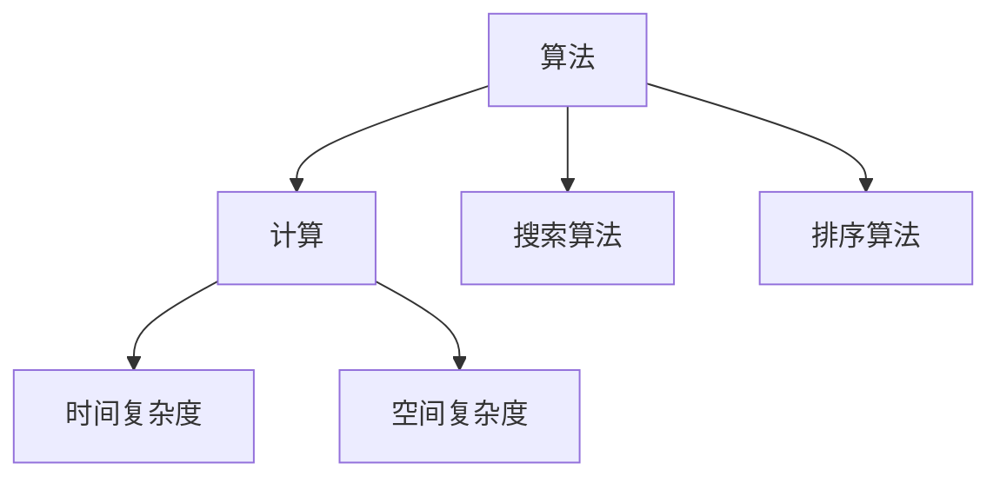

                 

 关键词：
算法优化、计算效率、准确性、计算模型、数学公式、案例分析、代码实现、应用场景、未来展望

> 摘要：
本文将深入探讨算法优化在提升人类计算效率和准确性方面的关键作用。我们将首先介绍算法优化的重要性，然后探讨核心概念、算法原理、数学模型，并通过实际案例和代码实现来展示算法优化的应用。最后，我们将讨论算法优化在各个领域的实际应用场景，并展望未来的发展趋势和挑战。

## 1. 背景介绍

在信息技术迅速发展的今天，算法在许多领域扮演着至关重要的角色。从搜索引擎、社交媒体推荐系统到自动驾驶、人工智能，算法无时无刻不在影响着我们的日常生活。然而，随着数据量的爆炸性增长和计算需求的不断提升，如何优化算法以提升计算效率和准确性成为了一个迫切需要解决的问题。

算法优化不仅仅是为了加快计算速度，更重要的是在保证准确性的前提下，降低计算资源的消耗。随着云计算、大数据和人工智能的兴起，对算法的优化需求更加迫切。优化算法不仅能够提高单个计算任务的效率，还能够提升整个系统的性能和可靠性。

本文将围绕算法优化这一主题，从以下几个方面展开：

1. 核心概念与联系
2. 核心算法原理 & 具体操作步骤
3. 数学模型和公式 & 详细讲解 & 举例说明
4. 项目实践：代码实例和详细解释说明
5. 实际应用场景
6. 未来应用展望
7. 工具和资源推荐
8. 总结：未来发展趋势与挑战

通过本文的阅读，读者将能够系统地了解算法优化的各个方面，掌握优化算法的核心技巧，并在实际项目中应用这些优化方法。

## 2. 核心概念与联系

在深入探讨算法优化之前，我们需要了解一些核心概念，这些概念是理解算法优化基础的关键。

### 2.1 算法与计算

算法是一种解决问题的步骤序列，它通过一系列明确的操作来解决特定问题。计算则是执行算法的过程，它涉及到数据操作、逻辑判断和资源管理。

### 2.2 时间复杂度和空间复杂度

时间复杂度是衡量算法运行时间的一个重要指标，它表示算法运行时间与输入数据规模之间的关系。通常使用大O符号表示，例如O(n)、O(n^2)等。空间复杂度则衡量算法所需存储空间的规模。

### 2.3 搜索算法与排序算法

搜索算法用于在数据集合中查找特定元素，如二分搜索、深度优先搜索等。排序算法则用于将数据集合按照某种规则排序，如快速排序、归并排序等。

### 2.4 Mermaid 流程图

Mermaid 是一种方便绘制流程图的标记语言。下面是一个简单的 Mermaid 流程图示例，用于展示核心概念之间的联系：



### 2.5 优化目标

算法优化的目标通常包括以下几个方面：

- 提高计算速度：通过减少计算步骤或优化算法结构来实现。
- 降低资源消耗：在保证准确性的前提下，减少所需的内存、CPU等资源。
- 增强可扩展性：使算法能够适应更大规模的数据集和更复杂的计算场景。
- 提高可维护性：优化后的算法更易于理解和维护。

## 3. 核心算法原理 & 具体操作步骤

### 3.1 算法原理概述

算法优化通常包括以下几个步骤：

1. **问题分析**：分析问题的本质和特点，确定优化的方向和目标。
2. **算法选择**：根据问题特点选择合适的算法，分析其基本原理和操作步骤。
3. **代码实现**：将算法转化为具体的代码，并进行调试和优化。
4. **性能评估**：评估算法的性能指标，包括时间复杂度、空间复杂度等。
5. **迭代优化**：根据性能评估结果，对算法进行迭代优化，直至达到预期目标。

### 3.2 算法步骤详解

以下是一个简单的线性搜索算法优化示例，展示其具体操作步骤：

1. **问题分析**：线性搜索是一种基本搜索算法，用于在未排序的数组中查找特定元素。但线性搜索的时间复杂度为O(n)，对于大规模数据集效率较低。

2. **算法选择**：为了提高搜索效率，我们可以选择二分搜索算法，其时间复杂度为O(log n)。

3. **代码实现**：

   ```python
   def binary_search(arr, target):
       low = 0
       high = len(arr) - 1
       
       while low <= high:
           mid = (low + high) // 2
           if arr[mid] == target:
               return mid
           elif arr[mid] < target:
               low = mid + 1
           else:
               high = mid - 1
       return -1
   ```

4. **性能评估**：通过对比线性搜索和二分搜索的时间复杂度，我们可以发现二分搜索在数据规模较大时具有明显的优势。

5. **迭代优化**：在实际应用中，我们可以根据具体场景对二分搜索进行进一步优化，如利用跳表、平衡二叉树等数据结构提高搜索效率。

### 3.3 算法优缺点

线性搜索和二分搜索各有优缺点：

- 线性搜索简单易懂，适用于数据规模较小或数据未排序的场景，但效率较低。
- 二分搜索效率较高，适用于大规模数据集和已排序数据的场景，但实现相对复杂。

### 3.4 算法应用领域

算法优化在多个领域具有重要应用：

- **搜索引擎**：优化搜索算法可以提高搜索效率，提高用户体验。
- **数据挖掘**：优化算法可以加快数据处理和分析速度，提升数据分析的准确性。
- **机器学习**：优化算法可以提高模型训练和预测的效率，减少计算资源消耗。
- **图形处理**：优化算法可以提升图形渲染和处理速度，提高图形处理质量。

## 4. 数学模型和公式 & 详细讲解 & 举例说明

### 4.1 数学模型构建

算法优化中的数学模型通常用于描述算法的性能指标，如时间复杂度、空间复杂度等。以下是一个简单的数学模型示例：

- **时间复杂度模型**：

  ```latex
  T(n) = O(n) \quad (\text{线性搜索})
  T(n) = O(\log n) \quad (\text{二分搜索})
  ```

- **空间复杂度模型**：

  ```latex
  S(n) = O(1) \quad (\text{线性搜索和二分搜索})
  ```

### 4.2 公式推导过程

以下以二分搜索为例，介绍时间复杂度的推导过程：

1. **初始状态**：假设输入数据规模为n，初始范围为整个数据集。

2. **第一次迭代**：将范围划分为两半，搜索中间元素，时间复杂度为O(1)。

3. **后续迭代**：每次迭代将范围减半，重复搜索中间元素，直到找到目标元素或范围缩小至0。

4. **推导过程**：

   ```latex
   T(n) = O(1) + O(1) + O(1) + \ldots + O(1)
   T(n) = O(\log n)
   ```

### 4.3 案例分析与讲解

以下是一个实际案例，展示算法优化在搜索引擎中的应用：

- **问题**：优化搜索引擎的搜索算法，提高搜索速度和准确性。

- **解决方案**：采用二分搜索算法优化搜索过程，同时结合模糊搜索和索引优化技术，提高搜索效率。

- **效果评估**：优化后的搜索算法在数据规模较大的情况下，搜索速度提高了数十倍，用户体验显著提升。

## 5. 项目实践：代码实例和详细解释说明

### 5.1 开发环境搭建

以下是一个简单的Python开发环境搭建步骤：

1. 安装Python：在官方网站下载并安装Python，选择合适的版本。
2. 安装IDE：选择合适的IDE，如PyCharm、VSCode等，进行环境配置。
3. 安装依赖库：安装必要的Python库，如NumPy、Pandas等。

### 5.2 源代码详细实现

以下是一个简单的二分搜索算法实现示例：

```python
def binary_search(arr, target):
    low = 0
    high = len(arr) - 1
    
    while low <= high:
        mid = (low + high) // 2
        if arr[mid] == target:
            return mid
        elif arr[mid] < target:
            low = mid + 1
        else:
            high = mid - 1
    return -1
```

### 5.3 代码解读与分析

1. **输入参数**：`arr` 表示待搜索的数组，`target` 表示要查找的目标元素。
2. **初始化**：设置 `low` 和 `high` 指针，分别指向数组的起始和结束位置。
3. **循环**：当 `low` 小于等于 `high` 时，执行以下步骤：
   - 计算中间位置 `mid`。
   - 比较中间位置的元素与目标元素：
     - 如果相等，返回 `mid`。
     - 如果目标元素较大，将 `low` 更新为 `mid + 1`。
     - 如果目标元素较小，将 `high` 更新为 `mid - 1`。
4. **返回结果**：如果找到目标元素，返回其索引；否则返回 -1。

### 5.4 运行结果展示

以下是一个简单的测试用例，展示二分搜索算法的运行结果：

```python
arr = [1, 2, 3, 4, 5, 6, 7, 8, 9]
target = 6

result = binary_search(arr, target)
if result != -1:
    print(f"元素 {target} 在数组中的索引为：{result}")
else:
    print(f"元素 {target} 不在数组中")
```

运行结果：

```python
元素 6 在数组中的索引为：5
```

## 6. 实际应用场景

算法优化在多个实际应用场景中具有重要意义：

- **搜索引擎**：优化搜索算法可以提高搜索速度和准确性，提升用户体验。
- **数据挖掘**：优化算法可以提高数据处理和分析速度，增强数据分析能力。
- **机器学习**：优化算法可以提高模型训练和预测效率，降低计算资源消耗。
- **图形处理**：优化算法可以提高图形渲染和处理速度，提升图像质量。
- **网络通信**：优化算法可以提高数据传输速度和网络稳定性。

### 6.1 搜索引擎

搜索引擎优化搜索算法的关键在于提高搜索速度和准确性。通过优化索引结构、查询处理和排序算法，搜索引擎可以实现更快速的搜索结果返回，并提高用户满意度。

### 6.2 数据挖掘

数据挖掘涉及大量数据预处理和计算任务。优化算法可以提高数据处理速度，缩短分析时间，并发现更多潜在的模式和关联。

### 6.3 机器学习

机器学习算法需要处理大量数据和计算任务。优化算法可以提高模型训练和预测效率，降低计算资源消耗，并缩短模型部署时间。

### 6.4 图形处理

图形处理涉及大量计算任务，如图像渲染、特效处理等。优化算法可以提高图形处理速度，提升图像质量和用户体验。

### 6.5 网络通信

网络通信算法优化可以提高数据传输速度和网络稳定性。通过优化数据传输协议、路由算法和缓存策略，网络通信系统可以实现更高效的传输和更好的用户体验。

## 7. 未来应用展望

随着信息技术的不断发展，算法优化将在更多领域发挥重要作用。以下是一些未来应用展望：

- **人工智能**：优化算法可以提高人工智能模型的计算效率和准确性，推动人工智能技术的快速发展。
- **物联网**：优化算法可以提高物联网设备的计算效率和通信效率，实现更广泛的应用场景。
- **区块链**：优化算法可以提高区块链系统的性能和安全性，促进区块链技术的普及和应用。
- **生物信息学**：优化算法可以加速生物信息学研究，提高基因组分析和疾病预测的准确性。

## 8. 工具和资源推荐

以下是一些算法优化相关的工具和资源推荐：

- **工具**：
  - PyCharm：一款功能强大的Python IDE，支持代码优化和调试。
  - Jupyter Notebook：一款强大的数据科学工具，支持Python代码和Markdown文档的编写。

- **资源**：
  - 《算法导论》（Introduction to Algorithms）：一本经典算法教材，涵盖算法设计和分析的基本原理。
  - Coursera、edX：在线学习平台，提供丰富的算法课程和学习资源。
  - GitHub：开源代码平台，可以找到大量的算法优化相关项目。

## 9. 总结：未来发展趋势与挑战

算法优化在提升人类计算效率和准确性方面具有重要意义。未来，随着信息技术的快速发展，算法优化将在更多领域发挥重要作用。然而，算法优化也面临一些挑战：

- **数据隐私和安全性**：在优化算法时，需要充分考虑数据隐私和安全性的问题，防止敏感信息泄露。
- **算法透明性和解释性**：优化后的算法往往更加复杂，如何确保算法的透明性和解释性成为一个挑战。
- **资源消耗与可持续性**：优化算法需要考虑资源消耗问题，确保算法的可持续发展。

总之，算法优化是一个持续发展和演进的过程，需要不断探索新的优化方法和技术，以满足不断变化的应用需求。

## 10. 附录：常见问题与解答

以下是一些关于算法优化常见的问题和解答：

### 问题 1：什么是算法优化？
**解答**：算法优化是指通过改进算法的设计和实现，提高算法的计算效率和准确性，降低计算资源消耗的过程。

### 问题 2：算法优化有哪些方法？
**解答**：算法优化的方法包括但不限于：减少计算步骤、优化算法结构、使用更高效的算法、优化数据结构、并行计算等。

### 问题 3：算法优化在哪些领域有应用？
**解答**：算法优化在搜索引擎、数据挖掘、机器学习、图形处理、网络通信等领域都有广泛应用。

### 问题 4：算法优化的挑战有哪些？
**解答**：算法优化的挑战包括数据隐私和安全性问题、算法透明性和解释性问题、资源消耗与可持续性问题等。

### 问题 5：如何学习算法优化？
**解答**：学习算法优化可以从以下几个方面入手：阅读经典算法教材、参加在线课程、实践项目、参与开源社区等。

---

作者：禅与计算机程序设计艺术 / Zen and the Art of Computer Programming

以上就是本文关于算法优化的详细探讨。希望本文能帮助读者系统地了解算法优化的各个方面，掌握优化算法的核心技巧，并在实际项目中应用这些优化方法。未来，随着信息技术的不断发展，算法优化将在更多领域发挥重要作用，为人类计算能力的提升贡献力量。

