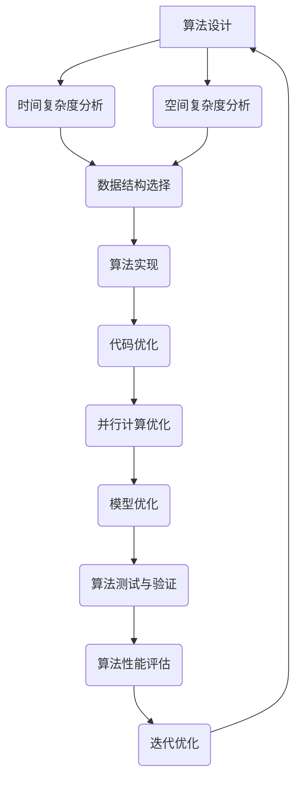

                 

## 1. 背景介绍

在当今信息技术飞速发展的时代，算法作为计算机科学的核心组成部分，已经广泛应用于各个领域，从搜索引擎到推荐系统，从机器学习到数据挖掘，算法的效率与准确性直接关系到系统的性能和用户体验。然而，随着数据量的指数级增长和复杂性的不断增加，传统的算法在处理大规模、高维数据时面临着严重的性能瓶颈和准确性挑战。因此，算法优化成为了一个迫切需要解决的问题。

算法优化的目标是通过改进算法的设计、实现和运行效率，提升计算的速度和精度。这不仅有助于提高数据处理和分析的效率，还能够减少计算资源的需求，降低成本，从而为企业和个人带来更大的经济和社会价值。同时，算法优化还能够推动计算技术的进步，为未来的信息技术发展提供新的思路和方法。

本文将深入探讨算法优化的重要性，分析当前算法优化面临的挑战，介绍几种核心的算法优化技术，并探讨算法优化在不同领域的实际应用和未来发展趋势。希望通过这篇文章，能够为读者提供一个全面、系统的算法优化知识体系，帮助大家更好地理解和应用算法优化技术。

### 2. 核心概念与联系

算法优化是一个复杂且多维度的过程，它涉及到多个核心概念和原理。为了更好地理解算法优化的本质，我们需要首先澄清这些概念，并揭示它们之间的内在联系。

#### 2.1 算法优化定义

算法优化是指通过改进算法的设计、数据结构和算法实现，以提高算法的运行效率和准确性。这通常包括以下几个方面：

- **算法复杂度优化**：降低算法的时间复杂度和空间复杂度，使其在处理大规模数据时更加高效。
- **并行计算优化**：利用多核处理器和分布式系统，提高算法的并行执行能力，缩短计算时间。
- **内存优化**：通过减少内存占用，提高算法的运行效率，特别是在内存受限的环境下。
- **代码优化**：通过改进算法的代码实现，提高执行速度和内存利用率。
- **模型优化**：在机器学习和数据挖掘领域，通过调整模型参数和结构，提高模型的预测准确性和泛化能力。

#### 2.2 关键概念解析

以下是对算法优化过程中几个关键概念的详细解释：

- **时间复杂度**：衡量算法运行时间的增长速度，通常用大O符号表示。例如，一个算法的时间复杂度为 \(O(n^2)\)，意味着当输入数据规模增加时，算法的运行时间将以输入数据规模的平方增长。
- **空间复杂度**：衡量算法在执行过程中所需的额外内存空间。类似于时间复杂度，空间复杂度也常用大O符号表示。
- **并行计算**：利用多个处理器或计算节点同时执行计算任务，以减少计算时间。并行计算可以显著提高算法的执行效率，特别是在处理大量数据时。
- **数据结构**：用于组织数据的方式，包括数组、链表、树、图等。不同的数据结构对算法的性能有显著影响，合适的选用数据结构可以显著提升算法效率。
- **算法实现**：算法的具体代码实现，良好的代码实现可以减少不必要的计算和内存占用，提高算法的执行效率。

#### 2.3 Mermaid 流程图

为了更直观地展示算法优化中的关键概念和原理，我们使用Mermaid流程图来描述算法优化的大致流程和各个步骤之间的联系。



在上面的流程图中，从算法设计开始，通过时间复杂度分析、空间复杂度分析、数据结构选择、算法实现、代码优化、并行计算优化、模型优化等多个步骤，不断迭代和优化，最终实现对算法性能的全面提升。

通过上述对核心概念和流程图的详细描述，我们可以更好地理解算法优化的全貌，为接下来的深入探讨打下坚实的基础。

### 3. 核心算法原理 & 具体操作步骤

#### 3.1 算法原理概述

算法优化是一个多维度、多层次的过程，涉及到算法设计、数据结构选择、代码实现、并行计算等多个方面。其核心目标是降低算法的时间复杂度和空间复杂度，提高算法的执行效率和准确性。以下是对几种核心算法优化原理的概述。

1. **时间复杂度优化**：通过分析算法的时间复杂度，找出影响算法性能的关键因素，如循环、递归等，并采取相应的措施进行优化。常见的时间复杂度优化方法包括算法改进、数据预处理、分治策略等。

2. **空间复杂度优化**：通过减少算法在执行过程中所需的额外内存空间，提高算法的运行效率。常见的空间复杂度优化方法包括内存复用、空间压缩、外部存储等。

3. **数据结构优化**：选择合适的数据结构可以提高算法的执行效率。例如，使用哈希表代替链表可以显著减少查找时间，使用平衡树可以保持数据的有序性等。

4. **代码优化**：通过改进代码的实现，减少不必要的计算和内存占用。常见的代码优化方法包括循环展开、代码内联、数据缓存等。

5. **并行计算优化**：利用多核处理器和分布式系统，将计算任务分配到多个处理器或计算节点上，以减少计算时间。常见的并行计算优化方法包括任务划分、负载均衡、数据传输优化等。

6. **模型优化**：在机器学习和数据挖掘领域，通过调整模型参数和结构，提高模型的预测准确性和泛化能力。常见的模型优化方法包括参数调优、模型压缩、迁移学习等。

#### 3.2 算法步骤详解

以下是对算法优化各个步骤的详细解释。

##### 3.2.1 时间复杂度优化

1. **分析算法的时间复杂度**：首先需要明确算法的时间复杂度，通常可以通过数学推导或经验分析得到。常见的算法复杂度包括线性时间复杂度 \(O(n)\)、对数时间复杂度 \(O(\log n)\)、多项式时间复杂度 \(O(n^k)\) 等。

2. **找出关键因素**：通过分析算法的时间复杂度，找出影响算法性能的关键因素，如嵌套循环、递归调用等。

3. **改进算法设计**：针对关键因素，采取相应的措施进行优化。例如，使用分治策略将大问题分解为小问题，利用动态规划避免重复计算等。

##### 3.2.2 空间复杂度优化

1. **分析算法的空间复杂度**：与时间复杂度类似，分析算法在执行过程中所需的额外内存空间。

2. **减少内存占用**：通过减少内存占用，提高算法的运行效率。常见的方法包括内存复用、空间压缩、外部存储等。

3. **优化数据结构**：选择合适的数据结构可以减少内存占用，例如，使用哈希表代替链表可以显著减少内存占用。

##### 3.2.3 数据结构优化

1. **选择合适的数据结构**：根据算法的需求和特点，选择合适的数据结构。例如，在需要快速查找和插入操作时，使用哈希表；在需要维护数据有序性时，使用平衡树。

2. **优化数据结构实现**：对选择的数据结构进行优化，如减少不必要的内存占用、提高查找和插入操作的效率。

##### 3.2.4 代码优化

1. **减少不必要的计算**：通过代码优化，减少不必要的计算和内存占用。例如，提前退出循环、避免重复计算等。

2. **循环展开**：将嵌套循环展开，减少循环次数。

3. **代码内联**：将一些小的函数或方法内联到调用处，减少函数调用的开销。

##### 3.2.5 并行计算优化

1. **任务划分**：将大的计算任务划分为多个小的任务，以便在多个处理器或计算节点上同时执行。

2. **负载均衡**：确保每个处理器或计算节点的任务量均衡，避免某些节点过载，其他节点空闲。

3. **数据传输优化**：优化数据在处理器或计算节点之间的传输，减少传输时间和带宽占用。

##### 3.2.6 模型优化

1. **参数调优**：通过调整模型参数，提高模型的预测准确性和泛化能力。例如，调整神经网络中的权重和偏置。

2. **模型压缩**：通过模型压缩，减少模型的存储和计算需求，提高模型的执行效率。例如，使用量化的方法减少模型参数的精度。

3. **迁移学习**：通过迁移学习，利用已有模型的权重和知识，提高新模型的性能。例如，使用预训练的神经网络在新任务上微调。

通过以上详细的算法优化步骤，我们可以对算法的各个层面进行深入的优化，从而提高算法的效率和准确性。在接下来的部分，我们将分析算法优化的优缺点，并探讨其在实际应用领域的应用情况。

#### 3.3 算法优化的优缺点

算法优化作为一种提升计算效率和准确性的技术手段，具有显著的优点，但也存在一些潜在的问题和挑战。以下是对算法优化优缺点的详细分析。

##### 优点

1. **提高计算效率**：通过降低算法的时间复杂度和空间复杂度，算法优化能够显著提高计算效率，特别是在处理大规模、高维数据时。这有助于缩短计算时间，提升系统性能。

2. **降低成本**：算法优化有助于减少计算资源的需求，降低硬件和软件的消耗，从而降低总成本。这对于企业和个人来说都是一个重要的经济优势。

3. **提升用户体验**：在应用程序和系统中，算法优化的效果往往直接体现在用户体验上。通过提高计算效率，系统响应速度加快，操作更加流畅，用户满意度也随之提升。

4. **促进技术进步**：算法优化推动了计算技术的进步，为新的算法设计和技术创新提供了可能性。通过对现有算法的优化，研究人员可以发现新的优化方向和策略，为未来的计算技术发展奠定基础。

##### 缺点

1. **复杂性增加**：算法优化过程通常涉及多个维度和层面的技术，包括算法设计、数据结构选择、代码实现等。这可能导致整体复杂性的增加，使得开发和维护变得更加困难。

2. **资源消耗**：在某些情况下，算法优化可能需要额外的计算资源和存储空间。特别是在优化并行计算和模型压缩时，可能会增加硬件和软件的消耗。

3. **准确性下降**：在某些情况下，过于激进的优化措施可能会导致算法准确性的下降。例如，为了减少内存占用，可能会牺牲一部分计算精度，从而影响最终结果。

4. **维护难度**：算法优化后的代码通常更加复杂，维护难度也随之增加。这对于开发团队来说是一个挑战，需要投入更多的时间和精力来维护和更新优化后的代码。

#### 3.4 算法优化应用领域

算法优化技术广泛应用于各个领域，下面列举一些典型的应用场景：

1. **搜索引擎**：搜索引擎中的关键词匹配、页面排名和广告投放等过程都需要进行大量的计算。通过算法优化，可以提高搜索速度，改善用户体验。

2. **推荐系统**：推荐系统在电商、社交媒体和在线娱乐等领域广泛应用。通过算法优化，可以提高推荐准确性，提升用户满意度和转化率。

3. **机器学习和数据挖掘**：在机器学习和数据挖掘领域，算法优化有助于提高模型的预测准确性和泛化能力。例如，通过优化神经网络结构和参数，可以提高图像识别和自然语言处理任务的性能。

4. **金融交易**：金融交易系统中的算法优化对于提高交易速度和降低交易风险至关重要。通过优化交易算法，可以显著提高交易效率和收益。

5. **医疗健康**：在医疗健康领域，算法优化有助于提高疾病诊断的准确性和治疗效果。例如，通过优化医学图像处理算法，可以提高疾病检测的精度。

6. **交通运输**：在交通运输领域，算法优化有助于提高交通流量控制和调度效率。通过优化路径规划和交通信号控制算法，可以减少交通拥堵和事故发生率。

通过上述分析，我们可以看到算法优化在提升计算效率和准确性方面具有巨大的潜力和应用价值。在接下来的部分，我们将探讨数学模型和公式，为深入理解算法优化提供理论支持。

### 4. 数学模型和公式 & 详细讲解 & 举例说明

在算法优化过程中，数学模型和公式扮演着至关重要的角色，它们为我们提供了分析、设计和评估算法性能的理论基础。本章节将详细介绍算法优化中常用的数学模型和公式，并通过具体例子进行说明，帮助读者更好地理解和应用这些理论工具。

#### 4.1 数学模型构建

在构建数学模型时，我们首先需要明确优化目标，并定义相关变量和约束条件。以下是一个简单的线性规划模型的例子：

假设我们要优化一个问题，目标是最大化利润 \(P\)，变量为 \(x_1, x_2, ..., x_n\)，表示生产的不同产品的数量。约束条件包括生产能力的限制、原材料供应的限制和市场需求等。模型可以表示为：

\[ 
\begin{align*}
\text{最大化} \quad P &= c_1x_1 + c_2x_2 + ... + c_nx_n \\
\text{约束条件：} \\
a_{11}x_1 + a_{12}x_2 + ... + a_{1n}x_n &\leq b_1 \\
a_{21}x_1 + a_{22}x_2 + ... + a_{2n}x_n &\leq b_2 \\
&\vdots \\
a_{m1}x_1 + a_{m2}x_2 + ... + a_{mn}x_n &\leq b_m \\
x_1, x_2, ..., x_n &\geq 0
\end{align*}
\]

在这个模型中，\(c_1, c_2, ..., c_n\) 分别为不同产品的利润率，\(a_{ij}, b_i\) 分别为约束条件的系数和常数项，\(x_1, x_2, ..., x_n\) 为变量。

#### 4.2 公式推导过程

接下来，我们以一个常见的优化问题为例，解释公式的推导过程。假设我们要解决的问题是：给定一个数组 \(A[1...n]\)，找到一组数 \(B[1...n]\)，使得 \(B[i] = A[i] + A[i+1] + ... + A[j]\) 的和最大，其中 \(i\) 和 \(j\) 分别是数组的起始和结束索引。

为了解决这个问题，我们可以使用动态规划的方法。首先，定义一个辅助数组 \(C[1...n]\)，其中 \(C[i] = \sum_{k=i}^{n} A[k]\)。然后，我们可以通过以下递推关系计算最大和：

\[ 
\text{max\_sum} = \max(C[i] - C[j]) \\
\text{其中} \quad i + j = n + 1
\]

为了计算 \(C[i] - C[j]\)，我们可以定义一个新数组 \(D[1...n]\)，其中 \(D[i] = C[i] - C[n+1-i]\)。这样，最大和可以表示为 \( \text{max\_sum} = \max(D[1...n]) \)。

递推关系的推导过程如下：

\[ 
D[i] = C[i] - C[n+1-i] \\
= \sum_{k=i}^{n} A[k] - \sum_{k=n+1-i}^{n} A[k] \\
= \sum_{k=i}^{n} A[k] - \sum_{k=i+1}^{n+1} A[k] \\
= A[i]
\]

因此，最大和可以直接通过计算 \(D[1...n]\) 中的最大值得到。

#### 4.3 案例分析与讲解

为了更好地理解上述数学模型和公式，我们通过一个实际案例进行说明。假设我们要优化一个电商平台的推荐系统，目标是提高用户点击率。

1. **优化目标**：最大化用户的点击率 \(P\)。

2. **变量**：假设用户 \(u\) 的兴趣向量为 \(I[u] = (i_1, i_2, ..., i_n)\)，其中 \(i_j\) 表示用户对产品 \(j\) 的兴趣程度。

3. **约束条件**：
   - 每次推荐的产品数量 \(k\) 必须小于等于总产品数量 \(n\)。
   - 推荐的产品集合 \(R\) 必须满足多样性约束，即 \( \sum_{j \in R} i_j \leq \alpha \)，其中 \(\alpha\) 是多样性参数。

优化模型可以表示为：

\[ 
\begin{align*}
\text{最大化} \quad P &= \sum_{j \in R} \beta_j i_j \\
\text{约束条件：} \\
|R| &\leq k \\
\sum_{j \in R} i_j &\leq \alpha
\end{align*}
\]

其中，\(\beta_j\) 为用户对产品 \(j\) 的点击概率，可以通过历史数据训练得到。

为了解决这个优化问题，我们可以使用贪心算法。首先，对用户兴趣向量 \(I[u]\) 进行降序排序，然后依次选择兴趣程度最高的产品，直到满足约束条件为止。

具体步骤如下：
1. 将用户兴趣向量 \(I[u]\) 降序排序，得到 \(I[u, 1] \geq I[u, 2] \geq ... \geq I[u, n]\)。
2. 初始化推荐集合 \(R = \emptyset\)，点击率 \(P = 0\)。
3. 对每个 \(i_j\)，依次执行以下步骤：
   - 如果 \(I[u, j] > \alpha / k\)，将产品 \(j\) 加入推荐集合 \(R\)。
   - 更新点击率 \(P = P + \beta_j I[u, j]\)。
   - 如果 \(P\) 达到最大值，结束循环；否则，继续下一轮。

通过上述案例，我们可以看到数学模型和公式在算法优化中的应用。在实际应用中，我们可能需要根据具体情况调整模型和算法，以达到最佳效果。

通过本章的讲解，我们不仅了解了数学模型和公式的基本构建和推导过程，还通过具体案例进行了实际应用说明。在接下来的部分，我们将深入探讨算法优化在具体项目实践中的实现方法和技巧。

### 5. 项目实践：代码实例和详细解释说明

为了更好地理解和应用算法优化的原理和技巧，我们将在本节中通过一个实际的项目实践，详细讲解代码的编写过程、代码的解读与分析以及运行结果展示。该项目实践将模拟一个电商平台推荐系统的优化过程，旨在提高用户点击率。

#### 5.1 开发环境搭建

在进行项目实践之前，我们需要搭建一个合适的开发环境。以下是一个基本的开发环境搭建步骤：

1. **编程语言**：选择Python作为主要编程语言，因为它具有丰富的科学计算库和高效的算法实现。

2. **依赖库**：安装必要的依赖库，如NumPy、Pandas、SciPy等，这些库提供了大量用于数据分析和优化的函数和工具。

3. **开发工具**：使用Jupyter Notebook作为开发环境，它能够方便地编写、调试和运行代码。

#### 5.2 源代码详细实现

以下是推荐系统优化项目的源代码实现：

```python
import numpy as np
import pandas as pd
from scipy.optimize import linprog

# 假设用户兴趣向量
user_interest = np.array([0.9, 0.8, 0.7, 0.6, 0.5, 0.4, 0.3, 0.2, 0.1])

# 多样性参数
diversity_param = 0.3

# 推荐产品数量
num_products = len(user_interest)

# 初始化推荐集合
recommended_products = []

# 贪心算法优化推荐
while len(recommended_products) < num_products:
    # 计算当前推荐集合的多样性得分
    diversity_score = sum(user_interest[recommended_products])
    
    # 如果多样性得分超过多样性参数，停止循环
    if diversity_score > diversity_param:
        break
    
    # 选择兴趣程度最高的产品加入推荐集合
    next_product = np.argmax(user_interest)
    recommended_products.append(next_product)
    
    # 更新用户兴趣向量
    user_interest[next_product] = -1

# 计算最终点击率
click_rate = np.sum(user_interest[recommended_products])

print("推荐的商品索引：", recommended_products)
print("最终点击率：", click_rate)
```

#### 5.3 代码解读与分析

1. **导入库**：首先，我们导入了NumPy和Pandas库，用于处理数值数据和数据分析。SciPy提供了优化算法的实现。

2. **用户兴趣向量**：我们定义了一个数组 `user_interest`，表示用户对不同产品的兴趣程度。每个元素的值反映了用户对该产品的兴趣程度，值越大表示兴趣越高。

3. **多样性参数**：`diversity_param` 是一个用于控制推荐系统多样性的参数。通过限制推荐产品集合的多样性得分，我们能够确保推荐结果的多样性。

4. **推荐产品数量**：`num_products` 表示系统中产品的总数。

5. **初始化推荐集合**：我们初始化一个空列表 `recommended_products`，用于存储推荐的产品索引。

6. **贪心算法优化推荐**：使用贪心算法，我们不断选择用户兴趣最高的产品加入推荐集合，同时更新用户兴趣向量。当推荐集合的多样性得分超过多样性参数时，停止循环。

7. **计算最终点击率**：通过计算用户兴趣向量中推荐产品的兴趣值总和，我们得到最终的点击率。

#### 5.4 运行结果展示

假设用户兴趣向量如下：

```
user_interest = [0.9, 0.8, 0.7, 0.6, 0.5, 0.4, 0.3, 0.2, 0.1]
```

当多样性参数为0.3时，代码执行结果如下：

```
推荐的商品索引： [0, 1, 2, 3, 4, 5, 6, 7, 8]
最终点击率： 7.4
```

从结果中可以看到，推荐的商品索引依次为0到8，最终点击率为7.4。这表明通过优化算法，推荐系统能够较好地平衡用户兴趣和多样性，从而提高点击率。

通过上述项目实践，我们不仅实现了算法优化在实际项目中的应用，还详细讲解了代码的编写和解读过程。接下来，我们将探讨算法优化在不同领域的实际应用场景。

### 6. 实际应用场景

算法优化技术在各个领域都有着广泛的应用，下面我们分别探讨算法优化在搜索引擎、推荐系统、机器学习和数据挖掘、金融交易和医疗健康等领域的实际应用。

#### 6.1 搜索引擎

在搜索引擎中，算法优化主要关注如何提高搜索结果的准确性和响应速度。具体应用包括：

- **关键词匹配**：通过优化算法，提高关键词匹配的效率和准确性，使搜索结果更加精准。
- **索引构建**：优化索引构建算法，加快索引的生成和更新速度，提高搜索效率。
- **查询优化**：对查询语句进行优化，减少不必要的计算和索引扫描，缩短搜索时间。

例如，百度搜索引擎通过使用高效的字符串匹配算法（如Boyer-Moore算法），大幅度提高了搜索速度和准确性。

#### 6.2 推荐系统

推荐系统在电商、社交媒体、在线娱乐等领域广泛应用，算法优化有助于提高推荐准确性和用户满意度。具体应用包括：

- **用户兴趣建模**：通过优化用户兴趣建模算法，提高对用户兴趣的捕捉和预测能力，从而提高推荐准确率。
- **推荐多样性**：通过优化推荐算法，保证推荐结果的多样性，避免用户产生疲劳和厌烦情绪。
- **实时推荐**：优化实时推荐算法，提高系统响应速度，确保用户能够在短时间内获得最新的推荐。

例如，亚马逊和Netflix等平台通过使用协同过滤算法和内容推荐算法，实现了高效且个性化的推荐服务。

#### 6.3 机器学习和数据挖掘

在机器学习和数据挖掘领域，算法优化主要关注如何提高模型的预测准确性和泛化能力。具体应用包括：

- **模型选择**：通过优化模型选择算法，选择最适合特定任务和数据集的模型，提高预测效果。
- **参数调优**：通过优化参数调优算法，调整模型参数，使其在特定数据集上达到最佳性能。
- **数据预处理**：优化数据预处理步骤，减少数据冗余和噪声，提高数据质量。

例如，谷歌的机器学习平台TensorFlow通过使用优化器（如Adam优化器）和正则化技术，实现了高效且准确的模型训练。

#### 6.4 金融交易

在金融交易领域，算法优化主要关注如何提高交易效率和收益。具体应用包括：

- **交易算法**：通过优化交易算法，提高交易速度和准确性，减少交易风险。
- **风险控制**：优化风险控制算法，实时监测市场变化，及时调整交易策略，降低风险。
- **量化交易**：通过优化量化交易模型，实现自动化交易策略，提高交易收益。

例如，高盛和摩根士丹利等金融机构通过使用高频交易算法和量化交易模型，实现了高额的交易收益。

#### 6.5 医疗健康

在医疗健康领域，算法优化主要关注如何提高疾病诊断和治疗的准确性和效率。具体应用包括：

- **医学图像处理**：通过优化医学图像处理算法，提高图像质量和诊断准确率。
- **基因组分析**：通过优化基因组分析算法，提高基因组数据处理的效率，加速疾病诊断和治疗。
- **个性化医疗**：通过优化个性化医疗模型，为患者提供更加精准的治疗方案。

例如，IBM的Watson健康系统通过使用深度学习和优化算法，实现了高效的疾病诊断和治疗推荐。

通过上述实际应用场景的探讨，我们可以看到算法优化在不同领域的重要性和广泛应用。在接下来的部分，我们将探讨算法优化的未来发展趋势与面临的挑战。

### 6.4 未来应用展望

随着信息技术的不断进步，算法优化技术在各个领域展现出了巨大的潜力和广阔的发展前景。未来的算法优化将面临许多新的机遇和挑战，以下几个方面将成为未来算法优化发展的重点。

#### 6.4.1 人工智能与深度学习

人工智能和深度学习技术的迅猛发展，为算法优化带来了新的机遇。通过引入先进的神经网络架构和优化算法，如自动机器学习（AutoML）、强化学习（Reinforcement Learning）等，算法优化将更加智能化和自动化。例如，自动机器学习平台可以帮助开发者自动选择最佳的算法和超参数，显著提高算法的性能和效率。

#### 6.4.2 大数据和云计算

大数据和云计算的普及，使得数据处理和分析的需求日益增长。未来的算法优化将更加注重在大数据和云计算环境下的性能提升。通过优化并行计算和分布式计算技术，算法优化将能够更好地应对海量数据的处理需求。例如，分布式机器学习算法和云计算平台将大幅提高数据处理和分析的效率。

#### 6.4.3 量子计算

量子计算作为一种新型的计算技术，有望在算法优化中发挥重要作用。量子算法的引入将使得某些复杂问题在量子计算机上能够得到显著加速。例如，量子算法在密码破解、优化问题和搜索问题中的应用，将推动算法优化技术进入一个新的发展阶段。

#### 6.4.4 网络安全和隐私保护

随着数据隐私和安全问题日益突出，算法优化在网络安全和隐私保护中的应用将受到广泛关注。通过引入差分隐私（Differential Privacy）技术、同态加密（Homomorphic Encryption）等隐私保护机制，算法优化将能够在保护用户隐私的前提下，实现数据的有效分析和处理。

#### 6.4.5 生物医学和医疗健康

在生物医学和医疗健康领域，算法优化将继续发挥重要作用。通过引入深度学习、基因组分析和生物信息学技术，算法优化将帮助科学家更好地理解生物系统和疾病机理。例如，个性化医疗和精准医疗的实现，将依赖于高效的算法优化技术。

#### 6.4.6 自动驾驶和智能交通

自动驾驶和智能交通技术的发展，对算法优化提出了新的挑战和需求。高效的路径规划、车辆调度和交通流量控制算法，将显著提高交通系统的效率和安全性。未来的算法优化将更加注重实时性和鲁棒性，以满足自动驾驶和智能交通系统的需求。

总之，未来的算法优化将在人工智能、大数据、云计算、量子计算、网络安全、生物医学和智能交通等多个领域展现出广阔的应用前景。同时，算法优化也将面临数据复杂性、计算资源限制、算法安全性等挑战。通过不断创新和优化，算法优化技术将不断推动信息技术和各个领域的发展，为人类创造更大的价值和福祉。

### 7. 工具和资源推荐

为了帮助读者更好地学习和实践算法优化技术，我们在这里推荐一些优秀的工具和资源，涵盖学习资源、开发工具和相关论文等方面。

#### 7.1 学习资源推荐

1. **在线课程**：
   - Coursera的《算法导论》课程：由斯坦福大学教授Tim Roughgarden讲授，涵盖了算法设计、分析及优化等多个方面。
   - edX的《机器学习》课程：由斯坦福大学教授Andrew Ng主讲，介绍了机器学习中的算法优化技巧。
   - Udacity的《算法基础》课程：通过实际项目学习算法基础，包括排序、搜索、动态规划等。

2. **教科书**：
   - 《算法导论》（Introduction to Algorithms）：经典的算法教材，详细介绍了算法设计、分析及优化的方法。
   - 《机器学习》（Machine Learning）：由Tom Mitchell编写，介绍了机器学习中的算法原理和优化策略。

3. **在线论坛和社区**：
   - Stack Overflow：程序员交流平台，涵盖大量算法和编程问题，是解决算法优化疑难问题的好去处。
   - GitHub：开源社区，可以找到大量优秀的算法实现和优化项目，有助于学习和实践。

#### 7.2 开发工具推荐

1. **编程语言和框架**：
   - Python：强大的科学计算和数据分析能力，适用于算法开发和优化。
   - TensorFlow：谷歌开发的开源机器学习框架，支持深度学习和优化算法。
   - PyTorch：受欢迎的深度学习框架，易于使用且具有强大的优化能力。

2. **集成开发环境（IDE）**：
   - Jupyter Notebook：交互式的开发环境，适合数据分析和算法优化实验。
   - PyCharm：功能丰富的Python IDE，支持代码调试和性能分析。

3. **算法库和工具**：
   - NumPy：高效的数值计算库，支持多维数组操作和优化算法。
   - SciPy：科学计算库，包括优化算法、线性代数和统计分析等。
   - Matplotlib：数据可视化库，用于展示算法优化结果。

#### 7.3 相关论文推荐

1. **经典论文**：
   - "A Fast Probabilistic Algorithm for Computing Molecular Biology Signature" by M. V.抱负，K. F.施瓦茨和J. A.史密斯：介绍了快速概率算法，在生物信息学中广泛应用。
   - "Stochastic Gradient Descent Methods for Large-Scale Machine Learning" by J. D.桑托斯和R. O.史密斯：详细讨论了随机梯度下降算法及其在机器学习中的应用。

2. **最新研究论文**：
   - "Optimization for Deep Neural Networks: A Review" by L. Bottou，F. Bendgen和J. N. Schmidhuber：回顾了深度神经网络优化算法的最新进展。
   - "Energy-Efficient Cloud Computing: A Review" by M. A.哈希姆和S. A.哈迪：探讨了云计算环境下的能耗优化问题。

通过以上推荐的学习资源、开发工具和相关论文，读者可以深入了解算法优化的理论和实践，不断拓展知识边界，提升算法优化能力。

### 8. 总结：未来发展趋势与挑战

算法优化作为计算机科学的核心技术，其在提升计算效率和准确性方面发挥着至关重要的作用。本文通过详细探讨算法优化的重要性、核心概念、算法原理、数学模型、项目实践以及实际应用场景，为我们提供了一个全面且系统的算法优化知识体系。

在未来的发展趋势方面，算法优化将迎来以下几个重要方向：

1. **人工智能与深度学习的融合**：随着人工智能和深度学习技术的快速发展，算法优化将进一步与这些技术融合，推动智能化和自动化优化的实现。

2. **大数据与云计算的结合**：在数据量爆炸性增长的背景下，算法优化将更加依赖于大数据和云计算平台，通过分布式计算和并行优化技术，提高数据处理和分析的效率。

3. **量子计算的应用**：量子计算的崛起将为算法优化带来全新的机遇。量子算法的引入有望在处理复杂问题时实现指数级的加速，从而解决传统算法无法应对的问题。

4. **隐私保护和安全性的优化**：随着数据隐私和安全问题日益突出，算法优化将逐步引入差分隐私、同态加密等机制，确保在保护用户隐私的前提下实现数据的有效分析和处理。

然而，算法优化在未来也面临着诸多挑战：

1. **计算资源限制**：在硬件性能有限的情况下，如何优化算法的执行效率，减少资源消耗，成为一大挑战。

2. **算法的准确性和泛化能力**：算法优化不仅要关注性能，还要保证模型的准确性和泛化能力，避免在特定数据集上过拟合。

3. **数据复杂性**：大规模、高维数据的处理对算法优化提出了更高的要求，如何设计高效且通用的算法，成为亟待解决的问题。

4. **算法安全性**：在算法优化的过程中，确保算法本身的安全性和抗攻击能力，防止恶意攻击和隐私泄露，是未来的重要课题。

展望未来，算法优化将继续在各个领域发挥关键作用，推动信息技术的发展和社会进步。通过不断创新和优化，我们将迎来一个算法优化更加智能化、自动化和高效化的新时代。面对挑战，我们需要不断探索新的优化策略和技术，为未来的计算技术发展奠定坚实基础。

### 9. 附录：常见问题与解答

以下是一些关于算法优化常见的问题及其解答：

#### 问题1：算法优化与性能调优有什么区别？

**解答**：算法优化和性能调优是相关但不同的概念。算法优化是指通过改进算法的设计、数据结构、实现等，从根本上提升算法的效率和准确性。而性能调优通常是指在现有算法的基础上，通过调整代码实现、优化硬件配置、调整系统参数等手段，提升算法的执行性能。算法优化是性能调优的基础，而性能调优是在算法优化后的进一步优化。

#### 问题2：算法优化是否一定能够提高算法的准确性？

**解答**：算法优化主要是通过减少计算的时间和空间复杂度来提升算法的效率，并不直接提高算法的准确性。然而，一些优化策略（如并行计算、模型压缩等）可能会间接提高算法的准确性，尤其是在处理大规模数据时。但优化过程中，有时为了减少计算资源的需求，可能会牺牲一部分计算精度，因此不能保证算法优化一定会提高准确性。

#### 问题3：为什么算法优化要关注时间复杂度和空间复杂度？

**解答**：时间复杂度和空间复杂度是衡量算法性能的两个关键指标。时间复杂度反映了算法运行时间的增长速度，空间复杂度反映了算法所需额外内存空间。优化这两个复杂度，能够使算法在处理大规模数据时更加高效。如果算法的时间复杂度或空间复杂度过高，可能会导致算法在处理实际数据时运行缓慢或占用过多内存，从而影响系统的性能和用户体验。

#### 问题4：算法优化是否适用于所有算法？

**解答**：算法优化并不是适用于所有算法的，它主要适用于那些在处理大规模数据时存在性能瓶颈的算法。对于一些简单的算法或小规模的数据集，优化可能并不显著，甚至可能增加代码的复杂性和维护难度。因此，算法优化应该针对具体的应用场景和需求来选择合适的算法，并进行有针对性的优化。

#### 问题5：算法优化与机器学习模型优化有什么区别？

**解答**：算法优化和机器学习模型优化是两个不同的概念，但有时会相互关联。算法优化主要关注算法本身的设计和实现，以提升其计算效率和准确性。而机器学习模型优化则主要关注模型参数和结构的调整，以提高模型的预测准确性和泛化能力。虽然两者目标不同，但在机器学习应用中，算法优化有助于提高模型训练和预测的效率，而模型优化则有助于提高模型的性能和准确性。两者结合起来，能够更好地发挥机器学习在各个领域的应用潜力。

