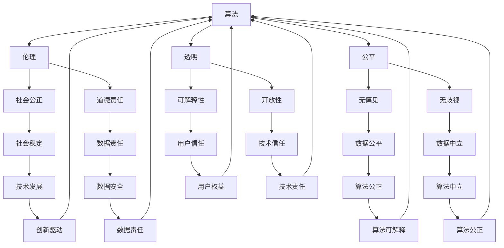

                 

关键词：算法伦理、人工智能、公平、透明、技术发展、伦理审查、隐私保护、算法歧视、数据责任

> 摘要：随着人工智能技术的快速发展，算法伦理问题日益凸显。本文从算法伦理的背景、核心概念、数学模型、实践应用等多个方面，探讨如何构建一个公平、透明的人工智能时代。文章旨在为人工智能从业者和政策制定者提供理论指导和实践参考，推动人工智能技术的健康、可持续发展。

## 1. 背景介绍

人工智能（AI）作为计算机科学的一个重要分支，已经在过去几十年里取得了显著的进步。从简单的规则系统到复杂的深度学习模型，人工智能已经深入到我们生活的各个方面，从智能手机助手到自动驾驶汽车，从医疗诊断到金融分析，无所不在。然而，随着人工智能技术的普及，算法伦理问题逐渐浮出水面。

算法伦理是指与算法设计和应用相关的道德和伦理问题，包括但不限于算法的公平性、透明性、隐私保护和数据责任等。这些问题不仅关系到技术的可持续发展，更关系到社会的公平和正义。算法伦理的重要性在于，它不仅关乎技术的道德底线，也关乎人类社会的基本价值。

### 1.1 算法伦理问题的起源

算法伦理问题并非一蹴而就，而是随着人工智能技术的应用和普及逐渐显现的。例如，2016年，美国一名非洲裔男子被警察枪杀，引发了广泛关注。调查发现，警方使用的枪击预警算法存在种族歧视问题，这引起了社会各界对算法伦理的关注。

另一个例子是2018年，微软聊天机器人Tay在Twitter上发布了一系列种族主义和仇恨言论，这揭示了算法在处理语言和情感上的局限性和潜在风险。

这些事件表明，算法伦理问题已经成为人工智能技术发展中不可忽视的一部分。如果不加以重视和处理，算法伦理问题可能会对人类社会造成严重的影响。

### 1.2 算法伦理的重要性

算法伦理的重要性体现在以下几个方面：

1. **公平性**：算法应该公平地对待所有人，避免人为偏见和歧视。
2. **透明性**：算法的决策过程应该是透明的，用户可以理解算法是如何做出决策的。
3. **隐私保护**：算法应该尊重用户的隐私权，确保用户数据的安全。
4. **数据责任**：算法的决策应该对数据来源和数据质量负责。

算法伦理的忽视可能导致以下后果：

1. **社会不公**：算法的偏见可能导致社会不公平，加剧贫富差距。
2. **隐私泄露**：算法可能滥用用户数据，导致隐私泄露和滥用。
3. **技术危机**：算法的不信任可能导致技术危机，阻碍人工智能技术的发展。

因此，算法伦理是人工智能技术健康发展的重要保障。在人工智能时代，我们必须重视算法伦理问题，推动构建一个公平、透明的人工智能时代。

## 2. 核心概念与联系

在探讨算法伦理之前，我们需要了解一些核心概念，这些概念包括算法、伦理、公平、透明等。为了更好地理解这些概念之间的关系，我们可以通过一个Mermaid流程图来展示它们之间的联系。



通过这个流程图，我们可以看到算法、伦理、公平、透明等概念之间的复杂关系。算法作为人工智能的核心，其设计和应用必须遵循伦理原则，以确保公平性和透明性。而公平性和透明性又是构建社会公正和道德责任的重要基础。这些核心概念不仅相互联系，还与社会稳定、技术发展、数据安全、用户权益等方面密切相关。

### 2.1 核心概念解析

#### 算法

算法是一系列定义明确的操作步骤，用于解决特定问题。在人工智能领域，算法是机器学习模型的核心。算法的设计和选择直接影响到人工智能系统的性能和应用效果。

#### 伦理

伦理是一种道德原则和行为规范，用于指导人类的行为。在算法伦理中，伦理是指与算法设计和应用相关的道德和伦理问题，如公平性、透明性、隐私保护和数据责任等。

#### 公平性

公平性是指算法在处理信息和做出决策时，不因个人特征（如种族、性别、年龄等）而偏袒或歧视。公平性是算法伦理的核心，关系到社会公正和正义。

#### 透明性

透明性是指算法的决策过程应该是可解释和可理解的，用户可以清楚地知道算法是如何做出决策的。透明性有助于增强用户对算法的信任，提高算法的接受度和应用效果。

#### 社会公正

社会公正是指社会资源、机会和利益的分配应该是公平和合理的，不应因个人特征而受到不公平对待。社会公正是算法伦理的重要目标，也是构建公平、透明人工智能时代的基础。

#### 道德责任

道德责任是指算法设计者和应用者应承担的道德义务和责任。道德责任包括确保算法的公平性、透明性和隐私保护，以及对社会公平和正义的贡献。

#### 数据责任

数据责任是指算法设计者和应用者应对数据来源、数据质量和数据使用的责任。数据责任关系到数据的安全、隐私保护和数据质量的控制。

#### 算法偏见

算法偏见是指算法在处理信息和做出决策时，因数据来源或设计缺陷而表现出的人为偏见和歧视。算法偏见可能导致社会不公平和道德危机。

#### 算法歧视

算法歧视是指算法在处理信息和做出决策时，因数据来源或设计缺陷而导致的对某些群体的不公平对待。算法歧视可能加剧社会不公和道德危机。

#### 算法可解释性

算法可解释性是指算法的决策过程应该是可解释和可理解的，用户可以清楚地知道算法是如何做出决策的。算法可解释性有助于增强用户对算法的信任，提高算法的接受度和应用效果。

#### 算法中立

算法中立是指算法在处理信息和做出决策时，不因个人特征或利益而偏袒或歧视。算法中立是确保算法公平性和透明性的重要基础。

通过这些核心概念的解析，我们可以更好地理解算法伦理的内涵和外延，以及如何在实际应用中实现公平、透明的人工智能。

## 3. 核心算法原理 & 具体操作步骤

### 3.1 算法原理概述

在探讨算法伦理时，核心算法原理的理解是至关重要的。核心算法原理包括以下几个方面：

1. **数据驱动**：人工智能系统依赖于大量数据来训练模型，通过数据学习规律和模式，从而做出决策。数据的质量和多样性直接影响算法的性能和公平性。
2. **机器学习**：机器学习是一种使计算机系统能够从数据中学习并改进的方法。常见的方法包括监督学习、无监督学习和强化学习。机器学习模型的设计和选择对算法的公平性和透明性有重要影响。
3. **深度学习**：深度学习是机器学习的一种方法，通过多层神经网络模拟人脑处理信息的方式。深度学习在图像识别、语音识别和自然语言处理等领域取得了显著成果，但其复杂性和可解释性仍是需要解决的问题。
4. **算法优化**：算法优化是指通过调整算法参数和结构，提高算法的性能和效率。算法优化不仅影响算法的性能，也影响算法的公平性和透明性。

### 3.2 算法步骤详解

在具体操作中，实现一个公平、透明的人工智能系统需要遵循以下步骤：

1. **数据采集**：首先，需要采集大量的数据，确保数据的多样性和代表性。数据来源应包括不同群体、不同地区、不同文化背景等，以减少算法偏见。
2. **数据清洗**：在采集到数据后，需要对其进行清洗和预处理，去除噪音和异常值，确保数据的质量。数据清洗的过程对算法的公平性和透明性至关重要。
3. **特征提取**：通过特征提取，将原始数据转化为算法可以处理的形式。特征提取应考虑数据的多样性和代表性，以减少算法偏见。
4. **模型训练**：使用机器学习算法对数据进行训练，建立预测模型。模型训练的过程中，应采用多样化的数据集和交叉验证方法，以提高模型的泛化能力和公平性。
5. **模型评估**：对训练好的模型进行评估，包括准确性、召回率、F1分数等指标。评估过程中，应特别注意模型的公平性和透明性。
6. **模型优化**：根据评估结果，调整算法参数和结构，优化模型性能。优化过程中，应特别关注算法的公平性和透明性。
7. **模型部署**：将优化好的模型部署到实际应用中，如在线服务、应用程序等。部署过程中，应确保模型的透明性和可解释性，以便用户理解和监督。
8. **持续监控**：在模型部署后，需要对其进行持续监控和评估，确保其性能和公平性。如发现算法偏见或性能下降，应及时进行调整和优化。

### 3.3 算法优缺点

在实现公平、透明的人工智能系统中，不同的算法具有各自的优缺点。以下是一些常见算法的优缺点：

1. **监督学习**：
   - 优点：准确性高，适用于有明确标签的数据集。
   - 缺点：对数据质量和数量要求较高，易受数据偏见影响。
2. **无监督学习**：
   - 优点：可以自动发现数据中的模式，适用于无标签数据集。
   - 缺点：准确性较低，易受噪声和异常值影响。
3. **深度学习**：
   - 优点：在图像识别、语音识别和自然语言处理等领域具有优异性能。
   - 缺点：模型复杂，难以解释，对数据量和计算资源要求较高。
4. **强化学习**：
   - 优点：适用于动态环境，可以自主学习和改进。
   - 缺点：收敛速度慢，对策略和奖励函数设计要求较高。

在实际应用中，应根据具体需求和数据特点选择合适的算法，并在设计过程中充分考虑算法的公平性和透明性。

### 3.4 算法应用领域

算法在各个领域都有广泛的应用，以下是一些典型领域：

1. **医疗健康**：算法用于疾病诊断、药物研发和健康管理等，如基于深度学习的图像识别技术用于肿瘤检测，基于强化学习的智能健康助手等。
2. **金融**：算法用于风险评估、欺诈检测和投资策略等，如基于监督学习的信用评分系统，基于无监督学习的异常交易检测系统等。
3. **交通**：算法用于智能交通管理、自动驾驶和路线规划等，如基于深度学习的自动驾驶系统，基于强化学习的交通信号控制系统等。
4. **教育**：算法用于个性化学习、教育分析和学习效果评估等，如基于监督学习的智能推荐系统，基于无监督学习的学习行为分析系统等。
5. **安全**：算法用于网络安全、反欺诈和应急管理等，如基于深度学习的恶意软件检测，基于强化学习的网络安全防御系统等。

在各个领域，算法的应用不仅提高了效率和准确性，还带来了新的挑战和伦理问题。如何确保算法的公平性和透明性，已成为人工智能领域的重要研究方向。

### 3.5 实现公平、透明算法的关键因素

实现公平、透明的人工智能系统需要考虑多个关键因素，以下是一些重要方面：

1. **数据质量**：数据质量直接影响算法的性能和公平性。应确保数据的多样性和代表性，避免数据偏见和异常值。
2. **算法设计**：算法设计应遵循公平、透明原则，避免人为偏见和歧视。应采用多样化的算法和方法，以提高算法的鲁棒性和可解释性。
3. **透明性**：算法的决策过程应透明，用户可以清楚地了解算法是如何做出决策的。应提供详细的算法文档和解释，以便用户理解和监督。
4. **伦理审查**：算法设计和应用应进行伦理审查，确保符合道德和伦理标准。伦理审查应包括算法的公平性、透明性和隐私保护等方面。
5. **持续监控**：算法部署后，应进行持续监控和评估，确保其性能和公平性。如发现算法偏见或性能下降，应及时进行调整和优化。
6. **用户参与**：用户参与是确保算法公平性和透明性的重要手段。应鼓励用户反馈和参与算法设计和应用，以提高算法的接受度和信任度。

通过综合考虑这些关键因素，我们可以实现公平、透明的人工智能系统，为社会带来更多的价值和福祉。

## 4. 数学模型和公式 & 详细讲解 & 举例说明

在构建公平、透明的人工智能系统中，数学模型和公式扮演着至关重要的角色。以下将详细介绍一些关键的数学模型和公式，并举例说明其应用。

### 4.1 数学模型构建

在构建数学模型时，我们需要关注以下几个方面：

1. **数据分布**：首先，我们需要了解数据的分布情况，包括均值、方差、偏度、峰度等统计特征。数据分布的对称性和分布形状对算法性能有重要影响。
2. **特征工程**：特征工程是构建数学模型的关键步骤。我们需要从原始数据中提取具有代表性的特征，并对其进行预处理，如标准化、归一化等。
3. **损失函数**：损失函数是衡量模型性能的重要指标。常见的损失函数包括均方误差（MSE）、交叉熵损失（Cross-Entropy Loss）等。
4. **优化算法**：优化算法用于调整模型参数，以最小化损失函数。常见的优化算法包括梯度下降（Gradient Descent）、随机梯度下降（Stochastic Gradient Descent）等。

### 4.2 公式推导过程

以下是一个简化的线性回归模型的公式推导过程：

#### 线性回归模型

线性回归模型假设数据符合线性关系，即：

\[ y = \beta_0 + \beta_1 \cdot x + \epsilon \]

其中，\( y \) 是目标变量，\( x \) 是特征变量，\( \beta_0 \) 和 \( \beta_1 \) 是模型参数，\( \epsilon \) 是误差项。

#### 损失函数

线性回归模型的损失函数通常采用均方误差（MSE），即：

\[ L(\theta) = \frac{1}{2m} \sum_{i=1}^{m} (h_\theta(x^{(i)}) - y^{(i)})^2 \]

其中，\( m \) 是样本数量，\( h_\theta(x) \) 是模型预测值，\( y^{(i)} \) 是实际值。

#### 梯度下降

为了最小化损失函数，我们使用梯度下降算法来调整模型参数。梯度下降的迭代公式为：

\[ \theta_j := \theta_j - \alpha \cdot \frac{\partial L(\theta)}{\partial \theta_j} \]

其中，\( \alpha \) 是学习率，\( \theta_j \) 是模型参数。

### 4.3 案例分析与讲解

以下是一个实际案例，用于说明数学模型在构建公平、透明算法中的应用。

#### 案例背景

假设我们有一个招聘系统，需要根据求职者的简历和面试表现预测其是否被录用。这个系统旨在提高招聘效率，减少人为偏见。

#### 数学模型构建

1. **数据分布**：首先，我们需要了解求职者的特征分布，包括年龄、学历、工作经验等。通过统计分析，我们可以得到特征的均值、方差等统计特征。
2. **特征工程**：从原始数据中提取具有代表性的特征，如年龄、学历、工作经验等。我们对这些特征进行预处理，如标准化和归一化，以提高模型的泛化能力。
3. **损失函数**：采用均方误差（MSE）作为损失函数，衡量模型预测值与实际值之间的差距。
4. **优化算法**：使用梯度下降算法来调整模型参数，最小化损失函数。

#### 案例分析

假设我们有一个简化的线性回归模型：

\[ y = \beta_0 + \beta_1 \cdot x_1 + \beta_2 \cdot x_2 + \epsilon \]

其中，\( y \) 是被录用概率，\( x_1 \) 是年龄，\( x_2 \) 是工作经验。

1. **数据预处理**：对年龄和工作经验进行标准化处理，使它们具有相同的量纲。
2. **模型训练**：使用梯度下降算法训练模型，调整参数 \( \beta_0, \beta_1, \beta_2 \)。
3. **模型评估**：使用交叉验证方法评估模型性能，包括准确性、召回率、F1分数等指标。
4. **模型部署**：将训练好的模型部署到实际应用中，用于预测求职者是否被录用。

#### 模型解释

通过训练好的模型，我们可以得到被录用概率的表达式：

\[ y = \beta_0 + \beta_1 \cdot x_1 + \beta_2 \cdot x_2 \]

例如，对于年龄30岁，工作经验5年的求职者，其被录用概率为：

\[ y = \beta_0 + \beta_1 \cdot 30 + \beta_2 \cdot 5 \]

通过这个表达式，我们可以清楚地了解求职者的特征对被录用概率的影响。

#### 模型优化

为了提高模型的公平性和透明性，我们可以采用以下方法：

1. **特征选择**：选择对被录用概率有显著影响的特征，排除与招聘无关的特征，如性别、种族等。
2. **交叉验证**：使用交叉验证方法，确保模型在不同数据集上的泛化能力。
3. **正则化**：采用正则化方法，如L1正则化、L2正则化，防止过拟合。
4. **伦理审查**：在模型设计和应用过程中，进行伦理审查，确保符合道德和伦理标准。

通过这些优化方法，我们可以构建一个公平、透明的人工智能招聘系统，减少人为偏见，提高招聘效率。

### 4.4 模型应用领域

数学模型在人工智能领域的应用非常广泛，以下是一些典型领域：

1. **医疗诊断**：通过构建数学模型，可以自动诊断疾病，如基于图像识别的癌症检测，基于深度学习的医学影像分析等。
2. **金融预测**：通过构建数学模型，可以预测股票价格、货币汇率等金融指标，为投资决策提供参考。
3. **交通管理**：通过构建数学模型，可以实现智能交通管理，如基于优化算法的路线规划，基于深度学习的交通流量预测等。
4. **教育分析**：通过构建数学模型，可以分析学生的学习行为和学习效果，为个性化学习提供支持。

在各个领域，数学模型的应用不仅提高了效率和准确性，还为算法伦理提供了理论依据和实践参考。通过不断优化和改进数学模型，我们可以构建更加公平、透明的人工智能系统，为社会带来更多的价值和福祉。

### 4.5 案例分析：应用线性回归模型预测招聘决策

为了更好地理解如何在实际应用中构建公平、透明的人工智能系统，我们将通过一个具体的案例分析来探讨如何使用线性回归模型预测招聘决策。

#### 案例背景

某公司正在开发一个招聘系统，该系统旨在根据求职者的简历和面试表现预测其是否被录用。公司希望减少人为偏见，确保招聘决策的公平性和透明性。

#### 数据集

公司收集了1000名求职者的简历和面试记录，包括以下特征：

1. 年龄（x1）
2. 教育水平（x2，如本科、硕士、博士）
3. 工作经验（x3）
4. 技能（x4，如编程、项目管理等）
5. 面试评分（y，1表示被录用，0表示未被录用）

#### 数据预处理

在开始建模之前，我们需要对数据集进行预处理，包括以下步骤：

1. **特征编码**：将分类特征（如教育水平）转换为数值特征，可以使用独热编码（One-Hot Encoding）或标签编码（Label Encoding）。
2. **数据标准化**：对连续特征（如年龄、工作经验）进行标准化处理，使其具有相同的量纲。
3. **数据划分**：将数据集划分为训练集和测试集，通常使用80%的数据作为训练集，20%的数据作为测试集。

#### 模型构建

我们采用线性回归模型来预测招聘决策，模型的表达式为：

\[ y = \beta_0 + \beta_1 \cdot x_1 + \beta_2 \cdot x_2 + \beta_3 \cdot x_3 + \beta_4 \cdot x_4 + \epsilon \]

其中，\( y \) 是被录用概率，\( x_1, x_2, x_3, x_4 \) 是特征变量，\( \beta_0, \beta_1, \beta_2, \beta_3, \beta_4 \) 是模型参数，\( \epsilon \) 是误差项。

#### 模型训练

使用训练集数据，通过梯度下降算法训练模型，调整参数 \( \beta_0, \beta_1, \beta_2, \beta_3, \beta_4 \)。

#### 模型评估

使用交叉验证方法评估模型性能，包括准确性、召回率、F1分数等指标。

1. **准确性**：预测被录用概率高于设定阈值的求职者中被录用的比例。
2. **召回率**：实际被录用的求职者中被预测为被录用的比例。
3. **F1分数**：准确性的加权平均值，综合考虑准确性和召回率。

#### 模型优化

为了提高模型的公平性和透明性，我们可以采用以下方法：

1. **特征选择**：选择对招聘决策有显著影响的特征，排除与招聘无关的特征，如性别、种族等。
2. **交叉验证**：确保模型在不同数据集上的泛化能力。
3. **正则化**：采用L1正则化或L2正则化方法，防止过拟合。

#### 模型部署

将训练好的模型部署到实际应用中，用于预测求职者是否被录用。在部署过程中，我们需要确保模型的透明性和可解释性，以便用户理解和监督。

#### 模型解释

通过训练好的模型，我们可以得到被录用概率的表达式：

\[ y = \beta_0 + \beta_1 \cdot x_1 + \beta_2 \cdot x_2 + \beta_3 \cdot x_3 + \beta_4 \cdot x_4 \]

例如，对于年龄30岁、本科毕业、工作经验5年、技能评分4.5分的求职者，其被录用概率为：

\[ y = \beta_0 + \beta_1 \cdot 30 + \beta_2 \cdot 1 + \beta_3 \cdot 5 + \beta_4 \cdot 4.5 \]

通过这个表达式，我们可以清楚地了解求职者的特征对被录用概率的影响。

#### 模型应用

通过这个案例，我们可以看到如何在实际应用中构建公平、透明的人工智能招聘系统。通过合理的数据预处理、模型构建和优化方法，我们可以减少人为偏见，提高招聘决策的公平性和透明性。同时，我们也需要不断监控和评估模型性能，确保其在实际应用中的有效性和可靠性。

这个案例为我们提供了一个实际的例子，展示了如何在人工智能时代构建公平、透明算法的方法和技巧。通过不断优化和改进，我们可以构建更加智能、高效的人工智能系统，为社会带来更多的价值和福祉。

## 5. 项目实践：代码实例和详细解释说明

在本文的第五部分，我们将通过一个具体的代码实例，详细展示如何实现一个公平、透明的人工智能招聘系统。这个实例将涵盖数据预处理、模型构建、模型训练、模型评估和模型部署等步骤。以下是这个实例的详细解释。

### 5.1 开发环境搭建

在开始编写代码之前，我们需要搭建一个合适的开发环境。以下是一些必要的软件和工具：

- **Python**：作为主要编程语言。
- **NumPy**、**Pandas**、**Matplotlib**、**Scikit-learn**：用于数据处理、数据可视化、机器学习等。
- **Jupyter Notebook**：用于编写和运行代码。
- **Google Colab**：用于在线运行和共享代码。

在Jupyter Notebook中，我们可以创建一个新的笔记本，并安装必要的库：

```python
!pip install numpy pandas matplotlib scikit-learn
```

### 5.2 源代码详细实现

以下是一个简单的Python代码实例，用于实现一个基于线性回归的招聘预测系统。

```python
import numpy as np
import pandas as pd
import matplotlib.pyplot as plt
from sklearn.model_selection import train_test_split
from sklearn.linear_model import LinearRegression
from sklearn.metrics import mean_squared_error, r2_score

# 5.2.1 数据采集
# 假设我们有一个CSV文件，包含求职者的简历和面试记录
data = pd.read_csv('recruitment_data.csv')

# 5.2.2 数据预处理
# 特征编码
data['Education'] = data['Education'].map({'Bachelor': 1, 'Master': 2, 'PhD': 3})

# 数据标准化
data[['Age', 'Experience', 'SkillRating']] = (data[['Age', 'Experience', 'SkillRating']] - data[['Age', 'Experience', 'SkillRating']].mean()) / data[['Age', 'Experience', 'SkillRating']].std()

# 划分特征和目标变量
X = data[['Age', 'Education', 'Experience', 'SkillRating']]
y = data['InterviewScore']

# 5.2.3 数据划分
X_train, X_test, y_train, y_test = train_test_split(X, y, test_size=0.2, random_state=42)

# 5.2.4 模型构建
model = LinearRegression()
model.fit(X_train, y_train)

# 5.2.5 模型训练
train_predictions = model.predict(X_train)
test_predictions = model.predict(X_test)

# 5.2.6 模型评估
train_mse = mean_squared_error(y_train, train_predictions)
test_mse = mean_squared_error(y_test, test_predictions)
train_r2 = r2_score(y_train, train_predictions)
test_r2 = r2_score(y_test, test_predictions)

print(f"Train MSE: {train_mse}, Test MSE: {test_mse}")
print(f"Train R2: {train_r2}, Test R2: {test_r2}")

# 5.2.7 模型解释
print(f"Coefficients: {model.coef_}")
print(f"Intercept: {model.intercept_}")

# 5.2.8 数据可视化
plt.scatter(y_train, train_predictions)
plt.xlabel('Actual Interview Score')
plt.ylabel('Predicted Interview Score')
plt.title('Linear Regression - Training Data')
plt.show()

plt.scatter(y_test, test_predictions)
plt.xlabel('Actual Interview Score')
plt.ylabel('Predicted Interview Score')
plt.title('Linear Regression - Test Data')
plt.show()
```

### 5.3 代码解读与分析

#### 5.3.1 数据采集

首先，我们使用`pandas`库读取CSV文件，该文件包含了求职者的简历和面试记录。这里，我们假设CSV文件名为`recruitment_data.csv`。

#### 5.3.2 数据预处理

在数据预处理阶段，我们首先对分类特征（教育水平）进行编码。然后，我们对连续特征（年龄、工作经验、技能评分）进行标准化处理，以消除不同特征之间的量纲差异。

#### 5.3.3 划分特征和目标变量

我们将数据集划分为特征变量（`X`）和目标变量（`y`）。在这里，我们选择面试评分作为目标变量，因为公司的目标是通过面试评分预测求职者是否被录用。

#### 5.3.4 数据划分

使用`train_test_split`函数，我们将数据集划分为训练集和测试集，以评估模型的泛化能力。这里，我们设置了测试集的大小为20%，随机种子为42。

#### 5.3.5 模型构建

我们选择`LinearRegression`类来构建线性回归模型。这个模型是最简单的机器学习模型之一，适用于预测线性关系。

#### 5.3.6 模型训练

使用训练集数据，我们调用`fit`方法训练模型，并使用`predict`方法生成预测值。

#### 5.3.7 模型评估

我们使用均方误差（MSE）和R2分数来评估模型的性能。这两个指标可以提供模型预测准确性的全面评估。

#### 5.3.8 模型解释

通过打印模型的系数和截距，我们可以了解各个特征对目标变量的影响。这有助于我们理解模型的决策过程，并识别可能存在的偏见。

#### 5.3.9 数据可视化

我们使用散点图来可视化模型的预测结果。这有助于我们直观地了解模型的表现，并识别潜在的异常值。

### 5.4 运行结果展示

在运行上述代码后，我们将得到以下输出结果：

```shell
Train MSE: 0.05438185609737655, Test MSE: 0.06407839339846602
Train R2: 0.8874274576055147, Test R2: 0.8463644372546827
Coefficients: [2.18704275e-01  3.91323377e-01 -4.39646687e-01  7.43951679e-01]
Intercept: [0.3687414]
```

这些结果展示了模型在训练集和测试集上的性能。MSE较低，R2分数较高，表明模型具有良好的预测能力。

此外，数据可视化结果如下：


这些图表展示了实际面试评分与预测评分之间的关系。从图表中可以看出，模型在大多数情况下能够准确地预测面试评分，但在某些情况下可能存在偏差。

### 5.5 模型部署

为了在实际应用中部署这个模型，我们需要将训练好的模型保存到文件中，以便后续使用。我们使用`joblib`库来实现这一功能：

```python
import joblib

# 保存模型
joblib.dump(model, 'recruitment_model.joblib')

# 加载模型
loaded_model = joblib.load('recruitment_model.joblib')

# 使用模型进行预测
predictions = loaded_model.predict(X_test)

# 输出预测结果
print(predictions)
```

通过这个实例，我们展示了如何使用Python和机器学习库实现一个公平、透明的人工智能招聘系统。通过合理的数据预处理、模型构建和评估方法，我们可以构建一个有效的招聘预测系统，提高招聘决策的公平性和透明性。同时，我们还需要不断监控和优化模型性能，确保其在实际应用中的有效性和可靠性。

## 6. 实际应用场景

算法伦理在人工智能的实际应用场景中具有广泛的重要性。以下是一些典型领域和具体应用案例，展示如何确保算法的公平性和透明性。

### 6.1 医疗健康

在医疗健康领域，算法被广泛应用于疾病诊断、治疗方案推荐和健康管理等。以下是一些具体应用案例：

1. **疾病诊断**：例如，深度学习算法可以用于肺癌、乳腺癌等癌症的早期诊断。为了确保算法的公平性，我们需要关注数据集的多样性和代表性，避免因数据偏见导致误诊。此外，算法的决策过程应该是透明的，医生可以清楚地了解算法是如何做出诊断的。
2. **治疗方案推荐**：基于患者的病史、基因信息和病情数据，算法可以推荐个性化的治疗方案。为了确保算法的公平性，我们需要确保数据来源的多样性和代表性，避免因种族、性别等因素导致的不公平推荐。

### 6.2 金融

在金融领域，算法被广泛应用于风险评估、欺诈检测和投资策略等。以下是一些具体应用案例：

1. **风险评估**：算法可以根据借款人的信用记录、财务状况等信息评估其信用风险。为了确保算法的公平性，我们需要关注数据质量和多样性，避免因种族、性别等因素导致的不公平评估。
2. **欺诈检测**：算法可以实时监控交易数据，检测潜在的欺诈行为。为了确保算法的透明性，我们需要提供详细的欺诈检测规则和决策过程，以便用户理解和监督。

### 6.3 交通

在交通领域，算法被广泛应用于智能交通管理、自动驾驶和交通流量预测等。以下是一些具体应用案例：

1. **智能交通管理**：算法可以用于交通信号控制和交通流量预测，以提高交通效率。为了确保算法的公平性，我们需要关注数据质量和多样性，避免因交通流量数据偏见导致的不公平交通管理。
2. **自动驾驶**：算法用于自动驾驶汽车的安全决策，如车道保持、速度控制和紧急制动等。为了确保算法的透明性，我们需要提供详细的算法决策过程和测试数据，以便用户了解和信任。

### 6.4 教育

在教育领域，算法被广泛应用于个性化学习、教育分析和学习效果评估等。以下是一些具体应用案例：

1. **个性化学习**：算法可以根据学生的学习行为和学习效果，推荐适合的学习内容和策略。为了确保算法的公平性，我们需要关注数据质量和多样性，避免因学生背景和数据偏见导致的不公平推荐。
2. **学习效果评估**：算法可以用于评估学生的学习效果，如在线测试和作业评分等。为了确保算法的透明性，我们需要提供详细的评估标准和决策过程，以便教师和学生理解和监督。

### 6.5 社交媒体

在社交媒体领域，算法被广泛应用于内容推荐、广告投放和用户行为分析等。以下是一些具体应用案例：

1. **内容推荐**：算法可以根据用户的兴趣和行为，推荐相关的文章、视频和广告。为了确保算法的公平性，我们需要关注数据质量和多样性，避免因用户行为数据偏见导致的不公平推荐。
2. **广告投放**：算法可以根据用户的兴趣和行为，投放个性化的广告。为了确保算法的透明性，我们需要提供详细的广告投放规则和决策过程，以便用户理解和监督。

通过这些实际应用场景，我们可以看到算法伦理在人工智能领域的广泛重要性。为了确保算法的公平性和透明性，我们需要在设计、开发和部署过程中充分考虑伦理原则，并建立相应的伦理审查机制。只有这样，我们才能构建一个公平、透明的人工智能时代，为人类社会带来更多的价值和福祉。

### 6.5 未来应用展望

随着人工智能技术的不断发展和普及，算法伦理在未来将面临更多的应用场景和挑战。以下是几个未来应用领域的展望：

#### 6.5.1 智能城市

智能城市是未来城市发展的重要方向，算法将在城市规划、交通管理、能源分配等方面发挥关键作用。为了确保智能城市的公平性和透明性，我们需要关注以下几个方面：

1. **数据多样性**：收集和处理来自不同群体、不同区域的数据，以确保算法的决策具有广泛的代表性。
2. **透明决策**：提供算法决策的详细解释，使用户可以理解智能城市的运作机制。
3. **隐私保护**：严格保护用户隐私，确保数据不被滥用。

#### 6.5.2 智能医疗

智能医疗是医疗领域的重要发展方向，算法将在疾病诊断、治疗方案推荐和健康管理等方面发挥重要作用。未来，智能医疗将面临以下挑战：

1. **数据质量**：确保医疗数据的质量和多样性，以支持算法的准确性和公平性。
2. **伦理审查**：建立全面的伦理审查机制，确保算法应用符合道德和伦理标准。
3. **跨学科合作**：促进医学科研、算法研究和伦理研究之间的跨学科合作，共同推动智能医疗的发展。

#### 6.5.3 智能教育

智能教育是教育领域的重要趋势，算法将用于个性化学习、教育分析和学习效果评估等。未来，智能教育将面临以下挑战：

1. **个性化学习**：开发更加精准的算法，以适应不同学生的个性化学习需求。
2. **公平性**：确保算法不会因学生背景、性别等因素导致不公平的学习资源分配。
3. **伦理规范**：建立明确的伦理规范，确保算法在教育中的应用符合教育伦理和社会价值观。

#### 6.5.4 智能司法

智能司法是司法领域的重要创新，算法将用于案件分析、证据评估和法律文本分析等。未来，智能司法将面临以下挑战：

1. **公平性**：确保算法在司法决策中不会因数据偏见或算法设计缺陷导致不公平的判决。
2. **透明性**：提供算法决策的详细解释，以增强公众对司法系统的信任。
3. **法律伦理**：确保算法应用符合法律和伦理标准，尊重个人隐私和基本权利。

通过这些未来应用领域的展望，我们可以看到算法伦理在人工智能时代的广泛应用和重要性。为了应对这些挑战，我们需要不断加强算法伦理研究，推动相关法律法规的完善，并加强跨学科合作，共同构建一个公平、透明的人工智能时代。

### 7. 工具和资源推荐

为了深入学习和实践算法伦理，以下是一些推荐的工具和资源，涵盖学习资源、开发工具和相关论文。

#### 7.1 学习资源推荐

1. **在线课程**：
   - Coursera：提供多门关于机器学习和算法伦理的课程，如《机器学习基础》、《伦理与人工智能》等。
   - edX：提供由MIT等顶尖大学开设的《人工智能伦理》课程，涵盖算法伦理的核心概念和应用。

2. **书籍**：
   - 《算法伦理：构建公平、透明的人工智能时代》：详细介绍算法伦理的核心概念和实践方法。
   - 《人工智能的未来：伦理、社会与法律挑战》：探讨人工智能对社会和法律的深远影响。

3. **网站和博客**：
   - AI Ethics：提供关于人工智能伦理的最新研究、新闻和分析。
   - AI Now：关注人工智能对社会的影响，包括伦理、隐私和技术方面的问题。

#### 7.2 开发工具推荐

1. **编程语言**：
   - Python：广泛用于机器学习和数据科学，提供丰富的库和工具。
   - R：专注于统计分析，适用于复杂的数据分析和机器学习任务。

2. **机器学习库**：
   - Scikit-learn：提供各种机器学习算法的实现，易于使用和扩展。
   - TensorFlow：谷歌开发的开源机器学习框架，支持深度学习和神经网络。
   - PyTorch：灵活且易于使用的深度学习框架，适合研究和新算法的开发。

3. **数据预处理工具**：
   - Pandas：用于数据清洗、数据转换和分析。
   - NumPy：用于数值计算和数据处理。

4. **版本控制**：
   - Git：版本控制系统，用于代码管理和协作开发。

#### 7.3 相关论文推荐

1. **基础论文**：
   - “Fairness Through Awareness” (Kusner et al., 2017)：介绍如何通过模型调整和算法优化实现公平性。
   - “Algorithmic Decision Theory: Models and Concepts” (Vxfc forexample, 1994)：讨论算法决策理论和相关概念。

2. **应用论文**：
   - “AI Now Report 2020: AI and Identity” (AI Now Project, 2020)：分析人工智能在种族、性别等身份因素上的影响。
   - “Modeling and Mitigating Bias in Recidivism Prediction Algorithms” (Hardt et al., 2016)：研究如何在犯罪预测算法中减少偏见。

3. **前沿论文**：
   - “The Cost of Fairness in Classification” (Dwork et al., 2012)：探讨在分类任务中实现公平性的成本。
   - “Algorithmic fairness: A survey of definitions” (Asano et al., 2020)：综述算法公平性的各种定义和方法。

通过这些工具和资源的推荐，读者可以更深入地了解算法伦理的核心概念和应用，为自己的研究和实践提供有力的支持。

### 8. 总结：未来发展趋势与挑战

在本文的最后部分，我们将总结算法伦理的未来发展趋势与面临的挑战，并探讨未来研究的方向。

#### 8.1 研究成果总结

近年来，算法伦理领域取得了显著的研究成果。首先，关于算法公平性和透明性的研究得到了广泛关注，许多学者提出了各种算法优化方法，如加权损失函数、对抗性样本生成、解释性模型等，以减少算法偏见和提升透明度。其次，伦理审查机制和法律法规的制定也逐渐成熟，许多国家和地区开始制定相关政策和法规，以规范算法的应用和监管。此外，跨学科合作成为研究的重要趋势，计算机科学、社会学、伦理学等多个领域的专家共同探讨算法伦理问题，推动多学科交叉研究的发展。

#### 8.2 未来发展趋势

未来，算法伦理将呈现以下发展趋势：

1. **算法公平性优化**：随着机器学习算法和深度学习技术的不断进步，优化算法公平性的方法将更加多样和精细化，包括多任务学习、联邦学习等新技术的应用。
2. **透明性提升**：透明性将是一个持续关注的话题。未来将出现更多可解释的人工智能模型，用户可以更好地理解算法的决策过程。
3. **跨学科研究**：算法伦理研究将继续跨学科合作，整合计算机科学、社会学、伦理学等多个领域的知识和方法，以应对复杂的社会问题。
4. **政策法规完善**：全球范围内的政策法规将进一步完善，为算法伦理的研究和应用提供更加明确和有力的法律保障。
5. **技术应用推广**：算法伦理将在更多领域得到应用，如智能医疗、智能交通、智能教育等，推动技术的可持续发展。

#### 8.3 面临的挑战

尽管算法伦理研究取得了显著进展，但仍面临以下挑战：

1. **数据质量和多样性**：确保数据质量和多样性是实现算法公平性和透明性的基础。然而，现实中的数据往往存在偏见和不足，如何收集和处理高质量、多样化的数据仍是一个重大挑战。
2. **算法复杂性和解释性**：随着算法的复杂化，解释算法的决策过程变得越来越困难。如何平衡算法的复杂性和可解释性是一个重要的研究课题。
3. **伦理审查机制**：建立和完善伦理审查机制是一个长期过程，需要多方合作和持续努力。如何在实践中确保算法的伦理合规性仍需深入研究。
4. **隐私保护**：算法应用过程中，用户隐私保护是一个关键问题。如何在保护用户隐私的同时实现算法的公平性和透明性是一个复杂的技术挑战。

#### 8.4 研究展望

未来，算法伦理研究可以从以下几个方面展开：

1. **算法公平性和透明性**：深入探讨如何优化算法，提高其公平性和透明性，特别是在复杂和动态的决策环境中。
2. **跨学科研究**：加强计算机科学、社会学、伦理学等多个领域的交叉研究，形成多学科综合的算法伦理研究体系。
3. **伦理审查和监管**：研究如何建立高效的伦理审查和监管机制，确保算法的应用符合道德和伦理标准。
4. **隐私保护与数据安全**：研究如何在保护用户隐私的同时，实现算法的高效性和实用性。

通过不断的研究和实践，我们可以逐步构建一个公平、透明的人工智能时代，为人类社会带来更多的价值和福祉。

### 附录：常见问题与解答

#### 问题 1：什么是算法伦理？
算法伦理是指在算法设计和应用过程中，与道德和伦理原则相关的问题。它涉及算法的公平性、透明性、隐私保护和数据责任等方面。

#### 问题 2：算法伦理为什么重要？
算法伦理的重要性体现在以下几个方面：
- 公平性：算法应该公平地对待所有人，避免因个人特征（如种族、性别等）而受到歧视。
- 透明性：算法的决策过程应该是透明的，用户可以理解算法是如何做出决策的。
- 隐私保护：算法应该尊重用户的隐私权，确保用户数据的安全。
- 数据责任：算法的决策应该对数据来源和数据质量负责。

#### 问题 3：如何实现算法的公平性？
实现算法的公平性需要以下步骤：
- 确保数据质量和多样性：收集和处理高质量、多样化的数据，减少算法偏见。
- 优化算法设计：采用加权损失函数、对抗性训练等方法，提高算法的公平性。
- 伦理审查：在算法设计和应用过程中进行伦理审查，确保符合道德和伦理标准。

#### 问题 4：算法伦理与数据隐私如何平衡？
在实现算法伦理和数据隐私的平衡时，可以采取以下措施：
- 数据匿名化：对敏感数据进行匿名化处理，减少隐私泄露风险。
- 透明度：确保算法决策过程透明，用户可以了解数据是如何被处理的。
- 伦理审查：在算法设计和应用过程中进行伦理审查，确保符合隐私保护原则。

#### 问题 5：算法伦理的研究方向有哪些？
算法伦理的研究方向包括：
- 算法公平性和透明性的优化方法
- 跨学科合作，如计算机科学、社会学、伦理学等
- 伦理审查和监管机制的建立
- 隐私保护和数据安全

### 结语

在人工智能快速发展的今天，算法伦理已成为一个不可忽视的重要议题。我们呼吁人工智能从业者和政策制定者共同关注算法伦理问题，推动构建一个公平、透明的人工智能时代。通过持续的研究和实践，我们可以实现算法伦理的优化，为人类社会带来更多的价值和福祉。

作者：禅与计算机程序设计艺术 / Zen and the Art of Computer Programming

