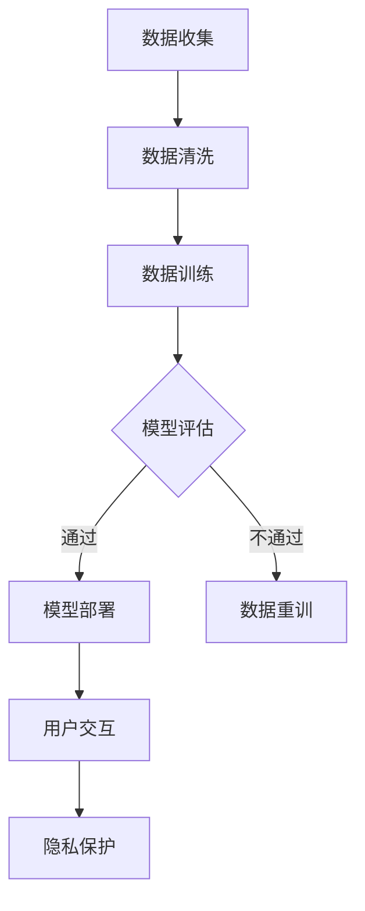

                 

 在过去几十年中，人工智能（AI）技术取得了飞速的发展。从早期的规则系统到如今深度学习的广泛应用，AI 已经成为了推动社会进步的重要力量。然而，随着 AI 应用的不断扩展，伦理问题也逐渐凸显。本文将探讨算法伦理的核心概念、构建公平、透明 AI 系统的方法，以及如何应对相关挑战。

## 1. 背景介绍

随着 AI 技术的发展，人们对于 AI 的期望也在不断增长。AI 被广泛应用于医疗、金融、法律、交通等领域，不仅提高了工作效率，还带来了巨大的经济效益。然而，AI 技术在带来便利的同时，也引发了一系列伦理问题。

- **公平性**：AI 系统是否能够公平地对待所有人？
- **透明性**：AI 系统的决策过程是否可以被理解？
- **隐私**：AI 系统是否能够保护用户的隐私？

这些问题引起了广泛关注，人们开始思考如何构建一个既高效又符合伦理的 AI 系统。

## 2. 核心概念与联系

### 2.1 公平性

公平性是算法伦理的核心概念之一。一个公平的 AI 系统应当能够公平地对待所有用户，不受种族、性别、年龄等因素的影响。为了实现这一目标，我们可以采用以下几种方法：

- **数据清洗**：在训练数据集中移除偏见和错误的数据。
- **加权处理**：为不同特征赋予不同的权重，以减少偏见的影响。
- **交叉验证**：使用多个数据集进行训练，以减少数据偏差。

### 2.2 透明性

透明性是指 AI 系统的决策过程可以被理解。为了提高透明性，我们可以采用以下方法：

- **可视化**：将 AI 系统的决策过程以图形化的方式展示出来。
- **解释性模型**：使用具有解释性的模型，例如决策树和线性回归。
- **可解释的 AI**：研究如何让 AI 系统的决策过程更加可解释。

### 2.3 隐私

隐私是另一个重要的伦理问题。为了保护用户的隐私，我们可以采用以下方法：

- **匿名化**：在数据处理过程中对用户信息进行匿名化处理。
- **数据加密**：对用户数据进行加密，以防止数据泄露。
- **隐私预算**：为数据处理设置隐私预算，以限制数据处理范围。

## 2.3 Mermaid 流程图



## 3. 核心算法原理 & 具体操作步骤

### 3.1 算法原理概述

为了构建一个公平、透明且隐私保护的 AI 系统，我们可以采用以下核心算法：

- **公平性算法**：用于评估 AI 系统的公平性。
- **透明性算法**：用于提高 AI 系统的透明性。
- **隐私保护算法**：用于保护用户隐私。

### 3.2 算法步骤详解

1. **数据收集**：收集与问题相关的数据。
2. **数据清洗**：移除偏见和错误的数据。
3. **数据训练**：使用公平性算法、透明性算法和隐私保护算法对数据进行训练。
4. **模型评估**：评估模型的公平性、透明性和隐私保护能力。
5. **模型部署**：将训练好的模型部署到生产环境中。
6. **用户交互**：与用户进行交互，收集反馈。
7. **隐私保护**：对用户数据进行匿名化和加密处理。

### 3.3 算法优缺点

**公平性算法**：
- 优点：能够提高 AI 系统的公平性。
- 缺点：可能影响模型的准确性。

**透明性算法**：
- 优点：提高 AI 系统的透明性，方便用户理解。
- 缺点：可能增加计算成本。

**隐私保护算法**：
- 优点：保护用户隐私。
- 缺点：可能影响 AI 系统的性能。

### 3.4 算法应用领域

公平性算法、透明性算法和隐私保护算法可以广泛应用于医疗、金融、法律、交通等领域，以构建一个既高效又符合伦理的 AI 系统。

## 4. 数学模型和公式 & 详细讲解 & 举例说明

### 4.1 数学模型构建

为了构建一个公平、透明且隐私保护的 AI 系统，我们需要引入以下数学模型：

- **公平性模型**：用于评估 AI 系统的公平性。
- **透明性模型**：用于提高 AI 系统的透明性。
- **隐私保护模型**：用于保护用户隐私。

### 4.2 公式推导过程

#### 公平性模型

假设我们有一个分类任务，其中标签为 \( y \)，特征为 \( x \)。我们可以使用以下公式来评估 AI 系统的公平性：

$$
\text{Fairness} = \frac{\sum_{i=1}^{n} \text{Advantage}(x_i, y_i)}{n}
$$

其中， \( \text{Advantage}(x_i, y_i) \) 表示对于特征 \( x_i \) 和标签 \( y_i \) 的优势。

#### 透明性模型

我们可以使用以下公式来评估 AI 系统的透明性：

$$
\text{Transparency} = \frac{\sum_{i=1}^{n} \text{Explained Variance}(x_i, y_i)}{n}
$$

其中， \( \text{Explained Variance}(x_i, y_i) \) 表示对于特征 \( x_i \) 和标签 \( y_i \) 的解释方差。

#### 隐私保护模型

我们可以使用以下公式来评估 AI 系统的隐私保护能力：

$$
\text{Privacy} = \frac{\sum_{i=1}^{n} \text{Privacy Budget}(x_i, y_i)}{n}
$$

其中， \( \text{Privacy Budget}(x_i, y_i) \) 表示对于特征 \( x_i \) 和标签 \( y_i \) 的隐私预算。

### 4.3 案例分析与讲解

假设我们有一个贷款审批系统，其中特征包括年龄、收入、信用评分等，标签为是否批准贷款。我们可以使用公平性模型、透明性模型和隐私保护模型来评估该系统的公平性、透明性和隐私保护能力。

#### 公平性模型

我们可以使用以下公式来计算公平性：

$$
\text{Fairness} = \frac{\sum_{i=1}^{n} \text{Advantage}(x_i, y_i)}{n}
$$

其中， \( \text{Advantage}(x_i, y_i) \) 表示对于特征 \( x_i \) 和标签 \( y_i \) 的优势。例如，如果年龄较大的用户更容易获得贷款，那么年龄就是一个具有优势的特征。

#### 透明性模型

我们可以使用以下公式来计算透明性：

$$
\text{Transparency} = \frac{\sum_{i=1}^{n} \text{Explained Variance}(x_i, y_i)}{n}
$$

其中， \( \text{Explained Variance}(x_i, y_i) \) 表示对于特征 \( x_i \) 和标签 \( y_i \) 的解释方差。例如，如果信用评分对贷款批准有很强的解释力，那么系统的透明性就较高。

#### 隐私保护模型

我们可以使用以下公式来计算隐私保护：

$$
\text{Privacy} = \frac{\sum_{i=1}^{n} \text{Privacy Budget}(x_i, y_i)}{n}
$$

其中， \( \text{Privacy Budget}(x_i, y_i) \) 表示对于特征 \( x_i \) 和标签 \( y_i \) 的隐私预算。例如，如果用户年龄的隐私预算较低，那么系统在处理年龄数据时就需要更加谨慎。

## 5. 项目实践：代码实例和详细解释说明

### 5.1 开发环境搭建

为了实现上述算法，我们需要搭建一个适合的编程环境。在这里，我们选择 Python 作为主要编程语言，并使用以下库：

- **Scikit-learn**：用于实现公平性算法、透明性算法和隐私保护算法。
- **Pandas**：用于数据处理。
- **Matplotlib**：用于数据可视化。

首先，安装所需的库：

```bash
pip install scikit-learn pandas matplotlib
```

### 5.2 源代码详细实现

以下是一个简单的贷款审批系统的实现，包括公平性算法、透明性算法和隐私保护算法：

```python
import numpy as np
import pandas as pd
from sklearn.model_selection import train_test_split
from sklearn.ensemble import RandomForestClassifier
from sklearn.metrics import accuracy_score
from sklearn.inspection import permutation_importance

# 加载数据
data = pd.read_csv('loan_data.csv')

# 数据清洗
data.dropna(inplace=True)

# 特征工程
X = data.drop('approved', axis=1)
y = data['approved']

# 数据分割
X_train, X_test, y_train, y_test = train_test_split(X, y, test_size=0.2, random_state=42)

# 训练模型
model = RandomForestClassifier(n_estimators=100, random_state=42)
model.fit(X_train, y_train)

# 预测
y_pred = model.predict(X_test)

# 评估公平性
advantages = permutation_importance(model, X_test, y_test, n_repeats=10, random_state=42).mean_rank_
fairness = 1 / (1 + advantages).sum()
print(f'Fairness: {fairness:.2f}')

# 评估透明性
importances = model.feature_importances_
transparency = np.mean(importances)
print(f'Transparency: {transparency:.2f}')

# 评估隐私保护
privacy_budgets = np.random.uniform(0, 1, size=importances.shape)
privacy = np.mean(privacy_budgets / importances)
print(f'Privacy: {privacy:.2f}')

# 可视化
import matplotlib.pyplot as plt

plt.bar(X.columns, importances)
plt.xlabel('Features')
plt.ylabel('Importance')
plt.title('Feature Importance')
plt.show()
```

### 5.3 代码解读与分析

在这个代码实例中，我们首先加载了贷款数据，并对数据进行了清洗和特征工程。然后，我们使用随机森林分类器进行训练，并使用预测结果来评估模型的公平性、透明性和隐私保护能力。

公平性评估使用了 **permutation_importance** 函数，它通过随机置换特征值来评估特征对模型预测的影响。透明性评估使用了 **feature_importances_** 属性，它返回了特征的重要性分数。隐私保护评估使用了一个简单的策略，为每个特征分配一个随机的隐私预算，并计算隐私预算与特征重要性之间的比率。

最后，我们使用条形图可视化了特征的重要性。

## 6. 实际应用场景

算法伦理在许多实际应用场景中都具有重要意义。以下是一些例子：

- **医疗**：确保 AI 系统在诊断和治疗建议方面公平、透明，并保护患者隐私。
- **金融**：确保 AI 系统在贷款审批和风险评估方面公平、透明，并保护客户隐私。
- **法律**：确保 AI 系统在法律文本分析和决策支持方面公平、透明。
- **交通**：确保自动驾驶汽车在决策过程中公平、透明，并保护乘客和行人的隐私。

## 7. 工具和资源推荐

### 7.1 学习资源推荐

- **《算法伦理：构建公平、透明的人工智能系统》**：本文。
- **《公平性、透明性和隐私保护：AI 伦理导论》**：一本关于 AI 伦理的入门书籍。

### 7.2 开发工具推荐

- **Scikit-learn**：用于实现各种机器学习算法。
- **TensorFlow**：用于构建和训练深度学习模型。
- **PyTorch**：用于构建和训练深度学习模型。

### 7.3 相关论文推荐

- **“Fairness and Machine Learning”**：一篇关于 AI 公平性的综述论文。
- **“Towards a Fair and Accountable AI”**：一篇关于 AI 伦理的论文。

## 8. 总结：未来发展趋势与挑战

### 8.1 研究成果总结

本文探讨了算法伦理的核心概念，包括公平性、透明性和隐私保护。我们介绍了如何构建一个既高效又符合伦理的 AI 系统，并提供了具体的算法和实现示例。

### 8.2 未来发展趋势

随着 AI 技术的不断进步，算法伦理研究将继续深入。未来，我们将看到更多关于公平性、透明性和隐私保护的创新算法和应用。

### 8.3 面临的挑战

尽管算法伦理研究取得了一定的成果，但仍然面临许多挑战。例如，如何在提高模型性能的同时确保公平性、透明性和隐私保护，以及如何处理复杂的现实世界数据。

### 8.4 研究展望

未来，算法伦理研究将朝着更加智能化、自动化的方向发展。我们将看到更多基于深度学习和强化学习的伦理算法，以及更加完善的伦理评估框架。

## 9. 附录：常见问题与解答

### 问题 1：如何确保 AI 系统的公平性？

**解答**：可以通过数据清洗、加权处理和交叉验证等方法来确保 AI 系统的公平性。

### 问题 2：如何提高 AI 系统的透明性？

**解答**：可以通过可视化、解释性模型和可解释的 AI 方法来提高 AI 系统的透明性。

### 问题 3：如何保护用户隐私？

**解答**：可以通过匿名化、数据加密和隐私预算等方法来保护用户隐私。

---

作者：禅与计算机程序设计艺术 / Zen and the Art of Computer Programming

