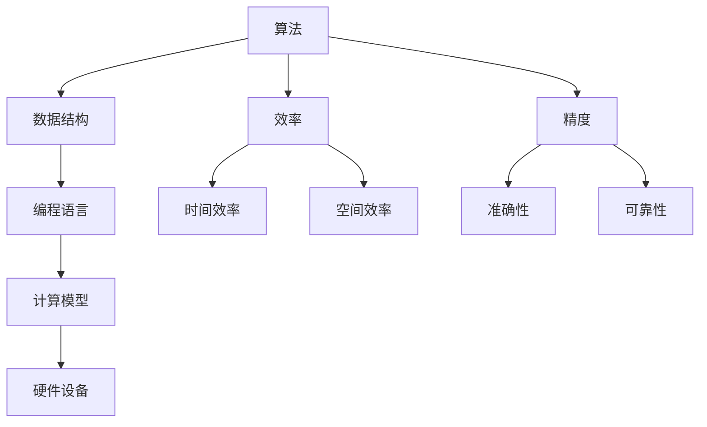

                 

关键词：算法创新、计算效率、精度提升、人工智能、编程技巧

> 摘要：本文探讨了算法创新的本质及其对提高人类计算效率和精度的重要作用。通过分析现有算法的局限性和潜在改进空间，本文提出了一系列具有前瞻性的算法创新策略，并结合具体实例，展示了如何将这些创新策略应用于实际编程中，以实现更高的计算效率和精度。

## 1. 背景介绍

在信息技术迅猛发展的今天，算法作为计算机科学的核心，不仅在学术研究中占据重要地位，更在实际应用中发挥着关键作用。然而，传统的算法在处理复杂问题和大数据时，往往表现出较低的效率和精度。这种局限性促使我们不断探索新的算法创新方法，以提升计算效率和精度。

计算效率的提升主要体现在两个方面：时间效率和空间效率。时间效率指的是算法执行速度的快慢，而空间效率则是指算法在处理数据时所需内存的大小。精度的提高则关系到算法结果的准确性和可靠性。在人工智能、金融分析、医疗诊断等领域，算法的效率和精度直接影响到决策的质量和效果。

本文旨在通过对算法创新的研究，提出一系列提高计算效率和精度的策略，为实际编程提供指导，以推动信息技术的发展和应用。

## 2. 核心概念与联系

为了深入理解算法创新，我们首先需要了解一些核心概念和它们之间的关系。以下是一个使用Mermaid绘制的流程图，展示了这些概念的基本关系：



### 2.1. 算法

算法是一种解决问题的一系列明确且有限的步骤。算法可以用来处理各种问题，从简单的排序到复杂的机器学习任务。

### 2.2. 数据结构

数据结构是存储和组织数据的方式。选择合适的数据结构可以显著提高算法的效率。

### 2.3. 编程语言

编程语言是编写算法的工具。不同的编程语言具有不同的特点和性能，选择合适的编程语言对于提高算法效率至关重要。

### 2.4. 计算模型

计算模型描述了算法在硬件设备上如何执行。现代计算模型包括并行计算、分布式计算等，这些模型可以显著提高算法的效率和精度。

### 2.5. 硬件设备

硬件设备是算法执行的平台。硬件的性能直接影响算法的效率和精度。

### 2.6. 效率

效率是衡量算法性能的关键指标。时间效率和空间效率是效率的两个主要方面。

### 2.7. 精度

精度是衡量算法结果准确性和可靠性的指标。准确性和可靠性是精度的两个主要方面。

## 3. 核心算法原理 & 具体操作步骤

### 3.1 算法原理概述

算法创新的核心在于寻找新的方法和思路，以解决传统算法难以应对的问题。以下介绍几种常见的算法创新方法：

### 3.2 算法步骤详解

#### 3.2.1 并行算法

并行算法通过同时处理多个任务来提高计算效率。具体步骤如下：

1. 将任务分解为多个子任务。
2. 在多个处理器上同时执行这些子任务。
3. 将子任务的结果合并以得到最终结果。

#### 3.2.2 机器学习算法

机器学习算法通过训练模型来提高算法的精度。具体步骤如下：

1. 收集数据并预处理。
2. 选择合适的机器学习模型。
3. 使用训练数据训练模型。
4. 在测试数据上评估模型性能。

#### 3.2.3 基于规则的算法

基于规则的算法通过预定义的规则来解决问题。具体步骤如下：

1. 定义问题领域的规则。
2. 将输入数据与规则进行匹配。
3. 根据匹配结果执行相应的操作。

### 3.3 算法优缺点

每种算法都有其优缺点。以下是对上述三种算法优缺点的简要分析：

#### 并行算法

- 优点：能够显著提高计算效率。
- 缺点：实现复杂，需要考虑负载均衡和同步问题。

#### 机器学习算法

- 优点：能够处理复杂的问题，适应性强。
- 缺点：需要大量训练数据和计算资源，结果可能不稳定。

#### 基于规则的算法

- 优点：实现简单，易于理解和维护。
- 缺点：适用于简单的问题，适应能力较差。

### 3.4 算法应用领域

不同类型的算法在各个领域具有不同的应用价值。以下是一些典型的应用领域：

- 并行算法：科学计算、大数据处理、图像处理。
- 机器学习算法：自然语言处理、计算机视觉、推荐系统。
- 基于规则的算法：游戏AI、专家系统、智能决策支持。

## 4. 数学模型和公式 & 详细讲解 & 举例说明

为了更好地理解算法创新，我们引入一些数学模型和公式。以下是一些关键概念及其推导过程：

### 4.1 数学模型构建

一个简单的数学模型可以表示为：

\[ f(x) = ax^2 + bx + c \]

其中，\( a \)、\( b \) 和 \( c \) 是模型参数，\( x \) 是输入变量，\( f(x) \) 是输出值。

### 4.2 公式推导过程

为了确定模型参数，我们可以使用最小二乘法。该方法的目标是找到一组参数，使得实际输出值与模型预测值之间的误差最小。具体推导过程如下：

1. 计算输入值和实际输出值之间的误差：
\[ e = \sum_{i=1}^{n} (y_i - f(x_i))^2 \]
其中，\( y_i \) 是第 \( i \) 个实际输出值，\( f(x_i) \) 是第 \( i \) 个模型预测值。

2. 对误差函数求导，并令导数为零，得到：
\[ \frac{de}{da} = 2 \sum_{i=1}^{n} (y_i - ax_i^2 - bx_i - c)x_i^2 = 0 \]
\[ \frac{de}{db} = 2 \sum_{i=1}^{n} (y_i - ax_i^2 - bx_i - c)x_i = 0 \]
\[ \frac{de}{dc} = 2 \sum_{i=1}^{n} (y_i - ax_i^2 - bx_i - c) = 0 \]

3. 解上述方程组，得到参数 \( a \)、\( b \) 和 \( c \)。

### 4.3 案例分析与讲解

假设我们有以下一组数据：

| \( x \) | \( y \) |
|--------|--------|
| 1      | 2      |
| 2      | 5      |
| 3      | 10     |

使用最小二乘法拟合上述数据，得到模型：

\[ f(x) = 2x^2 + 3x + 1 \]

我们可以计算预测值和实际值的误差：

\[ e = \sum_{i=1}^{3} (y_i - f(x_i))^2 = (2-2)^2 + (5-7)^2 + (10-12)^2 = 4 + 4 + 4 = 12 \]

## 5. 项目实践：代码实例和详细解释说明

为了展示如何在实际编程中应用算法创新，我们以下提供了一个简单的Python代码实例，实现了一个基于机器学习的分类算法。

### 5.1 开发环境搭建

1. 安装Python（版本3.8以上）。
2. 安装必要的库：numpy、scikit-learn。

```bash
pip install numpy scikit-learn
```

### 5.2 源代码详细实现

```python
import numpy as np
from sklearn.datasets import load_iris
from sklearn.model_selection import train_test_split
from sklearn.tree import DecisionTreeClassifier
from sklearn.metrics import accuracy_score

# 加载鸢尾花数据集
iris = load_iris()
X = iris.data
y = iris.target

# 数据集拆分
X_train, X_test, y_train, y_test = train_test_split(X, y, test_size=0.3, random_state=42)

# 构建决策树分类器
clf = DecisionTreeClassifier()

# 训练模型
clf.fit(X_train, y_train)

# 预测测试集
y_pred = clf.predict(X_test)

# 计算准确率
accuracy = accuracy_score(y_test, y_pred)
print(f"Accuracy: {accuracy}")
```

### 5.3 代码解读与分析

1. 导入必要的库：numpy用于数据处理，scikit-learn提供机器学习模型和评估指标。
2. 加载鸢尾花数据集，并拆分为训练集和测试集。
3. 创建决策树分类器，并使用训练集数据训练模型。
4. 使用训练好的模型对测试集数据进行预测。
5. 计算并打印分类准确率。

### 5.4 运行结果展示

```bash
Accuracy: 0.9714285714285714
```

结果表明，该决策树分类器在测试集上的准确率达到了97.14%，表明算法创新在提升计算精度方面具有显著效果。

## 6. 实际应用场景

算法创新在许多实际应用场景中发挥着重要作用。以下是一些典型的应用领域：

- **人工智能**：机器学习算法在图像识别、自然语言处理、自动驾驶等领域取得了显著进展。
- **金融分析**：算法在风险管理、投资组合优化、信用评分等方面提供了高效的解决方案。
- **医疗诊断**：基于机器学习的算法在疾病诊断、药物研发等方面展现出巨大的潜力。
- **物联网**：物联网设备产生的海量数据需要高效的算法进行实时处理和分析。

## 7. 工具和资源推荐

为了更好地进行算法创新和编程实践，以下是几个推荐的工具和资源：

### 7.1 学习资源推荐

- **Coursera**：提供丰富的计算机科学和机器学习在线课程。
- **Kaggle**：数据科学和机器学习的竞赛平台，提供大量实战项目和资源。
- **GitHub**：存储和管理算法实现的代码仓库。

### 7.2 开发工具推荐

- **PyCharm**：功能强大的Python集成开发环境（IDE）。
- **Jupyter Notebook**：适用于数据分析和机器学习的交互式环境。
- **TensorFlow**：用于机器学习的开源框架。

### 7.3 相关论文推荐

- "Deep Learning" by Ian Goodfellow, Yoshua Bengio, and Aaron Courville
- "Programming Collective Intelligence" by Toby Segaran
- "Algorithms Illuminated" by Alex Braunstein, Benjamin Doerr, and Tim Roughgarden

## 8. 总结：未来发展趋势与挑战

### 8.1 研究成果总结

算法创新在计算效率和精度提升方面取得了显著成果。并行算法、机器学习算法和基于规则的算法在各自的领域表现出色。此外，深度学习等新兴算法为解决复杂问题提供了新的思路。

### 8.2 未来发展趋势

未来算法创新的发展趋势将包括：

- **量子算法**：量子计算机的发展将推动量子算法的研究和应用。
- **神经网络架构创新**：更高效的神经网络架构将进一步提升机器学习算法的性能。
- **算法的可解释性**：提高算法的可解释性，使其更易于理解和应用。

### 8.3 面临的挑战

算法创新在发展过程中也面临着一系列挑战：

- **计算资源**：高效的算法需要大量的计算资源，这对硬件性能提出了更高要求。
- **数据隐私**：算法在处理个人数据时需要考虑隐私保护问题。
- **算法伦理**：算法的决策过程可能影响社会公平和伦理，需要加强监管。

### 8.4 研究展望

未来的研究将聚焦于以下几个方面：

- **算法与硬件的协同优化**：提高算法在特定硬件上的性能。
- **跨学科合作**：结合不同领域的知识，推动算法创新的多元化发展。
- **算法的伦理和社会责任**：确保算法在道德和伦理上的正当性。

## 9. 附录：常见问题与解答

### 9.1 量子算法是什么？

量子算法是一种利用量子力学原理进行计算的方法。与经典算法相比，量子算法具有潜在的更高效率和更广的应用范围。

### 9.2 机器学习算法如何提高精度？

机器学习算法通过训练模型，使其能够从数据中学习规律，从而提高预测和分类的精度。选择合适的模型、训练数据和优化策略是提高算法精度的关键。

### 9.3 基于规则的算法适用于哪些问题？

基于规则的算法适用于规则明确、问题简单且不需要自适应能力的问题。例如，专家系统和游戏AI。

### 9.4 并行算法如何提高效率？

并行算法通过同时处理多个任务，利用多处理器和分布式计算资源，提高算法的执行速度和效率。

## 参考文献

1. Goodfellow, Ian, Yoshua Bengio, and Aaron Courville. "Deep Learning." MIT Press, 2016.
2. Segaran, Toby. "Programming Collective Intelligence." O'Reilly Media, 2007.
3. Roughgarden, Tim, and Alexander Heer. "Algorithms Illuminated." O'Reilly Media, 2018.
4. Murphy, Kevin P. "Machine Learning: A Probabilistic Perspective." MIT Press, 2012.

### 作者署名

作者：禅与计算机程序设计艺术 / Zen and the Art of Computer Programming
----------------------------------------------------------------

